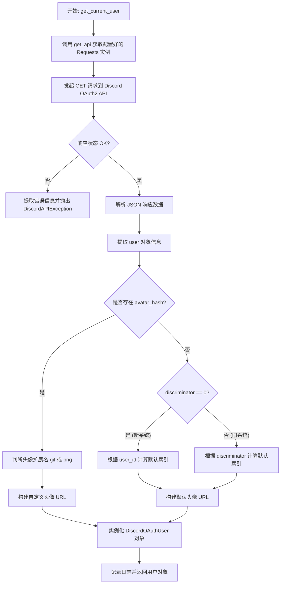
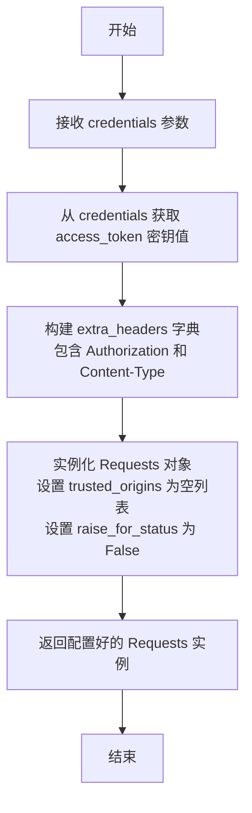
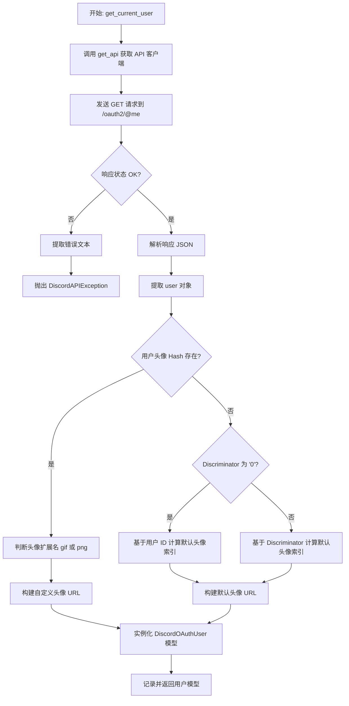
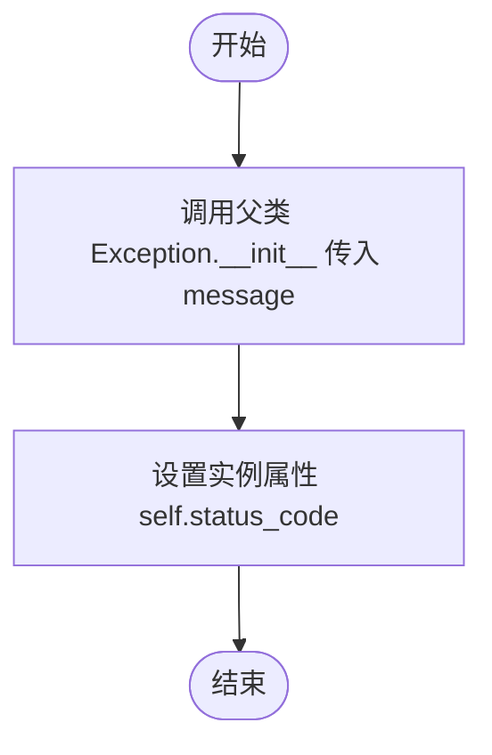

# `AutoGPT\autogpt_platform\backend\backend\blocks\discord\_api.py` 详细设计文档

该代码提供了一个用于与 Discord API 进行交互的辅助模块，主要功能是利用 OAuth2 凭证获取当前用户信息。它包括用于处理 API 错误的自定义异常类、基于 Pydantic 的用户数据模型（包含动态头像 URL 生成逻辑），以及用于发起认证请求和处理响应的辅助函数。

## 整体流程



## 类结构

```
Exception (内置)
└── DiscordAPIException
pydantic.BaseModel
└── DiscordOAuthUser
```

## 全局变量及字段


### `logger`
    
Logger instance for recording module events and debug information.

类型：`logging.Logger`
    


### `DiscordAPIException.status_code`
    
HTTP status code associated with the Discord API error.

类型：`int`
    


### `DiscordOAuthUser.user_id`
    
The unique identifier (snowflake) of the Discord user.

类型：`str`
    


### `DiscordOAuthUser.username`
    
The username of the Discord user.

类型：`str`
    


### `DiscordOAuthUser.avatar_url`
    
The URL pointing to the user's avatar image.

类型：`str`
    


### `DiscordOAuthUser.banner`
    
The hash of the user's banner image, if present.

类型：`Optional[str]`
    


### `DiscordOAuthUser.accent_color`
    
The user's banner color as an integer representation of a hex color code.

类型：`Optional[int]`
    
    

## 全局函数及方法


### `get_api`

该函数用于创建一个配置好的 Requests 实例，专门用于通过 OAuth2 凭证进行 Discord API 调用，它会自动处理授权头和内容类型。

参数：

-  `credentials`：`OAuth2Credentials`，包含访问令牌的 OAuth2 凭证对象。

返回值：`Requests`，配置了必要请求头（如 Authorization 和 Content-Type）的 Requests 实例，用于发起 API 请求。

#### 流程图



#### 带注释源码

```python
def get_api(credentials: OAuth2Credentials) -> Requests:
    """
    Create a Requests instance configured for Discord API calls with OAuth2 credentials.

    Args:
        credentials: The OAuth2 credentials containing the access token.

    Returns:
        A configured Requests instance for Discord API calls.
    """
    # 实例化并返回 Requests 对象
    return Requests(
        # 设置受信任的来源列表为空
        trusted_origins=[],
        # 设置额外的请求头
        extra_headers={
            # 添加 Bearer Token 授权头，使用 get_secret_value() 确保安全获取字符串
            "Authorization": f"Bearer {credentials.access_token.get_secret_value()}",
            # 设置内容类型为 JSON
            "Content-Type": "application/json",
        },
        # 设置为 False，表示不自动抛出 HTTP 状态码错误，由调用者处理
        raise_for_status=False,
    )
```


### `get_current_user`

通过 Discord OAuth2 API 获取当前用户的信息，处理头像 URL 的构建逻辑（包括自定义头像和默认头像），并返回封装好的用户数据模型。

参数：

-  `credentials`：`OAuth2Credentials`，包含访问令牌的 OAuth2 凭据对象，用于 API 认证。

返回值：`DiscordOAuthUser`，包含用户 ID、用户名、头像 URL、横幅和强调色等信息的用户数据模型。

#### 流程图



#### 带注释源码

```python
async def get_current_user(credentials: OAuth2Credentials) -> DiscordOAuthUser:
    """
    Fetch the current user's information using Discord OAuth2 API.

    Reference: https://discord.com/developers/docs/resources/user#get-current-user

    Args:
        credentials: The OAuth2 credentials.

    Returns:
        A model containing user data with avatar URL.

    Raises:
        DiscordAPIException: If the API request fails.
    """
    # 1. 初始化配置好的 API 请求客户端
    api = get_api(credentials)
    # 2. 向 Discord 的 OAuth2 端点发送 GET 请求以获取当前用户信息
    response = await api.get("https://discord.com/api/oauth2/@me")

    # 3. 检查响应状态，如果请求失败则抛出异常
    if not response.ok:
        error_text = response.text()
        raise DiscordAPIException(
            f"Failed to fetch user info: {response.status} - {error_text}",
            response.status,
        )

    # 4. 解析返回的 JSON 数据
    data = response.json()
    logger.info(f"Discord OAuth2 API Response: {data}")

    # 该端点返回的数据中，用户信息嵌套在 'user' 字段下
    user_info = data.get("user", {})
    logger.info(f"User info extracted: {user_info}")

    # 5. 构建头像 URL
    user_id = user_info.get("id")
    avatar_hash = user_info.get("avatar")
    
    if avatar_hash:
        # 如果有头像 Hash，说明用户使用了自定义头像
        # 如果 Hash 以 'a_' 开头，则是动图，否则为 png
        avatar_ext = "gif" if avatar_hash.startswith("a_") else "png"
        avatar_url = (
            f"https://cdn.discordapp.com/avatars/{user_id}/{avatar_hash}.{avatar_ext}"
        )
    else:
        # 如果没有头像 Hash，需要生成默认头像
        discriminator = user_info.get("discriminator", "0")
        if discriminator == "0":
            # 新用户名系统：根据用户 ID 计算默认头像索引
            default_avatar_index = (int(user_id) >> 22) % 6
        else:
            # 旧鉴别器 系统：根据鉴别器计算默认头像索引
            default_avatar_index = int(discriminator) % 5
        avatar_url = (
            f"https://cdn.discordapp.com/embed/avatars/{default_avatar_index}.png"
        )

    # 6. 构建并返回结果模型
    result = DiscordOAuthUser(
        user_id=user_id,
        username=user_info.get("username", ""),
        avatar_url=avatar_url,
        banner=user_info.get("banner"),
        accent_color=user_info.get("accent_color"),
    )

    logger.info(f"Returning user data: {result.model_dump()}")
    return result
```


### `DiscordAPIException.__init__`

`DiscordAPIException` 类的构造函数，用于初始化 Discord API 错误异常实例，接收错误消息和 HTTP 状态码。

参数：

-   `message`：`str`，描述错误详情的文本消息。
-   `status_code`：`int`，导致错误的 HTTP 状态码。

返回值：`None`，构造函数不返回任何值。

#### 流程图



#### 带注释源码

```python
def __init__(self, message: str, status_code: int):
    # 调用父类 Exception 的初始化方法，设置基本的错误消息
    super().__init__(message)
    # 将 HTTP 状态码保存到实例变量中，以便后续处理
    self.status_code = status_code
```


## 关键组件


### DiscordAPIException

用于处理 Discord API 错误的自定义异常类，包含状态码信息。

### DiscordOAuthUser

定义 Discord OAuth 用户响应结构的 Pydantic 数据模型。

### get_api

配置并返回带有 OAuth2 认证头的 HTTP 请求客户端的辅助函数。

### get_current_user

异步获取当前 Discord 用户信息并构建头像 URL 的核心逻辑函数。


## 问题及建议


### 已知问题

-   **硬编码 API 端点**：代码中直接写死了 Discord API 的 URL (`https://discord.com/api/oauth2/@me`)，导致无法灵活适配不同的运行环境（如开发、测试、生产环境），且不利于后续 API 版本迁移。
-   **日志记录不当**：使用 `logger.info` 记录了完整的 Discord API 响应体 (`data`)，这不仅可能暴露非必要的敏感信息，还会在高并发下产生大量的日志噪音，影响性能和日志检索。
-   **缺乏 API 响应模型校验**：通过字典手动获取（`data.get(...)`）解析 API 返回数据，缺乏强制类型检查。如果 API 返回结构变更或字段缺失，错误可能仅在运行时抛出，难以提前发现。
-   **潜在的类型转换风险**：在计算默认头像时，直接对 `discriminator` 进行 `int()` 转换。虽然 Discord 规范该字段为数字字符串，但在异常数据情况下可能抛出 `ValueError`。

### 优化建议

-   **配置化 URL 管理**：将 Discord API 的基础 URL 提取为模块级常量或通过配置文件注入，以便于环境切换和统一管理。
-   **关注点分离与逻辑解耦**：将构建 `avatar_url` 的复杂业务逻辑（包括区分 GIF/PNG、新旧用户名系统的默认头像计算）提取为独立的辅助函数或 `DiscordOAuthUser` 的类方法，提高 `get_current_user` 函数的可读性和可测试性。
-   **引入 Pydantic 响应模型**：定义 Discord API 原始响应对应的 Pydantic 模型，利用其自动解析和验证功能替代手动字典操作，增强代码的健壮性和类型提示的准确性。
-   **优化日志级别与内容**：将详细的 API 响应日志调整为 `DEBUG` 级别，生产环境通常仅记录关键操作结果或错误信息，避免敏感数据泄露。


## 其它


### 设计目标与约束

**设计目标：**
1. **封装性：** 封装 Discord API 的认证和交互细节，为上层业务逻辑提供简洁的接口（如 `get_current_user`），隐藏 HTTP 请求头构建、URL 拼接和 JSON 解析的复杂性。
2. **数据标准化：** 将 Discord API 返回的异构数据转换为结构化的 Pydantic 模型 (`DiscordOAuthUser`)，确保数据类型的强一致性和可验证性。
3. **鲁棒性：** 通过自定义异常 (`DiscordAPIException`) 明确区分网络/业务错误与系统级异常，便于上层调用方进行针对性的错误处理。

**设计约束：**
1. **异步约束：** `get_current_user` 函数设计为 `async`，必须配合异步事件循环使用，阻塞式调用会导致功能失效。
2. **API 依赖：** 强依赖 Discord API 的特定端点 (`https://discord.com/api/oauth2/@me`) 和返回格式，任何 Discord 官方的 API 变更（如 `discriminator` 字段的废弃）均需同步适配。
3. **库依赖：** 必须依赖项目内部的 `backend.util.request.Requests` 库进行网络请求，以及 `pydantic` 进行数据模型定义。

### 错误处理与异常设计

**异常策略：**
1. **自定义异常：** 定义了 `DiscordAPIException` 用于封装所有与 Discord API 交互失败的场景。
2. **状态码映射：** 异常对象中包含 `status_code` 字段，保留原始 HTTP 响应状态码，便于调用方根据状态码（如 401 Unauthorized, 429 Rate Limit）实施重试或跳转登录逻辑。
3. **非静默失败：** 在 `get_api` 中设置 `raise_for_status=False`，接管了底层的 HTTP 错误抛出逻辑，在 `get_current_user` 中通过显式检查 `if not response.ok` 来决定是否抛出异常，确保不满足 `ok` 条件时必须抛出 `DiscordAPIException`。
4. **日志记录：** 在捕获 API 错误和成功获取数据时，均通过 `logger` 记录关键信息，便于排查问题。

### 数据流与状态机

**数据流处理：**
1. **凭证输入：** 流程始于传入 `OAuth2Credentials` 对象，从中提取 `access_token`。
2. **请求构建：** 使用 Token 构建带有 `Authorization: Bearer` 头的请求上下文。
3. **外部交互：** 向 Discord API 发送 GET 请求，接收原始 JSON 响应。
4. **数据清洗与转换：**
   - 提取嵌套的 `user` 对象。
   - **头像 URL 计算逻辑：** 这是一个无状态的纯函数转换过程。根据 `avatar_hash` 是否存在，区分“自定义头像”和“默认头像”。
   - 对于默认头像，进一步根据 `discriminator`（新/旧用户名系统）计算具体的索引值。
5. **模型输出：** 将处理后的字段填充至 `DiscordOAuthUser` 模型并返回。

**状态机：**
本模块为无状态服务层设计，不维护长期会话状态。每次函数调用均独立完成从“凭证”到“用户信息”的转换。

### 外部依赖与接口契约

**外部组件依赖：**
1. **Discord API (Restful API):**
   - **端点：** `https://discord.com/api/oauth2/@me`
   - **契约：** 需要携带合法的 Bearer Token。成功时返回 HTTP 200 及 JSON 数据体；失败时返回 4xx/5xx 状态码及错误描述。返回数据结构必须包含 `user` 字段及其子字段（如 `id`, `username`, `avatar`, `discriminator`, `banner`, `accent_color`）。
2. **CDN 依赖：**
   - **域名：** `cdn.discordapp.com`
   - **契约：** 提供静态资源访问，根据特定的 URL 模式 (`/avatars/{user_id}/{hash}.{ext}` 或 `/embed/avatars/{index}.png`) 返回图片资源。

**内部模块依赖：**
1. **`backend.util.request.Requests`:**
   - **契约：** 必须支持异步方法 `.get()`，返回对象必须具有 `.ok` 属性、`.status` 属性、`.text()` 方法以及 `.json()` 方法。
2. **`backend.data.model.OAuth2Credentials`:**
   - **契约：** 必须包含 `access_token` 属性，该属性需支持 `.get_secret_value()` 方法（通常是 `pydantic.SecretStr`）以获取明文 Token。

### 安全性与机密性设计

1. **敏感信息保护：**
   - 使用 `credentials.access_token.get_secret_value()` 获取 Token，确保在日志或调试过程中 Token 不会被意外打印（Pydantic SecretStr 特性）。
   - 构建的 HTTP Header 中仅包含必要的认证信息。
2. **数据传输安全：**
   - 强制使用 `https://` 协议与 Discord API 及 CDN 进行通信，防止中间人攻击。
   - 请求头明确指定 `Content-Type: application/json` 以符合安全的内容协商策略。
3. **日志脱敏：**
   - 虽然代码中记录了响应的 JSON 和用户信息，但在生产环境中应确保配置日志级别或过滤器，避免将敏感的 `access_token` 或用户隐私数据直接输出到标准输出。

### 日志与监控

1. **关键动作记录：**
   - 记录 Discord API 的原始响应数据 (`Discord OAuth2 API Response`)。
   - 记录提取后的用户信息 (`User info extracted`)。
   - 记录最终返回的模型数据 (`Returning user data`)。
2. **日志级别使用：**
   - 使用 `logger.info` 记录正常的业务流程流转，用于追踪请求链路。
   - 建议在生产环境中，对于包含敏感信息的日志使用 `debug` 级别，或对敏感字段进行掩码处理，尽管当前代码使用了 `info`。

    