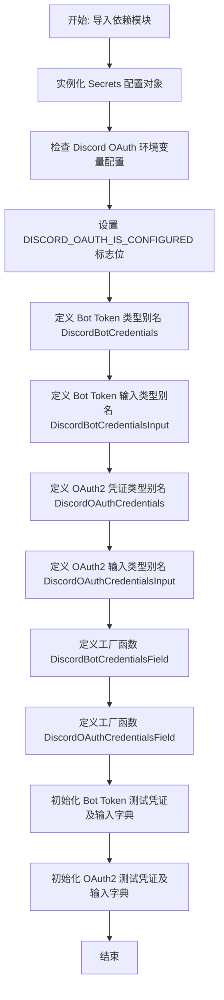
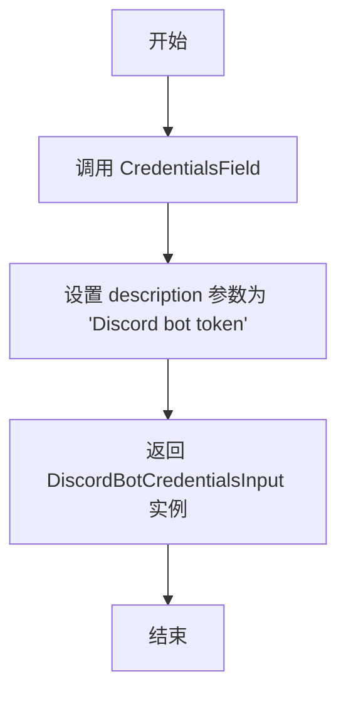

# `AutoGPT\autogpt_platform\backend\backend\blocks\discord\_auth.py` 详细设计文档

该代码定义了Discord集成所需的凭证类型、辅助函数及测试数据，支持Bot Token (API Key)和OAuth2两种认证模式，并包含系统OAuth配置状态检查及用于测试的模拟凭证对象。

## 整体流程



## 类结构

```
Discord Credentials Types (Type Aliases)
├── DiscordBotCredentials (APIKeyCredentials)
├── DiscordBotCredentialsInput (CredentialsMetaInput)
├── DiscordOAuthCredentials (OAuth2Credentials)
└── DiscordOAuthCredentialsInput (CredentialsMetaInput)
```

## 全局变量及字段


### `secrets`
    
应用程序配置和敏感信息的实例，用于加载和管理系统设置。

类型：`Secrets`
    


### `DISCORD_OAUTH_IS_CONFIGURED`
    
布尔值，指示 Discord OAuth 的客户端 ID 和密钥是否均已正确配置。

类型：`bool`
    


### `DiscordBotCredentials`
    
Discord Bot 令牌凭证的类型别名，对应 APIKeyCredentials 类。

类型：`Type[APIKeyCredentials]`
    


### `DiscordBotCredentialsInput`
    
Discord Bot 令牌凭证输入模型的类型别名，用于验证输入数据。

类型：`Type[CredentialsMetaInput]`
    


### `DiscordOAuthCredentials`
    
Discord OAuth2 凭证的类型别名，对应 OAuth2Credentials 类。

类型：`Type[OAuth2Credentials]`
    


### `DiscordOAuthCredentialsInput`
    
Discord OAuth2 凭证输入模型的类型别名，用于验证输入数据。

类型：`Type[CredentialsMetaInput]`
    


### `TEST_BOT_CREDENTIALS`
    
用于测试目的的 Discord Bot 令牌模拟凭证对象。

类型：`APIKeyCredentials`
    


### `TEST_BOT_CREDENTIALS_INPUT`
    
用于测试的 Discord Bot 令牌凭证输入数据的字典表示。

类型：`dict`
    


### `TEST_OAUTH_CREDENTIALS`
    
用于测试目的的 Discord OAuth2 模拟凭证对象。

类型：`OAuth2Credentials`
    


### `TEST_OAUTH_CREDENTIALS_INPUT`
    
用于测试的 Discord OAuth2 凭证输入数据的字典表示。

类型：`dict`
    


    

## 全局函数及方法


### `DiscordBotCredentialsField`

Creates a Discord bot token credentials field.

参数：

-  无

返回值：`DiscordBotCredentialsInput`，返回一个配置好的 Discord Bot Token 凭证输入字段实例，该实例通常用于 Pydantic 模型中定义需要 Discord Bot Token 的字段。

#### 流程图



#### 带注释源码

```python
def DiscordBotCredentialsField() -> DiscordBotCredentialsInput:
    """Creates a Discord bot token credentials field."""
    # 调用 CredentialsField 工厂函数创建一个凭证字段
    # description: 字段的文本描述，指明这是 Discord bot token
    return CredentialsField(description="Discord bot token")
```


### `DiscordOAuthCredentialsField`

创建一个 Discord OAuth2 凭证字段配置，用于定义 OAuth2 认证所需的权限范围。

参数：

-  `scopes`：`list[str]`，OAuth2 认证所需的额外权限范围列表。

返回值：`DiscordOAuthCredentialsInput`，返回一个配置好的 Discord OAuth2 凭证字段输入对象，包含描述信息和合并后的权限范围。

#### 流程图

```mermaid
flowchart TD
    A[开始: DiscordOAuthCredentialsField] --> B[接收参数 scopes: list[str]]
    B --> C[将 scopes 列表转换为集合]
    C --> D[使用并集操作合并基础范围 {\"identify\"}]
    D --> E[调用 CredentialsField 工厂函数]
    E --> F[传入描述信息和合并后的 required_scopes]
    F --> G[返回 DiscordOAuthCredentialsInput 实例]
    G --> H[结束]
```

#### 带注释源码

```python
def DiscordOAuthCredentialsField(scopes: list[str]) -> DiscordOAuthCredentialsInput:
    """Creates a Discord OAuth2 credentials field."""
    # 调用 CredentialsField 创建字段配置
    # 将传入的 scopes 转换为集合，并与基础范围 {"identify"} 进行合并
    # 确保生成的凭证字段总是包含获取基本用户信息 ("identify") 的权限
    return CredentialsField(
        description="Discord OAuth2 credentials",
        required_scopes=set(scopes) | {"identify"},  # Basic user info scope
    )
```


## 关键组件


### Discord Bot Token 凭据模块
定义了基于 API 密钥的 Discord Bot 认证相关的类型别名、输入模型及字段生成器，用于处理和验证机器人的访问令牌。

### Discord OAuth2 凭据模块
定义了基于 OAuth2 的 Discord 用户认证相关的类型别名、输入模型及字段生成器，包含对 OAuth 作用域的处理逻辑以及环境配置状态的检查。

### 测试模拟数据
提供了用于开发和测试目的的 Discord Bot 令牌和 OAuth2 凭据的模拟实例及其输入字典，确保在不依赖真实凭证的情况下进行功能验证。


## 问题及建议


### 已知问题

-   测试数据定义存在逻辑错误：`TEST_BOT_CREDENTIALS_INPUT` 和 `TEST_OAUTH_CREDENTIALS_INPUT` 字典中的 `title` 字段被错误地赋值为 `type` 属性（例如 "api_key"），而非源对象 `TEST_BOT_CREDENTIALS` 或 `TEST_OAUTH_CREDENTIALS` 中定义的可读标题（如 "Mock Discord API key"），这会导致数据模型不一致。
-   模块加载存在副作用与全局状态：代码在模块全局作用域直接实例化 `Secrets()` 并计算布尔值 `DISCORD_OAUTH_IS_CONFIGURED`。这引入了模块加载时的副作用，使得该模块依赖于特定的外部环境配置，且在不修改环境变量的情况下难以进行单元测试。
-   硬编码的测试标识符存在风险：测试凭证使用了硬编码的固定 UUID (`01234567-89ab-cdef-0123-456789abcdef`)。在并发测试或需要唯一性约束的场景下，这可能导致冲突，且硬编码的 Secret（即使是测试用）保留在源码中不符合最佳安全实践。

### 优化建议

-   修正测试数据构建逻辑：修正 `TEST_..._INPUT` 中的 `title` 赋值，确保引用源对象的 `title` 属性，保证测试输入数据与对象定义的一致性。
-   实现依赖注入或懒加载机制：将 `Secrets` 的初始化从模块级全局变量移除，改为在函数内部按需加载或通过参数传入。`DISCORD_OAUTH_IS_CONFIGURED` 可重构为函数 `is_discord_oauth_configured()`，以避免模块加载时的副作用。
-   提取魔法字符串为常量：将 `DiscordOAuthCredentialsField` 函数中的硬编码字符串 `"identify"` 提取为模块级常量（如 `DEFAULT_DISCORD_OAUTH_SCOPE`），便于统一管理和修改。
-   引入动态测试数据生成：使用测试框架（如 Pytest 的 fixture）或库（如 Faker）动态生成测试用的 ID 和 Token，替代硬编码常量，从而提高测试的隔离性和可维护性。
-   增强类型注解：对于 Python 3.10+ 环境，建议使用 `TypeAlias` 或 `Final` 来显式标记类型别名（如 `DiscordBotCredentials`），提升代码的可读性和静态分析能力。


## 其它


### 设计目标与约束

该模块旨在抽象并标准化 Discord Bot API 令牌及 OAuth2 凭证的定义，为上层应用提供统一的数据模型和字段生成工厂。
约束：
1. 必须严格复用 `backend.data.model` 中定义的基类（`APIKeyCredentials`、`OAuth2Credentials`）。
2. Discord OAuth2 凭证必须包含 "identify" 基础作用域，以确保获取基本的用户信息。
3. 测试数据（TEST_...）仅供开发与单元测试使用，严禁在生产环境中通过代码硬编码方式使用。

### 外部依赖与接口契约

外部依赖：
1. `pydantic`: 用于数据验证及敏感信息封装（`SecretStr`）。
2. `backend.data.model`: 提供凭证的基础架构模型（`APIKeyCredentials` 等）和 `CredentialsField`。
3. `backend.util.settings`: 用于访问环境变量配置（如 Discord Client ID 和 Secret）。
接口契约：
1. `DiscordBotCredentialsField()`: 返回一个 Pydantic 字段，该字段描述了 Discord Bot Token 的凭证输入要求，隐式契约为数据需符合 `api_key` 类型。
2. `DiscordOAuthCredentialsField(scopes)`: 接受作用域列表，契约保证返回的字段配置会将 "identify" 强制加入所需权限集合中，确保 API 调用合规。

### 数据流与配置状态

数据流：
1. **初始化阶段**: 系统从环境变量中读取 Discord 的 Client ID 和 Secret。
2. **状态判定**: 根据环境变量是否存在，设置 `DISCORD_OAUTH_IS_CONFIGURED` 布尔标志，决定 OAuth 功能是否可用。
3. **模型实例化**: 当需要定义输入 Schema 时，调用工厂函数（如 `DiscordBotCredentialsField`），生成符合 Pydantic 规范的字段定义。
4. **数据注入**: 在实际运行时，凭证数据被注入到这些字段中，通过 Pydantic 验证后实例化为具体的对象。
配置状态机：
*   **已配置 (Configured)**: `DISCORD_OAUTH_IS_CONFIGURED` 为 True，环境变量完备，OAuth 流程可运行。
*   **未配置 (Unconfigured)**: `DISCORD_OAUTH_IS_CONFIGURED` 为 False，缺少必要环境变量，OAuth 相关功能应被禁用或隐藏。Bot Token 功能不受此状态影响。

### 错误处理与异常设计

本模块主要依赖 Pydantic 的数据验证机制进行错误处理：
1. **数据验证错误**: 如果用户提供的凭证数据不符合 `APIKeyCredentials` 或 `OAuth2Credentials` 的模型定义（例如缺少 `api_key` 或 `access_token`），Pydantic 会在模型解析阶段抛出 `ValidationError`。
2. **环境缺失处理**: `Secrets` 类负责读取环境，若环境变量缺失，代码逻辑不会抛出异常，而是通过 `DISCORD_OAUTH_IS_CONFIGURED` 返回 `False` 实现优雅降级。
3. **权限作用域处理**: `DiscordOAuthCredentialsField` 通过代码逻辑 (`| {"identify"}`) 强制补全基础作用域，防止因权限不足导致的 API 调用失败。

### 安全性设计

1. **敏感数据掩码**: 使用 Pydantic 的 `SecretStr` 类型存储 `api_key` 和 `access_token`。该类型在字符串表示（如日志打印、调试输出）时会自动掩码，防止密钥泄露。
2. **最小权限原则**: OAuth2 凭证生成时强制要求声明所需作用域，并在代码中明确约定了 "identify" 的基础权限，避免授予过高的访问权限。
3. **配置隔离**: 敏感配置（Client ID 和 Secret）不直接硬编码在源代码中，而是通过 `backend.util.settings` 从运行环境动态加载，符合 12-Factor App 的配置管理原则。

    