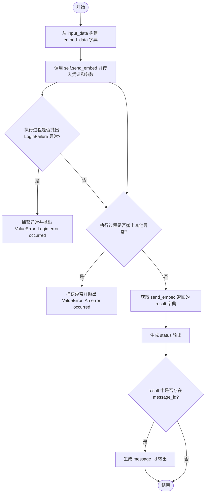

# `AutoGPT\autogpt_platform\backend\backend\blocks\discord\bot_blocks.py` 详细设计文档

该代码定义了一套与 Discord API 交互的异步功能模块（Blocks），用于在自动化流程中实现读取消息、发送消息、发送私聊、发送富文本、发送文件、回复消息、获取用户信息、获取频道信息以及创建频道线程等功能。

## 整体流程


## 类结构

```
ThreadArchiveDuration (Enum)
ReadDiscordMessagesBlock (Block)
├── Input (BlockSchemaInput)
└── Output (BlockSchemaOutput)
SendDiscordMessageBlock (Block)
├── Input (BlockSchemaInput)
└── Output (BlockSchemaOutput)
SendDiscordDMBlock (Block)
├── Input (BlockSchemaInput)
└── Output (BlockSchemaOutput)
SendDiscordEmbedBlock (Block)
├── Input (BlockSchemaInput)
└── Output (BlockSchemaOutput)
SendDiscordFileBlock (Block)
├── Input (BlockSchemaInput)
└── Output (BlockSchemaOutput)
ReplyToDiscordMessageBlock (Block)
├── Input (BlockSchemaInput)
└── Output (BlockSchemaOutput)
DiscordUserInfoBlock (Block)
├── Input (BlockSchemaInput)
└── Output (BlockSchemaOutput)
DiscordChannelInfoBlock (Block)
├── Input (BlockSchemaInput)
└── Output (BlockSchemaOutput)
CreateDiscordThreadBlock (Block)
├── Input (BlockSchemaInput)
└── Output (BlockSchemaOutput)
```

## 全局变量及字段


### `DiscordCredentials`
    
Backward compatibility alias for the DiscordBotCredentialsInput class.

类型：`Type[DiscordBotCredentialsInput]`
    


### `DiscordCredentialsField`
    
Backward compatibility alias for the DiscordBotCredentialsField function or object.

类型：`DiscordBotCredentialsField`
    


### `TEST_CREDENTIALS`
    
Backward compatibility alias for TEST_BOT_CREDENTIALS, used for testing authentication.

类型：`Any`
    


### `TEST_CREDENTIALS_INPUT`
    
Backward compatibility alias for TEST_BOT_CREDENTIALS_INPUT, used for providing test input data.

类型：`Any`
    


### `ReadDiscordMessagesBlock.output_data`
    
Stores the text content of the received Discord message, including any appended file content.

类型：`str | None`
    


### `ReadDiscordMessagesBlock.message_id`
    
Stores the unique identifier of the Discord message that was read.

类型：`str | None`
    


### `ReadDiscordMessagesBlock.channel_id`
    
Stores the unique identifier of the channel where the message was received.

类型：`str | None`
    


### `ReadDiscordMessagesBlock.channel_name`
    
Stores the name of the channel where the message was received.

类型：`str | None`
    


### `ReadDiscordMessagesBlock.user_id`
    
Stores the unique identifier of the user who sent the message.

类型：`str | None`
    


### `ReadDiscordMessagesBlock.username`
    
Stores the username of the user who sent the message.

类型：`str | None`
    
    

## 全局函数及方法


### `ThreadArchiveDuration.to_minutes`

该方法将 `ThreadArchiveDuration` 枚举实例的字符串值（如 "60"）转换为整型分钟数（如 60），以便符合 Discord API 对自动归档时长的参数要求。

参数：

- `self`：`ThreadArchiveDuration`，表示枚举类的实例，持有表示时间间隔的字符串值。

返回值：`int`，表示转换后的持续时间（分钟）。

#### 流程图


#### 带注释源码

```python
def to_minutes(self) -> int:
    """Convert the duration string to minutes for Discord API"""
    # 获取枚举成员的值（字符串类型）并将其转换为整数返回
    return int(self.value)
```


### `ReadDiscordMessagesBlock.run_bot`

该方法用于初始化并运行一个 Discord 机器人客户端，监听并接收单条消息。它将提取消息内容、元数据以及特定类型的文本附件（.txt, .py），并将这些数据存储在实例变量中，随后关闭客户端连接。

参数：

-   `token`：`SecretStr`，用于 Discord 机器人身份验证的令牌。

返回值：`None`，该方法没有显式的返回值，其主要作用是副作用，即更新类的实例变量（如 `output_data`, `message_id` 等）。

#### 流程图


#### 带注释源码

```python
    async def run_bot(self, token: SecretStr):
        # 配置 Discord Intents，启用消息内容读取权限
        intents = discord.Intents.default()
        intents.message_content = True

        # 使用配置的 Intents 初始化 Discord 客户端
        client = discord.Client(intents=intents)

        # 初始化或重置实例变量，用于存储接收到的消息数据
        self.output_data = None
        self.message_id = None
        self.channel_id = None
        self.channel_name = None
        self.user_id = None
        self.username = None

        @client.event
        async def on_ready():
            # 当客户端成功建立连接并准备就绪时触发
            print(f"Logged in as {client.user}")

        @client.event
        async def on_message(message):
            # 当收到消息时触发
            
            # 忽略机器人自己发送的消息，防止无限循环
            if message.author == client.user:
                return

            # 提取并存储消息的基本信息到实例变量
            self.output_data = message.content
            self.message_id = str(message.id)
            self.channel_id = str(message.channel.id)
            self.channel_name = message.channel.name
            self.user_id = str(message.author.id)
            self.username = message.author.name

            # 检查消息是否包含附件
            if message.attachments:
                # 仅处理第一个附件
                attachment = message.attachments[0]
                # 检查附件是否为文本文件 (.txt 或 .py)
                if attachment.filename.endswith((".txt", ".py")):
                    # 下载附件内容
                    response = await Requests().get(attachment.url)
                    file_content = response.text()
                    # 将附件信息追加到 output_data 中
                    self.output_data += f"\n\nFile from user: {attachment.filename}\nContent: {file_content}"

            # 处理完一条消息后，关闭客户端连接，结束 run_bot 方法的阻塞
            await client.close()

        # 启动 Discord 客户端，开始监听事件
        await client.start(token.get_secret_value())
```


### `ReadDiscordMessagesBlock.run`

执行读取 Discord 消息的主要入口逻辑。该方法作为异步生成器，委托给内部方法 `__run` 处理具体的业务逻辑（如连接机器人、接收消息、错误处理），并将产生的输出数据逐项返回。

参数：

-  `input_data`：`Input`，包含执行该块所需的输入数据结构（尽管在此特定的块实现中，关键配置主要通过 `credentials` 传递）。
-  `credentials`：`APIKeyCredentials`，用于 Discord API 身份验证的 API 密钥凭据对象。
-  `**kwargs`：`Any`，传递给方法的其他关键字参数。

返回值：`BlockOutput`，一个异步生成器，按顺序生成包含输出名称和对应值的元组（例如 `("message_content", "...")`）。

#### 流程图


#### 带注释源码

```python
    async def run(
        self, input_data: Input, *, credentials: APIKeyCredentials, **kwargs
    ) -> BlockOutput:
        # 异步遍历内部方法 __run 的结果
        # __run 封装了实际的 Discord 客户端连接、消息监听和数据处理逻辑
        async for output_name, output_value in self.__run(input_data, credentials):
            # 将处理好的输出项逐个 yield 出去，供调用方消费
            yield output_name, output_value
```


### `ReadDiscordMessagesBlock.__run`

该方法是 `ReadDiscordMessagesBlock` 的核心执行逻辑，负责协调读取 Discord 消息的过程。它通过调用 `run_bot` 方法启动 Discord 客户端并监听消息，处理执行结果（支持真实的实例变量更新或测试环境下的模拟字典返回），验证必要的消息数据（如内容、频道名、用户名）是否存在，并将这些数据作为异步生成器的输出进行 yield。同时，它还封装了错误处理机制，将 Discord 登录失败和其他异常转换为 ValueError。

参数：

-   `input_data`：`Input`，输入数据模式对象，包含执行块所需的配置信息（尽管在此方法中未直接使用，但符合签名规范）。
-   `credentials`：`APIKeyCredentials`，凭证对象，包含用于身份验证的 Discord Bot Token。

返回值：`BlockOutput`，异步生成器，按顺序生成包含消息内容、消息ID、频道ID、频道名、用户ID和用户名的元组。

#### 流程图


#### 带注释源码

```python
async def __run(
    self, input_data: Input, credentials: APIKeyCredentials
) -> BlockOutput:
    try:
        # 调用 run_bot 方法，传入 API Key 启动 Discord 客户端
        # 注意：run_bot 在实际运行中不返回值，而是修改 self 的属性（如 self.output_data）
        # 在测试环境下，该方法可能被 mock 并返回一个包含数据的字典
        result = await self.run_bot(credentials.api_key)

        # For testing purposes, use the mocked result
        # 如果返回结果是字典，说明是测试环境，直接从字典中提取数据
        if isinstance(result, dict):
            self.output_data = result.get("output_data")
            self.message_id = result.get("message_id")
            self.channel_id = result.get("channel_id")
            self.channel_name = result.get("channel_name")
            self.user_id = result.get("user_id")
            self.username = result.get("username")

        # 验证关键字段是否已成功接收
        # 如果消息内容、频道名或用户名为空，说明未成功获取消息，抛出异常
        if (
            self.output_data is None
            or self.channel_name is None
            or self.username is None
        ):
            raise ValueError("No message, channel name, or username received.")

        # 按照预定义的顺序 yield 输出数据
        yield "message_content", self.output_data
        yield "message_id", self.message_id
        yield "channel_id", self.channel_id
        yield "channel_name", self.channel_name
        yield "user_id", self.user_id
        yield "username", self.username

    # 捕获 Discord 库抛出的登录失败异常（如 Token 无效）
    except discord.errors.LoginFailure as login_err:
        raise ValueError(f"Login error occurred: {login_err}")
    # 捕获其他未预期的异常，防止程序崩溃并返回错误信息
    except Exception as e:
        raise ValueError(f"An error occurred: {e}")
```


### `SendDiscordMessageBlock.send_message`

该方法负责通过 Discord Bot 令牌向指定的 Discord 频道发送文本消息。它会处理频道解析（支持 ID 或频道名）、服务器筛选、消息分块（处理 Discord 2000 字符限制）以及消息发送后的状态返回。

参数：

-  `token`：`str`，Discord Bot 的令牌，用于身份验证和连接。
-  `channel_name`：`str`，目标频道的标识符，可以是频道 ID（纯数字）或频道名称。
-  `server_name`：`str | None`，服务器名称，仅在通过频道名称查找时需要，用于区分同名频道。
-  `message_content`：`str`，要发送的消息内容。

返回值：`dict`，包含操作结果的字典，包括状态（`status`）、消息 ID（`message_id`）和频道 ID（`channel_id`）。

#### 流程图


#### 带注释源码

```python
    async def send_message(
        self,
        token: str,
        channel_name: str,
        server_name: str | None,
        message_content: str,
    ) -> dict:
        # 设置必要的 Intents，guilds 权限是获取服务器和频道信息所必需的
        intents = discord.Intents.default()
        intents.guilds = True  # Required for fetching guild/channel information
        client = discord.Client(intents=intents)

        result = {}

        @client.event
        async def on_ready():
            print(f"Logged in as {client.user}")
            channel = None

            # 优先尝试将 channel_name 解析为频道 ID
            try:
                channel_id = int(channel_name)
                channel = client.get_channel(channel_id)
            except ValueError:
                # 解析失败，说明可能是频道名称，稍后进行名称查找
                pass

            # 如果通过 ID 未找到频道（或者输入本身不是 ID），则通过名称查找
            if not channel:
                for guild in client.guilds:
                    # 如果指定了 server_name，则必须匹配服务器名称
                    if server_name and guild.name != server_name:
                        continue
                    for ch in guild.text_channels:
                        if ch.name == channel_name:
                            channel = ch
                            break
                    if channel:
                        break

            # 如果最终没有找到频道，返回错误状态并关闭客户端
            if not channel:
                result["status"] = f"Channel not found: {channel_name}"
                await client.close()
                return

            # 类型检查 - 确保该频道对象拥有 send 方法（即为可发送消息的文本频道）
            if not hasattr(channel, "send"):
                result["status"] = (
                    f"Channel {channel_name} cannot receive messages (not a text channel)"
                )
                await client.close()
                return

            # 如果消息内容超过 Discord 限制（2000字符），则进行分块处理
            chunks = self.chunk_message(message_content)
            last_message = None
            for chunk in chunks:
                last_message = await channel.send(chunk)  # type: ignore
            
            # 记录成功状态及最后一条消息的 ID
            result["status"] = "Message sent"
            result["message_id"] = str(last_message.id) if last_message else ""
            result["channel_id"] = str(channel.id)
            
            # 操作完成后关闭客户端连接
            await client.close()

        # 启动 Discord 客户端，这将阻塞直到 on_ready 中调用 client.close()
        await client.start(token)
        return result
```


### `SendDiscordMessageBlock.chunk_message`

该方法用于将长文本消息切分为多个不超过指定长度限制的字符串列表，以符合Discord消息发送的字符长度限制（默认为2000字符）。

参数：

- `message`：`str`，需要被切分的原始消息内容。
- `limit`：`int`，每个消息块允许的最大字符长度，默认为2000。

返回值：`list`，包含切分后的消息子字符串的列表。

#### 流程图

```mermaid
graph TD
    A[开始: 输入 message 和 limit] --> B[获取 message 的长度]
    B --> C{遍历索引 i 是否小于长度?}
    C -- 是 --> D[截取切片: message[i : i + limit]]
    D --> E[将切片添加到结果列表]
    E --> F[索引 i 增加 limit]
    F --> C
    C -- 否 --> G[返回切分后的列表]
    G --> H[结束]
```

#### 带注释源码

```python
def chunk_message(self, message: str, limit: int = 2000) -> list:
    """Splits a message into chunks not exceeding the Discord limit."""
    # 使用列表推导式遍历字符串
    # range(0, len(message), limit) 生成从0开始，步长为limit的索引序列
    # message[i : i + limit] 对字符串进行切片，获取当前索引到索引+limit之间的子字符串
    return [message[i : i + limit] for i in range(0, len(message), limit)]
```


### `SendDiscordMessageBlock.run`

该方法负责执行向Discord频道发送消息的核心逻辑。它接收输入数据和凭据，调用底层`send_message`方法处理与Discord API的交互，并处理可能的模拟测试结果，最终将操作状态、消息ID和频道ID作为生成器输出。

参数：

-   `input_data`：`SendDiscordMessageBlock.Input`，包含消息内容、频道名称/ID以及服务器名称等输入信息的对象。
-   `credentials`：`APIKeyCredentials`，包含用于身份验证的Discord Bot令牌的凭据对象。
-   `**kwargs`：`Any`，扩展用的额外关键字参数。

返回值：`BlockOutput`，一个异步生成器，逐步产生包含操作状态、消息ID和频道ID的元组。

#### 流程图


#### 带注释源码

```python
    async def run(
        self, input_data: Input, *, credentials: APIKeyCredentials, **kwargs
    ) -> BlockOutput:
        try:
            # 调用内部方法发送消息，传入解密后的Token和输入数据
            result = await self.send_message(
                token=credentials.api_key.get_secret_value(),
                channel_name=input_data.channel_name,
                server_name=input_data.server_name,
                message_content=input_data.message_content,
            )

            # 兼容性处理：如果是测试环境下的模拟结果（字符串），则转换为字典格式
            if isinstance(result, str):
                result = {"status": result}

            # 输出操作状态，如果获取不到则默认为 "Unknown error"
            yield "status", result.get("status", "Unknown error")
            
            # 如果结果中包含消息ID，则输出
            if "message_id" in result:
                yield "message_id", result["message_id"]
            
            # 如果结果中包含频道ID，则输出
            if "channel_id" in result:
                yield "channel_id", result["channel_id"]

        # 捕获Discord登录失败异常，转换为ValueError抛出
        except discord.errors.LoginFailure as login_err:
            raise ValueError(f"Login error occurred: {login_err}")
        # 捕获其他通用异常，转换为ValueError抛出
        except Exception as e:
            raise ValueError(f"An error occurred: {e}")
```


### `SendDiscordDMBlock.send_dm`

使用提供的 Bot Token 向指定 Discord 用户发送直接消息（DM）。该方法通过初始化 Discord 客户端，在客户端就绪后获取目标用户对象并发送消息，同时处理了各种可能的异常情况（如权限不足、用户不存在等），最后返回包含状态和消息 ID 的字典。

参数：

- `token`：`str`，用于身份验证的 Discord Bot 令牌。
- `user_id`：`str`，接收消息的 Discord 用户 ID。
- `message_content`：`str`，要发送的直接消息内容。

返回值：`dict`，包含操作状态（'status'）和发送消息的 ID（'message_id'）的字典。如果发送成功，状态为成功描述且包含 ID；如果失败，状态为相应的错误信息。

#### 流程图


#### 带注释源码

```python
    async def send_dm(self, token: str, user_id: str, message_content: str) -> dict:
        # 配置 Discord 客户端意图，启用直接消息相关权限
        intents = discord.Intents.default()
        intents.dm_messages = True
        client = discord.Client(intents=intents)

        result = {}

        @client.event
        async def on_ready():
            try:
                # 根据用户 ID 获取用户对象
                user = await client.fetch_user(int(user_id))
                
                # 向用户发送直接消息
                message = await user.send(message_content)
                
                # 记录成功状态和消息 ID
                result["status"] = "DM sent successfully"
                result["message_id"] = str(message.id)
            except discord.errors.Forbidden:
                # 处理权限异常（如用户禁止私聊或屏蔽了机器人）
                result["status"] = (
                    "Cannot send DM - user has DMs disabled or bot is blocked"
                )
            except discord.errors.NotFound:
                # 处理用户未找到异常
                result["status"] = f"User with ID {user_id} not found"
            except ValueError:
                # 处理 ID 格式错误（如无法转换为整数）
                result["status"] = f"Invalid user ID format: {user_id}"
            except Exception as e:
                # 捕获其他未知异常
                result["status"] = f"Error sending DM: {str(e)}"
            finally:
                # 确保在操作完成后关闭客户端连接，释放资源
                await client.close()

        # 使用 token 启动 Discord 客户端
        await client.start(token)
        return result
```


### `SendDiscordDMBlock.run`

执行发送 Discord 私信的核心逻辑，通过提供的凭据和输入数据调用底层发送方法，并处理返回结果及异常。

参数：

-   `input_data`：`SendDiscordDMBlock.Input`，包含目标用户ID、消息内容及凭据配置的输入数据对象。
-   `credentials`：`APIKeyCredentials`，用于身份验证的 API 密钥对象，包含 Discord Bot Token。
-   `**kwargs`：`typing.Any`，扩展关键字参数，当前实现中未使用。

返回值：`BlockOutput`，一个异步生成器，产出包含操作状态和消息ID的元组。

#### 流程图


#### 带注释源码

```python
    async def run(
        self, input_data: Input, *, credentials: APIKeyCredentials, **kwargs
    ) -> BlockOutput:
        try:
            # 调用内部方法 send_dm 执行实际的私信发送操作
            # 从凭据对象中提取敏感的 API token
            # 从输入数据中提取目标用户ID和消息内容
            result = await self.send_dm(
                token=credentials.api_key.get_secret_value(),
                user_id=input_data.user_id,
                message_content=input_data.message_content,
            )

            # 产出操作状态，如果 result 中没有 status，默认为 "Unknown error"
            yield "status", result.get("status", "Unknown error")
            
            # 如果结果中包含 message_id，则将其产出
            if "message_id" in result:
                yield "message_id", result["message_id"]

        # 捕获 Discord 登录失败异常（如 Token 无效）
        except discord.errors.LoginFailure as login_err:
            raise ValueError(f"Login error occurred: {login_err}")
        # 捕获其他所有异常并包装为 ValueError 抛出
        except Exception as e:
            raise ValueError(f"An error occurred: {e}")
```


### `SendDiscordEmbedBlock.send_embed`

该函数负责通过 Discord Bot 令牌向指定的 Discord 频道发送富文本 Embed 消息。它会根据频道 ID 或频道名称（并结合服务器名称进行筛选）定位目标频道，构建包含标题、描述、颜色、缩略图、图片、作者、页脚及字段的 Embed 对象，并发送该消息，最后返回操作状态和消息 ID。

参数：

-   `token`：`str`，Discord Bot 的访问令牌。
-   `channel_identifier`：`str`，目标频道的 ID 或名称。
-   `server_name`：`str | None`，服务器名称，仅在使用频道名称查找时需要。
-   `embed_data`：`dict`，包含 Embed 内容详细信息的字典，如 title、description、color、fields 等。

返回值：`dict`，包含操作状态（如 "Embed sent successfully"）和发送的消息 ID。

#### 流程图


#### 带注释源码

```python
    async def send_embed(
        self,
        token: str,
        channel_identifier: str,
        server_name: str | None,
        embed_data: dict,
    ) -> dict:
        # 设置必要的 intents，此处需要 guilds 权限以获取频道列表
        intents = discord.Intents.default()
        intents.guilds = True
        # 初始化 Discord 客户端
        client = discord.Client(intents=intents)

        # 初始化结果字典
        result = {}

        @client.event
        async def on_ready():
            # 当 Bot 准备就绪时触发
            channel = None

            # 尝试将 channel_identifier 解析为整数（即频道 ID）
            try:
                channel_id = int(channel_identifier)
                channel = client.get_channel(channel_id)
            except ValueError:
                # 如果解析失败，说明传入的是频道名称，需要遍历查找
                for guild in client.guilds:
                    # 如果指定了 server_name，则跳过不匹配的服务器
                    if server_name and guild.name != server_name:
                        continue
                    for ch in guild.text_channels:
                        # 匹配频道名称
                        if ch.name == channel_identifier:
                            channel = ch
                            break
                    if channel:
                        break

            # 如果最终没有找到频道
            if not channel:
                result["status"] = f"Channel not found: {channel_identifier}"
                await client.close()
                return

            # 构建 Discord Embed 对象
            embed = discord.Embed(
                title=embed_data.get("title") or None,
                description=embed_data.get("description") or None,
                color=embed_data.get("color", 0x5865F2),  # 默认颜色为 Discord Blurple
            )

            # 设置缩略图
            if embed_data.get("thumbnail_url"):
                embed.set_thumbnail(url=embed_data["thumbnail_url"])

            # 设置主图
            if embed_data.get("image_url"):
                embed.set_image(url=embed_data["image_url"])

            # 设置作者
            if embed_data.get("author_name"):
                embed.set_author(name=embed_data["author_name"])

            # 设置页脚
            if embed_data.get("footer_text"):
                embed.set_footer(text=embed_data["footer_text"])

            # 添加自定义字段
            for field in embed_data.get("fields", []):
                if isinstance(field, dict) and "name" in field and "value" in field:
                    embed.add_field(
                        name=field["name"],
                        value=field["value"],
                        inline=field.get("inline", True),
                    )

            try:
                # 类型检查：确保频道可以发送消息（是文本频道）
                if not hasattr(channel, "send"):
                    result["status"] = (
                        f"Channel {channel_identifier} cannot receive messages (not a text channel)"
                    )
                    await client.close()
                    return

                # 发送 Embed 消息
                message = await channel.send(embed=embed)  # type: ignore
                result["status"] = "Embed sent successfully"
                result["message_id"] = str(message.id)
            except Exception as e:
                # 捕获发送过程中的异常
                result["status"] = f"Error sending embed: {str(e)}"
            finally:
                # 确保关闭客户端连接
                await client.close()

        # 启动客户端
        await client.start(token)
        return result
```


### `SendDiscordEmbedBlock.run`

该方法是 `SendDiscordEmbedBlock` 的核心执行入口，负责协调整个发送 Discord 嵌入消息的流程。它从输入数据中提取嵌入内容的各个属性（如标题、描述、颜色、字段等），构建请求数据字典，并调用异步辅助方法与 Discord API 进行交互。该方法还包含异常处理逻辑，捕获登录失败或其他错误，并通过异步生成器返回操作状态和发送消息的 ID。

参数：

- `input_data`: `SendDiscordEmbedBlock.Input`，包含发送嵌入消息所需的输入配置，例如频道标识符、服务器名称、标题、描述、颜色、缩略图 URL 以及自定义字段等。
- `credentials`: `APIKeyCredentials`，用于身份验证的凭证对象，内含 Discord Bot 的 API Key。
- `**kwargs`: `Any`，其他可选的关键字参数，由执行上下文传入。

返回值：`BlockOutput`，一个异步生成器，产生包含操作状态（"status"）和已发送消息的 ID（"message_id"）的元组。

#### 流程图



#### 带注释源码

```python
    async def run(
        self, input_data: Input, *, credentials: APIKeyCredentials, **kwargs
    ) -> BlockOutput:
        try:
            # 1. 构建嵌入消息的数据字典，收集所有输入字段
            embed_data = {
                "title": input_data.title,
                "description": input_data.description,
                "color": input_data.color,
                "thumbnail_url": input_data.thumbnail_url,
                "image_url": input_data.image_url,
                "author_name": input_data.author_name,
                "footer_text": input_data.footer_text,
                "fields": input_data.fields,
            }

            # 2. 调用内部辅助方法 send_embed 执行实际的发送逻辑
            # 从凭证中获取 API Key 的明文值，并传入频道标识符和服务器名
            result = await self.send_embed(
                token=credentials.api_key.get_secret_value(),
                channel_identifier=input_data.channel_identifier,
                server_name=input_data.server_name or None,
                embed_data=embed_data,
            )

            # 3. 生成操作状态输出
            yield "status", result.get("status", "Unknown error")
            
            # 4. 如果结果中包含 message_id，则将其作为输出
            if "message_id" in result:
                yield "message_id", result["message_id"]

        # 5. 异常处理：捕获 Discord 登录失败并转换为 ValueError
        except discord.errors.LoginFailure as login_err:
            raise ValueError(f"Login error occurred: {login_err}")
        
        # 6. 异常处理：捕获其他所有异常并转换为 ValueError
        except Exception as e:
            raise ValueError(f"An error occurred: {e}")
```


### `SendDiscordFileBlock.send_file`

该方法是 `SendDiscordFileBlock` 的核心异步方法，负责通过 Discord Bot 将文件发送到指定的 Discord 频道。它支持通过 Data URI、URL 或本地路径（处理后）获取文件内容，并能处理频道 ID 和名称解析、文件名检测以及消息附带文本。

参数：

-  `token`：`str`，Discord Bot 的认证令牌，用于登录和操作。
-  `channel_identifier`：`str`，目标频道的标识符，可以是频道 ID（整数形式的字符串）或频道名称。
-  `server_name`：`str | None`，服务器名称，仅在 `channel_identifier` 为频道名称时用于辅助查找，以区分同名频道。
-  `file`：`MediaFileType`，要发送的文件源，支持 Data URI (base64)、HTTP(S) URL 或本地存储路径。
-  `filename`：`str`，发送文件时使用的文件名。如果为空，系统将尝试自动检测。
-  `message_content`：`str`，随文件一起发送的可选文本消息。
-  `execution_context`：`ExecutionContext`，执行上下文对象，用于处理本地文件存储的中间操作。

返回值：`dict`，包含操作状态和消息 ID 的字典。例如：`{"status": "File sent successfully", "message_id": "123..."}` 或 `{"status": "Error: ..."}`。

#### 流程图


#### 带注释源码

```python
    async def send_file(
        self,
        token: str,
        channel_identifier: str,
        server_name: str | None,
        file: MediaFileType,
        filename: str,
        message_content: str,
        execution_context: ExecutionContext,
    ) -> dict:
        # 设置 Discord 客户端所需的基本权限
        intents = discord.Intents.default()
        intents.guilds = True  # 需要获取服务器和频道信息
        client = discord.Client(intents=intents)

        result = {}

        @client.event
        async def on_ready():
            channel = None

            # 尝试将频道标识符解析为频道 ID
            try:
                channel_id = int(channel_identifier)
                channel = client.get_channel(channel_id)
            except ValueError:
                # 如果解析失败（不是纯数字），则按名称查找频道
                for guild in client.guilds:
                    # 如果指定了服务器名称，则进行匹配过滤
                    if server_name and guild.name != server_name:
                        continue
                    for ch in guild.text_channels:
                        if ch.name == channel_identifier:
                            channel = ch
                            break
                    if channel:
                        break

            # 如果最终没有找到频道，返回错误
            if not channel:
                result["status"] = f"Channel not found: {channel_identifier}"
                await client.close()
                return

            try:
                # 初始化文件处理变量
                file_bytes = None
                detected_filename = filename

                # 处理 Data URI (base64) 格式的文件
                if file.startswith("data:"):
                    header, encoded = file.split(",", 1)
                    file_bytes = base64.b64decode(encoded)

                    # 如果未提供文件名，尝试从 MIME 类型推断扩展名
                    if not filename and ";" in header:
                        mime_match = header.split(":")[1].split(";")[0]
                        ext = mimetypes.guess_extension(mime_match) or ".bin"
                        detected_filename = f"file{ext}"

                # 处理 HTTP/URL 格式的文件
                elif file.startswith(("http://", "https://")):
                    # 下载文件内容
                    response = await Requests().get(file)
                    file_bytes = response.content

                    # 如果未提供文件名，尝试从 URL 路径中提取
                    if not filename:
                        from urllib.parse import urlparse

                        path = urlparse(file).path
                        detected_filename = Path(path).name or "download"
                else:
                    # 处理本地文件路径（通常是上一个 Block 的输出路径）
                    # 使用 store_media_file 工具读取文件并转换为 Data URI 格式的内容
                    stored_file = await store_media_file(
                        file=file,
                        execution_context=execution_context,
                        return_format="for_external_api",
                    )
                    # 解析 base64 内容
                    header, encoded = stored_file.split(",", 1)
                    file_bytes = base64.b64decode(encoded)

                    if not filename:
                        detected_filename = Path(file).name or "file"

                # 检查是否成功读取文件内容
                if not file_bytes:
                    result["status"] = "Error: Could not read file content"
                    await client.close()
                    return

                # 创建 Discord.py 的 File 对象，使用 BytesIO 包装二进制数据
                discord_file = discord.File(
                    io.BytesIO(file_bytes), filename=detected_filename or "file"
                )

                # 检查频道对象是否具备发送消息的能力
                if not hasattr(channel, "send"):
                    result["status"] = (
                        f"Channel {channel_identifier} cannot receive messages (not a text channel)"
                    )
                    await client.close()
                    return

                # 发送文件和可选的消息内容
                message = await channel.send(  # type: ignore
                    content=message_content if message_content else None,
                    file=discord_file,
                )
                result["status"] = "File sent successfully"
                result["message_id"] = str(message.id)
            except Exception as e:
                # 捕获并发送过程中的其他异常
                result["status"] = f"Error sending file: {str(e)}"
            finally:
                # 确保客户端连接被关闭
                await client.close()

        # 启动 Discord 客户端，触发 on_ready
        await client.start(token)
        return result
```


### `SendDiscordFileBlock.run`

该方法是 `SendDiscordFileBlock` 的核心执行入口，负责协调将文件发送到 Discord 频道的整个过程。它接收输入数据和凭据，调用内部逻辑执行文件上传，并处理可能的异常，最终返回操作状态和消息 ID。

参数：

- `input_data`：`SendDiscordFileBlock.Input`，包含发送文件所需的所有输入信息，如目标频道标识符、服务器名称、文件数据、文件名及附带的消息内容。
- `credentials`：`APIKeyCredentials`，Discord Bot 的 API 凭据对象，用于身份验证。
- `execution_context`：`ExecutionContext`，执行上下文，用于文件存储和处理。
- `**kwargs`：`typing.Any`，额外的关键字参数，用于扩展或兼容性。

返回值：`BlockOutput`，一个异步生成器，产出包含操作状态（如 "File sent successfully"）和发送消息 ID 的键值对。

#### 流程图


#### 带注释源码

```python
async def run(
    self,
    input_data: Input,
    *,
    credentials: APIKeyCredentials,
    execution_context: ExecutionContext,
    **kwargs,
) -> BlockOutput:
    try:
        # 调用内部方法 send_file，传入从凭据中提取的 token 和输入数据的各个字段
        result = await self.send_file(
            token=credentials.api_key.get_secret_value(),
            channel_identifier=input_data.channel_identifier,
            server_name=input_data.server_name or None,
            file=input_data.file,
            filename=input_data.filename,
            message_content=input_data.message_content,
            execution_context=execution_context,
        )

        # 生成 "status" 字段，如果结果中不存在 status，默认返回 "Unknown error"
        yield "status", result.get("status", "Unknown error")
        
        # 如果结果中包含 "message_id"，说明发送成功，生成该 ID
        if "message_id" in result:
            yield "message_id", result["message_id"]

    # 捕获 Discord 登录失败异常（如 Token 无效）
    except discord.errors.LoginFailure as login_err:
        raise ValueError(f"Login error occurred: {login_err}")
    
    # 捕获其他所有未预期的异常
    except Exception as e:
        raise ValueError(f"An error occurred: {e}")
```


### `ReplyToDiscordMessageBlock.send_reply`

该方法通过 Discord Bot 客户端，根据提供的频道 ID 和消息 ID 定位到特定消息，并发送回复内容。它支持在回复中提及原消息作者，并返回操作状态及新回复消息的 ID。

参数：

-  `token`：`str`，用于身份验证的 Discord Bot 令牌。
-  `channel_id`：`str`，目标消息所在的频道 ID。
-  `message_id`：`str`，需要回复的目标消息 ID。
-  `reply_content`：`str`，回复消息的具体文本内容。
-  `mention_author`：`bool`，是否在回复中提及原消息作者。

返回值：`dict`，包含操作状态（`status`）和发送的回复消息 ID（`reply_id`）的字典。

#### 流程图


#### 带注释源码

```python
    async def send_reply(
        self,
        token: str,
        channel_id: str,
        message_id: str,
        reply_content: str,
        mention_author: bool,
    ) -> dict:
        # 初始化 Discord Intents，启用公会和消息内容权限
        intents = discord.Intents.default()
        intents.guilds = True
        intents.message_content = True
        client = discord.Client(intents=intents)

        result = {}

        @client.event
        async def on_ready():
            try:
                # 首先尝试从客户端缓存中获取频道
                channel = client.get_channel(int(channel_id))
                if not channel:
                    # 缓存中没有，则通过 API 获取
                    channel = await client.fetch_channel(int(channel_id))

                if not channel:
                    result["status"] = f"Channel with ID {channel_id} not found"
                    await client.close()
                    return

                # 类型检查：确保频道是可以获取消息的文本频道
                if not hasattr(channel, "fetch_message"):
                    result["status"] = (
                        f"Channel {channel_id} cannot fetch messages (not a text channel)"
                    )
                    await client.close()
                    return

                # 获取需要回复的目标消息
                try:
                    message = await channel.fetch_message(int(message_id))  # type: ignore
                except discord.errors.NotFound:
                    result["status"] = f"Message with ID {message_id} not found"
                    await client.close()
                    return

                # 发送回复
                reply = await message.reply(
                    content=reply_content, mention_author=mention_author
                )
                result["status"] = "Reply sent successfully"
                result["reply_id"] = str(reply.id)

            except ValueError as e:
                result["status"] = f"Invalid ID format: {str(e)}"
            except Exception as e:
                result["status"] = f"Error sending reply: {str(e)}"
            finally:
                # 确保客户端连接被关闭
                await client.close()

        # 启动客户端，触发 on_ready 事件
        await client.start(token)
        return result
```


### `ReplyToDiscordMessageBlock.run`

执行将回复发送到特定 Discord 消息的核心逻辑，处理输入参数验证、凭证提取、调用底层发送方法以及生成执行结果或错误处理。

参数：

- `input_data`：`ReplyToDiscordMessageBlock.Input`，包含回复所需的数据，如频道ID、消息ID、回复内容和是否提及作者等配置。
- `credentials`：`APIKeyCredentials`，包含用于身份验证的 Discord Bot Token。
- `**kwargs`：`Any`，额外的执行上下文或关键字参数。

返回值：`BlockOutput`，一个异步生成器，产生包含操作状态和可选回复ID的元组数据。

#### 流程图


#### 带注释源码

```python
    async def run(
        self, input_data: Input, *, credentials: APIKeyCredentials, **kwargs
    ) -> BlockOutput:
        try:
            # 调用内部辅助方法 send_reply 执行实际的 Discord API 交互
            # 提取凭证中的 token，并从 input_data 中获取频道ID、消息ID、内容及提及配置
            result = await self.send_reply(
                token=credentials.api_key.get_secret_value(),
                channel_id=input_data.channel_id,
                message_id=input_data.message_id,
                reply_content=input_data.reply_content,
                mention_author=input_data.mention_author,
            )

            # 兼容性处理：如果在测试模式下返回的是字符串，则将其转换为字典格式
            if isinstance(result, str):
                result = {"status": result}

            # 生成输出状态，默认为 "Unknown error" 以防为空
            yield "status", result.get("status", "Unknown error")
            
            # 如果结果中包含回复消息的 ID，则生成该字段
            if "reply_id" in result:
                yield "reply_id", result["reply_id"]

        # 捕获 Discord 登录失败异常（如 Token 无效）
        except discord.errors.LoginFailure as login_err:
            raise ValueError(f"Login error occurred: {login_err}")
        # 捕获其他通用异常
        except Exception as e:
            raise ValueError(f"An error occurred: {e}")
```


### `DiscordUserInfoBlock.get_user_info`

该方法使用提供的 Discord Bot 令牌初始化一个 Discord 客户端，通过 Discord API 获取指定用户的详细信息（如用户名、头像、创建时间等），并将这些信息封装在字典中返回。如果在获取过程中发生错误，则返回包含错误信息的字典。

参数：

- `token`：`str`，用于身份验证的 Discord Bot 令牌。
- `user_id`：`str`，需要查询信息的 Discord 用户 ID。

返回值：`dict`，包含用户详细信息的字典（键包括 user_id, username, display_name, discriminator, avatar_url, is_bot, created_at），如果发生错误则包含 'error' 键。

#### 流程图


#### 带注释源码

```python
async def get_user_info(self, token: str, user_id: str) -> dict:
        # 初始化 Discord Intents，默认设置通常足以通过 ID 获取用户对象
        intents = discord.Intents.default()
        client = discord.Client(intents=intents)

        result = {}

        @client.event
        async def on_ready():
            try:
                # 通过 Discord API 获取用户对象
                user = await client.fetch_user(int(user_id))

                # 填充成功获取的用户信息到 result 字典
                result["user_id"] = str(user.id)  # 传递用户 ID
                result["username"] = user.name
                result["display_name"] = user.display_name or user.name
                result["discriminator"] = user.discriminator
                # 获取头像 URL，如果没有设置头像则使用默认头像
                result["avatar_url"] = (
                    str(user.avatar.url)
                    if user.avatar
                    else str(user.default_avatar.url)
                )
                result["is_bot"] = user.bot
                result["created_at"] = user.created_at.isoformat()

            except discord.errors.NotFound:
                # 处理用户未找到的情况
                result["error"] = f"User with ID {user_id} not found"
            except ValueError:
                # 处理 user_id 转换为整数失败的情况（格式错误）
                result["error"] = f"Invalid user ID format: {user_id}"
            except Exception as e:
                # 捕获其他未知异常
                result["error"] = f"Error fetching user info: {str(e)}"
            finally:
                # 无论成功与否，确保关闭客户端连接
                await client.close()

        # 启动 Discord 客户端，这将触发 on_ready 事件
        await client.start(token)
        return result
```


### `DiscordUserInfoBlock.run`

执行获取Discord用户信息的逻辑。该方法通过提供的凭证调用底层API，处理可能出现的错误，并将获取到的用户详细信息（如ID、用户名、头像等）作为生成器产出。

参数：

-   `input_data`：`DiscordUserInfoBlock.Input`，包含目标用户的ID，用于指定要查询哪个用户的信息。
-   `credentials`：`APIKeyCredentials`，包含Discord Bot的令牌，用于身份验证和API访问。
-   `**kwargs`：`Any`，执行上下文传递的额外关键字参数。

返回值：`BlockOutput`，一个异步生成器，逐步产出用户信息的键值对（如 `user_id`, `username`, `avatar_url` 等）。

#### 流程图


#### 带注释源码

```python
    async def run(
        self, input_data: Input, *, credentials: APIKeyCredentials, **kwargs
    ) -> BlockOutput:
        try:
            # 1. 调用内部辅助方法获取用户信息
            # 从凭证中提取API密钥，并从输入数据中提取用户ID
            result = await self.get_user_info(
                token=credentials.api_key.get_secret_value(), user_id=input_data.user_id
            )

            # 2. 检查返回结果中是否包含错误信息
            # 如果包含 'error' 键，说明 API 请求或处理过程中出现问题
            if "error" in result:
                raise ValueError(result["error"])

            # 3. 依次产出用户信息的各个字段
            # 按照预定义的输出模式，将字典中的数据转换为生成器的输出项
            yield "user_id", result["user_id"]
            yield "username", result["username"]
            yield "display_name", result["display_name"]
            yield "discriminator", result["discriminator"]
            yield "avatar_url", result["avatar_url"]
            yield "is_bot", result["is_bot"]
            yield "created_at", result["created_at"]

        # 4. 异常处理
        # 捕获 Discord 登录失败异常，转换为 ValueError
        except discord.errors.LoginFailure as login_err:
            raise ValueError(f"Login error occurred: {login_err}")
        # 捕获其他通用异常，转换为 ValueError 以便上层处理
        except Exception as e:
            raise ValueError(f"An error occurred: {e}")
```


### `DiscordChannelInfoBlock.get_channel_info`

此方法通过频道名称或频道 ID 查找 Discord 频道，并返回该频道的详细信息（ID、名称、类型）及其所属服务器的信息（ID、名称）。如果是私信（Direct Message），服务器信息会特殊处理。

参数：

-  `token`：`str`，Discord Bot 的令牌，用于身份验证。
-  `channel_identifier`：`str`，要查询的频道标识符，可以是频道 ID（纯数字）或频道名称。
-  `server_name`：`str | None`，服务器名称（可选），用于在通过频道名称搜索时缩小范围。

返回值：`dict`，包含频道信息（`channel_id`, `channel_name`, `server_id`, `server_name`, `channel_type`）或错误信息（`error`）的字典。

#### 流程图


#### 带注释源码

```python
    async def get_channel_info(
        self, token: str, channel_identifier: str, server_name: str | None
    ) -> dict:
        # 配置必要的 Intents，需要 guilds 权限来获取频道和服务器信息
        intents = discord.Intents.default()
        intents.guilds = True
        client = discord.Client(intents=intents)

        result = {}

        @client.event
        async def on_ready():
            # 优先尝试将输入解析为频道 ID
            channel = None
            try:
                channel_id = int(channel_identifier)
                # 尝试从缓存或通过 API 获取频道
                channel = client.get_channel(channel_id)
                if channel:
                    result["channel_id"] = str(channel.id)
                    # 私信频道可能没有 name 属性，使用 getattr 处理
                    result["channel_name"] = getattr(channel, "name", "Private Channel")
                    
                    # 检查频道是否有 guild 属性（区分服务器频道和私信）
                    if hasattr(channel, "guild"):
                        guild = getattr(channel, "guild", None)
                        if guild:
                            result["server_id"] = str(guild.id)
                            result["server_name"] = guild.name
                        else:
                            result["server_id"] = ""
                            result["server_name"] = "Direct Message"
                    else:
                        result["server_id"] = ""
                        result["server_name"] = "Direct Message"
                    
                    # 安全获取频道类型
                    result["channel_type"] = str(getattr(channel, "type", "unknown"))
                    await client.close()
                    return
            except ValueError:
                # 输入不是整数 ID，按频道名称处理
                for guild in client.guilds:
                    # 如果指定了 server_name 且不匹配，则跳过该 Guild
                    if server_name and guild.name != server_name:
                        continue
                    # 遍历该 Guild 下的所有频道
                    for ch in guild.channels:
                        if ch.name == channel_identifier:
                            result["channel_id"] = str(ch.id)
                            result["channel_name"] = ch.name
                            result["server_id"] = str(guild.id)
                            result["server_name"] = guild.name
                            result["channel_type"] = str(ch.type)
                            await client.close()
                            return

            # 如果代码执行到这里，说明通过 ID 或 名称查找均失败
            result["error"] = f"Channel not found: {channel_identifier}"
            await client.close()

        # 启动客户端，这将触发 on_ready 事件
        await client.start(token)
        return result
```


### `DiscordChannelInfoBlock.run`

获取指定 Discord 频道的详细信息，包括频道 ID、名称、所属服务器的 ID 和名称以及频道类型。

参数：

- `input_data`：`DiscordChannelInfoBlock.Input`，输入数据对象，包含频道标识符（ID 或名称）、服务器名称（可选）和凭证字段。
- `credentials`：`APIKeyCredentials`，包含 Discord Bot Token 的认证凭证对象。
- `kwargs`：`typing.Any`，其他扩展参数。

返回值：`BlockOutput`，一个异步生成器，按顺序产生频道 ID、频道名称、服务器 ID、服务器名称和频道类型。

#### 流程图


#### 带注释源码

```python
    async def run(
        self, input_data: Input, *, credentials: APIKeyCredentials, **kwargs
    ) -> BlockOutput:
        try:
            # 调用内部辅助方法获取频道信息，传入 Bot Token、频道标识符和服务器名称
            result = await self.get_channel_info(
                token=credentials.api_key.get_secret_value(),
                channel_identifier=input_data.channel_identifier,
                server_name=input_data.server_name or None,
            )

            # 如果返回的结果中包含 'error' 键，说明查找失败，抛出 ValueError
            if "error" in result:
                raise ValueError(result["error"])

            # 依次生成并返回频道的各项详细信息
            yield "channel_id", result["channel_id"]
            yield "channel_name", result["channel_name"]
            yield "server_id", result["server_id"]
            yield "server_name", result["server_name"]
            yield "channel_type", result["channel_type"]

        # 捕获 Discord 登录失败异常
        except discord.errors.LoginFailure as login_err:
            raise ValueError(f"Login error occurred: {login_err}")
        # 捕获其他未知异常
        except Exception as e:
            raise ValueError(f"An error occurred: {e}")
```


### `CreateDiscordThreadBlock.create_thread`

该方法负责在指定的 Discord 频道中创建一个新的线程。它处理频道的解析（支持通过 ID 或名称查找），验证 Bot 权限，设置线程属性（名称、隐私性、自动归档时长），并可选地在创建后发送初始消息。

参数：

- `token`：`str`，Discord Bot 的访问令牌，用于身份验证。
- `channel_name`：`str`，目标频道的 ID 或名称。
- `server_name`：`str | None`，服务器（Guild）名称。当使用频道名称且存在重名频道时，用于指定具体的服务器以消除歧义。
- `thread_name`：`str`，要创建的线程的名称。
- `is_private`：`bool`，是否创建为私有线程（True 为私有，False 为公开）。
- `auto_archive_duration`：`ThreadArchiveDuration`，线程无活动后的自动归档时长（枚举类型）。
- `message_content`：`str`，创建线程后发送的第一条消息内容，可选。

返回值：`dict`，包含操作结果的字典。键包括 `status`（操作状态字符串）、`thread_id`（创建的线程 ID）和 `thread_name`（线程名称）。

#### 流程图

```mermaid
flowchart TD
    A([开始]) --> B[初始化 Discord Client]
    B --> C[等待 Client 就绪]
    C --> D{尝试解析 channel_name 为整数 ID?}
    D -- 是 --> E[通过 ID 获取频道]
    E --> F{获取成功?}
    F -- 否 --> G[设置错误: 频道未找到或无权限]
    F -- 是 --> H[验证频道类型]
    D -- 否 --> I[遍历 Guilds 查找频道]
    I --> J[匹配频道名称]
    J --> K{找到匹配频道?}
    K -- 否 --> L[设置错误: 频道未找到]
    K -- 是 --> M{匹配数量大于 1?}
    M -- 是 --> N[检查 server_name 是否匹配]
    N -- 不匹配/歧义 --> O[设置错误: 多个重名频道需指定 server_name]
    N -- 匹配唯一 --> H
    M -- 否 --> H
    H --> P{频道支持创建线程?}
    P -- 否 --> Q[设置错误: 频道类型不支持]
    P -- 是 --> R[确定线程类型]
    R --> S[转换归档时长格式]
    S --> T[调用 API 创建线程]
    T --> U{是否有 message_content?}
    U -- 是 --> V[发送初始消息]
    U -- 否 --> W[构建成功结果]
    V --> W
    G --> X[关闭 Client]
    L --> X
    O --> X
    Q --> X
    W --> X
    X --> Y([返回结果])
```

#### 带注释源码

```python
    async def create_thread(
        self,
        token: str,
        channel_name: str,
        server_name: str | None,
        thread_name: str,
        is_private: bool,
        auto_archive_duration: ThreadArchiveDuration,
        message_content: str,
    ) -> dict:
        # 初始化 Intents，需要 Guilds 权限来查找频道，Message Content 用于在 Thread 中发消息
        intents = discord.Intents.default()
        intents.guilds = True
        intents.message_content = True
        client = discord.Client(intents=intents)

        result = {}

        @client.event
        async def on_ready():
            channel = None

            # 尝试将 channel_name 解析为频道 ID (整数)
            try:
                channel_id = int(channel_name)
                try:
                    # 尝试通过 ID 直接获取频道对象
                    channel = await client.fetch_channel(channel_id)
                except discord.errors.NotFound:
                    result["status"] = f"Channel with ID {channel_id} not found"
                    await client.close()
                    return
                except discord.errors.Forbidden:
                    result["status"] = (
                        f"Bot does not have permission to view channel {channel_id}"
                    )
                    await client.close()
                    return
            except ValueError:
                # 如果不是整数 ID，则按名称查找频道
                matching_channels = []
                for guild in client.guilds:
                    # 如果指定了 server_name，优先匹配 Guild 名称
                    if (
                        server_name
                        and server_name.strip()
                        and guild.name != server_name
                    ):
                        continue
                    for ch in guild.text_channels:
                        if ch.name == channel_name:
                            matching_channels.append(ch)

                if not matching_channels:
                    result["status"] = f"Channel not found: {channel_name}"
                    await client.close()
                    return
                elif len(matching_channels) > 1:
                    # 如果找到多个同名频道，提示用户指定 server_name
                    result["status"] = (
                        f"Multiple channels named '{channel_name}' found. "
                        "Please specify server_name to disambiguate."
                    )
                    await client.close()
                    return
                else:
                    # 唯一匹配，使用该频道
                    channel = matching_channels[0]

            if not channel:
                result["status"] = "Failed to resolve channel"
                await client.close()
                return

            # 检查频道对象是否具有 create_thread 方法（确保是文本频道）
            if not hasattr(channel, "create_thread"):
                result["status"] = (
                    f"Channel {channel_name} cannot create threads (not a text channel)"
                )
                await client.close()
                return

            # 类型转换，确保后续调用符合 discord.py 的类型要求
            channel = cast(discord.TextChannel, channel)

            try:
                # 根据 is_private 参数确定线程类型枚举
                thread_type = (
                    discord.ChannelType.private_thread
                    if is_private
                    else discord.ChannelType.public_thread
                )

                # 将枚举值转换为分钟数，并显式转换为 Literal 类型以满足 API 要求
                duration_minutes = cast(
                    Literal[60, 1440, 4320, 10080], auto_archive_duration.to_minutes()
                )

                # 调用 Discord API 创建线程
                # pyright: ignore[reportCallIssue] (忽略类型存根可能存在的警告)
                thread = await channel.create_thread(
                    name=thread_name,
                    type=thread_type,
                    auto_archive_duration=duration_minutes,
                )

                # 如果提供了初始消息内容，则发送该消息
                if message_content:
                    await thread.send(message_content)

                # 构造成功的返回结果
                result["status"] = "Thread created successfully"
                result["thread_id"] = str(thread.id)
                result["thread_name"] = thread.name

            except discord.errors.Forbidden as e:
                result["status"] = (
                    f"Bot does not have permission to create threads in this channel. {str(e)}"
                )
            except Exception as e:
                result["status"] = f"Error creating thread: {str(e)}"
            finally:
                # 无论成功与否，最后都关闭 Client 连接
                await client.close()

        # 启动 Discord Client 连接
        await client.start(token)
        return result
```


### `CreateDiscordThreadBlock.run`

执行创建 Discord 线程的主要逻辑，负责解析输入数据、验证凭证、调用底层线程创建方法，并处理可能出现的登录失败及其他异常情况，最终返回操作状态和线程信息。

参数：

-  `input_data`：`CreateDiscordThreadBlock.Input`，包含创建线程所需的所有输入信息，如频道名称、服务器名称、线程名称、是否私有、自动存档时长及初始消息内容。
-  `credentials`：`APIKeyCredentials`，包含认证信息的对象，用于获取 Discord Bot 的 Token。
-  `**kwargs`：`Any`，扩展的关键字参数，用于框架级别的参数传递。

返回值：`BlockOutput`，一个异步生成器，按顺序生成包含操作状态、线程 ID 和线程名称的键值对。

#### 流程图

```mermaid
graph TD
    A[开始执行 run] --> B[从 credentials 获取 API Token]
    B --> C[从 input_data 提取配置参数]
    C --> D[调用 create_thread 方法]
    D --> E{方法执行状态}
    E -->|抛出 LoginFailure| F[捕获异常并提示 Login error]
    E -->|抛出其他 Exception| G[捕获异常并提示 An error occurred]
    E -->|成功执行| H[获取返回结果字典]
    H --> I[生成 status 输出]
    I --> J{结果中是否存在 thread_id?}
    J -->|是| K[生成 thread_id 输出]
    K --> L{结果中是否存在 thread_name?}
    J -->|否| L
    L -->|是| M[生成 thread_name 输出]
    L -->|否| N[流程结束]
    M --> N
```

#### 带注释源码

```python
    async def run(
        self, input_data: Input, *, credentials: APIKeyCredentials, **kwargs
    ) -> BlockOutput:
        try:
            # 调用内部辅助方法 create_thread 执行实际的创建操作
            # 从 credentials 中获取 Discord API token
            # 从 input_data 中解构所需的参数
            result = await self.create_thread(
                token=credentials.api_key.get_secret_value(),
                channel_name=input_data.channel_name,
                server_name=input_data.server_name or None,
                thread_name=input_data.thread_name,
                is_private=input_data.is_private,
                auto_archive_duration=input_data.auto_archive_duration,
                message_content=input_data.message_content,
            )

            # 对于测试目的，如果返回结果是字符串，则将其包装成字典（虽然 create_thread 内部返回的通常是 dict）
            # 这里主要处理通用输出逻辑，确保 status 字段始终存在
            if isinstance(result, str):
                result = {"status": result}

            # 生成并返回操作状态
            yield "status", result.get("status", "Unknown error")
            
            # 如果创建成功且包含 thread_id，则生成该字段
            if "thread_id" in result:
                yield "thread_id", result["thread_id"]
            
            # 如果创建成功且包含 thread_name，则生成该字段
            if "thread_name" in result:
                yield "thread_name", result["thread_name"]

        except discord.errors.LoginFailure as login_err:
            # 专门处理 Discord 登录失败的情况（如 Token 无效）
            raise ValueError(f"Login error occurred: {login_err}")
        except Exception as e:
            # 捕获其他所有未预料到的异常并统一抛出 ValueError
            raise ValueError(f"An error occurred: {e}")
```


## 关键组件


### ThreadArchiveDuration

Enum defining Discord thread auto-archive duration options and conversion logic to minutes.

### ReadDiscordMessagesBlock

Bot block designed to listen for and read incoming messages from a Discord channel, including handling text attachments.

### SendDiscordMessageBlock

Bot block that sends text messages to a specified channel, automatically splitting long messages into chunks to comply with Discord limits.

### SendDiscordDMBlock

Bot block that sends private direct messages to a specific Discord user identified by their user ID.

### SendDiscordEmbedBlock

Bot block that constructs and sends rich embed messages with customizable fields like title, color, images, and author information.

### SendDiscordFileBlock

Bot block that sends file attachments to a channel, supporting input from Data URIs, URLs, or local paths.

### ReplyToDiscordMessageBlock

Bot block that replies to a specific existing message in a channel, with an option to mention the original author.

### DiscordUserInfoBlock

Bot block that retrieves and outputs detailed profile information for a Discord user based on their ID.

### DiscordChannelInfoBlock

Bot block that resolves channel identifiers (names or IDs) and retrieves metadata about the channel and its associated server.

### CreateDiscordThreadBlock

Bot block that creates a new thread within a text channel, configurable for public/private access and auto-archive duration.


## 问题及建议


### 已知问题

-   **频繁创建与销毁连接:** 每个 Block（如发送消息、读取消息）在执行时都创建新的 `discord.Client` 实例并调用 `client.start(token)`，任务完成后立即关闭。这种“短连接”模式效率极低，不仅增加了不必要的握手开销，还极易触发 Discord API 的速率限制，导致 Token 被封禁或请求失败。
-   **阻塞式 I/O 操作:** 代码中使用了 `Requests().get(...)` 进行网络请求。如果这是一个同步的 HTTP 请求库（基于 `requests`），在 `async` 异步函数中调用会阻塞事件循环，严重影响系统的并发处理能力。
-   **缺乏超时机制:** `ReadDiscordMessagesBlock` 的 `run_bot` 方法会无限期挂起等待 `on_message` 事件。如果指定频道没有新消息产生，该执行流将永久卡死，没有任何超时或强制中断机制。
-   **严重的代码重复:** 频道解析逻辑（先尝试解析为 ID，失败则在遍历 Guild 中按名称查找）在 `SendDiscordMessageBlock`、`SendDiscordEmbedBlock`、`SendDiscordFileBlock`、`ReplyToDiscordMessageBlock` 等多个类中大量重复，严重违反 DRY 原则，增加了维护成本。
-   **异常处理过于宽泛:** 多处使用 `except Exception as e` 捕获所有异常并简单地转换为 `ValueError`。这种做法掩盖了底层的 `discord.Forbidden`、`discord.NotFound` 或 `discord.HTTPException` 等具体错误信息，使得调用方无法针对特定错误（如权限不足、消息不存在）进行差异化处理。
-   **状态管理不当:** `ReadDiscordMessagesBlock` 依赖在 `on_message` 回调中修改实例属性（`self.output_data`, `self.message_id` 等）来传递数据。这种副作用式的状态共享在异步环境中容易引发竞态条件，且使得数据流不清晰。
-   **日志记录方式原始:** 使用 `print()` 函数输出日志，而非标准的 `logging` 模块。这导致无法在生产环境中有效控制日志级别、过滤日志或进行持久化存储。

### 优化建议

-   **引入连接池或单例客户端模式:** 建议重构架构，维护一个全局的、长生命周期的 Discord Bot 连接实例。各个 Block 应复用该连接实例进行操作，或者使用 `discord.py` 的交互式命令模式，避免每次交互都进行完整的登录和注销流程。
-   **提取公共工具函数:** 将重复的频道解析逻辑（`resolve_channel`）、服务器查找逻辑等抽取为独立的辅助函数或 Mixin 类，供所有涉及 Discord 交互的 Block 复用，以提高代码的简洁性和可维护性。
-   **使用异步 HTTP 客户端:** 将同步的 `Requests` 调用替换为基于 `aiohttp` 或 `httpx` 的异步请求库，确保网络 I/O 操作是非阻塞的，充分利用异步框架的优势。
-   **增加超时与取消控制:** 在 `ReadDiscordMessagesBlock` 的 `run_bot` 逻辑中引入 `asyncio.wait_for`，为等待消息的操作设置可配置的超时时间（如 60 秒），防止任务无限期挂起。
-   **细化异常处理体系:** 定义具体的业务异常类（如 `DiscordAuthException`, `DiscordRateLimitException`, `DiscordResourceNotFoundException`），捕获 Discord API 的原始错误并向上抛出对应的业务异常，便于上层逻辑实现重试或错误提示。
-   **改进文件处理逻辑:** 在 `SendDiscordFileBlock` 中，增强对 `MediaFileType` 的解析能力。建议使用专门的 MIME 类型检测库（如 `python-magic`）而非简单的后缀名判断，并增加对文件大小的限制检查，防止发送超大文件导致失败。
-   **标准化日志管理:** 移除代码中的 `print` 语句，统一使用 Python 标准库 `logging`。配置合适的日志格式和级别，以便在开发和生产环境中追踪问题。
-   **优化分块逻辑:** `SendDiscordMessageBlock` 中的 `chunk_message` 仅按字符数简单切割。建议优化该逻辑，确保不会在 Markdown 特殊字符（如代码块标记 ` ``` `）中间截断，或者考虑在切割处添加换行符以保证消息格式的可读性。


## 其它


### 设计目标与约束

**设计目标：**
1.  **模块化与封装**：将 Discord API 的核心功能（如发送消息、读取消息、文件上传、线程管理）封装为独立的 Block 组件，使其能够作为工作流中的节点被复用。
2.  **抽象与易用性**：对 Discord.py 的复杂异步逻辑进行封装，向用户暴露简单的同步风格的输入/输出接口（Pydantic 模型），隐藏底层连接管理和事件循环的细节。
3.  **多场景支持**：支持多种交互场景，包括频道文本消息、私聊（DM）、富文本嵌入、文件附件以及线程创建。
4.  **身份验证集成**：统一集成系统的凭证管理（`APIKeyCredentials`），确保 Token 的安全传递与使用。

**约束条件：**
1.  **API 限制**：必须遵守 Discord API 的速率限制，虽然 `discord.py` 底层处理了大部分限制，但设计上假设每次操作都是独立的连接尝试，频繁建立连接可能触发连接层面的限制。
2.  **生命周期管理**：每个 Block 的执行通常涉及建立 Discord 客户端连接 -> 执行操作 -> 关闭连接的完整生命周期。这意味着不支持跨 Block 的长连接会话保持。
3.  **Intent 权限**：Bot 的 Token 必须具备特定的 Intent（如 `message_content`, `guilds`, `dm_messages` 等），否则相应功能（如读取消息内容、获取服务器列表）将失效或抛出异常。
4.  **资源占用**：由于每次执行都需要初始化 `discord.Client` 并启动事件循环，频繁调用可能导致较高的内存和 CPU 开销。
5.  **单向数据流**：`ReadDiscordMessagesBlock` 是唯一具有“监听/阻塞”特性的 Block，它等待下一条消息；其他 Block 均为主动触发型。

### 错误处理与异常设计

**总体策略：**
系统采用分层错误处理机制。底层依赖于 `discord.py` 抛出的特定异常（如 `LoginFailure`, `Forbidden`, `NotFound`），中间层在 Block 内部捕获这些异常并将其转换为业务逻辑层面的错误信息或状态码，顶层通过 `ValueError` 向执行引擎报告致命错误。

**详细处理逻辑：**
1.  **认证错误**：
    *   **异常类型**：`discord.errors.LoginFailure`。
    *   **处理**：在所有 Block 的 `run` 方法中被捕获，并重新抛出为 `ValueError("Login error occurred...")`，阻止流程继续。
2.  **权限与资源不存在错误**：
    *   **异常类型**：`discord.errors.Forbidden` (无权限), `discord.errors.NotFound` (资源不存在), `ValueError` (ID格式错误)。
    *   **处理**：通常在异步回调函数（如 `on_ready`, `send_dm` 等）中捕获。结果字典中会包含描述性的 `status` 字段（例如 "User with ID ... not found" 或 "Cannot send DM..."），流程正常结束，输出状态而非抛出异常，以便工作流根据状态进行条件分支。
3.  **网络与通用错误**：
    *   **异常类型**：`Exception`。
    *   **处理**：作为最后的兜底捕获。在 `run` 方法中通常被包装为 `ValueError`；在回调函数中通常被包装为 `status: "Error sending..."`。
4.  **数据验证错误**：
    *   **场景**：输入的 User ID 或 Channel ID 无法转换为整数。
    *   **处理**：捕获 `ValueError`，返回提示 "Invalid ID format" 或 "Invalid user ID format"。

### 数据流与状态机

**数据流：**
1.  **输入阶段**：外部调用者传入符合 `BlockSchemaInput` 的字典数据（包含 `credentials`, `content`, `id` 等）。
2.  **初始化阶段**：`run` 方法被调用，提取 API Token，实例化 `discord.Client`，配置 `Intents`。
3.  **连接与事件阶段**：调用 `client.start(token)`，阻塞当前执行流，进入 Discord 事件循环。
    *   对于发送类 Block，利用 `on_ready` 事件触发具体的发送逻辑。
    *   对于读取类 Block，利用 `on_message` 事件捕获消息数据。
4.  **数据桥接**：由于事件回调与主执行流隔离，代码使用类实例变量（如 `self.output_data`, `self.message_id`）作为临时存储，将回调函数中获取的数据传递回主上下文。
5.  **清理与输出阶段**：执行 `client.close()`，主流程继续运行，将实例变量中的数据通过 `yield` 语句作为 `BlockOutput` 返回。

**状态机（针对单个 Block 执行生命周期）：**
1.  **Idle (空闲)**：Block 实例已创建，等待 `run` 调用。
2.  **Initializing (初始化)**：设置 Intent，定义 `on_ready` / `on_message` 钩子。
3.  **Connecting (连接中)**：调用 `client.start()`，等待与 Discord Gateway 建立 WebSocket 连接。
4.  **Ready/Processing (就绪/处理中)**：
    *   `on_ready` 触发：执行查询、发送、创建线程等操作。
    *   `on_message` 触发（仅限读取块）：监听并捕获数据，然后关闭客户端。
5.  **Closing (关闭中)**：调用 `client.close()`，清理网络资源。
6.  **Completed/Failed (完成/失败)**：生成输出数据或抛出异常，回到 Idle 状态。

### 外部依赖与接口契约

**外部依赖库：**
1.  **discord.py**：核心依赖，用于与 Discord API 交互。提供了 `Client`, `Intents`, `Embed`, `File` 等关键类。
2.  **pydantic**：用于数据验证和序列化，确保输入输出的结构完整性（`SecretStr`, `SchemaField`）。
3.  **backend.data / backend.util**：项目内部依赖，提供了基类 `Block`、凭证模型 `APIKeyCredentials`、文件存储工具 `store_media_file` 和网络请求工具 `Requests`。

**接口契约：**
1.  **Block 契约**：所有类必须继承 `Block`，并实现 `run(self, input_data: Input, *, credentials: APIKeyCredentials, **kwargs) -> BlockOutput` 方法。输出必须是一个生成器，逐个产生键值对。
2.  **Discord API 契约**：
    *   **消息长度**：普通消息限制为 2000 字符（通过 `chunk_message` 方法处理超长消息）。
    *   **文件大小**：遵循 Discord 上传限制（代码中未显式限制，依赖 Discord API 拒绝超大文件）。
    *   **Token 格式**：必须符合 Discord Bot Token 的格式规范。
3.  **文件处理契约**：
    *   输入文件可以是 Data URI、URL 或本地路径。如果是 Data URI，必须符合 `base64` 编码格式；如果是本地路径，需通过 `store_media_file` 转换为外部 API 可用的格式。

### 并发模型与性能考量

**异步事件循环架构：**
该代码严重依赖 Python 的 `asyncio` 和 `discord.py` 的事件驱动模型。
1.  **协程阻塞**：`client.start(token)` 是一个阻塞调用，它会启动一个内部的事件循环，直到客户端断开连接才返回。这意味着每个 Block 的执行在 `client.start` 调用期间是完全同步阻塞的。
2.  **上下文隔离**：每个 Block 实例化自己的 `discord.Client`，不共享连接。这避免了并发状态冲突，但也导致了连接建立握手（Handshake）的重复开销。
3.  **资源竞争**：由于使用实例变量（如 `self.output_data`）在回调中存储数据，如果同一个 Block 实例被多个并发任务同时调用（这取决于上层调度器是否复用 Block 实例），会发生竞态条件。**设计假设**：上层框架在单次执行中独占 Block 实例，或者每次执行创建新的 Block 实例。

**性能瓶颈与优化建议：**
1.  **连接复用**：当前架构是 "Connect -> Act -> Disconnect"。对于高频操作，建立 WebSocket 连接的开销是最大的性能瓶颈。理想情况下应使用长连接的 Bot 实例，但这需要改变架构为单例模式或基于 Actor 的模型。
2.  **全局变量使用**：`self.output_data` 等变量的使用虽然实现了数据从回调到主流的传递，但破坏了函数的纯粹性。
3.  **超时控制**：代码中未显式设置 `client.start` 或 `client.wait_until_ready` 的超时时间。如果 Discord 网络不稳定，可能会导致 Block 执行无限期挂起。建议增加 `asyncio.wait_for` 包装以增加超时机制。

    