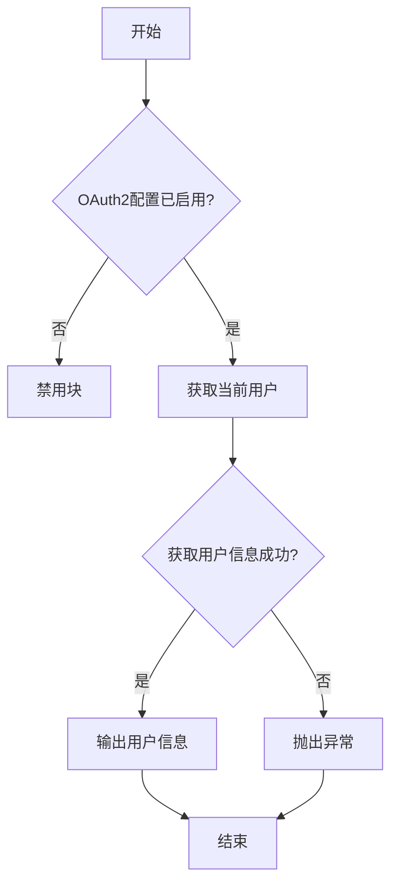
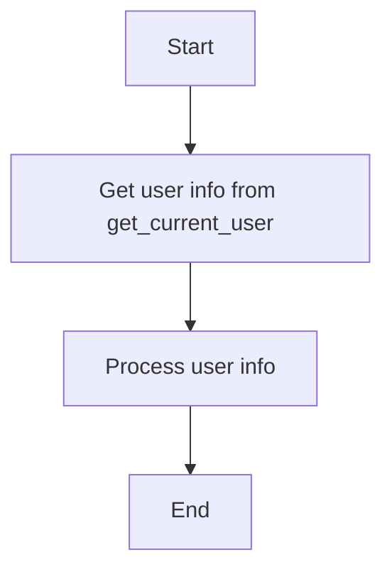
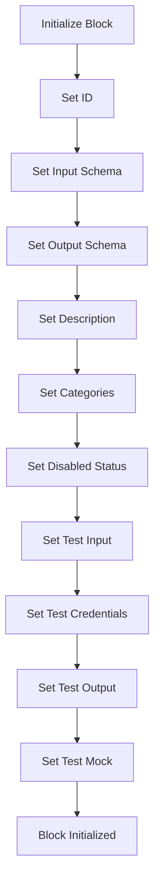
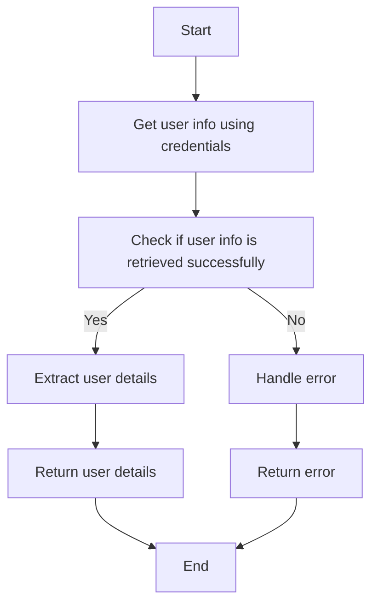
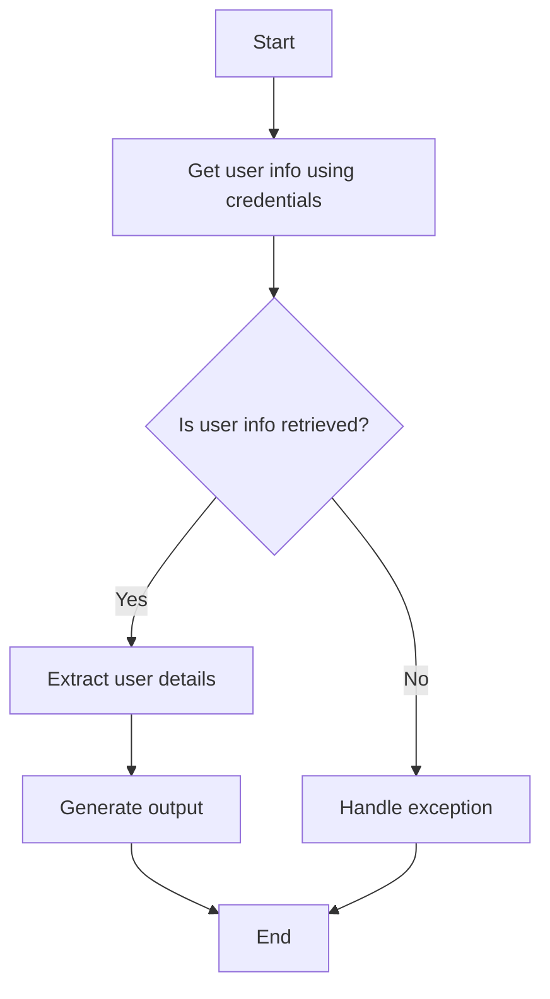

# `.\AutoGPT\autogpt_platform\backend\backend\blocks\discord\oauth_blocks.py` 详细设计文档

This code defines a Discord OAuth-based block that retrieves information about the currently authenticated Discord user using OAuth2 credentials.

## 整体流程



## 类结构

```
DiscordGetCurrentUserBlock (类)
```

## 全局变量及字段


### `DISCORD_OAUTH_IS_CONFIGURED`
    
Flag indicating if Discord OAuth is configured.

类型：`bool`
    


### `TEST_OAUTH_CREDENTIALS`
    
Test OAuth credentials for the Discord block.

类型：`OAuth2Credentials`
    


### `TEST_OAUTH_CREDENTIALS_INPUT`
    
Test input for OAuth credentials in the Discord block.

类型：`DiscordOAuthCredentialsInput`
    


### `DiscordOAuthCredentialsField`
    
Field type for OAuth credentials in the Discord block.

类型：`type`
    


### `DiscordOAuthCredentialsInput`
    
Input type for OAuth credentials in the Discord block.

类型：`type`
    


### `get_current_user`
    
Function to get current Discord user information.

类型：`function`
    


### `DiscordOAuthUser`
    
Type representing a Discord OAuth user.

类型：`type`
    


### `Block`
    
Base class for blocks.

类型：`type`
    


### `BlockCategory`
    
Enum for block categories.

类型：`type`
    


### `BlockOutput`
    
Type representing a block output.

类型：`type`
    


### `BlockSchemaInput`
    
Type representing a block schema input.

类型：`type`
    


### `BlockSchemaOutput`
    
Type representing a block schema output.

类型：`type`
    


### `SchemaField`
    
Type representing a schema field.

类型：`type`
    


### `OAuth2Credentials`
    
Type representing OAuth2 credentials.

类型：`type`
    


### `SchemaField`
    
Type representing a schema field.

类型：`type`
    


### `Input`
    
Input schema for the Discord block.

类型：`BlockSchemaInput`
    


### `Output`
    
Output schema for the Discord block.

类型：`BlockSchemaOutput`
    


### `DiscordGetCurrentUserBlock.id`
    
Unique identifier for the block.

类型：`str`
    


### `DiscordGetCurrentUserBlock.input_schema`
    
Input schema for the block.

类型：`BlockSchemaInput`
    


### `DiscordGetCurrentUserBlock.output_schema`
    
Output schema for the block.

类型：`BlockSchemaOutput`
    


### `DiscordGetCurrentUserBlock.description`
    
Description of the block.

类型：`str`
    


### `DiscordGetCurrentUserBlock.categories`
    
Categories to which the block belongs.

类型：`set`
    


### `DiscordGetCurrentUserBlock.disabled`
    
Flag indicating if the block is disabled.

类型：`bool`
    


### `DiscordGetCurrentUserBlock.test_input`
    
Test input data for the block.

类型：`dict`
    


### `DiscordGetCurrentUserBlock.test_credentials`
    
Test credentials for the block.

类型：`OAuth2Credentials`
    


### `DiscordGetCurrentUserBlock.test_output`
    
Test output data for the block.

类型：`list`
    


### `DiscordGetCurrentUserBlock.test_mock`
    
Mock data for testing the block.

类型：`dict`
    
    

## 全局函数及方法


### `DiscordGetCurrentUserBlock.get_user`

This method retrieves information about the currently authenticated Discord user using OAuth2 credentials.

参数：

- `credentials`：`OAuth2Credentials`，OAuth2 credentials used to authenticate with Discord.

返回值：`DiscordOAuthUser`，The Discord user information retrieved from the Discord API.

#### 流程图



#### 带注释源码

```python
    @staticmethod
    async def get_user(credentials: OAuth2Credentials) -> DiscordOAuthUser:
        user_info = await get_current_user(credentials)
        return user_info
```


### DiscordGetCurrentUserBlock.__init__

This method initializes the `DiscordGetCurrentUserBlock` class, setting up its schema, configuration, and test data.

参数：

- `id`: `str`，The unique identifier for the block.
- `input_schema`: `BlockSchemaInput`，The input schema for the block.
- `output_schema`: `BlockSchemaOutput`，The output schema for the block.
- `description`: `str`，A description of the block's functionality.
- `categories`: `set`，A set of categories that the block belongs to.
- `disabled`: `bool`，Whether the block is disabled or not.
- `test_input`: `dict`，The test input data for the block.
- `test_credentials`: `OAuth2Credentials`，The test credentials for the block.
- `test_output`: `list`，The expected test output data for the block.
- `test_mock`: `dict`，Mock data for testing the block.

返回值：无

#### 流程图



#### 带注释源码

```python
def __init__(self):
    super().__init__(
        id="8c7e39b8-4e9d-4f3a-b4e1-2a8c9d5f6e3b",
        input_schema=DiscordGetCurrentUserBlock.Input,
        output_schema=DiscordGetCurrentUserBlock.Output,
        description="Gets information about the currently authenticated Discord user using OAuth2 credentials.",
        categories={BlockCategory.SOCIAL},
        disabled=not DISCORD_OAUTH_IS_CONFIGURED,
        test_input={
            "credentials": TEST_OAUTH_CREDENTIALS_INPUT,
        },
        test_credentials=TEST_OAUTH_CREDENTIALS,
        test_output=[
            ("user_id", "123456789012345678"),
            ("username", "testuser"),
            (
                "avatar_url",
                "https://cdn.discordapp.com/avatars/123456789012345678/avatar.png",
            ),
            ("banner_url", ""),
            ("accent_color", 0),
        ],
        test_mock={
            "get_user": lambda _: DiscordOAuthUser(
                user_id="123456789012345678",
                username="testuser",
                avatar_url="https://cdn.discordapp.com/avatars/123456789012345678/avatar.png",
                banner=None,
                accent_color=0,
            )
        },
    )
```


### DiscordGetCurrentUserBlock.get_user

This method retrieves information about the currently authenticated Discord user using OAuth2 credentials.

参数：

- `credentials`：`OAuth2Credentials`，OAuth2 credentials used to authenticate the user.

返回值：`DiscordOAuthUser`，The DiscordOAuthUser object containing user information.

#### 流程图



#### 带注释源码

```python
@staticmethod
async def get_user(credentials: OAuth2Credentials) -> DiscordOAuthUser:
    user_info = await get_current_user(credentials)
    return user_info
```


### DiscordGetCurrentUserBlock.run

This method retrieves information about the currently authenticated Discord user using OAuth2 credentials.

参数：

- `input_data`：`Input`，The input data for the block, which includes the OAuth2 credentials.
- `credentials`：`OAuth2Credentials`，The OAuth2 credentials used to authenticate with Discord.

返回值：`BlockOutput`，The output data containing the user's ID, username, avatar URL, banner URL, and accent color.

#### 流程图



#### 带注释源码

```python
async def run(self, input_data: Input, *, credentials: OAuth2Credentials, **kwargs) -> BlockOutput:
    try:
        result = await self.get_user(credentials)

        # Yield each output field
        yield "user_id", result.user_id
        yield "username", result.username
        yield "avatar_url", result.avatar_url

        # Handle banner URL if banner hash exists
        if result.banner:
            banner_url = f"https://cdn.discordapp.com/banners/{result.user_id}/{result.banner}.png"
            yield "banner_url", banner_url
        else:
            yield "banner_url", ""

        yield "accent_color", result.accent_color or 0

    except Exception as e:
        raise ValueError(f"Failed to get Discord user info: {e}")
```


## 关键组件


### 张量索引与惰性加载

用于高效地访问和操作大型数据集，通过延迟计算和按需加载数据来优化内存使用。

### 反量化支持

提供对量化策略的支持，允许在模型训练和推理过程中进行量化，以减少模型大小和提高推理速度。

### 量化策略

定义了量化操作的规则和参数，包括量化精度、量化范围等，以优化模型的性能和资源消耗。


## 问题及建议


### 已知问题

-   **全局变量配置**：全局变量如 `DISCORD_OAUTH_IS_CONFIGURED`、`TEST_OAUTH_CREDENTIALS`、`TEST_OAUTH_CREDENTIALS_INPUT` 等硬编码在代码中，这可能导致配置管理困难，且不易于单元测试。
-   **异常处理**：异常处理仅捕获了 `Exception` 类，这可能隐藏了特定于OAuth或网络错误的异常，建议捕获更具体的异常类型。
-   **代码复用**：`get_user` 方法在类内部被静态地调用，这可能导致代码复用性差，如果其他类需要获取当前用户信息，则需要复制或修改代码。

### 优化建议

-   **配置管理**：将配置信息移至配置文件或环境变量中，以便于管理和修改，同时便于单元测试。
-   **异常处理**：引入更具体的异常处理，例如捕获 `requests.exceptions.RequestException` 以处理网络请求错误，或捕获 `discord.ext.oauth2.OAuth2Exception` 以处理OAuth相关错误。
-   **代码复用**：将 `get_user` 方法提取为全局函数或类方法，以便于其他类或模块重用。
-   **单元测试**：增加单元测试以覆盖各种异常情况，确保代码的健壮性。
-   **文档注释**：为全局变量和函数添加更详细的文档注释，说明其用途和预期行为。
-   **代码风格**：检查代码风格，确保一致性，例如使用 PEP 8 标准进行代码格式化。
-   **性能优化**：如果 `get_user` 方法涉及到网络请求，可以考虑缓存用户信息以减少不必要的请求，提高性能。


## 其它


### 设计目标与约束

- 设计目标：
  - 实现一个能够获取当前认证的Discord用户信息的模块。
  - 确保模块使用OAuth2认证，而非机器人令牌。
  - 提供测试用例和模拟数据，以便于开发和测试。
- 约束：
  - 必须使用Discord OAuth2认证。
  - 输出数据应包括用户ID、用户名、头像URL、横幅URL（如果存在）和用户的高亮颜色。
  - 模块应能够在没有配置Discord OAuth2时被禁用。

### 错误处理与异常设计

- 错误处理：
  - 在获取用户信息时，如果发生异常，将抛出`ValueError`，并附带错误信息。
- 异常设计：
  - 使用`try-except`块捕获可能发生的异常，并确保异常信息清晰。

### 数据流与状态机

- 数据流：
  - 输入：OAuth2凭证。
  - 处理：调用`get_current_user`函数获取用户信息。
  - 输出：用户ID、用户名、头像URL、横幅URL（如果存在）和用户的高亮颜色。
- 状态机：
  - 无状态机，因为该模块是同步执行，没有复杂的状态转换。

### 外部依赖与接口契约

- 外部依赖：
  - `backend.data.block`模块：用于定义块和块输出。
  - `backend.data.model`模块：用于定义OAuth2凭证和SchemaField。
  - `_api`模块：用于获取当前用户信息。
  - `_auth`模块：用于定义OAuth2凭证字段和输入。
- 接口契约：
  - `DiscordOAuthUser`类：定义了用户信息的数据结构。
  - `get_current_user`函数：用于获取当前用户信息。
  - `DiscordGetCurrentUserBlock`类：定义了获取当前Discord用户的块。


    