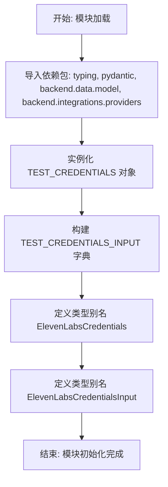

# `AutoGPT\autogpt_platform\backend\backend\blocks\elevenlabs\_auth.py` 详细设计文档

该代码文件主要负责为 ElevenLabs 语音服务集成提供测试凭证和类型定义，包含用于模拟 API 密钥的测试数据对象以及基于 Pydantic 的凭证输入类型别名，旨在支持集成测试和统一的数据模型规范。

## 整体流程



## 类结构

```
Type Aliases (类型别名)
├── ElevenLabsCredentials
└── ElevenLabsCredentialsInput

Global Constants (全局常量/变量)
├── TEST_CREDENTIALS
└── TEST_CREDENTIALS_INPUT
```

## 全局变量及字段


### `TEST_CREDENTIALS`
    
预设的 ElevenLabs API 凭证对象，包含模拟的 API Key，用于测试环境。

类型：`APIKeyCredentials`
    


### `TEST_CREDENTIALS_INPUT`
    
从 TEST_CREDENTIALS 提取的字典格式数据，用于模拟凭证输入参数的结构。

类型：`dict`
    


### `ElevenLabsCredentials`
    
ElevenLabs 凭证类型的别名，等同于 APIKeyCredentials 类。

类型：`APIKeyCredentials`
    


### `ElevenLabsCredentialsInput`
    
ElevenLabs 输入凭证类型的别名，限定提供商为 ELEVENLABS 且认证类型为 api_key。

类型：`CredentialsMetaInput[Literal[ProviderName.ELEVENLABS], Literal["api_key"]]`
    


    

## 全局函数及方法


## 关键组件


### TEST_CREDENTIALS

用于测试的模拟 ElevenLabs API 凭据对象，封装了预定义的 ID、提供者名称、密钥及标题信息。

### TEST_CREDENTIALS_INPUT

用于测试输入数据的字典结构，提取了凭据对象中的关键元数据字段，如提供者、ID、类型和标题。

### ElevenLabsCredentials

ElevenLabs 提供商的凭据类型别名，直接映射至通用的 APIKeyCredentials 模型，用于类型标注。

### ElevenLabsCredentialsInput

ElevenLabs 凭据输入的 Pydantic 模型类型别名，用于定义和验证该特定提供者的 API 密钥输入结构。


## 问题及建议


### 已知问题
-   **全局测试数据污染**：使用全局常量 `TEST_CREDENTIALS` 存储测试数据虽然在简单场景下方便，但在复杂测试套件中可能导致测试隔离性问题，特别是当测试逻辑意外修改这些全局对象时。
-   **手动字典构造维护成本**：`TEST_CREDENTIALS_INPUT` 是通过手动提取字段构造的字典。如果 `APIKeyCredentials` 的模型结构发生变更（如新增字段、重命名字段），此处需手动同步修改，否则会导致测试输入数据与实际模型不一致，引发潜在错误。
-   **类型别名约束力弱**：`ElevenLabsCredentials` 仅作为 `APIKeyCredentials` 的类型别名存在，未提供运行时类型区分。这意味着任何 `APIKeyCredentials` 实例（即使是其他 Provider 的）在静态类型检查之外都可以被赋值给该变量，降低了代码的严谨性和安全性。

### 优化建议
-   **采用 Pydantic 模型继承**：建议定义具体的 `class ElevenLabsCredentials(APIKeyCredentials)`，并在类内部配置 `provider` 为 Literal 类型或固定值。这能提供更强的类型约束，防止混用其他 Provider 的凭证。
-   **利用模型序列化方法**：建议使用 Pydantic 的 `.dict()` (Pydantic V1) 或 `.model_dump()` (Pydantic V2) 方法动态从 `TEST_CREDENTIALS` 实例生成 `TEST_CREDENTIALS_INPUT`，避免硬编码字典键，确保数据结构与模型定义严格同步。
-   **引入测试工厂或 Fixtures**：将测试凭证的定义移至测试框架的 Fixtures（如 Pytest 的 `conftest.py`）或工厂函数中。这样可以更灵活地支持不同场景（如过期凭证、无效凭证）的测试数据生成，并保持集成代码库的整洁。


## 其它


### 设计目标与约束

该模块旨在为 ElevenLabs 集成提供统一的凭证类型定义和测试数据支持。主要设计目标包括：

1.  **类型安全**：通过 Python 的 `typing.Literal` 和 Pydantic 模型强制约束凭证类型为 `api_key`，提供商限定为 `elevenlabs`，防止运行时错误。
2.  **解耦与复用**：通过类型别名（`ElevenLabsCredentials`, `ElevenLabsCredentialsInput`）复用通用的 `APIKeyCredentials` 和 `CredentialsMetaInput` 模型，避免重复定义结构。
3.  **测试隔离**：提供 `TEST_CREDENTIALS` 以支持在 CI/CD 或开发环境中进行集成测试，无需依赖真实的 ElevenLabs API 密钥。

**约束条件**：
*   必须遵循 `backend.data.model` 中定义的凭证基础结构。
*   生产环境中严禁使用硬编码的 `TEST_CREDENTIALS`。
*   所有 API 密钥字符串必须通过 `SecretStr` 封装，防止意外泄露。

### 外部依赖与接口契约

该模块依赖于以下外部组件和内部模块，并遵循相应的接口契约：

1.  **Pydantic (v2.x)**：
    *   **契约**：`SecretStr` 类型确保敏感数据在字符串表示和日志记录中被自动脱敏。
    *   **依赖**：用于数据校验和序列化。

2.  **backend.data.model**：
    *   **APIKeyCredentials**：基础凭证模型，包含 `id`, `provider`, `api_key`, `title`, `expires_at` 等字段。本模块直接实例化该类。
    *   **CredentialsMetaInput**：用于输入验证的泛型模型，本模块将其特化为 ElevenLabs 专用类型。

3.  **backend.integrations.providers**：
    *   **ProviderName**：枚举类型或常量集合，确保 `ProviderName.ELEVENLABS` 的值与系统配置保持一致。

**接口契约**：
*   `ElevenLabsCredentialsInput` 要求输入数据必须包含 `provider="elevenlabs"` 和 `type="api_key"`，否则校验将失败。

### 安全性与隐私保护

考虑到该模块涉及 API 凭证的处理，安全性设计至关重要：

1.  **敏感数据掩码**：使用 `pydantic.SecretStr` 包装 `api_key`。当凭证对象被转换为字典、JSON 或打印时，密钥值将显示为 `**********` 而非明文。
2.  **模拟数据隔离**：`TEST_CREDENTIALS` 明确标注为 "Mock"，并在文档字符串中说明其用途。开发人员需确保该数据不会被部署到生产环境数据库或配置中心。
3.  **静态类型检查**：利用 `Literal` 类型限制了凭证的有效选项，减少了因配置错误导致凭证发送至错误服务的风险。

### 测试与模拟数据管理

该模块定义了专用的测试常量，以支持系统的可测试性：

1.  **TEST_CREDENTIALS**：
    *   **用途**：提供一个符合 Pydantic 模型校验的完整凭证对象，用于模拟数据库查询结果或注入到依赖注入容器中。
    *   **特性**：预先生成的 UUID 作为 `id`，永不过期（`expires_at=None`），密钥为明文模拟值。

2.  **TEST_CREDENTIALS_INPUT**：
    *   **用途**：模拟前端或 API 客户端提交的请求数据格式（字典形式）。
    *   **关联**：其结构严格对应 `TEST_CREDENTIALS` 对象的可导出字段，用于测试输入反序列化流程。

    