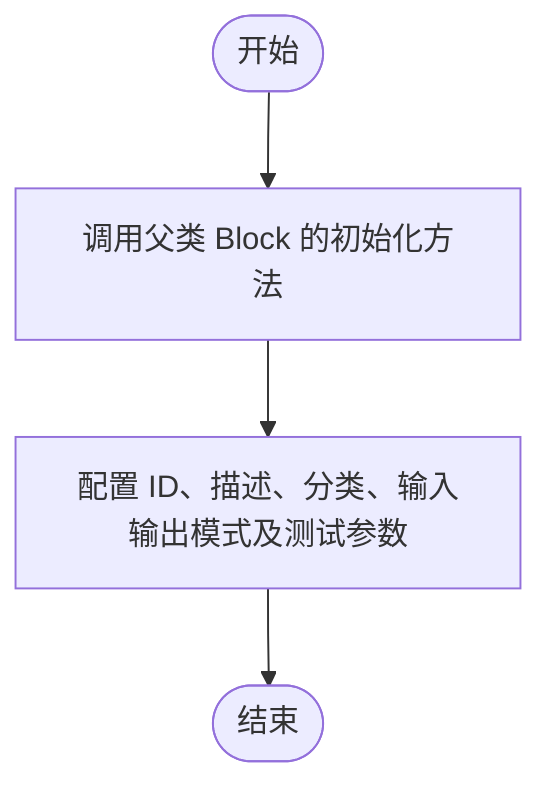

# `AutoGPT\autogpt_platform\backend\backend\blocks\email_block.py` 详细设计文档

该代码实现了一个基于 SMTP 协议的邮件发送模块，主要包含 `SendEmailBlock` 类，用于处理邮件的配置构建、发送逻辑以及针对网络连接、认证和协议错误的详细异常捕获与处理。

## 整体流程


## 类结构

```
Block (基类)
└── SendEmailBlock
    ├── Input (BlockSchemaInput)
    └── Output (BlockSchemaOutput)
BaseModel (Pydantic)
└── SMTPConfig
```

## 全局变量及字段


### `TEST_CREDENTIALS`
    
Mock SMTP user credentials object used for testing the block functionality.

类型：`UserPasswordCredentials`
    


### `TEST_CREDENTIALS_INPUT`
    
Dictionary representation of the mock SMTP test credentials used for input schema validation.

类型：`dict`
    


### `SMTPCredentials`
    
Type alias for UserPasswordCredentials specific to SMTP authentication.

类型：`Type[UserPasswordCredentials]`
    


### `SMTPCredentialsInput`
    
Input schema type definition for SMTP credentials metadata.

类型：`CredentialsMetaInput`
    


### `SMTPConfig.smtp_server`
    
The hostname or IP address of the SMTP server.

类型：`str`
    


### `SMTPConfig.smtp_port`
    
The port number on which the SMTP server is listening.

类型：`int`
    


### `SMTPConfig.model_config`
    
Configuration dictionary for the Pydantic model, defining metadata like title.

类型：`ConfigDict`
    


### `SendEmailBlock.Input`
    
Nested class defining the input schema structure for the Send Email block.

类型：`Type[BlockSchemaInput]`
    


### `SendEmailBlock.Output`
    
Nested class defining the output schema structure for the Send Email block.

类型：`Type[BlockSchemaOutput]`
    


### `SendEmailBlock.Input.to_email`
    
The email address of the recipient.

类型：`str`
    


### `SendEmailBlock.Input.subject`
    
The subject line of the email to be sent.

类型：`str`
    


### `SendEmailBlock.Input.body`
    
The main content body of the email.

类型：`str`
    


### `SendEmailBlock.Input.config`
    
Configuration object containing SMTP server address and port.

类型：`SMTPConfig`
    


### `SendEmailBlock.Input.credentials`
    
Credentials object containing the username and password for SMTP authentication.

类型：`SMTPCredentialsInput`
    


### `SendEmailBlock.Output.status`
    
Status message indicating the result of the email sending operation.

类型：`str`
    


### `SendEmailBlock.Output.error`
    
Error message detailing any failure that occurred during the email sending process.

类型：`str`
    
    

## 全局函数及方法


### `SMTPCredentialsField`

该函数是一个工厂函数，用于生成并返回SMTP凭证的输入字段定义，指定了该集成需要用户提供用户名和密码。

参数：

无

返回值：`SMTPCredentialsInput`，包含SMTP凭证元数据的输入字段对象，用于在Schema中定义凭证结构。

#### 流程图


#### 带注释源码

```python
def SMTPCredentialsField() -> SMTPCredentialsInput:
    # 调用 CredentialsField 辅助函数创建一个凭证字段
    # 设置该字段的描述信息，提示用户该集成需要用户名和密码
    return CredentialsField(
        description="The SMTP integration requires a username and password.",
    )
```


### `SendEmailBlock.__init__`

该方法是 `SendEmailBlock` 类的构造函数，用于初始化发送邮件块的相关配置。它设置了块的唯一标识符、描述、所属分类、输入输出模式以及用于测试的模拟数据。

参数：

- `self`：`SendEmailBlock`，表示类实例本身。

返回值：`None`，无返回值。

#### 流程图



#### 带注释源码

```python
def __init__(self):
    # 调用父类 Block 的初始化方法
    super().__init__(
        # 设置块的唯一标识符
        id="4335878a-394e-4e67-adf2-919877ff49ae",
        # 设置块的描述信息
        description="This block sends an email using the provided SMTP credentials.",
        # 设置块所属的分类，此处为输出类
        categories={BlockCategory.OUTPUT},
        # 设置输入数据的模式为类中定义的 Input
        input_schema=SendEmailBlock.Input,
        # 设置输出数据的模式为类中定义的 Output
        output_schema=SendEmailBlock.Output,
        # 定义测试输入数据，包含收件人、主题、正文、配置和凭证
        test_input={
            "to_email": "recipient@example.com",
            "subject": "Test Email",
            "body": "This is a test email.",
            "config": {
                "smtp_server": "smtp.gmail.com",
                "smtp_port": 25,
            },
            "credentials": TEST_CREDENTIALS_INPUT,
        },
        # 提供用于测试的凭证对象
        test_credentials=TEST_CREDENTIALS,
        # 定义预期的测试输出结果
        test_output=[("status", "Email sent successfully")],
        # 定义测试模拟函数，模拟 send_email 方法的返回值
        test_mock={"send_email": lambda *args, **kwargs: "Email sent successfully"},
    )
```


### `SendEmailBlock.send_email`

该静态方法负责通过 SMTP 协议发送电子邮件。它使用提供的配置和凭证建立与 SMTP 服务器的安全连接，构造 MIME 格式的邮件消息，并将其发送给指定的收件人。

参数：

-  `config`：`SMTPConfig`，包含 SMTP 服务器地址和端口号的配置对象。
-  `to_email`：`str`，收件人的电子邮件地址。
-  `subject`：`str`，电子邮件的主题。
-  `body`：`str`，电子邮件的正文内容。
-  `credentials`：`SMTPCredentials`，包含用于 SMTP 服务器认证的用户名和密码。

返回值：`str`，表示邮件发送成功的状态消息（"Email sent successfully"）。

#### 流程图


#### 带注释源码

```python
    @staticmethod
    def send_email(
        config: SMTPConfig,
        to_email: str,
        subject: str,
        body: str,
        credentials: SMTPCredentials,
    ) -> str:
        # 从配置中获取 SMTP 服务器地址和端口
        smtp_server = config.smtp_server
        smtp_port = config.smtp_port
        
        # 从凭证对象中安全地提取用户名和密码
        smtp_username = credentials.username.get_secret_value()
        smtp_password = credentials.password.get_secret_value()

        # 创建一个多部分邮件消息对象
        msg = MIMEMultipart()
        # 设置邮件头：发件人
        msg["From"] = smtp_username
        # 设置邮件头：收件人
        msg["To"] = to_email
        # 设置邮件头：主题
        msg["Subject"] = subject
        # 将纯文本正文附加到邮件对象
        msg.attach(MIMEText(body, "plain"))

        # 使用上下文管理器建立 SMTP 连接，设置超时为 30 秒
        with smtplib.SMTP(smtp_server, smtp_port, timeout=30) as server:
            # 启用传输层安全 (TLS) 加密
            server.starttls()
            # 使用提取的用户名和密码登录 SMTP 服务器
            server.login(smtp_username, smtp_password)
            # 发送邮件（发件人，收件人，邮件内容的字符串形式）
            server.sendmail(smtp_username, to_email, msg.as_string())

        # 返回操作成功的状态消息
        return "Email sent successfully"
```


### `SendEmailBlock.run`

执行邮件发送操作，通过调用静态方法 `send_email` 进行邮件传输。该方法对邮件发送过程中可能遇到的网络连接、超时、协议支持、认证、收发件人验证等多种异常情况进行捕获，并返回相应的状态或错误信息。

参数：

-  `input_data`：`Input`，包含邮件的收件人地址、主题、正文内容以及SMTP服务器配置信息。
-  `credentials`：`SMTPCredentials`，用于登录SMTP服务器的用户名和密码凭据对象。
-  `**kwargs`：`Any`，额外的关键字参数（未使用）。

返回值：`BlockOutput`，一个异步生成器，产出包含操作状态（"status"）或错误信息（"error"）的键值对元组。

#### 流程图


#### 带注释源码

```python
    async def run(
        self, input_data: Input, *, credentials: SMTPCredentials, **kwargs
    ) -> BlockOutput:
        try:
            # 尝试调用 send_email 静态方法发送邮件，并传入输入数据和凭据
            status = self.send_email(
                config=input_data.config,
                to_email=input_data.to_email,
                subject=input_data.subject,
                body=input_data.body,
                credentials=credentials,
            )
            # 如果成功，产出状态信息
            yield "status", status
        # 捕获 DNS 相关错误（地址解析失败）
        except socket.gaierror:
            yield "error", (
                f"Cannot connect to SMTP server '{input_data.config.smtp_server}'. "
                "Please verify the server address is correct."
            )
        # 捕获连接超时错误
        except socket.timeout:
            yield "error", (
                f"Connection timeout to '{input_data.config.smtp_server}' "
                f"on port {input_data.config.smtp_port}. "
                "The server may be down or unreachable."
            )
        # 捕获连接被拒绝错误（通常由端口错误或防火墙引起）
        except ConnectionRefusedError:
            yield "error", (
                f"Connection refused to '{input_data.config.smtp_server}' "
                f"on port {input_data.config.smtp_port}. "
                "Common SMTP ports are: 587 (TLS), 465 (SSL), 25 (plain). "
                "Please verify the port is correct."
            )
        # 捕获 STARTTLS 不支持错误
        except smtplib.SMTPNotSupportedError:
            yield "error", (
                f"STARTTLS not supported by server '{input_data.config.smtp_server}'. "
                "Try using port 465 for SSL or port 25 for unencrypted connection."
            )
        # 捕获 SSL/TLS 握手错误
        except ssl.SSLError as e:
            yield "error", (
                f"SSL/TLS error when connecting to '{input_data.config.smtp_server}': {str(e)}. "
                "The server may require a different security protocol."
            )
        # 捕获 SMTP 认证错误（用户名或密码错误）
        except smtplib.SMTPAuthenticationError:
            yield "error", (
                "Authentication failed. Please verify your username and password are correct."
            )
        # 捕获收件人被拒绝错误（邮箱地址无效或被服务器拉黑）
        except smtplib.SMTPRecipientsRefused:
            yield "error", (
                f"Recipient email address '{input_data.to_email}' was rejected by the server. "
                "Please verify the email address is valid."
            )
        # 捕获发件人被拒绝错误（账号未授权发送）
        except smtplib.SMTPSenderRefused:
            yield "error", (
                "Sender email address defined in the credentials that where used"
                "was rejected by the server. "
                "Please verify your account is authorized to send emails."
            )
        # 捕获邮件数据错误（内容格式问题等）
        except smtplib.SMTPDataError as e:
            yield "error", f"Email data rejected by server: {str(e)}"
        # 捕获其他未预料到的异常并重新抛出
        except Exception as e:
            raise e
```


## 关键组件


### SMTPConfig
Pydantic模型，用于定义和验证SMTP服务器的连接配置，包含服务器地址和端口号。

### SendEmailBlock
核心执行块类，继承自Block，负责定义发送邮件的输入输出Schema、初始化测试数据以及编排邮件发送的运行流程。

### send_email
静态方法，实现了邮件发送的具体逻辑，包括构建MIME消息、建立SMTP连接、启用TLS加密、进行身份认证并发送邮件。

### Error Handling
异常处理机制，在run方法中捕获并处理网络连接、SSL/TLS协议以及SMTP协议层面的多种错误，并将其转换为可读的错误消息输出。

### SMTPCredentialsField
凭证字段组件，用于生成和处理SMTP服务所需的用户名和密码凭证输入，确保证据数据的安全性和类型正确性。


## 问题及建议


### 已知问题

-   **阻塞异步事件循环**：`send_email` 方法使用了同步的 `smtplib` 库，并在 `async def run` 方法中直接调用。这会导致在执行耗时的 SMTP 通信（DNS解析、连接、数据传输）时阻塞整个异步事件循环，严重影响系统的并发性能。
-   **SSL/TLS 逻辑僵化**：代码强制调用 `server.starttls()`。对于端口 465（通常用于 SSL），这种做法是不正确的，应该使用 `smtplib.SMTP_SSL`。对于不支持加密的端口 25，这会导致异常。目前的逻辑无法适应主流 SMTP 服务器的不同安全配置。
-   **字符编码缺失**：在构建 `MIMEText` 时仅指定了 `"plain"` 而未指定字符集（如 `"utf-8"`）。这意味着如果邮件正文或主题包含非 ASCII 字符（如中文），可能会导致发送失败或乱码。
-   **硬编码的超时时间**：SMTP 连接超时被硬编码为 30 秒。对于网络环境较差或服务器响应慢的场景，这个时间可能不够；而对于追求快速失败的场景，这个时间又太长。
-   **缺乏重试机制**：网络抖动或 SMTP 服务器临时繁忙是常见情况，当前代码遇到任何异常（如连接超时）都会立即失败，没有实现自动重试逻辑，降低了任务执行的可靠性。

### 优化建议

-   **引入异步 SMTP 库或使用线程池**：建议使用 `aiosmtplib` 等异步 SMTP 库替代 `smtplib`；或者如果必须保持现有库，则应使用 `loop.run_in_executor` 将同步的邮件发送操作放到独立的线程池中执行，避免阻塞主事件循环。
-   **支持动态安全协议选择**：根据端口号自动选择连接方式（例如：端口 465 使用 `SMTP_SSL`，端口 587 或 25 使用 `SMTP` 并尝试 `starttls`），或者在 `SMTPConfig` 中增加一个 `security` 字段（如 `ssl/tls/starttls/none`）让用户显式指定加密方式。
-   **强制使用 UTF-8 编码**：在创建 `MIMEText` 对象时显式指定 `_charset='utf-8'`，确保国际字符（如中文、表情符号）能正确传输和显示。
-   **超时时间可配置化**：将 `timeout` 参数添加到 `SMTPConfig` 类中，允许用户根据实际网络环境调整连接超时时间。
-   **实现重试策略**：引入重试机制（例如使用 Tenacity 库），对 `socket.timeout`、`ConnectionRefusedError` 等临时性网络错误进行有限次数的指数退避重试。
-   **增强错误输出结构**：目前的错误输出仅为字符串。建议输出结构化的错误信息（例如包含错误代码和详细消息），方便下游逻辑根据错误类型进行自动化处理（如：认证错误提示用户更新凭证，网络错误触发重试）。
-   **增加发件人地址配置**：目前 `From` 字段直接取自用户名（`msg["From"] = smtp_username`），但在某些情况下发件人地址与登录用户名不一致。建议在 `Input` 中增加可选的 `from_email` 字段。


## 其它


### 设计目标与约束

**设计目标**
1.  **功能封装**：将标准 SMTP 邮件发送功能封装为独立的 `Block` 组件，使其能无缝接入到上层的工作流或自动化系统中。
2.  **安全性**：利用 `pydantic.SecretStr` 对敏感信息（用户名和密码）进行掩码处理，防止日志打印或调试时泄露凭据。
3.  **易用性**：提供清晰的 Schema 定义（输入/输出）和详细的错误提示，帮助用户快速定位配置问题（如端口错误、认证失败等）。
4.  **鲁棒性**：通过捕获底层的网络和协议异常，将技术错误转化为对用户友好的错误消息。

**设计约束**
1.  **同步阻塞调用**：尽管 `run` 方法被定义为 `async`，但其调用的 `send_email` 方法使用了 Python 标准库 `smtplib`，该库执行同步阻塞式 I/O 操作。这意味着在邮件发送期间（包括连接握手、认证和数据传输），事件循环会被阻塞，可能影响高并发场景下的性能。
2.  **协议限制**：当前实现强制尝试使用 `starttls()` 升级连接。对于仅支持 SSL（端口 465）或完全不加密的服务器，代码逻辑可能需要调整或由用户自行确保配置兼容性（虽然代码处理了 `SMTPNotSupportedError`，但逻辑上优先尝试 TLS）。
3.  **超时限制**：网络连接被硬编码为 30 秒超时 (`timeout=30`)，这是一个固定的非配置化约束。

### 错误处理与异常设计

本模块采用了精细化的异常捕获策略，旨在将底层的系统错误转换为上层可读的业务错误信息。具体的异常映射与处理逻辑如下：

1.  **网络连接层异常**：
    *   `socket.gaierror`：DNS 解析失败或服务器地址不可达。提示用户检查服务器地址。
    *   `socket.timeout`：连接超时。提示服务器可能宕机或网络不通。
    *   `ConnectionRefusedError`：连接被拒绝。通常由端口错误或防火墙拦截引起，提示常用 SMTP 端口（587, 465, 25）。

2.  **安全与协议层异常**：
    *   `smtplib.SMTPNotSupportedError`：服务器不支持 STARTTLS。提示尝试 SSL 或非加密连接。
    *   `ssl.SSLError`：SSL/TLS 握手失败。提示服务器可能要求特定的安全协议。

3.  **SMTP 业务逻辑层异常**：
    *   `smtplib.SMTPAuthenticationError`：认证失败。提示检查用户名和密码。
    *   `smtplib.SMTPRecipientsRefused`：收件人地址被拒绝。提示验证收件人邮箱有效性。
    *   `smtplib.SMTPSenderRefused`：发件人地址被拒绝。提示账户权限问题。
    *   `smtplib.SMTPDataError`：邮件内容被拒绝。提示数据格式或内容违规。

4.  **兜底策略**：
    *   `Exception`：捕获所有未预料到的异常，并重新抛出 (`raise e`)，交由上层全局处理器处理，避免静默失败。

### 外部依赖与接口契约

**外部依赖**
1.  **标准库**：
    *   `smtplib`：核心 SMTP 协议实现，用于连接服务器、登录和发送邮件。
    *   `email.mime.*`：用于构造符合 MIME 标准的邮件消息结构。
    *   `socket`, `ssl`：用于底层的网络通信和加密处理。
2.  **第三方库**：
    *   `pydantic`：用于数据模型验证（`BaseModel`, `SecretStr`）和配置管理。
3.  **内部模块**：
    *   `backend.data.block`：提供 `Block` 基类、输入输出 Schema 定义 (`BlockSchemaInput`, `BlockSchemaOutput`) 以及类别枚举。
    *   `backend.data.model`：提供凭据字段定义 (`CredentialsField`) 和用户密码凭据模型 (`UserPasswordCredentials`)。

**接口契约**
1.  **输入契约 (`SendEmailBlock.Input`)**：
    *   调用方必须提供合法的 `to_email` (字符串), `subject` (字符串), `body` (字符串)。
    *   必须提供符合 `SMTPConfig` 结构的配置对象，包含 `smtp_server` 和 `smtp_port`。
    *   必须提供有效的 `credentials`，其类型需匹配 `SMTPCredentialsInput`（包含 provider, id, type 等元数据），且运行时会解析为 `UserPasswordCredentials` 实体。

2.  **输出契约 (`BlockOutput`)**：
    *   方法是一个异步生成器，产生键值对。
    *   **成功路径**：产出 `("status", "Email sent successfully")`。
    *   **失败路径**：产出 `("error", <具体的错误描述字符串>)`。
    *   **严重异常路径**：抛出未捕获的 `Exception`，中断当前 Block 执行。

### 数据流与状态机

**数据流**
1.  **输入阶段**：外部调用者传入 `input_data` (包含邮件内容、配置) 和解密后的 `credentials`。
2.  **构建阶段**：静态方法 `send_email` 提取配置和凭据明文，使用 `MIMEMultipart` 构建邮件对象（设置发件人、收件人、主题和正文）。
3.  **传输阶段**：
    *   建立 TCP 连接 (`smtplib.SMTP`)。
    *   执行安全升级 (`server.starttls()`)。
    *   执行身份认证 (`server.login()`)。
    *   发送邮件数据 (`server.sendmail()`)。
4.  **输出阶段**：根据传输结果，`run` 方法生成状态或错误信息流。

**状态转换**
虽然本组件是无状态的函数式块，但其执行过程可视为以下状态流转：
*   `Idle` (空闲) -> `Validating` (隐式验证) -> `Connecting` (建立 Socket 连接) -> `Securing` (TLS 握手) -> `Authenticating` (登录验证) -> `Transferring` (发送数据) -> `Finished` (成功输出或异常输出)。

### 并发模型

*   **接口定义**：`SendEmailBlock.run` 方法被定义为协程 (`async def run`)，这表明它设计用于在异步 I/O 循环（如 `asyncio`）中运行，以配合框架的非阻塞特性。
*   **实际执行**：在 `run` 内部，核心逻辑委托给同步方法 `send_email`。该方法执行 `smtplib` 操作，这些操作是**阻塞**的。
*   **潜在影响**：这意味着当 `send_email` 执行时（特别是网络延迟大或附件较大时），它将阻塞整个线程。如果该 Block 运行在单线程的 `asyncio` 事件循环中，它会暂停同一循环中其他任务的执行，直到邮件发送完成或超时。在高并发场景下，这是一个性能瓶颈点。
*   **改进建议**：理想的实现应使用 `loop.run_in_executor` 将阻塞的 SMTP 调用移至单独的线程池中执行，以释放事件循环。

    