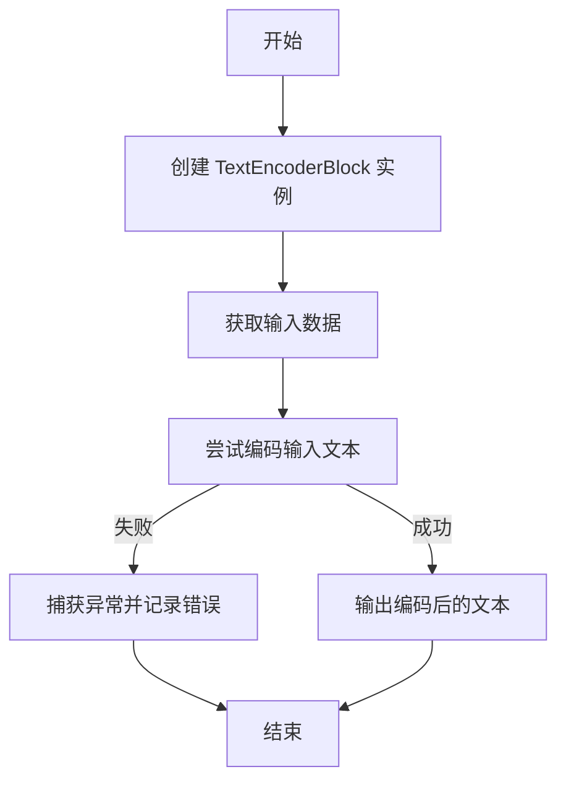
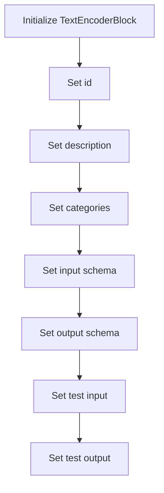
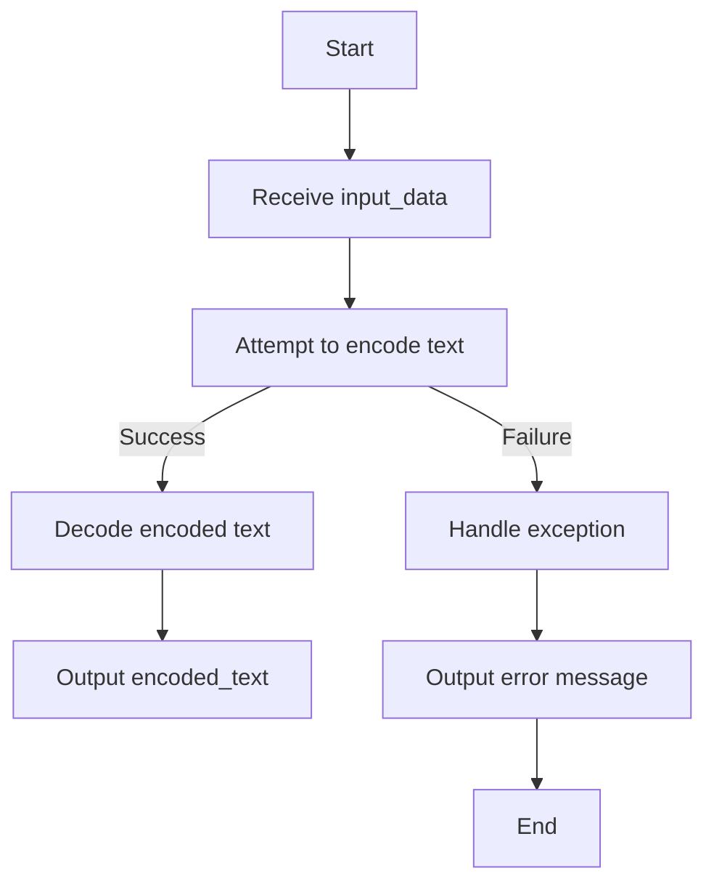

# `.\AutoGPT\autogpt_platform\backend\backend\blocks\encoder_block.py` 详细设计文档

The TextEncoderBlock is designed to convert special characters in a string to their respective escape sequences, facilitating the safe handling of text data in environments where special characters have special meanings.

## 整体流程



## 类结构

```
TextEncoderBlock (具体类)
├── Block (抽象基类)
```

## 全局变量及字段


### `id`
    
Unique identifier for the TextEncoderBlock instance

类型：`str`
    


### `description`
    
Description of the TextEncoderBlock functionality

类型：`str`
    


### `categories`
    
Set of categories that the TextEncoderBlock belongs to

类型：`set`
    


### `input_schema`
    
Input schema for the TextEncoderBlock

类型：`TextEncoderBlock.Input`
    


### `output_schema`
    
Output schema for the TextEncoderBlock

类型：`TextEncoderBlock.Output`
    


### `test_input`
    
Test input data for the TextEncoderBlock

类型：`dict`
    


### `test_output`
    
Test output data for the TextEncoderBlock

类型：`list`
    


### `TextEncoderBlock.id`
    
Unique identifier for the TextEncoderBlock instance

类型：`str`
    


### `TextEncoderBlock.description`
    
Description of the TextEncoderBlock functionality

类型：`str`
    


### `TextEncoderBlock.categories`
    
Set of categories that the TextEncoderBlock belongs to

类型：`set`
    


### `TextEncoderBlock.input_schema`
    
Input schema for the TextEncoderBlock

类型：`TextEncoderBlock.Input`
    


### `TextEncoderBlock.output_schema`
    
Output schema for the TextEncoderBlock

类型：`TextEncoderBlock.Output`
    


### `TextEncoderBlock.test_input`
    
Test input data for the TextEncoderBlock

类型：`dict`
    


### `TextEncoderBlock.test_output`
    
Test output data for the TextEncoderBlock

类型：`list`
    
    

## 全局函数及方法


### TextEncoderBlock.__init__

This method initializes the TextEncoderBlock class, setting up its properties and schema for encoding text.

参数：

- `id`: `str`，A unique identifier for the block.
- `description`: `str`，A description of the block's functionality.
- `categories`: `set`，A set of categories that the block belongs to.
- `input_schema`: `TextEncoderBlock.Input`，The input schema for the block.
- `output_schema`: `TextEncoderBlock.Output`，The output schema for the block.
- `test_input`: `dict`，A sample input for testing the block.
- `test_output`: `list`，A sample output for testing the block.

返回值：无，This method does not return a value; it initializes the block.

#### 流程图



#### 带注释源码

```python
def __init__(self):
    super().__init__(
        id="5185f32e-4b65-4ecf-8fbb-873f003f09d6",
        description="Encodes a string by converting special characters into escape sequences",
        categories={BlockCategory.TEXT},
        input_schema=TextEncoderBlock.Input,
        output_schema=TextEncoderBlock.Output,
        test_input={
            "text": """Hello
World!
This is a "quoted" string."""
        },
        test_output=[
            (
                "encoded_text",
                """Hello\\nWorld!\\nThis is a "quoted" string."""
            )
        ],
    )
```


### TextEncoderBlock.run

This method encodes the input text by converting special characters into their escape sequences.

参数：

- `input_data`：`Input`，The input containing the text to encode.
- `**kwargs`：Additional keyword arguments (unused).

返回值：`BlockOutput`，The encoded text with escape sequences, or an error message if encoding fails.

#### 流程图



#### 带注释源码

```python
async def run(self, input_data: Input, **kwargs) -> BlockOutput:
    """
    Encode the input text by converting special characters to escape sequences.

    Args:
        input_data: The input containing the text to encode.
        **kwargs: Additional keyword arguments (unused).

    Yields:
        The encoded text with escape sequences, or an error message if encoding fails.
    """
    try:
        encoded_text = codecs.encode(input_data.text, "unicode_escape").decode("utf-8")
        yield "encoded_text", encoded_text
    except Exception as e:
        yield "error", f"Encoding error: {str(e)}"
```


## 关键组件


### 张量索引与惰性加载

张量索引与惰性加载是处理大型数据集时常用的技术，用于提高内存使用效率和数据处理速度。

### 反量化支持

反量化支持是指系统对量化操作的反向处理能力，即能够从量化后的数据中恢复原始数据。

### 量化策略

量化策略是指将浮点数数据转换为固定点数表示的方法，以减少计算资源消耗和提高计算速度。


## 问题及建议


### 已知问题

-   **异常处理**: 代码中使用了通用的 `Exception` 类来捕获编码过程中可能发生的任何异常。这可能会导致难以调试的问题，因为无法确定具体是哪种类型的异常发生了。建议捕获更具体的异常类型，如 `UnicodeEncodeError` 或 `UnicodeDecodeError`。
-   **错误信息**: 错误信息仅包含异常的字符串表示，这可能会对调试造成困难。建议提供更详细的错误信息，包括异常类型和发生异常的位置。
-   **代码复用**: `TextEncoderBlock` 类中定义了 `Input` 和 `Output` 类，这些类在 `Block` 类中已经定义。这可能导致代码重复，建议使用 `Block` 类中已有的 `Input` 和 `Output` 类。
-   **测试用例**: 代码中只提供了一个测试用例。建议提供更多测试用例，包括边界情况和异常情况，以确保代码的鲁棒性。

### 优化建议

-   **改进异常处理**: 使用更具体的异常类型来捕获和处理异常，并提供详细的错误信息。
-   **减少代码重复**: 使用 `Block` 类中已有的 `Input` 和 `Output` 类，避免代码重复。
-   **增加测试用例**: 编写更多的测试用例，包括边界情况和异常情况，以确保代码在各种情况下都能正常工作。
-   **性能优化**: 如果编码操作是性能瓶颈，可以考虑使用更高效的编码方法或库。
-   **文档和注释**: 增加代码的文档和注释，以提高代码的可读性和可维护性。


## 其它


### 设计目标与约束

- 设计目标：实现一个能够将包含特殊字符的字符串转换为转义序列的编码块。
- 约束：编码块应遵循既定的输入和输出模式，确保与其他系统组件兼容。

### 错误处理与异常设计

- 错误处理：在编码过程中，如果发生异常，将捕获异常并生成错误消息。
- 异常设计：使用 `try-except` 块捕获异常，并使用 `yield` 语句返回错误消息。

### 数据流与状态机

- 数据流：输入数据通过 `run` 方法传递，经过编码处理后，输出编码后的文本或错误消息。
- 状态机：该块没有明确的状态机，但 `run` 方法处理输入数据并返回结果，可以视为一个简单的状态转换。

### 外部依赖与接口契约

- 外部依赖：依赖于 `codecs` 模块进行编码操作。
- 接口契约：遵循 `Block` 类的接口，包括输入和输出模式以及初始化参数。


    