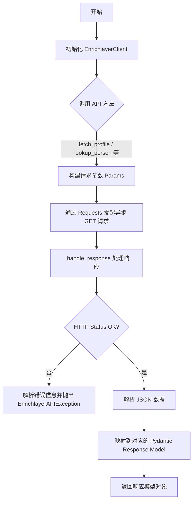
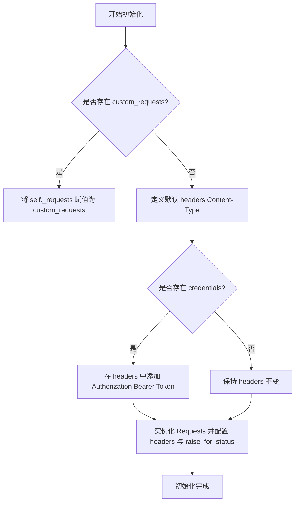
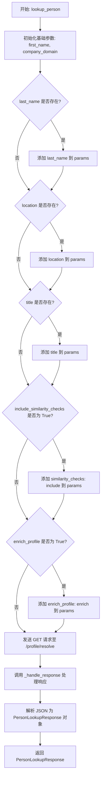
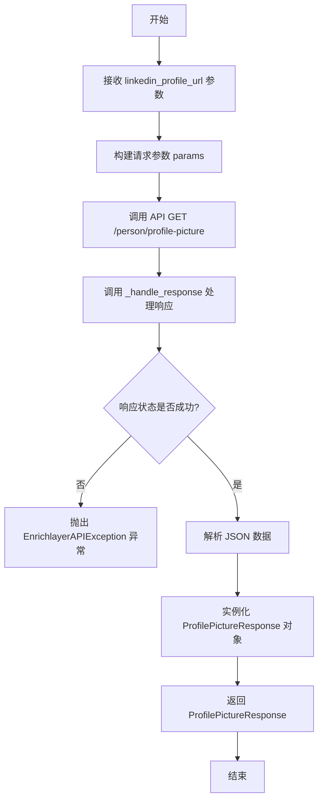
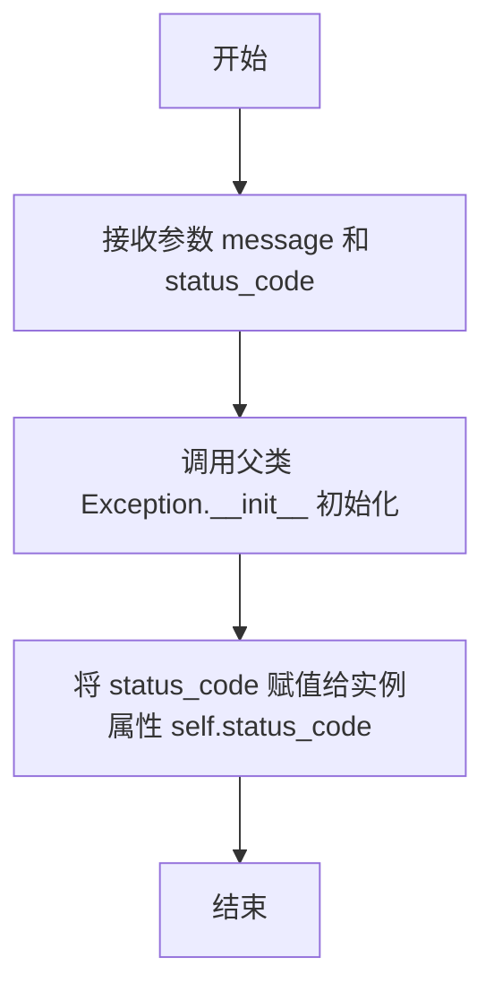
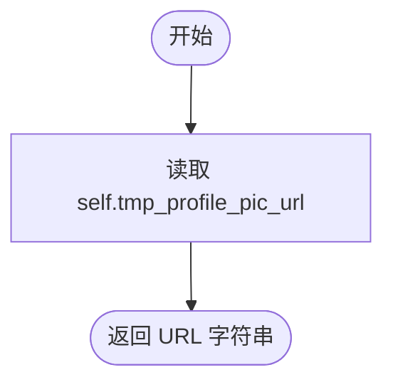

# `AutoGPT\autogpt_platform\backend\backend\blocks\enrichlayer\_api.py` 详细设计文档

该模块提供了一个用于与 Enrichlayer API 交互的 Python 客户端，支持异步获取 LinkedIn 个人资料数据、查找人员信息、按职位搜索以及获取个人头像。模块定义了多种 Pydantic 数据模型以映射 API 响应，并包含错误处理、缓存策略配置及请求封装逻辑。

## 整体流程



## 类结构

```
EnrichlayerAPIException (Exception)
FallbackToCache (Enum)
UseCache (Enum)
SocialMediaProfiles (BaseModel)
Experience (BaseModel)
Education (BaseModel)
PersonProfileResponse (BaseModel)
SimilarProfile (BaseModel)
PersonLookupResponse (BaseModel)
RoleLookupResponse (BaseModel)
ProfilePictureResponse (BaseModel)
EnrichlayerClient (Client Class)
├── API_BASE_URL
├── _requests
├── __init__
├── _handle_response
├── fetch_profile
├── lookup_person
├── lookup_role
└── get_profile_picture
```

## 全局变量及字段


### `logger`
    
用于记录模块日志信息的日志记录器实例

类型：`Logger`
    


### `T`
    
用于定义泛型类型的类型变量

类型：`TypeVar`
    


### `EnrichlayerClient.API_BASE_URL`
    
Enrichlayer API 的基础 URL 地址

类型：`str`
    


### `EnrichlayerClient._requests`
    
用于发起 HTTP 请求的客户端实例

类型：`Requests`
    


### `FallbackToCache.ON_ERROR`
    
表示当发生错误时回退使用缓存的枚举值

类型：`FallbackToCache`
    


### `FallbackToCache.NEVER`
    
表示绝不回退使用缓存的枚举值

类型：`FallbackToCache`
    


### `UseCache.IF_PRESENT`
    
表示如果缓存存在则使用缓存的枚举值

类型：`UseCache`
    


### `UseCache.NEVER`
    
表示绝不使用缓存的枚举值

类型：`UseCache`
    


### `SocialMediaProfiles.twitter`
    
Twitter 社交媒体个人资料链接

类型：`Optional[str]`
    


### `SocialMediaProfiles.facebook`
    
Facebook 社交媒体个人资料链接

类型：`Optional[str]`
    


### `SocialMediaProfiles.github`
    
GitHub 社交媒体个人资料链接

类型：`Optional[str]`
    


### `Experience.company`
    
工作经历中的公司名称

类型：`Optional[str]`
    


### `Experience.title`
    
工作经历中的职位头衔

类型：`Optional[str]`
    


### `Experience.description`
    
工作经历的详细描述

类型：`Optional[str]`
    


### `Experience.location`
    
工作经历的地点

类型：`Optional[str]`
    


### `Experience.starts_at`
    
工作经历开始的时间信息，包含年月

类型：`Optional[dict[str, int]]`
    


### `Experience.ends_at`
    
工作经历结束的时间信息，包含年月

类型：`Optional[dict[str, int]]`
    


### `Experience.company_linkedin_profile_url`
    
公司的 LinkedIn 个人资料主页链接

类型：`Optional[str]`
    


### `Education.school`
    
教育经历中的学校名称

类型：`Optional[str]`
    


### `Education.degree_name`
    
教育经历中的学位名称

类型：`Optional[str]`
    


### `Education.field_of_study`
    
教育经历中的研究领域

类型：`Optional[str]`
    


### `Education.starts_at`
    
教育经历开始的时间信息，包含年月

类型：`Optional[dict[str, int]]`
    


### `Education.ends_at`
    
教育经历结束的时间信息，包含年月

类型：`Optional[dict[str, int]]`
    


### `Education.school_linkedin_profile_url`
    
学校的 LinkedIn 个人资料主页链接

类型：`str`
    


### `PersonProfileResponse.public_identifier`
    
LinkedIn 公开标识符

类型：`Optional[str]`
    


### `PersonProfileResponse.profile_pic_url`
    
个人资料图片的 URL

类型：`Optional[str]`
    


### `PersonProfileResponse.full_name`
    
用户的全名

类型：`Optional[str]`
    


### `PersonProfileResponse.first_name`
    
用户的名字

类型：`Optional[str]`
    


### `PersonProfileResponse.last_name`
    
用户的姓氏

类型：`Optional[str]`
    


### `PersonProfileResponse.occupation`
    
用户的职业

类型：`Optional[str]`
    


### `PersonProfileResponse.headline`
    
个人资料标题

类型：`Optional[str]`
    


### `PersonProfileResponse.summary`
    
个人简介摘要

类型：`Optional[str]`
    


### `PersonProfileResponse.country`
    
所在国家的代码

类型：`Optional[str]`
    


### `PersonProfileResponse.country_full_name`
    
所在国家的全称

类型：`Optional[str]`
    


### `PersonProfileResponse.city`
    
所在城市

类型：`Optional[str]`
    


### `PersonProfileResponse.state`
    
所在的州或地区

类型：`Optional[str]`
    


### `PersonProfileResponse.experiences`
    
工作经历列表

类型：`Optional[list[Experience]]`
    


### `PersonProfileResponse.education`
    
教育经历列表

类型：`Optional[list[Education]]`
    


### `PersonProfileResponse.languages`
    
掌握的语言列表

类型：`Optional[list[str]]`
    


### `PersonProfileResponse.skills`
    
技能列表

类型：`Optional[list[str]]`
    


### `PersonProfileResponse.inferred_salary`
    
推断的薪资信息

类型：`Optional[dict[str, Any]]`
    


### `PersonProfileResponse.personal_email`
    
个人电子邮箱

类型：`Optional[str]`
    


### `PersonProfileResponse.personal_contact_number`
    
个人联系电话

类型：`Optional[str]`
    


### `PersonProfileResponse.social_media_profiles`
    
社交媒体个人资料对象

类型：`Optional[SocialMediaProfiles]`
    


### `PersonProfileResponse.extra`
    
额外的未解析数据

类型：`Optional[dict[str, Any]]`
    


### `SimilarProfile.similarity`
    
与查询目标的相似度评分

类型：`float`
    


### `SimilarProfile.linkedin_profile_url`
    
相似的 LinkedIn 个人资料链接

类型：`str`
    


### `PersonLookupResponse.url`
    
查找出的 LinkedIn 个人资料 URL

类型：`str | None`
    


### `PersonLookupResponse.name_similarity_score`
    
姓名相似度评分

类型：`float | None`
    


### `PersonLookupResponse.company_similarity_score`
    
公司相似度评分

类型：`float | None`
    


### `PersonLookupResponse.title_similarity_score`
    
职位相似度评分

类型：`float | None`
    


### `PersonLookupResponse.location_similarity_score`
    
地点相似度评分

类型：`float | None`
    


### `PersonLookupResponse.last_updated`
    
数据最后更新的时间

类型：`datetime.datetime | None`
    


### `PersonLookupResponse.profile`
    
完整的个人资料数据对象

类型：`PersonProfileResponse | None`
    


### `RoleLookupResponse.linkedin_profile_url`
    
查找到的 LinkedIn 个人资料 URL

类型：`Optional[str]`
    


### `RoleLookupResponse.profile_data`
    
丰富的个人资料详细数据

类型：`Optional[PersonProfileResponse]`
    


### `ProfilePictureResponse.tmp_profile_pic_url`
    
临时的个人资料图片 URL

类型：`str`
    
    

## 全局函数及方法


### `EnrichlayerClient.__init__`

初始化 Enrichlayer 客户端实例，配置用于 API 身份验证的 HTTP 头部，并设置用于执行后续网络请求的内部请求处理器。

参数：

-  `credentials`：`Optional[APIKeyCredentials]`，用于 API 认证的凭据对象，包含 API 密钥信息。
-  `custom_requests`：`Optional[Requests]`，自定义的 Requests 实例，主要用于依赖注入以支持单元测试或自定义网络行为。

返回值：`None`，构造函数不返回任何值。

#### 流程图



#### 带注释源码

```python
def __init__(
    self,
    credentials: Optional[APIKeyCredentials] = None,
    custom_requests: Optional[Requests] = None,
):
    """
    Initialize the Enrichlayer client.

    Args:
        credentials: The credentials to use for authentication.
        custom_requests: Custom Requests instance for testing.
    """
    # 如果提供了 custom_requests，则直接使用它（通常用于测试场景）
    if custom_requests:
        self._requests = custom_requests
    else:
        # 初始化默认的 HTTP 请求头
        headers: dict[str, str] = {
            "Content-Type": "application/json",
        }
        # 如果提供了凭据，则添加 Authorization 请求头
        if credentials:
            headers["Authorization"] = (
                f"Bearer {credentials.api_key.get_secret_value()}"
            )

        # 创建 Requests 实例，配置请求头并设置不自动抛出 HTTP 状态码错误
        self._requests = Requests(
            extra_headers=headers,
            raise_for_status=False,
        )
```


### `EnrichlayerClient._handle_response`

处理 API 响应对象，检查 HTTP 状态码以确定请求是否成功。如果失败，尝试从 JSON 响应体中提取错误消息，若解析失败则使用原始文本，并抛出特定异常；如果成功，则返回解析后的 JSON 数据。

参数：

-  `response`：`Any`，来自 HTTP 请求库的响应对象，需包含状态码、`.ok` 属性、`.json()` 方法以及 `.text` 属性。

返回值：`Any`，当请求成功时，返回解析后的 JSON 数据（通常为字典或列表）。

#### 流程图

```mermaid
graph TD
    Start([开始]) --> CheckStatus{检查 response.ok}
    
    CheckStatus -- False (请求失败) --> TryJson{尝试解析 JSON}
    TryJson -- 成功 --> GetMsg[获取 error_data['message']]
    TryJson -- 失败 JSONDecodeError --> GetText[获取 response.text]
    
    GetMsg --> FormatError[格式化错误信息]
    GetText --> FormatError
    
    FormatError --> RaiseEx[抛出 EnrichlayerAPIException]
    
    CheckStatus -- True (请求成功) --> ParseJson[解析 response.json]
    ParseJson --> ReturnData([返回 JSON 数据])
```

#### 带注释源码

```python
    async def _handle_response(self, response) -> Any:
        """
        Handle API response and check for errors.

        Args:
            response: The response object from the request.

        Returns:
            The response data.

        Raises:
            EnrichlayerAPIException: If the API request fails.
        """
        # 检查 HTTP 响应状态码是否表示失败 (ok 属性通常对应 200-299 范围的状态码)
        if not response.ok:
            try:
                # 尝试将响应体解析为 JSON 格式，以便获取 API 返回的具体错误信息
                error_data = response.json()
                error_message = error_data.get("message", "")
            except JSONDecodeError:
                # 如果响应体不是有效的 JSON 格式，则使用原始文本内容作为错误信息
                error_message = response.text

            # 抛出包含状态码和错误信息的自定义异常
            raise EnrichlayerAPIException(
                f"Enrichlayer API request failed ({response.status_code}): {error_message}",
                response.status_code,
            )

        # 如果请求成功，直接返回解析后的 JSON 数据
        return response.json()
```


### `EnrichlayerClient.fetch_profile`

通过提供的 LinkedIn URL 获取详细的个人资料信息。该方法允许调用者自定义缓存策略以及需要包含在返回数据中的特定字段（如技能、薪资推断、联系方式等）。

参数：

-  `linkedin_url`：`str`，需要获取的 LinkedIn 个人资料 URL。
-  `fallback_to_cache`：`FallbackToCache`，当实时获取失败时的缓存回退策略（'on-error' 或 'never'）。
-  `use_cache`：`UseCache`，缓存利用策略（'if-present' 或 'never'）。
-  `include_skills`：`bool`，是否包含技能数据。
-  `include_inferred_salary`：`bool`，是否包含推断的薪资数据。
-  `include_personal_email`：`bool`，是否包含个人电子邮件。
-  `include_personal_contact_number`：`bool`，是否包含个人联系电话。
-  `include_social_media`：`bool`，是否包含社交媒体资料。
-  `include_extra`：`bool`，是否包含额外数据。

返回值：`PersonProfileResponse`，包含解析后的 LinkedIn 个人资料数据的 Pydantic 模型实例。

#### 流程图

```mermaid
flowchart TD
    A[开始: fetch_profile] --> B[初始化 params 字典]
    B --> C[设置基础参数: url, fallback_to_cache, use_cache]
    C --> D{include_skills?}
    D -- 是 --> E[params['skills'] = 'include']
    D -- 否 --> F{include_inferred_salary?}
    E --> F
    F -- 是 --> G[params['inferred_salary'] = 'include']
    F -- 否 --> H{include_personal_email?}
    G --> H
    H -- 是 --> I[params['personal_email'] = 'include']
    H -- 否 --> J{include_personal_contact_number?}
    I --> J
    J -- 是 --> K[params['personal_contact_number'] = 'include']
    J -- 否 --> L{include_social_media?}
    K --> L
    L -- 是 --> M[添加 twitter, facebook, github 参数]
    L -- 否 --> N{include_extra?}
    M --> N
    N -- 是 --> O[params['extra'] = 'include']
    N -- 否 --> P[发起 GET 请求]
    O --> P
    P --> Q[调用 _handle_response 处理响应]
    Q --> R[解析为 PersonProfileResponse 对象]
    R --> S[返回结果]
```

#### 带注释源码

```python
    async def fetch_profile(
        self,
        linkedin_url: str,
        fallback_to_cache: FallbackToCache = FallbackToCache.ON_ERROR,
        use_cache: UseCache = UseCache.IF_PRESENT,
        include_skills: bool = False,
        include_inferred_salary: bool = False,
        include_personal_email: bool = False,
        include_personal_contact_number: bool = False,
        include_social_media: bool = False,
        include_extra: bool = False,
    ) -> PersonProfileResponse:
        """
        Fetch a LinkedIn profile with optional parameters.

        Args:
            linkedin_url: The LinkedIn profile URL to fetch.
            fallback_to_cache: Cache usage if live fetch fails ('on-error' or 'never').
            use_cache: Cache utilization ('if-present' or 'never').
            include_skills: Whether to include skills data.
            include_inferred_salary: Whether to include inferred salary data.
            include_personal_email: Whether to include personal email.
            include_personal_contact_number: Whether to include personal contact number.
            include_social_media: Whether to include social media profiles.
            include_extra: Whether to include additional data.

        Returns:
            The LinkedIn profile data.

        Raises:
            EnrichlayerAPIException: If the API request fails.
        """
        # 构建基础请求参数
        params = {
            "url": linkedin_url,
            "fallback_to_cache": fallback_to_cache.value.lower(),
            "use_cache": use_cache.value.lower(),
        }

        # 根据条件逐步添加可选字段参数
        if include_skills:
            params["skills"] = "include"
        if include_inferred_salary:
            params["inferred_salary"] = "include"
        if include_personal_email:
            params["personal_email"] = "include"
        if include_personal_contact_number:
            params["personal_contact_number"] = "include"
        if include_social_media:
            # 社交媒体包含多个平台，需分别设置参数
            params["twitter_profile_id"] = "include"
            params["facebook_profile_id"] = "include"
            params["github_profile_id"] = "include"
        if include_extra:
            params["extra"] = "include"

        # 发起异步 GET 请求到 profile 端点
        response = await self._requests.get(
            f"{self.API_BASE_URL}/profile", params=params
        )
        
        # 处理响应（检查状态码、解析 JSON）并映射到 Pydantic 模型
        return PersonProfileResponse(**await self._handle_response(response))
```


### `EnrichlayerClient.lookup_person`

根据提供的人员信息（如姓名、公司域名等）查找 LinkedIn 个人资料。该方法构建查询参数，向 Enrichlayer API 发送 GET 请求，并返回解析后的查找结果。

参数：

- `first_name`：`str`，人员的名字。
- `company_domain`：`str`，其所在公司的域名。
- `last_name`：`str | None`，人员的姓氏。
- `location`：`Optional[str]`，人员的位置。
- `title`：`Optional[str]`，人员的职位头衔。
- `include_similarity_checks`：`bool`，是否包含相似度检查。
- `enrich_profile`：`bool`，是否丰富个人资料信息。

返回值：`PersonLookupResponse`，包含 LinkedIn 个人资料查找结果及相似度分数（如果请求）的响应对象。

#### 流程图



#### 带注释源码

```python
async def lookup_person(
    self,
    first_name: str,
    company_domain: str,
    last_name: str | None = None,
    location: Optional[str] = None,
    title: Optional[str] = None,
    include_similarity_checks: bool = False,
    enrich_profile: bool = False,
) -> PersonLookupResponse:
    """
    Look up a LinkedIn profile by person's information.

    Args:
        first_name: The person's first name.
        last_name: The person's last name.
        company_domain: The domain of the company they work for.
        location: The person's location.
        title: The person's job title.
        include_similarity_checks: Whether to include similarity checks.
        enrich_profile: Whether to enrich the profile.

    Returns:
        The LinkedIn profile lookup result.

    Raises:
        EnrichlayerAPIException: If the API request fails.
    """
    # 初始化必填参数：名字和公司域名
    params = {"first_name": first_name, "company_domain": company_domain}

    # 如果提供了姓氏，将其添加到参数中
    if last_name:
        params["last_name"] = last_name
    # 如果提供了位置，将其添加到参数中
    if location:
        params["location"] = location
    # 如果提供了职位，将其添加到参数中
    if title:
        params["title"] = title
    # 如果需要相似度检查，设置对应的参数值
    if include_similarity_checks:
        params["similarity_checks"] = "include"
    # 如果需要丰富个人资料，设置对应的参数值
    if enrich_profile:
        params["enrich_profile"] = "enrich"

    # 发送异步 GET 请求到 Enrichlayer API 的 profile/resolve 端点
    response = await self._requests.get(
        f"{self.API_BASE_URL}/profile/resolve", params=params
    )
    # 处理响应（检查错误）并解析为 PersonLookupResponse 模型实例返回
    return PersonLookupResponse(**await self._handle_response(response))
```


### `EnrichlayerClient.lookup_role`

根据给定的公司名称和职位角色（如 CEO, CTO），查找对应的 LinkedIn 个人资料链接及可选的详细档案信息。

参数：

- `role`：`str`，角色或职位标题（例如：CEO, CTO）。
- `company_name`：`str`，要查找的公司名称。
- `enrich_profile`：`bool`，是否丰富返回的档案数据（即获取完整的个人资料信息），默认为 False。

返回值：`RoleLookupResponse`，包含匹配的 LinkedIn 个人资料 URL，若 `enrich_profile` 为 True，则还包含详细的个人档案数据。

#### 流程图

```mermaid
flowchart TD
    A[开始: lookup_role] --> B[初始化 params 字典<br/>包含 role 和 company_name]
    B --> C{检查 enrich_profile 是否为 True}
    C -- 是 --> D[向 params 添加<br/>'enrich_profile': 'enrich']
    C -- 否 --> E[构建完整请求 URL:<br/>{API_BASE_URL}/find/company/role]
    D --> E
    E --> F[执行异步 GET 请求]
    F --> G[调用 _handle_response 处理响应]
    G --> H{响应状态是否正常?}
    H -- 否 (异常) --> I[抛出 EnrichlayerAPIException]
    H -- 是 (成功) --> J[将 JSON 数据解析为<br/>RoleLookupResponse 对象]
    J --> K[返回 RoleLookupResponse]
```

#### 带注释源码

```python
    async def lookup_role(
        self, role: str, company_name: str, enrich_profile: bool = False
    ) -> RoleLookupResponse:
        """
        Look up a LinkedIn profile by role in a company.

        Args:
            role: The role title (e.g., CEO, CTO).
            company_name: The name of the company.
            enrich_profile: Whether to enrich the profile.

        Returns:
            The LinkedIn profile lookup result.

        Raises:
            EnrichlayerAPIException: If the API request fails.
        """
        # 初始化请求参数字典，包含必须的角色和公司名称
        params = {
            "role": role,
            "company_name": company_name,
        }

        # 如果需要丰富档案信息，则添加对应的参数
        if enrich_profile:
            params["enrich_profile"] = "enrich"

        # 发送异步 GET 请求到 Enrichlayer API 的角色查找端点
        response = await self._requests.get(
            f"{self.API_BASE_URL}/find/company/role", params=params
        )
        
        # 处理响应（检查错误）并将 JSON 数据解析为 RoleLookupResponse 对象返回
        return RoleLookupResponse(**await self._handle_response(response))
```


### `EnrichlayerClient.get_profile_picture`

根据提供的LinkedIn个人资料URL，异步获取该用户的LinkedIn个人资料图片链接。该方法会构建请求参数，调用Enrichlayer API的特定端点，并返回包含图片URL的结构化响应对象。

参数：

-  `linkedin_profile_url`：`str`，目标用户的LinkedIn个人资料URL地址。

返回值：`ProfilePictureResponse`，包含获取到的个人资料图片URL的响应模型对象。

#### 流程图



#### 带注释源码

```python
    async def get_profile_picture(
        self, linkedin_profile_url: str
    ) -> ProfilePictureResponse:
        """
        Get a LinkedIn profile picture URL.

        Args:
            linkedin_profile_url: The LinkedIn profile URL.

        Returns:
            The profile picture URL.

        Raises:
            EnrichlayerAPIException: If the API request fails.
        """
        # 构建API请求所需的查询参数
        params = {
            "linkedin_person_profile_url": linkedin_profile_url,
        }

        # 发送异步GET请求到Enrichlayer API的获取头像端点
        response = await self._requests.get(
            f"{self.API_BASE_URL}/person/profile-picture", params=params
        )
        
        # 处理响应（检查状态码），解析JSON，并将其转换为ProfilePictureResponse模型返回
        return ProfilePictureResponse(**await self._handle_response(response))
```


### `EnrichlayerAPIException.__init__`

EnrichlayerAPIException 类的构造函数，用于初始化 API 错误实例，保存错误消息及对应的 HTTP 状态码。

参数：

- `message`：`str`，描述 API 错误的具体消息内容。
- `status_code`：`int`，API 响应返回的 HTTP 状态码。

返回值：`None`，该方法无返回值，主要用于初始化对象实例。

#### 流程图



#### 带注释源码

```python
    def __init__(self, message: str, status_code: int):
        super().__init__(message)  # 调用父类 Exception 的初始化方法，设置错误消息
        self.status_code = status_code  # 将 HTTP 状态码保存到实例变量中
```


### `ProfilePictureResponse.profile_picture_url`

该属性是一个用于向后兼容的 getter 方法，直接返回实例中 `tmp_profile_pic_url` 字段的值。

参数：

- 无

返回值：`str`，返回存储的 LinkedIn 个人资料图片 URL 字符串。

#### 流程图



#### 带注释源码

```python
@property
def profile_picture_url(self) -> str:
    """Backward compatibility property for profile_picture_url."""
    return self.tmp_profile_pic_url
```


## 关键组件


### EnrichlayerClient

The primary client class responsible for constructing requests, managing authentication, and executing asynchronous calls to the Enrichlayer API endpoints.

### Data Response Models

A collection of Pydantic models (e.g., PersonProfileResponse, Experience, Education) that define the structure and validation rules for data received from the API.

### Caching Strategy Configuration

Enumerations (FallbackToCache, UseCache) that dictate the caching behavior when fetching profile data.

### API Error Handling

A custom exception class (EnrichlayerAPIException) used to encapsulate error messages and status codes returned by the API.


## 问题及建议


### 已知问题

-   **异常处理不全面**：代码仅处理 HTTP 状态码错误和 JSON 解码错误，但未处理 Pydantic 模型验证错误。当 API 返回 200 OK 但响应数据不符合 `PersonProfileResponse` 等 Pydantic 模型的结构时，会抛出 `pydantic.ValidationError` 而非封装好的 `EnrichlayerAPIException`，导致上层调用者难以统一处理错误。
-   **配置硬编码**：`API_BASE_URL` 被硬编码为类常量，这限制了客户端在不同环境（如测试、 staging、生产）下的灵活性，无法通过配置文件或初始化参数动态调整。
-   **未使用的类型定义**：定义了 `TypeVar("T")` 但在代码中从未被使用，属于冗余代码。
-   **参数构建逻辑冗余**：在 `fetch_profile` 方法中，通过多个连续的 `if` 语句构建查询参数，代码较为冗长且难以维护。
-   **认证机制的隐式依赖**：`__init__` 方法允许 `credentials` 为 `None` 且不强制校验，如果 API 端点实际上必须要求认证，这将导致运行时才能发现 401 错误，而非初始化时报错。

### 优化建议

-   **增强错误封装**：在 `_handle_response` 方法或具体的 API 调用方法中，捕获 Pydantic 的 `ValidationError`，并将其转换为 `EnrichlayerAPIException`，确保所有 API 相关错误均通过自定义异常抛出。
-   **支持动态配置**：将 `API_BASE_URL` 从类常量移除，改为 `__init__` 方法的参数（例如 `base_url`），并提供默认值，从而支持多环境部署。
-   **引入重试机制**：考虑到网络波动或 API 限流（HTTP 429），建议引入重试机制（如使用 `tenacity` 库），对瞬态错误进行自动重试。
-   **优化日志记录**：在 `fetch_profile`、`lookup_person` 等关键方法入口和出口添加日志记录（INFO 级别），记录请求参数、URL 和响应状态，便于问题排查。
-   **简化参数构建**：使用字典映射或循环来简化 `fetch_profile` 中的条件参数构建逻辑，例如定义一个配置列表来映射字段名和参数名，减少重复代码。
-   **类型提示完善**：为 `_handle_response` 方法的返回值类型从 `Any` 改为更具体的类型（如 `dict[str, Any]`），提高代码的可读性和静态检查能力。


## 其它


### 设计目标与约束

**设计目标：**
1.  **封装性**：提供一个高级客户端 `EnrichlayerClient`，封装底层 HTTP 通信细节，使业务逻辑层能直接操作 Pydantic 模型对象，而无需处理原始 JSON 或 HTTP 状态码。
2.  **异步高性能**：基于 `async/await` 异步 IO 模式设计，以适应高并发场景，避免阻塞主线程。
3.  **类型安全**：利用 Pydantic 模型严格定义 API 请求和响应的数据结构，确保数据类型的正确性，并提供自动验证能力。
4.  **可扩展性**：通过依赖注入（`custom_requests` 参数）支持自定义 HTTP 客户端实例，便于单元测试和 Mock。

**约束：**
1.  **API 版本锁定**：当前代码硬编码了 API 基础 URL (`https://enrichlayer.com/api/v2`)，若外部 API 升级路径或版本号变更，需修改代码。
2.  **无重试机制**：内部未实现自动重试逻辑，网络波动或瞬时错误直接抛出异常，依赖调用方处理重试。
3.  **依赖环境**：需要运行在支持 Python 异步编程的环境中（如 `asyncio`）。
4.  **认证方式限制**：目前仅支持 Bearer Token（API Key）一种认证方式。

### 错误处理与异常设计

**核心异常类：**
-   **`EnrichlayerAPIException`**：自定义异常，用于封装所有 API 调用失败的情况。包含 `message`（错误信息）和 `status_code`（HTTP 状态码）属性。

**处理策略：**
1.  **HTTP 状态码检查**：在私有方法 `_handle_response` 中统一检查 `response.ok`。如果状态码表示失败（非 2xx），进入异常处理流程。
2.  **错误信息解析**：
    -   优先尝试解析响应体中的 JSON 数据，提取 `message` 字段作为错误详情。
    -   若 JSON 解析失败（`JSONDecodeError`），则降级使用响应体的原始文本 (`response.text`) 作为错误信息。
3.  **数据验证异常**：利用 Pydantic 进行响应反序列化时，若数据结构不符合模型定义（如缺少必填字段或类型错误），将抛出 `pydantic.ValidationError`，代码中未显式捕获，通常应由上层业务逻辑处理以发现数据契约变更。
4.  **网络异常**：底层的 `Requests` 库（推测基于 `aiohttp` 或 `httpx`）可能会抛出网络连接超时等异常，当前设计中这些异常会直接向上透传。

### 数据流与处理逻辑

**主要数据流向：**
1.  **请求构建**：客户端方法（如 `fetch_profile`）接收业务参数 -> 将参数映射为 API 所需的字典格式（`params`）。
2.  **网络传输**：通过注入的 `Requests` 客户端发起异步 GET 请求，携带 Bearer Token 和查询参数。
3.  **响应预处理**：接收到原始 `Response` 对象 -> `_handle_response` 检查状态码 -> 若成功，返回解析后的 JSON 字典 (`dict[str, Any]`)。
4.  **对象序列化**：将 JSON 字典作为参数传入对应的 Pydantic 模型（如 `PersonProfileResponse(**data)`）。
5.  **业务返回**：Pydantic 模型进行数据校验与类型转换 -> 返回初始化完成的数据模型对象给调用方。

**缓存控制流：**
-   缓存逻辑不由客户端内部维护，而是通过 `fallback_to_cache` 和 `use_cache` 参数传递给上游 API，由服务端决定是否返回缓存数据。

### 外部依赖与接口契约

**内部依赖：**
-   **`backend.util.request.Requests`**：封装的 HTTP 请求库，必须支持异步 `get` 方法，接受 `extra_headers` 和 `raise_for_status` 初始化参数。
-   **`backend.data.model.APIKeyCredentials`**：认证凭证模型，需提供 `api_key` 属性及 `get_secret_value()` 方法。
-   **`pydantic.BaseModel`**：用于数据验证的基础模型库。

**外部接口契约：**
-   **Endpoint**: `https://enrichlayer.com/api/v2`
-   **Authentication**: Header `Authorization: Bearer <API_KEY>`
-   **Key Endpoints**:
    -   `GET /profile`: 获取详细资料，接受 `url`, `skills`, `inferred_salary` 等参数。
    -   `GET /profile/resolve`: 根据姓名和公司查找资料，接受 `first_name`, `company_domain` 等参数。
    -   `GET /find/company/role`: 根据职位和公司查找，接受 `role`, `company_name` 等参数。
    -   `GET /person/profile-picture`: 获取头像 URL。
-   **Response Format**: JSON。所有响应必须符合代码中定义的 Pydantic 模型结构（如 `PersonProfileResponse`），否则将导致反序列化失败。

### 安全性考量

1.  **敏感信息保护**：
    -   使用 `get_secret_value()` 方法获取 API Key，避免在日志或调试输出中意外泄露明文密钥（假设 Credentials 对象对此做了封装）。
    -   所有请求均通过 HTTPS 协议发起（`API_BASE_URL` 以 `https` 开头），确保传输层加密。
2.  **输入验证**：
    -   虽然 Pydantic 模型验证了输出，但输入参数（如 URL、域名）主要依赖于类型提示，建议在生产环境中增加对输入参数的格式校验（例如检查 URL 的合法性）以防止注入攻击或无效请求。
3.  **日志安全**：
    -   当前日志配置 `logging.getLogger(__name__)` 默认级别未在代码中显式设置，应确保生产环境配置中不开启 DEBUG 级别，以免打印包含敏感数据的请求体或响应体。

    