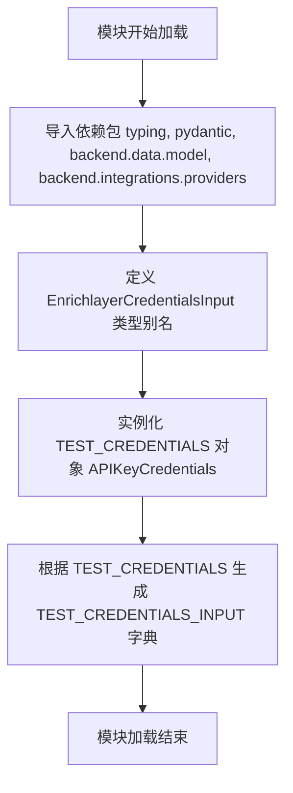

# `AutoGPT\autogpt_platform\backend\backend\blocks\enrichlayer\_auth.py` 详细设计文档

该代码定义了 Enrichlayer API 集成所需的凭证类型别名，并提供了用于测试环境的模拟凭证对象及其字典表示。

## 整体流程



## 类结构

```
EnrichlayerCredentialsInput (Type Alias)
└── CredentialsMetaInput [External]
```

## 全局变量及字段


### `EnrichlayerCredentialsInput`
    
定义 Enrichlayer API 提供商所需的特定凭据输入结构的类型别名，限定为 'api_key' 类型。

类型：`CredentialsMetaInput[Literal[ProviderName.ENRICHLAYER], Literal['api_key']]`
    


### `TEST_CREDENTIALS`
    
包含模拟 API 密钥和元数据的对象，用于测试 Enrichlayer API 集成。

类型：`APIKeyCredentials`
    


### `TEST_CREDENTIALS_INPUT`
    
用于输入字段的测试凭据的字典表示，包含提供商标识符、ID 和标题。

类型：`dict`
    


    

## 全局函数及方法


## 关键组件


### EnrichlayerCredentialsInput
一种严格类型的别名，基于 Pydantic 模型，专门用于定义和验证 Enrichlayer API 所需的 API 密钥凭证输入结构，限定提供程序名称和凭证类型。
### TEST_CREDENTIALS
一个预配置的 APIKeyCredentials 实例，包含模拟的 Enrichlayer API 密钥、提供程序 ID 和元数据，专门用于集成测试和开发环境。
### TEST_CREDENTIALS_INPUT
从 TEST_CREDENTIALS 对象派生的字典表示，格式化为适用于模拟表单输入字段或 API 请求载荷的结构。


## 问题及建议


### 已知问题

-   `TEST_CREDENTIALS_INPUT` 字典通过手动方式构建，依赖于 `APIKeyCredentials` 的具体字段结构。如果上游模型结构发生变化（例如增加必填字段或修改字段名），此处的硬编码容易失效或导致数据不一致。
-   类型别名 `EnrichlayerCredentialsInput` 中硬编码了字符串 `Literal["api_key"]`，缺乏统一的常量来源，容易造成拼写错误或与后端定义不一致。

### 优化建议

-   利用 Pydantic 模型提供的序列化方法（如 `model_dump()` 或 `dict()`）替代手动字典构造，自动生成 `TEST_CREDENTIALS_INPUT`，以确保数据与模型定义始终保持同步。
-   将凭证类型字符串（如 `"api_key"`）定义为全局常量或从共享的枚举/配置中导入，避免在类型注解中直接使用魔法字符串，提高代码的可维护性。
-   考虑将测试凭证（Mock 数据）的管理移至专门的测试配置文件或测试 Fixtures 中，以便更清晰地隔离测试逻辑与生产代码定义。


## 其它


### 设计目标与约束

**设计目标：**
1. **类型安全：** 通过 `Literal` 类型严格限定 `Enrichlayer` 提供商的凭证输入类型，确保在编译期即可检查凭证类型的正确性。
2. **测试支持：** 提供标准的模拟凭证（Mock Credentials）和输入字典，用于单元测试或集成测试环境中，无需依赖真实的外部 API 密钥即可验证逻辑。
3. **数据封装：** 利用 `pydantic.SecretStr` 封装敏感信息（API Key），防止在日志或字符串表示中意外泄露。

**约束：**
1. **硬编码限制：** `TEST_CREDENTIALS` 中的数据是硬编码的，仅适用于测试或开发环境，严禁在生产环境中使用。
2. **模型依赖：** 该模块强依赖于 `backend.data.model` 中定义的 `APIKeyCredentials` 和 `CredentialsMetaInput` 结构，若底层模型结构变更，此处需同步更新。
3. **单一职责：** 该模块仅负责类型定义和测试数据提供，不包含实际的 API 请求逻辑或认证验证逻辑。

### 错误处理与异常设计

**设计策略：**
由于本模块主要包含类型别名定义和常量初始化，本身不包含复杂的业务逻辑代码，因此没有显式的 `try-catch` 块。

**潜在异常来源：**
1. **模块导入阶段：** 如果 `pydantic` 模块未安装或版本不兼容，或者 `backend.data.model` 等内部模块路径错误，将在模块加载时抛出 `ImportError`。
2. **数据初始化阶段：** `TEST_CREDENTIALS` 的实例化依赖于 Pydantic 的模型验证。如果 `SecretStr` 初始化失败或传入的参数不符合 `APIKeyCredentials` 模型定义（例如缺少必填字段），将在模块加载时抛出 `pydantic.ValidationError`。
3. **类型校验阶段：** 当外部代码使用 `EnrichlayerCredentialsInput` 类型进行注解或静态检查时（如使用 mypy），如果传入的 provider 不是 `ProviderName.ENRICHLAYER` 或 type 不是 `"api_key"`，静态类型检查器将报错。

### 数据流与状态机

**数据流：**
1. **配置阶段：** 模块被导入时，首先从 `backend.integrations.providers` 获取 `ProviderName` 枚举，结合 `Literal` 定义出 `EnrichlayerCredentialsInput` 类型。
2. **初始化阶段：** Python 解释器执行模块级代码，实例化 `APIKeyCredentials` 对象生成 `TEST_CREDENTIALS`。此时，字符串 `"mock-enrichlayer-api-key"` 被封装为 `SecretStr` 对象。
3. **转换阶段：** 读取 `TEST_CREDENTIALS` 的属性，构建标准的 Python 字典 `TEST_CREDENTIALS_INPUT`，用于模拟表单输入或序列化场景。

**状态机：**
本模块是无状态的（Stateless）。它定义的是不可变的数据结构（类型别名）和常量对象。没有内部状态的流转或转换逻辑，数据一旦初始化即保持不变。

### 外部依赖与接口契约

**外部依赖：**
1. **pydantic:** 用于数据模型定义和敏感字符串处理 (`SecretStr`)。
2. **typing (Python标准库):** 用于类型提示 (`Literal`)。
3. **backend.data.model:** 依赖 `APIKeyCredentials`（基础凭证模型）和 `CredentialsMetaInput`（凭证元数据输入模型）。
4. **backend.integrations.providers:** 依赖 `ProviderName` 枚举，确保提供商名称的一致性。

**接口契约：**
1. **`EnrichlayerCredentialsInput` 契约：** 要求消费者提供一个符合 `CredentialsMetaInput` 结构的对象，且其 `provider` 字段必须严格等于 `ProviderName.ENRICHLAYER`，`type` 字段必须严格等于字符串 `"api_key"`。
2. **`TEST_CREDENTIALS` 契约：** 提供一个完全符合 `APIKeyCredentials` 接口的对象实例。消费者可以像操作真实的 API Key 凭证一样操作该对象（例如获取 `id`, `provider`, 或通过 `get_secret_value()` 获取明文 Key）。
3. **`TEST_CREDENTIALS_INPUT` 契约：** 提供一个符合 `CredentialsMetaInput` 序列化格式的字典，键包含 `provider`, `id`, `type`, `title`，值类型均为字符串（或 None）。

### 安全性考虑

1. **敏感信息保护：** 代码中使用 `pydantic.SecretStr` 存储 `api_key`。这意味着直接打印对象或调用 `str()` 不会返回真实的密钥值，而是返回类似 `**********` 的掩码，从而降低日志泄露风险。
2. **测试数据隔离：** `TEST_CREDENTIALS` 明确标注了 "Mock" 和测试用途，且生成的 ID 使用了 UUID 格式（虽然是硬编码的），以避免与生产环境数据混淆。
3. **无硬编码真实密钥：** 虽然代码中有硬编码字符串，但值明确为 `"mock-enrichlayer-api-key"`，确保不会在代码库中意外提交真实的 API 凭证。

    