# `.\AutoGPT\autogpt_platform\backend\backend\blocks\enrichlayer\linkedin.py` 详细设计文档

This module provides blocks for integrating with the Enrichlayer API to fetch LinkedIn profile data, look up profiles by person's information or role, and retrieve profile pictures.

## 整体流程

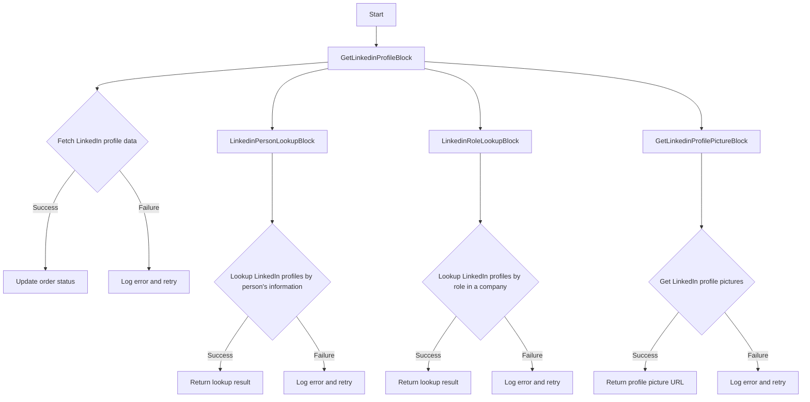

## 类结构

```
Block (抽象基类)
├── GetLinkedinProfileBlock
│   ├── Input
│   ├── Output
│   └── _fetch_profile
├── LinkedinPersonLookupBlock
│   ├── Input
│   ├── Output
│   └── _lookup_person
├── LinkedinRoleLookupBlock
│   ├── Input
│   ├── Output
│   └── _lookup_role
└── GetLinkedinProfilePictureBlock
   ├── Input
   ├── Output
   └── _get_profile_picture
```

## 全局变量及字段


### `logger`
    
Logger instance for logging messages

类型：`logging.Logger`
    


### `TEST_CREDENTIALS`
    
Test credentials for Enrichlayer API

类型：`EnrichlayerCredentialsInput`
    


### `TEST_CREDENTIALS_INPUT`
    
Test input credentials for Enrichlayer API

类型：`EnrichlayerCredentialsInput`
    


### `EnrichlayerClient`
    
Client class for interacting with Enrichlayer API

类型：`EnrichlayerClient`
    


### `Experience`
    
Class representing a person's experience

类型：`Experience`
    


### `FallbackToCache`
    
Enum for cache fallback strategy

类型：`FallbackToCache`
    


### `PersonLookupResponse`
    
Class representing a person lookup response

类型：`PersonLookupResponse`
    


### `PersonProfileResponse`
    
Class representing a person profile response

类型：`PersonProfileResponse`
    


### `RoleLookupResponse`
    
Class representing a role lookup response

类型：`RoleLookupResponse`
    


### `UseCache`
    
Enum for cache usage strategy

类型：`UseCache`
    


### `MediaFileType`
    
Type for media file data

类型：`MediaFileType`
    


### `GetLinkedinProfileBlock.Input.linkedin_url`
    
LinkedIn profile URL to fetch data from

类型：`str`
    


### `GetLinkedinProfileBlock.Input.fallback_to_cache`
    
Cache usage if live fetch fails

类型：`FallbackToCache`
    


### `GetLinkedinProfileBlock.Input.use_cache`
    
Cache utilization strategy

类型：`UseCache`
    


### `GetLinkedinProfileBlock.Input.include_skills`
    
Include skills data

类型：`bool`
    


### `GetLinkedinProfileBlock.Input.include_inferred_salary`
    
Include inferred salary data

类型：`bool`
    


### `GetLinkedinProfileBlock.Input.include_personal_email`
    
Include personal email

类型：`bool`
    


### `GetLinkedinProfileBlock.Input.include_personal_contact_number`
    
Include personal contact number

类型：`bool`
    


### `GetLinkedinProfileBlock.Input.include_social_media`
    
Include social media profiles

类型：`bool`
    


### `GetLinkedinProfileBlock.Input.include_extra`
    
Include additional data

类型：`bool`
    


### `GetLinkedinProfileBlock.Input.credentials`
    
Enrichlayer API credentials

类型：`EnrichlayerCredentialsInput`
    


### `LinkedinPersonLookupBlock.Input.first_name`
    
Person's first name

类型：`str`
    


### `LinkedinPersonLookupBlock.Input.last_name`
    
Person's last name

类型：`str | None`
    


### `LinkedinPersonLookupBlock.Input.company_domain`
    
Domain of the company they work for (optional)

类型：`str`
    


### `LinkedinPersonLookupBlock.Input.location`
    
Person's location (optional)

类型：`Optional[str]`
    


### `LinkedinPersonLookupBlock.Input.title`
    
Person's job title (optional)

类型：`Optional[str]`
    


### `LinkedinPersonLookupBlock.Input.include_similarity_checks`
    
Include similarity checks

类型：`bool`
    


### `LinkedinPersonLookupBlock.Input.enrich_profile`
    
Enrich the profile with additional data

类型：`bool`
    


### `LinkedinPersonLookupBlock.Input.credentials`
    
Enrichlayer API credentials

类型：`EnrichlayerCredentialsInput`
    


### `LinkedinRoleLookupBlock.Input.role`
    
Role title (e.g., CEO, CTO)

类型：`str`
    


### `LinkedinRoleLookupBlock.Input.company_name`
    
Name of the company

类型：`str`
    


### `LinkedinRoleLookupBlock.Input.enrich_profile`
    
Enrich the profile with additional data

类型：`bool`
    


### `LinkedinRoleLookupBlock.Input.credentials`
    
Enrichlayer API credentials

类型：`EnrichlayerCredentialsInput`
    


### `GetLinkedinProfilePictureBlock.Input.linkedin_profile_url`
    
LinkedIn profile URL

类型：`str`
    


### `GetLinkedinProfilePictureBlock.Input.credentials`
    
Enrichlayer API credentials

类型：`EnrichlayerCredentialsInput`
    
    

## 全局函数及方法


### `_fetch_profile`

Fetch LinkedIn profile data using Enrichlayer API.

参数：

- `credentials`：`APIKeyCredentials`，Enrichlayer API credentials
- `linkedin_url`：`str`，LinkedIn profile URL to fetch data from
- `fallback_to_cache`：`FallbackToCache`，Cache usage if live fetch fails
- `use_cache`：`UseCache`，Cache utilization strategy
- `include_skills`：`bool`，Include skills data
- `include_inferred_salary`：`bool`，Include inferred salary data
- `include_personal_email`：`bool`，Include personal email
- `include_personal_contact_number`：`bool`，Include personal contact number
- `include_social_media`：`bool`，Include social media profiles
- `include_extra`：`bool`，Include additional data

返回值：`PersonProfileResponse`，LinkedIn profile data

#### 流程图

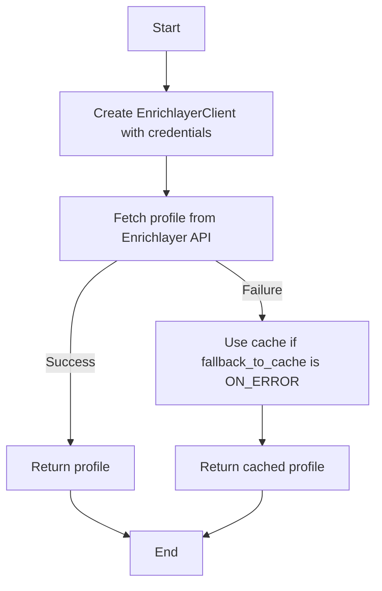

#### 带注释源码

```python
@staticmethod
async def _fetch_profile(
    credentials: APIKeyCredentials,
    linkedin_url: str,
    fallback_to_cache: FallbackToCache = FallbackToCache.ON_ERROR,
    use_cache: UseCache = UseCache.IF_PRESENT,
    include_skills: bool = False,
    include_inferred_salary: bool = False,
    include_personal_email: bool = False,
    include_personal_contact_number: bool = False,
    include_social_media: bool = False,
    include_extra: bool = False,
):
    client = EnrichlayerClient(credentials)
    profile = await client.fetch_profile(
        linkedin_url=linkedin_url,
        fallback_to_cache=fallback_to_cache,
        use_cache=use_cache,
        include_skills=include_skills,
        include_inferred_salary=include_inferred_salary,
        include_personal_email=include_personal_email,
        include_personal_contact_number=include_personal_contact_number,
        include_social_media=include_social_media,
        include_extra=include_extra,
    )
    return profile
```


### `_lookup_person`

Lookup LinkedIn profiles by person's information using Enrichlayer API.

参数：

- `credentials`：`APIKeyCredentials`，Enrichlayer API credentials
- `first_name`：`str`，Person's first name
- `company_domain`：`str`，Domain of the company they work for (optional)
- `last_name`：`str | None`，Person's last name (optional)
- `location`：`Optional[str]`，Person's location (optional)
- `title`：`Optional[str]`，Person's job title (optional)
- `include_similarity_checks`：`bool`，Include similarity checks
- `enrich_profile`：`bool`，Enrich the profile with additional data

返回值：`PersonLookupResponse`，LinkedIn profile lookup result

#### 流程图

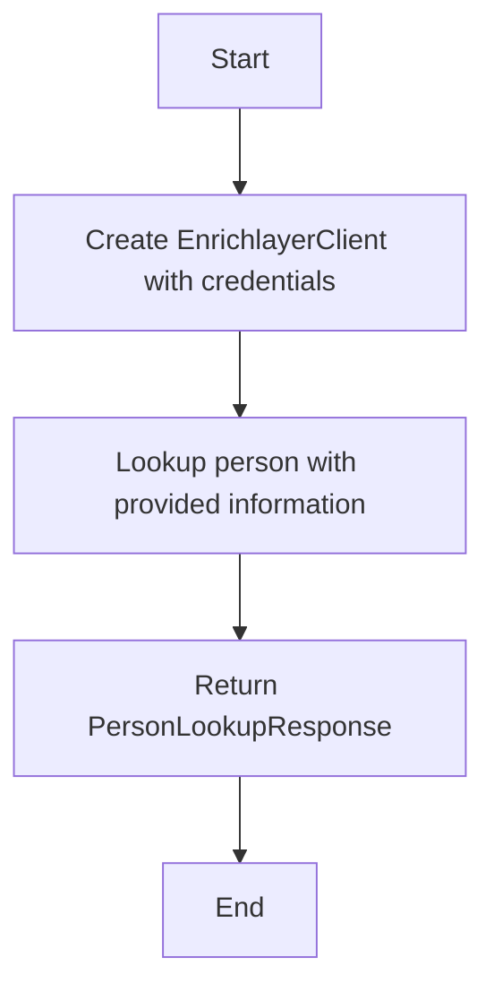

#### 带注释源码

```python
@staticmethod
async def _lookup_person(
    credentials: APIKeyCredentials,
    first_name: str,
    company_domain: str,
    last_name: str | None = None,
    location: Optional[str] = None,
    title: Optional[str] = None,
    include_similarity_checks: bool = False,
    enrich_profile: bool = False,
):
    client = EnrichlayerClient(credentials=credentials)
    lookup_result = await client.lookup_person(
        first_name=first_name,
        last_name=last_name,
        company_domain=company_domain,
        location=location,
        title=title,
        include_similarity_checks=include_similarity_checks,
        enrich_profile=enrich_profile,
    )
    return lookup_result
```


### `_lookup_role`

Lookup LinkedIn profiles by role in a company using Enrichlayer API.

参数：

- `credentials`：`APIKeyCredentials`，Enrichlayer API credentials
- `role`：`str`，Role title (e.g., CEO, CTO)
- `company_name`：`str`，Name of the company
- `enrich_profile`：`bool`，Enrich the profile with additional data (默认值：False)

返回值：`RoleLookupResponse`，LinkedIn role lookup result

#### 流程图

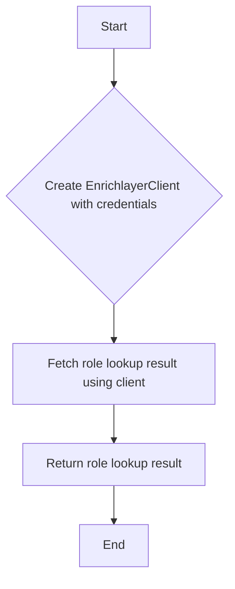

#### 带注释源码

```python
async def _lookup_role(
    self,
    credentials: APIKeyCredentials,
    role: str,
    company_name: str,
    enrich_profile: bool = False,
):
    client = EnrichlayerClient(credentials=credentials)
    role_lookup_result = await client.lookup_role(
        role=role,
        company_name=company_name,
        enrich_profile=enrich_profile,
    )
    return role_lookup_result
```


### `_get_profile_picture`

This method fetches the LinkedIn profile picture URL using the Enrichlayer API.

参数：

- `credentials`：`APIKeyCredentials`，Enrichlayer API credentials
- `linkedin_profile_url`：`str`，LinkedIn profile URL

返回值：`str`，LinkedIn profile picture URL

#### 流程图

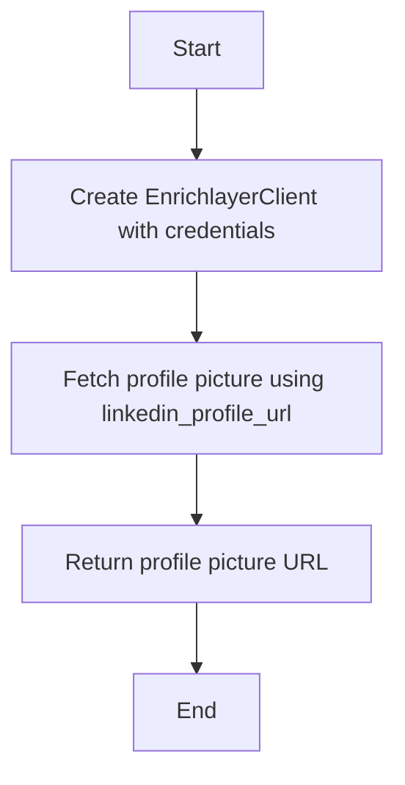

#### 带注释源码

```python
    @staticmethod
    async def _get_profile_picture(
        credentials: APIKeyCredentials, linkedin_profile_url: str
    ):
        client = EnrichlayerClient(credentials=credentials)
        profile_picture_response = await client.get_profile_picture(
            linkedin_profile_url=linkedin_profile_url,
        )
        return profile_picture_response.profile_picture_url
``` 


### `GetLinkedinProfileBlock.__init__`

Initialize the `GetLinkedinProfileBlock` class.

参数：

- `self`：`None`，The instance of the class being initialized.
- `id`：`str`，The unique identifier for the block.
- `description`：`str`，A description of the block's functionality.
- `categories`：`set`，A set of categories that the block belongs to.
- `input_schema`：`BlockSchemaInput`，The input schema for the block.
- `output_schema`：`BlockSchemaOutput`，The output schema for the block.
- `test_input`：`dict`，The test input data for the block.
- `test_output`：`list`，The test output data for the block.
- `test_credentials`：`APIKeyCredentials`，The test credentials for the block.
- `test_mock`：`dict`，The test mock data for the block's methods.

返回值：`None`，No return value.

#### 流程图

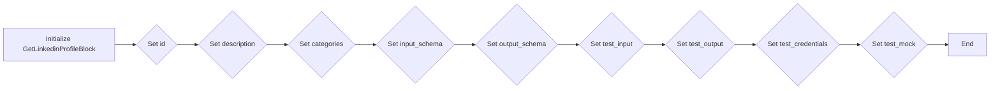

#### 带注释源码

```python
def __init__(self):
    """Initialize GetLinkedinProfileBlock."""
    super().__init__(
        id="f6e0ac73-4f1d-4acb-b4b7-b67066c5984e",
        description="Fetch LinkedIn profile data using Enrichlayer",
        categories={BlockCategory.SOCIAL},
        input_schema=GetLinkedinProfileBlock.Input,
        output_schema=GetLinkedinProfileBlock.Output,
        test_input={
            "linkedin_url": "https://www.linkedin.com/in/williamhgates/",
            "include_skills": True,
            "include_social_media": True,
            "credentials": TEST_CREDENTIALS_INPUT,
        },
        test_output=[
            (
                "profile",
                PersonProfileResponse(
                    public_identifier="williamhgates",
                    full_name="Bill Gates",
                    occupation="Co-chair at Bill & Melinda Gates Foundation",
                    experiences=[
                        Experience(
                            company="Bill & Melinda Gates Foundation",
                            title="Co-chair",
                            starts_at={"year": 2000},
                        )
                    ],
                ),
            )
        ],
        test_credentials=TEST_CREDENTIALS,
        test_mock={
            "_fetch_profile": lambda *args, **kwargs: PersonProfileResponse(
                public_identifier="williamhgates",
                full_name="Bill Gates",
                occupation="Co-chair at Bill & Melinda Gates Foundation",
                experiences=[
                    Experience(
                        company="Bill & Melinda Gates Foundation",
                        title="Co-chair",
                        starts_at={"year": 2000},
                    )
                ],
            ),
        },
    )
```


### GetLinkedinProfileBlock.run

Run the block to fetch LinkedIn profile data.

参数：

- `input_data`：`Input`，Block的输入参数
- `credentials`：`APIKeyCredentials`，Enrichlayer API的凭证
- `**kwargs`：额外的关键字参数

返回值：`BlockOutput`，Block的输出结果

#### 流程图

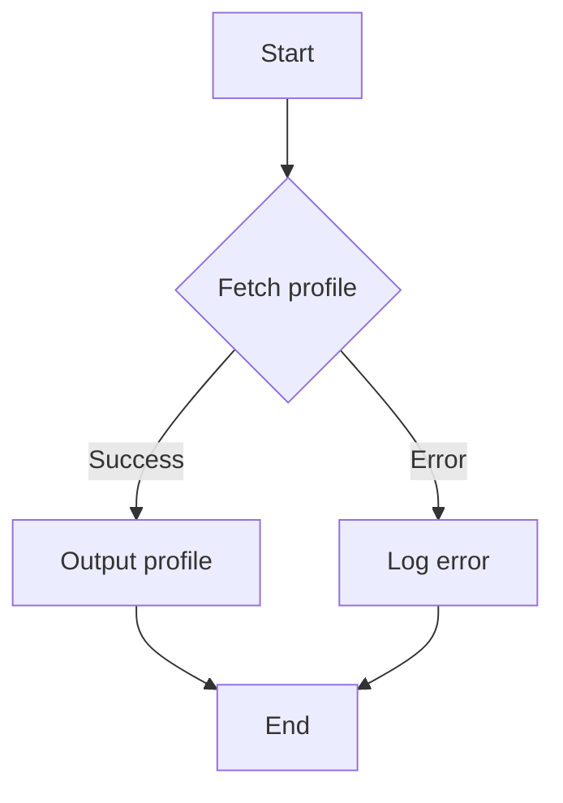

#### 带注释源码

```python
async def run(
    self, input_data: Input, *, credentials: APIKeyCredentials, **kwargs
) -> BlockOutput:
    """
    Run the block to fetch LinkedIn profile data.

    Args:
        input_data: Input parameters for the block
        credentials: API key credentials for Enrichlayer
        **kwargs: Additional keyword arguments

    Yields:
        Tuples of (output_name, output_value)
    """
    try:
        profile = await self._fetch_profile(
            credentials=credentials,
            linkedin_url=input_data.linkedin_url,
            fallback_to_cache=input_data.fallback_to_cache,
            use_cache=input_data.use_cache,
            include_skills=input_data.include_skills,
            include_inferred_salary=input_data.include_inferred_salary,
            include_personal_email=input_data.include_personal_email,
            include_personal_contact_number=input_data.include_personal_contact_number,
            include_social_media=input_data.include_social_media,
            include_extra=input_data.include_extra,
        )
        yield "profile", profile
    except Exception as e:
        logger.error(f"Error fetching LinkedIn profile: {str(e)}")
        yield "error", str(e)
```


### GetLinkedinProfileBlock.__init__

Initialize GetLinkedinProfileBlock.

参数：

- 无

返回值：无

#### 流程图

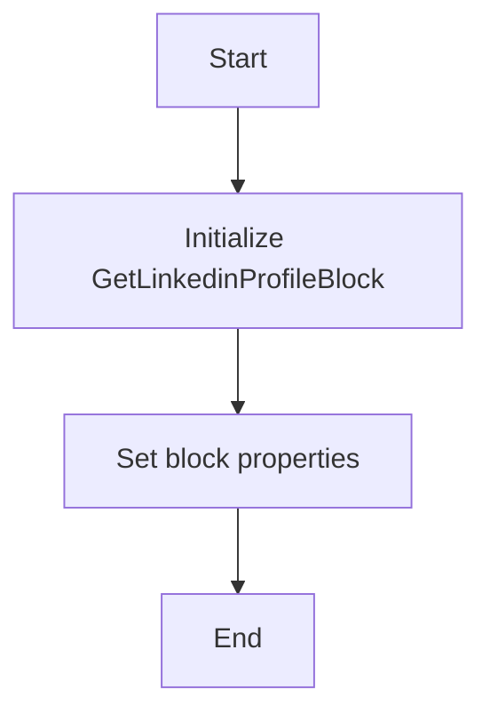

#### 带注释源码

```python
def __init__(self):
    """Initialize GetLinkedinProfileBlock."""
    super().__init__(
        id="f6e0ac73-4f1d-4acb-b4b7-b67066c5984e",
        description="Fetch LinkedIn profile data using Enrichlayer",
        categories={BlockCategory.SOCIAL},
        input_schema=GetLinkedinProfileBlock.Input,
        output_schema=GetLinkedinProfileBlock.Output,
        test_input={
            "linkedin_url": "https://www.linkedin.com/in/williamhgates/",
            "include_skills": True,
            "include_social_media": True,
            "credentials": TEST_CREDENTIALS_INPUT,
        },
        test_output=[
            (
                "profile",
                PersonProfileResponse(
                    public_identifier="williamhgates",
                    full_name="Bill Gates",
                    occupation="Co-chair at Bill & Melinda Gates Foundation",
                    experiences=[
                        Experience(
                            company="Bill & Melinda Gates Foundation",
                            title="Co-chair",
                            starts_at={"year": 2000},
                        )
                    ],
                ),
            )
        ],
        test_credentials=TEST_CREDENTIALS,
        test_mock={
            "_fetch_profile": lambda *args, **kwargs: PersonProfileResponse(
                public_identifier="williamhgates",
                full_name="Bill Gates",
                occupation="Co-chair at Bill & Melinda Gates Foundation",
                experiences=[
                    Experience(
                        company="Bill & Melinda Gates Foundation",
                        title="Co-chair",
                        starts_at={"year": 2000},
                    )
                ],
            ),
        },
    )
```


### GetLinkedinProfileBlock._fetch_profile

Fetch LinkedIn profile data using Enrichlayer API.

参数：

- `credentials`：`APIKeyCredentials`，Enrichlayer API credentials
- `linkedin_url`：`str`，LinkedIn profile URL to fetch data from
- `fallback_to_cache`：`FallbackToCache`，Cache usage if live fetch fails
- `use_cache`：`UseCache`，Cache utilization strategy
- `include_skills`：`bool`，Include skills data
- `include_inferred_salary`：`bool`，Include inferred salary data
- `include_personal_email`：`bool`，Include personal email
- `include_personal_contact_number`：`bool`，Include personal contact number
- `include_social_media`：`bool`，Include social media profiles
- `include_extra`：`bool`，Include additional data

返回值：`PersonProfileResponse`，LinkedIn profile data

#### 流程图


#### 带注释源码

```python
@staticmethod
async def _fetch_profile(
    credentials: APIKeyCredentials,
    linkedin_url: str,
    fallback_to_cache: FallbackToCache = FallbackToCache.ON_ERROR,
    use_cache: UseCache = UseCache.IF_PRESENT,
    include_skills: bool = False,
    include_inferred_salary: bool = False,
    include_personal_email: bool = False,
    include_personal_contact_number: bool = False,
    include_social_media: bool = False,
    include_extra: bool = False,
):
    client = EnrichlayerClient(credentials)
    profile = await client.fetch_profile(
        linkedin_url=linkedin_url,
        fallback_to_cache=fallback_to_cache,
        use_cache=use_cache,
        include_skills=include_skills,
        include_inferred_salary=include_inferred_salary,
        include_personal_email=include_personal_email,
        include_personal_contact_number=include_personal_contact_number,
        include_social_media=include_social_media,
        include_extra=include_extra,
    )
    return profile
``` 


### GetLinkedinProfileBlock.run

Run the block to fetch LinkedIn profile data.

参数：

- `input_data`：`Input`，Block的输入参数
- `credentials`：`APIKeyCredentials`，Enrichlayer API的凭证
- `**kwargs`：额外的关键字参数

返回值：`BlockOutput`，Block的输出结果

#### 流程图

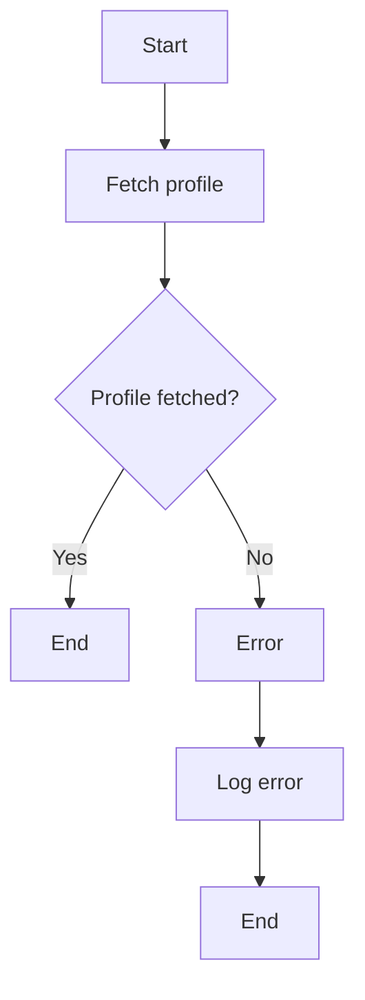

#### 带注释源码

```python
async def run(
    self, input_data: Input, *, credentials: APIKeyCredentials, **kwargs
) -> BlockOutput:
    """
    Run the block to fetch LinkedIn profile data.

    Args:
        input_data: Input parameters for the block
        credentials: API key credentials for Enrichlayer
        **kwargs: Additional keyword arguments

    Yields:
        Tuples of (output_name, output_value)
    """
    try:
        profile = await self._fetch_profile(
            credentials=credentials,
            linkedin_url=input_data.linkedin_url,
            fallback_to_cache=input_data.fallback_to_cache,
            use_cache=input_data.use_cache,
            include_skills=input_data.include_skills,
            include_inferred_salary=input_data.include_inferred_salary,
            include_personal_email=input_data.include_personal_email,
            include_personal_contact_number=input_data.include_personal_contact_number,
            include_social_media=input_data.include_social_media,
            include_extra=input_data.include_extra,
        )
        yield "profile", profile
    except Exception as e:
        logger.error(f"Error fetching LinkedIn profile: {str(e)}")
        yield "error", str(e)
```


### `LinkedinPersonLookupBlock.__init__`

Initialize `LinkedinPersonLookupBlock`.

参数：

- `credentials`：`EnrichlayerCredentialsInput`，Enrichlayer API credentials

返回值：无

#### 流程图

```mermaid
classDiagram
    class LinkedinPersonLookupBlock {
        +id: str
        +description: str
        +categories: set
        +input_schema: BlockSchemaInput
        +output_schema: BlockSchemaOutput
        +test_input: dict
        +test_output: list
        +test_credentials: APIKeyCredentials
        +test_mock: dict
    }
    LinkedinPersonLookupBlock "has" Input
    LinkedinPersonLookupBlock "has" Output
    Input "has" SchemaField
    Output "has" SchemaField
    SchemaField "has" description
    SchemaField "has" placeholder
    SchemaField "has" default
    SchemaField "has" advanced
    SchemaField "has" CredentialsField
    SchemaField "has" SchemaField
    SchemaField "has" SchemaField
    SchemaField "has" SchemaField
    SchemaField "has" SchemaField
    SchemaField "has" SchemaField
    SchemaField "has" SchemaField
    SchemaField "has" SchemaField
    SchemaField "has" SchemaField
    SchemaField "has" SchemaField
    SchemaField "has" SchemaField
    SchemaField "has" SchemaField
    SchemaField "has" SchemaField
    SchemaField "has" SchemaField
    SchemaField "has" SchemaField
    SchemaField "has" SchemaField
    SchemaField "has" SchemaField
    SchemaField "has" SchemaField
    SchemaField "has" SchemaField
    SchemaField "has" SchemaField
    SchemaField "has" SchemaField
    SchemaField "has" SchemaField
    SchemaField "has" SchemaField
    SchemaField "has" SchemaField
    SchemaField "has" SchemaField
    SchemaField "has" SchemaField
    SchemaField "has" SchemaField
    SchemaField "has" SchemaField
    SchemaField "has" SchemaField
    SchemaField "has" SchemaField
    SchemaField "has" SchemaField
    SchemaField "has" SchemaField
    SchemaField "has" SchemaField
    SchemaField "has" SchemaField
    SchemaField "has" SchemaField
    SchemaField "has" SchemaField
    SchemaField "has" SchemaField
    SchemaField "has" SchemaField
    SchemaField "has" SchemaField
    SchemaField "has" SchemaField
    SchemaField "has" SchemaField
    SchemaField "has" SchemaField
    SchemaField "has" SchemaField
    SchemaField "has" SchemaField
    SchemaField "has" SchemaField
    SchemaField "has" SchemaField
    SchemaField "has" SchemaField
    SchemaField "has" SchemaField
    SchemaField "has" SchemaField
    SchemaField "has" SchemaField
    SchemaField "has" SchemaField
    SchemaField "has" SchemaField
    SchemaField "has" SchemaField
    SchemaField "has" SchemaField
    SchemaField "has" SchemaField
    SchemaField "has" SchemaField
    SchemaField "has" SchemaField
    SchemaField "has" SchemaField
    SchemaField "has" SchemaField
    SchemaField "has" SchemaField
    SchemaField "has" SchemaField
    SchemaField "has" SchemaField
    SchemaField "has" SchemaField
    SchemaField "has" SchemaField
    SchemaField "has" SchemaField
    SchemaField "has" SchemaField
    SchemaField "has" SchemaField
    SchemaField "has" SchemaField
    SchemaField "has" SchemaField
    SchemaField "has" SchemaField
    SchemaField "has" SchemaField
    SchemaField "has" SchemaField
    SchemaField "has" SchemaField
    SchemaField "has" SchemaField
    SchemaField "has" SchemaField
    SchemaField "has" SchemaField
    SchemaField "has" SchemaField
    SchemaField "has" SchemaField
    SchemaField "has" SchemaField
    SchemaField "has" SchemaField
    SchemaField "has" SchemaField
    SchemaField "has" SchemaField
    SchemaField "has" SchemaField
    SchemaField "has" SchemaField
    SchemaField "has" SchemaField
    SchemaField "has" SchemaField
    SchemaField "has" SchemaField
    SchemaField "has" SchemaField
    SchemaField "has" SchemaField
    SchemaField "has" SchemaField
    SchemaField "has" SchemaField
    SchemaField "has" SchemaField
    SchemaField "has" SchemaField
    SchemaField "has" SchemaField
    SchemaField "has" SchemaField
    SchemaField "has" SchemaField
    SchemaField "has" SchemaField
    SchemaField "has" SchemaField
    SchemaField "has" SchemaField
    SchemaField "has" SchemaField
    SchemaField "has" SchemaField
    SchemaField "has" SchemaField
    SchemaField "has" SchemaField
    SchemaField "has" SchemaField
    SchemaField "has" SchemaField
    SchemaField "has" SchemaField
    SchemaField "has" SchemaField
    SchemaField "has" SchemaField
    SchemaField "has" SchemaField
    SchemaField "has" SchemaField
    SchemaField "has" SchemaField
    SchemaField "has" SchemaField
    SchemaField "has" SchemaField
    SchemaField "has" SchemaField
    SchemaField "has" SchemaField
    SchemaField "has" SchemaField
    SchemaField "has" SchemaField
    SchemaField "has" SchemaField
    SchemaField "has" SchemaField
    SchemaField "has" SchemaField
    SchemaField "has" SchemaField
    SchemaField "has" SchemaField
    SchemaField "has" SchemaField
    SchemaField "has" SchemaField
    SchemaField "has" SchemaField
    SchemaField "has" SchemaField
    SchemaField "has" SchemaField
    SchemaField "has" SchemaField
    SchemaField "has" SchemaField
    SchemaField "has" SchemaField
    SchemaField "has" SchemaField
    SchemaField "has" SchemaField
    SchemaField "has" SchemaField
    SchemaField "has" SchemaField
    SchemaField "has" SchemaField
    SchemaField "has" SchemaField
    SchemaField "has" SchemaField
    SchemaField "has" SchemaField
    SchemaField "has" SchemaField
    SchemaField "has" SchemaField
    SchemaField "has" SchemaField
    SchemaField "has" SchemaField
    SchemaField "has" SchemaField
    SchemaField "has" SchemaField
    SchemaField "has" SchemaField
    SchemaField "has" SchemaField
    SchemaField "has" SchemaField
    SchemaField "has" SchemaField
    SchemaField "has" SchemaField
    SchemaField "has" SchemaField
    SchemaField "has" SchemaField
    SchemaField "has" SchemaField
    SchemaField "has" SchemaField
    SchemaField "has" SchemaField
    SchemaField "has" SchemaField
    SchemaField "has" SchemaField
    SchemaField "has" SchemaField
    SchemaField "has" SchemaField
    SchemaField "has" SchemaField
    SchemaField "has" SchemaField
    SchemaField "has" SchemaField
    SchemaField "has" SchemaField
    SchemaField "has" SchemaField
    SchemaField "has" SchemaField
    SchemaField "has" SchemaField
    SchemaField "has" SchemaField
    SchemaField "has" SchemaField
    SchemaField "has" SchemaField
    SchemaField "has" SchemaField
    SchemaField "has" SchemaField
    SchemaField "has" SchemaField
    SchemaField "has" SchemaField
    SchemaField "has" SchemaField
    SchemaField "has" SchemaField
    SchemaField "has" SchemaField
    SchemaField "has" SchemaField
    SchemaField "has" SchemaField
    SchemaField "has" SchemaField
    SchemaField "has" SchemaField
    SchemaField "has" SchemaField
    SchemaField "has" SchemaField
    SchemaField "has" SchemaField
    SchemaField "has" SchemaField
    SchemaField "has" SchemaField
    SchemaField "has" SchemaField
    SchemaField "has" SchemaField
    SchemaField "has" SchemaField
    SchemaField "has" SchemaField
    SchemaField "has" SchemaField
    SchemaField "has" SchemaField
    SchemaField "has" SchemaField
    SchemaField "has" SchemaField
    SchemaField "has" SchemaField
    SchemaField "has" SchemaField
    SchemaField "has" SchemaField
    SchemaField "has" SchemaField
    SchemaField "has" SchemaField
    SchemaField "has" SchemaField
    SchemaField "has" SchemaField
    SchemaField "has" SchemaField
    SchemaField "has" SchemaField
    SchemaField "has" SchemaField
    SchemaField "has" SchemaField
    SchemaField "has" SchemaField
    SchemaField "has" SchemaField
    SchemaField "has" SchemaField
    SchemaField "has" SchemaField
    SchemaField "has" SchemaField
    SchemaField "has" SchemaField
    SchemaField "has" SchemaField
    SchemaField "has" SchemaField
    SchemaField "has" SchemaField
    SchemaField "has" SchemaField
    SchemaField "has" SchemaField
    SchemaField "has" SchemaField
    SchemaField "has" SchemaField
    SchemaField "has" SchemaField
    SchemaField "has" SchemaField
    SchemaField "has" SchemaField
    SchemaField "has" SchemaField
    SchemaField "has" SchemaField
    SchemaField "has" SchemaField
    SchemaField "has" SchemaField
    SchemaField "has" SchemaField
    SchemaField "has" SchemaField
    SchemaField "has" SchemaField
    SchemaField "has" SchemaField
    SchemaField "has" SchemaField
    SchemaField "has" SchemaField
    SchemaField "has" SchemaField
    SchemaField "has" SchemaField
    SchemaField "has" SchemaField
    SchemaField "has" SchemaField
    SchemaField "has" SchemaField
    SchemaField "has" SchemaField
    SchemaField "has" SchemaField
    SchemaField "has" SchemaField
    SchemaField "has" SchemaField
    SchemaField "has" SchemaField
    SchemaField "has" SchemaField
    SchemaField "has" SchemaField
    SchemaField "has" SchemaField
    SchemaField "has" SchemaField
    SchemaField "has" SchemaField
    SchemaField "has" SchemaField
    SchemaField "has" SchemaField
    SchemaField "has" SchemaField
    SchemaField "has" SchemaField
    SchemaField "has" SchemaField
    SchemaField "has" SchemaField
    SchemaField "has" SchemaField
    SchemaField "has" SchemaField
    SchemaField "has" SchemaField
    SchemaField "has" SchemaField
    SchemaField "has" SchemaField
    SchemaField "has" SchemaField
    SchemaField "has" SchemaField
    SchemaField "has" SchemaField
    SchemaField "has" SchemaField
    SchemaField "has" SchemaField
    SchemaField "has" SchemaField
    SchemaField "has" SchemaField
    SchemaField "has" SchemaField
    SchemaField "has" SchemaField
    SchemaField "has" SchemaField
    SchemaField "has" SchemaField
    SchemaField "has" SchemaField
    SchemaField "has" SchemaField
    SchemaField "has" SchemaField
    SchemaField "has" SchemaField
    SchemaField "has" SchemaField
    SchemaField "has" SchemaField
    SchemaField "has" SchemaField
    SchemaField "has" SchemaField
    SchemaField "has" SchemaField
    SchemaField "has" SchemaField
    SchemaField "has" SchemaField
    SchemaField "has" SchemaField
    SchemaField "has" SchemaField
    SchemaField "has" SchemaField
    SchemaField "has" SchemaField
    SchemaField "has" SchemaField
    SchemaField "has" SchemaField
    SchemaField "has" SchemaField
    SchemaField "has" SchemaField
    SchemaField "has" SchemaField
    SchemaField "has" SchemaField
    SchemaField "has" SchemaField
    SchemaField "has" SchemaField
    SchemaField "has" SchemaField
    SchemaField "has" SchemaField
    SchemaField "has" SchemaField
    SchemaField "has" SchemaField
    SchemaField "has" SchemaField
    SchemaField "has" SchemaField
    SchemaField "has" SchemaField
    SchemaField "has" SchemaField
    SchemaField "has" SchemaField
    SchemaField "has" SchemaField
    SchemaField "has" SchemaField
    SchemaField "has" SchemaField
    SchemaField "has" SchemaField
    SchemaField "has" SchemaField
    SchemaField "has" SchemaField
    SchemaField "has" SchemaField
    SchemaField "has" SchemaField
    SchemaField "has" SchemaField
    SchemaField "has" SchemaField
    SchemaField "has" SchemaField
    SchemaField "has" SchemaField
    SchemaField "has" SchemaField
    SchemaField "has" SchemaField
    SchemaField "has" SchemaField
    SchemaField "has" SchemaField
    SchemaField "has" SchemaField
    SchemaField "has" SchemaField
    SchemaField "has" SchemaField
    SchemaField "has" SchemaField
    SchemaField "has" SchemaField
    SchemaField "has" SchemaField
    SchemaField "has" SchemaField
    SchemaField "has" SchemaField
    SchemaField "has" SchemaField
    SchemaField "has" SchemaField
    SchemaField "has" SchemaField
    SchemaField "has" SchemaField
    SchemaField "has" SchemaField
    SchemaField "has" SchemaField
    SchemaField "has" SchemaField
    SchemaField "has" SchemaField
    SchemaField "has" SchemaField
    SchemaField "has" SchemaField
    SchemaField "has" SchemaField
    SchemaField "has" SchemaField
    SchemaField "has" SchemaField
    SchemaField "has" SchemaField
    SchemaField "has" SchemaField
    SchemaField "has" SchemaField
    SchemaField "has" SchemaField
    SchemaField "has" SchemaField
    SchemaField "has" SchemaField
    SchemaField "has" SchemaField
    SchemaField "has" SchemaField
    SchemaField "has" SchemaField
    SchemaField "has" SchemaField
    SchemaField "has" SchemaField
    SchemaField "has" SchemaField
    SchemaField "has" SchemaField
    SchemaField "has" SchemaField
    SchemaField "has" SchemaField
    SchemaField "has" SchemaField
    SchemaField "has" SchemaField
    SchemaField "has" SchemaField
    SchemaField "has" SchemaField
    SchemaField "has" SchemaField
    SchemaField "has" SchemaField
    SchemaField "has" SchemaField
    SchemaField "has" SchemaField
    SchemaField "has" SchemaField
    SchemaField "has" SchemaField
    SchemaField "has" SchemaField
    SchemaField "has" SchemaField
    SchemaField "has" SchemaField
    SchemaField "has" SchemaField
    SchemaField "has" SchemaField
    SchemaField "has" SchemaField
    SchemaField "has" SchemaField
    SchemaField "has" SchemaField
    SchemaField "has" SchemaField
    SchemaField "has" SchemaField
    SchemaField "has" SchemaField
    SchemaField "has" SchemaField
    SchemaField "has" SchemaField
    SchemaField "has" SchemaField
    SchemaField "has" SchemaField
    SchemaField "has" SchemaField
    SchemaField "has" SchemaField
    SchemaField "has" SchemaField
    SchemaField "has" SchemaField
    SchemaField "has" SchemaField
    SchemaField "has" SchemaField
    SchemaField "has" SchemaField
    SchemaField "has" SchemaField
    SchemaField "has" SchemaField
    SchemaField "has" SchemaField
    SchemaField "has" SchemaField
    SchemaField "has" SchemaField
    SchemaField "has" SchemaField
    SchemaField "has" SchemaField
    SchemaField "has" SchemaField
    SchemaField "has" SchemaField
    SchemaField "has" SchemaField
    SchemaField "has" SchemaField
    SchemaField "has" SchemaField
    SchemaField "has" SchemaField
    SchemaField "has" SchemaField
    SchemaField "has" SchemaField
    SchemaField "has" SchemaField
    SchemaField "has" SchemaField
    SchemaField "has" SchemaField
    SchemaField "has" SchemaField
    SchemaField "has" SchemaField
    SchemaField "has" SchemaField
    SchemaField "has" SchemaField
    SchemaField "has" SchemaField
    SchemaField "has" SchemaField
    SchemaField "has" SchemaField
    SchemaField "has" SchemaField
    SchemaField "has" SchemaField
    SchemaField "has" SchemaField
    SchemaField "has" SchemaField
    SchemaField "has" SchemaField
    SchemaField "has" SchemaField
    SchemaField "has" SchemaField
    SchemaField "has" SchemaField
    SchemaField "has" SchemaField
    SchemaField "has" SchemaField
    SchemaField "has" SchemaField
    SchemaField "has" SchemaField
    SchemaField "has" SchemaField
    SchemaField "has" SchemaField
    SchemaField "has" SchemaField
    SchemaField "has" SchemaField
    SchemaField "has" SchemaField
    SchemaField "has" SchemaField
    SchemaField "has" SchemaField
    SchemaField "has" SchemaField
    SchemaField "has" SchemaField
    SchemaField "has" SchemaField
    SchemaField "has" SchemaField
    SchemaField "has" SchemaField
    SchemaField "has" SchemaField
    SchemaField


### `_lookup_person`

This method is used to look up LinkedIn profiles by person's information using the Enrichlayer API.

参数：

- `credentials`：`APIKeyCredentials`，Enrichlayer API credentials
- `first_name`：`str`，Person's first name
- `company_domain`：`str`，Domain of the company they work for (optional)
- `last_name`：`str | None`，Person's last name (optional)
- `location`：`Optional[str]`，Person's location (optional)
- `title`：`Optional[str]`，Person's job title (optional)
- `include_similarity_checks`：`bool`，Include similarity checks
- `enrich_profile`：`bool`，Enrich the profile with additional data

返回值：`PersonLookupResponse`，LinkedIn profile lookup result

#### 流程图

```mermaid
graph TD
    A[Start] --> B[Create EnrichlayerClient with credentials]
    B --> C[Call client.lookup_person with parameters]
    C --> D[Return PersonLookupResponse]
    D --> E[End]
```

#### 带注释源码

```python
@staticmethod
async def _lookup_person(
    credentials: APIKeyCredentials,
    first_name: str,
    company_domain: str,
    last_name: str | None = None,
    location: Optional[str] = None,
    title: Optional[str] = None,
    include_similarity_checks: bool = False,
    enrich_profile: bool = False,
):
    client = EnrichlayerClient(credentials=credentials)
    lookup_result = await client.lookup_person(
        first_name=first_name,
        last_name=last_name,
        company_domain=company_domain,
        location=location,
        title=title,
        include_similarity_checks=include_similarity_checks,
        enrich_profile=enrich_profile,
    )
    return lookup_result
```


### `LinkedinPersonLookupBlock.run`

This method runs the LinkedInPersonLookupBlock to look up LinkedIn profiles by person's information using the Enrichlayer API.

参数：

- `input_data`：`Input`，Input parameters for the block
- `credentials`：`APIKeyCredentials`，API key credentials for Enrichlayer
- `**kwargs`：Additional keyword arguments

返回值：`BlockOutput`，Tuples of (output_name, output_value)

#### 流程图

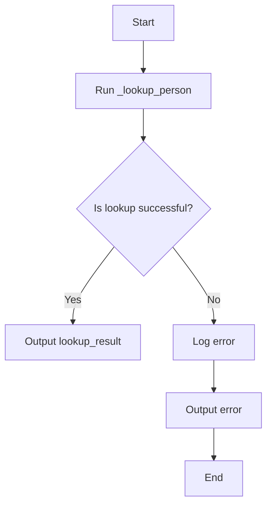

#### 带注释源码

```python
async def run(
    self, input_data: Input, *, credentials: APIKeyCredentials, **kwargs
) -> BlockOutput:
    """
    Run the block to look up LinkedIn profiles.

    Args:
        input_data: Input parameters for the block
        credentials: API key credentials for Enrichlayer
        **kwargs: Additional keyword arguments

    Yields:
        Tuples of (output_name, output_value)
    """
    try:
        lookup_result = await self._lookup_person(
            credentials=credentials,
            first_name=input_data.first_name,
            last_name=input_data.last_name,
            company_domain=input_data.company_domain,
            location=input_data.location,
            title=input_data.title,
            include_similarity_checks=input_data.include_similarity_checks,
            enrich_profile=input_data.enrich_profile,
        )
        yield "lookup_result", lookup_result
    except Exception as e:
        logger.error(f"Error looking up LinkedIn profile: {str(e)}")
        yield "error", str(e)
```


### `{LinkedinRoleLookupBlock}.{__init__}`

Initialize the `LinkedinRoleLookupBlock` class.

参数：

- `credentials`：`EnrichlayerCredentialsInput`，Enrichlayer API credentials

返回值：无

#### 流程图

```mermaid
classDiagram
    class LinkedinRoleLookupBlock {
        :EnrichlayerCredentialsInput credentials
    }
    class EnrichlayerCredentialsInput {
        :str api_key
        :str api_secret
    }
    LinkedinRoleLookupBlock --> EnrichlayerCredentialsInput
}
```

#### 带注释源码

```python
class LinkedinRoleLookupBlock(Block):
    """Block to look up LinkedIn profiles by role in a company using Enrichlayer API."""

    # Input schema for LinkedinRoleLookupBlock
    class Input(BlockSchemaInput):
        """Input schema for LinkedinRoleLookupBlock."""

        role: str = SchemaField(
            description="Role title (e.g., CEO, CTO)",
            placeholder="CEO",
        )
        company_name: str = SchemaField(
            description="Name of the company",
            placeholder="Microsoft",
        )
        enrich_profile: bool = SchemaField(
            description="Enrich the profile with additional data",
            default=False,
            advanced=True,
        )
        credentials: EnrichlayerCredentialsInput = CredentialsField(
            description="Enrichlayer API credentials"
        )

    # Output schema for LinkedinRoleLookupBlock
    class Output(BlockSchemaOutput):
        """Output schema for LinkedinRoleLookupBlock."""

        role_lookup_result: RoleLookupResponse = SchemaField(
            description="LinkedIn role lookup result"
        )

    def __init__(self):
        """Initialize LinkedinRoleLookupBlock."""
        super().__init__(
            id="3b9fc742-06d4-49c7-b5ce-7e302dd7c8a7",
            description="Look up LinkedIn profiles by role in a company using Enrichlayer",
            categories={BlockCategory.SOCIAL},
            input_schema=LinkedinRoleLookupBlock.Input,
            output_schema=LinkedinRoleLookupBlock.Output,
            test_input={
                "role": "Co-chair",
                "company_name": "Gates Foundation",
                "enrich_profile": True,
                "credentials": TEST_CREDENTIALS_INPUT,
            },
            test_output=[
                (
                    "role_lookup_result",
                    RoleLookupResponse(
                        linkedin_profile_url="https://www.linkedin.com/in/williamhgates/",
                    ),
                )
            ],
            test_credentials=TEST_CREDENTIALS,
            test_mock={
                "_lookup_role": lambda *args, **kwargs: RoleLookupResponse(
                    linkedin_profile_url="https://www.linkedin.com/in/williamhgates/",
                )
            },
        )
```


### `_lookup_role`

This method looks up LinkedIn profiles by a specific role in a company using the Enrichlayer API.

参数：

- `credentials`：`APIKeyCredentials`，Enrichlayer API credentials
- `role`：`str`，The role title (e.g., CEO, CTO)
- `company_name`：`str`，The name of the company
- `enrich_profile`：`bool`，Whether to enrich the profile with additional data (default: False)

返回值：`RoleLookupResponse`，The LinkedIn role lookup result

#### 流程图

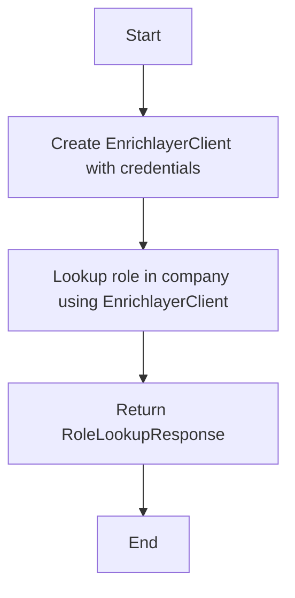

#### 带注释源码

```python
async def _lookup_role(
    self,
    credentials: APIKeyCredentials,
    role: str,
    company_name: str,
    enrich_profile: bool = False,
):
    client = EnrichlayerClient(credentials=credentials)
    role_lookup_result = await client.lookup_role(
        role=role,
        company_name=company_name,
        enrich_profile=enrich_profile,
    )
    return role_lookup_result
``` 


### `LinkedinRoleLookupBlock.run`

Run the block to look up LinkedIn profiles by role.

参数：

- `input_data`：`Input`，Input parameters for the block
- `credentials`：`APIKeyCredentials`，API key credentials for Enrichlayer
- `**kwargs`：Additional keyword arguments

返回值：`BlockOutput`，Tuples of (output_name, output_value)

#### 流程图

```mermaid
graph TD
    A[Start] --> B[Run _lookup_role]
    B --> C{Is there an error?}
    C -- Yes --> D[Log error and yield "error"]
    C -- No --> E[Process result]
    E --> F[End]
```

#### 带注释源码

```python
async def run(
    self, input_data: Input, *, credentials: APIKeyCredentials, **kwargs
) -> BlockOutput:
    """
    Run the block to look up LinkedIn profiles by role.

    Args:
        input_data: Input parameters for the block
        credentials: API key credentials for Enrichlayer
        **kwargs: Additional keyword arguments

    Yields:
        Tuples of (output_name, output_value)
    """
    try:
        role_lookup_result = await self._lookup_role(
            credentials=credentials,
            role=input_data.role,
            company_name=input_data.company_name,
            enrich_profile=input_data.enrich_profile,
        )
        yield "role_lookup_result", role_lookup_result
    except Exception as e:
        logger.error(f"Error looking up role in company: {str(e)}")
        yield "error", str(e)
```


### GetLinkedinProfilePictureBlock.__init__

Initialize GetLinkedinProfilePictureBlock.

参数：

-  `self`：`None`，The instance of the class.
-  ...

返回值：`None`，None

#### 流程图

```mermaid
classDiagram
    GetLinkedinProfilePictureBlock <|-- Block
    GetLinkedinProfilePictureBlock {
        id
        description
        categories
        input_schema
        output_schema
        test_input
        test_output
        test_credentials
        test_mock
    }
```

#### 带注释源码

```python
class GetLinkedinProfilePictureBlock(Block):
    """Block to get LinkedIn profile pictures using Enrichlayer API."""

    class Input(BlockSchemaInput):
        """Input schema for GetLinkedinProfilePictureBlock."""

        linkedin_profile_url: str = SchemaField(
            description="LinkedIn profile URL",
            placeholder="https://www.linkedin.com/in/username/",
        )
        credentials: EnrichlayerCredentialsInput = CredentialsField(
            description="Enrichlayer API credentials"
        )

    class Output(BlockSchemaOutput):
        """Output schema for GetLinkedinProfilePictureBlock."""

        profile_picture_url: MediaFileType = SchemaField(
            description="LinkedIn profile picture URL"
        )

    def __init__(self):
        """Initialize GetLinkedinProfilePictureBlock."""
        super().__init__(
            id="68d5a942-9b3f-4e9a-b7c1-d96ea4321f0d",
            description="Get LinkedIn profile pictures using Enrichlayer",
            categories={BlockCategory.SOCIAL},
            input_schema=GetLinkedinProfilePictureBlock.Input,
            output_schema=GetLinkedinProfilePictureBlock.Output,
            test_input={
                "linkedin_profile_url": "https://www.linkedin.com/in/williamhgates/",
                "credentials": TEST_CREDENTIALS_INPUT,
            },
            test_output=[
                (
                    "profile_picture_url",
                    "https://media.licdn.com/dms/image/C4D03AQFj-xjuXrLFSQ/profile-displayphoto-shrink_800_800/0/1576881858598?e=1686787200&v=beta&t=zrQC76QwsfQQIWthfOnrKRBMZ5D-qIAvzLXLmWgYvTk",
                )
            ],
            test_credentials=TEST_CREDENTIALS,
            test_mock={
                "_get_profile_picture": lambda *args, **kwargs: "https://media.licdn.com/dms/image/C4D03AQFj-xjuXrLFSQ/profile-displayphoto-shrink_800_800/0/1576881858598?e=1686787200&v=beta&t=zrQC76QwsfQQIWthfOnrKRBMZ5D-qIAvzLXLmWgYvTk",
            },
        )
```


### GetLinkedinProfilePictureBlock._get_profile_picture

This method fetches the LinkedIn profile picture URL using the Enrichlayer API.

参数：

- `credentials`：`APIKeyCredentials`，Enrichlayer API credentials
- `linkedin_profile_url`：`str`，LinkedIn profile URL

返回值：`str`，LinkedIn profile picture URL

#### 流程图


#### 带注释源码

```python
@staticmethod
async def _get_profile_picture(
    credentials: APIKeyCredentials, linkedin_profile_url: str
):
    client = EnrichlayerClient(credentials=credentials)
    profile_picture_response = await client.get_profile_picture(
        linkedin_profile_url=linkedin_profile_url,
    )
    return profile_picture_response.profile_picture_url
```


### GetLinkedinProfilePictureBlock.run

This method fetches the LinkedIn profile picture URL using the Enrichlayer API.

参数：

- `input_data`：`Input`，The input parameters for the block
- `credentials`：`APIKeyCredentials`，API key credentials for Enrichlayer

返回值：`BlockOutput`，A tuple of (output_name, output_value)

#### 流程图

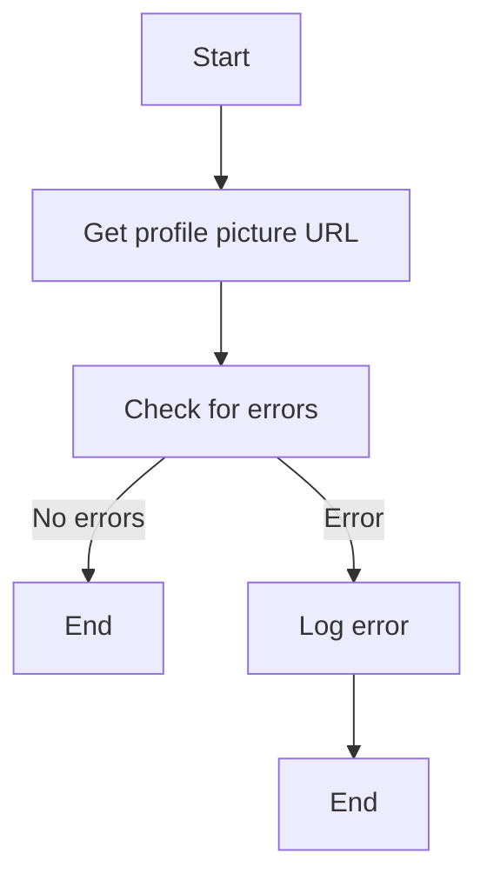

#### 带注释源码

```python
async def run(
    self, input_data: Input, *, credentials: APIKeyCredentials, **kwargs
) -> BlockOutput:
    """
    Run the block to get LinkedIn profile pictures.

    Args:
        input_data: Input parameters for the block
        credentials: API key credentials for Enrichlayer
        **kwargs: Additional keyword arguments

    Yields:
        Tuples of (output_name, output_value)
    """
    try:
        profile_picture = await self._get_profile_picture(
            credentials=credentials,
            linkedin_profile_url=input_data.linkedin_profile_url,
        )
        yield "profile_picture_url", profile_picture
    except Exception as e:
        logger.error(f"Error getting profile picture: {str(e)}")
        yield "error", str(e)
```


## 关键组件


### 张量索引与惰性加载

张量索引与惰性加载是处理大型数据集时常用的技术，用于提高数据访问效率和减少内存消耗。

### 反量化支持

反量化支持是指系统对量化操作的反向操作，即从量化后的数据恢复到原始数据。

### 量化策略

量化策略是指将浮点数数据转换为低精度表示（如整数）的方法，以减少模型大小和加速计算。


## 问题及建议


### 已知问题

-   **全局变量和函数的复用性低**：代码中存在多个全局变量和函数，如`EnrichlayerClient`、`logger`等，这些变量和函数在多个类中重复使用，缺乏封装和复用，可能导致维护困难。
-   **异常处理不够全面**：代码中在`run`方法中使用了try-except来捕获异常，但未对可能出现的所有异常进行捕获和处理，可能导致程序崩溃或运行不稳定。
-   **代码注释不足**：代码中部分方法缺少注释，难以理解其功能和实现细节，不利于代码的维护和扩展。

### 优化建议

-   **封装全局变量和函数**：将全局变量和函数封装到单独的模块或类中，提高代码的复用性和可维护性。
-   **完善异常处理**：对可能出现的所有异常进行捕获和处理，确保程序的稳定性和健壮性。
-   **添加代码注释**：在关键代码段添加注释，解释其功能和实现细节，提高代码的可读性和可维护性。
-   **优化代码结构**：对代码结构进行优化，提高代码的可读性和可维护性，例如使用更清晰的命名规范、合理的代码布局等。
-   **考虑使用异步编程**：由于代码中存在大量的异步操作，可以考虑使用异步编程来提高程序的执行效率。
-   **引入单元测试**：编写单元测试，确保代码的正确性和稳定性，提高代码的可维护性。
-   **优化API调用**：优化API调用，例如使用缓存机制减少API调用次数，提高程序的响应速度和稳定性。

## 其它


### 设计目标与约束

- 设计目标：
  - 提供与Enrichlayer API的集成，以获取LinkedIn个人资料数据和相关信息。
  - 支持多种查询方式，包括通过LinkedIn URL、个人信息、角色和公司名称。
  - 支持缓存策略，以优化性能和减少API调用次数。
  - 提供详细的错误处理和日志记录，以便于问题追踪和调试。

- 约束：
  - 必须使用Enrichlayer API提供的接口和参数。
  - 输入数据必须经过验证，以确保其有效性和安全性。
  - 代码必须遵循最佳实践，包括代码风格、异常处理和日志记录。

### 错误处理与异常设计

- 错误处理：
  - 使用try-except块捕获可能发生的异常。
  - 记录错误信息到日志中，以便于问题追踪和调试。
  - 向调用者返回错误信息，以便于用户了解发生了什么问题。

- 异常设计：
  - 定义自定义异常类，以处理特定类型的错误。
  - 异常类应包含错误信息和相关上下文信息。

### 数据流与状态机

- 数据流：
  - 输入数据通过API接口传递到Enrichlayer。
  - Enrichlayer返回查询结果，通过API接口传递回调用者。

- 状态机：
  - 每个块的状态包括初始化、运行、完成和错误。
  - 状态机根据输入数据和API响应进行状态转换。

### 外部依赖与接口契约

- 外部依赖：
  - Enrichlayer API。
  - Python标准库，如logging和typing。

- 接口契约：
  - API接口定义了请求和响应的格式。
  - 接口契约确保了API的稳定性和可预测性。


    