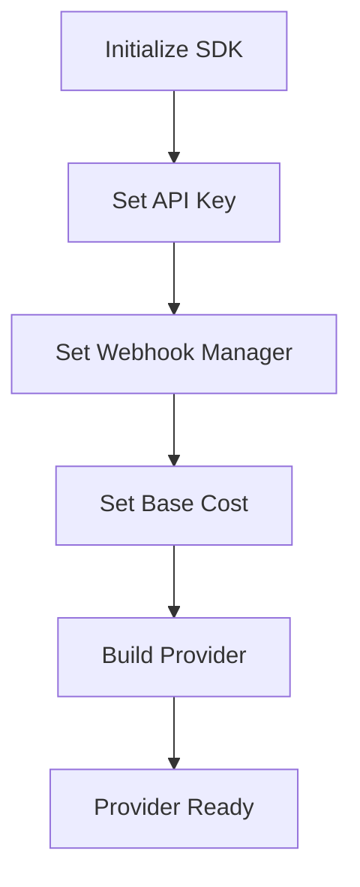
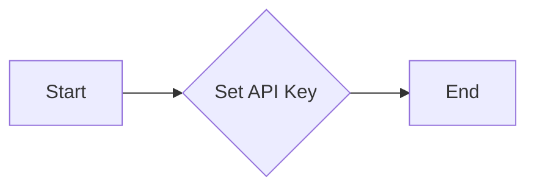
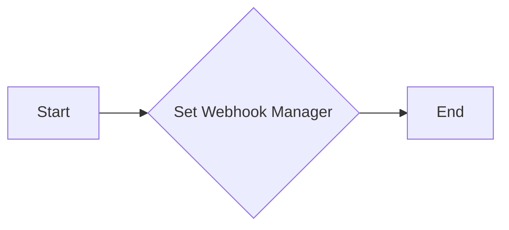
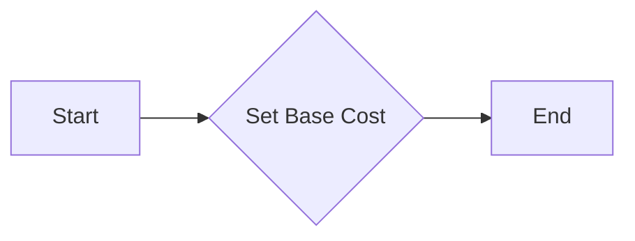
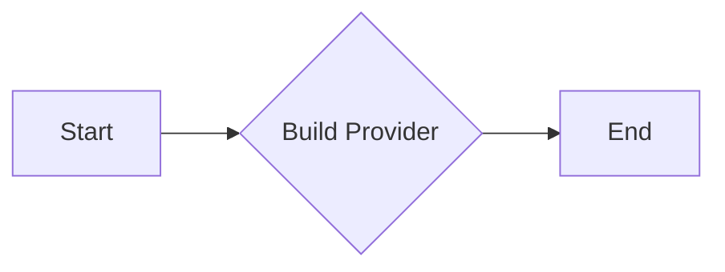
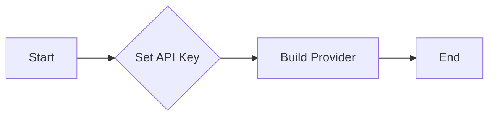
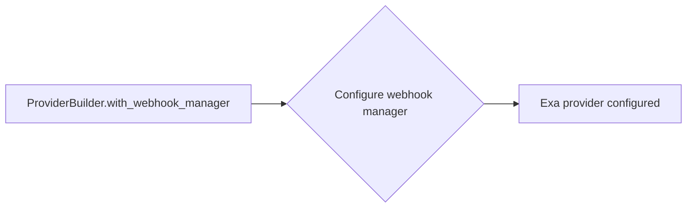
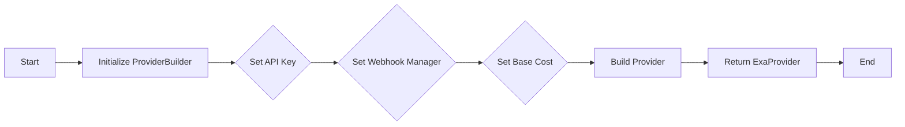
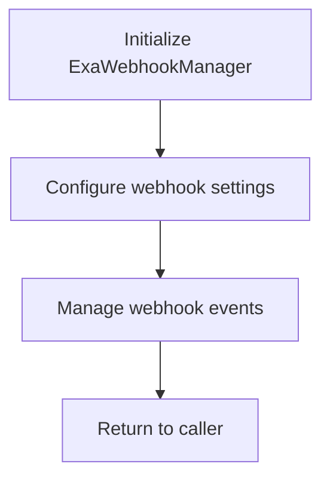

# `.\AutoGPT\autogpt_platform\backend\backend\blocks\exa\_config.py` 详细设计文档

This code defines a shared configuration for all Exa blocks using a new SDK pattern, including API key setup, webhook management, and base cost configuration.

## 整体流程



## 类结构

```
ProviderBuilder (类)
├── ExaWebhookManager (类)
```

## 全局变量及字段


### `exa`
    
Shared configuration for all Exa blocks using the new SDK pattern.

类型：`ProviderBuilder`
    


### `ProviderBuilder.api_key`
    
Exa API Key

类型：`str`
    


### `ProviderBuilder.webhook_manager`
    
Webhook manager for Exa blocks

类型：`ExaWebhookManager`
    


### `ProviderBuilder.base_cost`
    
Base cost for Exa blocks, consisting of a numeric value and a cost type

类型：`tuple`
    
    

## 全局函数及方法


### `ProviderBuilder.with_api_key`

**描述**：设置Exa提供者的API密钥。

参数：

- `api_key`：`str`，API密钥的名称。
- `value`：`str`，API密钥的实际值。

返回值：`None`，没有返回值。

#### 流程图



#### 带注释源码

```
# Set the API key for the Exa provider
def with_api_key(self, api_key: str, value: str) -> None:
    # Set the API key with the given name and value
    self.api_keys[api_key] = value
    return self
```

### `ProviderBuilder.with_webhook_manager`

**描述**：设置Exa提供者的webhook管理器。

参数：

- `webhook_manager`：`ExaWebhookManager`，webhook管理器的实例。

返回值：`None`，没有返回值。

#### 流程图



#### 带注释源码

```
# Set the webhook manager for the Exa provider
def with_webhook_manager(self, webhook_manager: ExaWebhookManager) -> None:
    # Set the webhook manager
    self.webhook_manager = webhook_manager
    return self
```

### `ProviderBuilder.with_base_cost`

**描述**：设置Exa提供者的基础成本。

参数：

- `cost`：`int`，基础成本值。
- `cost_type`：`BlockCostType`，成本类型。

返回值：`None`，没有返回值。

#### 流程图



#### 带注释源码

```
# Set the base cost for the Exa provider
def with_base_cost(self, cost: int, cost_type: BlockCostType) -> None:
    # Set the base cost with the given type
    self.base_costs[cost_type] = cost
    return self
```

### `ProviderBuilder.build`

**描述**：构建Exa提供者实例。

参数：无。

返回值：`Provider`，Exa提供者实例。

#### 流程图



#### 带注释源码

```
# Build the Exa provider instance
def build(self) -> Provider:
    # Build the provider with all the configurations
    return Provider(self.api_keys, self.webhook_manager, self.base_costs)
```


### ProviderBuilder.with_api_key

This method is used to set the API key for the Exa provider within the ProviderBuilder context.

参数：

- `api_key`：`str`，The API key to be used for the Exa provider. This is a required parameter that identifies the user or application to the Exa service.
- `description`：`str`，An optional description for the API key, providing additional context about its purpose.

返回值：`ProviderBuilder`，The updated ProviderBuilder instance with the API key set.

#### 流程图



#### 带注释源码

```python
from backend.sdk import ProviderBuilder

class ProviderBuilder:
    def __init__(self, name):
        self.name = name
        self.config = {}

    def with_api_key(self, api_key, description=""):
        self.config[api_key] = {'description': description}
        return self

    def with_webhook_manager(self, webhook_manager):
        self.config['webhook_manager'] = webhook_manager
        return self

    def with_base_cost(self, cost, cost_type):
        self.config['base_cost'] = {'cost': cost, 'type': cost_type}
        return self

    def build(self):
        return self.config
```


### ProviderBuilder.with_webhook_manager

This method configures the webhook manager for the Exa provider.

参数：

- `ExaWebhookManager`：`ExaWebhookManager`，The webhook manager class to be used for Exa provider.

返回值：`None`，This method does not return a value; it configures the webhook manager internally.

#### 流程图



#### 带注释源码

```
# Configure the Exa provider once for all blocks
exa = (
    ProviderBuilder("exa")
    .with_api_key("EXA_API_KEY", "Exa API Key")
    .with_webhook_manager(ExaWebhookManager)
    .with_base_cost(1, BlockCostType.RUN)
    .build()
)
```


### ProviderBuilder.with_base_cost

This method is used to set the base cost for a block using the ProviderBuilder class.

参数：

- `cost`：`int`，The base cost value for the block.
- `cost_type`：`BlockCostType`，The type of cost associated with the block.

返回值：`None`，This method does not return a value; it configures the ProviderBuilder instance.

#### 流程图

```mermaid
graph TD
    A[Start] --> B[ProviderBuilder("exa")]
    B --> C[with_api_key("EXA_API_KEY", "Exa API Key")]
    C --> D[with_webhook_manager(ExaWebhookManager)]
    D --> E[with_base_cost(1, BlockCostType.RUN)]
    E --> F[build()]
    F --> G[exa configured]
    G --> H[End]
```

#### 带注释源码

```
from backend.sdk import BlockCostType, ProviderBuilder

# Configure the Exa provider once for all blocks
exa = (
    ProviderBuilder("exa")
    .with_api_key("EXA_API_KEY", "Exa API Key")
    .with_webhook_manager(ExaWebhookManager)
    .with_base_cost(1, BlockCostType.RUN)  # Set the base cost for the block
    .build()
)
```


### ProviderBuilder.build

This function builds a configuration for the Exa provider, setting up all necessary configurations such as API key, webhook manager, and base cost.

参数：

- `self`：`ProviderBuilder`，The instance of the ProviderBuilder class that is being built.
- `...`：Additional configuration options provided by the `ProviderBuilder` instance.

返回值：`ExaProvider`，A fully configured Exa provider instance.

#### 流程图



#### 带注释源码

```
"""
Shared configuration for all Exa blocks using the new SDK pattern.
"""

from backend.sdk import BlockCostType, ProviderBuilder

from ._webhook import ExaWebhookManager

# Configure the Exa provider once for all blocks
exa = (
    ProviderBuilder("exa")
    .with_api_key("EXA_API_KEY", "Exa API Key")
    .with_webhook_manager(ExaWebhookManager)
    .with_base_cost(1, BlockCostType.RUN)
    .build()
)
```


### ExaWebhookManager

This class manages webhooks for Exa blocks, providing a centralized way to handle webhook configurations and events.

参数：

- `ExaWebhookManager`：`None`，This parameter is used to configure the webhook manager for the Exa provider.

返回值：`None`，This method does not return any value.

#### 流程图



#### 带注释源码

```
# from ._webhook import ExaWebhookManager

# class ExaWebhookManager:
#     def __init__(self):
#         # Initialize webhook manager
#         pass

#     def configure(self, settings):
#         # Configure webhook settings
#         pass

#     def handle_event(self, event):
#         # Handle webhook events
#         pass
```

Please note that the actual implementation of `ExaWebhookManager` is not provided in the given code snippet, so the above source code is a placeholder to illustrate what the class might look like.


## 关键组件


### 张量索引与惰性加载

支持对张量的索引操作，并在需要时才加载张量数据，以优化内存使用和性能。

### 反量化支持

提供对反量化操作的支持，允许在量化过程中进行逆量化处理。

### 量化策略

定义了量化策略，用于在模型训练和推理过程中对模型参数进行量化处理。


## 问题及建议


### 已知问题

-   **硬编码API密钥**：代码中使用了硬编码的API密钥，这可能导致密钥泄露的风险。
-   **缺乏错误处理**：代码中没有包含错误处理逻辑，如果配置过程中出现错误，可能会导致整个系统崩溃。
-   **缺乏日志记录**：代码中没有日志记录，难以追踪和调试问题。
-   **缺乏配置文件管理**：所有配置都是静态的，没有提供通过配置文件动态加载配置的能力。

### 优化建议

-   **使用环境变量或配置文件存储API密钥**：将API密钥存储在环境变量或配置文件中，而不是硬编码在代码中。
-   **添加错误处理逻辑**：在配置过程中添加错误处理逻辑，确保在出现错误时能够优雅地处理。
-   **引入日志记录**：添加日志记录功能，以便于问题追踪和调试。
-   **支持配置文件**：允许通过配置文件动态加载配置，以便于灵活调整配置而无需修改代码。
-   **代码复用**：如果`ProviderBuilder`和`ExaWebhookManager`在其他地方也有使用，考虑将它们提取到独立的模块中，以提高代码复用性。
-   **单元测试**：为代码添加单元测试，以确保代码的稳定性和可靠性。
-   **文档化**：为代码添加详细的文档，包括如何配置和使用该代码。


## 其它


### 设计目标与约束

- 设计目标：
  - 提供统一的配置管理，以便所有使用新SDK模式的Exa块可以共享配置。
  - 确保配置的灵活性和可扩展性，以适应不同的使用场景。
  - 确保配置的可靠性和安全性，防止敏感信息泄露。

- 约束：
  - 配置信息必须通过安全的渠道进行传输和存储。
  - 配置信息必须符合API规范，确保与SDK的兼容性。
  - 配置信息必须易于管理和更新。

### 错误处理与异常设计

- 错误处理：
  - 对于配置信息错误，应提供明确的错误信息，帮助用户定位问题。
  - 对于API调用失败，应捕获异常并返回相应的错误码和错误信息。

- 异常设计：
  - 定义自定义异常类，用于处理特定的错误情况。
  - 异常类应包含错误码、错误信息和可能的解决方案。

### 数据流与状态机

- 数据流：
  - 配置信息从外部源（如配置文件或环境变量）读取。
  - 配置信息通过ProviderBuilder进行解析和构建。
  - 构建完成的配置信息存储在全局变量`exa`中。

- 状态机：
  - 配置信息的状态包括：未配置、配置中、配置完成。
  - 状态转换由ProviderBuilder的构建过程触发。

### 外部依赖与接口契约

- 外部依赖：
  - `backend.sdk`模块：提供API密钥、基础成本类型和ProviderBuilder类。
  - `_webhook`模块：提供ExaWebhookManager类。

- 接口契约：
  - ProviderBuilder接口：定义构建配置的步骤和方法。
  - ExaWebhookManager接口：定义与Webhook相关的管理功能。
  - BlockCostType枚举：定义不同的成本类型。


    