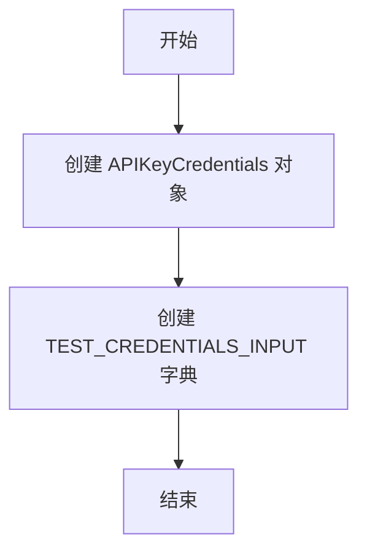

# `.\AutoGPT\autogpt_platform\backend\backend\blocks\exa\_test.py` 详细设计文档

This code provides test credentials and helpers for Exa blocks, including API key credentials and their input representation.

## 整体流程



## 类结构

```
APIKeyCredentials (类)
```

## 全局变量及字段


### `TEST_CREDENTIALS`
    
The test API key credentials.

类型：`APIKeyCredentials`
    


### `TEST_CREDENTIALS_INPUT`
    
The input representation of the test API key credentials.

类型：`dict`
    


### `APIKeyCredentials.id`
    
The unique identifier for the API key.

类型：`str`
    


### `APIKeyCredentials.provider`
    
The provider of the API key.

类型：`str`
    


### `APIKeyCredentials.api_key`
    
The secret API key.

类型：`SecretStr`
    


### `APIKeyCredentials.title`
    
The title of the API key.

类型：`str`
    


### `APIKeyCredentials.expires_at`
    
The expiration date of the API key.

类型：`datetime`
    
    

## 全局函数及方法


## 关键组件


### 张量索引与惰性加载

张量索引与惰性加载是用于高效处理大型数据集的机制，它允许在需要时才计算数据，从而减少内存消耗和提高性能。

### 反量化支持

反量化支持是针对量化策略的一种优化，它允许在量化过程中对某些操作进行反量化处理，以保持精度。

### 量化策略

量化策略是用于将浮点数转换为低精度表示的方法，以减少模型大小和提高推理速度。


## 问题及建议


### 已知问题

-   {问题1}：代码中使用了`SecretStr`来处理API密钥，但没有提供密钥的解密逻辑，这可能导致在实际应用中无法使用解密后的密钥。
-   {问题2}：全局变量`TEST_CREDENTIALS`和`TEST_CREDENTIALS_INPUT`直接定义在代码顶部，这可能导致代码的可维护性降低，特别是在大型项目中。
-   {问题3}：代码中没有提供任何错误处理机制，如果API密钥或其它配置信息不正确，可能会导致程序崩溃。

### 优化建议

-   {建议1}：实现密钥的解密逻辑，确保在实际应用中可以安全地使用API密钥。
-   {建议2}：将全局变量移动到配置文件或环境变量中，以提高代码的可维护性和可配置性。
-   {建议3}：添加错误处理机制，例如使用try-except语句捕获可能的异常，并提供友好的错误信息。
-   {建议4}：考虑使用日志记录关键操作和错误信息，以便于问题的追踪和调试。
-   {建议5}：如果该代码是库的一部分，应该提供详细的文档说明如何使用这些测试凭证，包括如何设置和配置。


## 其它


### 设计目标与约束

- 设计目标：确保API密钥的安全存储和验证。
- 约束：使用Pydantic库进行数据验证，确保输入数据的正确性和安全性。

### 错误处理与异常设计

- 异常设计：在验证API密钥时，如果输入数据不符合预期，应抛出相应的异常。
- 错误处理：捕获并处理异常，提供清晰的错误信息，以便用户了解问题所在。

### 数据流与状态机

- 数据流：输入数据通过APIKeyCredentials类进行验证，验证通过后，数据流继续到后续处理流程。
- 状态机：无状态机，数据流线性进行。

### 外部依赖与接口契约

- 外部依赖：Pydantic库用于数据验证。
- 接口契约：APIKeyCredentials类定义了输入数据的接口契约，确保数据格式的一致性。


    