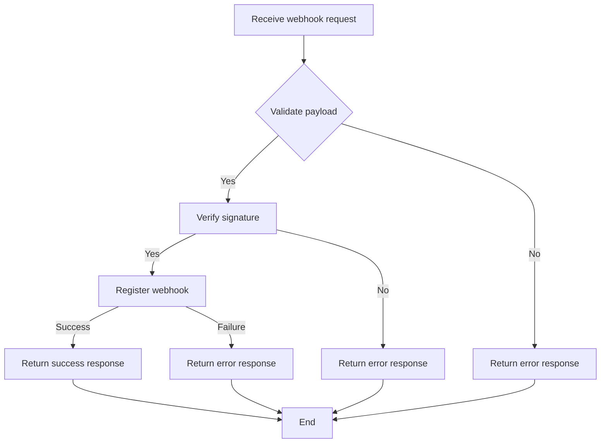
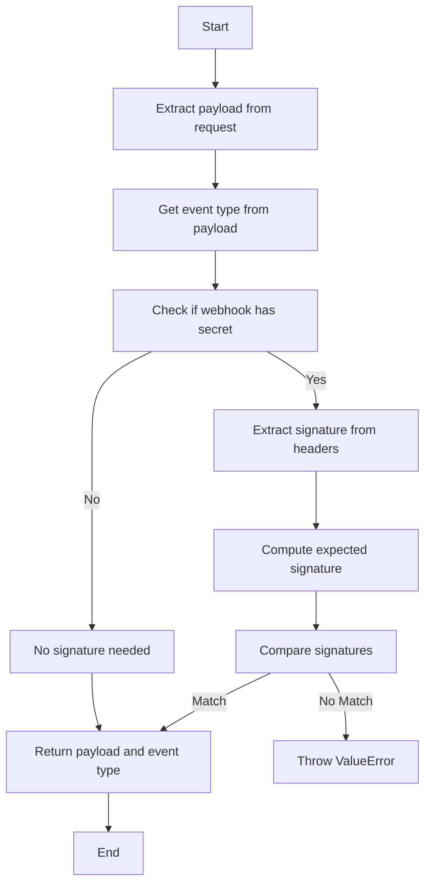
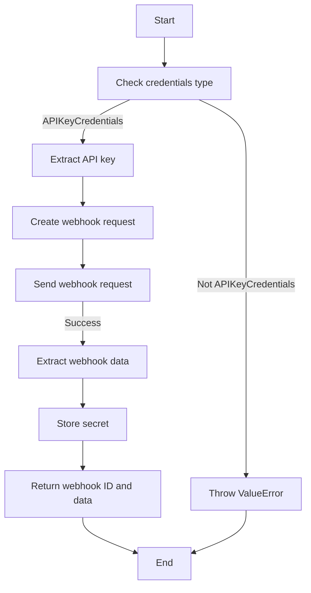
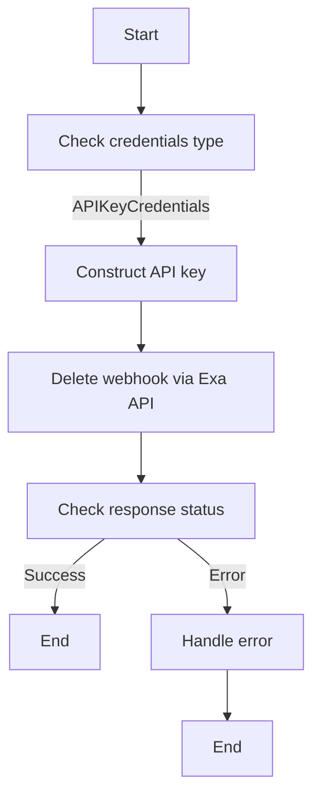

# `.\AutoGPT\autogpt_platform\backend\backend\blocks\exa\_webhook.py` 详细设计文档

The code provides a Webhook manager for Exa API, handling webhook validation, registration, and deregistration.

## 整体流程



## 类结构

```
ExaWebhookManager (类)
├── WebhookType (枚举)
│   ├── WEBSET
└── ExaEventType (枚举)
```

## 全局变量及字段


### `ProviderName`
    
Enum for provider names.

类型：`Enum`
    


### `Requests`
    
Module for making HTTP requests.

类型：`Module`
    


### `Webhook`
    
Class representing a webhook.

类型：`Class`
    


### `Credentials`
    
Class representing credentials.

类型：`Class`
    


### `APIKeyCredentials`
    
Class representing API key credentials.

类型：`Class`
    


### `BaseWebhooksManager`
    
Base class for webhooks manager.

类型：`Class`
    


### `ExaWebhookType`
    
Enum for Exa webhook types.

类型：`Enum`
    


### `ExaEventType`
    
Enum for Exa event types.

类型：`Enum`
    


### `webhook_secret`
    
Secret used for webhook signature verification.

类型：`str`
    


### `api_key`
    
API key for Exa API access.

类型：`str`
    


### `webhook_data`
    
Data returned by Exa API for a webhook.

类型：`dict`
    


### `error_data`
    
Error data returned by Exa API.

类型：`dict`
    


### `response`
    
HTTP response object from Exa API.

类型：`Response`
    


### `body`
    
Body of the incoming webhook request.

类型：`bytes`
    


### `expected_signature`
    
Expected signature for the webhook request.

类型：`str`
    


### `signature`
    
Signature from the incoming webhook request header.

类型：`str`
    


### `events`
    
List of event types to which the webhook is subscribed.

类型：`list[str]`
    


### `resource`
    
Resource associated with the webhook.

类型：`str`
    


### `ingress_url`
    
URL to which webhook notifications are sent.

类型：`str`
    


### `webhook_type`
    
Type of the webhook.

类型：`str`
    


### `webhook_data`
    
Data returned by Exa API for a webhook.

类型：`dict`
    


### `webhook_data_id`
    
ID of the webhook returned by Exa API.

类型：`str`
    


### `webhook_data_secret`
    
Secret returned by Exa API for the webhook.

类型：`str`
    


### `webhook_provider_webhook_id`
    
ID of the webhook in Exa's system.

类型：`str`
    


### `api_key`
    
API key for Exa API access.

类型：`str`
    


### `webhook_id`
    
ID of the webhook to be deregistered.

类型：`str`
    


### `webhook`
    
Webhook object to be deregistered.

类型：`Webhook`
    


### `ExaWebhookManager.PROVIDER_NAME`
    
Provider name for Exa webhooks.

类型：`ProviderName`
    


### `ExaWebhookManager.WebhookType`
    
Enum for Exa webhook types.

类型：`Enum`
    


### `ExaWebhookManager.validate_payload`
    
Method to validate incoming webhook payload and signature.

类型：`async def`
    


### `ExaWebhookManager._register_webhook`
    
Method to register webhook with Exa API.

类型：`async def`
    


### `ExaWebhookManager._deregister_webhook`
    
Method to deregister webhook from Exa API.

类型：`async def`
    
    

## 全局函数及方法


### ExaWebhookManager.validate_payload

Validate incoming webhook payload and signature.

参数：

- `webhook`：`Webhook`，The webhook object containing the secret and other information.
- `request`：`Requests`，The request object containing the incoming webhook payload.
- `credentials`：`Credentials | None`，The credentials object for authentication.

返回值：`tuple[dict, str]`，A tuple containing the payload as a dictionary and the event type as a string.

#### 流程图



#### 带注释源码

```python
@classmethod
async def validate_payload(cls, webhook: Webhook, request, credentials: Credentials | None) -> tuple[dict, str]:
    """Validate incoming webhook payload and signature."""
    payload = await request.json()

    # Get event type from payload
    event_type = payload.get("eventType", "unknown")

    # Verify webhook signature if secret is available
    if webhook.secret:
        signature = request.headers.get("X-Exa-Signature")
        if signature:
            # Compute expected signature
            body = await request.body()
            expected_signature = hmac.new(
                webhook.secret.encode(), body, hashlib.sha256
            ).hexdigest()

            # Compare signatures
            if not hmac.compare_digest(signature, expected_signature):
                raise ValueError("Invalid webhook signature")

    return payload, event_type
```


### `_register_webhook`

Register webhook with Exa API.

参数：

- `credentials`：`Credentials`，Credentials object containing API key credentials.
- `webhook_type`：`str`，Type of webhook to register.
- `resource`：`str`，Resource associated with the webhook.
- `events`：`list[str]`，List of event types to listen for.
- `ingress_url`：`str`，URL where the webhook will receive notifications.
- `secret`：`str`，Secret used to sign webhook payloads.

返回值：`tuple[str, dict]`，A tuple containing the webhook ID and a dictionary with additional information.

#### 流程图



#### 带注释源码

```python
async def _register_webhook(
    self,
    credentials: Credentials,
    webhook_type: str,
    resource: str,
    events: list[str],
    ingress_url: str,
    secret: str,
) -> tuple[str, dict]:
    """Register webhook with Exa API."""
    if not isinstance(credentials, APIKeyCredentials):
        raise ValueError("Exa webhooks require API key credentials")
    api_key = credentials.api_key.get_secret_value()

    # Create webhook via Exa API
    response = await Requests().post(
        "https://api.exa.ai/v0/webhooks",
        headers={"x-api-key": api_key},
        json={
            "url": ingress_url,
            "events": events,
            "metadata": {
                "resource": resource,
                "webhook_type": webhook_type,
            },
        },
    )

    if not response.ok:
        error_data = response.json()
        raise Exception(f"Failed to create Exa webhook: {error_data}")

    webhook_data = response.json()

    # Store the secret returned by Exa
    return webhook_data["id"], {
        "events": events,
        "resource": resource,
        "exa_secret": webhook_data.get("secret"),
    }
```


### `_deregister_webhook`

Deregister a webhook from the Exa API.

参数：

- `webhook`：`Webhook`，The webhook object containing the Exa provider webhook ID.
- `credentials`：`Credentials`，The credentials object containing the API key for authentication.

返回值：`None`，No return value, the method is void.

#### 流程图



#### 带注释源码

```python
async def _deregister_webhook(self, webhook: Webhook, credentials: Credentials) -> None:
    """Deregister webhook from Exa API."""
    if not isinstance(credentials, APIKeyCredentials):
        raise ValueError("Exa webhooks require API key credentials")
    api_key = credentials.api_key.get_secret_value()

    # Delete webhook via Exa API
    response = await Requests().delete(
        f"https://api.exa.ai/v0/webhooks/{webhook.provider_webhook_id}",
        headers={"x-api-key": api_key},
    )

    if not response.ok and response.status != 404:
        error_data = response.json()
        raise Exception(f"Failed to delete Exa webhook: {error_data}")
```


## 关键组件


### 张量索引与惰性加载

用于高效地处理和索引大型数据集，通过延迟加载数据以减少内存消耗。

### 反量化支持

提供对反量化操作的支持，允许在量化过程中进行逆量化处理。

### 量化策略

定义了量化策略，用于在模型训练和推理过程中对权重和激活进行量化。


## 问题及建议


### 已知问题

-   **依赖注入不足**：代码中直接使用了`Requests`类和`APIKeyCredentials`类，但没有通过依赖注入的方式提供，这可能导致测试困难。
-   **异常处理**：异常处理主要集中在API调用失败时，但没有对特定类型的异常进行详细的处理，例如网络异常或HTTP状态码异常。
-   **代码复用**：`_register_webhook`和`_deregister_webhook`方法中存在重复的代码，可以考虑提取为公共方法或使用模板方法模式。
-   **日志记录**：代码中没有日志记录，难以追踪和调试问题。

### 优化建议

-   **引入依赖注入**：通过依赖注入框架或手动实现依赖注入，使`Requests`和`APIKeyCredentials`类可配置，便于测试和替换。
-   **细化异常处理**：增加对不同类型的异常进行捕获和处理，例如网络异常、HTTP状态码异常等，并提供更具体的错误信息。
-   **提取重复代码**：将`_register_webhook`和`_deregister_webhook`方法中重复的代码提取出来，减少代码冗余，提高可维护性。
-   **添加日志记录**：在关键操作处添加日志记录，有助于问题追踪和系统监控。
-   **考虑使用异步编程的最佳实践**：确保异步代码的执行效率，例如使用`await`关键字等待异步操作完成，避免不必要的阻塞。
-   **安全性**：检查API密钥的安全存储和传输，避免在日志或其他可访问的地方泄露敏感信息。


## 其它


### 设计目标与约束

- 设计目标：
  - 实现一个可扩展的Webhook管理器，用于处理Exa API的Webhook事件。
  - 确保Webhook的安全性和可靠性，通过验证签名和错误处理。
  - 提供注册和注销Webhook的功能。
- 约束：
  - 必须使用Exa API的认证机制。
  - Webhook事件处理必须异步执行。
  - 代码应遵循PEP 8编码规范。

### 错误处理与异常设计

- 错误处理：
  - 使用try-except块捕获和处理可能发生的异常。
  - 对于认证错误、网络错误和API错误，抛出具体的异常信息。
- 异常设计：
  - `ValueError`：用于处理无效的参数或配置。
  - `Exception`：用于处理其他未预料的错误。

### 数据流与状态机

- 数据流：
  - Webhook请求到达 -> 验证签名 -> 处理事件 -> 注册/注销Webhook。
- 状态机：
  - Webhook状态：未注册、已注册、已注销。

### 外部依赖与接口契约

- 外部依赖：
  - `hashlib`：用于生成和验证签名。
  - `hmac`：用于生成和验证HMAC签名。
  - `enum`：用于定义枚举类型。
  - `aiohttp`：用于异步HTTP请求。
- 接口契约：
  - `BaseWebhooksManager`：提供Webhook管理的基本接口。
  - `APIKeyCredentials`：用于处理API密钥认证。
  - `Requests`：用于发送HTTP请求。
  - `Webhook`：表示Webhook配置和状态。


    