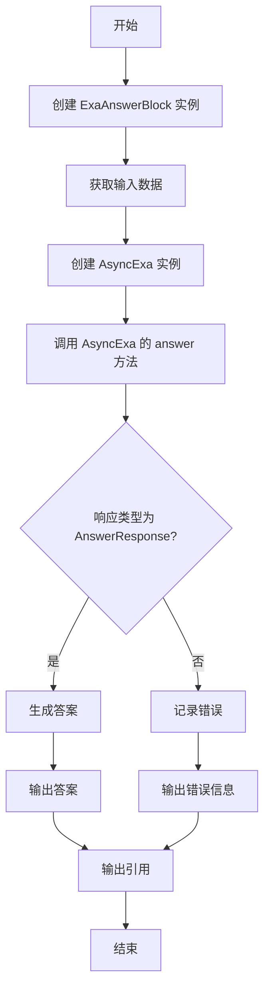
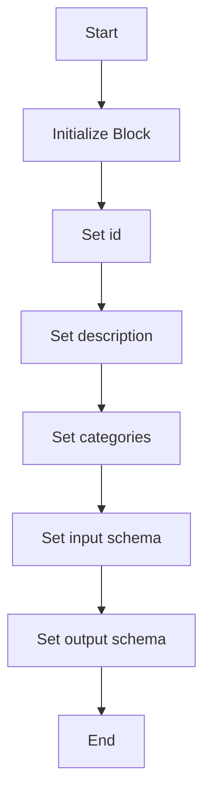

# `.\AutoGPT\autogpt_platform\backend\backend\blocks\exa\answers.py` 详细设计文档

The code defines a Pydantic model for citations and a custom block for Exa that generates answers to questions using Exa search results.

## 整体流程



## 类结构

```
AnswerCitation (引用模型)
ExaAnswerBlock (Exa 块)
├── Input (输入模式)
│   ├── credentials (API凭证)
│   ├── query (查询)
│   └── text (是否包含全文)
└── Output (输出模式)
    ├── answer (答案)
    ├── citations (引用列表)
    ├── citation (单个引用)
    └── error (错误信息)
```

## 全局变量及字段


### `exa`
    
The Exa integration credentials.

类型：`APIKeyCredentials`
    


### `AnswerCitation.id`
    
The temporary ID for the document

类型：`str`
    


### `AnswerCitation.url`
    
The URL of the search result

类型：`str`
    


### `AnswerCitation.title`
    
The title of the search result

类型：`Optional[str]`
    


### `AnswerCitation.author`
    
The author of the content

类型：`Optional[str]`
    


### `AnswerCitation.publishedDate`
    
An estimate of the creation date

类型：`Optional[str]`
    


### `AnswerCitation.text`
    
The full text content of the source

类型：`Optional[str]`
    


### `AnswerCitation.image`
    
The URL of the image associated with the result

类型：`Optional[MediaFileType]`
    


### `AnswerCitation.favicon`
    
The URL of the favicon for the domain

类型：`Optional[MediaFileType]`
    


### `ExaAnswerBlock.id`
    
The unique identifier for the block

类型：`str`
    


### `ExaAnswerBlock.description`
    
A description of the block's functionality

类型：`str`
    


### `ExaAnswerBlock.categories`
    
The categories that the block belongs to

类型：`set[BlockCategory]`
    


### `ExaAnswerBlock.input_schema`
    
The input schema for the block

类型：`BlockSchemaInput`
    


### `ExaAnswerBlock.output_schema`
    
The output schema for the block

类型：`BlockSchemaOutput`
    
    

## 全局函数及方法


### AnswerCitation.from_sdk

Convert SDK AnswerResult (dataclass) to our Pydantic model.

参数：

- `sdk_citation`：`AnswerResponse`，The SDK AnswerResult dataclass to convert.

返回值：`AnswerCitation`，The converted Pydantic model.

#### 流程图

```mermaid
classDef AnswerCitation {
  color: #009688
}

classDef AnswerResponse {
  color: #FF5722
}

class AnswerCitation << (AnswerCitation) >> {
  id: "AnswerCitation"
  id: "AnswerCitation"
  url: "url"
  title: "title"
  author: "author"
  publishedDate: "publishedDate"
  text: "text"
  image: "image"
  favicon: "favicon"
}

class AnswerResponse << (AnswerResponse) >> {
  id: "AnswerResponse"
  id: "id"
  url: "url"
  title: "title"
  author: "author"
  publishedDate: "publishedDate"
  text: "text"
  image: "image"
  favicon: "favicon"
}

AnswerCitation o-- AnswerResponse: from_sdk
```

#### 带注释源码

```python
from typing import Optional

from exa_py.api import AnswerResponse
from pydantic import BaseModel

from backend.sdk import (
    APIKeyCredentials,
    Block,
    BlockCategory,
    BlockOutput,
    BlockSchemaInput,
    BlockSchemaOutput,
    CredentialsMetaInput,
    MediaFileType,
    SchemaField,
)

from ._config import exa


class AnswerCitation(BaseModel):
    """Citation model for answer endpoint."""

    id: str = SchemaField(description="The temporary ID for the document")
    url: str = SchemaField(description="The URL of the search result")
    title: Optional[str] = SchemaField(description="The title of the search result")
    author: Optional[str] = SchemaField(description="The author of the content")
    publishedDate: Optional[str] = SchemaField(
        description="An estimate of the creation date"
    )
    text: Optional[str] = SchemaField(description="The full text content of the source")
    image: Optional[MediaFileType] = SchemaField(
        description="The URL of the image associated with the result"
    )
    favicon: Optional[MediaFileType] = SchemaField(
        description="The URL of the favicon for the domain"
    )

    @classmethod
    def from_sdk(cls, sdk_citation) -> "AnswerCitation":
        """Convert SDK AnswerResult (dataclass) to our Pydantic model."""
        return cls(
            id=getattr(sdk_citation, "id", ""),
            url=getattr(sdk_citation, "url", ""),
            title=getattr(sdk_citation, "title", None),
            author=getattr(sdk_citation, "author", None),
            publishedDate=getattr(sdk_citation, "published_date", None),
            text=getattr(sdk_citation, "text", None),
            image=getattr(sdk_citation, "image", None),
            favicon=getattr(sdk_citation, "favicon", None),
        )
```


### ExaAnswerBlock.run

This method retrieves an LLM (Language Learning Model) answer to a question using Exa search results.

参数：

- `input_data`：`Input`，The input data for the block, including the question to answer and other parameters.
- `credentials`：`APIKeyCredentials`，The credentials required for the Exa API, containing the API key.
- `**kwargs`：Additional keyword arguments that may be used by the method.

返回值：`BlockOutput`，The output of the block, including the answer, citations, and any error messages.

#### 流程图

```mermaid
graph TD
    A[Start] --> B[Create AsyncExa instance]
    B --> C[Call aexa.answer()]
    C --> D[Check response type]
    D -->|AnswerResponse| E[Extract answer]
    D -->|Other| F[Error handling]
    E --> G[Generate AnswerCitation objects]
    G --> H[Generate citations]
    H --> I[Generate individual citations]
    I --> J[End]
    F --> J
```

#### 带注释源码

```python
async def run(self, input_data: Input, *, credentials: APIKeyCredentials, **kwargs) -> BlockOutput:
    aexa = AsyncExa(api_key=credentials.api_key.get_secret_value())

    # Get answer using SDK (stream=False for blocks) - this IS async, needs await
    response = await aexa.answer(
        query=input_data.query, text=input_data.text, stream=False
    )

    # this should remain true as long as they don't start defaulting to streaming only.
    # provides a bit of safety for sdk updates.
    assert type(response) is AnswerResponse

    yield "answer", response.answer

    citations = [
        AnswerCitation.from_sdk(sdk_citation)
        for sdk_citation in response.citations or []
    ]

    yield "citations", citations
    for citation in citations:
        yield "citation", citation
```


### ExaAnswerBlock.__init__

This method initializes the `ExaAnswerBlock` class, setting up its metadata and schema inputs and outputs.

参数：

- 无

返回值：无

#### 流程图



#### 带注释源码

```python
def __init__(self):
    super().__init__(
        id="b79ca4cc-9d5e-47d1-9d4f-e3a2d7f28df5",
        description="Get an LLM answer to a question informed by Exa search results",
        categories={BlockCategory.SEARCH, BlockCategory.AI},
        input_schema=ExaAnswerBlock.Input,
        output_schema=ExaAnswerBlock.Output,
    )
```


## 关键组件


### 张量索引与惰性加载

用于高效地索引和访问大型数据集，同时延迟加载数据以减少内存消耗。

### 反量化支持

提供对反量化操作的支持，允许在运行时动态调整量化参数。

### 量化策略

定义了量化策略，用于在模型训练和推理过程中优化模型的精度和性能。


## 问题及建议


### 已知问题

-   **代码复用性低**：`AnswerCitation.from_sdk` 方法在类外部被调用，这可能导致代码复用性低，因为相同的方法可能需要在其他地方实现。
-   **异常处理缺失**：代码中没有显示的异常处理逻辑，如果 SDK 调用失败或返回的数据格式不正确，可能会导致程序崩溃。
-   **全局变量使用**：`exa` 是一个全局变量，它指向 `_config` 模块中的配置对象。这种做法可能会导致配置管理不清晰，特别是在大型项目中。
-   **类型注解依赖**：代码依赖于外部库 `exa_py` 和 `pydantic` 的类型注解，如果这些库更新导致类型变化，代码可能需要修改。

### 优化建议

-   **提高代码复用性**：将 `AnswerCitation.from_sdk` 方法移动到基类或工具类中，以便在需要时重用。
-   **添加异常处理**：在 SDK 调用和数据处理过程中添加异常处理逻辑，确保程序在遇到错误时能够优雅地处理。
-   **改进配置管理**：将配置对象作为参数传递给类，而不是使用全局变量，这样可以更好地控制配置的访问和修改。
-   **代码测试**：编写单元测试来验证代码的功能，确保在未来的修改中不会破坏现有功能。
-   **文档化**：为代码添加详细的文档注释，包括每个类、方法和全局变量的用途和参数说明，以便其他开发者更容易理解和使用代码。


## 其它


### 设计目标与约束

- 设计目标：
  - 提供一个模块，能够使用Exa搜索结果来生成对问题的答案。
  - 确保答案的准确性和相关性。
  - 确保模块的易用性和可扩展性。
- 约束：
  - 必须使用Exa的API进行搜索。
  - 必须处理可能的API错误和异常。
  - 必须遵循Exa的API限制和速率限制。

### 错误处理与异常设计

- 错误处理：
  - 在API调用失败时，捕获异常并返回错误信息。
  - 使用try-except块来处理异步API调用中的异常。
  - 确保所有可能的异常都被捕获并适当处理。
- 异常设计：
  - 定义自定义异常类，以提供更具体的错误信息。
  - 使用日志记录来记录错误和异常，以便于调试和监控。

### 数据流与状态机

- 数据流：
  - 用户输入问题到模块。
  - 模块使用Exa API进行搜索并获取结果。
  - 模块生成答案并返回给用户。
- 状态机：
  - 模块的状态包括：空闲、搜索中、生成答案、错误。

### 外部依赖与接口契约

- 外部依赖：
  - Exa API。
  - Pydantic。
  - AsyncExa。
- 接口契约：
  - Exa API的接口契约必须遵循。
  - Pydantic模型必须符合数据验证要求。
  - 异步函数必须遵循异步编程的最佳实践。

    