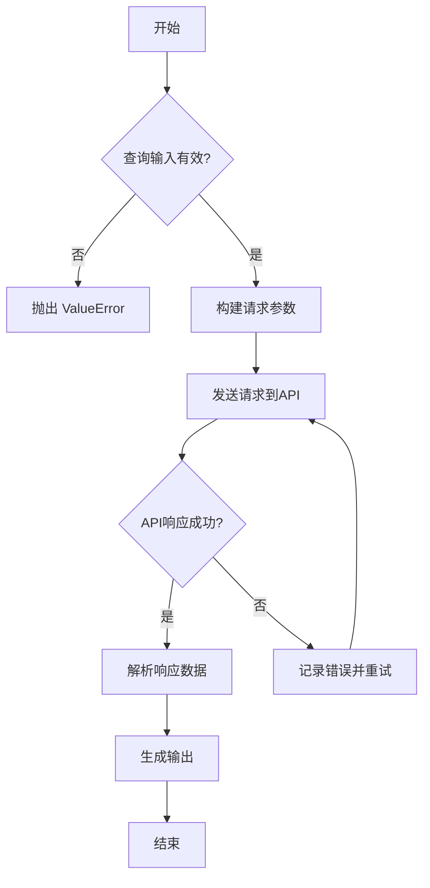
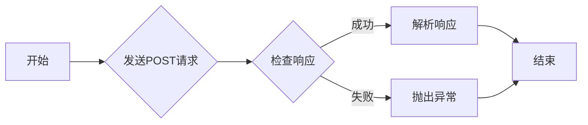
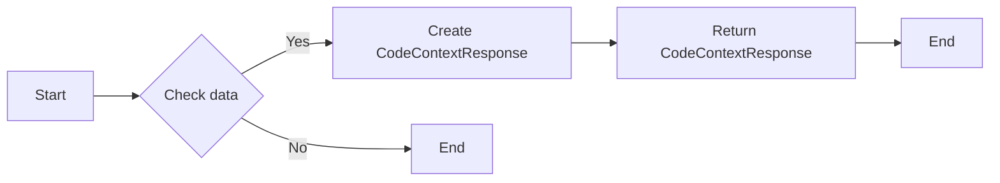
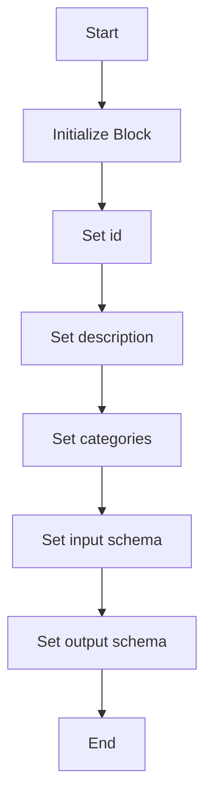
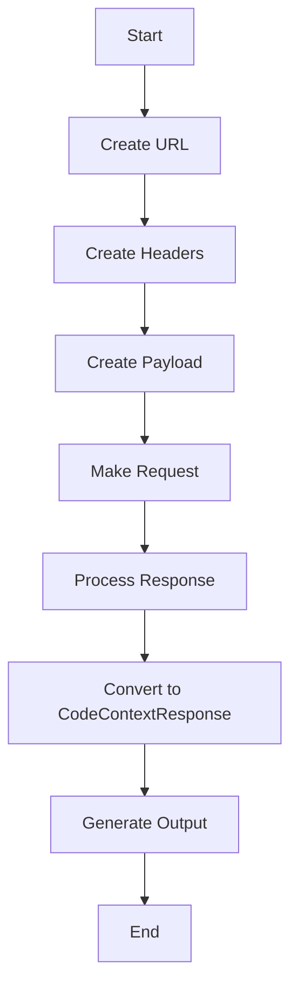

# `.\AutoGPT\autogpt_platform\backend\backend\blocks\exa\code_context.py` 详细设计文档

This code provides a code search capability to find relevant code snippets and examples from open source repositories, documentation, and Stack Overflow.

## 整体流程



## 类结构

```
ExaCodeContextBlock (主类)
├── Input (内部类)
│   ├── credentials (字段)
│   ├── query (字段)
│   └── tokens_num (字段)
├── Output (内部类)
│   ├── request_id (字段)
│   ├── query (字段)
│   ├── response (字段)
│   ├── results_count (字段)
│   ├── cost_dollars (字段)
│   ├── search_time (字段)
│   └── output_tokens (字段)
└── CodeContextResponse (类)
```

## 全局变量及字段


### `request_id`
    
Unique identifier for the API request.

类型：`str`
    


### `query`
    
The search query used to find relevant code snippets.

类型：`str`
    


### `response`
    
Formatted code snippets and contextual examples with sources.

类型：`str`
    


### `results_count`
    
Number of code sources found and included.

类型：`int`
    


### `cost_dollars`
    
Cost of the API request in dollars.

类型：`str`
    


### `search_time`
    
Time taken to search in milliseconds.

类型：`float`
    


### `output_tokens`
    
Number of tokens in the response.

类型：`int`
    


### `id`
    
Unique identifier for the ExaCodeContextBlock.

类型：`str`
    


### `description`
    
Description of the ExaCodeContextBlock.

类型：`str`
    


### `categories`
    
Categories to which the ExaCodeContextBlock belongs.

类型：`set`
    


### `input_schema`
    
Input schema for the ExaCodeContextBlock.

类型：`BlockSchemaInput`
    


### `output_schema`
    
Output schema for the ExaCodeContextBlock.

类型：`BlockSchemaOutput`
    


### `credentials`
    
Credentials required for the Exa integration.

类型：`CredentialsMetaInput`
    


### `query`
    
Search query to find relevant code snippets.

类型：`str`
    


### `tokens_num`
    
Token limit for the response.

类型：`Union[str, int]`
    


### `request_id`
    
Unique identifier for the request.

类型：`str`
    


### `query`
    
The search query used.

类型：`str`
    


### `response`
    
Formatted code snippets and contextual examples with sources.

类型：`str`
    


### `results_count`
    
Number of code sources found and included.

类型：`int`
    


### `cost_dollars`
    
Cost of the request in dollars.

类型：`str`
    


### `search_time`
    
Time taken to search in milliseconds.

类型：`float`
    


### `output_tokens`
    
Number of tokens in the response.

类型：`int`
    


### `CodeContextResponse.request_id`
    
Unique identifier for the API request.

类型：`str`
    


### `CodeContextResponse.query`
    
The search query used to find relevant code snippets.

类型：`str`
    


### `CodeContextResponse.response`
    
Formatted code snippets and contextual examples with sources.

类型：`str`
    


### `CodeContextResponse.results_count`
    
Number of code sources found and included.

类型：`int`
    


### `CodeContextResponse.cost_dollars`
    
Cost of the API request in dollars.

类型：`str`
    


### `CodeContextResponse.search_time`
    
Time taken to search in milliseconds.

类型：`float`
    


### `CodeContextResponse.output_tokens`
    
Number of tokens in the response.

类型：`int`
    


### `ExaCodeContextBlock.id`
    
Unique identifier for the ExaCodeContextBlock.

类型：`str`
    


### `ExaCodeContextBlock.description`
    
Description of the ExaCodeContextBlock.

类型：`str`
    


### `ExaCodeContextBlock.categories`
    
Categories to which the ExaCodeContextBlock belongs.

类型：`set`
    


### `ExaCodeContextBlock.input_schema`
    
Input schema for the ExaCodeContextBlock.

类型：`BlockSchemaInput`
    


### `ExaCodeContextBlock.output_schema`
    
Output schema for the ExaCodeContextBlock.

类型：`BlockSchemaOutput`
    


### `ExaCodeContextBlock.Input.credentials`
    
Credentials required for the Exa integration.

类型：`CredentialsMetaInput`
    


### `ExaCodeContextBlock.Input.query`
    
Search query to find relevant code snippets.

类型：`str`
    


### `ExaCodeContextBlock.Input.tokens_num`
    
Token limit for the response.

类型：`Union[str, int]`
    


### `ExaCodeContextBlock.Output.request_id`
    
Unique identifier for the request.

类型：`str`
    


### `ExaCodeContextBlock.Output.query`
    
The search query used.

类型：`str`
    


### `ExaCodeContextBlock.Output.response`
    
Formatted code snippets and contextual examples with sources.

类型：`str`
    


### `ExaCodeContextBlock.Output.results_count`
    
Number of code sources found and included.

类型：`int`
    


### `ExaCodeContextBlock.Output.cost_dollars`
    
Cost of the request in dollars.

类型：`str`
    


### `ExaCodeContextBlock.Output.search_time`
    
Time taken to search in milliseconds.

类型：`float`
    


### `ExaCodeContextBlock.Output.output_tokens`
    
Number of tokens in the response.

类型：`int`
    
    

## 全局函数及方法


### `Requests().post`

该函数用于向指定的URL发送POST请求，并返回响应。

参数：

- `url`：`str`，请求的URL地址。
- `headers`：`dict`，请求头信息。
- `json`：`dict`，要发送的JSON数据。

返回值：`Response`，请求的响应对象。

#### 流程图



#### 带注释源码

```python
response = await Requests().post(url, headers=headers, json=payload)
```


### CodeContextResponse.from_api

Converts API response to our stable model.

参数：

- `data`：`dict`，API response data

返回值：`CodeContextResponse`，Converted stable model

#### 流程图



#### 带注释源码

```python
@classmethod
    def from_api(cls, data: dict) -> "CodeContextResponse":
        """Convert API response to our stable model."""
        return cls(
            request_id=data.get("requestId", ""),
            query=data.get("query", ""),
            response=data.get("response", ""),
            results_count=data.get("resultsCount", 0),
            cost_dollars=data.get("costDollars", ""),
            search_time=data.get("searchTime", 0.0),
            output_tokens=data.get("outputTokens", 0),
        )
``` 


### `ExaCodeContextBlock.__init__`

This method initializes the `ExaCodeContextBlock` class, setting up its configuration and schema for the code search functionality.

参数：

- `self`：`ExaCodeContextBlock` 类的实例，用于访问类的属性和方法。

返回值：无

#### 流程图



#### 带注释源码

```python
def __init__(self):
    super().__init__(
        id="8f9e0d1c-2b3a-4567-8901-23456789abcd",
        description="Search billions of GitHub repos, docs, and Stack Overflow for relevant code examples",
        categories={BlockCategory.SEARCH, BlockCategory.DEVELOPER_TOOLS},
        input_schema=ExaCodeContextBlock.Input,
        output_schema=ExaCodeContextBlock.Output,
    )
```


### ExaCodeContextBlock.run

This method is responsible for executing the search query to find relevant code snippets and examples from open source repositories, documentation, and Stack Overflow.

参数：

- `input_data`：`Input`，The input data for the search query, including the query itself and the number of tokens to be returned.
- `credentials`：`APIKeyCredentials`，The API key credentials required for the Exa API.

返回值：`BlockOutput`，The output data containing the search results, including the request ID, query, response, number of results, cost, search time, and number of output tokens.

#### 流程图



#### 带注释源码

```python
async def run(self, input_data: Input, *, credentials: APIKeyCredentials, **kwargs) -> BlockOutput:
    url = "https://api.exa.ai/context"
    headers = {
        "Content-Type": "application/json",
        "x-api-key": credentials.api_key.get_secret_value(),
    }

    payload = {
        "query": input_data.query,
        "tokensNum": input_data.tokens_num,
    }

    response = await Requests().post(url, headers=headers, json=payload)
    data = response.json()

    context = CodeContextResponse.from_api(data)

    yield "request_id", context.request_id
    yield "query", context.query
    yield "response", context.response
    yield "results_count", context.results_count
    yield "cost_dollars", context.cost_dollars
    yield "search_time", context.search_time
    yield "output_tokens", context.output_tokens
```


## 关键组件


### 张量索引与惰性加载

用于高效地索引和访问大型数据集，同时延迟加载数据以减少内存消耗。

### 反量化支持

提供对量化策略的反量化支持，允许在量化过程中进行反向操作。

### 量化策略

定义了量化过程中的具体策略，包括量化精度、量化方法等。


## 问题及建议


### 已知问题

-   **全局变量和函数的依赖性**：代码中使用了全局变量 `exa` 和全局函数 `Requests()`，但没有明确说明它们的来源和定义。这可能导致代码的可维护性和可读性降低。
-   **异常处理**：代码中没有显示异常处理机制，如果API请求失败或数据解析出错，可能会导致程序崩溃。
-   **代码重复**：`CodeContextResponse.from_api` 方法中，字段名称和类型重复定义，这可能导致维护困难。
-   **API密钥的安全性**：API密钥直接硬编码在代码中，这可能导致安全风险。

### 优化建议

-   **引入依赖注入**：将全局变量和函数替换为依赖注入，提高代码的可测试性和可维护性。
-   **添加异常处理**：在API请求和数据解析过程中添加异常处理，确保程序的健壮性。
-   **减少代码重复**：将字段名称和类型定义移至类定义中，避免重复。
-   **安全存储API密钥**：使用环境变量或配置文件来存储API密钥，而不是将其硬编码在代码中。
-   **日志记录**：添加日志记录功能，以便于问题追踪和调试。
-   **单元测试**：编写单元测试以确保代码的正确性和稳定性。
-   **代码风格一致性**：遵循一致的代码风格指南，提高代码的可读性。
-   **性能优化**：分析代码性能，优化瓶颈，提高代码执行效率。


## 其它


### 设计目标与约束

- 设计目标：
  - 提供一个高效、准确的代码搜索功能，从开源仓库、文档和Stack Overflow中检索相关代码片段和示例。
  - 确保代码搜索结果的质量和相关性。
  - 确保用户界面友好，易于使用。
- 约束：
  - 限制搜索结果的数量，以避免过载。
  - 限制API调用频率，以避免对目标服务造成过大压力。

### 错误处理与异常设计

- 错误处理：
  - 在API调用失败时，捕获异常并返回错误信息。
  - 在数据解析失败时，捕获异常并返回错误信息。
  - 在搜索结果为空时，返回相应的提示信息。
- 异常设计：
  - 定义自定义异常类，以处理特定类型的错误。
  - 使用try-except块来捕获和处理异常。

### 数据流与状态机

- 数据流：
  - 用户输入搜索查询。
  - 系统将查询发送到API。
  - API返回搜索结果。
  - 系统处理搜索结果并返回给用户。
- 状态机：
  - 初始状态：等待用户输入。
  - 搜索状态：执行搜索并等待结果。
  - 结果状态：返回搜索结果。

### 外部依赖与接口契约

- 外部依赖：
  - `pydantic`：用于数据验证和模型定义。
  - `backend.sdk`：提供API接口和工具。
- 接口契约：
  - `APIKeyCredentials`：用于存储API密钥。
  - `Block`：定义代码块的基本属性和方法。
  - `BlockSchemaInput`和`BlockSchemaOutput`：定义输入和输出模式。
  - `Requests`：用于发送HTTP请求。
  - `CodeContextResponse`：定义API响应的模型。


    