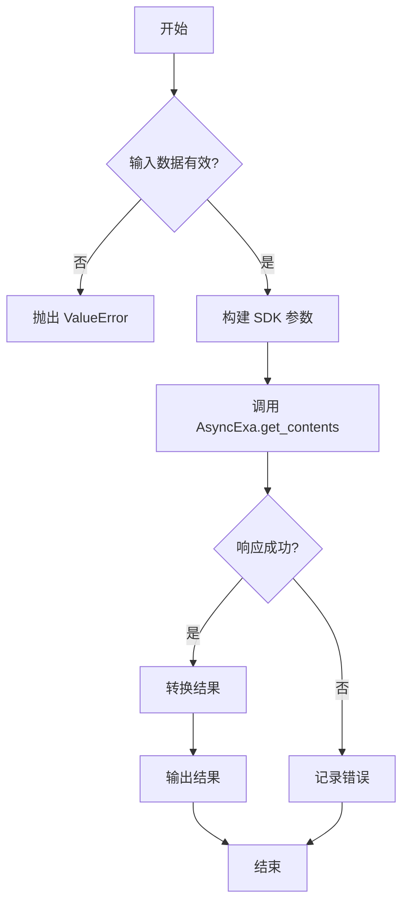
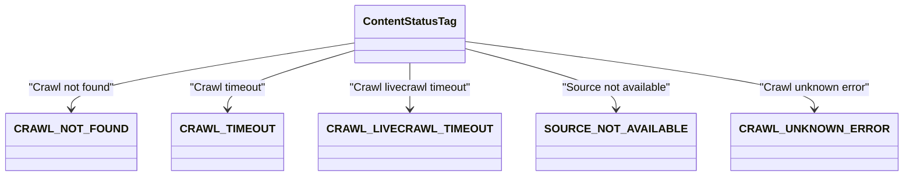
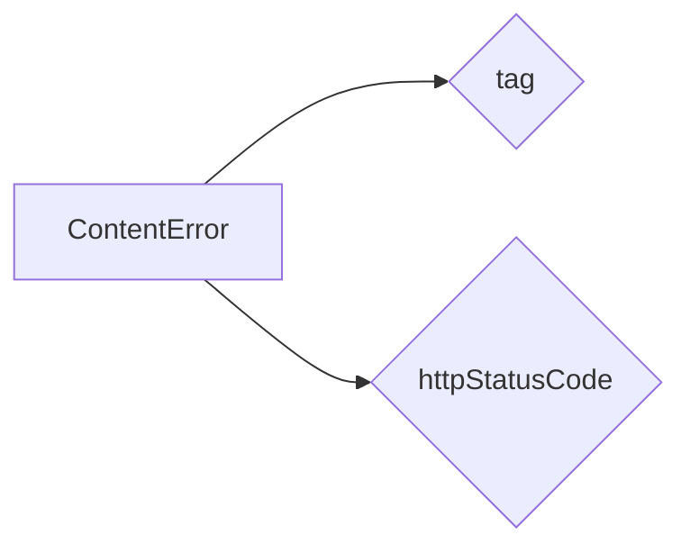
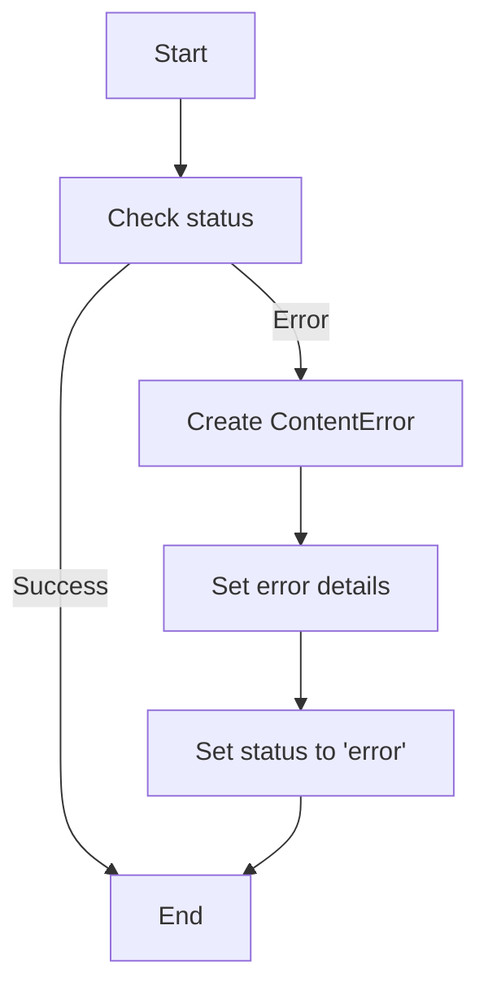
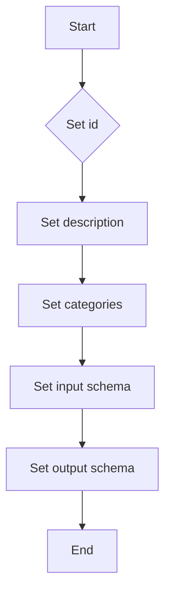
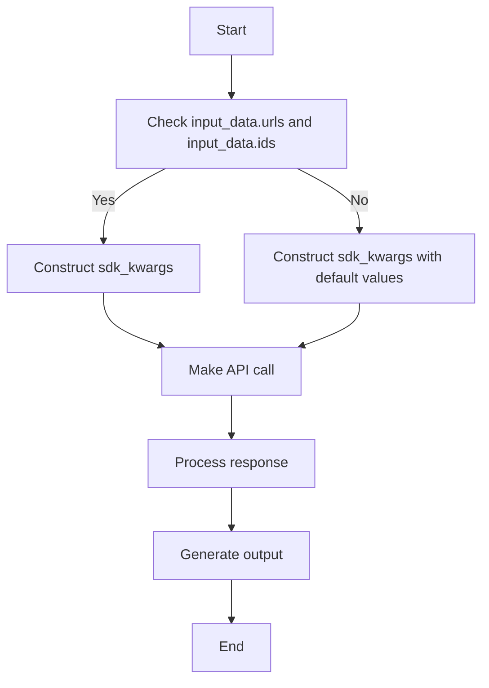
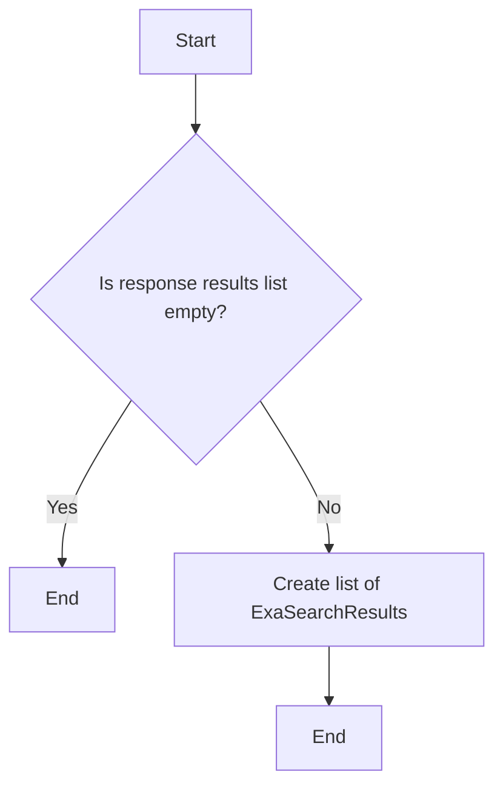

# `.\AutoGPT\autogpt_platform\backend\backend\blocks\exa\contents.py` 详细设计文档

The code defines a class ExaContentsBlock that uses Exa's contents API to retrieve document contents from URLs or document IDs. It handles various settings like text retrieval, highlights, summaries, livecrawling, and extras.

## 整体流程



## 类结构

```
ExaContentsBlock (具体类)
├── Input (类)
│   ├── credentials (CredentialsMetaInput)
│   ├── urls (list[str])
│   ├── ids (list[str])
│   ├── text (bool)
│   ├── highlights (HighlightSettings)
│   ├── summary (SummarySettings)
│   ├── livecrawl (LivecrawlTypes)
│   ├── livecrawl_timeout (int)
│   ├── subpages (int)
│   └── subpage_target (str | list[str])
│   └── extras (ExtrasSettings)
└── Output (类)
    ├── results (list[ExaSearchResults])
    ├── result (ExaSearchResults)
    ├── context (str)
    ├── request_id (str)
    ├── statuses (list[ContentStatus])
    └── cost_dollars (CostDollars)
```

## 全局变量及字段


### `exa`
    
An instance of AsyncExa used for interacting with the Exa API.

类型：`AsyncExa`
    


### `APIKeyCredentials`
    
A class representing API key credentials for the Exa API.

类型：`APIKeyCredentials`
    


### `Block`
    
A base class for blocks in the Exa system.

类型：`Block`
    


### `BlockCategory`
    
An enum representing different categories of blocks.

类型：`BlockCategory`
    


### `BlockOutput`
    
A class representing the output schema for blocks.

类型：`BlockSchemaOutput`
    


### `BlockSchemaInput`
    
A class representing the input schema for blocks.

类型：`BlockSchemaInput`
    


### `BlockSchemaOutput`
    
A class representing the output schema for blocks.

类型：`BlockSchemaOutput`
    


### `CredentialsMetaInput`
    
A class representing credentials metadata input.

类型：`CredentialsMetaInput`
    


### `SchemaField`
    
A class used to define schema fields with metadata.

类型：`SchemaField`
    


### `AsyncExa`
    
A class for asynchronous interaction with the Exa API.

类型：`AsyncExa`
    


### `CostDollars`
    
A class representing cost breakdown information.

类型：`CostDollars`
    


### `ExaSearchResults`
    
A class representing search results from the Exa API.

类型：`ExaSearchResults`
    


### `ExtrasSettings`
    
A class representing extra settings for additional content.

类型：`ExtrasSettings`
    


### `HighlightSettings`
    
A class representing settings for highlighting text snippets.

类型：`HighlightSettings`
    


### `LivecrawlTypes`
    
An enum representing different livecrawling options.

类型：`LivecrawlTypes`
    


### `SummarySettings`
    
A class representing settings for generating summaries of webpages.

类型：`SummarySettings`
    


### `ContentStatusTag.CRAWL_NOT_FOUND`
    
An enum value representing the crawl not found error.

类型：`str`
    


### `ContentStatusTag.CRAWL_TIMEOUT`
    
An enum value representing the crawl timeout error.

类型：`str`
    


### `ContentStatusTag.CRAWL_LIVECRAWL_TIMEOUT`
    
An enum value representing the live crawl timeout error.

类型：`str`
    


### `ContentStatusTag.SOURCE_NOT_AVAILABLE`
    
An enum value representing the source not available error.

类型：`str`
    


### `ContentStatusTag.CRAWL_UNKNOWN_ERROR`
    
An enum value representing the crawl unknown error.

类型：`str`
    


### `ContentError.tag`
    
The specific error type associated with the content error.

类型：`Optional[ContentStatusTag]`
    


### `ContentError.httpStatusCode`
    
The corresponding HTTP status code for the content error.

类型：`Optional[int]`
    


### `ContentStatus.id`
    
The URL that was requested.

类型：`str`
    


### `ContentStatus.status`
    
The status of the content fetch operation (success or error).

类型：`str`
    


### `ContentStatus.error`
    
Error details, only present when the status is 'error'.

类型：`Optional[ContentError]`
    


### `ExaContentsBlock.id`
    
The unique identifier for the ExaContentsBlock.

类型：`str`
    


### `ExaContentsBlock.description`
    
A description of the ExaContentsBlock.

类型：`str`
    


### `ExaContentsBlock.categories`
    
The categories to which the ExaContentsBlock belongs.

类型：`set`
    


### `ExaContentsBlock.input_schema`
    
The input schema for the ExaContentsBlock.

类型：`BlockSchemaInput`
    


### `ExaContentsBlock.output_schema`
    
The output schema for the ExaContentsBlock.

类型：`BlockSchemaOutput`
    


### `Input.credentials`
    
The credentials required for the Exa integration.

类型：`CredentialsMetaInput`
    


### `Input.urls`
    
An array of URLs to crawl.

类型：`list[str]`
    


### `Input.ids`
    
An array of document IDs obtained from searches (deprecated).

类型：`list[str]`
    


### `Input.text`
    
Whether to retrieve text content from pages.

类型：`bool`
    


### `Input.highlights`
    
Settings for highlighting text snippets from each page.

类型：`HighlightSettings`
    


### `Input.summary`
    
Settings for generating a summary of the webpage.

类型：`SummarySettings`
    


### `Input.livecrawl`
    
Options for livecrawling: never, fallback (default), always, preferred.

类型：`Optional[LivecrawlTypes]`
    


### `Input.livecrawl_timeout`
    
Timeout for livecrawling in milliseconds.

类型：`Optional[int]`
    


### `Input.subpages`
    
The number of subpages to crawl.

类型：`Optional[int]`
    


### `Input.subpage_target`
    
Keyword(s) to find specific subpages of search results.

类型：`Optional[str | list[str]]`
    


### `Input.extras`
    
Extra parameters for additional content.

类型：`ExtrasSettings`
    


### `Output.results`
    
List of document contents with metadata.

类型：`list[ExaSearchResults]`
    


### `Output.result`
    
Single document content result.

类型：`ExaSearchResults`
    


### `Output.context`
    
A formatted string of the results ready for LLMs.

类型：`str`
    


### `Output.request_id`
    
Unique identifier for the request.

类型：`str`
    


### `Output.statuses`
    
Status information for each requested URL.

类型：`list[ContentStatus]`
    


### `Output.cost_dollars`
    
Cost breakdown for the request.

类型：`Optional[CostDollars]`
    


### `Output.error`
    
Error message if the request failed.

类型：`str`
    
    

## 全局函数及方法


### `ExaContentsBlock.run`

Retrieves document contents using Exa's contents API.

参数：

- `input_data`：`Input`，The input data for the ExaContentsBlock.
- `credentials`：`APIKeyCredentials`，The credentials for the Exa API.
- `**kwargs`：`Any`，Additional keyword arguments.

返回值：`BlockOutput`，The output of the ExaContentsBlock.

#### 流程图

```mermaid
graph TD
    A[Start] --> B[Check input_data.urls or input_data.ids]
    B -->|Yes| C[Set sdk_kwargs["urls"] to input_data.urls]
    B -->|No| D[Set sdk_kwargs["ids"] to input_data.ids]
    C --> E[Check input_data.text]
    D --> E
    E -->|Yes| F[Set sdk_kwargs["text"] to {"includeHtmlTags": True}]
    E -->|No| G[Do nothing]
    F --> H[Check input_data.highlights]
    G --> H
    H -->|Modified| I[Set highlights_dict and sdk_kwargs["highlights"]]
    H -->|Not Modified| J[Do nothing]
    I --> K[Check input_data.summary]
    J --> K
    K -->|Modified| L[Set summary_dict and sdk_kwargs["summary"]]
    K -->|Not Modified| M[Do nothing]
    L --> N[Check input_data.livecrawl]
    M --> N
    N -->|Modified| O[Set sdk_kwargs["livecrawl"] to input_data.livecrawl.value]
    N -->|Not Modified| P[Do nothing]
    O --> Q[Check input_data.livecrawl_timeout]
    P --> Q
    Q -->|Set| R[sdk_kwargs["livecrawl_timeout"] to input_data.livecrawl_timeout]
    Q -->|Not Set| S[Do nothing]
    R --> T[Check input_data.subpages]
    S --> T
    T -->|Set| U[sdk_kwargs["subpages"] to input_data.subpages]
    T -->|Not Set| V[Do nothing]
    U --> W[Check input_data.subpage_target]
    V --> W
    W -->|Set| X[sdk_kwargs["subpage_target"] to input_data.subpage_target]
    W -->|Not Set| Y[Do nothing]
    X --> Z[Check input_data.extras]
    Y --> Z
    Z -->|Modified| AA[Set extras_dict and sdk_kwargs["extras"]]
    Z -->|Not Modified| AB[Do nothing]
    AA --> AC[Set sdk_kwargs["context"] to True]
    AB --> AC
    AC --> BDE[Create AsyncExa instance]
    BDE --> BD[Call aexa.get_contents with sdk_kwargs]
    BD --> BE[Convert results to ExaSearchResults]
    BE --> BF[Generate output]
    BF --> C[End]
```

#### 带注释源码

```python
async def run(self, input_data: Input, *, credentials: APIKeyCredentials, **kwargs) -> BlockOutput:
    if not input_data.urls and not input_data.ids:
        raise ValueError("Either 'urls' or 'ids' must be provided")

    sdk_kwargs = {}

    # Prefer urls over ids
    if input_data.urls:
        sdk_kwargs["urls"] = input_data.urls
    elif input_data.ids:
        sdk_kwargs["ids"] = input_data.ids

    if input_data.text:
        sdk_kwargs["text"] = {"includeHtmlTags": True}

    # Handle highlights - only include if modified from defaults
    if input_data.highlights and (
        input_data.highlights.num_sentences != 1
        or input_data.highlights.highlights_per_url != 1
        or input_data.highlights.query is not None
    ):
        highlights_dict = {}
        highlights_dict["numSentences"] = input_data.highlights.num_sentences
        highlights_dict["highlightsPerUrl"] = (
            input_data.highlights.highlights_per_url
        )
        if input_data.highlights.query:
            highlights_dict["query"] = input_data.highlights.query
        sdk_kwargs["highlights"] = highlights_dict

    # Handle summary - only include if modified from defaults
    if input_data.summary and (
        input_data.summary.query is not None
        or input_data.summary.schema is not None
    ):
        summary_dict = {}
        if input_data.summary.query:
            summary_dict["query"] = input_data.summary.query
        if input_data.summary.schema:
            summary_dict["schema"] = input_data.summary.schema
        sdk_kwargs["summary"] = summary_dict

    if input_data.livecrawl:
        sdk_kwargs["livecrawl"] = input_data.livecrawl.value

    if input_data.livecrawl_timeout is not None:
        sdk_kwargs["livecrawl_timeout"] = input_data.livecrawl_timeout

    if input_data.subpages is not None:
        sdk_kwargs["subpages"] = input_data.subpages

    if input_data.subpage_target:
        sdk_kwargs["subpage_target"] = input_data.subpage_target

    # Handle extras - only include if modified from defaults
    if input_data.extras and (
        input_data.extras.links > 0 or input_data.extras.image_links > 0
    ):
        extras_dict = {}
        if input_data.extras.links:
            extras_dict["links"] = input_data.extras.links
        if input_data.extras.image_links:
            extras_dict["image_links"] = input_data.extras.image_links
        sdk_kwargs["extras"] = extras_dict

    # Always enable context for LLM-ready output
    sdk_kwargs["context"] = True

    aexa = AsyncExa(api_key=credentials.api_key.get_secret_value())
    response = await aexa.get_contents(**sdk_kwargs)

    converted_results = [
        ExaSearchResults.from_sdk(sdk_result)
        for sdk_result in response.results or []
    ]

    yield "results", converted_results

    for result in converted_results:
        yield "result", result

    if response.context:
        yield "context", response.context

    if response.statuses:
        yield "statuses", response.statuses

    if response.cost_dollars:
        yield "cost_dollars", response.cost_dollars
```


### `ExaContentsBlock.run`

Retrieves document contents using Exa's contents API.

参数：

- `input_data`：`Input`，The input data for the ExaContentsBlock.
- `credentials`：`APIKeyCredentials`，The credentials for the Exa API.
- `**kwargs`：`Any`，Additional keyword arguments.

返回值：`BlockOutput`，The output of the ExaContentsBlock.

#### 流程图

```mermaid
graph TD
    A[Start] --> B[Check input_data.urls or input_data.ids]
    B -->|Yes| C[Set sdk_kwargs["urls"] to input_data.urls]
    B -->|No| D[Set sdk_kwargs["ids"] to input_data.ids]
    C --> E[Check input_data.text]
    D --> E
    E -->|Yes| F[Set sdk_kwargs["text"] to {"includeHtmlTags": True}]
    E -->|No| G[Do nothing]
    F --> H[Check input_data.highlights]
    G --> H
    H -->|Modified| I[Set highlights_dict and sdk_kwargs["highlights"]]
    H -->|Not Modified| J[Do nothing]
    I --> K[Check input_data.summary]
    J --> K
    K -->|Modified| L[Set summary_dict and sdk_kwargs["summary"]]
    K -->|Not Modified| M[Do nothing]
    L --> N[Check input_data.livecrawl]
    M --> N
    N -->|Set| O[Set sdk_kwargs["livecrawl"] to input_data.livecrawl.value]
    N -->|Not Set| P[Do nothing]
    O --> Q[Check input_data.livecrawl_timeout]
    P --> Q
    Q -->|Set| R[Set sdk_kwargs["livecrawl_timeout"] to input_data.livecrawl_timeout]
    Q -->|Not Set| S[Do nothing]
    R --> T[Check input_data.subpages]
    S --> T
    T -->|Set| U[Set sdk_kwargs["subpages"] to input_data.subpages]
    T -->|Not Set| V[Do nothing]
    U --> W[Check input_data.subpage_target]
    V --> W
    W -->|Set| X[Set sdk_kwargs["subpage_target"] to input_data.subpage_target]
    W -->|Not Set| Y[Do nothing]
    X --> Z[Check input_data.extras]
    Y --> Z
    Z -->|Modified| AA[Set extras_dict and sdk_kwargs["extras"]]
    Z -->|Not Modified| AB[Do nothing]
    AA --> AC[Set sdk_kwargs["context"] to True]
    AB --> AC
    AC --> BDE[Create AsyncExa instance]
    BDE --> BD[Call aexa.get_contents with sdk_kwargs]
    BD --> BE[Convert results to ExaSearchResults]
    BE --> BF[Generate output]
    BF --> C[End]
```

#### 带注释源码

```python
async def run(self, input_data: Input, *, credentials: APIKeyCredentials, **kwargs) -> BlockOutput:
    if not input_data.urls and not input_data.ids:
        raise ValueError("Either 'urls' or 'ids' must be provided")

    sdk_kwargs = {}

    # Prefer urls over ids
    if input_data.urls:
        sdk_kwargs["urls"] = input_data.urls
    elif input_data.ids:
        sdk_kwargs["ids"] = input_data.ids

    if input_data.text:
        sdk_kwargs["text"] = {"includeHtmlTags": True}

    # Handle highlights - only include if modified from defaults
    if input_data.highlights and (
        input_data.highlights.num_sentences != 1
        or input_data.highlights.highlights_per_url != 1
        or input_data.highlights.query is not None
    ):
        highlights_dict = {}
        highlights_dict["numSentences"] = input_data.highlights.num_sentences
        highlights_dict["highlightsPerUrl"] = (
            input_data.highlights.highlights_per_url
        )
        if input_data.highlights.query:
            highlights_dict["query"] = input_data.highlights.query
        sdk_kwargs["highlights"] = highlights_dict

    # Handle summary - only include if modified from defaults
    if input_data.summary and (
        input_data.summary.query is not None
        or input_data.summary.schema is not None
    ):
        summary_dict = {}
        if input_data.summary.query:
            summary_dict["query"] = input_data.summary.query
        if input_data.summary.schema:
            summary_dict["schema"] = input_data.summary.schema
        sdk_kwargs["summary"] = summary_dict

    if input_data.livecrawl:
        sdk_kwargs["livecrawl"] = input_data.livecrawl.value

    if input_data.livecrawl_timeout is not None:
        sdk_kwargs["livecrawl_timeout"] = input_data.livecrawl_timeout

    if input_data.subpages is not None:
        sdk_kwargs["subpages"] = input_data.subpages

    if input_data.subpage_target:
        sdk_kwargs["subpage_target"] = input_data.subpage_target

    # Handle extras - only include if modified from defaults
    if input_data.extras and (
        input_data.extras.links > 0 or input_data.extras.image_links > 0
    ):
        extras_dict = {}
        if input_data.extras.links:
            extras_dict["links"] = input_data.extras.links
        if input_data.extras.image_links:
            extras_dict["image_links"] = input_data.extras.image_links
        sdk_kwargs["extras"] = extras_dict

    # Always enable context for LLM-ready output
    sdk_kwargs["context"] = True

    aexa = AsyncExa(api_key=credentials.api_key.get_secret_value())
    response = await aexa.get_contents(**sdk_kwargs)

    converted_results = [
        ExaSearchResults.from_sdk(sdk_result)
        for sdk_result in response.results or []
    ]

    yield "results", converted_results

    for result in converted_results:
        yield "result", result

    if response.context:
        yield "context", response.context

    if response.statuses:
        yield "statuses", response.statuses

    if response.cost_dollars:
        yield "cost_dollars", response.cost_dollars
```


### `ExaContentsBlock.run`

Retrieves document contents using Exa's contents API.

参数：

- `input_data`：`Input`，The input data for the ExaContentsBlock.
- `credentials`：`APIKeyCredentials`，The credentials for the Exa API.
- `**kwargs`：`Any`，Additional keyword arguments.

返回值：`BlockOutput`，The output of the ExaContentsBlock.

#### 流程图

```mermaid
graph TD
    A[Start] --> B[Check input_data.urls or input_data.ids]
    B -->|Yes| C[Set sdk_kwargs["urls"] to input_data.urls]
    B -->|No| D[Set sdk_kwargs["ids"] to input_data.ids]
    C --> E[Check input_data.text]
    D --> E
    E -->|Yes| F[Set sdk_kwargs["text"] to {"includeHtmlTags": True}]
    E -->|No| G[Do nothing]
    F --> H[Check input_data.highlights]
    G --> H
    H -->|Modified| I[Set highlights_dict and sdk_kwargs["highlights"]]
    H -->|Not Modified| J[Do nothing]
    I --> K[Check input_data.summary]
    J --> K
    K -->|Modified| L[Set summary_dict and sdk_kwargs["summary"]]
    K -->|Not Modified| M[Do nothing]
    L --> N[Check input_data.livecrawl]
    M --> N
    N -->|Modified| O[Set sdk_kwargs["livecrawl"] to input_data.livecrawl.value]
    N -->|Not Modified| P[Do nothing]
    O --> Q[Check input_data.livecrawl_timeout]
    P --> Q
    Q -->|Set| R[sdk_kwargs["livecrawl_timeout"] to input_data.livecrawl_timeout]
    Q -->|Not Set| S[Do nothing]
    R --> T[Check input_data.subpages]
    S --> T
    T -->|Set| U[sdk_kwargs["subpages"] to input_data.subpages]
    T -->|Not Set| V[Do nothing]
    U --> W[Check input_data.subpage_target]
    V --> W
    W -->|Set| X[sdk_kwargs["subpage_target"] to input_data.subpage_target]
    W -->|Not Set| Y[Do nothing]
    X --> Z[Check input_data.extras]
    Y --> Z
    Z -->|Modified| AA[Set extras_dict and sdk_kwargs["extras"]]
    Z -->|Not Modified| AB[Do nothing]
    AA --> AC[Set sdk_kwargs["context"] to True]
    AB --> AC
    AC --> B1[Create AsyncExa instance]
    B1 --> B2[Call aexa.get_contents with sdk_kwargs]
    B2 --> B3[Convert response.results to ExaSearchResults]
    B3 --> B4[Generate output]
    B4 --> B5[End]
```

#### 带注释源码

```python
async def run(self, input_data: Input, *, credentials: APIKeyCredentials, **kwargs) -> BlockOutput:
    if not input_data.urls and not input_data.ids:
        raise ValueError("Either 'urls' or 'ids' must be provided")

    sdk_kwargs = {}

    # Prefer urls over ids
    if input_data.urls:
        sdk_kwargs["urls"] = input_data.urls
    elif input_data.ids:
        sdk_kwargs["ids"] = input_data.ids

    if input_data.text:
        sdk_kwargs["text"] = {"includeHtmlTags": True}

    # Handle highlights - only include if modified from defaults
    if input_data.highlights and (
        input_data.highlights.num_sentences != 1
        or input_data.highlights.highlights_per_url != 1
        or input_data.highlights.query is not None
    ):
        highlights_dict = {}
        highlights_dict["numSentences"] = input_data.highlights.num_sentences
        highlights_dict["highlightsPerUrl"] = (
            input_data.highlights.highlights_per_url
        )
        if input_data.highlights.query:
            highlights_dict["query"] = input_data.highlights.query
        sdk_kwargs["highlights"] = highlights_dict

    # Handle summary - only include if modified from defaults
    if input_data.summary and (
        input_data.summary.query is not None
        or input_data.summary.schema is not None
    ):
        summary_dict = {}
        if input_data.summary.query:
            summary_dict["query"] = input_data.summary.query
        if input_data.summary.schema:
            summary_dict["schema"] = input_data.summary.schema
        sdk_kwargs["summary"] = summary_dict

    if input_data.livecrawl:
        sdk_kwargs["livecrawl"] = input_data.livecrawl.value

    if input_data.livecrawl_timeout is not None:
        sdk_kwargs["livecrawl_timeout"] = input_data.livecrawl_timeout

    if input_data.subpages is not None:
        sdk_kwargs["subpages"] = input_data.subpages

    if input_data.subpage_target:
        sdk_kwargs["subpage_target"] = input_data.subpage_target

    # Handle extras - only include if modified from defaults
    if input_data.extras and (
        input_data.extras.links > 0 or input_data.extras.image_links > 0
    ):
        extras_dict = {}
        if input_data.extras.links:
            extras_dict["links"] = input_data.extras.links
        if input_data.extras.image_links:
            extras_dict["image_links"] = input_data.extras.image_links
        sdk_kwargs["extras"] = extras_dict

    # Always enable context for LLM-ready output
    sdk_kwargs["context"] = True

    aexa = AsyncExa(api_key=credentials.api_key.get_secret_value())
    response = await aexa.get_contents(**sdk_kwargs)

    converted_results = [
        ExaSearchResults.from_sdk(sdk_result)
        for sdk_result in response.results or []
    ]

    yield "results", converted_results

    for result in converted_results:
        yield "result", result

    if response.context:
        yield "context", response.context

    if response.statuses:
        yield "statuses", response.statuses

    if response.cost_dollars:
        yield "cost_dollars", response.cost_dollars
```


### `ExaContentsBlock.run`

Retrieves document contents using Exa's contents API.

参数：

- `input_data`：`Input`，The input data for the ExaContentsBlock.
- `credentials`：`APIKeyCredentials`，The credentials for the Exa API.
- `**kwargs`：`Any`，Additional keyword arguments.

返回值：`BlockOutput`，The output of the ExaContentsBlock.

#### 流程图

```mermaid
graph TD
    A[Start] --> B[Check input_data.urls or input_data.ids]
    B -->|Yes| C[Set sdk_kwargs["urls"] to input_data.urls]
    B -->|No| D[Set sdk_kwargs["ids"] to input_data.ids]
    C --> E[Check input_data.text]
    D --> E
    E -->|Yes| F[Set sdk_kwargs["text"] to {"includeHtmlTags": True}]
    E -->|No| G[Do nothing]
    F --> H[Check input_data.highlights]
    G --> H
    H -->|Modified| I[Set highlights_dict and sdk_kwargs["highlights"]]
    H -->|Not Modified| J[Do nothing]
    I --> K[Check input_data.summary]
    J --> K
    K -->|Modified| L[Set summary_dict and sdk_kwargs["summary"]]
    K -->|Not Modified| M[Do nothing]
    L --> N[Check input_data.livecrawl]
    M --> N
    N -->|Modified| O[Set sdk_kwargs["livecrawl"] to input_data.livecrawl.value]
    N -->|Not Modified| P[Do nothing]
    O --> Q[Check input_data.livecrawl_timeout]
    P --> Q
    Q -->|Set| R[sdk_kwargs["livecrawl_timeout"] to input_data.livecrawl_timeout]
    Q -->|Not Set| S[Do nothing]
    R --> T[Check input_data.subpages]
    S --> T
    T -->|Set| U[sdk_kwargs["subpages"] to input_data.subpages]
    T -->|Not Set| V[Do nothing]
    U --> W[Check input_data.subpage_target]
    V --> W
    W -->|Set| X[sdk_kwargs["subpage_target"] to input_data.subpage_target]
    W -->|Not Set| Y[Do nothing]
    X --> Z[Check input_data.extras]
    Y --> Z
    Z -->|Modified| AA[Set extras_dict and sdk_kwargs["extras"]]
    Z -->|Not Modified| AB[Do nothing]
    AA --> AC[Set sdk_kwargs["context"] to True]
    AC --> BD[Create AsyncExa instance]
    BD --> BE[Call aexa.get_contents with sdk_kwargs]
    BE --> BF[Convert response.results to ExaSearchResults]
    BF --> BG[Generate outputs]
    BG -->|End| C[End]
```

#### 带注释源码

```python
async def run(self, input_data: Input, *, credentials: APIKeyCredentials, **kwargs) -> BlockOutput:
    if not input_data.urls and not input_data.ids:
        raise ValueError("Either 'urls' or 'ids' must be provided")

    sdk_kwargs = {}

    # Prefer urls over ids
    if input_data.urls:
        sdk_kwargs["urls"] = input_data.urls
    elif input_data.ids:
        sdk_kwargs["ids"] = input_data.ids

    if input_data.text:
        sdk_kwargs["text"] = {"includeHtmlTags": True}

    # Handle highlights - only include if modified from defaults
    if input_data.highlights and (
        input_data.highlights.num_sentences != 1
        or input_data.highlights.highlights_per_url != 1
        or input_data.highlights.query is not None
    ):
        highlights_dict = {}
        highlights_dict["numSentences"] = input_data.highlights.num_sentences
        highlights_dict["highlightsPerUrl"] = (
            input_data.highlights.highlights_per_url
        )
        if input_data.highlights.query:
            highlights_dict["query"] = input_data.highlights.query
        sdk_kwargs["highlights"] = highlights_dict

    # Handle summary - only include if modified from defaults
    if input_data.summary and (
        input_data.summary.query is not None
        or input_data.summary.schema is not None
    ):
        summary_dict = {}
        if input_data.summary.query:
            summary_dict["query"] = input_data.summary.query
        if input_data.summary.schema:
            summary_dict["schema"] = input_data.summary.schema
        sdk_kwargs["summary"] = summary_dict

    if input_data.livecrawl:
        sdk_kwargs["livecrawl"] = input_data.livecrawl.value

    if input_data.livecrawl_timeout is not None:
        sdk_kwargs["livecrawl_timeout"] = input_data.livecrawl_timeout

    if input_data.subpages is not None:
        sdk_kwargs["subpages"] = input_data.subpages

    if input_data.subpage_target:
        sdk_kwargs["subpage_target"] = input_data.subpage_target

    # Handle extras - only include if modified from defaults
    if input_data.extras and (
        input_data.extras.links > 0 or input_data.extras.image_links > 0
    ):
        extras_dict = {}
        if input_data.extras.links:
            extras_dict["links"] = input_data.extras.links
        if input_data.extras.image_links:
            extras_dict["image_links"] = input_data.extras.image_links
        sdk_kwargs["extras"] = extras_dict

    # Always enable context for LLM-ready output
    sdk_kwargs["context"] = True

    aexa = AsyncExa(api_key=credentials.api_key.get_secret_value())
    response = await aexa.get_contents(**sdk_kwargs)

    converted_results = [
        ExaSearchResults.from_sdk(sdk_result)
        for sdk_result in response.results or []
    ]

    yield "results", converted_results

    for result in converted_results:
        yield "result", result

    if response.context:
        yield "context", response.context

    if response.statuses:
        yield "statuses", response.statuses

    if response.cost_dollars:
        yield "cost_dollars", response.cost_dollars
```


### `ExaContentsBlock.run`

Retrieves document contents using Exa's contents API.

参数：

- `input_data`：`Input`，The input data for the ExaContentsBlock.
- `credentials`：`APIKeyCredentials`，The credentials for the Exa API.
- `**kwargs`：`Any`，Additional keyword arguments.

返回值：`BlockOutput`，The output of the ExaContentsBlock.

#### 流程图

```mermaid
graph TD
    A[Start] --> B[Check input_data.urls or input_data.ids]
    B -->|Yes| C[Set sdk_kwargs["urls"] to input_data.urls]
    B -->|No| D[Set sdk_kwargs["ids"] to input_data.ids]
    C --> E[Check input_data.text]
    D --> E
    E -->|Yes| F[Set sdk_kwargs["text"] to {"includeHtmlTags": True}]
    E -->|No| G[Do nothing]
    F --> H[Check input_data.highlights]
    G --> H
    H -->|Modified| I[Set highlights_dict and sdk_kwargs["highlights"]]
    H -->|Not Modified| J[Do nothing]
    I --> K[Check input_data.summary]
    J --> K
    K -->|Modified| L[Set summary_dict and sdk_kwargs["summary"]]
    K -->|Not Modified| M[Do nothing]
    L --> N[Check input_data.livecrawl]
    M --> N
    N -->|Modified| O[Set sdk_kwargs["livecrawl"] to input_data.livecrawl.value]
    N -->|Not Modified| P[Do nothing]
    O --> Q[Check input_data.livecrawl_timeout]
    P --> Q
    Q -->|Set| R[sdk_kwargs["livecrawl_timeout"] to input_data.livecrawl_timeout]
    Q -->|Not Set| S[Do nothing]
    R --> T[Check input_data.subpages]
    S --> T
    T -->|Set| U[sdk_kwargs["subpages"] to input_data.subpages]
    T -->|Not Set| V[Do nothing]
    U --> W[Check input_data.subpage_target]
    V --> W
    W -->|Set| X[sdk_kwargs["subpage_target"] to input_data.subpage_target]
    W -->|Not Set| Y[Do nothing]
    X --> Z[Check input_data.extras]
    Y --> Z
    Z -->|Modified| AA[Set extras_dict and sdk_kwargs["extras"]]
    Z -->|Not Modified| AB[Do nothing]
    AA --> AC[Set sdk_kwargs["context"] to True]
    AB --> AC
    AC --> BDE[Create AsyncExa instance]
    BDE --> BD[Call aexa.get_contents with sdk_kwargs]
    BD --> BE[Convert results to ExaSearchResults]
    BE --> BF[Generate output]
    BF --> C[End]
```

#### 带注释源码

```python
async def run(self, input_data: Input, *, credentials: APIKeyCredentials, **kwargs) -> BlockOutput:
    if not input_data.urls and not input_data.ids:
        raise ValueError("Either 'urls' or 'ids' must be provided")

    sdk_kwargs = {}

    # Prefer urls over ids
    if input_data.urls:
        sdk_kwargs["urls"] = input_data.urls
    elif input_data.ids:
        sdk_kwargs["ids"] = input_data.ids

    if input_data.text:
        sdk_kwargs["text"] = {"includeHtmlTags": True}

    # Handle highlights - only include if modified from defaults
    if input_data.highlights and (
        input_data.highlights.num_sentences != 1
        or input_data.highlights.highlights_per_url != 1
        or input_data.highlights.query is not None
    ):
        highlights_dict = {}
        highlights_dict["numSentences"] = input_data.highlights.num_sentences
        highlights_dict["highlightsPerUrl"] = (
            input_data.highlights.highlights_per_url
        )
        if input_data.highlights.query:
            highlights_dict["query"] = input_data.highlights.query
        sdk_kwargs["highlights"] = highlights_dict

    # Handle summary - only include if modified from defaults
    if input_data.summary and (
        input_data.summary.query is not None
        or input_data.summary.schema is not None
    ):
        summary_dict = {}
        if input_data.summary.query:
            summary_dict["query"] = input_data.summary.query
        if input_data.summary.schema:
            summary_dict["schema"] = input_data.summary.schema
        sdk_kwargs["summary"] = summary_dict

    if input_data.livecrawl:
        sdk_kwargs["livecrawl"] = input_data.livecrawl.value

    if input_data.livecrawl_timeout is not None:
        sdk_kwargs["livecrawl_timeout"] = input_data.livecrawl_timeout

    if input_data.subpages is not None:
        sdk_kwargs["subpages"] = input_data.subpages

    if input_data.subpage_target:
        sdk_kwargs["subpage_target"] = input_data.subpage_target

    # Handle extras - only include if modified from defaults
    if input_data.extras and (
        input_data.extras.links > 0 or input_data.extras.image_links > 0
    ):
        extras_dict = {}
        if input_data.extras.links:
            extras_dict["links"] = input_data.extras.links
        if input_data.extras.image_links:
            extras_dict["image_links"] = input_data.extras.image_links
        sdk_kwargs["extras"] = extras_dict

    # Always enable context for LLM-ready output
    sdk_kwargs["context"] = True

    aexa = AsyncExa(api_key=credentials.api_key.get_secret_value())
    response = await aexa.get_contents(**sdk_kwargs)

    converted_results = [
        ExaSearchResults.from_sdk(sdk_result)
        for sdk_result in response.results or []
    ]

    yield "results", converted_results

    for result in converted_results:
        yield "result", result

    if response.context:
        yield "context", response.context

    if response.statuses:
        yield "statuses", response.statuses

    if response.cost_dollars:
        yield "cost_dollars", response.cost_dollars
``` 


### `ExaContentsBlock.run`

Retrieves document contents using Exa's contents API.

参数：

- `input_data`：`Input`，The input data for the ExaContentsBlock.
- `credentials`：`APIKeyCredentials`，The credentials for the Exa API.
- `**kwargs`：`Any`，Additional keyword arguments.

返回值：`BlockOutput`，The output of the ExaContentsBlock.

#### 流程图

```mermaid
graph TD
    A[Start] --> B[Check input_data.urls or input_data.ids]
    B -->|Yes| C[Set sdk_kwargs["urls"] to input_data.urls]
    B -->|No| D[Set sdk_kwargs["ids"] to input_data.ids]
    C --> E[Check input_data.text]
    D --> E
    E -->|Yes| F[Set sdk_kwargs["text"] to {"includeHtmlTags": True}]
    E -->|No| G[Do nothing]
    F --> H[Check input_data.highlights]
    G --> H
    H -->|Modified| I[Set highlights_dict and sdk_kwargs["highlights"]]
    H -->|Not Modified| J[Do nothing]
    I --> K[Check input_data.summary]
    J --> K
    K -->|Modified| L[Set summary_dict and sdk_kwargs["summary"]]
    K -->|Not Modified| M[Do nothing]
    L --> N[Check input_data.livecrawl]
    M --> N
    N -->|Modified| O[Set sdk_kwargs["livecrawl"] to input_data.livecrawl.value]
    N -->|Not Modified| P[Do nothing]
    O --> Q[Check input_data.livecrawl_timeout]
    P --> Q
    Q -->|Set| R[sdk_kwargs["livecrawl_timeout"] to input_data.livecrawl_timeout]
    Q -->|Not Set| S[Do nothing]
    R --> T[Check input_data.subpages]
    S --> T
    T -->|Set| U[sdk_kwargs["subpages"] to input_data.subpages]
    T -->|Not Set| V[Do nothing]
    U --> W[Check input_data.subpage_target]
    V --> W
    W -->|Set| X[sdk_kwargs["subpage_target"] to input_data.subpage_target]
    W -->|Not Set| Y[Do nothing]
    X --> Z[Check input_data.extras]
    Y --> Z
    Z -->|Modified| AA[Set extras_dict and sdk_kwargs["extras"]]
    Z -->|Not Modified| AB[Do nothing]
    AA --> AC[Set sdk_kwargs["context"] to True]
    AC --> BD[Create AsyncExa instance]
    BD --> BE[Call aexa.get_contents with sdk_kwargs]
    BE --> BF[Convert response.results to ExaSearchResults]
    BF --> BG[Generate outputs]
    BG -->|End| C[End]
```

#### 带注释源码

```python
async def run(self, input_data: Input, *, credentials: APIKeyCredentials, **kwargs) -> BlockOutput:
    if not input_data.urls and not input_data.ids:
        raise ValueError("Either 'urls' or 'ids' must be provided")

    sdk_kwargs = {}

    # Prefer urls over ids
    if input_data.urls:
        sdk_kwargs["urls"] = input_data.urls
    elif input_data.ids:
        sdk_kwargs["ids"] = input_data.ids

    if input_data.text:
        sdk_kwargs["text"] = {"includeHtmlTags": True}

    # Handle highlights - only include if modified from defaults
    if input_data.highlights and (
        input_data.highlights.num_sentences != 1
        or input_data.highlights.highlights_per_url != 1
        or input_data.highlights.query is not None
    ):
        highlights_dict = {}
        highlights_dict["numSentences"] = input_data.highlights.num_sentences
        highlights_dict["highlightsPerUrl"] = (
            input_data.highlights.highlights_per_url
        )
        if input_data.highlights.query:
            highlights_dict["query"] = input_data.highlights.query
        sdk_kwargs["highlights"] = highlights_dict

    # Handle summary - only include if modified from defaults
    if input_data.summary and (
        input_data.summary.query is not None
        or input_data.summary.schema is not None
    ):
        summary_dict = {}
        if input_data.summary.query:
            summary_dict["query"] = input_data.summary.query
        if input_data.summary.schema:
            summary_dict["schema"] = input_data.summary.schema
        sdk_kwargs["summary"] = summary_dict

    if input_data.livecrawl:
        sdk_kwargs["livecrawl"] = input_data.livecrawl.value

    if input_data.livecrawl_timeout is not None:
        sdk_kwargs["livecrawl_timeout"] = input_data.livecrawl_timeout

    if input_data.subpages is not None:
        sdk_kwargs["subpages"] = input_data.subpages

    if input_data.subpage_target:
        sdk_kwargs["subpage_target"] = input_data.subpage_target

    # Handle extras - only include if modified from defaults
    if input_data.extras and (
        input_data.extras.links > 0 or input_data.extras.image_links > 0
    ):
        extras_dict = {}
        if input_data.extras.links:
            extras_dict["links"] = input_data.extras.links
        if input_data.extras.image_links:
            extras_dict["image_links"] = input_data.extras.image_links
        sdk_kwargs["extras"] = extras_dict

    # Always enable context for LLM-ready output
    sdk_kwargs["context"] = True

    aexa = AsyncExa(api_key=credentials.api_key.get_secret_value())
    response = await aexa.get_contents(**sdk_kwargs)

    converted_results = [
        ExaSearchResults.from_sdk(sdk_result)
        for sdk_result in response.results or []
    ]

    yield "results", converted_results

    for result in converted_results:
        yield "result", result

    if response.context:
        yield "context", response.context

    if response.statuses:
        yield "statuses", response.statuses

    if response.cost_dollars:
        yield "cost_dollars", response.cost_dollars
```


### `ExaContentsBlock.run`

Retrieves document contents using Exa's contents API.

参数：

- `input_data`：`Input`，The input data for the ExaContentsBlock.
- `credentials`：`APIKeyCredentials`，The credentials for the Exa API.
- `**kwargs`：`Any`，Additional keyword arguments.

返回值：`BlockOutput`，The output of the ExaContentsBlock.

#### 流程图

```mermaid
graph TD
    A[Start] --> B[Check input_data.urls or input_data.ids]
    B -->|Yes| C[Set sdk_kwargs["urls"] to input_data.urls]
    B -->|No| D[Set sdk_kwargs["ids"] to input_data.ids]
    C --> E[Check input_data.text]
    D --> E
    E -->|Yes| F[Set sdk_kwargs["text"] to {"includeHtmlTags": True}]
    E -->|No| G[Do nothing]
    F --> H[Check input_data.highlights]
    G --> H
    H -->|Modified| I[Set highlights_dict and sdk_kwargs["highlights"]]
    H -->|Not Modified| J[Do nothing]
    I --> K[Check input_data.summary]
    J --> K
    K -->|Modified| L[Set summary_dict and sdk_kwargs["summary"]]
    K -->|Not Modified| M[Do nothing]
    L --> N[Check input_data.livecrawl]
    M --> N
    N -->|Modified| O[Set sdk_kwargs["livecrawl"] to input_data.livecrawl.value]
    N -->|Not Modified| P[Do nothing]
    O --> Q[Check input_data.livecrawl_timeout]
    P --> Q
    Q -->|Set| R[sdk_kwargs["livecrawl_timeout"] to input_data.livecrawl_timeout]
    Q -->|Not Set| S[Do nothing]
    R --> T[Check input_data.subpages]
    S --> T
    T -->|Set| U[sdk_kwargs["subpages"] to input_data.subpages]
    T -->|Not Set| V[Do nothing]
    U --> W[Check input_data.subpage_target]
    V --> W
    W -->|Set| X[sdk_kwargs["subpage_target"] to input_data.subpage_target]
    W -->|Not Set| Y[Do nothing]
    X --> Z[Check input_data.extras]
    Y --> Z
    Z -->|Modified| AA[Set extras_dict and sdk_kwargs["extras"]]
    Z -->|Not Modified| AB[Do nothing]
    AA --> AC[Set sdk_kwargs["context"] to True]
    AB --> AC
    AC --> BDE[Create AsyncExa instance]
    BDE --> BD[Call aexa.get_contents with sdk_kwargs]
    BD --> BE[Convert results to ExaSearchResults]
    BE --> BF[Generate output]
    BF --> C[End]
```

#### 带注释源码

```python
async def run(self, input_data: Input, *, credentials: APIKeyCredentials, **kwargs) -> BlockOutput:
    if not input_data.urls and not input_data.ids:
        raise ValueError("Either 'urls' or 'ids' must be provided")

    sdk_kwargs = {}

    # Prefer urls over ids
    if input_data.urls:
        sdk_kwargs["urls"] = input_data.urls
    elif input_data.ids:
        sdk_kwargs["ids"] = input_data.ids

    if input_data.text:
        sdk_kwargs["text"] = {"includeHtmlTags": True}

    # Handle highlights - only include if modified from defaults
    if input_data.highlights and (
        input_data.highlights.num_sentences != 1
        or input_data.highlights.highlights_per_url != 1
        or input_data.highlights.query is not None
    ):
        highlights_dict = {}
        highlights_dict["numSentences"] = input_data.highlights.num_sentences
        highlights_dict["highlightsPerUrl"] = (
            input_data.highlights.highlights_per_url
        )
        if input_data.highlights.query:
            highlights_dict["query"] = input_data.highlights.query
        sdk_kwargs["highlights"] = highlights_dict

    # Handle summary - only include if modified from defaults
    if input_data.summary and (
        input_data.summary.query is not None
        or input_data.summary.schema is not None
    ):
        summary_dict = {}
        if input_data.summary.query:
            summary_dict["query"] = input_data.summary.query
        if input_data.summary.schema:
            summary_dict["schema"] = input_data.summary.schema
        sdk_kwargs["summary"] = summary_dict

    if input_data.livecrawl:
        sdk_kwargs["livecrawl"] = input_data.livecrawl.value

    if input_data.livecrawl_timeout is not None:
        sdk_kwargs["livecrawl_timeout"] = input_data.livecrawl_timeout

    if input_data.subpages is not None:
        sdk_kwargs["subpages"] = input_data.subpages

    if input_data.subpage_target:
        sdk_kwargs["subpage_target"] = input_data.subpage_target

    # Handle extras - only include if modified from defaults
    if input_data.extras and (
        input_data.extras.links > 0 or input_data.extras.image_links > 0
    ):
        extras_dict = {}
        if input_data.extras.links:
            extras_dict["links"] = input_data.extras.links
        if input_data.extras.image_links:
            extras_dict["image_links"] = input_data.extras.image_links
        sdk_kwargs["extras"] = extras_dict

    # Always enable context for LLM-ready output
    sdk_kwargs["context"] = True

    aexa = AsyncExa(api_key=credentials.api_key.get_secret_value())
    response = await aexa.get_contents(**sdk_kwargs)

    converted_results = [
        ExaSearchResults.from_sdk(sdk_result)
        for sdk_result in response.results or []
    ]

    yield "results", converted_results

    for result in converted_results:
        yield "result", result

    if response.context:
        yield "context", response.context

    if response.statuses:
        yield "statuses", response.statuses

    if response.cost_dollars:
        yield "cost_dollars", response.cost_dollars
``` 


### `ContentStatusTag`

`ContentStatusTag` 是一个枚举类，用于定义内容状态标签。

参数：

- 无

返回值：无

#### 流程图



#### 带注释源码

```python
class ContentStatusTag(str, Enum):
    CRAWL_NOT_FOUND = "CRAWL_NOT_FOUND"
    CRAWL_TIMEOUT = "CRAWL_TIMEOUT"
    CRAWL_LIVECRAWL_TIMEOUT = "CRAWL_LIVECRAWL_TIMEOUT"
    SOURCE_NOT_AVAILABLE = "SOURCE_NOT_AVAILABLE"
    CRAWL_UNKNOWN_ERROR = "CRAWL_UNKNOWN_ERROR"
```


### `ContentError`

`ContentError` is a Pydantic model that represents an error associated with content fetching operations. It includes a tag to specify the error type and an optional HTTP status code.

参数：

- `tag`：`Optional[ContentStatusTag]`，A specific error type associated with the content fetching operation.
- `httpStatusCode`：`Optional[int]`，The corresponding HTTP status code for the error, if available.

返回值：`None`，This model is used for error representation and does not return a value.

#### 流程图



#### 带注释源码

```python
class ContentError(BaseModel):
    tag: Optional[ContentStatusTag] = SchemaField(
        default=None, description="Specific error type"
    )
    httpStatusCode: Optional[int] = SchemaField(
        default=None, description="The corresponding HTTP status code"
    )
```


### `ContentStatus`

`ContentStatus` is a Pydantic model that represents the status of a content fetch operation, including the URL, status, and error details if applicable.

参数：

- `id`：`str`，The URL that was requested
- `status`：`str`，Status of the content fetch operation (success or error)
- `error`：`Optional[ContentError]`，Error details, only present when status is 'error'

返回值：无

#### 流程图



#### 带注释源码

```python
class ContentStatus(BaseModel):
    id: str = SchemaField(description="The URL that was requested")
    status: str = SchemaField(
        description="Status of the content fetch operation (success or error)"
    )
    error: Optional[ContentError] = SchemaField(
        default=None, description="Error details, only present when status is 'error'"
    )
```


### `ExaContentsBlock.run`

Retrieves document contents using Exa's contents API.

参数：

- `input_data`：`Input`，The input data for the block, containing parameters such as URLs, IDs, text retrieval options, and other settings.
- `credentials`：`APIKeyCredentials`，The credentials required for the Exa API.
- `**kwargs`：`Any`，Additional keyword arguments that may be passed to the method.

返回值：`BlockOutput`，The output data from the Exa API, including results, statuses, and other relevant information.

#### 流程图

```mermaid
graph TD
    A[Start] --> B[Check input_data.urls or input_data.ids]
    B -->|Yes| C[Set sdk_kwargs["urls"] to input_data.urls]
    B -->|No| D[Set sdk_kwargs["ids"] to input_data.ids]
    C --> E[Check input_data.text]
    D --> E
    E -->|Yes| F[Set sdk_kwargs["text"] to {"includeHtmlTags": True}]
    E -->|No| G[Do nothing]
    F --> H[Check input_data.highlights]
    G --> H
    H -->|Modified| I[Set highlights_dict and sdk_kwargs["highlights"]]
    H -->|Not Modified| J[Do nothing]
    I --> K[Check input_data.summary]
    J --> K
    K -->|Modified| L[Set summary_dict and sdk_kwargs["summary"]]
    K -->|Not Modified| M[Do nothing]
    L --> N[Check input_data.livecrawl]
    M --> N
    N -->|Set| O[Set sdk_kwargs["livecrawl"] to input_data.livecrawl.value]
    N -->|Not Set| P[Do nothing]
    O --> Q[Check input_data.livecrawl_timeout]
    P --> Q
    Q -->|Set| R[Set sdk_kwargs["livecrawl_timeout"] to input_data.livecrawl_timeout]
    Q -->|Not Set| S[Do nothing]
    R --> T[Check input_data.subpages]
    S --> T
    T -->|Set| U[Set sdk_kwargs["subpages"] to input_data.subpages]
    T -->|Not Set| V[Do nothing]
    U --> W[Check input_data.subpage_target]
    V --> W
    W -->|Set| X[Set sdk_kwargs["subpage_target"] to input_data.subpage_target]
    W -->|Not Set| Y[Do nothing]
    X --> Z[Check input_data.extras]
    Y --> Z
    Z -->|Modified| AA[Set extras_dict and sdk_kwargs["extras"]]
    Z -->|Not Modified| AB[Do nothing]
    AA --> AC[Set sdk_kwargs["context"] to True]
    AC --> AD[Create AsyncExa instance]
    AD --> AE[Call aexa.get_contents with sdk_kwargs]
    AE --> AF[Process response]
    AF --> AG[Convert results to ExaSearchResults]
    AG --> AH[Generate outputs]
    AH --> B1[End]
```

#### 带注释源码

```python
async def run(self, input_data: Input, *, credentials: APIKeyCredentials, **kwargs) -> BlockOutput:
    if not input_data.urls and not input_data.ids:
        raise ValueError("Either 'urls' or 'ids' must be provided")

    sdk_kwargs = {}

    # Prefer urls over ids
    if input_data.urls:
        sdk_kwargs["urls"] = input_data.urls
    elif input_data.ids:
        sdk_kwargs["ids"] = input_data.ids

    if input_data.text:
        sdk_kwargs["text"] = {"includeHtmlTags": True}

    # Handle highlights - only include if modified from defaults
    if input_data.highlights and (
        input_data.highlights.num_sentences != 1
        or input_data.highlights.highlights_per_url != 1
        or input_data.highlights.query is not None
    ):
        highlights_dict = {}
        highlights_dict["numSentences"] = input_data.highlights.num_sentences
        highlights_dict["highlightsPerUrl"] = (
            input_data.highlights.highlights_per_url
        )
        if input_data.highlights.query:
            highlights_dict["query"] = input_data.highlights.query
        sdk_kwargs["highlights"] = highlights_dict

    # Handle summary - only include if modified from defaults
    if input_data.summary and (
        input_data.summary.query is not None
        or input_data.summary.schema is not None
    ):
        summary_dict = {}
        if input_data.summary.query:
            summary_dict["query"] = input_data.summary.query
        if input_data.summary.schema:
            summary_dict["schema"] = input_data.summary.schema
        sdk_kwargs["summary"] = summary_dict

    if input_data.livecrawl:
        sdk_kwargs["livecrawl"] = input_data.livecrawl.value

    if input_data.livecrawl_timeout is not None:
        sdk_kwargs["livecrawl_timeout"] = input_data.livecrawl_timeout

    if input_data.subpages is not None:
        sdk_kwargs["subpages"] = input_data.subpages

    if input_data.subpage_target:
        sdk_kwargs["subpage_target"] = input_data.subpage_target

    # Handle extras - only include if modified from defaults
    if input_data.extras and (
        input_data.extras.links > 0 or input_data.extras.image_links > 0
    ):
        extras_dict = {}
        if input_data.extras.links:
            extras_dict["links"] = input_data.extras.links
        if input_data.extras.image_links:
            extras_dict["image_links"] = input_data.extras.image_links
        sdk_kwargs["extras"] = extras_dict

    # Always enable context for LLM-ready output
    sdk_kwargs["context"] = True

    aexa = AsyncExa(api_key=credentials.api_key.get_secret_value())
    response = await aexa.get_contents(**sdk_kwargs)

    converted_results = [
        ExaSearchResults.from_sdk(sdk_result)
        for sdk_result in response.results or []
    ]

    yield "results", converted_results

    for result in converted_results:
        yield "result", result

    if response.context:
        yield "context", response.context

    if response.statuses:
        yield "statuses", response.statuses

    if response.cost_dollars:
        yield "cost_dollars", response.cost_dollars
```


### `ExaContentsBlock.run`

Retrieves document contents using Exa's contents API.

参数：

- `input_data`：`Input`，The input data for the ExaContentsBlock.
- `credentials`：`APIKeyCredentials`，The credentials for the Exa API.
- `**kwargs`：`Any`，Additional keyword arguments.

返回值：`BlockOutput`，The output of the ExaContentsBlock.

#### 流程图

```mermaid
graph TD
    A[Start] --> B[Check input_data.urls or input_data.ids]
    B -->|Yes| C[Set sdk_kwargs["urls"] to input_data.urls]
    B -->|No| D[Set sdk_kwargs["ids"] to input_data.ids]
    C --> E[Check input_data.text]
    D --> E
    E -->|Yes| F[Set sdk_kwargs["text"] to {"includeHtmlTags": True}]
    E -->|No| G[Do nothing]
    F --> H[Check input_data.highlights]
    G --> H
    H -->|Modified| I[Set highlights_dict and sdk_kwargs["highlights"]]
    H -->|Not Modified| J[Do nothing]
    I --> K[Check input_data.summary]
    J --> K
    K -->|Modified| L[Set summary_dict and sdk_kwargs["summary"]]
    K -->|Not Modified| M[Do nothing]
    L --> N[Check input_data.livecrawl]
    M --> N
    N -->|Set| O[Set sdk_kwargs["livecrawl"] to input_data.livecrawl.value]
    N -->|Not Set| P[Do nothing]
    O --> Q[Check input_data.livecrawl_timeout]
    P --> Q
    Q -->|Set| R[Set sdk_kwargs["livecrawl_timeout"] to input_data.livecrawl_timeout]
    Q -->|Not Set| S[Do nothing]
    R --> T[Check input_data.subpages]
    S --> T
    T -->|Set| U[Set sdk_kwargs["subpages"] to input_data.subpages]
    T -->|Not Set| V[Do nothing]
    U --> W[Check input_data.subpage_target]
    V --> W
    W -->|Set| X[Set sdk_kwargs["subpage_target"] to input_data.subpage_target]
    W -->|Not Set| Y[Do nothing]
    X --> Z[Check input_data.extras]
    Y --> Z
    Z -->|Modified| AA[Set extras_dict and sdk_kwargs["extras"]]
    Z -->|Not Modified| AB[Do nothing]
    AA --> AC[Set sdk_kwargs["context"] to True]
    AB --> AC
    AC --> BDE[Create AsyncExa instance]
    BDE --> BD[Call aexa.get_contents with sdk_kwargs]
    BD --> BE[Convert results to ExaSearchResults]
    BE --> BF[Generate outputs]
    BF -->|End| C[End]
```

#### 带注释源码

```python
async def run(self, input_data: Input, *, credentials: APIKeyCredentials, **kwargs) -> BlockOutput:
    if not input_data.urls and not input_data.ids:
        raise ValueError("Either 'urls' or 'ids' must be provided")

    sdk_kwargs = {}

    # Prefer urls over ids
    if input_data.urls:
        sdk_kwargs["urls"] = input_data.urls
    elif input_data.ids:
        sdk_kwargs["ids"] = input_data.ids

    if input_data.text:
        sdk_kwargs["text"] = {"includeHtmlTags": True}

    # Handle highlights - only include if modified from defaults
    if input_data.highlights and (
        input_data.highlights.num_sentences != 1
        or input_data.highlights.highlights_per_url != 1
        or input_data.highlights.query is not None
    ):
        highlights_dict = {}
        highlights_dict["numSentences"] = input_data.highlights.num_sentences
        highlights_dict["highlightsPerUrl"] = (
            input_data.highlights.highlights_per_url
        )
        if input_data.highlights.query:
            highlights_dict["query"] = input_data.highlights.query
        sdk_kwargs["highlights"] = highlights_dict

    # Handle summary - only include if modified from defaults
    if input_data.summary and (
        input_data.summary.query is not None
        or input_data.summary.schema is not None
    ):
        summary_dict = {}
        if input_data.summary.query:
            summary_dict["query"] = input_data.summary.query
        if input_data.summary.schema:
            summary_dict["schema"] = input_data.summary.schema
        sdk_kwargs["summary"] = summary_dict

    if input_data.livecrawl:
        sdk_kwargs["livecrawl"] = input_data.livecrawl.value

    if input_data.livecrawl_timeout is not None:
        sdk_kwargs["livecrawl_timeout"] = input_data.livecrawl_timeout

    if input_data.subpages is not None:
        sdk_kwargs["subpages"] = input_data.subpages

    if input_data.subpage_target:
        sdk_kwargs["subpage_target"] = input_data.subpage_target

    # Handle extras - only include if modified from defaults
    if input_data.extras and (
        input_data.extras.links > 0 or input_data.extras.image_links > 0
    ):
        extras_dict = {}
        if input_data.extras.links:
            extras_dict["links"] = input_data.extras.links
        if input_data.extras.image_links:
            extras_dict["image_links"] = input_data.extras.image_links
        sdk_kwargs["extras"] = extras_dict

    # Always enable context for LLM-ready output
    sdk_kwargs["context"] = True

    aexa = AsyncExa(api_key=credentials.api_key.get_secret_value())
    response = await aexa.get_contents(**sdk_kwargs)

    converted_results = [
        ExaSearchResults.from_sdk(sdk_result)
        for sdk_result in response.results or []
    ]

    yield "results", converted_results

    for result in converted_results:
        yield "result", result

    if response.context:
        yield "context", response.context

    if response.statuses:
        yield "statuses", response.statuses

    if response.cost_dollars:
        yield "cost_dollars", response.cost_dollars
```


### `__init__`

`ExaContentsBlock.__init__` 初始化方法用于设置 ExaContentsBlock 类的基本属性。

参数：

- `self`：`ExaContentsBlock` 类的实例

返回值：无

#### 流程图



#### 带注释源码

```python
def __init__(self):
    super().__init__(
        id="c52be83f-f8cd-4180-b243-af35f986b461",
        description="Retrieves document contents using Exa's contents API",
        categories={BlockCategory.SEARCH},
        input_schema=ExaContentsBlock.Input,
        output_schema=ExaContentsBlock.Output,
    )
```


### `run`

The `run` method is an asynchronous method that retrieves document contents using Exa's contents API. It processes the input data, constructs the necessary parameters for the API call, and then makes the API request to fetch the document contents.

参数：

- `input_data`：`Input`，The input data for the ExaContentsBlock, which includes URLs, IDs, and various settings for content retrieval.
- `credentials`：`APIKeyCredentials`，The credentials required for authentication with the Exa API.
- `**kwargs`：`Any`，Additional keyword arguments that may be passed to the method.

返回值：`BlockOutput`，The output of the ExaContentsBlock, which includes the results of the API call, such as the list of document contents with metadata, the unique request identifier, status information for each requested URL, and cost breakdown for the request.

#### 流程图



#### 带注释源码

```python
async def run(self, input_data: Input, *, credentials: APIKeyCredentials, **kwargs) -> BlockOutput:
    if not input_data.urls and not input_data.ids:
        raise ValueError("Either 'urls' or 'ids' must be provided")

    sdk_kwargs = {}

    # Prefer urls over ids
    if input_data.urls:
        sdk_kwargs["urls"] = input_data.urls
    elif input_data.ids:
        sdk_kwargs["ids"] = input_data.ids

    if input_data.text:
        sdk_kwargs["text"] = {"includeHtmlTags": True}

    # Handle highlights - only include if modified from defaults
    if input_data.highlights and (
        input_data.highlights.num_sentences != 1
        or input_data.highlights.highlights_per_url != 1
        or input_data.highlights.query is not None
    ):
        highlights_dict = {}
        highlights_dict["numSentences"] = input_data.highlights.num_sentences
        highlights_dict["highlightsPerUrl"] = (
            input_data.highlights.highlights_per_url
        )
        if input_data.highlights.query:
            highlights_dict["query"] = input_data.highlights.query
        sdk_kwargs["highlights"] = highlights_dict

    # Handle summary - only include if modified from defaults
    if input_data.summary and (
        input_data.summary.query is not None
        or input_data.summary.schema is not None
    ):
        summary_dict = {}
        if input_data.summary.query:
            summary_dict["query"] = input_data.summary.query
        if input_data.summary.schema:
            summary_dict["schema"] = input_data.summary.schema
        sdk_kwargs["summary"] = summary_dict

    if input_data.livecrawl:
        sdk_kwargs["livecrawl"] = input_data.livecrawl.value

    if input_data.livecrawl_timeout is not None:
        sdk_kwargs["livecrawl_timeout"] = input_data.livecrawl_timeout

    if input_data.subpages is not None:
        sdk_kwargs["subpages"] = input_data.subpages

    if input_data.subpage_target:
        sdk_kwargs["subpage_target"] = input_data.subpage_target

    # Handle extras - only include if modified from defaults
    if input_data.extras and (
        input_data.extras.links > 0 or input_data.extras.image_links > 0
    ):
        extras_dict = {}
        if input_data.extras.links:
            extras_dict["links"] = input_data.extras.links
        if input_data.extras.image_links:
            extras_dict["image_links"] = input_data.extras.image_links
        sdk_kwargs["extras"] = extras_dict

    # Always enable context for LLM-ready output
    sdk_kwargs["context"] = True

    aexa = AsyncExa(api_key=credentials.api_key.get_secret_value())
    response = await aexa.get_contents(**sdk_kwargs)

    converted_results = [
        ExaSearchResults.from_sdk(sdk_result)
        for sdk_result in response.results or []
    ]

    yield "results", converted_results

    for result in converted_results:
        yield "result", result

    if response.context:
        yield "context", response.context

    if response.statuses:
        yield "statuses", response.statuses

    if response.cost_dollars:
        yield "cost_dollars", response.cost_dollars
```


### `ExaContentsBlock.run`

Retrieves document contents using Exa's contents API.

参数：

- `input_data`：`Input`，The input data for the ExaContentsBlock.
- `credentials`：`APIKeyCredentials`，The credentials for the Exa API.
- `**kwargs`：`Any`，Additional keyword arguments.

返回值：`BlockOutput`，The output of the ExaContentsBlock.

#### 流程图

```mermaid
graph TD
    A[Start] --> B[Check input_data.urls or input_data.ids]
    B -->|Yes| C[Set sdk_kwargs["urls"] to input_data.urls]
    B -->|No| D[Set sdk_kwargs["ids"] to input_data.ids]
    C --> E[Check input_data.text]
    D --> E
    E -->|Yes| F[Set sdk_kwargs["text"] to {"includeHtmlTags": True}]
    E -->|No| G[Do nothing]
    F --> H[Check input_data.highlights]
    G --> H
    H -->|Modified| I[Set highlights_dict and sdk_kwargs["highlights"]]
    H -->|Not Modified| J[Do nothing]
    I --> K[Check input_data.summary]
    J --> K
    K -->|Modified| L[Set summary_dict and sdk_kwargs["summary"]]
    K -->|Not Modified| M[Do nothing]
    L --> N[Check input_data.livecrawl]
    M --> N
    N -->|Set| O[Set sdk_kwargs["livecrawl"] to input_data.livecrawl.value]
    N -->|Not Set| P[Do nothing]
    O --> Q[Check input_data.livecrawl_timeout]
    P --> Q
    Q -->|Set| R[Set sdk_kwargs["livecrawl_timeout"] to input_data.livecrawl_timeout]
    Q -->|Not Set| S[Do nothing]
    R --> T[Check input_data.subpages]
    S --> T
    T -->|Set| U[Set sdk_kwargs["subpages"] to input_data.subpages]
    T -->|Not Set| V[Do nothing]
    U --> W[Check input_data.subpage_target]
    V --> W
    W -->|Set| X[Set sdk_kwargs["subpage_target"] to input_data.subpage_target]
    W -->|Not Set| Y[Do nothing]
    X --> Z[Check input_data.extras]
    Y --> Z
    Z -->|Modified| AA[Set extras_dict and sdk_kwargs["extras"]]
    Z -->|Not Modified| AB[Do nothing]
    AA --> AC[Set sdk_kwargs["context"] to True]
    AC --> BD[Create AsyncExa instance]
    BD --> BE[Call aexa.get_contents with sdk_kwargs]
    BE --> BF[Convert results to ExaSearchResults]
    BF --> BG[Generate output]
    BG -->|End|
```

#### 带注释源码

```python
async def run(self, input_data: Input, *, credentials: APIKeyCredentials, **kwargs) -> BlockOutput:
    if not input_data.urls and not input_data.ids:
        raise ValueError("Either 'urls' or 'ids' must be provided")

    sdk_kwargs = {}

    # Prefer urls over ids
    if input_data.urls:
        sdk_kwargs["urls"] = input_data.urls
    elif input_data.ids:
        sdk_kwargs["ids"] = input_data.ids

    if input_data.text:
        sdk_kwargs["text"] = {"includeHtmlTags": True}

    # Handle highlights - only include if modified from defaults
    if input_data.highlights and (
        input_data.highlights.num_sentences != 1
        or input_data.highlights.highlights_per_url != 1
        or input_data.highlights.query is not None
    ):
        highlights_dict = {}
        highlights_dict["numSentences"] = input_data.highlights.num_sentences
        highlights_dict["highlightsPerUrl"] = (
            input_data.highlights.highlights_per_url
        )
        if input_data.highlights.query:
            highlights_dict["query"] = input_data.highlights.query
        sdk_kwargs["highlights"] = highlights_dict

    # Handle summary - only include if modified from defaults
    if input_data.summary and (
        input_data.summary.query is not None
        or input_data.summary.schema is not None
    ):
        summary_dict = {}
        if input_data.summary.query:
            summary_dict["query"] = input_data.summary.query
        if input_data.summary.schema:
            summary_dict["schema"] = input_data.summary.schema
        sdk_kwargs["summary"] = summary_dict

    if input_data.livecrawl:
        sdk_kwargs["livecrawl"] = input_data.livecrawl.value

    if input_data.livecrawl_timeout is not None:
        sdk_kwargs["livecrawl_timeout"] = input_data.livecrawl_timeout

    if input_data.subpages is not None:
        sdk_kwargs["subpages"] = input_data.subpages

    if input_data.subpage_target:
        sdk_kwargs["subpage_target"] = input_data.subpage_target

    # Handle extras - only include if modified from defaults
    if input_data.extras and (
        input_data.extras.links > 0 or input_data.extras.image_links > 0
    ):
        extras_dict = {}
        if input_data.extras.links:
            extras_dict["links"] = input_data.extras.links
        if input_data.extras.image_links:
            extras_dict["image_links"] = input_data.extras.image_links
        sdk_kwargs["extras"] = extras_dict

    # Always enable context for LLM-ready output
    sdk_kwargs["context"] = True

    aexa = AsyncExa(api_key=credentials.api_key.get_secret_value())
    response = await aexa.get_contents(**sdk_kwargs)

    converted_results = [
        ExaSearchResults.from_sdk(sdk_result)
        for sdk_result in response.results or []
    ]

    yield "results", converted_results

    for result in converted_results:
        yield "result", result

    if response.context:
        yield "context", response.context

    if response.statuses:
        yield "statuses", response.statuses

    if response.cost_dollars:
        yield "cost_dollars", response.cost_dollars
```


### `ExaContentsBlock.run`

Retrieves document contents using Exa's contents API.

参数：

- `input_data`：`Input`，The input data for the ExaContentsBlock.
- `credentials`：`APIKeyCredentials`，The credentials for the Exa API.
- `**kwargs`：`Any`，Additional keyword arguments for the Exa API.

返回值：`BlockOutput`，The output data from the Exa API.

#### 流程图

```mermaid
graph TD
    A[Start] --> B[Check input_data.urls or input_data.ids]
    B -->|Yes| C[Set sdk_kwargs["urls"] = input_data.urls]
    B -->|No| D[Set sdk_kwargs["ids"] = input_data.ids]
    C --> E[Check input_data.text]
    D --> E
    E -->|Yes| F[Set sdk_kwargs["text"] = {"includeHtmlTags": True}]
    E -->|No| G[No action]
    F --> H[Check input_data.highlights]
    G --> H
    H -->|Modified| I[Set sdk_kwargs["highlights"] = highlights_dict]
    H -->|Not Modified| J[No action]
    I --> K[Check input_data.summary]
    J --> K
    K -->|Modified| L[Set sdk_kwargs["summary"] = summary_dict]
    K -->|Not Modified| M[No action]
    L --> N[Check input_data.livecrawl]
    M --> N
    N -->|Modified| O[Set sdk_kwargs["livecrawl"] = input_data.livecrawl.value]
    N -->|Not Modified| P[No action]
    O --> Q[Check input_data.livecrawl_timeout]
    P --> Q
    Q -->|Modified| R[Set sdk_kwargs["livecrawl_timeout"] = input_data.livecrawl_timeout]
    Q -->|Not Modified| S[No action]
    R --> T[Check input_data.subpages]
    S --> T
    T -->|Modified| U[Set sdk_kwargs["subpages"] = input_data.subpages]
    T -->|Not Modified| V[No action]
    U --> W[Check input_data.subpage_target]
    V --> W
    W -->|Modified| X[Set sdk_kwargs["subpage_target"] = input_data.subpage_target]
    W -->|Not Modified| Y[No action]
    X --> Z[Check input_data.extras]
    Y --> Z
    Z -->|Modified| AA[Set sdk_kwargs["extras"] = extras_dict]
    Z -->|Not Modified| AB[No action]
    AA --> AC[Set sdk_kwargs["context"] = True]
    AC --> B[Continue]
    B -->|Continue| C[Create AsyncExa instance]
    C --> D[Call aexa.get_contents(**sdk_kwargs)]
    D --> E[Process response]
    E --> F[Convert results to ExaSearchResults]
    F --> G[Generate output]
    G --> H[End]
```

#### 带注释源码

```python
async def run(self, input_data: Input, *, credentials: APIKeyCredentials, **kwargs) -> BlockOutput:
    if not input_data.urls and not input_data.ids:
        raise ValueError("Either 'urls' or 'ids' must be provided")

    sdk_kwargs = {}

    # Prefer urls over ids
    if input_data.urls:
        sdk_kwargs["urls"] = input_data.urls
    elif input_data.ids:
        sdk_kwargs["ids"] = input_data.ids

    if input_data.text:
        sdk_kwargs["text"] = {"includeHtmlTags": True}

    # Handle highlights - only include if modified from defaults
    if input_data.highlights and (
        input_data.highlights.num_sentences != 1
        or input_data.highlights.highlights_per_url != 1
        or input_data.highlights.query is not None
    ):
        highlights_dict = {}
        highlights_dict["numSentences"] = input_data.highlights.num_sentences
        highlights_dict["highlightsPerUrl"] = (
            input_data.highlights.highlights_per_url
        )
        if input_data.highlights.query:
            highlights_dict["query"] = input_data.highlights.query
        sdk_kwargs["highlights"] = highlights_dict

    # Handle summary - only include if modified from defaults
    if input_data.summary and (
        input_data.summary.query is not None
        or input_data.summary.schema is not None
    ):
        summary_dict = {}
        if input_data.summary.query:
            summary_dict["query"] = input_data.summary.query
        if input_data.summary.schema:
            summary_dict["schema"] = input_data.summary.schema
        sdk_kwargs["summary"] = summary_dict

    if input_data.livecrawl:
        sdk_kwargs["livecrawl"] = input_data.livecrawl.value

    if input_data.livecrawl_timeout is not None:
        sdk_kwargs["livecrawl_timeout"] = input_data.livecrawl_timeout

    if input_data.subpages is not None:
        sdk_kwargs["subpages"] = input_data.subpages

    if input_data.subpage_target:
        sdk_kwargs["subpage_target"] = input_data.subpage_target

    # Handle extras - only include if modified from defaults
    if input_data.extras and (
        input_data.extras.links > 0 or input_data.extras.image_links > 0
    ):
        extras_dict = {}
        if input_data.extras.links:
            extras_dict["links"] = input_data.extras.links
        if input_data.extras.image_links:
            extras_dict["image_links"] = input_data.extras.image_links
        sdk_kwargs["extras"] = extras_dict

    # Always enable context for LLM-ready output
    sdk_kwargs["context"] = True

    aexa = AsyncExa(api_key=credentials.api_key.get_secret_value())
    response = await aexa.get_contents(**sdk_kwargs)

    converted_results = [
        ExaSearchResults.from_sdk(sdk_result)
        for sdk_result in response.results or []
    ]

    yield "results", converted_results

    for result in converted_results:
        yield "result", result

    if response.context:
        yield "context", response.context

    if response.statuses:
        yield "statuses", response.statuses

    if response.cost_dollars:
        yield "cost_dollars", response.cost_dollars
```


### converted_results

The `converted_results` function converts SDK results into `ExaSearchResults` objects.

参数：

- `sdk_result`：`ExaSearchResults`，The SDK result to be converted.

返回值：`ExaSearchResults`，A list of `ExaSearchResults` objects converted from SDK results.

#### 流程图



#### 带注释源码

```python
converted_results = [
    ExaSearchResults.from_sdk(sdk_result)
    for sdk_result in response.results or []
]
```


### ExaContentsBlock.run

Retrieves document contents using Exa's contents API.

参数：

- `input_data`：`Input`，The input data for the ExaContentsBlock.
- `credentials`：`APIKeyCredentials`，The credentials for the Exa API.
- `**kwargs`：`Any`，Additional keyword arguments.

返回值：`BlockOutput`，The output of the ExaContentsBlock.

#### 流程图

```mermaid
graph TD
    A[Start] --> B[Check input_data.urls or input_data.ids]
    B -->|Yes| C[Set sdk_kwargs["urls"] to input_data.urls]
    B -->|No| D[Set sdk_kwargs["ids"] to input_data.ids]
    C --> E[Check input_data.text]
    D --> E
    E -->|Yes| F[Set sdk_kwargs["text"] to {"includeHtmlTags": True}]
    E -->|No| G[Do nothing]
    F --> H[Check input_data.highlights]
    G --> H
    H -->|Modified| I[Set highlights_dict and sdk_kwargs["highlights"]]
    H -->|Not Modified| J[Do nothing]
    I --> K[Check input_data.summary]
    J --> K
    K -->|Modified| L[Set summary_dict and sdk_kwargs["summary"]]
    K -->|Not Modified| M[Do nothing]
    L --> N[Check input_data.livecrawl]
    M --> N
    N -->|Set| O[Set sdk_kwargs["livecrawl"] to input_data.livecrawl.value]
    N -->|Not Set| P[Do nothing]
    O --> Q[Check input_data.livecrawl_timeout]
    P --> Q
    Q -->|Set| R[Set sdk_kwargs["livecrawl_timeout"] to input_data.livecrawl_timeout]
    Q -->|Not Set| S[Do nothing]
    R --> T[Check input_data.subpages]
    S --> T
    T -->|Set| U[Set sdk_kwargs["subpages"] to input_data.subpages]
    T -->|Not Set| V[Do nothing]
    U --> W[Check input_data.subpage_target]
    V --> W
    W -->|Set| X[Set sdk_kwargs["subpage_target"] to input_data.subpage_target]
    W -->|Not Set| Y[Do nothing]
    X --> Z[Check input_data.extras]
    Y --> Z
    Z -->|Modified| AA[Set extras_dict and sdk_kwargs["extras"]]
    Z -->|Not Modified| AB[Do nothing]
    AA --> AC[Set sdk_kwargs["context"] to True]
    AB --> AC
    AC --> BDE[Create AsyncExa instance]
    BDE --> BD[Call aexa.get_contents with sdk_kwargs]
    BD --> BE[Convert results to ExaSearchResults]
    BE --> BF[Use yield to return results]
    BF -->|Result| BG[Use yield to return result]
    BF -->|Context| BH[Use yield to return context]
    BF -->|Statuses| BI[Use yield to return statuses]
    BF -->|CostDollars| BJ[Use yield to return cost_dollars]
    BG -->|End|
    BH -->|End|
    BI -->|End|
    BJ -->|End|
    BDE -->|End|
    BD -->|End|
    BE -->|End|
    BF -->|End|
    BG -->|End|
    BH -->|End|
    BI -->|End|
    BJ -->|End|
    AC -->|End|
    Z -->|End|
    AA -->|End|
    AB -->|End|
    B -->|End|
    C -->|End|
    D -->|End|
    E -->|End|
    F -->|End|
    G -->|End|
    H -->|End|
    I -->|End|
    J -->|End|
    K -->|End|
    L -->|End|
    M -->|End|
    N -->|End|
    O -->|End|
    P -->|End|
    Q -->|End|
    R -->|End|
    S -->|End|
    T -->|End|
    U -->|End|
    V -->|End|
    W -->|End|
    X -->|End|
    Y -->|End|
    Z -->|End|
    AA -->|End|
    AB -->|End|
    AC -->|End|
    BDE -->|End|
    BD -->|End|
    BE -->|End|
    BF -->|End|
    BG -->|End|
    BH -->|End|
    BI -->|End|
    BJ -->|End|
    B -->|End|
    C -->|End|
    D -->|End|
    E -->|End|
    F -->|End|
    G -->|End|
    H -->|End|
    I -->|End|
    J -->|End|
    K -->|End|
    L -->|End|
    M -->|End|
    N -->|End|
    O -->|End|
    P -->|End|
    Q -->|End|
    R -->|End|
    S -->|End|
    T -->|End|
    U -->|End|
    V -->|End|
    W -->|End|
    X -->|End|
    Y -->|End|
    Z -->|End|
    AA -->|End|
    AB -->|End|
    AC -->|End|
    BDE -->|End|
    BD -->|End|
    BE -->|End|
    BF -->|End|
    BG -->|End|
    BH -->|End|
    BI -->|End|
    BJ -->|End|
    B -->|End|
    C -->|End|
    D -->|End|
    E -->|End|
    F -->|End|
    G -->|End|
    H -->|End|
    I -->|End|
    J -->|End|
    K -->|End|
    L -->|End|
    M -->|End|
    N -->|End|
    O -->|End|
    P -->|End|
    Q -->|End|
    R -->|End|
    S -->|End|
    T -->|End|
    U -->|End|
    V -->|End|
    W -->|End|
    X -->|End|
    Y -->|End|
    Z -->|End|
    AA -->|End|
    AB -->|End|
    AC -->|End|
    BDE -->|End|
    BD -->|End|
    BE -->|End|
    BF -->|End|
    BG -->|End|
    BH -->|End|
    BI -->|End|
    BJ -->|End|
    B -->|End|
    C -->|End|
    D -->|End|
    E -->|End|
    F -->|End|
    G -->|End|
    H -->|End|
    I -->|End|
    J -->|End|
    K -->|End|
    L -->|End|
    M -->|End|
    N -->|End|
    O -->|End|
    P -->|End|
    Q -->|End|
    R -->|End|
    S -->|End|
    T -->|End|
    U -->|End|
    V -->|End|
    W -->|End|
    X -->|End|
    Y -->|End|
    Z -->|End|
    AA -->|End|
    AB -->|End|
    AC -->|End|
    BDE -->|End|
    BD -->|End|
    BE -->|End|
    BF -->|End|
    BG -->|End|
    BH -->|End|
    BI -->|End|
    BJ -->|End|
    B -->|End|
    C -->|End|
    D -->|End|
    E -->|End|
    F -->|End|
    G -->|End|
    H -->|End|
    I -->|End|
    J -->|End|
    K -->|End|
    L -->|End|
    M -->|End|
    N -->|End|
    O -->|End|
    P -->|End|
    Q -->|End|
    R -->|End|
    S -->|End|
    T -->|End|
    U -->|End|
    V -->|End|
    W -->|End|
    X -->|End|
    Y -->|End|
    Z -->|End|
    AA -->|End|
    AB -->|End|
    AC -->|End|
    BDE -->|End|
    BD -->|End|
    BE -->|End|
    BF -->|End|
    BG -->|End|
    BH -->|End|
    BI -->|End|
    BJ -->|End|
    B -->|End|
    C -->|End|
    D -->|End|
    E -->|End|
    F -->|End|
    G -->|End|
    H -->|End|
    I -->|End|
    J -->|End|
    K -->|End|
    L -->|End|
    M -->|End|
    N -->|End|
    O -->|End|
    P -->|End|
    Q -->|End|
    R -->|End|
    S -->|End|
    T -->|End|
    U -->|End|
    V -->|End|
    W -->|End|
    X -->|End|
    Y -->|End|
    Z -->|End|
    AA -->|End|
    AB -->|End|
    AC -->|End|
    BDE -->|End|
    BD -->|End|
    BE -->|End|
    BF -->|End|
    BG -->|End|
    BH -->|End|
    BI -->|End|
    BJ -->|End|
    B -->|End|
    C -->|End|
    D -->|End|
    E -->|End|
    F -->|End|
    G -->|End|
    H -->|End|
    I -->|End|
    J -->|End|
    K -->|End|
    L -->|End|
    M -->|End|
    N -->|End|
    O -->|End|
    P -->|End|
    Q -->|End|
    R -->|End|
    S -->|End|
    T -->|End|
    U -->|End|
    V -->|End|
    W -->|End|
    X -->|End|
    Y -->|End|
    Z -->|End|
    AA -->|End|
    AB -->|End|
    AC -->|End|
    BDE -->|End|
    BD -->|End|
    BE -->|End|
    BF -->|End|
    BG -->|End|
    BH -->|End|
    BI -->|End|
    BJ -->|End|
    B -->|End|
    C -->|End|
    D -->|End|
    E -->|End|
    F -->|End|
    G -->|End|
    H -->|End|
    I -->|End|
    J -->|End|
    K -->|End|
    L -->|End|
    M -->|End|
    N -->|End|
    O -->|End|
    P -->|End|
    Q -->|End|
    R -->|End|
    S -->|End|
    T -->|End|
    U -->|End|
    V -->|End|
    W -->|End|
    X -->|End|
    Y -->|End|
    Z -->|End|
    AA -->|End|
    AB -->|End|
    AC -->|End|
    BDE -->|End|
    BD -->|End|
    BE -->|End|
    BF -->|End|
    BG -->|End|
    BH -->|End|
    BI -->|End|
    BJ -->|End|
    B -->|End|
    C -->|End|
    D -->|End|
    E -->|End|
    F -->|End|
    G -->|End|
    H -->|End|
    I -->|End|
    J -->|End|
    K -->|End|
    L -->|End|
    M -->|End|
    N -->|End|
    O -->|End|
    P -->|End|
    Q -->|End|
    R -->|End|
    S -->|End|
    T -->|End|
    U -->|End|
    V -->|End|
    W -->|End|
    X -->|End|
    Y -->|End|
    Z -->|End|
    AA -->|End|
    AB -->|End|
    AC -->|End|
    BDE -->|End|
    BD -->|End|
    BE -->|End|
    BF -->|End|
    BG -->|End|
    BH -->|End|
    BI -->|End|
    BJ -->|End|
    B -->|End|
    C -->|End|
    D -->|End|
    E -->|End|
    F -->|End|
    G -->|End|
    H -->|End|
    I -->|End|
    J -->|End|
    K -->|End|
    L -->|End|
    M -->|End|
    N -->|End|
    O -->|End|
    P -->|End|
    Q -->|End|
    R -->|End|
    S -->|End|
    T -->|End|
    U -->|End|
    V -->|End|
    W -->|End|
    X -->|End|
    Y -->|End|
    Z -->|End|
    AA -->|End|
    AB -->|End|
    AC -->|End|
    BDE -->|End|
    BD -->|End|
    BE -->|End|
    BF -->|End|
    BG -->|End|
    BH -->|End|
    BI -->|End|
    BJ -->|End|
    B -->|End|
    C -->|End|
    D -->|End|
    E -->|End|
    F -->|End|
    G -->|End|
    H -->|End|
    I -->|End|
    J -->|End|
    K -->|End|
    L -->|End|
    M -->|End|
    N -->|End|
    O -->|End|
    P -->|End|
    Q -->|End|
    R -->|End|
    S -->|End|
    T -->|End|
    U -->|End|
    V -->|End|
    W -->|End|
    X -->|End|
    Y -->|End|
    Z -->|End|
    AA -->|End|
    AB -->|End|
    AC -->|End|
    BDE -->|End|
    BD -->|End|
    BE -->|End|
    BF -->|End|
    BG -->|End|
    BH -->|End|
    BI -->|End|
    BJ -->|End|
    B -->|End|
    C -->|End|
    D -->|End|
    E -->|End|
    F -->|End|
    G -->|End|
    H -->|End|
    I -->|End|
    J -->|End|
    K -->|End|
    L -->|End|
    M -->|End|
    N -->|End|
    O -->|End|
    P -->|End|
    Q -->|End|
    R -->|End|
    S -->|End|
    T -->|End|
    U -->|End|
    V -->|End|
    W -->|End|
    X -->|End|
    Y -->|End|
    Z -->|End|
    AA -->|End|
    AB -->|End|
    AC -->|End|
    BDE -->|End|
    BD -->|End|
    BE -->|End|
    BF -->|End|
    BG -->|End|
    BH -->|End|
    BI -->|End|
    BJ -->|End|
    B -->|End|
    C -->|End|
    D -->|End|
    E -->|End|
    F -->|End|
    G -->|End|
    H -->|End|
    I -->|End|
    J -->|End|
    K -->|End|
    L -->|End|
    M -->|End|
    N -->|End|
    O -->|End|
    P -->|End|
    Q -->|End|
    R -->|End|
    S -->|End|
    T -->|End|
    U -->|End|
    V -->|End|
    W -->|End|
    X -->|End|
    Y -->|End|
    Z -->|End|
    AA -->|End|
    AB -->|End|
    AC -->|End|
    BDE -->|End|
    BD -->|End|
    BE -->|End|
    BF -->|End|
    BG -->|End|
    BH -->|End|
    BI -->|End|
    BJ -->|End|
    B -->|End|
    C -->|End|
    D -->|End|
    E -->|End|
    F -->|End|
    G -->|End|
    H -->|End|
    I -->|End|
    J -->|End|
    K -->|End|
    L -->|End|
    M -->|End|
    N -->|End|
    O -->|End|
    P -->|End|
    Q -->|End|
    R -->|End|
    S -->|End|
    T -->|End|
    U -->|End|
    V -->|End|
    W -->|End|
    X -->|End|
    Y -->|End|
    Z -->|End|
    AA -->|End|
    AB -->|End|
    AC -->|End|
    BDE -->|End|
    BD -->|End|
    BE -->|End|
    BF -->|End|
    BG -->|End|
    BH -->|End|
    BI -->|End|
    BJ -->|End|
    B -->|End|
    C -->|End|
    D -->|End|
    E -->|End|
    F -->|End|
    G -->|End|
    H -->|End|
    I -->|End|
    J -->|End|
    K -->|End|
    L -->|End|
    M -->|End|
    N -->|End|
    O -->|End|
    P -->|End|
    Q -->|End|
    R -->|End|
    S -->|End|
    T -->|End|
    U -->|End|
    V -->|End|
    W -->|End|
    X -->|End|
    Y -->|End|
    Z -->|End|
    AA -->|End|
    AB -->|End|
    AC -->|End|
    BDE -->|End|
    BD -->|End|
    BE -->|End|
    BF -->|End|
    BG -->|End|
    BH -->|End|
    BI -->|End|
    BJ -->|End|
    B -->|End|
    C -->|End|
    D -->|End|
    E -->|End|
    F -->|End|
    G -->|End|
    H -->|End|
    I -->|End|
    J -->|End|
    K -->|End|


### `for result in converted_results:`

This loop iterates over the `converted_results` list, which contains `ExaSearchResults` objects converted from SDK results.

参数：

- `result`：`ExaSearchResults`，The `ExaSearchResults` object representing a single document content result.

返回值：无

#### 流程图

```mermaid
graph TD
    A[Start] --> B[Iterate over converted_results]
    B --> C[For each result]
    C --> D[Process result]
    D --> E[End]
```

#### 带注释源码

```
for result in converted_results:
    yield "result", result
```


### `run`

The `run` method is an asynchronous method that retrieves document contents using Exa's contents API. It processes the input data, constructs the necessary parameters for the API call, and yields the results.

参数：

- `input_data`：`Input`，The input data for the block, containing parameters such as URLs, IDs, text retrieval options, and other settings.
- `credentials`：`APIKeyCredentials`，The credentials required for the Exa API, including the API key.
- `**kwargs`：`Any`，Additional keyword arguments that may be passed to the method.

返回值：`BlockOutput`，The output of the block, containing the results of the API call, including the context, results, statuses, cost breakdown, and any error messages.

#### 流程图

```mermaid
graph TD
    A[Start] --> B[Check input_data.urls or input_data.ids]
    B -->|Yes| C[Set sdk_kwargs["urls"] to input_data.urls]
    B -->|No| D[Set sdk_kwargs["ids"] to input_data.ids]
    C --> E[Check input_data.text]
    D --> E
    E -->|Yes| F[Set sdk_kwargs["text"] to {"includeHtmlTags": True}]
    E -->|No| G[Do nothing]
    F --> H[Check input_data.highlights]
    G --> H
    H -->|Modified| I[Set highlights_dict and sdk_kwargs["highlights"]]
    H -->|Not Modified| J[Do nothing]
    I --> K[Check input_data.summary]
    J --> K
    K -->|Modified| L[Set summary_dict and sdk_kwargs["summary"]]
    K -->|Not Modified| M[Do nothing]
    L --> N[Check input_data.livecrawl]
    M --> N
    N -->|Set| O[Set sdk_kwargs["livecrawl"] to input_data.livecrawl.value]
    N -->|Not Set| P[Do nothing]
    O --> Q[Check input_data.livecrawl_timeout]
    P --> Q
    Q -->|Set| R[Set sdk_kwargs["livecrawl_timeout"] to input_data.livecrawl_timeout]
    Q -->|Not Set| S[Do nothing]
    R --> T[Check input_data.subpages]
    S --> T
    T -->|Set| U[Set sdk_kwargs["subpages"] to input_data.subpages]
    T -->|Not Set| V[Do nothing]
    U --> W[Check input_data.subpage_target]
    V --> W
    W -->|Set| X[Set sdk_kwargs["subpage_target"] to input_data.subpage_target]
    W -->|Not Set| Y[Do nothing]
    X --> Z[Check input_data.extras]
    Y --> Z
    Z -->|Modified| AA[Set extras_dict and sdk_kwargs["extras"]]
    Z -->|Not Modified| AB[Do nothing]
    AA --> AC[Set sdk_kwargs["context"] to True]
    AB --> AC
    AC --> B1[Create AsyncExa instance]
    B1 --> B2[Call aexa.get_contents with sdk_kwargs]
    B2 --> B3[Process response]
    B3 --> B4[Convert results to ExaSearchResults]
    B4 --> B5[_yield results]
    B5 --> B6[Process each result]
    B6 --> B7[Process context if present]
    B7 --> B8[Process statuses if present]
    B8 --> B9[Process cost_dollars if present]
    B9 --> B10[Process error if present]
    B10 --> B11[End]
```

#### 带注释源码

```python
async def run(self, input_data: Input, *, credentials: APIKeyCredentials, **kwargs) -> BlockOutput:
    if not input_data.urls and not input_data.ids:
        raise ValueError("Either 'urls' or 'ids' must be provided")

    sdk_kwargs = {}

    # Prefer urls over ids
    if input_data.urls:
        sdk_kwargs["urls"] = input_data.urls
    elif input_data.ids:
        sdk_kwargs["ids"] = input_data.ids

    if input_data.text:
        sdk_kwargs["text"] = {"includeHtmlTags": True}

    # Handle highlights - only include if modified from defaults
    if input_data.highlights and (
        input_data.highlights.num_sentences != 1
        or input_data.highlights.highlights_per_url != 1
        or input_data.highlights.query is not None
    ):
        highlights_dict = {}
        highlights_dict["numSentences"] = input_data.highlights.num_sentences
        highlights_dict["highlightsPerUrl"] = (
            input_data.highlights.highlights_per_url
        )
        if input_data.highlights.query:
            highlights_dict["query"] = input_data.highlights.query
        sdk_kwargs["highlights"] = highlights_dict

    # Handle summary - only include if modified from defaults
    if input_data.summary and (
        input_data.summary.query is not None
        or input_data.summary.schema is not None
    ):
        summary_dict = {}
        if input_data.summary.query:
            summary_dict["query"] = input_data.summary.query
        if input_data.summary.schema:
            summary_dict["schema"] = input_data.summary.schema
        sdk_kwargs["summary"] = summary_dict

    if input_data.livecrawl:
        sdk_kwargs["livecrawl"] = input_data.livecrawl.value

    if input_data.livecrawl_timeout is not None:
        sdk_kwargs["livecrawl_timeout"] = input_data.livecrawl_timeout

    if input_data.subpages is not None:
        sdk_kwargs["subpages"] = input_data.subpages

    if input_data.subpage_target:
        sdk_kwargs["subpage_target"] = input_data.subpage_target

    # Handle extras - only include if modified from defaults
    if input_data.extras and (
        input_data.extras.links > 0 or input_data.extras.image_links > 0
    ):
        extras_dict = {}
        if input_data.extras.links:
            extras_dict["links"] = input_data.extras.links
        if input_data.extras.image_links:
            extras_dict["image_links"] = input_data.extras.image_links
        sdk_kwargs["extras"] = extras_dict

    # Always enable context for LLM-ready output
    sdk_kwargs["context"] = True

    aexa = AsyncExa(api_key=credentials.api_key.get_secret_value())
    response = await aexa.get_contents(**sdk_kwargs)

    converted_results = [
        ExaSearchResults.from_sdk(sdk_result)
        for sdk_result in response.results or []
    ]

    yield "results", converted_results

    for result in converted_results:
        yield "result", result

    if response.context:
        yield "context", response.context

    if response.statuses:
        yield "statuses", response.statuses

    if response.cost_dollars:
        yield "cost_dollars", response.cost_dollars
```


### `run`

`ExaContentsBlock` 类的 `run` 方法

描述：

`run` 方法是 `ExaContentsBlock` 类的一个异步方法，它负责执行文档内容的检索操作。该方法使用 Exa 的内容 API 来获取文档内容，并根据输入参数构建相应的请求。

参数：

- `input_data`：`Input` 类型，包含输入数据的详细信息，如 URL、ID、文本内容、高亮设置、摘要设置等。
- `credentials`：`APIKeyCredentials` 类型，包含用于访问 Exa API 的凭据。
- `**kwargs`：用于传递额外的关键字参数。

返回值：`BlockOutput` 类型，包含检索到的文档内容、状态信息、成本详情等。

#### 流程图

```mermaid
graph TD
    A[Start] --> B[Check input_data.urls or input_data.ids]
    B -->|Yes| C[Set sdk_kwargs["urls"] to input_data.urls]
    B -->|No| D[Set sdk_kwargs["ids"] to input_data.ids]
    C --> E[Check input_data.text]
    D --> E
    E -->|Yes| F[Set sdk_kwargs["text"] to {"includeHtmlTags": True}]
    E -->|No| G[Do nothing]
    F --> H[Check input_data.highlights]
    G --> H
    H -->|Modified| I[Set highlights_dict and sdk_kwargs["highlights"]]
    H -->|Not Modified| J[Do nothing]
    I --> K[Check input_data.summary]
    J --> K
    K -->|Modified| L[Set summary_dict and sdk_kwargs["summary"]]
    K -->|Not Modified| M[Do nothing]
    L --> N[Check input_data.livecrawl]
    M --> N
    N -->|Set| O[Set sdk_kwargs["livecrawl"] to input_data.livecrawl.value]
    N -->|Not Set| P[Do nothing]
    O --> Q[Check input_data.livecrawl_timeout]
    P --> Q
    Q -->|Set| R[Set sdk_kwargs["livecrawl_timeout"] to input_data.livecrawl_timeout]
    Q -->|Not Set| S[Do nothing]
    R --> T[Check input_data.subpages]
    S --> T
    T -->|Set| U[Set sdk_kwargs["subpages"] to input_data.subpages]
    T -->|Not Set| V[Do nothing]
    U --> W[Check input_data.subpage_target]
    V --> W
    W -->|Set| X[Set sdk_kwargs["subpage_target"] to input_data.subpage_target]
    W -->|Not Set| Y[Do nothing]
    X --> Z[Check input_data.extras]
    Y --> Z
    Z -->|Modified| AA[Set extras_dict and sdk_kwargs["extras"]]
    Z -->|Not Modified| AB[Do nothing]
    AA --> AC[Set sdk_kwargs["context"] to True]
    AB --> AC
    AC --> BDE[Create AsyncExa instance]
    BDE --> BD[Call aexa.get_contents with sdk_kwargs]
    BD -->|Success| BE[Convert results to ExaSearchResults]
    BD -->|Failure| BF[Return error message]
    BE --> BG[Generate "results"]
    BG --> BH[Generate "result"]
    BH --> BI[Generate "context"]
    BI --> BJ[Generate "statuses"]
    BJ --> BK[Generate "cost_dollars"]
    BK --> BL[End]
    BF --> BL
```

#### 带注释源码

```python
async def run(self, input_data: Input, *, credentials: APIKeyCredentials, **kwargs) -> BlockOutput:
    if not input_data.urls and not input_data.ids:
        raise ValueError("Either 'urls' or 'ids' must be provided")

    sdk_kwargs = {}

    # Prefer urls over ids
    if input_data.urls:
        sdk_kwargs["urls"] = input_data.urls
    elif input_data.ids:
        sdk_kwargs["ids"] = input_data.ids

    if input_data.text:
        sdk_kwargs["text"] = {"includeHtmlTags": True}

    # Handle highlights - only include if modified from defaults
    if input_data.highlights and (
        input_data.highlights.num_sentences != 1
        or input_data.highlights.highlights_per_url != 1
        or input_data.highlights.query is not None
    ):
        highlights_dict = {}
        highlights_dict["numSentences"] = input_data.highlights.num_sentences
        highlights_dict["highlightsPerUrl"] = (
            input_data.highlights.highlights_per_url
        )
        if input_data.highlights.query:
            highlights_dict["query"] = input_data.highlights.query
        sdk_kwargs["highlights"] = highlights_dict

    # Handle summary - only include if modified from defaults
    if input_data.summary and (
        input_data.summary.query is not None
        or input_data.summary.schema is not None
    ):
        summary_dict = {}
        if input_data.summary.query:
            summary_dict["query"] = input_data.summary.query
        if input_data.summary.schema:
            summary_dict["schema"] = input_data.summary.schema
        sdk_kwargs["summary"] = summary_dict

    if input_data.livecrawl:
        sdk_kwargs["livecrawl"] = input_data.livecrawl.value

    if input_data.livecrawl_timeout is not None:
        sdk_kwargs["livecrawl_timeout"] = input_data.livecrawl_timeout

    if input_data.subpages is not None:
        sdk_kwargs["subpages"] = input_data.subpages

    if input_data.subpage_target:
        sdk_kwargs["subpage_target"] = input_data.subpage_target

    # Handle extras - only include if modified from defaults
    if input_data.extras and (
        input_data.extras.links > 0 or input_data.extras.image_links > 0
    ):
        extras_dict = {}
        if input_data.extras.links:
            extras_dict["links"] = input_data.extras.links
        if input_data.extras.image_links:
            extras_dict["image_links"] = input_data.extras.image_links
        sdk_kwargs["extras"] = extras_dict

    # Always enable context for LLM-ready output
    sdk_kwargs["context"] = True

    aexa = AsyncExa(api_key=credentials.api_key.get_secret_value())
    response = await aexa.get_contents(**sdk_kwargs)

    converted_results = [
        ExaSearchResults.from_sdk(sdk_result)
        for sdk_result in response.results or []
    ]

    yield "results", converted_results

    for result in converted_results:
        yield "result", result

    if response.context:
        yield "context", response.context

    if response.statuses:
        yield "statuses", response.statuses

    if response.cost_dollars:
        yield "cost_dollars", response.cost_dollars
```


### `ExaContentsBlock.run`

Retrieves document contents using Exa's contents API.

参数：

- `input_data`：`Input`，The input data for the ExaContentsBlock.
- `credentials`：`APIKeyCredentials`，The credentials for the Exa API.
- `**kwargs`：`Any`，Additional keyword arguments.

返回值：`BlockOutput`，The output of the ExaContentsBlock.

#### 流程图

```mermaid
graph TD
    A[Start] --> B[Check input_data.urls or input_data.ids]
    B -->|Yes| C[Set sdk_kwargs["urls"] to input_data.urls]
    B -->|No| D[Set sdk_kwargs["ids"] to input_data.ids]
    C --> E[Check input_data.text]
    D --> E
    E -->|Yes| F[Set sdk_kwargs["text"] to {"includeHtmlTags": True}]
    E -->|No| G[Do nothing]
    F --> H[Check input_data.highlights]
    G --> H
    H -->|Modified| I[Set highlights_dict and sdk_kwargs["highlights"]]
    H -->|Not Modified| J[Do nothing]
    I --> K[Check input_data.summary]
    J --> K
    K -->|Modified| L[Set summary_dict and sdk_kwargs["summary"]]
    K -->|Not Modified| M[Do nothing]
    L --> N[Check input_data.livecrawl]
    M --> N
    N -->|Set| O[Set sdk_kwargs["livecrawl"] to input_data.livecrawl.value]
    N -->|Not Set| P[Do nothing]
    O --> Q[Check input_data.livecrawl_timeout]
    P --> Q
    Q -->|Set| R[Set sdk_kwargs["livecrawl_timeout"] to input_data.livecrawl_timeout]
    Q -->|Not Set| S[Do nothing]
    R --> T[Check input_data.subpages]
    S --> T
    T -->|Set| U[Set sdk_kwargs["subpages"] to input_data.subpages]
    T -->|Not Set| V[Do nothing]
    U --> W[Check input_data.subpage_target]
    V --> W
    W -->|Set| X[Set sdk_kwargs["subpage_target"] to input_data.subpage_target]
    W -->|Not Set| Y[Do nothing]
    X --> Z[Check input_data.extras]
    Y --> Z
    Z -->|Modified| AA[Set extras_dict and sdk_kwargs["extras"]]
    Z -->|Not Modified| AB[Do nothing]
    AA --> AC[Set sdk_kwargs["context"] to True]
    AB --> AC
    AC --> B1[Create AsyncExa instance]
    B1 --> B2[Call aexa.get_contents with sdk_kwargs]
    B2 --> B3[Process response]
    B3 --> B4[Convert results to ExaSearchResults]
    B4 --> B5[Generate outputs]
    B5 --> B6[End]
```

#### 带注释源码

```python
async def run(self, input_data: Input, *, credentials: APIKeyCredentials, **kwargs) -> BlockOutput:
    if not input_data.urls and not input_data.ids:
        raise ValueError("Either 'urls' or 'ids' must be provided")

    sdk_kwargs = {}

    # Prefer urls over ids
    if input_data.urls:
        sdk_kwargs["urls"] = input_data.urls
    elif input_data.ids:
        sdk_kwargs["ids"] = input_data.ids

    if input_data.text:
        sdk_kwargs["text"] = {"includeHtmlTags": True}

    # Handle highlights - only include if modified from defaults
    if input_data.highlights and (
        input_data.highlights.num_sentences != 1
        or input_data.highlights.highlights_per_url != 1
        or input_data.highlights.query is not None
    ):
        highlights_dict = {}
        highlights_dict["numSentences"] = input_data.highlights.num_sentences
        highlights_dict["highlightsPerUrl"] = (
            input_data.highlights.highlights_per_url
        )
        if input_data.highlights.query:
            highlights_dict["query"] = input_data.highlights.query
        sdk_kwargs["highlights"] = highlights_dict

    # Handle summary - only include if modified from defaults
    if input_data.summary and (
        input_data.summary.query is not None
        or input_data.summary.schema is not None
    ):
        summary_dict = {}
        if input_data.summary.query:
            summary_dict["query"] = input_data.summary.query
        if input_data.summary.schema:
            summary_dict["schema"] = input_data.summary.schema
        sdk_kwargs["summary"] = summary_dict

    if input_data.livecrawl:
        sdk_kwargs["livecrawl"] = input_data.livecrawl.value

    if input_data.livecrawl_timeout is not None:
        sdk_kwargs["livecrawl_timeout"] = input_data.livecrawl_timeout

    if input_data.subpages is not None:
        sdk_kwargs["subpages"] = input_data.subpages

    if input_data.subpage_target:
        sdk_kwargs["subpage_target"] = input_data.subpage_target

    # Handle extras - only include if modified from defaults
    if input_data.extras and (
        input_data.extras.links > 0 or input_data.extras.image_links > 0
    ):
        extras_dict = {}
        if input_data.extras.links:
            extras_dict["links"] = input_data.extras.links
        if input_data.extras.image_links:
            extras_dict["image_links"] = input_data.extras.image_links
        sdk_kwargs["extras"] = extras_dict

    # Always enable context for LLM-ready output
    sdk_kwargs["context"] = True

    aexa = AsyncExa(api_key=credentials.api_key.get_secret_value())
    response = await aexa.get_contents(**sdk_kwargs)

    converted_results = [
        ExaSearchResults.from_sdk(sdk_result)
        for sdk_result in response.results or []
    ]

    yield "results", converted_results

    for result in converted_results:
        yield "result", result

    if response.context:
        yield "context", response.context

    if response.statuses:
        yield "statuses", response.statuses

    if response.cost_dollars:
        yield "cost_dollars", response.cost_dollars
```


### `ExaContentsBlock.run`

Retrieves document contents using Exa's contents API.

参数：

- `input_data`：`Input`，The input data for the ExaContentsBlock.
- `credentials`：`APIKeyCredentials`，The credentials for the Exa API.
- `**kwargs`：`Any`，Additional keyword arguments.

返回值：`BlockOutput`，The output of the ExaContentsBlock.

#### 流程图

```mermaid
graph TD
    A[Start] --> B[Check input_data.urls or input_data.ids]
    B -->|Yes| C[Set sdk_kwargs["urls"] to input_data.urls]
    B -->|No| D[Set sdk_kwargs["ids"] to input_data.ids]
    C --> E[Check input_data.text]
    D --> E
    E -->|Yes| F[Set sdk_kwargs["text"] to {"includeHtmlTags": True}]
    E -->|No| G[Do nothing]
    F --> H[Check input_data.highlights]
    G --> H
    H -->|Modified| I[Set highlights_dict and sdk_kwargs["highlights"]]
    H -->|Not Modified| J[Do nothing]
    I --> K[Check input_data.summary]
    J --> K
    K -->|Modified| L[Set summary_dict and sdk_kwargs["summary"]]
    K -->|Not Modified| M[Do nothing]
    L --> N[Check input_data.livecrawl]
    M --> N
    N -->|Modified| O[Set sdk_kwargs["livecrawl"] to input_data.livecrawl.value]
    N -->|Not Modified| P[Do nothing]
    O --> Q[Check input_data.livecrawl_timeout]
    P --> Q
    Q -->|Set| R[sdk_kwargs["livecrawl_timeout"] to input_data.livecrawl_timeout]
    Q -->|Not Set| S[Do nothing]
    R --> T[Check input_data.subpages]
    S --> T
    T -->|Set| U[sdk_kwargs["subpages"] to input_data.subpages]
    T -->|Not Set| V[Do nothing]
    U --> W[Check input_data.subpage_target]
    V --> W
    W -->|Set| X[sdk_kwargs["subpage_target"] to input_data.subpage_target]
    W -->|Not Set| Y[Do nothing]
    X --> Z[Check input_data.extras]
    Y --> Z
    Z -->|Modified| AA[Set extras_dict and sdk_kwargs["extras"]]
    Z -->|Not Modified| AB[Do nothing]
    AA --> AC[Set sdk_kwargs["context"] to True]
    AC --> BD[Create AsyncExa instance]
    BD --> BE[Call aexa.get_contents with sdk_kwargs]
    BE --> BF[Convert response.results to ExaSearchResults]
    BF --> BG[Check if response.context is not None]
    BG -->|Yes| BH[Call yield 'context', response.context]
    BG -->|No| BI[Do nothing]
    BH --> BJ[Check if response.statuses is not None]
    BI --> BJ
    BJ -->|Yes| BK[Call yield 'statuses', response.statuses]
    BK --> BL[Check if response.cost_dollars is not None]
    BK -->|No| BM[Do nothing]
    BL -->|Yes| BN[Call yield 'cost_dollars', response.cost_dollars]
    BN --> BO[End]
    BM --> BO
```

#### 带注释源码

```python
async def run(self, input_data: Input, *, credentials: APIKeyCredentials, **kwargs) -> BlockOutput:
    if not input_data.urls and not input_data.ids:
        raise ValueError("Either 'urls' or 'ids' must be provided")

    sdk_kwargs = {}

    # Prefer urls over ids
    if input_data.urls:
        sdk_kwargs["urls"] = input_data.urls
    elif input_data.ids:
        sdk_kwargs["ids"] = input_data.ids

    if input_data.text:
        sdk_kwargs["text"] = {"includeHtmlTags": True}

    # Handle highlights - only include if modified from defaults
    if input_data.highlights and (
        input_data.highlights.num_sentences != 1
        or input_data.highlights.highlights_per_url != 1
        or input_data.highlights.query is not None
    ):
        highlights_dict = {}
        highlights_dict["numSentences"] = input_data.highlights.num_sentences
        highlights_dict["highlightsPerUrl"] = (
            input_data.highlights.highlights_per_url
        )
        if input_data.highlights.query:
            highlights_dict["query"] = input_data.highlights.query
        sdk_kwargs["highlights"] = highlights_dict

    # Handle summary - only include if modified from defaults
    if input_data.summary and (
        input_data.summary.query is not None
        or input_data.summary.schema is not None
    ):
        summary_dict = {}
        if input_data.summary.query:
            summary_dict["query"] = input_data.summary.query
        if input_data.summary.schema:
            summary_dict["schema"] = input_data.summary.schema
        sdk_kwargs["summary"] = summary_dict

    if input_data.livecrawl:
        sdk_kwargs["livecrawl"] = input_data.livecrawl.value

    if input_data.livecrawl_timeout is not None:
        sdk_kwargs["livecrawl_timeout"] = input_data.livecrawl_timeout

    if input_data.subpages is not None:
        sdk_kwargs["subpages"] = input_data.subpages

    if input_data.subpage_target:
        sdk_kwargs["subpage_target"] = input_data.subpage_target

    # Handle extras - only include if modified from defaults
    if input_data.extras and (
        input_data.extras.links > 0 or input_data.extras.image_links > 0
    ):
        extras_dict = {}
        if input_data.extras.links:
            extras_dict["links"] = input_data.extras.links
        if input_data.extras.image_links:
            extras_dict["image_links"] = input_data.extras.image_links
        sdk_kwargs["extras"] = extras_dict

    # Always enable context for LLM-ready output
    sdk_kwargs["context"] = True

    aexa = AsyncExa(api_key=credentials.api_key.get_secret_value())
    response = await aexa.get_contents(**sdk_kwargs)

    converted_results = [
        ExaSearchResults.from_sdk(sdk_result)
        for sdk_result in response.results or []
    ]

    yield "results", converted_results

    for result in converted_results:
        yield "result", result

    if response.context:
        yield "context", response.context

    if response.statuses:
        yield "statuses", response.statuses

    if response.cost_dollars:
        yield "cost_dollars", response.cost_dollars
```


### `ExaContentsBlock.__init__`

初始化 `ExaContentsBlock` 类实例。

参数：

- `self`：`ExaContentsBlock` 类的实例
- `id`：`str`，块的唯一标识符
- `description`：`str`，块的描述信息
- `categories`：`set`，块的类别集合
- `input_schema`：`BlockSchemaInput`，输入模式
- `output_schema`：`BlockSchemaOutput`，输出模式

返回值：无

#### 流程图

```mermaid
graph TD
    A[Start] --> B{Initialize Block}
    B --> C[Set id]
    C --> D[Set description]
    D --> E[Set categories]
    E --> F[Set input schema]
    F --> G[Set output schema]
    G --> H[End]
```

#### 带注释源码

```python
def __init__(self, id: str, description: str, categories: set, input_schema, output_schema):
    super().__init__(
        id=id,
        description=description,
        categories=categories,
        input_schema=input_schema,
        output_schema=output_schema,
    )
```


### ExaContentsBlock.run

Retrieves document contents using Exa's contents API.

参数：

- `input_data`：`Input`，The input data for the ExaContentsBlock.
- `credentials`：`APIKeyCredentials`，The credentials for the Exa API.
- `**kwargs`：`Any`，Additional keyword arguments.

返回值：`BlockOutput`，The output of the ExaContentsBlock.

#### 流程图

```mermaid
graph TD
    A[Start] --> B[Check input_data.urls or input_data.ids]
    B -->|Yes| C[Set sdk_kwargs["urls"] to input_data.urls]
    B -->|No| D[Set sdk_kwargs["ids"] to input_data.ids]
    C --> E[Check input_data.text]
    D --> E
    E -->|Yes| F[Set sdk_kwargs["text"] to {"includeHtmlTags": True}]
    E -->|No| G[Do nothing]
    F --> H[Check input_data.highlights]
    G --> H
    H -->|Modified| I[Set highlights_dict and sdk_kwargs["highlights"]]
    H -->|Not Modified| J[Do nothing]
    I --> K[Check input_data.summary]
    J --> K
    K -->|Modified| L[Set summary_dict and sdk_kwargs["summary"]]
    K -->|Not Modified| M[Do nothing]
    L --> N[Check input_data.livecrawl]
    M --> N
    N -->|Set| O[Set sdk_kwargs["livecrawl"] to input_data.livecrawl.value]
    N -->|Not Set| P[Do nothing]
    O --> Q[Check input_data.livecrawl_timeout]
    P --> Q
    Q -->|Set| R[Set sdk_kwargs["livecrawl_timeout"] to input_data.livecrawl_timeout]
    Q -->|Not Set| S[Do nothing]
    R --> T[Check input_data.subpages]
    S --> T
    T -->|Set| U[Set sdk_kwargs["subpages"] to input_data.subpages]
    T -->|Not Set| V[Do nothing]
    U --> W[Check input_data.subpage_target]
    V --> W
    W -->|Set| X[Set sdk_kwargs["subpage_target"] to input_data.subpage_target]
    W -->|Not Set| Y[Do nothing]
    X --> Z[Check input_data.extras]
    Y --> Z
    Z -->|Modified| AA[Set extras_dict and sdk_kwargs["extras"]]
    Z -->|Not Modified| AB[Do nothing]
    AA --> AC[Set sdk_kwargs["context"] to True]
    AB --> AC
    AC --> B1[Create AsyncExa instance]
    B1 --> B2[Call aexa.get_contents with sdk_kwargs]
    B2 --> B3[Convert results to ExaSearchResults]
    B3 --> B4[Generate outputs]
    B4 --> B5[End]
```

#### 带注释源码

```python
async def run(self, input_data: Input, *, credentials: APIKeyCredentials, **kwargs) -> BlockOutput:
    if not input_data.urls and not input_data.ids:
        raise ValueError("Either 'urls' or 'ids' must be provided")

    sdk_kwargs = {}

    # Prefer urls over ids
    if input_data.urls:
        sdk_kwargs["urls"] = input_data.urls
    elif input_data.ids:
        sdk_kwargs["ids"] = input_data.ids

    if input_data.text:
        sdk_kwargs["text"] = {"includeHtmlTags": True}

    # Handle highlights - only include if modified from defaults
    if input_data.highlights and (
        input_data.highlights.num_sentences != 1
        or input_data.highlights.highlights_per_url != 1
        or input_data.highlights.query is not None
    ):
        highlights_dict = {}
        highlights_dict["numSentences"] = input_data.highlights.num_sentences
        highlights_dict["highlightsPerUrl"] = (
            input_data.highlights.highlights_per_url
        )
        if input_data.highlights.query:
            highlights_dict["query"] = input_data.highlights.query
        sdk_kwargs["highlights"] = highlights_dict

    # Handle summary - only include if modified from defaults
    if input_data.summary and (
        input_data.summary.query is not None
        or input_data.summary.schema is not None
    ):
        summary_dict = {}
        if input_data.summary.query:
            summary_dict["query"] = input_data.summary.query
        if input_data.summary.schema:
            summary_dict["schema"] = input_data.summary.schema
        sdk_kwargs["summary"] = summary_dict

    if input_data.livecrawl:
        sdk_kwargs["livecrawl"] = input_data.livecrawl.value

    if input_data.livecrawl_timeout is not None:
        sdk_kwargs["livecrawl_timeout"] = input_data.livecrawl_timeout

    if input_data.subpages is not None:
        sdk_kwargs["subpages"] = input_data.subpages

    if input_data.subpage_target:
        sdk_kwargs["subpage_target"] = input_data.subpage_target

    # Handle extras - only include if modified from defaults
    if input_data.extras and (
        input_data.extras.links > 0 or input_data.extras.image_links > 0
    ):
        extras_dict = {}
        if input_data.extras.links:
            extras_dict["links"] = input_data.extras.links
        if input_data.extras.image_links:
            extras_dict["image_links"] = input_data.extras.image_links
        sdk_kwargs["extras"] = extras_dict

    # Always enable context for LLM-ready output
    sdk_kwargs["context"] = True

    aexa = AsyncExa(api_key=credentials.api_key.get_secret_value())
    response = await aexa.get_contents(**sdk_kwargs)

    converted_results = [
        ExaSearchResults.from_sdk(sdk_result)
        for sdk_result in response.results or []
    ]

    yield "results", converted_results

    for result in converted_results:
        yield "result", result

    if response.context:
        yield "context", response.context

    if response.statuses:
        yield "statuses", response.statuses

    if response.cost_dollars:
        yield "cost_dollars", response.cost_dollars
```


## 关键组件


### 张量索引与惰性加载

用于高效地索引和访问大型数据集，通过延迟加载减少内存消耗。

### 反量化支持

提供对反量化操作的支持，以优化计算性能。

### 量化策略

实现量化策略，以减少模型大小和提高推理速度。


## 问题及建议


### 已知问题

-   **代码重复性**：在处理高亮和摘要时，代码中存在重复的逻辑来检查是否需要包含这些字段。这可以通过提取一个通用的方法来减少重复。
-   **错误处理**：代码中缺少对特定异常的处理，例如网络请求失败或API响应错误。应该添加适当的异常处理来提高代码的健壮性。
-   **代码可读性**：某些变量和方法的命名不够清晰，这可能会影响代码的可读性和可维护性。应该使用更具描述性的命名。
-   **全局变量使用**：`exa` 是一个全局变量，它可能在不同上下文中有不同的含义。应该避免使用全局变量，或者确保它们有明确的用途和文档说明。

### 优化建议

-   **提取通用方法**：将处理高亮和摘要的逻辑提取到单独的方法中，以减少代码重复并提高可维护性。
-   **添加异常处理**：在调用外部API或执行可能失败的操作时，添加异常处理来捕获和处理错误。
-   **改进命名**：使用更具描述性的命名来提高代码的可读性，例如使用 `api_credentials` 代替 `credentials`。
-   **避免全局变量**：如果必须使用全局变量，请确保它们有明确的用途，并在代码中提供清晰的文档说明。
-   **代码重构**：考虑使用更高级的异步编程模式，例如使用 `asyncio` 的 `wait_for_all` 或 `gather` 来等待多个异步操作完成，以提高代码的效率和可读性。
-   **单元测试**：编写单元测试来验证代码的功能，确保在未来的修改中不会破坏现有功能。
-   **文档**：为代码添加详细的文档，包括每个类、方法和全局变量的用途和参数说明。


## 其它


### 设计目标与约束

- 设计目标：
  - 提供一个模块化的内容抓取和解析服务。
  - 支持异步操作以提高性能。
  - 提供详细的错误处理和状态反馈。
  - 确保API调用符合Exa服务的要求。

- 约束：
  - 必须使用Exa的API进行内容抓取。
  - 输入数据必须符合Exa的API规范。
  - 异步操作必须正确处理并发和错误。

### 错误处理与异常设计

- 错误处理：
  - 使用`ValueError`处理输入数据验证错误。
  - 使用`asyncio`的异常处理机制捕获和处理异步操作中的错误。
  - 将Exa API返回的错误转换为`ContentError`模型。

- 异常设计：
  - 定义`ContentError`模型以封装错误信息。
  - 在`run`方法中捕获和处理可能的异常，并返回相应的错误信息。

### 数据流与状态机

- 数据流：
  - 输入数据通过`run`方法传递给Exa API。
  - Exa API返回的结果被转换为`ExaSearchResults`对象。
  - 结果通过生成器返回给调用者。

- 状态机：
  - 状态机用于跟踪内容抓取和解析的状态，包括成功、错误和超时等。

### 外部依赖与接口契约

- 外部依赖：
  - `exa_py`：用于与Exa API交互。
  - `pydantic`：用于数据验证和模型定义。
  - `backend.sdk`：包含与Exa API交互的SDK。

- 接口契约：
  - `ExaContentsBlock`类定义了与Exa API交互的接口。
  - `Input`和`Output`类定义了输入和输出数据的结构。
  - `ContentStatus`和`ContentError`类定义了错误和状态信息。


    