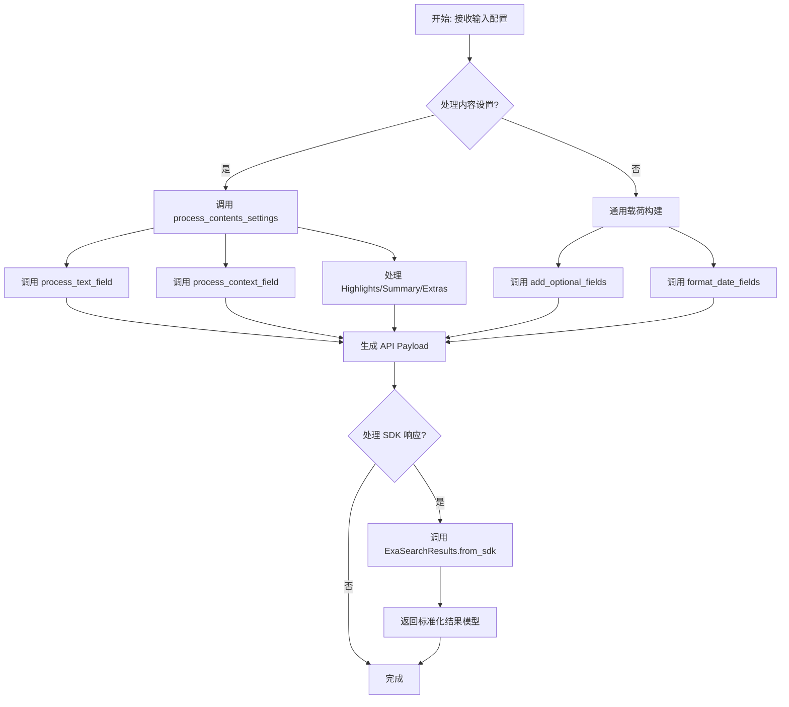
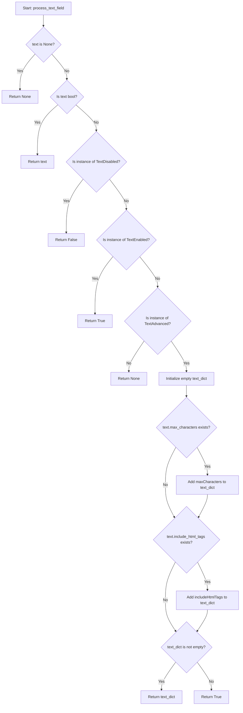

# `AutoGPT\autogpt_platform\backend\backend\blocks\exa\helpers.py` 详细设计文档

该代码定义了一套用于搜索、爬取和内容处理的数据模型（基于 Pydantic），涵盖了内容检索设置（如文本、摘要、高亮）、Web 搜索配置、结果封装结构以及成本核算模型，同时提供了将内部模型转换为 API 载荷的辅助函数。

## 整体流程



## 类结构

```
BaseModel (Imported)
├── Configuration & Settings
│   ├── LivecrawlTypes (Enum)
│   ├── TextEnabled / TextDisabled / TextAdvanced
│   ├── HighlightSettings
│   ├── SummarySettings
│   ├── ExtrasSettings
│   ├── ContextEnabled / ContextDisabled / ContextAdvanced
│   └── ContentSettings
├── Webset Models
│   ├── WebsetEntitySettings
│   ├── WebsetCriterion
│   ├── WebsetSearchConfig
│   ├── EnrichmentOption
│   └── WebsetEnrichmentConfig
├── Result Models
│   ├── ExaSearchExtras
│   └── ExaSearchResults
└── Cost Tracking
    ├── CostBreakdown
    ├── CostBreakdownItem
    ├── PerRequestPrices
    ├── PerPagePrices
    └── CostDollars
```

## 全局变量及字段


### `LivecrawlTypes.NEVER`
    
Livecrawl option indicating to never perform live crawling.

类型：`str`
    


### `LivecrawlTypes.FALLBACK`
    
Livecrawl option indicating to perform live crawling only as a fallback.

类型：`str`
    


### `LivecrawlTypes.ALWAYS`
    
Livecrawl option indicating to always perform live crawling.

类型：`str`
    


### `LivecrawlTypes.PREFERRED`
    
Livecrawl option indicating to prefer live crawling.

类型：`str`
    


### `TextEnabled.discriminator`
    
Discriminator field identifying the text configuration as enabled.

类型：`Literal["enabled"]`
    


### `TextDisabled.discriminator`
    
Discriminator field identifying the text configuration as disabled.

类型：`Literal["disabled"]`
    


### `TextAdvanced.discriminator`
    
Discriminator field identifying the text configuration as advanced.

类型：`Literal["advanced"]`
    


### `TextAdvanced.max_characters`
    
Maximum number of characters to return.

类型：`Optional[int]`
    


### `TextAdvanced.include_html_tags`
    
Include HTML tags in the response, helps LLMs understand text structure.

类型：`bool`
    


### `HighlightSettings.num_sentences`
    
Number of sentences per highlight.

类型：`int`
    


### `HighlightSettings.highlights_per_url`
    
Number of highlights per URL.

类型：`int`
    


### `HighlightSettings.query`
    
Custom query to direct the LLM's selection of highlights.

类型：`Optional[str]`
    


### `SummarySettings.query`
    
Custom query for the LLM-generated summary.

类型：`Optional[str]`
    


### `SummarySettings.schema`
    
JSON schema for structured output from summary.

类型：`Optional[dict]`
    


### `ExtrasSettings.links`
    
Number of URLs to return from each webpage.

类型：`int`
    


### `ExtrasSettings.image_links`
    
Number of images to return for each result.

类型：`int`
    


### `ContextEnabled.discriminator`
    
Discriminator field identifying the context configuration as enabled.

类型：`Literal["enabled"]`
    


### `ContextDisabled.discriminator`
    
Discriminator field identifying the context configuration as disabled.

类型：`Literal["disabled"]`
    


### `ContextAdvanced.discriminator`
    
Discriminator field identifying the context configuration as advanced.

类型：`Literal["advanced"]`
    


### `ContextAdvanced.max_characters`
    
Maximum character limit for context string.

类型：`Optional[int]`
    


### `ContentSettings.text`
    
Text content retrieval. Boolean for simple enable/disable or object for advanced settings.

类型：`Optional[Union[bool, TextEnabled, TextDisabled, TextAdvanced]]`
    


### `ContentSettings.highlights`
    
Text snippets most relevant from each page.

类型：`Optional[HighlightSettings]`
    


### `ContentSettings.summary`
    
LLM-generated summary of the webpage.

类型：`Optional[SummarySettings]`
    


### `ContentSettings.livecrawl`
    
Livecrawling options: never, fallback, always, preferred.

类型：`Optional[LivecrawlTypes]`
    


### `ContentSettings.livecrawl_timeout`
    
Timeout for livecrawling in milliseconds.

类型：`Optional[int]`
    


### `ContentSettings.subpages`
    
Number of subpages to crawl.

类型：`Optional[int]`
    


### `ContentSettings.subpage_target`
    
Keyword(s) to find specific subpages of search results.

类型：`Optional[Union[str, list[str]]]`
    


### `ContentSettings.extras`
    
Extra parameters for additional content.

类型：`Optional[ExtrasSettings]`
    


### `ContentSettings.context`
    
Format search results into a context string for LLMs.

类型：`Optional[Union[bool, ContextEnabled, ContextDisabled, ContextAdvanced]]`
    


### `WebsetEntitySettings.type`
    
Entity type (e.g., 'company', 'person').

类型：`Optional[str]`
    


### `WebsetCriterion.description`
    
Description of the criterion.

类型：`str`
    


### `WebsetCriterion.success_rate`
    
Success rate percentage.

类型：`Optional[int]`
    


### `WebsetSearchConfig.query`
    
Search query.

类型：`str`
    


### `WebsetSearchConfig.count`
    
Number of results to return.

类型：`int`
    


### `WebsetSearchConfig.entity`
    
Entity settings for the search.

类型：`Optional[WebsetEntitySettings]`
    


### `WebsetSearchConfig.criteria`
    
Search criteria.

类型：`Optional[list[WebsetCriterion]]`
    


### `WebsetSearchConfig.behavior`
    
Behavior when updating results ('override' or 'append').

类型：`Optional[str]`
    


### `EnrichmentOption.label`
    
Label for the enrichment option.

类型：`str`
    


### `WebsetEnrichmentConfig.title`
    
Title of the enrichment.

类型：`str`
    


### `WebsetEnrichmentConfig.description`
    
Description of what this enrichment does.

类型：`str`
    


### `WebsetEnrichmentConfig.format`
    
Format of the enrichment result.

类型：`str`
    


### `WebsetEnrichmentConfig.instructions`
    
Instructions for the enrichment.

类型：`Optional[str]`
    


### `WebsetEnrichmentConfig.options`
    
Options for the enrichment.

类型：`Optional[list[EnrichmentOption]]`
    


### `ExaSearchExtras.links`
    
Array of links from the search result.

类型：`list[str]`
    


### `ExaSearchExtras.imageLinks`
    
Array of image links from the search result.

类型：`list[str]`
    


### `ExaSearchResults.title`
    
Title of the search result.

类型：`str | None`
    


### `ExaSearchResults.url`
    
URL of the search result.

类型：`str | None`
    


### `ExaSearchResults.publishedDate`
    
Published date of the result.

类型：`str | None`
    


### `ExaSearchResults.author`
    
Author of the content.

类型：`str | None`
    


### `ExaSearchResults.id`
    
Unique identifier for the result.

类型：`str`
    


### `ExaSearchResults.image`
    
Image file associated with the result.

类型：`MediaFileType | None`
    


### `ExaSearchResults.favicon`
    
Favicon image of the result.

类型：`MediaFileType | None`
    


### `ExaSearchResults.text`
    
Text content of the result.

类型：`str | None`
    


### `ExaSearchResults.highlights`
    
List of highlights from the result.

类型：`list[str]`
    


### `ExaSearchResults.highlightScores`
    
Scores associated with highlights.

类型：`list[float]`
    


### `ExaSearchResults.summary`
    
Summary of the content.

类型：`str | None`
    


### `ExaSearchResults.subpages`
    
List of subpages.

类型：`list[dict]`
    


### `ExaSearchResults.extras`
    
Extra information like links and images.

类型：`ExaSearchExtras | None`
    


### `CostBreakdown.keywordSearch`
    
Cost for keyword search.

类型：`float`
    


### `CostBreakdown.neuralSearch`
    
Cost for neural search.

类型：`float`
    


### `CostBreakdown.contentText`
    
Cost for content text extraction.

类型：`float`
    


### `CostBreakdown.contentHighlight`
    
Cost for content highlights.

类型：`float`
    


### `CostBreakdown.contentSummary`
    
Cost for content summary.

类型：`float`
    


### `CostBreakdownItem.search`
    
Total search cost.

类型：`float`
    


### `CostBreakdownItem.contents`
    
Total contents cost.

类型：`float`
    


### `CostBreakdownItem.breakdown`
    
Detailed cost breakdown object.

类型：`CostBreakdown`
    


### `PerRequestPrices.neuralSearch_1_25_results`
    
Price for neural search with 1-25 results.

类型：`float`
    


### `PerRequestPrices.neuralSearch_26_100_results`
    
Price for neural search with 26-100 results.

类型：`float`
    


### `PerRequestPrices.neuralSearch_100_plus_results`
    
Price for neural search with 100+ results.

类型：`float`
    


### `PerRequestPrices.keywordSearch_1_100_results`
    
Price for keyword search with 1-100 results.

类型：`float`
    


### `PerRequestPrices.keywordSearch_100_plus_results`
    
Price for keyword search with 100+ results.

类型：`float`
    


### `PerPagePrices.contentText`
    
Price per page for text content.

类型：`float`
    


### `PerPagePrices.contentHighlight`
    
Price per page for highlights.

类型：`float`
    


### `PerPagePrices.contentSummary`
    
Price per page for summary.

类型：`float`
    


### `CostDollars.total`
    
Total dollar cost for your request.

类型：`float`
    


### `CostDollars.breakDown`
    
Breakdown of costs by operation type.

类型：`list[CostBreakdownItem]`
    


### `CostDollars.perRequestPrices`
    
Standard price per request for different operations.

类型：`PerRequestPrices`
    


### `CostDollars.perPagePrices`
    
Standard price per page for different content operations.

类型：`PerPagePrices`
    
    

## 全局函数及方法


### `process_text_field`

Process text field for API payload.

参数：

- `text`：`Union[bool, TextEnabled, TextDisabled, TextAdvanced, None]`，表示文本字段的输入配置，可以是布尔值（用于简单启用/禁用）或特定的配置对象（用于高级设置），也可以为 None。

返回值：`Optional[Union[bool, Dict[str, Any]]]`，返回处理后的 API 负载格式。如果是简单的启用/禁用则返回布尔值；如果是高级设置则包含 `maxCharacters` 或 `includeHtmlTags` 的字典；如果没有设置则返回 None。

#### 流程图



#### 带注释源码

```python
def process_text_field(
    text: Union[bool, TextEnabled, TextDisabled, TextAdvanced, None]
) -> Optional[Union[bool, Dict[str, Any]]]:
    """Process text field for API payload."""
    # 如果输入为空，直接返回 None
    if text is None:
        return None

    # 处理向后兼容性：如果输入是布尔值，直接返回
    if isinstance(text, bool):
        return text
    # 如果是禁用状态对象，返回 False
    elif isinstance(text, TextDisabled):
        return False
    # 如果是启用状态对象，返回 True
    elif isinstance(text, TextEnabled):
        return True
    # 如果是高级设置对象，构建字典
    elif isinstance(text, TextAdvanced):
        text_dict = {}
        # 如果设置了最大字符数，添加到字典（键名转换为驼峰命名）
        if text.max_characters:
            text_dict["maxCharacters"] = text.max_characters
        # 如果设置了包含 HTML 标签，添加到字典（键名转换为驼峰命名）
        if text.include_html_tags:
            text_dict["includeHtmlTags"] = text.include_html_tags
        # 如果字典中有内容则返回字典，否则默认返回 True 表示启用
        return text_dict if text_dict else True
    # 兜底返回 None
    return None
```


### `process_contents_settings`

该函数用于将 `ContentSettings` 类型的 Pydantic 模型实例转换为符合外部 API 要求的字典格式（Payload），主要处理字段名称从驼峰命名到 API 命名风格的转换，以及对嵌套对象、枚举类型和可选字段的清洗与处理。

参数：

-   `contents`：`Optional[ContentSettings]`，包含网页抓取内容设置（如文本、高亮、摘要、实时抓取配置等）的输入对象。

返回值：`Dict[str, Any]`，处理后的内容设置字典，用于构建 API 请求负载。

#### 流程图

```mermaid
flowchart TD
    Start([开始]) --> CheckInput{检查 contents 是否存在}
    CheckInput -- 不存在/为空 --> ReturnEmpty[返回空字典 {}]
    CheckInput -- 存在 --> InitDict[初始化 content_settings = {}]

    InitDict --> ProcessText[处理 text 字段<br/>调用 process_text_field]
    ProcessText --> CheckText{结果是否为 None?}
    CheckText -- 否 --> AddText[添加到 content_settings]

    AddText --> CheckHighlights{是否存在 highlights?}
    CheckHighlights -- 是 --> MapHighlights[映射 numSentences, highlightsPerUrl<br/>处理可选 query]
    MapHighlights --> AddHighlights[添加 highlights 到 content_settings]

    AddHighlights --> CheckSummary{是否存在 summary?}
    CheckSummary -- 是 --> MapSummary[映射 query 和 schema]
    MapSummary --> AddSummary[添加 summary 到 content_settings]

    AddSummary --> CheckLivecrawl{是否存在 livecrawl?}
    CheckLivecrawl -- 是 --> AddLivecrawl[添加 livecrawl.value]

    AddLivecrawl --> CheckTimeout{livecrawl_timeout 是否不为 None?}
    CheckTimeout -- 是 --> AddTimeout[添加 livecrawlTimeout]

    AddTimeout --> CheckSubpages{subpages 是否不为 None?}
    CheckSubpages -- 是 --> AddSubpages[添加 subpages]

    AddSubpages --> CheckTarget{是否存在 subpage_target?}
    CheckTarget -- 是 --> AddTarget[添加 subpageTarget]

    AddTarget --> CheckExtras{是否存在 extras?}
    CheckExtras -- 是 --> MapExtras[映射 links 和 imageLinks]
    MapExtras --> AddExtras[添加 extras 到 content_settings]

    AddExtras --> ProcessContext[处理 context 字段<br/>调用 process_context_field]
    ProcessContext --> CheckContext{结果是否为 None?}
    CheckContext -- 否 --> AddContext[添加 context 到 content_settings]

    AddContext --> ReturnDict[返回 content_settings]
```

#### 带注释源码

```python
def process_contents_settings(contents: Optional[ContentSettings]) -> Dict[str, Any]:
    """Process ContentSettings into API payload format."""
    # 检查输入对象是否为空，若为空则直接返回空字典
    if not contents:
        return {}

    # 初始化最终用于 API 请求的字典
    content_settings = {}

    # 处理 text 字段：该字段可能是布尔值或高级设置对象
    # 调用辅助函数 process_text_field 进行转换
    text_value = process_text_field(contents.text)
    if text_value is not None:
        content_settings["text"] = text_value

    # 处理 highlights（高亮）设置
    if contents.highlights:
        highlights_dict: Dict[str, Any] = {
            # 将 Python 风格的 num_sentences 转换为 API 风格的 numSentences
            "numSentences": contents.highlights.num_sentences,
            # 将 Python 风格的 highlights_per_url 转换为 API 风格的 highlightsPerUrl
            "highlightsPerUrl": contents.highlights.highlights_per_url,
        }
        # 如果有自定义查询，则添加
        if contents.highlights.query:
            highlights_dict["query"] = contents.highlights.query
        content_settings["highlights"] = highlights_dict

    # 处理 summary（摘要）设置
    if contents.summary:
        summary_dict = {}
        # 添加自定义查询
        if contents.summary.query:
            summary_dict["query"] = contents.summary.query
        # 添加结构化输出的 JSON schema
        if contents.summary.schema:
            summary_dict["schema"] = contents.summary.schema
        content_settings["summary"] = summary_dict

    # 处理 livecrawl（实时抓取）枚举类型
    if contents.livecrawl:
        content_settings["livecrawl"] = contents.livecrawl.value

    # 处理 livecrawl timeout（超时时间），需将字段名转换为驼峰形式
    if contents.livecrawl_timeout is not None:
        content_settings["livecrawlTimeout"] = contents.livecrawl_timeout

    # 处理子页面数量
    if contents.subpages is not None:
        content_settings["subpages"] = contents.subpages

    # 处理子页面目标关键词，需将字段名转换为驼峰形式
    if contents.subpage_target:
        content_settings["subpageTarget"] = contents.subpage_target

    # 处理 extras（额外内容，如链接、图片）
    if contents.extras:
        extras_dict = {}
        if contents.extras.links:
            extras_dict["links"] = contents.extras.links
        # 将 Python 风格的 image_links 转换为 API 风格的 imageLinks
        if contents.extras.image_links:
            extras_dict["imageLinks"] = contents.extras.image_links
        content_settings["extras"] = extras_dict

    # 处理 context（上下文）字段：该字段可能是布尔值或高级设置对象
    # 调用辅助函数 process_context_field 进行转换
    context_value = process_context_field(contents.context)
    if context_value is not None:
        content_settings["context"] = context_value

    return content_settings
```


### `process_context_field`

处理上下文字段以生成 API 载荷，该方法能够处理多种输入类型（布尔值、字典、特定的 Pydantic 模型），并将其规范化为 API 所需的布尔值或字典格式。

参数：

- `context`：`Union[bool, dict, ContextEnabled, ContextDisabled, ContextAdvanced, None]`，表示上下文配置的输入值，可以是简单的布尔开关、包含 "maxCharacters" 的原始字典，或特定的配置类实例（ContextEnabled, ContextDisabled, ContextAdvanced）。

返回值：`Optional[Union[bool, Dict[str, int]]]`，返回处理后的上下文配置值。如果启用则返回 `True`，如果禁用或无需发送则返回 `None`，如果指定了最大字符限制则返回包含 `maxCharacters` 键的字典。

#### 流程图

```mermaid
flowchart TD
    A[开始: process_context_field] --> B{context 是否为 None?}
    B -- 是 --> C[返回 None]
    B -- 否 --> D{context 是否为 bool 类型?}
    
    D -- 是 --> E{context 是否为 True?}
    E -- 是 --> F[返回 True]
    E -- 否 --> C
    
    D -- 否 --> G{context 是否为 dict 且包含 'maxCharacters'?}
    G -- 是 --> H[返回 {'maxCharacters': context['maxCharacters']}]
    
    G -- 否 --> I{context 是否为 ContextDisabled 实例?}
    I -- 是 --> C
    
    I -- 否 --> J{context 是否为 ContextEnabled 实例?}
    J -- 是 --> F
    
    J -- 否 --> K{context 是否为 ContextAdvanced 实例?}
    K -- 是 --> L{max_characters 是否存在且不为 None?}
    L -- 是 --> M[返回 {'maxCharacters': context.max_characters}]
    L -- 否 --> F
    
    K -- 否 --> C
```

#### 带注释源码

```python
def process_context_field(
    context: Union[bool, dict, ContextEnabled, ContextDisabled, ContextAdvanced, None]
) -> Optional[Union[bool, Dict[str, int]]]:
    """Process context field for API payload."""
    # 如果输入为 None，直接返回 None，表示不处理该字段
    if context is None:
        return None

    # 处理向后兼容性：如果输入是布尔值
    if isinstance(context, bool):
        # 只有当为 True 时返回 True，否则返回 None（不发送字段）
        return context if context else None
    # 处理字典格式：如果字典中包含 "maxCharacters" 键
    elif isinstance(context, dict) and "maxCharacters" in context:
        # 提取并返回包含 maxCharacters 的字典
        return {"maxCharacters": context["maxCharacters"]}
    # 处理 ContextDisabled 类型实例：禁用时不发送字段
    elif isinstance(context, ContextDisabled):
        return None
    # 处理 ContextEnabled 类型实例：启用返回 True
    elif isinstance(context, ContextEnabled):
        return True
    # 处理 ContextAdvanced 类型实例
    elif isinstance(context, ContextAdvanced):
        # 如果设置了最大字符数限制，返回配置字典
        if context.max_characters:
            return {"maxCharacters": context.max_characters}
        # 否则仅返回 True，表示启用默认配置
        return True
    # 其他未知情况默认返回 None
    return None
```


### `format_date_fields`

该函数根据提供的字段映射关系，从输入对象中提取日期时间属性，并将其格式化为特定的 ISO 8601 字符串标准（`YYYY-MM-DDTHH:MM:SS.000Z`），以便用于 API 请求载荷。

参数：

- `input_data`：`Any`，包含日期时间字段的源对象（通常是 Pydantic 模型或数据类实例）。
- `date_field_mapping`：`Dict[str, str]`，字段映射字典，键为输入对象的属性名，值为 API 接口预期的字段名。

返回值：`Dict[str, str]`，包含已格式化为字符串的日期时间字段的字典，其中键为 API 字段名，值为格式化后的时间字符串。

#### 流程图

```mermaid
flowchart TD
    Start([开始]) --> InitDict[初始化空字典 formatted_dates]
    InitDict --> LoopStart[遍历 date_field_mapping]
    LoopStart --> GetAttr[使用 getattr 获取 input_data 中的 input_field 值]
    GetAttr --> CheckValue{value 是否存在?}
    CheckValue -- 否 (为 None 或 False) --> NextItem[继续下一个映射项]
    CheckValue -- 是 --> FormatDate[调用 value.strftime 格式化日期<br>格式: %Y-%m-%dT%H:%M:%S.000Z]
    FormatDate --> AddToDict[将结果赋值给 formatted_dates[api_field]]
    AddToDict --> NextItem
    NextItem --> CheckLoop{映射是否遍历完毕?}
    CheckLoop -- 否 --> LoopStart
    CheckLoop -- 是 --> Return([返回 formatted_dates])
```

#### 带注释源码

```python
def format_date_fields(
    input_data: Any, date_field_mapping: Dict[str, str]
) -> Dict[str, str]:
    """Format datetime fields for API payload."""
    # 初始化一个字典，用于存储转换后的日期字符串
    formatted_dates = {}
    
    # 遍历字段映射字典，key是输入对象的属性名，value是API需要的字段名
    for input_field, api_field in date_field_mapping.items():
        # 动态获取 input_data 中对应属性的值
        value = getattr(input_data, input_field, None)
        
        # 如果值存在（不为 None）
        if value:
            # 将日期时间对象转换为特定格式的字符串 (ISO 8601 标准，毫秒设为000)
            formatted_dates[api_field] = value.strftime("%Y-%m-%dT%H:%M:%S.000Z")
            
    # 返回包含所有格式化日期的字典
    return formatted_dates
```


### `add_optional_fields`

这是一个辅助函数，用于将源对象中存在的非空可选字段添加到目标 payload 字典中。它支持字段名映射，并可选择性地处理枚举类型以提取其原始值。

参数：

- `input_data`：`Any`，包含源数据的对象（通常是 Pydantic 模型或数据类）。
- `field_mapping`：`Dict[str, str]`，源对象字段名与目标 payload 键名的映射字典。
- `payload`：`Dict[str, Any]`，待填充的目标字典，函数会直接修改该字典。
- `process_enums`：`bool`，标记是否处理枚举类型。如果为 True，则会提取枚举实例的 `.value` 属性。

返回值：`None`，该函数直接修改 `payload` 参数，无返回值。

#### 流程图

```mermaid
flowchart TD
    Start([开始]) --> Loop[遍历 field_mapping 字典]
    Loop --> GetAttr[通过 getattr 获取 input_data 中的 value]
    GetAttr --> CheckValue{value 是否为真?}
    CheckValue -- 否 (为空/None/0/False) --> Loop
    CheckValue -- 是 --> CheckEnum{process_enums 为 True 且<br>value 拥有 value 属性?}
    CheckEnum -- 是 --> ExtractValue[payload[api_field] = value.value]
    CheckEnum -- 否 --> DirectAssign[payload[api_field] = value]
    ExtractValue --> Loop
    DirectAssign --> Loop
    Loop --> End([结束])
```

#### 带注释源码

```python
def add_optional_fields(
    input_data: Any,
    field_mapping: Dict[str, str],
    payload: Dict[str, Any],
    process_enums: bool = False,
) -> None:
    """Add optional fields to payload if they have values."""
    # 遍历字段映射表，input_field 是源对象属性名，api_field 是目标 payload 键名
    for input_field, api_field in field_mapping.items():
        # 尝试从源对象获取属性值，如果不存在则返回 None
        value = getattr(input_data, input_field, None)
        
        # 仅当值为真值时才添加，这会过滤掉 None、空字符串、空列表和 0
        if value:  # Only add non-empty values
            # 如果要求处理枚举，且该值是枚举实例（具有 value 属性）
            if process_enums and hasattr(value, "value"):
                # 将枚举的原始值赋给 payload
                payload[api_field] = value.value
            else:
                # 直接将值赋给 payload
                payload[api_field] = value
```


### `ExaSearchResults.from_sdk`

该方法是一个类方法，用于将底层 SDK 返回的原始结果对象（通常为 dataclass 或类似结构）转换为项目内部定义的 Pydantic 模型 `ExaSearchResults` 实例。它负责处理字段映射（如下划线转驼峰命名）、提取属性以及设置默认值。

参数：

-  `sdk_result`：`Any`，SDK 返回的原始搜索结果对象，包含 `id`、`url`、`published_date`、`highlight_scores` 等属性。

返回值：`ExaSearchResults`，转换并构建好的 Pydantic 模型实例，包含解析后的搜索结果数据。

#### 流程图

```mermaid
graph TD
    A[开始: from_sdk 方法] --> B[输入 sdk_result 对象]
    B --> C[获取 id 字段<br/>getattr sdk_result id]
    C --> D[获取基础元数据字段<br/>url, title, author, publishedDate<br/>text, summary]
    D --> E[获取列表类型字段<br/>highlights, highlightScores, subpages<br/>使用 or [] 处理 None 默认值]
    E --> F[获取媒体与额外字段<br/>image, favicon, extras]
    F --> G[调用 cls 构造函数<br/>初始化 ExaSearchResults 实例]
    G --> H[返回实例]
    H --> I[结束]
```

#### 带注释源码

```python
    @classmethod
    def from_sdk(cls, sdk_result) -> "ExaSearchResults":
        """Convert SDK Result (dataclass) to our Pydantic model."""
        return cls(
            # 获取唯一标识符，若 sdk_result 中不存在则默认为空字符串
            id=getattr(sdk_result, "id", ""),
            # 获取 URL，若不存在则为 None
            url=getattr(sdk_result, "url", None),
            # 获取标题，若不存在则为 None
            title=getattr(sdk_result, "title", None),
            # 获取作者，若不存在则为 None
            author=getattr(sdk_result, "author", None),
            # 获取发布日期，映射 SDK 的 snake_case 字段 published_date 到 camelCase 字段
            publishedDate=getattr(sdk_result, "published_date", None),
            # 获取正文文本，若不存在则为 None
            text=getattr(sdk_result, "text", None),
            # 获取高亮列表，若不存在或为 None 则默认为空列表
            highlights=getattr(sdk_result, "highlights", None) or [],
            # 获取高亮分数列表，映射 SDK 字段 highlight_scores，若不存在则为空列表
            highlightScores=getattr(sdk_result, "highlight_scores", None) or [],
            # 获取摘要，若不存在则为 None
            summary=getattr(sdk_result, "summary", None),
            # 获取子页面列表，若不存在或为 None 则默认为空列表
            subpages=getattr(sdk_result, "subpages", None) or [],
            # 获取主图媒体文件，若不存在则为 None
            image=getattr(sdk_result, "image", None),
            # 获取网站图标媒体文件，若不存在则为 None
            favicon=getattr(sdk_result, "favicon", None),
            # 获取额外信息对象，若不存在则为 None
            extras=getattr(sdk_result, "extras", None),
        )
```


## 关键组件


### Search Content Configuration

定义了用于配置网页内容检索和处理方式的模式，包括文本提取选项、LLM 生成的摘要、高亮显示、实时爬取行为以及上下文格式化设置。

### Webset Search & Enrichment

定义了用于配置“Webset”搜索的模式，包括实体类型、搜索标准、行为覆盖以及用于结果处理的丰富指令。

### Search Result Handling

封装了搜索结果的数据结构（包括链接和图像等额外信息），并提供了将原始 SDK 数据适配为标准 Pydantic 模型的方法。

### Cost Tracking System

提供了一个全面的数据模型，用于跟踪 API 成本，按操作类型（搜索与内容）分解费用，并根据请求和页面定价计算总成本。

### Payload Serialization & Formatting

包含用于将复杂的配置对象（如 ContentSettings）和各种字段类型转换为 API 传输所需的原始字典和字符串的实用函数。


## 问题及建议


### 已知问题

-   **字段命名冲突与遮蔽**：`SummarySettings` 类中定义了名为 `schema` 的字段，这与 Pydantic `BaseModel` 的 `schema` 属性（用于获取模型的 JSON Schema）产生冲突。虽然使用了 `# type: ignore` 抑制了警告，但这会导致无法通过实例直接访问模型的 Schema 属性，且不符合 Python 编码规范。
-   **数值零会被错误过滤**：在 `add_optional_fields` 函数和 `process_contents_settings` 函数中，使用了 `if value:` 来判断是否添加字段。这意味着如果字段值为 `0`（例如 `extras.links` 或 `subpages`），由于 `0` 在布尔上下文中为 `False`，这些合法的数值会被错误地忽略，导致生成的 API Payload 缺少必要的配置。
-   **手动维护序列化逻辑的成本高**：代码中包含了 `process_text_field`、`process_contents_settings`、`process_context_field` 等多个函数，手动将 Python 的 `snake_case` 字段名转换为 API 需要的 `camelCase`（如 `max_characters` 转 `maxCharacters`）。这种硬编码的转换逻辑容易在新增字段时遗漏，且增加了维护负担。
-   **判别式联合处理不够原生**：`TextEnabled`、`TextDisabled`、`TextAdvanced` 等类虽然在设计上模拟了判别式联合，但在 `process_text_field` 中仍依赖 `isinstance` 逐个检查类型进行转换。这种方式不如 Pydantic 原生的 `Tagged Union` 或 `Literal` 类型解析高效且类型安全。
-   **SDK 结果转换缺乏健壮性**：`ExaSearchResults.from_sdk` 方法大量使用 `getattr(..., default=None)`。这虽然防止了属性缺失导致的报错，但如果 SDK 返回的数据结构发生微小的变化（例如嵌套结构变化），该静默失败机制可能导致难以调试的数据丢失。

### 优化建议

-   **利用 Pydantic 配置自动处理命名转换**：建议在 `BaseModel` 的配置（`ConfigDict` 或 `class Config`）中启用 `alias_generator`（例如使用 `camelcase` 转换函数）和 `populate_by_name`。这样可以直接在模型字段定义中使用 `snake_case`，Pydantic 在序列化时会自动转为 `camelCase`，从而删除所有手动的转换函数和字典构建逻辑。
-   **修复零值判断逻辑**：将 `if value:` 修改为显式的 `if value is not None:`。这样可以确保数值 `0`、空列表 `[]` 或布尔值 `False` 等合法的“假值”能正确包含在输出中，同时依然过滤掉未设置的 `None` 值。
-   **使用原生的 Pydantic 序列化方法**：删除 `process_contents_settings` 等辅助函数。直接使用模型实例的 `.model_dump(exclude_none=True, by_alias=True)` 方法即可生成符合 API 要求的字典，大幅简化代码。
-   **重构字段命名以避免冲突**：将 `SummarySettings` 中的 `schema` 字段重命名为 `output_schema`、`json_schema` 或 `response_schema`，避免遮蔽 Pydantic 内置属性。
-   **引入 Pydantic 的 Annotated Union 处理多态配置**：对于 `Text*` 和 `Context*` 类的配置，建议使用 `Annotated[Union[...], Field(discriminator='...')]`。这将允许 Pydantic 根据输入数据的 `discriminator` 字段自动反序列化为具体的子类，并自动处理序列化，无需手动编写转换逻辑。
-   **增强 SDK 转换的类型安全**：在 `ExaSearchResults.from_sdk` 中，考虑定义一个专门的 Pydantic 模型来映射 SDK 的原始返回结构，然后通过类型转换生成目标模型，或者使用 Pydantic 的 `TypeAdapter`，以替代松散的 `getattr` 操作。


## 其它


### 设计目标与约束

**设计目标：**
1.  **类型安全与数据验证**：利用 Pydantic 模型（通过 `BaseModel`）为复杂的搜索 API 请求和响应提供严格的类型检查，确保在运行时前捕获数据结构错误。
2.  **复杂配置抽象**：将灵活的 API 配置选项（如文本提取、上下文设置的高级模式）封装为结构化的类，简化上层调用逻辑。
3.  **接口适配**：充当底层 SDK 数据结构与最终 API 载荷之间的适配层，处理字段命名转换（如 `snake_case` 到 `camelCase`）和数据格式清洗。

**设计约束：**
1.  **命名约定映射**：必须处理 Python 风格的 `snake_case` 字段名与目标 API 风格的 `camelCase` 字段名之间的转换（例如 `max_characters` -> `maxCharacters`）。
2.  **向后兼容性**：部分字段（如 `text` 和 `context`）需同时支持布尔值（简单开关）和复杂对象（高级配置）两种输入形式，处理函数必须能够区分并正确处理这两种情况。
3.  **依赖限制**：所有模型必须继承自特定的 `backend.sdk.BaseModel`，并使用其提供的 `SchemaField` 进行字段定义，不能直接使用标准的 Pydantic 导入。

### 错误处理与异常设计

**验证异常：**
*   依赖于 `BaseModel`（Pydantic）的自动验证机制。当传入的数据不符合模型定义的类型（如给 `LivecrawlTypes` 传入了不存在的字符串）或约束条件（如 `ge=1` 的字段传入了 0）时，将在实例化阶段抛出 `ValidationError`。

**处理逻辑异常：**
*   **防御性编程**：在辅助函数（如 `process_text_field`, `process_contents_settings`）中，采用“静默失败”或“默认忽略”策略。如果输入为 `None` 或不符合预期逻辑，函数倾向于返回 `None` 或空字典，而不是抛出异常。
*   **数据容错**：在 `ExaSearchResults.from_sdk` 中，使用 `getattr(data, "field", None)` 模式。这意味着如果底层 SDK 返回的数据结构缺失某些字段，该模块不会崩溃，而是将对应字段设为 `None`，保证系统的鲁棒性。

### 数据流与状态机

**数据流向：**
1.  **请求流（Request Flow）**：用户调用代码 -> 实例化配置模型（如 `ContentSettings`） -> 进入辅助处理函数（如 `process_contents_settings`） -> 转换为符合 API 契约的字典格式（包含命名转换和结构扁平化） -> 发送给外部 API。
2.  **响应流（Response Flow）**：外部 SDK 返回原始数据类（Dataclass） -> 传入 `ExaSearchResults.from_sdk` 类方法 -> 映射并清洗数据 -> 实例化为标准的 Pydantic 模型 -> 返回给业务层使用。

**状态模式：**
*   代码中的联合类型（`Union`）和判别字段（`discriminator`）隐含了状态模式的设计。例如 `TextEnabled`、`TextDisabled` 和 `TextAdvanced` 代表了文本处理功能的三种不同状态。`process_text_field` 函数充当状态处理器，根据具体的实例类型执行不同的序列化逻辑（返回 `True`，`False` 或包含具体参数的字典）。

### 外部依赖与接口契约

**外部依赖：**
1.  **`backend.sdk`**：核心依赖模块。
    *   `BaseModel`：所有数据模型的基类，提供了模型验证和序列化能力。
    *   `SchemaField`：用于定义模型字段的元数据和验证规则（如 `description`, `placeholder`）。
    *   `MediaFileType`：定义媒体文件的数据结构，用于搜索结果中的图片和图标处理。

**接口契约：**
1.  **载荷契约**：辅助函数生成的最终字典必须符合目标 API 的 JSON Schema 规范。具体包括：
    *   枚举值必须使用其对应的字符串值（`value` 属性）。
    *   日期时间必须格式化为 ISO 8601 字符串（`YYYY-MM-DDTHH:mm:ss.000Z`）。
    *   布尔值与对象的兼容性处理必须符合 API 的解析逻辑。
2.  **SDK 契约**：`ExaSearchResults.from_sdk` 假设传入的 `sdk_result` 对象包含一系列特定的属性（如 `id`, `url`, `published_date`, `highlight_scores`）。如果 SDK 发生破坏性更新（如重命名 `published_date` 为 `publishDate`），此适配逻辑将失效。

    