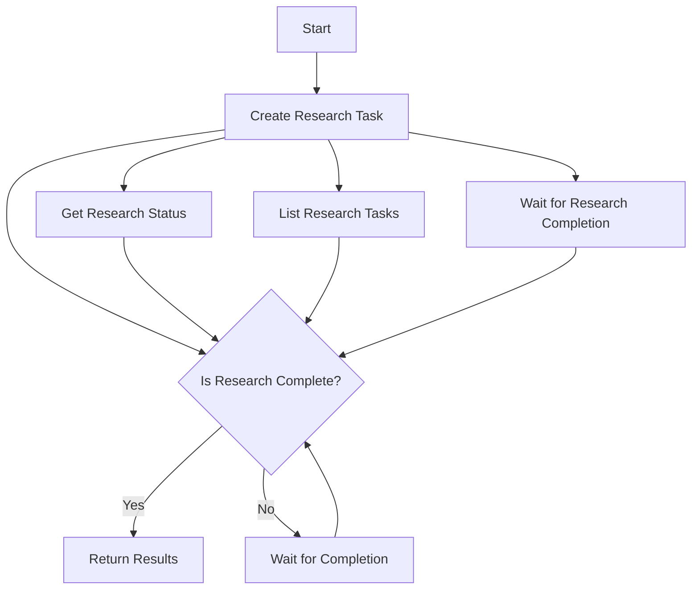
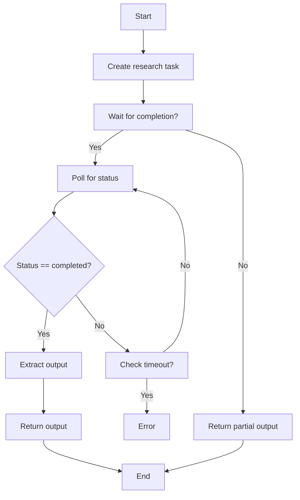
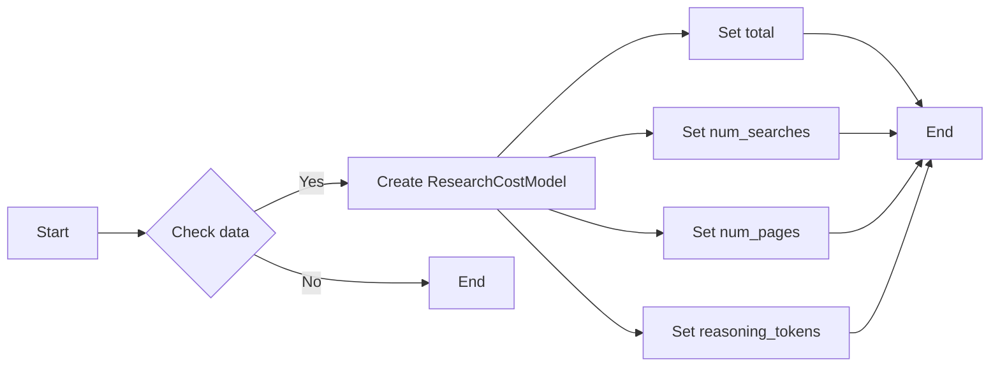
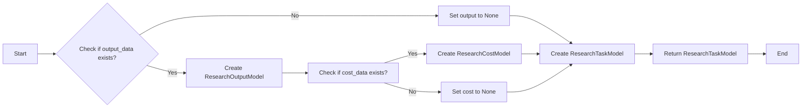
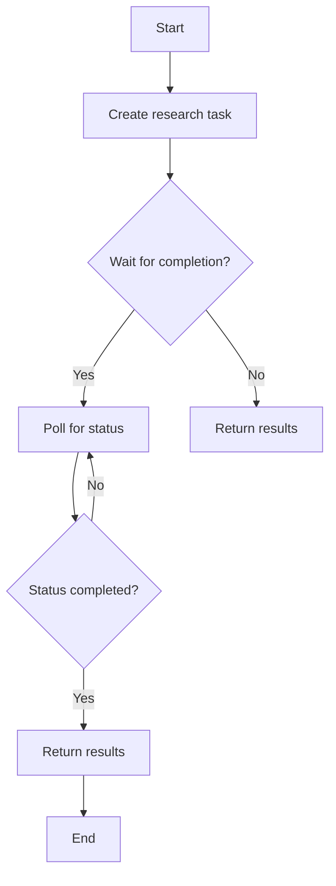
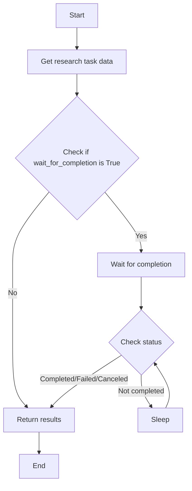
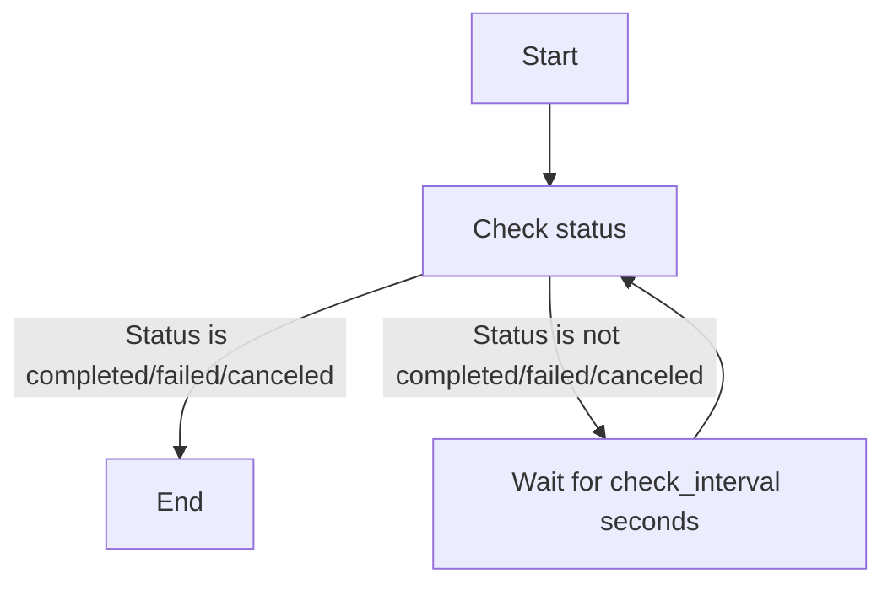
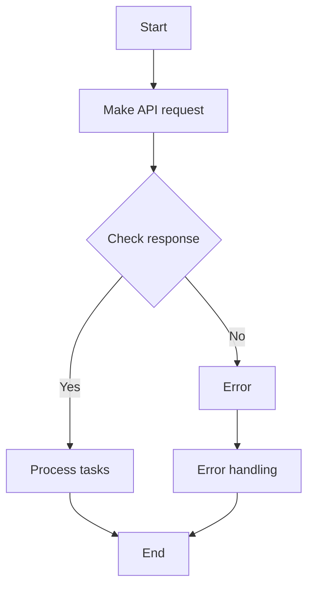

# `.\AutoGPT\autogpt_platform\backend\backend\blocks\exa\research.py` 详细设计文档

This code provides asynchronous research capabilities to explore the web, gather sources, synthesize findings, and return structured results with citations.

## 整体流程



## 类结构

```
ExaResearchBlocks (模块)
├── ResearchModel (枚举类)
│   ├── FAST
│   ├── STANDARD
│   └── PRO
├── ResearchStatus (枚举类)
│   ├── PENDING
│   ├── RUNNING
│   ├── COMPLETED
│   ├── CANCELED
│   └── FAILED
├── ResearchCostModel (Pydantic 模型)
├── ResearchOutputModel (Pydantic 模型)
├── ResearchTaskModel (Pydantic 模型)
├── ExaCreateResearchBlock (类)
│   ├── Input (类)
│   └── Output (类)
├── ExaGetResearchBlock (类)
│   ├── Input (类)
│   └── Output (类)
├── ExaWaitForResearchBlock (类)
│   ├── Input (类)
│   └── Output (类)
└── ExaListResearchBlock (类)
    ├── Input (类)
    └── Output (类)
```

## 全局变量及字段


### `exa`
    
Configuration object for Exa Research Task Blocks.

类型：`object`
    


### `APIKeyCredentials`
    
Class for API key credentials.

类型：`class`
    


### `Block`
    
Base class for blocks in the system.

类型：`class`
    


### `BlockCategory`
    
Enum for block categories.

类型：`class`
    


### `BlockOutput`
    
Class for block outputs.

类型：`class`
    


### `BlockSchemaInput`
    
Class for block schema inputs.

类型：`class`
    


### `BlockSchemaOutput`
    
Class for block schema outputs.

类型：`class`
    


### `CredentialsMetaInput`
    
Class for credentials metadata inputs.

类型：`class`
    


### `Requests`
    
Class for making HTTP requests.

类型：`class`
    


### `SchemaField`
    
Class for schema fields.

类型：`class`
    


### `ResearchModel.value`
    
Value of the research model enum.

类型：`str`
    


### `ResearchStatus.value`
    
Value of the research status enum.

类型：`str`
    


### `ResearchCostModel.total`
    
Total cost for the research.

类型：`float`
    


### `ResearchCostModel.num_searches`
    
Number of searches performed.

类型：`int`
    


### `ResearchCostModel.num_pages`
    
Number of pages crawled.

类型：`int`
    


### `ResearchCostModel.reasoning_tokens`
    
Number of reasoning tokens used.

类型：`int`
    


### `ResearchOutputModel.content`
    
Content of the research output.

类型：`str`
    


### `ResearchOutputModel.parsed`
    
Parsed structured data from the research output.

类型：`dict`
    


### `ResearchTaskModel.research_id`
    
Unique identifier for the research task.

类型：`str`
    


### `ResearchTaskModel.created_at`
    
Timestamp when the research task was created.

类型：`int`
    


### `ResearchTaskModel.model`
    
Research model used for the task.

类型：`str`
    


### `ResearchTaskModel.instructions`
    
Instructions for the research task.

类型：`str`
    


### `ResearchTaskModel.status`
    
Current status of the research task.

类型：`str`
    


### `ResearchTaskModel.output_schema`
    
Schema for the output of the research task.

类型：`dict`
    


### `ResearchTaskModel.output`
    
Output of the research task.

类型：`object`
    


### `ResearchTaskModel.cost_dollars`
    
Cost breakdown for the research task.

类型：`object`
    


### `ResearchTaskModel.finished_at`
    
Timestamp when the research task was finished.

类型：`int`
    


### `ResearchTaskModel.error`
    
Error message if the research task failed.

类型：`str`
    


### `Enum.ResearchModel`
    
Available research models.

类型：`str`
    


### `Enum.ResearchStatus`
    
Research task status.

类型：`str`
    


### `BaseModel.ResearchCostModel`
    
Cost breakdown for a research request.

类型：`object`
    


### `BaseModel.ResearchOutputModel`
    
Research output with content and optional structured data.

类型：`object`
    


### `BaseModel.ResearchTaskModel`
    
Stable output model for research tasks.

类型：`object`
    


### `Block.ExaCreateResearchBlock`
    
Create an asynchronous research task that explores the web and synthesizes findings.

类型：`object`
    


### `Block.ExaGetResearchBlock`
    
Get the status and results of a research task.

类型：`object`
    


### `Block.ExaWaitForResearchBlock`
    
Wait for a research task to complete with progress tracking.

类型：`object`
    


### `Block.ExaListResearchBlock`
    
List all research tasks with pagination support.

类型：`object`
    
    

## 全局函数及方法


### ExaCreateResearchBlock.run

Create an asynchronous research task that explores the web and synthesizes findings.

参数：

- `input_data`：`Input`，Research instructions and configuration for the research task.
- `credentials`：`APIKeyCredentials`，API credentials for the Exa service.
- `**kwargs`：Additional keyword arguments (not used in this method).

返回值：`BlockOutput`，Research task output with status, model, instructions, created_at, and optional output content or parsed JSON.

#### 流程图



#### 带注释源码

```python
async def run(self, input_data: Input, *, credentials: APIKeyCredentials, **kwargs) -> BlockOutput:
    url = "https://api.exa.ai/research/v1"
    headers = {
        "Content-Type": "application/json",
        "x-api-key": credentials.api_key.get_secret_value(),
    }

    payload: Dict[str, Any] = {
        "model": input_data.model.value,
        "instructions": input_data.instructions,
    }

    if input_data.output_schema:
        payload["outputSchema"] = input_data.output_schema

    response = await Requests().post(url, headers=headers, json=payload)
    data = response.json()

    research_id = data.get("researchId", "")

    if input_data.wait_for_completion:
        start_time = time.time()
        get_url = f"https://api.exa.ai/research/v1/{research_id}"
        get_headers = {"x-api-key": credentials.api_key.get_secret_value()}
        check_interval = 10

        while time.time() - start_time < input_data.polling_timeout:
            poll_response = await Requests().get(url=get_url, headers=get_headers)
            poll_data = poll_response.json()

            status = poll_data.get("status", "")

            if status in ["completed", "failed", "canceled"]:
                elapsed = time.time() - start_time
                research = ResearchTaskModel.from_api(poll_data)

                yield "research_id", research.research_id
                yield "status", research.status
                yield "model", research.model
                yield "instructions", research.instructions
                yield "created_at", research.created_at
                yield "elapsed_time", elapsed

                if research.output:
                    yield "output_content", research.output.content
                    yield "output_parsed", research.output.parsed

                if research.cost_dollars:
                    yield "cost_total", research.cost_dollars.total
                return

            await asyncio.sleep(check_interval)

        raise ValueError(
            f"Research did not complete within {input_data.polling_timeout} seconds"
        )
    else:
        yield "research_id", research_id
        yield "status", data.get("status", "pending")
        yield "model", data.get("model", input_data.model.value)
        yield "instructions", data.get("instructions", input_data.instructions)
        yield "created_at", data.get("createdAt", 0)


### ResearchCostModel.from_api

Converts API response data to a ResearchCostModel instance.

参数：

- `data`：`dict`，API response data containing cost information.

返回值：`ResearchCostModel`，A ResearchCostModel instance with the cost information.

#### 流程图



#### 带注释源码

```python
@classmethod
def from_api(cls, data: dict) -> "ResearchCostModel":
    """Convert API response, rounding fractional counts to integers."""
    return cls(
        total=data.get("total", 0.0),
        num_searches=int(round(data.get("numSearches", 0))),
        num_pages=int(round(data.get("numPages", 0))),
        reasoning_tokens=int(round(data.get("reasoningTokens", 0))),
    )
```


### ResearchTaskModel.from_api

Converts API response to our stable model.

参数：

- `data`：`dict`，API response data

返回值：`ResearchTaskModel`，Converted research task model

#### 流程图



#### 带注释源码

```python
class ResearchTaskModel(BaseModel):
    # ... (其他代码)

    @classmethod
    def from_api(cls, data: dict) -> "ResearchTaskModel":
        """Convert API response to our stable model."""
        output_data = data.get("output")
        output = None
        if output_data:
            output = ResearchOutputModel(
                content=output_data.get("content", ""),
                parsed=output_data.get("parsed"),
            )

        cost_data = data.get("costDollars")
        cost = None
        if cost_data:
            cost = ResearchCostModel.from_api(cost_data)

        return cls(
            research_id=data.get("researchId", ""),
            created_at=data.get("createdAt", 0),
            model=data.get("model", "exa-research"),
            instructions=data.get("instructions", ""),
            status=data.get("status", "pending"),
            output_schema=data.get("outputSchema"),
            output=output,
            cost_dollars=cost,
            finished_at=data.get("finishedAt"),
            error=data.get("error"),
        )
```


### ExaCreateResearchBlock.run

Create an asynchronous research task that explores the web and synthesizes findings.

参数：

- `input_data`：`Input`，Research instructions - clearly define what information to find, how to conduct research, and desired output format.
- `credentials`：`APIKeyCredentials`，The Exa integration requires an API Key.

返回值：`BlockOutput`，Research output with citations.

#### 流程图



#### 带注释源码

```python
async def run(self, input_data: Input, *, credentials: APIKeyCredentials, **kwargs) -> BlockOutput:
    url = "https://api.exa.ai/research/v1"
    headers = {
        "Content-Type": "application/json",
        "x-api-key": credentials.api_key.get_secret_value(),
    }

    payload: Dict[str, Any] = {
        "model": input_data.model.value,
        "instructions": input_data.instructions,
    }

    if input_data.output_schema:
        payload["outputSchema"] = input_data.output_schema

    response = await Requests().post(url, headers=headers, json=payload)
    data = response.json()

    research_id = data.get("researchId", "")

    if input_data.wait_for_completion:
        start_time = time.time()
        get_url = f"https://api.exa.ai/research/v1/{research_id}"
        get_headers = {"x-api-key": credentials.api_key.get_secret_value()}
        check_interval = 10

        while time.time() - start_time < input_data.polling_timeout:
            poll_response = await Requests().get(url=get_url, headers=get_headers)
            poll_data = poll_response.json()

            status = poll_data.get("status", "")

            if status in ["completed", "failed", "canceled"]:
                elapsed = time.time() - start_time
                research = ResearchTaskModel.from_api(poll_data)

                yield "research_id", research.research_id
                yield "status", research.status
                yield "model", research.model
                yield "instructions", research.instructions
                yield "created_at", research.created_at
                yield "elapsed_time", elapsed

                if research.output:
                    yield "output_content", research.output.content
                    yield "output_parsed", research.output.parsed

                if research.cost_dollars:
                    yield "cost_total", research.cost_dollars.total
                return

            await asyncio.sleep(check_interval)

        raise ValueError(
            f"Research did not complete within {input_data.polling_timeout} seconds"
        )
    else:
        yield "research_id", research_id
        yield "status", data.get("status", "pending")
        yield "model", data.get("model", input_data.model.value)
        yield "instructions", data.get("instructions", input_data.instructions)
        yield "created_at", data.get("createdAt", 0)
```


### ExaGetResearchBlock.run

Get the status and results of a research task.

参数：

- `input_data`：`Input`，The input data for the research task.
- `credentials`：`APIKeyCredentials`，The credentials for the Exa API.
- `**kwargs`：Additional keyword arguments.

返回值：`BlockOutput`，The output of the research task.

#### 流程图



#### 带注释源码

```python
async def run(self, input_data: Input, *, credentials: APIKeyCredentials, **kwargs) -> BlockOutput:
    url = f"https://api.exa.ai/research/v1/{input_data.research_id}"
    headers = {
        "x-api-key": credentials.api_key.get_secret_value(),
    }

    params = {}
    if input_data.include_events:
        params["events"] = "true"

    response = await Requests().get(url, headers=headers, params=params)
    data = response.json()

    research = ResearchTaskModel.from_api(data)

    yield "research_id", research.research_id
    yield "status", research.status
    yield "instructions", research.instructions
    yield "model", research.model
    yield "created_at", research.created_at
    yield "finished_at", research.finished_at

    if research.output:
        yield "output_content", research.output.content
        yield "output_parsed", research.output.parsed

    if research.cost_dollars:
        yield "cost_total", research.cost_dollars.total
        yield "cost_searches", research.cost_dollars.num_searches
        yield "cost_pages", research.cost_dollars.num_pages
        yield "cost_reasoning_tokens", research.cost_dollars.reasoning_tokens

    yield "error_message", research.error

    if input_data.include_events:
        yield "events", data.get("events", [])
```


### ExaWaitForResearchBlock.run

This method waits for a research task to complete and provides progress tracking.

参数：

- `input_data`：`Input`，The input data for the research task.
- `credentials`：`APIKeyCredentials`，The credentials for the Exa API.
- `**kwargs`：Additional keyword arguments.

返回值：`BlockOutput`，The output of the research task.

#### 流程图



#### 带注释源码

```python
async def run(self, input_data: Input, *, credentials: APIKeyCredentials, **kwargs) -> BlockOutput:
    start_time = time.time()
    url = f"https://api.exa.ai/research/v1/{input_data.research_id}"
    headers = {
        "x-api-key": credentials.api_key.get_secret_value(),
    }

    while time.time() - start_time < input_data.timeout:
        response = await Requests().get(url, headers=headers)
        data = response.json()

        status = data.get("status", "")

        if status in ["completed", "failed", "canceled"]:
            elapsed = time.time() - start_time
            research = ResearchTaskModel.from_api(data)

            yield "research_id", research.research_id
            yield "final_status", research.status
            yield "elapsed_time", elapsed
            yield "timed_out", False

            if research.output:
                yield "output_content", research.output.content
                yield "output_parsed", research.output.parsed

            if research.cost_dollars:
                yield "cost_total", research.cost_dollars.total

            return

        await asyncio.sleep(input_data.check_interval)

    elapsed = time.time() - start_time
    response = await Requests().get(url, headers=headers)
    data = response.json()

    yield "research_id", input_data.research_id
    yield "final_status", data.get("status", "unknown")
    yield "elapsed_time", elapsed
    yield "timed_out", True
```


### ExaListResearchBlock.run

This method lists all research tasks with pagination support.

参数：

- `input_data`：`Input`，The input data for the research task.
- `credentials`：`APIKeyCredentials`，The API key credentials for the Exa integration.
- `kwargs`：`Any`，Additional keyword arguments.

返回值：`BlockOutput`，The output of the research task.

#### 流程图



#### 带注释源码

```python
async def run(self, input_data: Input, *, credentials: APIKeyCredentials, **kwargs) -> BlockOutput:
    url = "https://api.exa.ai/research/v1"
    headers = {
        "x-api-key": credentials.api_key.get_secret_value(),
    }

    params: Dict[str, Any] = {
        "limit": input_data.limit,
    }
    if input_data.cursor:
        params["cursor"] = input_data.cursor

    response = await Requests().get(url, headers=headers, params=params)
    data = response.json()

    tasks = [ResearchTaskModel.from_api(task) for task in data.get("data", [])]

    yield "research_tasks", tasks

    for task in tasks:
        yield "research_task", task

    yield "has_more", data.get("hasMore", False)
    yield "next_cursor", data.get("nextCursor")
```


## 关键组件


### 张量索引与惰性加载

用于高效地索引和访问大型数据集，同时延迟加载数据以减少内存消耗。

### 反量化支持

提供对反量化操作的支持，允许在运行时动态调整量化参数。

### 量化策略

实现不同的量化策略，以优化模型的性能和资源消耗。


## 问题及建议


### 已知问题

-   **全局变量和函数依赖性**：代码中使用了全局变量 `exa`，但没有明确说明其来源和用途。这可能导致代码的可维护性和可读性降低。
-   **异常处理**：代码中缺少对API请求失败或数据解析错误的异常处理。这可能导致程序在遇到错误时崩溃。
-   **代码重复**：`ExaCreateResearchBlock` 和 `ExaGetResearchBlock` 类中存在重复的代码，用于处理API请求和状态检查。这可以通过提取公共方法来减少代码重复。
-   **异步操作**：代码中使用了 `asyncio.sleep` 来等待，但没有使用更高级的异步操作来处理等待，这可能导致性能瓶颈。

### 优化建议

-   **明确全局变量**：明确 `exa` 的来源和用途，或者将其移除并使用类属性或方法来管理配置。
-   **添加异常处理**：在API请求和数据解析的地方添加异常处理，确保程序在遇到错误时能够优雅地处理。
-   **减少代码重复**：提取 `ExaCreateResearchBlock` 和 `ExaGetResearchBlock` 中的公共方法，减少代码重复。
-   **使用更高级的异步操作**：考虑使用更高级的异步库，如 `aiohttp`，来处理API请求，以提高性能。
-   **代码结构**：考虑将代码拆分为更小的模块或服务，以提高代码的可维护性和可读性。
-   **文档和注释**：添加更多的文档和注释，以提高代码的可读性和可维护性。


## 其它


### 设计目标与约束

- 设计目标：
  - 提供异步研究能力，探索网络、收集来源、综合发现并返回带有引用的结构化结果。
  - 支持多种研究模型，包括快速、标准和专业模型。
  - 支持结构化输出，允许用户定义JSON模式以验证和解析结果。
  - 支持等待研究任务完成，并返回最终结果。
  - 支持获取研究任务的状态和结果。
  - 支持列出所有研究任务，并支持分页。

- 约束：
  - 必须使用Exa API进行网络请求。
  - 必须处理异步操作和等待。
  - 必须处理API响应和错误。
  - 必须处理数据验证和解析。

### 错误处理与异常设计

- 错误处理：
  - 对于API请求错误，将捕获异常并返回错误信息。
  - 对于超时错误，将返回超时错误信息。
  - 对于无效输入，将返回错误信息。

- 异常设计：
  - 使用try-except块来捕获和处理异常。
  - 定义自定义异常类以提供更具体的错误信息。

### 数据流与状态机

- 数据流：
  - 用户输入研究指令和模型。
  - 系统创建研究任务并返回研究ID。
  - 用户可以等待任务完成或获取任务状态。
  - 系统返回最终结果或任务状态。

- 状态机：
  - 研究任务状态包括：待处理、运行中、已完成、已取消、失败。
  - 系统根据任务状态更新输出。

### 外部依赖与接口契约

- 外部依赖：
  - Exa API：用于执行研究任务和获取结果。
  - Pydantic：用于数据验证和解析。

- 接口契约：
  - Exa API接口契约定义了请求和响应格式。
  - 系统接口契约定义了输入和输出格式。


    