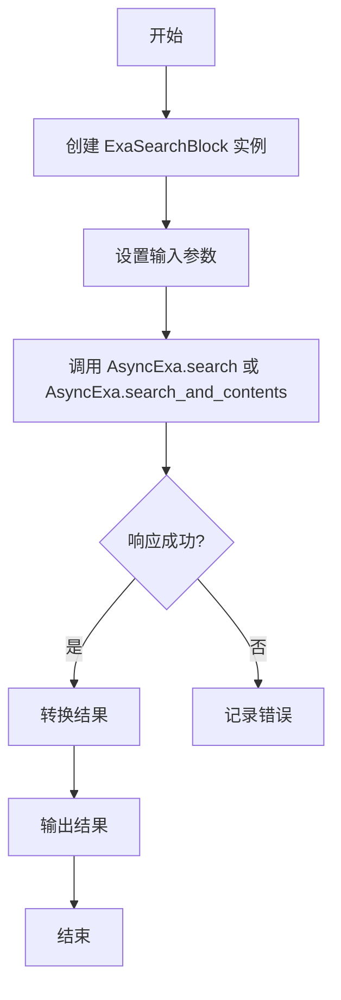
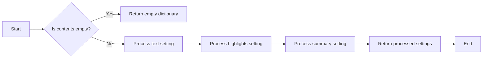
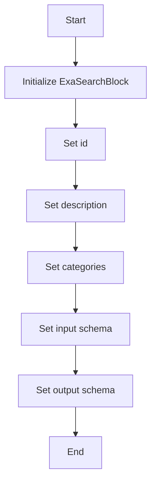
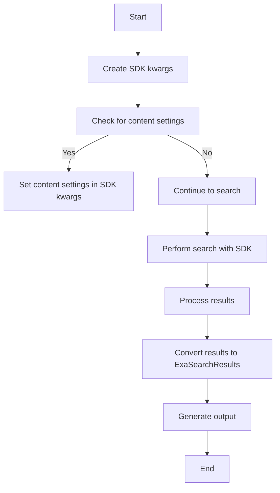
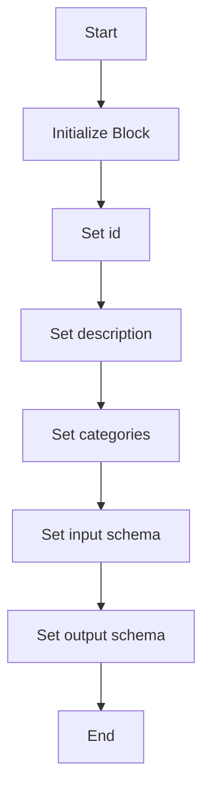

# `.\AutoGPT\autogpt_platform\backend\backend\blocks\exa\search.py` 详细设计文档

The code defines a class ExaSearchBlock that uses Exa's advanced search API to search the web and retrieve search results.

## 整体流程



## 类结构

```
ExaSearchBlock (具体类)
├── Input (内部类)
│   ├── credentials
│   ├── query
│   ├── type
│   ├── category
│   ├── user_location
│   ├── number_of_results
│   ├── include_domains
│   ├── exclude_domains
│   ├── start_crawl_date
│   ├── end_crawl_date
│   ├── start_published_date
│   ├── end_published_date
│   ├── include_text
│   ├── exclude_text
│   ├── contents
│   └── moderation
│   └── SchemaField (内部类)
│       ├── description
│       ├── default
│       ├── advanced
│       └── ...
├── Output (内部类)
│   ├── results
│   ├── result
│   ├── context
│   ├── search_type
│   ├── resolved_search_type
│   ├── cost_dollars
│   └── error
│   └── SchemaField (内部类)
│       ├── description
│       ├── default
│       ├── advanced
│       └── ...
└── ExaSearchTypes (枚举类)
    └── KEYWORD
    └── NEURAL
    └── FAST
    └── AUTO
    └── ExaSearchCategories (枚举类)
        └── COMPANY
        └── RESEARCH_PAPER
        └── NEWS
        └── PDF
        └── GITHUB
        └── TWEET
        └── PERSONAL_SITE
        └── LINKEDIN_PROFILE
        └── FINANCIAL_REPORT
```

## 全局变量及字段


### `exa`
    
The Exa integration object used for API communication.

类型：`AsyncExa`
    


### `AsyncExa`
    
A class representing the Exa API client.

类型：`class`
    


### `APIKeyCredentials`
    
A class representing API key credentials.

类型：`class`
    


### `Block`
    
A base class for blocks in the system.

类型：`class`
    


### `BlockCategory`
    
An enum representing block categories.

类型：`class`
    


### `BlockOutput`
    
A class representing block output.

类型：`class`
    


### `BlockSchemaInput`
    
A class representing block schema input.

类型：`class`
    


### `BlockSchemaOutput`
    
A class representing block schema output.

类型：`class`
    


### `CredentialsMetaInput`
    
A class representing credentials metadata input.

类型：`class`
    


### `SchemaField`
    
A class representing schema fields.

类型：`class`
    


### `ExaSearchTypes`
    
An enum representing Exa search types.

类型：`Enum`
    


### `ExaSearchCategories`
    
An enum representing Exa search categories.

类型：`Enum`
    


### `ExaSearchResults`
    
A class representing Exa search results.

类型：`class`
    


### `ContentSettings`
    
A class representing content settings.

类型：`class`
    


### `CostDollars`
    
A class representing cost breakdown in dollars.

类型：`class`
    


### `datetime`
    
A module for datetime operations.

类型：`module`
    


### `Enum`
    
A module for creating enumerations.

类型：`module`
    


### `Optional`
    
A module for creating optional types.

类型：`module`
    


### `typing`
    
A module for type annotations.

类型：`module`
    


### `from datetime import datetime`
    
Imports the datetime class from the datetime module.

类型：`import`
    


### `from enum import Enum`
    
Imports the Enum class from the enum module.

类型：`import`
    


### `from typing import Optional`
    
Imports the Optional type from the typing module.

类型：`import`
    


### `from exa_py import AsyncExa`
    
Imports the AsyncExa class from the exa_py module.

类型：`import`
    


### `from backend.sdk import ...`
    
Imports various classes and enums from the backend.sdk module.

类型：`import`
    


### `from ._config import exa`
    
Imports the exa object from the _config module.

类型：`import`
    


### `from .helpers import ...`
    
Imports various classes and functions from the helpers module.

类型：`import`
    


### `ExaSearchBlock.id`
    
The unique identifier for the ExaSearchBlock.

类型：`str`
    


### `ExaSearchBlock.description`
    
A description of the ExaSearchBlock.

类型：`str`
    


### `ExaSearchBlock.categories`
    
A set of categories to which the ExaSearchBlock belongs.

类型：`set`
    


### `ExaSearchBlock.input_schema`
    
The input schema for the ExaSearchBlock.

类型：`BlockSchemaInput`
    


### `ExaSearchBlock.output_schema`
    
The output schema for the ExaSearchBlock.

类型：`BlockSchemaOutput`
    


### `Input.credentials`
    
The credentials required for the Exa integration.

类型：`CredentialsMetaInput`
    


### `Input.query`
    
The search query string.

类型：`str`
    


### `Input.type`
    
The type of search to perform.

类型：`ExaSearchTypes`
    


### `Input.category`
    
The category to search within.

类型：`ExaSearchCategories`
    


### `Input.user_location`
    
The two-letter ISO country code of the user.

类型：`str`
    


### `Input.number_of_results`
    
The number of results to return.

类型：`int`
    


### `Input.include_domains`
    
The domains to include in the search.

类型：`list[str]`
    


### `Input.exclude_domains`
    
The domains to exclude from the search.

类型：`list[str]`
    


### `Input.start_crawl_date`
    
The start date for crawled content.

类型：`datetime`
    


### `Input.end_crawl_date`
    
The end date for crawled content.

类型：`datetime`
    


### `Input.start_published_date`
    
The start date for published content.

类型：`datetime`
    


### `Input.end_published_date`
    
The end date for published content.

类型：`datetime`
    


### `Input.include_text`
    
The text patterns to include in the search.

类型：`list[str]`
    


### `Input.exclude_text`
    
The text patterns to exclude from the search.

类型：`list[str]`
    


### `Input.contents`
    
The content retrieval settings.

类型：`ContentSettings`
    


### `Input.moderation`
    
Whether to enable content moderation.

类型：`bool`
    


### `Output.results`
    
The list of search results.

类型：`list[ExaSearchResults]`
    


### `Output.result`
    
A single search result.

类型：`ExaSearchResults`
    


### `Output.context`
    
A formatted string of the search results for LLMs.

类型：`str`
    


### `Output.search_type`
    
The search type for auto searches.

类型：`str`
    


### `Output.resolved_search_type`
    
The actual search type used for the request.

类型：`str`
    


### `Output.cost_dollars`
    
The cost breakdown for the request.

类型：`Optional[CostDollars]`
    


### `Output.error`
    
An error message if the request failed.

类型：`str`
    
    

## 全局函数及方法


### process_contents_settings

This function processes the content settings from the input data and returns a dictionary with the processed settings.

参数：

- `contents`：`ContentSettings`，The content settings to process.

返回值：`dict`，A dictionary containing the processed content settings.

#### 流程图



#### 带注释源码

```python
def process_contents_settings(contents: ContentSettings) -> dict:
    processed_settings = {}
    if contents.text:
        processed_settings["text"] = contents.text
    if "highlights" in contents:
        processed_settings["highlights"] = contents.highlights
    if "summary" in contents:
        processed_settings["summary"] = contents.summary
    return processed_settings
```


### ExaSearchBlock.__init__

This method initializes an instance of the `ExaSearchBlock` class, setting up its properties and configurations.

参数：

- `id`: `str`，The unique identifier for the block.
- `description`: `str`，A description of the block's functionality.
- `categories`: `set`，A set of categories that the block belongs to.
- `input_schema`: `Input`，The input schema for the block.
- `output_schema`: `Output`，The output schema for the block.

返回值：无

#### 流程图



#### 带注释源码

```python
def __init__(self):
    super().__init__(
        id="996cec64-ac40-4dde-982f-b0dc60a5824d",
        description="Searches the web using Exa's advanced search API",
        categories={BlockCategory.SEARCH},
        input_schema=ExaSearchBlock.Input,
        output_schema=ExaSearchBlock.Output,
    )
```


### ExaSearchBlock.run

This method performs an advanced search on the web using Exa's search API.

参数：

- `input_data`：`Input`，The search query and other search parameters.
- `credentials`：`APIKeyCredentials`，The credentials for the Exa API.
- `**kwargs`：Additional keyword arguments that may be passed to the method.

返回值：`BlockOutput`，The search results and other information.

#### 流程图



#### 带注释源码

```python
async def run(self, input_data: Input, *, credentials: APIKeyCredentials, **kwargs) -> BlockOutput:
    # Create SDK kwargs based on input data
    sdk_kwargs = {
        "query": input_data.query,
        "num_results": input_data.number_of_results,
    }

    # Add additional parameters to SDK kwargs if they exist
    if input_data.type:
        sdk_kwargs["type"] = input_data.type.value

    if input_data.category:
        sdk_kwargs["category"] = input_data.category.value

    if input_data.user_location:
        sdk_kwargs["user_location"] = input_data.user_location

    # Handle domains
    if input_data.include_domains:
        sdk_kwargs["include_domains"] = input_data.include_domains
    if input_data.exclude_domains:
        sdk_kwargs["exclude_domains"] = input_data.exclude_domains

    # Handle dates
    if input_data.start_crawl_date:
        sdk_kwargs["start_crawl_date"] = input_data.start_crawl_date.isoformat()
    if input_data.end_crawl_date:
        sdk_kwargs["end_crawl_date"] = input_data.end_crawl_date.isoformat()
    if input_data.start_published_date:
        sdk_kwargs["start_published_date"] = input_data.start_published_date.isoformat()
    if input_data.end_published_date:
        sdk_kwargs["end_published_date"] = input_data.end_published_date.isoformat()

    # Handle text filters
    if input_data.include_text:
        sdk_kwargs["include_text"] = input_data.include_text
    if input_data.exclude_text:
        sdk_kwargs["exclude_text"] = input_data.exclude_text

    if input_data.moderation:
        sdk_kwargs["moderation"] = input_data.moderation

    # Check if we need to use search_and_contents
    content_settings = process_contents_settings(input_data.contents)

    # Create an instance of AsyncExa with the API key
    aexa = AsyncExa(api_key=credentials.api_key.get_secret_value())

    # Perform the search with the SDK
    if content_settings:
        response = await aexa.search_and_contents(**sdk_kwargs)
    else:
        response = await aexa.search(**sdk_kwargs)

    # Process the results
    converted_results = [
        ExaSearchResults.from_sdk(sdk_result)
        for sdk_result in response.results or []
    ]

    # Generate output
    yield "results", converted_results
    for result in converted_results:
        yield "result", result

    if response.context:
        yield "context", response.context

    if response.resolved_search_type:
        yield "resolved_search_type", response.resolved_search_type

    if response.cost_dollars:
        yield "cost_dollars", response.cost_dollars
```


### `ExaSearchBlock.__init__`

This method initializes the `ExaSearchBlock` class, setting up its metadata and schema for the Exa search API.

参数：

- `id`：`str`，The unique identifier for the block.
- `description`：`str`，A description of the block's functionality.
- `categories`：`set`，A set of categories that the block belongs to.
- `input_schema`：`BlockSchemaInput`，The schema for the input data.
- `output_schema`：`BlockSchemaOutput`，The schema for the output data.

返回值：无

#### 流程图



#### 带注释源码

```python
def __init__(self):
    super().__init__(
        id="996cec64-ac40-4dde-982f-b0dc60a5824d",
        description="Searches the web using Exa's advanced search API",
        categories={BlockCategory.SEARCH},
        input_schema=ExaSearchBlock.Input,
        output_schema=ExaSearchBlock.Output,
    )
```


### Output.__init__

This method initializes the `Output` class of the `ExaSearchBlock` class. It sets up the schema for the output of the search block, which includes various fields related to search results, context, search type, cost breakdown, and error messages.

参数：

- `id`：`str`，The unique identifier for the block.
- `description`：`str`，A description of the block's functionality.
- `categories`：`set`，A set of categories that the block belongs to.
- `input_schema`：`Input`，The input schema for the block.
- `output_schema`：`Output`，The output schema for the block.

返回值：无

#### 流程图

```mermaid
classDiagram
    Output --|> BlockSchemaOutput
    Output : +id: str
    Output : +description: str
    Output : +categories: set
    Output : +input_schema: Input
    Output : +output_schema: Output
```

#### 带注释源码

```python
class Output(BlockSchemaOutput):
    results: list[ExaSearchResults] = SchemaField(
        description="List of search results"
    )
    result: ExaSearchResults = SchemaField(description="Single search result")
    context: str = SchemaField(
        description="A formatted string of the search results ready for LLMs."
    )
    search_type: str = SchemaField(
        description="For auto searches, indicates which search type was selected."
    )
    resolved_search_type: str = SchemaField(
        description="The search type that was actually used for this request (neural or keyword)"
    )
    cost_dollars: Optional[CostDollars] = SchemaField(
        description="Cost breakdown for the request"
    )
    error: str = SchemaField(description="Error message if the request failed")

    def __init__(self, id: str, description: str, categories: set, input_schema: Input, output_schema: Output):
        super().__init__(
            id=id,
            description=description,
            categories=categories,
            input_schema=input_schema,
            output_schema=output_schema,
        )
```


## 关键组件


### 张量索引与惰性加载

用于高效地索引和检索数据，同时延迟加载数据以优化性能。

### 反量化支持

提供对反量化操作的支持，以适应不同的量化需求。

### 量化策略

定义了量化策略，用于优化模型性能和资源使用。


## 问题及建议


### 已知问题

-   **API Key Management**: The code uses an API key for authentication with Exa's API. The key is retrieved using `credentials.api_key.get_secret_value()`, which suggests that it might be stored in an environment variable or a secret management system. However, the code does not show how the API key is stored or managed, which could be a security concern.
-   **Error Handling**: The code does not explicitly handle errors that might occur during the API call. It only checks if the response has an "error" field. More robust error handling and logging would be beneficial.
-   **Code Duplication**: The code has duplicated logic for handling dates and text filters. This could be refactored into separate functions to reduce redundancy and improve maintainability.
-   **Documentation**: The code lacks detailed comments explaining the purpose of each function and the overall architecture. This makes it harder for other developers to understand and maintain the code.

### 优化建议

-   **Implement Secret Management**: Introduce a secret management system to securely store and retrieve the API key. This would help prevent the exposure of sensitive information in the codebase.
-   **Enhance Error Handling**: Add comprehensive error handling to catch and log exceptions that might occur during the API call. This would help in debugging and improving the robustness of the application.
-   **Refactor Code**: Refactor the code to eliminate duplicate logic, such as the handling of dates and text filters. This would make the code cleaner and easier to maintain.
-   **Add Documentation**: Add detailed comments and documentation to the codebase to explain the purpose and functionality of each part of the code. This would improve the code's readability and maintainability.
-   **Asynchronous Execution**: The code uses `async` for asynchronous execution, which is good for performance. However, it could be further optimized by using more advanced asynchronous patterns, such as using `asyncio.gather` to run multiple asynchronous operations concurrently.
-   **Input Validation**: Add input validation to ensure that the data provided to the API is correct and meets the expected format. This would prevent errors and improve the reliability of the application.


## 其它


### 设计目标与约束

- 设计目标：
  - 实现一个高效、可扩展的搜索引擎，能够处理复杂的搜索请求。
  - 提供灵活的搜索参数，以支持多种搜索类型和内容过滤。
  - 确保搜索结果的质量和准确性。
  - 与Exa的API集成，以利用其强大的搜索功能。

- 约束：
  - 必须使用Exa的API进行搜索。
  - 搜索参数必须符合Exa API的要求。
  - 搜索结果必须以统一格式返回。

### 错误处理与异常设计

- 错误处理：
  - 捕获并处理Exa API请求失败的情况。
  - 捕获并处理数据转换错误。
  - 返回清晰的错误信息给用户。

- 异常设计：
  - 使用try-except块来捕获和处理可能发生的异常。
  - 定义自定义异常类，以提供更具体的错误信息。

### 数据流与状态机

- 数据流：
  - 用户输入搜索请求。
  - 请求被转换为Exa API所需的格式。
  - Exa API返回搜索结果。
  - 搜索结果被转换为内部格式并返回给用户。

- 状态机：
  - 搜索请求状态：待处理、处理中、完成、失败。
  - 结果处理状态：转换中、转换完成、转换失败。

### 外部依赖与接口契约

- 外部依赖：
  - Exa API。
  - AsyncExa库。

- 接口契约：
  - Exa API的请求和响应格式。
  - AsyncExa库的使用规范。
  - 搜索结果的内部表示。


    