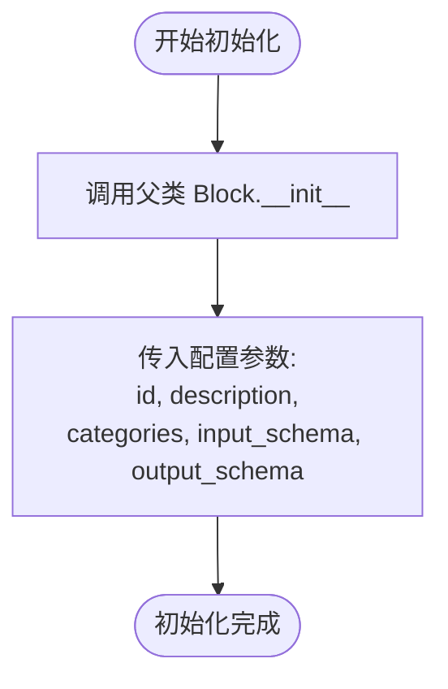

# `AutoGPT\autogpt_platform\backend\backend\blocks\exa\similar.py` 详细设计文档

该代码实现了一个名为 ExaFindSimilarBlock 的异步搜索模块，继承自 Block 基类。它利用 Exa API 根据给定的 URL 查找相似的链接。该模块支持多种过滤条件（如域名、日期、文本模式）和内容检索设置，并能将返回的数据结构化为标准化的输出格式，包含搜索结果列表、上下文文本及请求成本。

## 整体流程


## 类结构

```
Block (抽象基类)
└── ExaFindSimilarBlock
    ├── Input (BlockSchemaInput)
    └── Output (BlockSchemaOutput)
```

## 全局变量及字段


### `ExaFindSimilarBlock.Input.credentials`
    
The Exa integration requires an API Key.

类型：`CredentialsMetaInput`
    


### `ExaFindSimilarBlock.Input.url`
    
The url for which you would like to find similar links

类型：`str`
    


### `ExaFindSimilarBlock.Input.number_of_results`
    
Number of results to return

类型：`int`
    


### `ExaFindSimilarBlock.Input.include_domains`
    
List of domains to include in the search. If specified, results will only come from these domains.

类型：`list[str]`
    


### `ExaFindSimilarBlock.Input.exclude_domains`
    
Domains to exclude from search

类型：`list[str]`
    


### `ExaFindSimilarBlock.Input.start_crawl_date`
    
Start date for crawled content

类型：`Optional[datetime]`
    


### `ExaFindSimilarBlock.Input.end_crawl_date`
    
End date for crawled content

类型：`Optional[datetime]`
    


### `ExaFindSimilarBlock.Input.start_published_date`
    
Start date for published content

类型：`Optional[datetime]`
    


### `ExaFindSimilarBlock.Input.end_published_date`
    
End date for published content

类型：`Optional[datetime]`
    


### `ExaFindSimilarBlock.Input.include_text`
    
Text patterns to include (max 1 string, up to 5 words)

类型：`list[str]`
    


### `ExaFindSimilarBlock.Input.exclude_text`
    
Text patterns to exclude (max 1 string, up to 5 words)

类型：`list[str]`
    


### `ExaFindSimilarBlock.Input.contents`
    
Content retrieval settings

类型：`ContentSettings`
    


### `ExaFindSimilarBlock.Input.moderation`
    
Enable content moderation to filter unsafe content from search results

类型：`bool`
    


### `ExaFindSimilarBlock.Output.results`
    
List of similar documents with metadata and content

类型：`list[ExaSearchResults]`
    


### `ExaFindSimilarBlock.Output.result`
    
Single similar document result

类型：`ExaSearchResults`
    


### `ExaFindSimilarBlock.Output.context`
    
A formatted string of the results ready for LLMs.

类型：`str`
    


### `ExaFindSimilarBlock.Output.request_id`
    
Unique identifier for the request

类型：`str`
    


### `ExaFindSimilarBlock.Output.cost_dollars`
    
Cost breakdown for the request

类型：`Optional[CostDollars]`
    


### `ExaFindSimilarBlock.Output.error`
    
Error message if the request failed

类型：`str`
    
    

## 全局函数及方法


### `ExaFindSimilarBlock.__init__`

该方法用于初始化 `ExaFindSimilarBlock` 类的实例。它通过调用父类 `Block` 的构造函数，配置块的唯一标识符、功能描述、所属类别以及输入输出的数据模式结构，从而完成该搜索块的静态定义。

参数：

-  `self`：`ExaFindSimilarBlock`，表示类实例本身

返回值：`None`，无返回值

#### 流程图



#### 带注释源码

```python
    def __init__(self):
        # 调用父类 Block 的初始化方法，设置块的元数据和结构
        super().__init__(
            # 定义该块的唯一 ID
            id="5e7315d1-af61-4a0c-9350-7c868fa7438a",
            # 描述该块的功能：使用 Exa 的 findSimilar API 查找相似链接
            description="Finds similar links using Exa's findSimilar API",
            # 将该块归类为搜索类别
            categories={BlockCategory.SEARCH},
            # 指定输入数据的结构模式为内部定义的 Input 类
            input_schema=ExaFindSimilarBlock.Input,
            # 指定输出数据的结构模式为内部定义的 Output 类
            output_schema=ExaFindSimilarBlock.Output,
        )
```


### `ExaFindSimilarBlock.run`

执行查找相似链接的操作，通过处理输入参数（如 URL、域名过滤器和日期），调用 Exa SDK，并将结果格式化为结构化输出。

参数：

-  `input_data`：`ExaFindSimilarBlock.Input`，包含搜索 URL、结果数量限制、域名过滤、日期范围及内容检索配置等输入数据的对象。
-  `credentials`：`APIKeyCredentials`，用于访问 Exa API 的认证凭据对象。
-  `**kwargs`：`dict`，扩展的关键字参数。

返回值：`BlockOutput`，异步生成器，依次产出搜索结果列表、单个搜索结果、上下文字符串以及请求成本信息。

#### 流程图


#### 带注释源码

```python
    async def run(
        self, input_data: Input, *, credentials: APIKeyCredentials, **kwargs
    ) -> BlockOutput:
        # 初始化SDK调用参数，包含核心必填项
        sdk_kwargs = {
            "url": input_data.url,
            "num_results": input_data.number_of_results,
        }

        # 处理域名包含逻辑
        if input_data.include_domains:
            sdk_kwargs["include_domains"] = input_data.include_domains
        
        # 处理域名排除逻辑
        if input_data.exclude_domains:
            sdk_kwargs["exclude_domains"] = input_data.exclude_domains

        # 处理爬取日期，将datetime对象转换为ISO格式字符串
        if input_data.start_crawl_date:
            sdk_kwargs["start_crawl_date"] = input_data.start_crawl_date.isoformat()
        if input_data.end_crawl_date:
            sdk_kwargs["end_crawl_date"] = input_data.end_crawl_date.isoformat()
        
        # 处理发布日期，将datetime对象转换为ISO格式字符串
        if input_data.start_published_date:
            sdk_kwargs["start_published_date"] = (
                input_data.start_published_date.isoformat()
            )
        if input_data.end_published_date:
            sdk_kwargs["end_published_date"] = input_data.end_published_date.isoformat()

        # 处理文本包含与排除过滤条件
        if input_data.include_text:
            sdk_kwargs["include_text"] = input_data.include_text
        if input_data.exclude_text:
            sdk_kwargs["exclude_text"] = input_data.exclude_text

        # 添加内容审核开关
        if input_data.moderation:
            sdk_kwargs["moderation"] = input_data.moderation

        # 处理内容设置，决定是否需要获取全文/高亮/摘要
        content_settings = process_contents_settings(input_data.contents)

        # 使用API Key初始化异步Exa客户端
        aexa = AsyncExa(api_key=credentials.api_key.get_secret_value())

        # 根据是否需要具体内容，选择调用不同的API端点
        if content_settings:
            # 配置内容相关参数
            sdk_kwargs["text"] = content_settings.get("text", False)
            if "highlights" in content_settings:
                sdk_kwargs["highlights"] = content_settings["highlights"]
            if "summary" in content_settings:
                sdk_kwargs["summary"] = content_settings["summary"]
            # 调用获取相似链接及内容的API
            response = await aexa.find_similar_and_contents(**sdk_kwargs)
        else:
            # 仅获取相似链接元数据
            response = await aexa.find_similar(**sdk_kwargs)

        # 将SDK返回的结果对象转换为项目内部使用的ExaSearchResults对象
        converted_results = [
            ExaSearchResults.from_sdk(sdk_result)
            for sdk_result in response.results or []
        ]

        # 产出结果列表
        yield "results", converted_results
        
        # 逐个产出结果，便于流式处理或只取第一个
        for result in converted_results:
            yield "result", result

        # 如果存在上下文字符串，产出上下文
        if response.context:
            yield "context", response.context

        # 如果存在成本信息，产出成本
        if response.cost_dollars:
            yield "cost_dollars", response.cost_dollars
```


## 关键组件


### ExaFindSimilarBlock
封装用于执行相似链接搜索的核心逻辑，处理参数编排、与外部 API 的异步交互以及结果生成。

### Schema Definitions (Input/Output)
定义块接口的严格数据契约，指定输入配置（如 URL、过滤器和日期范围）和输出结构（如结果列表、上下文字符串和成本数据）。

### Content Routing Logic
基于 `ContentSettings` 配置动态选择 API 端点的逻辑，决定是调用基础的 `find_similar` 还是丰富的 `find_similar_and_contents`。

### AsyncExa SDK Client
用于与外部 Exa API 进行异步通信的客户端组件，负责根据处理后的参数执行实际的网络请求。

### Data Transformation Pipeline
将 Exa SDK 返回的原生响应对象映射为标准化的 `ExaSearchResults` 数据结构，以便在系统内部统一处理和使用。


## 问题及建议


### 已知问题

-   缺乏异常捕获机制：`run` 方法中直接调用了外部异步 API (`await aexa.find_similar...`) 且未包含 `try-except` 块。当网络请求失败、API 返回错误或发生超时异常时，错误会直接向上抛出导致 Block 执行中断，而不是按照 Output schema 中定义的 `error` 字段返回错误信息，这将导致下游流程无法优雅处理错误。
-   资源管理潜在泄露：代码中直接通过 `aexa = AsyncExa(...)` 实例化了客户端对象。如果 `AsyncExa` 内部维护了未自动关闭的连接池（例如 `aiohttp.ClientSession`），且 `run` 方法结束时未显式关闭该客户端，可能会导致连接资源耗尽。
-   输入约束校验缺失：输入字段 `include_text` 和 `exclude_text` 的描述中明确约束了格式（"max 1 string, up to 5 words"），但代码实现中并未对此逻辑进行验证，直接将参数透传给 SDK，可能发送无效请求导致 API 错误或配额浪费。

### 优化建议

-   实现全面的错误处理：建议在 API 调用逻辑外层包裹 `try-except` 块，捕获 `exa_py` 可能抛出的特定异常以及通用的网络异常。在捕获异常后，应记录错误日志，并通过 `yield "error", error_message` 输出错误，保证错误流的完整性。
-   优化参数构建逻辑：当前代码通过多个 `if` 判断来构建 `sdk_kwargs`，较为冗长。建议引入一个辅助函数（如 `_build_sdk_kwargs`），利用字典推导式或过滤 `None` 值的方式来自动构建参数字典，从而提高代码的可读性和可维护性。
-   使用上下文管理器管理客户端：如果 `AsyncExa` 支持 `async with` 语法，建议使用上下文管理器来确保客户端资源的正确释放；如果不支持，应确保在 `finally` 块中显式关闭客户端。
-   增加输入数据校验：在调用 SDK 之前，增加对关键输入参数的校验逻辑。例如，检查日期范围的有效性（开始时间不晚于结束时间）、验证文本字段的长度限制等，在代码层面提前阻断非法请求。
-   引入结构化日志：在 Block 的入口、API 调用前后及数据转换处添加日志记录（如使用 `logging` 模块），记录请求 ID、参数摘要及耗时，便于生产环境的故障排查与性能监控。


## 其它


### 设计目标与约束

设计目标主要是封装 Exa AI 的 "find similar" (相似链接查找) API，将其集成到基于 Block 的异步执行框架中。该组件旨在提供结构化的输入验证和标准化的输出格式，以便下游系统（如 LLM 工作流）能够轻松消费搜索结果。关键约束包括：必须使用异步 I/O (`async/await`) 模式以避免阻塞事件循环；执行依赖于外部 API (`exa_py`) 的可用性和响应速度；输入必须符合预定义的 Schema 约束，且必须包含有效的 API Key 凭证；输出采用 Generator (yield) 模式，支持流式返回数据，以减少内存占用并提高实时性。

### 错误处理与异常设计

当前代码在 `Output` Schema 中定义了 `error: str` 字段，用于在请求失败时返回错误信息，但在 `run` 方法内部并未实现显式的 `try-except` 异常捕获块。这意味着如果 `AsyncExa` 客户端抛出异常（如网络错误、认证失败或 4xx/5xx API 错误），该异常将直接传播至上层调用者，导致 Block 执行中断，而不会通过 `error` 输出端口 yield 错误消息。数据验证主要由 `SchemaField` 类型系统在运行前完成，不满足类型要求的输入（如错误的日期格式）将在执行前被拦截。

### 数据流与状态机

数据流始于 `run` 方法接收 `Input` 数据和 `credentials`。首先，代码构建 `sdk_kwargs` 字典，有条件地将输入参数映射为 SDK 所需的格式（如将 `datetime` 转换为 ISO 格式字符串）。接着，根据 `contents` 配置的状态（是否为空），流程进入两个分支之一：如果需要内容检索，调用 `find_similar_and_contents`；否则调用基础的 `find_similar`。API 响应返回后，数据经过转换 (`from_sdk`) 统一为 `ExaSearchResults` 对象列表。最后，通过 Generator 模式按顺序 yield 结果列表 (`results`)、单个结果 (`result`)、上下文 (`context`) 和成本 (`cost_dollars`)。该 Block 是无状态的，不维护跨请求的内部状态，每次执行都是独立的。

### 外部依赖与接口契约

该组件主要依赖外部库 `exa_py` (具体为 `AsyncExa` 类) 来与 Exa AI 服务进行交互。接口契约要求调用者必须提供有效的 Exa API Key，该 Key 通过 `credentials` 参数注入。`AsyncExa` 的方法契约规定，`find_similar` 和 `find_similar_and_contents` 接受特定的关键字参数（如 `url`, `num_results`, `include_domains` 等），并返回包含 `results`, `context`, `cost_dollars` 等属性的响应对象。此外，组件还强依赖于项目内部的 `backend.sdk` 模块，必须继承 `Block` 基类并实现特定的 Input/Output Schema 结构，以符合宿主系统的插件加载和执行契约。

### 并发与性能考量

代码采用了 Python 的原生 `asyncio` 机制，通过 `await aexa...` 调用外部 API，这允许在等待网络 I/O 时释放控制权，从而支持高并发场景下的 Block 调用。输出端使用 `yield` 生成器模式，允许下游消费者在获取第一个结果时即可开始处理，而无需等待所有结果完全生成和加载到内存中，这对于处理大量搜索结果或大文本内容的场景尤为有利，有助于降低内存峰值。

    