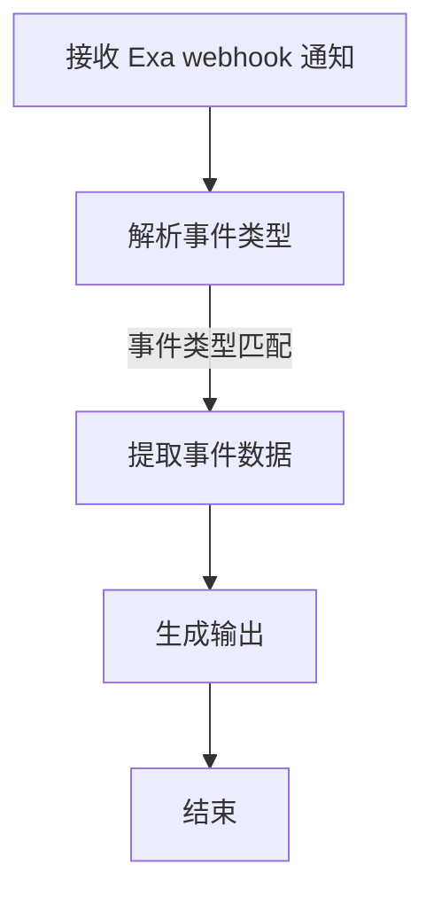
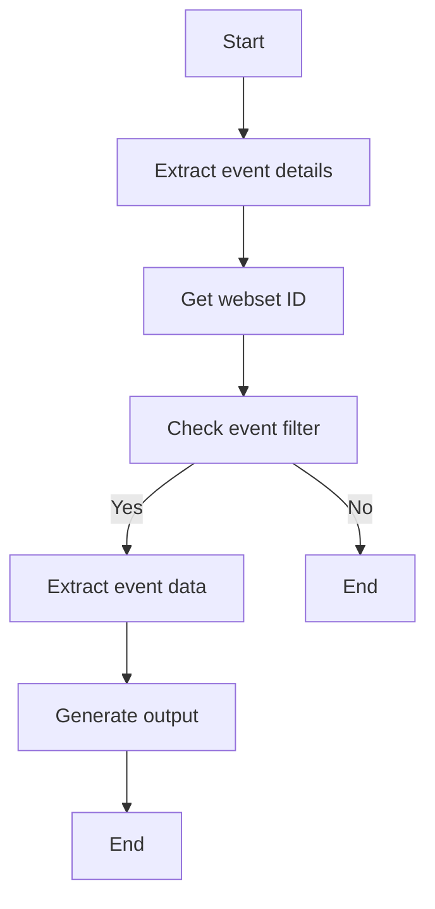
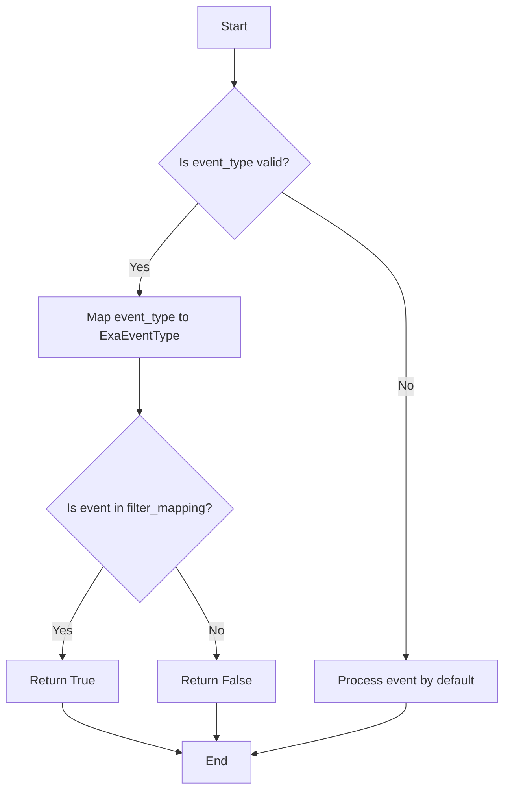
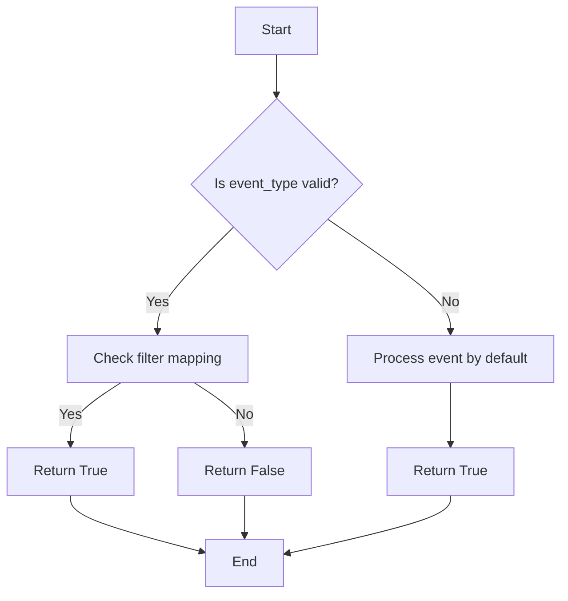
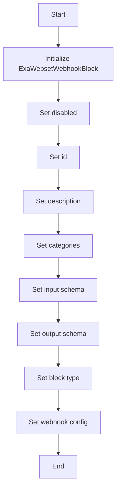

# `.\AutoGPT\autogpt_platform\backend\backend\blocks\exa\webhook_blocks.py` 详细设计文档

This code defines a webhook block for Exa webset events, allowing monitoring of various events such as creation, updates, searches, and exports.

## 整体流程



## 类结构

```
BaseModel (抽象基类)
├── Block (抽象基类)
│   ├── ExaWebsetWebhookBlock (具体实现)
│   └── ...
└── WebsetEventFilter (具体实现)
```

## 全局变量及字段


### `exa`
    
Module containing Exa API configuration.

类型：`module`
    


### `ExaEventType`
    
Enum representing different Exa event types.

类型：`enum`
    


### `WebsetEventFilter`
    
Class representing the filter configuration for Exa webset events.

类型：`class`
    


### `Input`
    
Class representing the input schema for the ExaWebsetWebhookBlock.

类型：`class`
    


### `Output`
    
Class representing the output schema for the ExaWebsetWebhookBlock.

类型：`class`
    


### `Block`
    
Base class for all Exa blocks.

类型：`class`
    


### `BlockSchemaInput`
    
Class representing the input schema for a block.

类型：`class`
    


### `BlockSchemaOutput`
    
Class representing the output schema for a block.

类型：`class`
    


### `BlockType`
    
Enum representing different block types.

类型：`enum`
    


### `BlockWebhookConfig`
    
Class representing the webhook configuration for a block.

类型：`class`
    


### `CredentialsMetaInput`
    
Class representing the credentials metadata input.

类型：`class`
    


### `Field`
    
Class representing a field in a schema.

类型：`class`
    


### `SchemaField`
    
Class representing a field in a schema with additional properties.

类型：`class`
    


### `ProviderName`
    
Enum representing different provider names.

类型：`enum`
    


### `BaseModel`
    
Base class for all models.

类型：`class`
    


### `BlockCategory`
    
Enum representing different block categories.

类型：`enum`
    


### `BlockOutput`
    
Class representing the output of a block.

类型：`class`
    


### `BlockWebhookConfig`
    
Class representing the webhook configuration for a block.

类型：`class`
    


### `WebsetEventFilter.webset_created`
    
Receive notifications when websets are created.

类型：`bool`
    


### `WebsetEventFilter.webset_deleted`
    
Receive notifications when websets are deleted.

类型：`bool`
    


### `WebsetEventFilter.webset_paused`
    
Receive notifications when websets are paused.

类型：`bool`
    


### `WebsetEventFilter.webset_idle`
    
Receive notifications when websets become idle.

类型：`bool`
    


### `WebsetEventFilter.search_created`
    
Receive notifications when webset searches are created.

类型：`bool`
    


### `WebsetEventFilter.search_completed`
    
Receive notifications when webset searches complete.

类型：`bool`
    


### `WebsetEventFilter.search_canceled`
    
Receive notifications when webset searches are canceled.

类型：`bool`
    


### `WebsetEventFilter.search_updated`
    
Receive notifications when webset searches are updated.

类型：`bool`
    


### `WebsetEventFilter.item_created`
    
Receive notifications when webset items are created.

类型：`bool`
    


### `WebsetEventFilter.item_enriched`
    
Receive notifications when webset items are enriched.

类型：`bool`
    


### `WebsetEventFilter.export_created`
    
Receive notifications when webset exports are created.

类型：`bool`
    


### `WebsetEventFilter.export_completed`
    
Receive notifications when webset exports complete.

类型：`bool`
    


### `WebsetEventFilter.import_created`
    
Receive notifications when imports are created.

类型：`bool`
    


### `WebsetEventFilter.import_completed`
    
Receive notifications when imports complete.

类型：`bool`
    


### `WebsetEventFilter.import_processing`
    
Receive notifications when imports are processing.

类型：`bool`
    


### `ExaWebsetWebhookBlock.disabled`
    
Indicates whether the block is disabled.

类型：`bool`
    


### `ExaWebsetWebhookBlock.id`
    
Unique identifier for the block.

类型：`str`
    


### `ExaWebsetWebhookBlock.description`
    
Description of the block.

类型：`str`
    


### `ExaWebsetWebhookBlock.categories`
    
Categories to which the block belongs.

类型：`set`
    


### `ExaWebsetWebhookBlock.input_schema`
    
Input schema for the block.

类型：`Input`
    


### `ExaWebsetWebhookBlock.output_schema`
    
Output schema for the block.

类型：`Output`
    


### `ExaWebsetWebhookBlock.block_type`
    
Type of the block.

类型：`BlockType`
    


### `ExaWebsetWebhookBlock.webhook_config`
    
Webhook configuration for the block.

类型：`BlockWebhookConfig`
    
    

## 全局函数及方法


### `ExaWebsetWebhookBlock.run`

Process incoming Exa webhook payload.

参数：

- `input_data`：`Input`，The input data for the webhook, containing the payload and other configuration details.
- `**kwargs`：`dict`，Additional keyword arguments that may be passed to the function.

返回值：`BlockOutput`，A generator that yields key-value pairs representing the event data.

#### 流程图



#### 带注释源码

```python
async def run(self, input_data: Input, **kwargs) -> BlockOutput:
    """Process incoming Exa webhook payload."""
    payload = input_data.payload

    # Extract event details
    event_type = payload.get("eventType", "unknown")
    event_id = payload.get("eventId", "")

    # Get webset ID from payload or input
    webset_id = payload.get("websetId", input_data.webset_id)

    # Check if we should process this event based on filter
    should_process = self._should_process_event(event_type, input_data.event_filter)

    if not should_process:
        # Skip events that don't match our filter
        return

    # Extract event data
    event_data = payload.get("data", {})
    timestamp = payload.get("occurredAt", payload.get("createdAt", ""))
    metadata = payload.get("metadata", {})

    yield "event_type", event_type
    yield "event_id", event_id
    yield "webset_id", webset_id
    yield "data", event_data
    yield "timestamp", timestamp
    yield "metadata", metadata
``` 


### `_should_process_event`

Check if an event should be processed based on the filter.

参数：

- `event_type`：`str`，The type of event that occurred.
- `event_filter`：`WebsetEventFilter`，The filter configuration for Exa webset events.

返回值：`bool`，Indicates whether the event should be processed or not.

#### 流程图



#### 带注释源码

```python
def _should_process_event(self, event_type: str, event_filter: WebsetEventFilter) -> bool:
    """Check if an event should be processed based on the filter."""
    filter_mapping = {
        ExaEventType.WEBSET_CREATED: event_filter.webset_created,
        ExaEventType.WEBSET_DELETED: event_filter.webset_deleted,
        ExaEventType.WEBSET_PAUSED: event_filter.webset_paused,
        ExaEventType.WEBSET_IDLE: event_filter.webset_idle,
        ExaEventType.WEBSET_SEARCH_CREATED: event_filter.search_created,
        ExaEventType.WEBSET_SEARCH_COMPLETED: event_filter.search_completed,
        ExaEventType.WEBSET_SEARCH_CANCELED: event_filter.search_canceled,
        ExaEventType.WEBSET_SEARCH_UPDATED: event_filter.search_updated,
        ExaEventType.WEBSET_ITEM_CREATED: event_filter.item_created,
        ExaEventType.WEBSET_ITEM_ENRICHED: event_filter.item_enriched,
        ExaEventType.WEBSET_EXPORT_CREATED: event_filter.export_created,
        ExaEventType.WEBSET_EXPORT_COMPLETED: event_filter.export_completed,
        ExaEventType.IMPORT_CREATED: event_filter.import_created,
        ExaEventType.IMPORT_COMPLETED: event_filter.import_completed,
        ExaEventType.IMPORT_PROCESSING: event_filter.import_processing,
    }

    # Try to convert string to ExaEventType enum
    try:
        event_type_enum = ExaEventType(event_type)
        return filter_mapping.get(event_type_enum, True)
    except ValueError:
        # If event_type is not a valid enum value, process it by default
        return True
``` 


### WebsetEventFilter.__init__

This method initializes the `WebsetEventFilter` class, setting up the default values for various event filters related to Exa webset events.

参数：

- `self`：`WebsetEventFilter` 类的实例，用于访问类的属性和方法。
- `webset_created`：`bool`，默认为 `True`，用于控制是否接收创建 webset 的通知。
- `webset_deleted`：`bool`，默认为 `False`，用于控制是否接收删除 webset 的通知。
- `webset_paused`：`bool`，默认为 `False`，用于控制是否接收暂停 webset 的通知。
- `webset_idle`：`bool`，默认为 `False`，用于控制是否接收 webset 变为空闲的通知。
- `search_created`：`bool`，默认为 `True`，用于控制是否接收创建 webset 搜索的通知。
- `search_completed`：`bool`，默认为 `True`，用于控制是否接收完成 webset 搜索的通知。
- `search_canceled`：`bool`，默认为 `False`，用于控制是否接收取消 webset 搜索的通知。
- `search_updated`：`bool`，默认为 `False`，用于控制是否接收更新 webset 搜索的通知。
- `item_created`：`bool`，默认为 `True`，用于控制是否接收创建 webset 项的通知。
- `item_enriched`：`bool`，默认为 `True`，用于控制是否接收丰富 webset 项的通知。
- `export_created`：`bool`，默认为 `False`，用于控制是否接收创建 webset 导出的通知。
- `export_completed`：`bool`，默认为 `True`，用于控制是否接收完成 webset 导出的通知。
- `import_created`：`bool`，默认为 `False`，用于控制是否接收创建导入的通知。
- `import_completed`：`bool`，默认为 `True`，用于控制是否接收完成导入的通知。
- `import_processing`：`bool`，默认为 `False`，用于控制是否接收导入正在处理的通知。

返回值：无

#### 流程图

```mermaid
classDiagram
    WebsetEventFilter {
        bool webset_created
        bool webset_deleted
        bool webset_paused
        bool webset_idle
        bool search_created
        bool search_completed
        bool search_canceled
        bool search_updated
        bool item_created
        bool item_enriched
        bool export_created
        bool export_completed
        bool import_created
        bool import_completed
        bool import_processing
    }
```

#### 带注释源码

```
def __init__(self):
    self.webset_created: bool = Field(default=True, description="Receive notifications when websets are created")
    self.webset_deleted: bool = Field(default=False, description="Receive notifications when websets are deleted")
    self.webset_paused: bool = Field(default=False, description="Receive notifications when websets are paused")
    self.webset_idle: bool = Field(default=False, description="Receive notifications when websets become idle")
    self.search_created: bool = Field(default=True, description="Receive notifications when webset searches are created")
    self.search_completed: bool = Field(default=True, description="Receive notifications when webset searches complete")
    self.search_canceled: bool = Field(default=False, description="Receive notifications when webset searches are canceled")
    self.search_updated: bool = Field(default=False, description="Receive notifications when webset searches are updated")
    self.item_created: bool = Field(default=True, description="Receive notifications when webset items are created")
    self.item_enriched: bool = Field(default=True, description="Receive notifications when webset items are enriched")
    self.export_created: bool = Field(default=False, description="Receive notifications when webset exports are created")
    self.export_completed: bool = Field(default=True, description="Receive notifications when webset exports complete")
    self.import_created: bool = Field(default=False, description="Receive notifications when imports are created")
    self.import_completed: bool = Field(default=True, description="Receive notifications when imports complete")
    self.import_processing: bool = Field(default=False, description="Receive notifications when imports are processing")
```


### WebsetEventFilter._should_process_event

Check if an event should be processed based on the filter.

参数：

- `event_type`：`str`，The type of event that occurred.
- `event_filter`：`WebsetEventFilter`，The filter configuration for Exa webset events.

返回值：`bool`，Indicates whether the event should be processed or not.

#### 流程图



#### 带注释源码

```python
def _should_process_event(self, event_type: str, event_filter: WebsetEventFilter) -> bool:
    """Check if an event should be processed based on the filter."""
    filter_mapping = {
        ExaEventType.WEBSET_CREATED: event_filter.webset_created,
        ExaEventType.WEBSET_DELETED: event_filter.webset_deleted,
        ExaEventType.WEBSET_PAUSED: event_filter.webset_paused,
        ExaEventType.WEBSET_IDLE: event_filter.webset_idle,
        ExaEventType.WEBSET_SEARCH_CREATED: event_filter.search_created,
        ExaEventType.WEBSET_SEARCH_COMPLETED: event_filter.search_completed,
        ExaEventType.WEBSET_SEARCH_CANCELED: event_filter.search_canceled,
        ExaEventType.WEBSET_SEARCH_UPDATED: event_filter.search_updated,
        ExaEventType.WEBSET_ITEM_CREATED: event_filter.item_created,
        ExaEventType.WEBSET_ITEM_ENRICHED: event_filter.item_enriched,
        ExaEventType.WEBSET_EXPORT_CREATED: event_filter.export_created,
        ExaEventType.WEBSET_EXPORT_COMPLETED: event_filter.export_completed,
        ExaEventType.IMPORT_CREATED: event_filter.import_created,
        ExaEventType.IMPORT_COMPLETED: event_filter.import_completed,
        ExaEventType.IMPORT_PROCESSING: event_filter.import_processing,
    }

    # Try to convert string to ExaEventType enum
    try:
        event_type_enum = ExaEventType(event_type)
        return filter_mapping.get(event_type_enum, True)
    except ValueError:
        # If event_type is not a valid enum value, process it by default
        return True
``` 


### ExaWebsetWebhookBlock.__init__

This method initializes the `ExaWebsetWebhookBlock` class, setting up its configuration and properties.

参数：

- `disabled`：`bool`，Indicates whether the block is disabled or not.
- `id`：`str`，Unique identifier for the block.
- `description`：`str`，Description of the block's functionality.
- `categories`：`set`，Categories to which the block belongs.
- `input_schema`：`BlockSchemaInput`，Schema for the block's input.
- `output_schema`：`BlockSchemaOutput`，Schema for the block's output.
- `block_type`：`BlockType`，Type of the block.
- `webhook_config`：`BlockWebhookConfig`，Configuration for the webhook.

返回值：`None`，This method does not return a value.

#### 流程图



#### 带注释源码

```python
def __init__(self):
    super().__init__(
        disabled=True,
        id="d0204ed8-8b81-408d-8b8d-ed087a546228",
        description="Receive webhook notifications for Exa webset events",
        categories={BlockCategory.INPUT},
        input_schema=ExaWebsetWebhookBlock.Input,
        output_schema=ExaWebsetWebhookBlock.Output,
        block_type=BlockType.WEBHOOK,
        webhook_config=BlockWebhookConfig(
            provider=ProviderName("exa"),
            webhook_type="webset",
            event_filter_input="event_filter",
            resource_format="{webset_id}",
        ),
    )
```


### ExaWebsetWebhookBlock.run

Process incoming Exa webhook payload.

参数：

- `input_data`：`Input`，The input data for the webhook, containing the payload and other configuration details.
- `**kwargs`：`dict`，Additional keyword arguments that may be passed to the function.

返回值：`BlockOutput`，The output data for the webhook, containing the processed event details.

#### 流程图


#### 带注释源码

```python
async def run(self, input_data: Input, **kwargs) -> BlockOutput:
    """Process incoming Exa webhook payload."""
    payload = input_data.payload

    # Extract event details
    event_type = payload.get("eventType", "unknown")
    event_id = payload.get("eventId", "")

    # Get webset ID from payload or input
    webset_id = payload.get("websetId", input_data.webset_id)

    # Check if we should process this event based on filter
    should_process = self._should_process_event(event_type, input_data.event_filter)

    if not should_process:
        # Skip events that don't match our filter
        return

    # Extract event data
    event_data = payload.get("data", {})
    timestamp = payload.get("occurredAt", payload.get("createdAt", ""))
    metadata = payload.get("metadata", {})

    yield "event_type", event_type
    yield "event_id", event_id
    yield "webset_id", webset_id
    yield "data", event_data
    yield "timestamp", timestamp
    yield "metadata", metadata
```


## 关键组件


### 张量索引与惰性加载

用于高效地索引和访问大型数据集，同时延迟加载数据以减少内存消耗。

### 反量化支持

提供对反量化操作的支持，允许在量化过程中进行反向操作。

### 量化策略

定义了量化过程中的策略，包括量化精度、量化方法等。


## 问题及建议


### 已知问题

-   **事件类型映射**: `_should_process_event` 方法中，将字符串转换为 `ExaEventType` 枚举值的尝试可能会失败，如果传入的字符串不是有效的枚举值，它将默认返回 `True`。这可能导致不期望的事件被处理。
-   **错误处理**: 代码中没有明确的错误处理机制，如果接收到的 webhook 消息格式不正确或缺少必要的数据，可能会导致异常。
-   **代码复用**: `ExaWebsetWebhookBlock` 类中的 `event_filter` 字段是一个 `WebsetEventFilter` 对象，这个对象在多个地方被使用，但没有考虑代码复用和封装的可能性。

### 优化建议

-   **事件类型映射**: 在 `_should_process_event` 方法中，增加对无效事件类型的处理，例如记录错误或跳过处理。
-   **错误处理**: 在 `run` 方法中增加异常处理，确保在接收到无效的 webhook 消息时能够优雅地处理错误。
-   **代码复用**: 考虑将 `WebsetEventFilter` 的逻辑封装成独立的函数或类，以便在需要的地方重用。
-   **日志记录**: 增加日志记录功能，记录重要的操作和潜在的错误，以便于调试和监控。
-   **单元测试**: 为 `ExaWebsetWebhookBlock` 类编写单元测试，确保代码在各种情况下都能正常工作。


## 其它


### 设计目标与约束

- 设计目标：
  - 实现一个能够接收和处理Exa API webhook通知的模块。
  - 提供灵活的事件过滤机制，允许用户选择接收特定类型的事件。
  - 确保模块的稳定性和可扩展性，以适应未来可能的需求变化。

- 约束条件：
  - 必须遵循Exa API的规范和限制。
  - 模块应易于集成到现有的系统中。
  - 应考虑性能和资源消耗，确保模块高效运行。

### 错误处理与异常设计

- 错误处理：
  - 捕获并处理可能发生的异常，如网络错误、数据解析错误等。
  - 记录错误信息，以便于问题追踪和调试。
  - 提供错误反馈机制，通知用户错误发生。

- 异常设计：
  - 定义自定义异常类，以区分不同类型的错误。
  - 异常类应包含错误信息和必要的上下文信息。

### 数据流与状态机

- 数据流：
  - 数据从Exa API接收webhook通知。
  - 数据经过过滤和解析，提取事件信息。
  - 事件信息被发送到输出端，供其他模块使用。

- 状态机：
  - 模块可能处于不同的状态，如空闲、处理中、错误等。
  - 状态转换基于事件类型和过滤条件。

### 外部依赖与接口契约

- 外部依赖：
  - Exa API SDK。
  - Webhook处理框架。

- 接口契约：
  - 定义模块的输入和输出接口，确保与其他模块的兼容性。
  - 明确接口的参数和返回值规范。


    