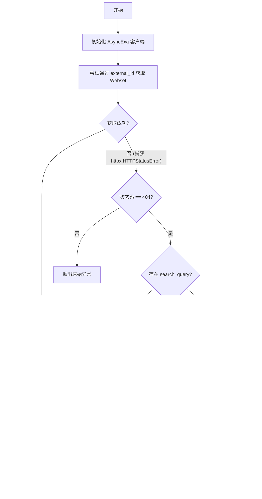

# `AutoGPT\autogpt_platform\backend\backend\blocks\exa\websets.py` 详细设计文档

This code defines a set of integration blocks and data models for interacting with the Exa API, enabling the creation, management, searching, enrichment, and monitoring of Websets (persistent web search collections) within a workflow system.

## 整体流程


## 类结构

```
Enums
├── SearchEntityType
├── SearchType
└── EnrichmentFormat
Data Models (Pydantic)
├── Webset
├── PreviewCriterionModel
├── PreviewEnrichmentModel
├── PreviewSearchModel
├── PreviewWebsetModel
├── SearchSummaryModel
├── EnrichmentSummaryModel
├── MonitorSummaryModel
└── WebsetStatisticsModel
Block Classes (Logic)
├── ExaCreateWebsetBlock
├── ExaCreateOrFindWebsetBlock
├── ExaUpdateWebsetBlock
├── ExaListWebsetsBlock
├── ExaGetWebsetBlock
├── ExaDeleteWebsetBlock
├── ExaCancelWebsetBlock
├── ExaPreviewWebsetBlock
├── ExaWebsetStatusBlock
├── ExaWebsetSummaryBlock
└── ExaWebsetReadyCheckBlock
```

## 全局变量及字段


### `SearchEntityType.COMPANY`
    
Represents the 'company' entity type for search.

类型：`str`
    


### `SearchEntityType.PERSON`
    
Represents the 'person' entity type for search.

类型：`str`
    


### `SearchEntityType.ARTICLE`
    
Represents the 'article' entity type for search.

类型：`str`
    


### `SearchEntityType.RESEARCH_PAPER`
    
Represents the 'research_paper' entity type for search.

类型：`str`
    


### `SearchEntityType.CUSTOM`
    
Represents the 'custom' entity type for search.

类型：`str`
    


### `SearchEntityType.AUTO`
    
Represents the 'auto' entity type for search, indicating automatic detection.

类型：`str`
    


### `SearchType.IMPORT`
    
Represents the 'import' source type for search or import operations.

类型：`str`
    


### `SearchType.WEBSET`
    
Represents the 'webset' source type for search or import operations.

类型：`str`
    


### `EnrichmentFormat.TEXT`
    
Represents the 'text' format for enrichment responses.

类型：`str`
    


### `EnrichmentFormat.DATE`
    
Represents the 'date' format for enrichment responses.

类型：`str`
    


### `EnrichmentFormat.NUMBER`
    
Represents the 'number' format for enrichment responses.

类型：`str`
    


### `EnrichmentFormat.OPTIONS`
    
Represents the 'options' format for enrichment responses.

类型：`str`
    


### `EnrichmentFormat.EMAIL`
    
Represents the 'email' format for enrichment responses.

类型：`str`
    


### `EnrichmentFormat.PHONE`
    
Represents the 'phone' format for enrichment responses.

类型：`str`
    


### `Webset.id`
    
The unique identifier for the webset.

类型：`str`
    


### `Webset.status`
    
The status of the webset.

类型：`WebsetStatus | None`
    


### `Webset.external_id`
    
The external identifier for the webset.

类型：`Optional[str]`
    


### `Webset.searches`
    
The searches that have been performed on the webset.

类型：`List[dict[str, Any]] | None`
    


### `Webset.enrichments`
    
The Enrichments to apply to the Webset Items.

类型：`List[dict[str, Any]] | None`
    


### `Webset.monitors`
    
The Monitors for the Webset.

类型：`List[dict[str, Any]] | None`
    


### `Webset.metadata`
    
Set of key-value pairs you want to associate with this object.

类型：`Optional[Dict[str, Any]]`
    


### `Webset.created_at`
    
The date and time the webset was created.

类型：`datetime | None`
    


### `Webset.updated_at`
    
The date and time the webset was last updated.

类型：`datetime | None`
    


### `PreviewCriterionModel.description`
    
The description of the criterion.

类型：`str`
    


### `PreviewEnrichmentModel.description`
    
The description of the enrichment.

类型：`str`
    


### `PreviewEnrichmentModel.format`
    
The format of the enrichment response.

类型：`str`
    


### `PreviewEnrichmentModel.options`
    
List of option labels for the enrichment.

类型：`List[str]`
    


### `PreviewSearchModel.entity_type`
    
The type of entity for the search.

类型：`str`
    


### `PreviewSearchModel.entity_description`
    
The description of the entity type.

类型：`Optional[str]`
    


### `PreviewSearchModel.criteria`
    
List of criteria for the search.

类型：`List[PreviewCriterionModel]`
    


### `PreviewWebsetModel.search`
    
The search details for the preview.

类型：`PreviewSearchModel`
    


### `PreviewWebsetModel.enrichments`
    
List of enrichments for the preview.

类型：`List[PreviewEnrichmentModel]`
    


### `SearchSummaryModel.total_searches`
    
Total number of searches in the webset.

类型：`int`
    


### `SearchSummaryModel.completed_searches`
    
Number of completed searches in the webset.

类型：`int`
    


### `SearchSummaryModel.total_items_found`
    
Total number of items found across all searches.

类型：`int`
    


### `SearchSummaryModel.queries`
    
List of search queries.

类型：`List[str]`
    


### `EnrichmentSummaryModel.total_enrichments`
    
Total number of enrichments in the webset.

类型：`int`
    


### `EnrichmentSummaryModel.completed_enrichments`
    
Number of completed enrichments in the webset.

类型：`int`
    


### `EnrichmentSummaryModel.enrichment_types`
    
List of enrichment types.

类型：`List[str]`
    


### `EnrichmentSummaryModel.titles`
    
List of enrichment titles or descriptions.

类型：`List[str]`
    


### `MonitorSummaryModel.total_monitors`
    
Total number of monitors in the webset.

类型：`int`
    


### `MonitorSummaryModel.active_monitors`
    
Number of active monitors in the webset.

类型：`int`
    


### `MonitorSummaryModel.next_run`
    
Next scheduled run time for monitors.

类型：`Optional[datetime]`
    


### `WebsetStatisticsModel.total_operations`
    
Total number of operations (searches + enrichments).

类型：`int`
    


### `WebsetStatisticsModel.is_processing`
    
Whether the webset is currently processing any operations.

类型：`bool`
    


### `WebsetStatisticsModel.has_monitors`
    
Whether the webset has any monitors configured.

类型：`bool`
    


### `WebsetStatisticsModel.avg_items_per_search`
    
Average number of items found per search.

类型：`float`
    
    

## 全局函数及方法


### `PreviewCriterionModel.from_sdk`

这是一个类方法，用于将外部 SDK 中的标准对象（`sdk_criterion`）转换为内部的 `PreviewCriterionModel` 实例，以确保接口稳定性和数据解耦。

参数：

-   `sdk_criterion`：`Any`（源自 SDK 的对象），来自 Exa SDK 的标准对象，包含描述信息。

返回值：`PreviewCriterionModel`，转换后的内部预览标准模型实例。

#### 流程图


#### 带注释源码

```python
    @classmethod
    def from_sdk(cls, sdk_criterion) -> "PreviewCriterionModel":
        """Convert SDK criterion to our model."""
        # 从 SDK 对象中提取 'description' 字段
        # 并调用当前类 (cls) 的构造函数创建一个新的 PreviewCriterionModel 实例
        return cls(description=sdk_criterion.description)
```


### `PreviewEnrichmentModel.from_sdk`

该方法是 `PreviewEnrichmentModel` 的类方法，用于将来自 Exa SDK 的 enrichment 对象转换为内部稳定的 Pydantic 模型实例。它负责安全地提取枚举类型的格式字段，并将嵌套的 options 对象列表转换为简单的字符串标签列表，以实现响应的稳定性。

参数：

-  `sdk_enrichment`：`Any`，源自 Exa SDK 的原始 enrichment 对象，包含 enrichment 的描述、格式和选项信息。

返回值：`PreviewEnrichmentModel`，转换后的内部模型实例，包含解析后的描述、格式字符串及选项列表。

#### 流程图

```mermaid
graph TD
    A[开始: 接收 sdk_enrichment 对象] --> B{检查 sdk_enrichment.format 是否含有 value 属性}
    B -- 是 --> C[format_str = sdk_enrichment.format.value]
    B -- 否 --> D[format_str = str(sdk_enrichment.format)]
    C --> E[初始化 options_list = []]
    D --> E
    E --> F{sdk_enrichment.options 是否存在}
    F -- 否 --> H[返回 PreviewEnrichmentModel 实例]
    F -- 是 --> G[遍历 options 列表中的 opt]
    G --> I[opt_dict = opt.model_dump]
    I --> J[将 opt_dict 中的 label 追加至 options_list]
    J --> G
    G --> H
```

#### 带注释源码

```python
    @classmethod
    def from_sdk(cls, sdk_enrichment) -> "PreviewEnrichmentModel":
        """Convert SDK enrichment to our model."""
        # 尝试从枚举类型中获取值，如果没有则直接转为字符串，确保格式统一
        format_str = (
            sdk_enrichment.format.value
            if hasattr(sdk_enrichment.format, "value")
            else str(sdk_enrichment.format)
        )

        # 初始化选项列表
        options_list = []
        # 如果存在选项，遍历并提取
        if sdk_enrichment.options:
            for opt in sdk_enrichment.options:
                # 将 SDK 对象序列化为字典
                opt_dict = opt.model_dump(by_alias=True)
                # 获取 'label' 字段，若不存在则默认为空字符串
                options_list.append(opt_dict.get("label", ""))

        # 返回当前类的实例，填充解析后的数据
        return cls(
            description=sdk_enrichment.description,
            format=format_str,
            options=options_list,
        )
```


### `PreviewSearchModel.from_sdk`

将 SDK 搜索预览对象转换为稳定的内部 `PreviewSearchModel` 实例，用于规范化实体类型和搜索标准数据。

参数：

-   `sdk_search`：`Any`，来自 Exa SDK 的搜索预览对象，包含实体详情（entity）和搜索标准列表（criteria）。

返回值：`PreviewSearchModel`，转换后的稳定搜索预览模型实例，包含提取的实体类型、描述以及转换后的标准列表。

#### 流程图


#### 带注释源码

```python
    @classmethod
    def from_sdk(cls, sdk_search) -> "PreviewSearchModel":
        """Convert SDK search preview to our model."""
        # Extract entity type from union
        # 将 SDK 的 entity 对象序列化为字典，以便统一处理不同类型的实体
        entity_dict = sdk_search.entity.model_dump(by_alias=True)
        
        # 从字典中提取 'type' 字段，如果不存在则默认为 'auto'
        entity_type = entity_dict.get("type", "auto")
        
        # 尝试从字典中提取 'description' 字段，主要用于自定义实体类型的描述
        entity_description = entity_dict.get("description")

        # Convert criteria
        # 遍历 SDK 对象中的 criteria 列表，使用 PreviewCriterionModel.from_sdk 方法进行逐项转换
        # 如果 sdk_search.criteria 为 None 或空，则使用空列表作为默认值
        criteria = [
            PreviewCriterionModel.from_sdk(c) for c in sdk_search.criteria or []
        ]

        # 使用提取和转换后的数据构造并返回当前的 PreviewSearchModel 实例
        return cls(
            entity_type=entity_type,
            entity_description=entity_description,
            criteria=criteria,
        )
```


### `PreviewWebsetModel.from_sdk`

将 SDK 的 `PreviewWebsetResponse` 对象转换为本地稳定的 `PreviewWebsetModel`，以确保响应结构的稳定性。

参数：

-  `cls`：`type[PreviewWebsetModel]`，类方法的隐式类引用。
-  `sdk_preview`：`Any`，来自 SDK 的预览 Webset 响应对象。

返回值：`PreviewWebsetModel`，转换后的本地稳定模型实例。

#### 流程图


#### 带注释源码

```python
    @classmethod
    def from_sdk(cls, sdk_preview) -> "PreviewWebsetModel":
        """Convert SDK PreviewWebsetResponse to our model."""

        # 调用 PreviewSearchModel 的 from_sdk 方法转换 search 部分
        search = PreviewSearchModel.from_sdk(sdk_preview.search)
        
        # 调用 PreviewEnrichmentModel 的 from_sdk 方法转换 enrichments 列表
        # 如果 sdk_preview.enrichments 为 None，则使用空列表避免报错
        enrichments = [
            PreviewEnrichmentModel.from_sdk(e) for e in sdk_preview.enrichments or []
        ]

        # 使用转换后的 search 和 enrichments 实例化并返回当前模型
        return cls(search=search, enrichments=enrichments)
```


### `ExaCreateWebsetBlock.__init__`

该方法是 `ExaCreateWebsetBlock` 类的构造函数，负责初始化创建 Exa Webset 的功能块。它通过调用父类 `Block` 的构造函数，配置块的唯一标识符、描述、分类以及输入输出模式，从而定义该块在整个系统中的接口和行为规范。

参数：

- `self`：`ExaCreateWebsetBlock`，指代正在初始化的类实例本身。

返回值：`None`，构造函数不返回任何值，仅完成实例的初始化配置。

#### 流程图

```mermaid
flowchart TD
    A[Start __init__] --> B[Call super().__init__]
    B --> C[Set Block ID: '0cda29ff...']
    B --> D[Set Description: Create new Exa Webset...]
    B --> E[Set Categories: SEARCH]
    B --> F[Set Input Schema: ExaCreateWebsetBlock.Input]
    B --> G[Set Output Schema: ExaCreateWebsetBlock.Output]
    C & D & E & F & G --> H[Parent Initialization Complete]
    H --> I[End]
```

#### 带注释源码

```python
    def __init__(self):
        # 调用父类 Block 的构造函数以注册块的基本元数据和结构
        super().__init__(
            # 块的唯一标识符 (UUID)
            id="0cda29ff-c549-4a19-8805-c982b7d4ec34",
            # 块的功能描述，用于说明其用途
            description="Create a new Exa Webset for persistent web search collections with optional waiting for initial results",
            # 定义块所属的功能分类，此处为 SEARCH (搜索)
            categories={BlockCategory.SEARCH},
            # 定义输入数据的 Schema，绑定到内部类 Input
            input_schema=ExaCreateWebsetBlock.Input,
            # 定义输出数据的 Schema，绑定到内部类 Output
            output_schema=ExaCreateWebsetBlock.Output,
        )
```


### `ExaCreateWebsetBlock.run`

该方法负责根据输入的配置参数创建一个新的 Exa Webset。它处理了搜索、导入、富集等多种参数的构建与转换，并支持在创建后轮询等待初始搜索结果完成。

参数：

-  `input_data`：`ExaCreateWebsetBlock.Input`，包含 Webset 创建所需的所有输入数据，如搜索查询、实体类型、搜索条件、排除源、范围源、导入源、富集配置、元数据及轮询设置等。
-  `credentials`：`APIKeyCredentials`，用于初始化 Exa SDK 客户端的 API 密钥凭证。
-  `**kwargs`：`dict`，其他可选的关键字参数。

返回值：`BlockOutput`，一个异步生成器，按顺序产出创建的 Webset 对象；如果配置了等待初始结果，还会产出初始条目数量和完成耗时。

#### 流程图


#### 带注释源码

```python
    async def run(
        self, input_data: Input, *, credentials: APIKeyCredentials, **kwargs
    ) -> BlockOutput:

        # 1. 初始化 Exa SDK 客户端
        exa = Exa(credentials.api_key.get_secret_value())

        # 2. 处理搜索实体类型，将枚举映射为具体的 SDK 对象
        entity = None
        if input_data.search_entity_type == SearchEntityType.COMPANY:
            entity = WebsetCompanyEntity(type="company")
        elif input_data.search_entity_type == SearchEntityType.PERSON:
            entity = WebsetPersonEntity(type="person")
        elif input_data.search_entity_type == SearchEntityType.ARTICLE:
            entity = WebsetArticleEntity(type="article")
        elif input_data.search_entity_type == SearchEntityType.RESEARCH_PAPER:
            entity = WebsetResearchPaperEntity(type="research_paper")
        elif (
            input_data.search_entity_type == SearchEntityType.CUSTOM
            and input_data.search_entity_description
        ):
            entity = WebsetCustomEntity(
                type="custom", description=input_data.search_entity_description
            )

        # 3. 构建搜索标准列表
        criteria = None
        if input_data.search_criteria:
            criteria = [
                CreateCriterionParameters(description=item)
                for item in input_data.search_criteria
            ]

        # 4. 构建排除项列表
        exclude_items = None
        if input_data.search_exclude_sources:
            exclude_items = []
            for idx, src_id in enumerate(input_data.search_exclude_sources):
                src_type = None
                if input_data.search_exclude_types and idx < len(
                    input_data.search_exclude_types
                ):
                    src_type = input_data.search_exclude_types[idx]
                # 默认为 IMPORT 类型
                if src_type == SearchType.WEBSET:
                    source_enum = ImportSource.webset
                else:
                    source_enum = ImportSource.import_
                exclude_items.append(ExcludeItem(source=source_enum, id=src_id))

        # 5. 构建范围项列表，包含关系定义
        scope_items = None
        if input_data.search_scope_sources:
            scope_items = []
            for idx, src_id in enumerate(input_data.search_scope_sources):
                src_type = None
                if input_data.search_scope_types and idx < len(
                    input_data.search_scope_types
                ):
                    src_type = input_data.search_scope_types[idx]
                relationship = None
                if input_data.search_scope_relationships and idx < len(
                    input_data.search_scope_relationships
                ):
                    rel_def = input_data.search_scope_relationships[idx]
                    lim = None
                    if input_data.search_scope_relationship_limits and idx < len(
                        input_data.search_scope_relationship_limits
                    ):
                        lim = input_data.search_scope_relationship_limits[idx]
                    relationship = ScopeRelationship(definition=rel_def, limit=lim)
                if src_type == SearchType.WEBSET:
                    src_enum = ScopeSourceType.webset
                else:
                    src_enum = ScopeSourceType.import_
                scope_items.append(
                    ScopeItem(source=src_enum, id=src_id, relationship=relationship)
                )

        # 6. 聚合所有搜索参数
        search_params = None
        if input_data.search_query:
            search_params = CreateWebsetParametersSearch(
                query=input_data.search_query,
                count=input_data.search_count,
                entity=entity,
                criteria=criteria,
                exclude=exclude_items,
                scope=scope_items,
            )

        # 7. 构建导入参数
        imports_params = None
        if input_data.import_sources:
            imports_params = []
            for idx, src_id in enumerate(input_data.import_sources):
                src_type = None
                if input_data.import_types and idx < len(input_data.import_types):
                    src_type = input_data.import_types[idx]
                if src_type == SearchType.WEBSET:
                    source_enum = ImportSource.webset
                else:
                    source_enum = ImportSource.import_
                imports_params.append(ImportItem(source=source_enum, id=src_id))

        # 8. 构建富集参数，包含格式、选项和元数据
        enrichments_params = None
        if input_data.enrichment_descriptions:
            enrichments_params = []
            for idx, desc in enumerate(input_data.enrichment_descriptions):
                fmt = None
                if input_data.enrichment_formats and idx < len(
                    input_data.enrichment_formats
                ):
                    fmt_enum = input_data.enrichment_formats[idx]
                    if fmt_enum is not None:
                        fmt = Format(
                            fmt_enum.value if isinstance(fmt_enum, Enum) else fmt_enum
                        )
                options_list = None
                if input_data.enrichment_options and idx < len(
                    input_data.enrichment_options
                ):
                    raw_opts = input_data.enrichment_options[idx]
                    if raw_opts:
                        options_list = [Option(label=o) for o in raw_opts]
                metadata_obj = None
                if input_data.enrichment_metadata and idx < len(
                    input_data.enrichment_metadata
                ):
                    metadata_obj = input_data.enrichment_metadata[idx]
                enrichments_params.append(
                    CreateEnrichmentParameters(
                        description=desc,
                        format=fmt,
                        options=options_list,
                        metadata=metadata_obj,
                    )
                )

        try:
            start_time = time.time()
            # 9. 调用 Exa API 创建 Webset
            webset = exa.websets.create(
                params=CreateWebsetParameters(
                    search=search_params,
                    imports=imports_params,
                    enrichments=enrichments_params,
                    external_id=input_data.external_id,
                    metadata=input_data.metadata,
                )
            )

            # 10. 将 SDK 返回的对象转换为本地 Pydantic 模型
            webset_result = Webset.model_validate(webset.model_dump(by_alias=True))

            # 11. 处理轮询逻辑：如果需要等待初始结果
            if input_data.wait_for_initial_results and search_params:
                final_webset = exa.websets.wait_until_idle(
                    id=webset_result.id,
                    timeout=input_data.polling_timeout,
                    poll_interval=5,
                )
                completion_time = time.time() - start_time

                # 计算找到的条目总数
                item_count = 0
                if final_webset.searches:
                    for search in final_webset.searches:
                        if search.progress:
                            item_count += search.progress.found

                yield "webset", webset_result
                yield "initial_item_count", item_count
                yield "completion_time", completion_time
            else:
                # 不需要等待，直接返回结果
                yield "webset", webset_result

        except ValueError as e:
            raise ValueError(f"Invalid webset configuration: {e}") from e
```


### `ExaCreateOrFindWebsetBlock.__init__`

初始化 `ExaCreateOrFindWebsetBlock` 类实例，设置其唯一标识符、描述、功能分类以及输入输出 Schema，用于创建或查找 Webset。

参数：

- `self`：`ExaCreateOrFindWebsetBlock`，表示类实例自身。

返回值：`None`，该方法不返回值，主要用于初始化实例配置。

#### 流程图


#### 带注释源码

```python
    def __init__(self):
        # 调用父类 Block 的初始化方法，注册该 Block 的元数据
        super().__init__(
            # 定义该 Block 的唯一 ID
            id="214542b6-3603-4bea-bc07-f51c2871cbd9",
            # 定义该 Block 的功能描述：通过 external_id 创建新的 webset 或返回已有的 webset（幂等操作）
            description="Create a new webset or return existing one by external_id (idempotent operation)",
            # 定义该 Block 所属的分类为 SEARCH（搜索）
            categories={BlockCategory.SEARCH},
            # 绑定该 Block 的输入数据结构 Schema 为内部定义的 Input 类
            input_schema=ExaCreateOrFindWebsetBlock.Input,
            # 绑定该 Block 的输出数据结构 Schema 为内部定义的 Output 类
            output_schema=ExaCreateOrFindWebsetBlock.Output,
        )
```


### `ExaCreateOrFindWebsetBlock.run`

该方法根据提供的 `external_id` 幂等地创建或查找 Exa Webset。如果找到对应的 Webset，则返回现有实例；如果未找到（返回 404），则使用提供的搜索参数和元数据创建一个新的 Webset。

参数：

-   `input_data`：`Input`，包含 Webset 的外部 ID (`external_id`)、可选的搜索查询 (`search_query`)、搜索数量 (`search_count`) 和元数据 (`metadata`) 的输入数据对象。
-   `credentials`：`APIKeyCredentials`，包含用于访问 Exa API 的 API 密钥的凭据对象。
-   `kwargs`：`**kwargs`，传递给方法的其他关键字参数（通常由框架上下文提供）。

返回值：`BlockOutput`，异步生成器，产生包含 Webset 对象和布尔值（指示是否为新创建）的键值对。

#### 流程图



#### 带注释源码

```python
    async def run(
        self, input_data: Input, *, credentials: APIKeyCredentials, **kwargs
    ) -> BlockOutput:
        import httpx

        # 1. 使用提供的 API Key 初始化异步 Exa 客户端
        aexa = AsyncExa(api_key=credentials.api_key.get_secret_value())

        try:
            # 2. 尝试通过 external_id 获取已存在的 Webset
            webset = await aexa.websets.get(id=input_data.external_id)
            
            # 3. 如果找到，将 SDK 返回的对象验证并转换为内部的 Pydantic Webset 模型
            webset_result = Webset.model_validate(webset.model_dump(by_alias=True))

            # 4. 输出找到的 Webset 和 was_created=False
            yield "webset", webset_result
            yield "was_created", False

        except httpx.HTTPStatusError as e:
            # 5. 处理 HTTP 错误
            if e.response.status_code == 404:
                # 5a. 如果是 404 错误（未找到），则创建新的 Webset
                
                # 检查是否提供了搜索查询，若有则构建搜索参数
                search_params = None
                if input_data.search_query:
                    search_params = CreateWebsetParametersSearch(
                        query=input_data.search_query,
                        count=input_data.search_count,
                    )

                # 调用 API 创建新的 Webset，关联 external_id 和元数据
                webset = await aexa.websets.create(
                    params=CreateWebsetParameters(
                        search=search_params,
                        external_id=input_data.external_id,
                        metadata=input_data.metadata,
                    )
                )

                # 验证并转换新创建的 Webset 对象
                webset_result = Webset.model_validate(webset.model_dump(by_alias=True))

                # 输出新创建的 Webset 和 was_created=True
                yield "webset", webset_result
                yield "was_created", True
            else:
                # 5b. 如果是其他 HTTP 错误（如 500, 403 等），直接向上抛出异常
                raise
```


### `ExaUpdateWebsetBlock.__init__`

初始化 ExaUpdateWebsetBlock 实例，配置其唯一标识符、描述、分类以及输入输出模式。

参数：

- `self`：`ExaUpdateWebsetBlock`，类的实例本身

返回值：`None`，构造函数不返回任何值

#### 流程图

```mermaid
graph TD
    A[Start: __init__] --> B[Call super().__init__]
    B --> C[Set ID: 89ccd99a-3c2b-4fbf-9e25-0ffa398d0314]
    C --> D[Set Description: Update metadata for an existing Webset]
    D --> E[Set Categories: BlockCategory.SEARCH]
    E --> F[Set Input Schema: ExaUpdateWebsetBlock.Input]
    F --> G[Set Output Schema: ExaUpdateWebsetBlock.Output]
    G --> H[End]
```

#### 带注释源码

```python
def __init__(self):
    # 调用父类 Block 的初始化方法，设置基础配置
    super().__init__(
        # 定义该 Block 的唯一 ID
        id="89ccd99a-3c2b-4fbf-9e25-0ffa398d0314",
        # 设置该 Block 的功能描述
        description="Update metadata for an existing Webset",
        # 将该 Block 归类为 SEARCH 类别
        categories={BlockCategory.SEARCH},
        # 定义输入数据的 Schema 为内部类 Input
        input_schema=ExaUpdateWebsetBlock.Input,
        # 定义输出数据的 Schema 为内部类 Output
        output_schema=ExaUpdateWebsetBlock.Output,
    )
```


### `ExaUpdateWebsetBlock.run`

该方法负责异步更新指定 Exa Webset 的元数据。它初始化 Exa 异步客户端，根据输入数据构建更新载荷，调用 SDK 的更新接口，并将更新后的 Webset 详细信息（如 ID、状态、外部 ID、元数据和更新时间）通过生成器返回。

参数：

- `input_data`：`ExaUpdateWebsetBlock.Input`，包含 Webset ID 以及待更新的元数据的输入数据对象。
- `credentials`：`APIKeyCredentials`，包含用于身份验证的 API 密钥的凭证对象。
- `**kwargs`：`Any`，其他可选的关键字参数。

返回值：`BlockOutput`，一个异步生成器，用于产生更新后的 Webset 详细字段。

#### 流程图


#### 带注释源码

```python
    async def run(
        self, input_data: Input, *, credentials: APIKeyCredentials, **kwargs
    ) -> BlockOutput:
        # 使用传入的凭证初始化 Exa 异步客户端
        aexa = AsyncExa(api_key=credentials.api_key.get_secret_value())

        # 准备请求载荷
        payload = {}
        # 如果输入数据中提供了元数据，则将其加入载荷（即使为空也可以用于清空）
        if input_data.metadata is not None:
            payload["metadata"] = input_data.metadata

        # 调用 SDK 的 websets.update 方法，传入 webset_id 和构建好的 payload
        sdk_webset = await aexa.websets.update(id=input_data.webset_id, params=payload)

        # 处理状态枚举，确保返回的是字符串值
        status_str = (
            sdk_webset.status.value
            if hasattr(sdk_webset.status, "value")
            else str(sdk_webset.status)
        )

        # 依次输出更新后的 Webset 字段
        yield "webset_id", sdk_webset.id
        yield "status", status_str
        yield "external_id", sdk_webset.external_id
        # 如果 metadata 为 None，默认返回空字典，避免返回 None
        yield "metadata", sdk_webset.metadata or {}
        # 将更新时间格式化为 ISO 字符串，如果为空则返回空字符串
        yield "updated_at", (
            sdk_webset.updated_at.isoformat() if sdk_webset.updated_at else ""
        )
```


### `ExaListWebsetsBlock.__init__`

该方法是 `ExaListWebsetsBlock` 类的构造函数，负责初始化该 Block 的元数据，包括其唯一标识符、功能描述、所属分类以及输入输出 Schema 的定义。

参数：

- `self`：`ExaListWebsetsBlock`，类的实例对象本身。

返回值：`None`，构造函数不返回任何值。

#### 流程图

```mermaid
flowchart TD
    Start([开始]) --> InitSuper[调用父类 Block.__init__ 初始化]
    InitSuper --> SetParams[设置 Block 参数]
    SetParams --> SetId[设置 ID: '1dcd8fd6-c13f-4e6f-bd4c-654428fa4757']
    SetParams --> SetDesc[设置 Description: 'List all Websets with pagination support']
    SetParams --> SetCats[设置 Categories: {BlockCategory.SEARCH}]
    SetParams --> SetInput[设置 Input Schema: ExaListWebsetsBlock.Input]
    SetParams --> SetOutput[设置 Output Schema: ExaListWebsetsBlock.Output]
    SetId --> End([结束])
    SetDesc --> End
    SetCats --> End
    SetInput --> End
    SetOutput --> End
```

#### 带注释源码

```python
    def __init__(self):
        # 调用父类 Block 的初始化方法，配置 Block 的基本元数据
        super().__init__(
            # 定义该 Block 的唯一标识符
            id="1dcd8fd6-c13f-4e6f-bd4c-654428fa4757",
            # 定义该 Block 的功能描述，用于 UI 或文档展示
            description="List all Websets with pagination support",
            # 定义该 Block 所属的分类，这里归类为搜索类
            categories={BlockCategory.SEARCH},
            # 绑定输入 Schema 类，定义输入参数结构
            input_schema=ExaListWebsetsBlock.Input,
            # 绑定输出 Schema 类，定义输出数据结构
            output_schema=ExaListWebsetsBlock.Output,
        )
```


### `ExaListWebsetsBlock.run`

该方法负责使用提供的 API 密码凭证异步列出 Exa Webset 集合。它支持分页功能，允许用户指定游标和返回数量限制，并将从 SDK 获取的 Webset 对象模型转换为字典格式，最后返回 Webset 列表、是否有更多结果的标志以及下一页的游标。

参数：

-   `input_data`：`ExaListWebsetsBlock.Input`，包含运行所需的输入数据，包括分页游标、返回数量限制以及触发器。
-   `credentials`：`APIKeyCredentials`，用于访问 Exa API 的认证凭据对象。
-   `**kwargs`：`Any`，额外的关键字参数。

返回值：`BlockOutput`，一个异步生成器，产生包含 Webset 列表、分页状态和下一页游标的键值对。

#### 流程图


#### 带注释源码

```python
    async def run(
        self, input_data: Input, *, credentials: APIKeyCredentials, **kwargs
    ) -> BlockOutput:
        # 使用凭证中的 API 密钥初始化异步 Exa 客户端
        aexa = AsyncExa(api_key=credentials.api_key.get_secret_value())

        # 调用 Exa SDK 的 websets.list 接口，传入分页参数（游标和限制数量）
        response = await aexa.websets.list(
            cursor=input_data.cursor,
            limit=input_data.limit,
        )

        # 将响应中的 Webset 对象列表转换为字典列表，使用别名并排除 None 值
        websets_data = [
            w.model_dump(by_alias=True, exclude_none=True) for w in response.data
        ]

        # 输出 websets 列表
        yield "websets", websets_data
        # 输出是否还有更多结果的布尔值
        yield "has_more", response.has_more
        # 输出用于获取下一页的游标字符串
        yield "next_cursor", response.next_cursor
```


### `ExaGetWebsetBlock.__init__`

该方法为 `ExaGetWebsetBlock` 类的构造函数，用于初始化块的基本元数据，包括其唯一 ID、功能描述、所属分类以及输入输出模式定义。

参数：

返回值：`None`，该方法无返回值。

#### 流程图


#### 带注释源码

```python
def __init__(self):
    # 调用父类 Block 的初始化方法，配置当前块的元数据和结构
    super().__init__(
        id="6ab8e12a-132c-41bf-b5f3-d662620fa832",  # 定义该块的唯一标识符
        description="Retrieve a Webset by ID or external ID",  # 该块的功能描述
        categories={BlockCategory.SEARCH},  # 将该块归类为 SEARCH 类别
        input_schema=ExaGetWebsetBlock.Input,  # 定义输入数据的结构模式
        output_schema=ExaGetWebsetBlock.Output,  # 定义输出数据的结构模式
    )
```


### `ExaGetWebsetBlock.run`

该方法用于通过 ID 或外部 ID 检索 Exa Webset 的详细信息。它初始化 Exa 异步客户端，调用 API 获取数据，处理响应对象的状态和列表数据（如搜索、丰富化、监视器）的序列化，并将格式化后的结果逐个输出。

参数：

- `input_data`：`ExaGetWebsetBlock.Input`，包含执行该块所需的输入数据，具体包括 `credentials`（认证信息）和 `webset_id`（要检索的 Webset 的 ID 或外部 ID）。
- `credentials`：`APIKeyCredentials`，包含用于与 Exa API 进行身份验证的 API 密钥。
- `**kwargs`：`Any`，其他上下文关键字参数。

返回值：`BlockOutput`，一个生成器，逐个产出包含 Webset 详细信息的键值对。

#### 流程图


#### 带注释源码

```python
async def run(
    self, input_data: Input, *, credentials: APIKeyCredentials, **kwargs
) -> BlockOutput:
    # 使用提供的 API 密钥初始化异步 Exa 客户端
    aexa = AsyncExa(api_key=credentials.api_key.get_secret_value())

    # 调用 Exa API 根据 webset_id 获取 Webset 对象
    sdk_webset = await aexa.websets.get(id=input_data.webset_id)

    # 提取状态信息，处理 Enum 类型转字符串的情况
    status_str = (
        sdk_webset.status.value
        if hasattr(sdk_webset.status, "value")
        else str(sdk_webset.status)
    )

    # 将 searches 列表转换为字典列表，排除 None 值并使用别名
    searches_data = [
        s.model_dump(by_alias=True, exclude_none=True)
        for s in sdk_webset.searches or []
    ]
    
    # 将 enrichments 列表转换为字典列表，排除 None 值并使用别名
    enrichments_data = [
        e.model_dump(by_alias=True, exclude_none=True)
        for e in sdk_webset.enrichments or []
    ]
    
    # 将 monitors 列表转换为字典列表，排除 None 值并使用别名
    monitors_data = [
        m.model_dump(by_alias=True, exclude_none=True)
        for m in sdk_webset.monitors or []
    ]

    # 产出 Webset 的 ID
    yield "webset_id", sdk_webset.id
    
    # 产出处理后的状态字符串
    yield "status", status_str
    
    # 产出外部 ID
    yield "external_id", sdk_webset.external_id
    
    # 产出搜索数据列表
    yield "searches", searches_data
    
    # 产出丰富化数据列表
    yield "enrichments", enrichments_data
    
    # 产出监视器数据列表
    yield "monitors", monitors_data
    
    # 产出元数据字典，如果为空则返回空字典
    yield "metadata", sdk_webset.metadata or {}
    
    # 产出创建时间，如果存在则格式化为 ISO 字符串
    yield "created_at", (
        sdk_webset.created_at.isoformat() if sdk_webset.created_at else ""
    )
    
    # 产出更新时间，如果存在则格式化为 ISO 字符串
    yield "updated_at", (
        sdk_webset.updated_at.isoformat() if sdk_webset.updated_at else ""
    )
```


### `ExaDeleteWebsetBlock.__init__`

该方法是 `ExaDeleteWebsetBlock` 类的构造函数，负责初始化该代码块的基本配置，包括其唯一标识符、描述、所属分类以及输入和输出的数据结构规范。

参数：

-  `self`：`ExaDeleteWebsetBlock`，表示 `ExaDeleteWebsetBlock` 类的实例。

返回值：`None`，构造函数不返回任何值。

#### 流程图

```mermaid
graph TD
    A[开始: ExaDeleteWebsetBlock.__init__] --> B[准备配置参数<br/>ID, 描述, 分类, 输入/输出 Schema]
    B --> C[调用父类 super().__init__<br/>注册 Block 配置]
    C --> D[结束]
```

#### 带注释源码

```python
def __init__(self):
    # 调用父类 Block 的初始化方法，配置 Block 的基本元数据
    super().__init__(
        # 设置该 Block 的唯一标识符 (UUID)
        id="aa6994a2-e986-421f-8d4c-7671d3be7b7e",
        # 设置该 Block 的功能描述文本
        description="Delete a Webset and all its items",
        # 指定该 Block 所属的分类为搜索类
        categories={BlockCategory.SEARCH},
        # 绑定该 Block 的输入数据结构定义
        input_schema=ExaDeleteWebsetBlock.Input,
        # 绑定该 Block 的输出数据结构定义
        output_schema=ExaDeleteWebsetBlock.Output,
    )
```


### `ExaDeleteWebsetBlock.run`

该方法是 `ExaDeleteWebsetBlock` 的核心执行逻辑，负责通过 Exa API 删除指定的 Webset 及其包含的所有数据，并返回删除操作的结果详情。

参数：

-   `input_data`：`ExaDeleteWebsetBlock.Input`，包含待删除的 Webset 标识符（`webset_id`）以及凭证元数据的输入对象。
-   `credentials`：`APIKeyCredentials`，用于 Exa API 身份验证的凭证对象，包含 API Key。
-   `**kwargs`：`dict`，额外的关键字参数，通常由框架传递。

返回值：`BlockOutput`，一个异步生成器，按顺序产生包含删除结果的键值对，包括 `webset_id`、`external_id`、`status` 和 `success`。

#### 流程图


#### 带注释源码

```python
async def run(
    self, input_data: Input, *, credentials: APIKeyCredentials, **kwargs
) -> BlockOutput:
    # 使用传入的凭证初始化异步 Exa SDK 客户端
    aexa = AsyncExa(api_key=credentials.api_key.get_secret_value())

    # 调用 Exa SDK 的 websets.delete 方法，传入要删除的 webset_id
    # 注意：该方法会删除 Webset 及其所有关联的项目
    deleted_webset = await aexa.websets.delete(id=input_data.webset_id)

    # 解析 status 字段
    # 兼容处理：如果 status 是 Enum 类型则取其 value，否则直接转为字符串
    status_str = (
        deleted_webset.status.value
        if hasattr(deleted_webset.status, "value")
        else str(deleted_webset.status)
    )

    # 按照定义的 Output Schema 依次 yield 结果
    yield "webset_id", deleted_webset.id          # 被删除的 Webset ID
    yield "external_id", deleted_webset.external_id # 被删除的 Webset 外部 ID
    yield "status", status_str                    # 删除后的状态
    yield "success", "true"                      # 操作成功标记
```


### `ExaCancelWebsetBlock.__init__`

初始化 `ExaCancelWebsetBlock` 类实例，用于在系统中注册该块，配置其唯一标识符、描述信息、分类标签以及输入输出的数据模型架构。

参数：

- `self`：`ExaCancelWebsetBlock`，表示类实例本身。

返回值：`None`，该方法为构造函数，无返回值。

#### 流程图


#### 带注释源码

```python
    def __init__(self):
        # 调用父类 Block 的初始化方法，配置块的元数据和架构
        super().__init__(
            # 指定该块的唯一标识符
            id="e40a6420-1db8-47bb-b00a-0e6aecd74176",
            # 描述该块的功能：取消正在 Webset 上执行的所有操作
            description="Cancel all operations being performed on a Webset",
            # 指定该块所属的分类为 SEARCH
            categories={BlockCategory.SEARCH},
            # 指定输入数据的 Schema 验证模型
            input_schema=ExaCancelWebsetBlock.Input,
            # 指定输出数据的 Schema 验证模型
            output_schema=ExaCancelWebsetBlock.Output,
        )
```


### `ExaCancelWebsetBlock.run`

该方法用于取消指定 Webset 上正在执行的所有操作。它通过调用 Exa API 来停止搜索、增强等后台任务，并返回取消后的 Webset 状态信息。

参数：

- `input_data`：`ExaCancelWebsetBlock.Input`，包含运行方法所需的输入数据，主要是 Webset 的 ID 或外部 ID。
- `credentials`：`APIKeyCredentials`，包含用于身份验证的 Exa API 密钥。
- `**kwargs`：`Any`，额外的关键字参数。

返回值：`BlockOutput`，一个异步生成器，逐步生成包含取消后 Webset 详细信息的键值对。

#### 流程图


#### 带注释源码

```python
    async def run(
        self, input_data: Input, *, credentials: APIKeyCredentials, **kwargs
    ) -> BlockOutput:
        # 使用提供的 API 密钥初始化异步 Exa 客户端
        aexa = AsyncExa(api_key=credentials.api_key.get_secret_value())

        # 调用 Exa SDK 的 cancel 方法，传入 Webset ID 以取消所有正在进行的操作
        canceled_webset = await aexa.websets.cancel(id=input_data.webset_id)

        # 安全地提取状态值，处理枚举类型或字符串类型
        status_str = (
            canceled_webset.status.value
            if hasattr(canceled_webset.status, "value")
            else str(canceled_webset.status)
        )

        # 生成并返回 Webset 的 ID
        yield "webset_id", canceled_webset.id
        # 生成并返回取消后的状态
        yield "status", status_str
        # 生成并返回外部 ID (如果有)
        yield "external_id", canceled_webset.external_id
        # 生成并返回操作成功的标识
        yield "success", "true"
```


### `ExaPreviewWebsetBlock.__init__`

该方法用于初始化 `ExaPreviewWebsetBlock` 类的实例，通过调用父类 `Block` 的构造函数，设置该块的唯一标识符、功能描述、所属分类以及输入输出的数据结构定义。

参数：

- `self`：`ExaPreviewWebsetBlock`，表示类的实例本身。

返回值：`None`，初始化方法通常不返回任何值。

#### 流程图

```mermaid
flowchart TD
    A[Start: __init__] --> B[Call super().__init__]
    B --> C[Pass Configuration Arguments]
    C --> D[id: 'f8c4e2a1-9b3d-4e5f-a6c7-d8e9f0a1b2c3']
    C --> E[description: 'Preview how a search query...']
    C --> F[categories: BlockCategory.SEARCH]
    C --> G[input_schema: ExaPreviewWebsetBlock.Input]
    C --> H[output_schema: ExaPreviewWebsetBlock.Output]
    D & E & F & G & H --> I[Initialization Complete]
    I --> J[End]
```

#### 带注释源码

```python
    def __init__(self):
        # 调用父类 Block 的初始化方法，配置块的基本元数据
        super().__init__(
            # 定义该 Block 的唯一标识符 (UUID)
            id="f8c4e2a1-9b3d-4e5f-a6c7-d8e9f0a1b2c3",
            # 描述该 Block 的功能：在创建 Webset 之前预览搜索查询的解析方式
            description="Preview how a search query will be interpreted before creating a webset. Helps understand entity detection, criteria generation, and available enrichments.",
            # 定义该 Block 所属的分类为 SEARCH
            categories={BlockCategory.SEARCH},
            # 绑定该 Block 的输入数据结构定义类
            input_schema=ExaPreviewWebsetBlock.Input,
            # 绑定该 Block 的输出数据结构定义类
            output_schema=ExaPreviewWebsetBlock.Output,
        )
```


### `ExaPreviewWebsetBlock.run`

该方法通过调用 Exa API 预览搜索查询的解释结果。它会分析输入的查询，检测实体类型，生成搜索条件和可用的数据增强字段，并提供可读的解释和建议。

参数：

- `input_data`：`ExaPreviewWebsetBlock.Input`，包含搜索查询、可选实体类型及自定义实体描述的输入数据对象。
- `credentials`：`APIKeyCredentials`，包含 Exa API 密钥的认证凭据对象。
- `**kwargs`：`Any`，执行框架传递的额外运行时参数。

返回值：`BlockOutput`，异步生成器，产生包含预览模型、实体详情、条件、增强字段、解释文本及建议的键值对。

#### 流程图

```mermaid
graph TD
    A[开始] --> B[初始化 AsyncExa 客户端]
    B --> C[构建基础 Payload 并传入 query]
    C --> D{是否指定了 entity_type?}
    D -- 是 --> E[构建 entity 字典]
    E --> F{类型是否为 CUSTOM 且有描述?}
    F -- 是 --> G[添加 description 到 entity]
    F -- 否 --> H[将 entity 添加到 Payload]
    G --> H
    D -- 否 --> H
    H --> I[调用 aexa.websets.preview 获取预览]
    I --> J[将 SDK 响应转换为 PreviewWebsetModel]
    J --> K[提取 entity, criteria, enrichments]
    K --> L[生成 interpretation 解释字符串]
    K --> M[生成 suggestions 建议列表]
    L --> N[生成并返回结果]
    M --> N
```

#### 带注释源码

```python
    async def run(
        self, input_data: Input, *, credentials: APIKeyCredentials, **kwargs
    ) -> BlockOutput:
        # 使用凭据初始化异步 Exa SDK 客户端
        aexa = AsyncExa(api_key=credentials.api_key.get_secret_value())

        # 构建传递给 API 的基础参数字典
        payload: dict[str, Any] = {
            "query": input_data.query,
        }

        # 如果输入中指定了实体类型，则构建 entity 对象
        if input_data.entity_type:
            entity: dict[str, Any] = {"type": input_data.entity_type.value}
            # 如果是自定义类型且提供了描述，则添加描述信息
            if (
                input_data.entity_type == SearchEntityType.CUSTOM
                and input_data.entity_description
            ):
                entity["description"] = input_data.entity_description
            payload["entity"] = entity

        # 调用 Exa SDK 的 preview 接口获取预览数据
        sdk_preview = await aexa.websets.preview(params=payload)

        # 将 SDK 返回的对象转换为内部定义的稳定模型 PreviewWebsetModel
        preview = PreviewWebsetModel.from_sdk(sdk_preview)

        # 从预览模型中提取具体的搜索和增强信息
        entity_type = preview.search.entity_type
        entity_description = preview.search.entity_description
        criteria = preview.search.criteria
        enrichments = preview.enrichments

        # 生成人类可读的解释字符串，描述查询将如何被处理
        interpretation = f"Query will search for {entity_type}"
        if entity_description:
            interpretation += f" ({entity_description})"
        if criteria:
            interpretation += f" with {len(criteria)} criteria"
        if enrichments:
            interpretation += f" and {len(enrichments)} available enrichment columns"

        # 生成优化建议列表
        suggestions = []
        if not criteria:
            suggestions.append(
                "Consider adding specific criteria to narrow your search"
            )
        if not enrichments:
            suggestions.append(
                "Consider specifying what data points you want to extract"
            )

        # 首先产生完整的预览模型
        yield "preview", preview

        # 然后产生各个独立的字段，以便在工作流图中灵活使用
        yield "entity_type", entity_type
        yield "entity_description", entity_description
        yield "criteria", criteria
        yield "enrichment_columns", enrichments
        yield "interpretation", interpretation
        yield "suggestions", suggestions
```


### `ExaWebsetStatusBlock.__init__`

该方法是 `ExaWebsetStatusBlock` 类的构造函数，用于初始化块的基本配置。它调用父类的初始化方法，注册块的唯一标识符、描述、分类类别以及输入输出数据的结构定义。

参数：

- `self`：`ExaWebsetStatusBlock`，类的实例本身

返回值：`None`，无返回值

#### 流程图

```mermaid
flowchart TD
    Start([开始]) --> CallSuper[调用父类 Block.__init__ 初始化]
    CallSuper --> SetID[设置块ID为 47cc3cd8-840f-4ec4-8d40-fcaba75fbe1a]
    SetID --> SetDesc[设置描述为 Get a quick status overview of a webset]
    SetDesc --> SetCat[设置分类为 SEARCH]
    SetCat --> SetInput[设置输入模式为 ExaWebsetStatusBlock.Input]
    SetInput --> SetOutput[设置输出模式为 ExaWebsetStatusBlock.Output]
    SetOutput --> End([结束])
```

#### 带注释源码

```python
def __init__(self):
    # 调用父类 Block 的初始化方法，配置块的元数据和架构
    super().__init__(
        id="47cc3cd8-840f-4ec4-8d40-fcaba75fbe1a",  # 块的唯一标识符
        description="Get a quick status overview of a webset",  # 块的功能描述
        categories={BlockCategory.SEARCH},  # 块所属的分类类别（搜索）
        input_schema=ExaWebsetStatusBlock.Input,  # 定义块的输入数据结构
        output_schema=ExaWebsetStatusBlock.Output,  # 定义块的输出数据结构
    )
```


### `ExaWebsetStatusBlock.run`

该方法用于获取指定 Exa Webset 的快速状态概览，包括其当前处理状态、搜索结果总数、以及配置的搜索、增强和监控器的数量，而无需获取完整的详细信息。

参数：

- `input_data`：`ExaWebsetStatusBlock.Input`，包含 Webset ID 等输入参数的数据对象。
- `credentials`：`APIKeyCredentials`，用于身份验证的 Exa API 密钥凭据。
- `**kwargs`：`dict`，扩展关键字参数。

返回值：`BlockOutput`，一个生成器，逐步产出 Webset 的状态字段（如 webset_id, status, item_count 等）。

#### 流程图

```mermaid
flowchart TD
    A[开始] --> B[使用 API Key 初始化 AsyncExa 客户端]
    B --> C[调用 aexa.websets.get 获取 Webset 详情]
    C --> D[提取 status 字符串值]
    D --> E{判断 status 是否为 running 或 pending}
    E -- 是 --> F[设置 is_processing 为 True]
    E -- 否 --> G[设置 is_processing 为 False]
    F --> H[遍历 searches 计算 item_count]
    G --> H[遍历 searches 计算 item_count]
    H --> I[统计 search_count, enrichment_count, monitor_count]
    I --> J[格式化 last_updated 时间戳]
    J --> K[Yield 所有状态结果]
    K --> L[结束]
```

#### 带注释源码

```python
    async def run(
        self, input_data: Input, *, credentials: APIKeyCredentials, **kwargs
    ) -> BlockOutput:
        # 使用提供的 API 密钥初始化异步 Exa 客户端
        aexa = AsyncExa(api_key=credentials.api_key.get_secret_value())

        # 根据 ID 获取 Webset 的完整详情
        webset = await aexa.websets.get(id=input_data.webset_id)

        # 提取状态值，处理枚举类型转换为字符串
        status = (
            webset.status.value
            if hasattr(webset.status, "value")
            else str(webset.status)
        )
        
        # 判断当前是否正在处理（运行中或等待中）
        is_processing = status in ["running", "pending"]

        # 通过遍历搜索进度来估算 Webset 中的项目总数
        item_count = 0
        if webset.searches:
            for search in webset.searches:
                if search.progress:
                    item_count += search.progress.found

        # 统计配置的搜索、增强和监控器的数量
        search_count = len(webset.searches or [])
        enrichment_count = len(webset.enrichments or [])
        monitor_count = len(webset.monitors or [])

        # 产出 Webset ID 和当前状态
        yield "webset_id", webset.id
        yield "status", status
        
        # 产出统计计数
        yield "item_count", item_count
        yield "search_count", search_count
        yield "enrichment_count", enrichment_count
        yield "monitor_count", monitor_count
        
        # 产出格式化后的最后更新时间
        yield "last_updated", webset.updated_at.isoformat() if webset.updated_at else ""
        
        # 产出处理状态布尔值
        yield "is_processing", is_processing
```


### `ExaWebsetSummaryBlock.__init__`

该方法用于初始化 `ExaWebsetSummaryBlock` 类实例，设置块的唯一标识符、功能描述、分类以及输入输出数据的模式定义。

参数：

-  `self`：`ExaWebsetSummaryBlock`，类的实例引用。

返回值：`None`，构造函数不返回任何值。

#### 流程图

```mermaid
flowchart TD
    A[Start: __init__] --> B[Call super().__init__]
    B --> C[Set Block ID: 9eff1710...]
    B --> D[Set Description: Get comprehensive summary...]
    B --> E[Set Categories: SEARCH]
    B --> F[Set Input Schema: ExaWebsetSummaryBlock.Input]
    B --> G[Set Output Schema: ExaWebsetSummaryBlock.Output]
    C & D & E & F & G --> H[End: Initialization Complete]
```

#### 带注释源码

```python
def __init__(self):
    # 调用父类 Block 的初始化方法
    super().__init__(
        # 定义该块在系统中的唯一 ID
        id="9eff1710-a49b-490e-b486-197bf8b23c61",
        # 描述该块的核心功能：获取包含样本和统计信息的 Webset 摘要
        description="Get a comprehensive summary of a webset with samples and statistics",
        # 定义该块所属的分类，这里归类为搜索类
        categories={BlockCategory.SEARCH},
        # 定义输入数据的模式结构，关联内部类 Input
        input_schema=ExaWebsetSummaryBlock.Input,
        # 定义输出数据的模式结构，关联内部类 Output
        output_schema=ExaWebsetSummaryBlock.Output,
    )
```


### `ExaWebsetSummaryBlock.run`

获取 Webset 的综合摘要，包括样本数据、搜索、增强和监控的统计信息，以及总体状态指标。

参数：

-  `input_data`：`ExaWebsetSummaryBlock.Input`，包含执行摘要操作所需的输入数据。
    -  `credentials`: `CredentialsMetaInput`，包含 Exa API 的凭证信息。
    -  `webset_id`: `str`，要获取摘要的 Webset ID 或外部 ID。
    -  `include_sample_items`: `bool`，是否在摘要中包含样本项目。
    -  `sample_size`: `int`，包含的样本项目数量（0-10）。
    -  `include_search_details`: `bool`，是否包含有关搜索的详细信息。
    -  `include_enrichment_details`: `bool`，是否包含有关增强的详细信息。
-  `credentials`：`APIKeyCredentials`，用于初始化 Exa 客户端的 API 密钥凭证。
-  `**kwargs`：`dict`，扩展的关键字参数。

返回值：`BlockOutput`，一个异步生成器，按顺序产生 Webset 的摘要信息字段，包括 ID、状态、实体类型、样本项目、各种摘要模型（搜索、增强、监控、统计）以及时间戳。

#### 流程图

```mermaid
flowchart TD
    Start([开始]) --> InitClient[初始化 AsyncExa 客户端]
    InitClient --> FetchWebset[调用 API 获取 Webset 详情]
    FetchWebset --> ExtractBase[提取基本信息: ID, Status]
    
    ExtractBase --> DetermineEntity[从搜索中确定 Entity Type]
    DetermineEntity --> CheckSamples{include_sample_items?}
    
    CheckSamples -- 是 --> FetchItems[调用 API 获取 Webset Items]
    FetchItems --> ProcessSamples[处理样本数据并获取 total_items]
    ProcessSamples --> CheckSearchDetails
    
    CheckSamples -- 否 --> SetEmptySamples[设置样本为空, total_items 为 0]
    SetEmptySamples --> CheckSearchDetails
    
    CheckSearchDetails{include_search_details?}
    CheckSearchDetails -- 是 --> BuildSearchSummary[统计搜索信息: 总数, 完成, 项目, 查询]
    BuildSearchSummary --> BuildSearchModel[构建 SearchSummaryModel]
    BuildSearchModel --> CheckEnrichDetails
    
    CheckSearchDetails -- 否 --> CheckEnrichDetails
    
    CheckEnrichDetails{include_enrichment_details?}
    CheckEnrichDetails -- 是 --> BuildEnrichSummary[统计增强信息: 总数, 完成, 类型, 标题]
    BuildEnrichSummary --> BuildEnrichModel[构建 EnrichmentSummaryModel]
    BuildEnrichModel --> BuildMonitor
    
    CheckEnrichDetails -- 否 --> BuildMonitor
    
    BuildMonitor --> ProcessMonitors[处理监控数据: 计算下次运行时间]
    ProcessMonitors --> BuildMonitorModel[构建 MonitorSummaryModel]
    BuildMonitorModel --> BuildStatistics
    
    BuildStatistics --> CalcStats[计算统计: 总操作, 处理状态, 平均项目数]
    CalcStats --> BuildStatsModel[构建 WebsetStatisticsModel]
    BuildStatsModel --> YieldOutput[产出所有摘要字段]
    
    YieldOutput --> End([结束])
```

#### 带注释源码

```python
    async def run(
        self, input_data: Input, *, credentials: APIKeyCredentials, **kwargs
    ) -> BlockOutput:
        # 使用提供的 API 密钥初始化异步 Exa 客户端
        aexa = AsyncExa(api_key=credentials.api_key.get_secret_value())

        # 根据 ID 获取 Webset 详细信息
        webset = await aexa.websets.get(id=input_data.webset_id)

        # 提取基本信息
        webset_id = webset.id
        # 处理 status 的枚举类型或字符串类型
        status = (
            webset.status.value
            if hasattr(webset.status, "value")
            else str(webset.status)
        )

        # 从搜索配置中确定实体类型
        entity_type = "unknown"
        searches = webset.searches or []
        if searches:
            first_search = searches[0]
            if first_search.entity:
                entity_dict = first_search.entity.model_dump(
                    by_alias=True, exclude_none=True
                )
                entity_type = entity_dict.get("type", "unknown")

        # 如果请求，获取样本项目
        sample_items_data = []
        total_items = 0

        if input_data.include_sample_items and input_data.sample_size > 0:
            # 调用 API 获取 Webset 中的项目列表，限制数量
            items_response = await aexa.websets.items.list(
                webset_id=input_data.webset_id, limit=input_data.sample_size
            )
            # 将 SDK 对象转换为字典以便输出
            sample_items_data = [
                item.model_dump(by_alias=True, exclude_none=True)
                for item in items_response.data
            ]
            total_items = len(sample_items_data)

        # 构建搜索摘要模型
        # 初始化默认值
        search_summary = SearchSummaryModel(
            total_searches=0,
            completed_searches=0,
            total_items_found=0,
            queries=[],
        )
        if input_data.include_search_details and searches:
            # 计算搜索统计：总数、已完成、找到的项目总数
            search_summary = SearchSummaryModel(
                total_searches=len(searches),
                completed_searches=sum(
                    1
                    for s in searches
                    if (s.status.value if hasattr(s.status, "value") else str(s.status))
                    == "completed"
                ),
                total_items_found=int(
                    sum(s.progress.found if s.progress else 0 for s in searches)
                ),
                queries=[s.query for s in searches[:3]],  # 提取前3个查询
            )

        # 构建增强摘要模型
        enrichment_summary = EnrichmentSummaryModel(
            total_enrichments=0,
            completed_enrichments=0,
            enrichment_types=[],
            titles=[],
        )
        enrichments = webset.enrichments or []
        if input_data.include_enrichment_details and enrichments:
            # 计算增强统计：总数、已完成、格式类型、标题
            enrichment_summary = EnrichmentSummaryModel(
                total_enrichments=len(enrichments),
                completed_enrichments=sum(
                    1
                    for e in enrichments
                    if (e.status.value if hasattr(e.status, "value") else str(e.status))
                    == "completed"
                ),
                enrichment_types=list(
                    set(
                        (
                            e.format.value
                            if e.format and hasattr(e.format, "value")
                            else str(e.format) if e.format else "text"
                        )
                        for e in enrichments
                    )
                ),
                titles=[(e.title or e.description or "")[:50] for e in enrichments[:3]],
            )

        # 构建监控摘要模型
        monitors = webset.monitors or []
        next_run_dt = None
        if monitors:
            # 找出最早的下次运行时间
            next_runs = [m.next_run_at for m in monitors if m.next_run_at]
            if next_runs:
                next_run_dt = min(next_runs)

        monitor_summary = MonitorSummaryModel(
            total_monitors=len(monitors),
            active_monitors=sum(
                1
                for m in monitors
                if (m.status.value if hasattr(m.status, "value") else str(m.status))
                == "enabled"
            ),
            next_run=next_run_dt,
        )

        # 构建统计摘要模型
        statistics = WebsetStatisticsModel(
            total_operations=len(searches) + len(enrichments),
            is_processing=status in ["running", "pending"],
            has_monitors=len(monitors) > 0,
            avg_items_per_search=(
                search_summary.total_items_found / len(searches) if searches else 0
            ),
        )

        # 产生输出结果
        yield "webset_id", webset_id
        yield "status", status
        yield "entity_type", entity_type
        yield "total_items", total_items
        yield "sample_items", sample_items_data
        yield "search_summary", search_summary
        yield "enrichment_summary", enrichment_summary
        yield "monitor_summary", monitor_summary
        yield "statistics", statistics
        yield "created_at", webset.created_at.isoformat() if webset.created_at else ""
        yield "updated_at", webset.updated_at.isoformat() if webset.updated_at else ""
```


### `ExaWebsetReadyCheckBlock.__init__`

初始化 `ExaWebsetReadyCheckBlock` 类实例，通过调用父类构造函数注册该块的唯一标识符、功能描述、所属分类以及输入输出模式定义。

参数：

- `self`：`ExaWebsetReadyCheckBlock`，表示类的实例本身。

返回值：`None`，构造函数不返回任何值。

#### 流程图

```mermaid
graph TD
    A[开始初始化] --> B[调用父类 Block.__init__]
    B --> C[设置 ID 为 faf9f0f3-e659-4264-b33b-284a02166bec]
    B --> D[设置功能描述]
    B --> E[设置分类为 SEARCH 和 LOGIC]
    B --> F[绑定输入模式 Input]
    B --> G[绑定输出模式 Output]
    C --> H[完成初始化]
    D --> H
    E --> H
    F --> H
    G --> H
```

#### 带注释源码

```python
    def __init__(self):
        # 调用父类 Block 的初始化方法，配置块的元数据和接口契约
        super().__init__(
            # 块的唯一标识符
            id="faf9f0f3-e659-4264-b33b-284a02166bec",
            # 块的文本描述，解释其用于检查 Webset 是否就绪并支持条件工作流分支
            description="Check if webset is ready for next operation - enables conditional workflow branching",
            # 块所属的类别集合，包含搜索类和逻辑类
            categories={BlockCategory.SEARCH, BlockCategory.LOGIC},
            # 指定该块的输入数据结构定义为内部类 Input
            input_schema=ExaWebsetReadyCheckBlock.Input,
            # 指定该块的输出数据结构定义为内部类 Output
            output_schema=ExaWebsetReadyCheckBlock.Output,
        )
```


### `ExaWebsetReadyCheckBlock.run`

该方法用于异步检查指定 Webset 是否准备好进行下一步操作。它通过获取 Webset 的详细状态和搜索结果数量，判断其是否处于空闲状态且满足最小项目数量要求，并根据当前状态提供后续操作的建议。

参数：

- `input_data`: `ExaWebsetReadyCheckBlock.Input`，输入数据对象，包含要检查的 Webset ID 以及所需的最小项目数量 (`min_items`)。
- `credentials`: `APIKeyCredentials`，包含用于访问 Exa API 的 API 密钥凭证。
- `**kwargs`: `Any`，其他关键字参数。

返回值：`BlockOutput`，一个生成器，逐步产生 Webset 的就绪状态 (`is_ready`)、当前状态 (`status`)、项目计数 (`item_count`)、配置检查标志及操作建议 (`recommendation`)。

#### 流程图

```mermaid
flowchart TD
    A([开始]) --> B[初始化 AsyncExa 客户端]
    B --> C[调用 API 获取 Webset 详情]
    C --> D[提取状态字符串 status]
    C --> E[遍历 searches 计算总 item_count]
    
    E --> F{status 是否为 'idle'?}
    D --> F
    
    F -- 是 --> G{item_count >= min_items?}
    F -- 否 --> H[is_ready = False]
    
    G -- 是 --> I[is_ready = True]
    G -- 否 --> H
    
    I --> J[检查 has_searches 和 has_enrichments]
    H --> J
    
    J --> K{生成 recommendation}
    
    K -- 无搜索 --> Rec1[needs_search]
    K -- 状态为 running/pending --> Rec2[waiting_for_results]
    K -- 项目不足 --> Rec3[insufficient_items]
    K -- 无增强 --> Rec4[ready_to_enrich]
    K -- 其他 --> Rec5[ready_to_process]
    
    Rec1 --> L[输出结果]
    Rec2 --> L
    Rec3 --> L
    Rec4 --> L
    Rec5 --> L
    
    L --> M([结束])
```

#### 带注释源码

```python
    async def run(
        self, input_data: Input, *, credentials: APIKeyCredentials, **kwargs
    ) -> BlockOutput:
        # 使用提供的 API Key 初始化异步 Exa 客户端
        aexa = AsyncExa(api_key=credentials.api_key.get_secret_value())

        # 获取指定 Webset 的详细信息
        webset = await aexa.websets.get(id=input_data.webset_id)

        # 提取 Webset 的状态，处理 Enum 类型转换为字符串
        status = (
            webset.status.value
            if hasattr(webset.status, "value")
            else str(webset.status)
        )

        # 通过遍历搜索进度来估算找到的项目总数
        item_count = 0
        if webset.searches:
            for search in webset.searches:
                if search.progress:
                    item_count += search.progress.found

        # 判断就绪条件：状态必须是 "idle" 且项目数必须达到最小值
        is_idle = status == "idle"
        has_min_items = item_count >= input_data.min_items
        is_ready = is_idle and has_min_items

        # 检查 Webset 中是否配置了搜索和增强
        has_searches = len(webset.searches or []) > 0
        has_enrichments = len(webset.enrichments or []) > 0

        # 根据当前状态生成推荐的操作建议
        recommendation = ""
        if not has_searches:
            recommendation = "needs_search"
        elif status in ["running", "pending"]:
            recommendation = "waiting_for_results"
        elif not has_min_items:
            recommendation = "insufficient_items"
        elif not has_enrichments:
            recommendation = "ready_to_enrich"
        else:
            recommendation = "ready_to_process"

        # 输出结果数据
        yield "is_ready", is_ready
        yield "status", status
        yield "item_count", item_count
        yield "has_searches", has_searches
        yield "has_enrichments", has_enrichments
        yield "recommendation", recommendation
```


## 关键组件


### Webset Creation and Configuration
负责将扁平化的输入参数转换为 SDK 所需的复杂对象结构，处理实体类型、搜索条件、作用域、导入源及数据增强配置，并支持初始结果的轮询等待。

### Idempotent Webset Access
实现基于外部 ID（external_id）的幂等操作逻辑，在资源存在时直接获取，不存在时则创建新资源，确保工作流的确定性和重复执行的安全性。

### Webset Lifecycle Management
管理 Webset 的生命周期状态，包括更新元数据、取消正在运行的操作以及删除 Webset 及其关联的所有数据。

### Search Query Preview
提供搜索查询的预览和解释功能，在创建 Webset 之前利用 API 预判实体类型、生成搜索条件建议并展示可用的数据增强列。

### Status Monitoring and Readiness
监控 Webset 的处理状态，通过轮询机制等待搜索完成，并提供基于状态和项目数量的条件检查，以判断工作流是否可以进行下一步操作。

### Data Retrieval and Summarization
处理 Webset 数据的检索，支持分页列表查询、获取详细信息、生成包含样本项目和统计数据的综合摘要，以及快速状态概览。


## 问题及建议


### 已知问题

-   **异步上下文中使用同步客户端导致阻塞**：`ExaCreateWebsetBlock` 在 `async def run` 方法中实例化了同步的 `Exa` 客户端，并调用了阻塞方法 `wait_until_idle`。这会阻塞事件循环，在高并发场景下严重影响系统的吞吐量和响应性能。
-   **存在大量重复的数据转换与计算逻辑**：多个 Block（如 `ExaUpdateWebsetBlock`, `ExaGetWebsetBlock`, `ExaWebsetStatusBlock` 等）中均重复编写了提取 `status.value` 或将其转换为字符串的代码；同时，计算 Webset `item_count` 的逻辑（遍历 `searches` 并累加 `progress.found`）在多处重复实现，未进行抽象复用。
-   **硬编码状态字符串降低健壮性**：代码中多处直接使用硬编码字符串（如 `"idle"`, `"running"`, `"completed"`, `"enabled"`）进行比较判断（例如 `status in ["running", "pending"]`），而非使用 SDK 提供的枚举类型（如 `WebsetStatus`）。一旦 SDK 枚举值变更，极易导致逻辑失效。
-   **魔术数字缺乏配置化**：轮询间隔（`poll_interval=5`）、切片数量（`searches[:3]`）等魔术数字散落在代码逻辑中，缺乏统一的常量定义或配置管理，不利于调整和维护。
-   **错误处理颗粒度不一致**：`ExaCreateOrFindWebsetBlock` 专门处理了 404 错误，而其他 Block（如 Update, Delete）在面对资源不存在（404）或其他 HTTP 错误时缺乏明确的捕获和处理，可能导致不友好的错误信息直接抛出给上游。

### 优化建议

-   **全面迁移至异步 I/O 模型**：将 `ExaCreateWebsetBlock` 重构为使用 `AsyncExa` 客户端，并利用 `asyncio.sleep` 实现异步轮询机制，彻底解决阻塞事件循环的问题，保持架构的一致性。
-   **提取公共辅助函数与 Mixin**：创建内部工具模块或基类 Mixin，封装 `_get_status_str(webset)` 和 `_calculate_total_items(webset)` 等通用方法，统一处理 SDK 对象到输出模型的数据清洗与转换，消除重复代码。
-   **采用枚举类型进行状态判断**：引入 `WebsetStatus`, `SearchStatus` 等 SDK 枚举类替换字符串常量，利用 `Enum` 的强类型特性确保比较的逻辑正确性，提高代码的可读性和安全性。
-   **引入配置常量管理**：在文件顶部或配置模块中定义轮询间隔、默认列表限制、分页大小等常量（例如 `DEFAULT_POLL_INTERVAL = 5`），并在代码中引用，方便后续调整。
-   **标准化异常处理策略**：定义统一的异常处理装饰器或基类方法，捕获 `httpx.HTTPStatusError` 并根据状态码（404, 401, 500 等）返回标准化的错误输出或触发重试逻辑，提升系统的容错能力。
-   **优化数据序列化性能**：对于 `ExaListWebsetsBlock` 等可能返回大量数据的场景，评估 `model_dump` 的性能开销，必要时可考虑 Pydantic 的 `mode='json'` 或惰性加载策略，以减少 CPU 和内存占用。


## 其它


### 设计目标与约束

**设计目标**：
1.  **无缝集成**：将 Exa 的 Webset 功能深度集成到基于 Block 的工作流系统中，提供创建、查询、更新、删除及状态监控的全生命周期管理。
2.  **异步优先**：所有与 Exa API 的交互均基于 `async/await` 模式，确保在 I/O 密集型操作（如网络请求、长轮询）不阻塞主线程，提升系统吞吐量。
3.  **用户体验优化**：提供丰富的参数配置（如搜索实体、排除源、富集字段），同时通过 `Preview`（预览）和 `Status`（状态检查）块帮助用户在执行前预测结果和执行中监控进度。
4.  **幂等性与健壮性**：支持通过 `external_id` 实现幂等创建（ExaCreateOrFindWebsetBlock），防止重复创建；支持通过 `wait_until_idle` 实现同步等待逻辑，适应不同流控需求。

**约束条件**：
1.  **API 限制**：受限于 Exa API 的调用限制（如速率限制、并发数），需妥善处理 `polling_timeout` 和重试逻辑。
2.  **数据模型一致性**：必须严格遵循 `pydantic` 定义的 Schema 进行数据验证，确保输入输出的强类型安全。
3.  **异步环境依赖**：运行环境必须支持 Python 异步特性，不能在同步上下文中直接调用 `run` 方法。
4.  **认证依赖**：所有操作必须依赖有效的 Exa API Key，且 Key 通过安全凭证对象注入。

### 错误处理与异常设计

**异常处理策略**：
1.  **SDK 异常传播与转换**：
    *   底层依赖 `exa_py` 和 `httpx`。在 `ExaCreateOrFindWebsetBlock` 中，显式捕获 `httpx.HTTPStatusError`。
    *   **404 处理**：针对 "Find or Create" 逻辑，当 Webset 不存在（返回 404）时，不视为错误，而是作为创建新资源的触发条件。
    *   **其他 HTTP 错误**：非 404 的 HTTP 错误将直接向上抛出，由上层框架或工作流引擎捕获并处理。
2.  **业务逻辑校验异常**：
    *   在参数组装阶段（如 `ExaCreateWebsetBlock`），捕获 SDK 内部可能抛出的 `ValueError`（如无效的配置组合），并将其转换为更友好的错误信息（如 `Invalid webset configuration`）。
3.  **超时处理**：
    *   在 `wait_for_initial_results` 逻辑中，通过 `polling_timeout` 参数控制最大等待时间。若超时，API 调用本身将抛出异常，需由调用方决定是重试还是标记为失败。
4.  **数据序列化错误**：
    *   使用 Pydantic 的 `model_validate` 进行数据转换时，若 API 返回的数据结构与本地模型（如 `Webset`, `PreviewWebsetModel`）不匹配，将抛出 `ValidationError`，阻断流程并提示数据结构变更。

### 数据流与状态机

**核心数据流**：
1.  **输入阶段**：外部输入原始 JSON 或 Python Dict -> 通过 `BlockSchemaInput` (Pydantic) 校验 -> 生成标准化的 `Input` 数据对象。
2.  **转换阶段**：`Input` 对象的扁平化字段（如 `search_query`, `enrichment_descriptions`）被映射组装成 SDK 所需的嵌套参数对象（如 `CreateWebsetParameters`, `CreateEnrichmentParameters`）。
3.  **交互阶段**：SDK 客户端（`Exa` 或 `AsyncExa`）将参数发送至 Exa API -> API 执行搜索/富集任务。
4.  **处理阶段**：
    *   **同步模式**：`wait_until_idle` 循环调用 API 直到状态变为 `idle`。
    *   **异步模式**：直接返回创建后的 Webset 对象。
5.  **输出阶段**：API 返回的 SDK 对象 -> 转换为内部 Pydantic 模型（如 `Webset`, `PreviewWebsetModel`）以剥离不必要的复杂性 -> 序列化并通过 `BlockOutput` 生成器 (`yield`) 返回给工作流。

**Webset 状态机**：
*   **Initial** -> **Running/Pending**：Webset 创建后，后台任务开始执行搜索或富集。
*   **Running/Pending** -> **Idle**：任务成功完成。此时可以获取完整的搜索结果和富集数据。
*   **Running/Pending** -> **Failed**：任务因错误或配置问题中止。
*   **Idle** -> **Running**：通过更新或添加新的搜索/富集任务重新激活。
*   **Any** -> **Cancelled**：通过 `ExaCancelWebsetBlock` 强制终止正在运行的任务。
*   **Any** -> **Deleted**：通过 `ExaDeleteWebsetBlock` 删除资源，数据不可恢复。

### 外部依赖与接口契约

**外部依赖库**：
1.  **`exa_py`**：官方 Exa Python SDK，核心依赖，封装了所有与 Exa API 的通信逻辑（`Exa`, `AsyncExa`, Websets 相关的客户端）。
2.  **`pydantic`**：用于定义数据模型和进行严格的运行时数据校验。
3.  **`backend.sdk`**：内部框架依赖，提供了 `Block`, `BlockSchemaInput`, `CredentialsMetaInput` 等基类，定义了组件的交互规范。

**接口契约**：
1.  **Exa API 契约**：
    *   **认证**：必须提供有效的 API Key（Bearer Token）。
    *   **RESTful 端点**：依赖 Websets CRUD (`/websets`)、Preview (`/websets/preview`)、Items (`/websets/{id}/items`) 等端点。
    *   **轮询机制**：`GET /websets/{id}` 用于检查状态，状态字段包含 `status` (idle, running 等)。
2.  **内部组件接口**：
    *   每个 Block 必须实现 `run(self, input_data: Input, *, credentials: APIKeyCredentials, **kwargs) -> BlockOutput` 方法。
    *   `BlockOutput` 是一个生成器，必须 `yield` 在 `Output` 类中定义的键值对。
    *   输入必须通过 `SchemaField` 定义，具备 `description` 和类型注解。

### 并发与性能策略

**并发模型**：
1.  **I/O 多路复用**：使用 `AsyncExa` 客户端，所有网络请求均为非阻塞异步调用，允许在同一事件循环中并发处理多个 Webset 请求。
2.  **流式输出**：`BlockOutput` 采用生成器模式。对于耗时操作，理论上可以先输出部分状态，再输出最终结果（尽管当前实现主要在最后统一 `yield`，但架构支持流式）。

**性能优化**：
1.  **减少数据传输**：在 `Webset` 模型中，针对 `searches`、`enrichments` 等大对象字段，采用了 `List[dict[str, Any]]` 而非完整的嵌套 Pydantic 对象，并在注释中说明是为了 "avoid ui crashing"，这是一种为了前端渲染性能而做的后端妥协，减少了序列化开销和传输体积。
2.  **按需查询**：
    *   `ExaWebsetSummaryBlock` 提供了 `include_sample_items`, `sample_size` 等参数，允许用户按需获取数据，避免拉取整个 Webset 的所有 Items。
    *   `ExaWebsetStatusBlock` 仅获取元数据和进度信息，不拉取具体 Item 内容，极大减轻了网络负载。
3.  **轮询间隔**：在 `wait_until_idle` 中设置了 `poll_interval=5`，平衡了实时性与 API 调用频率，避免因过于频繁的轮询导致限流。

    