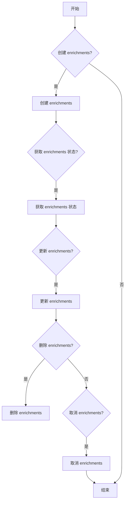
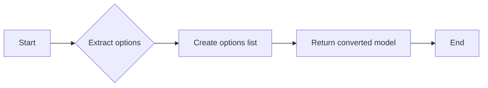
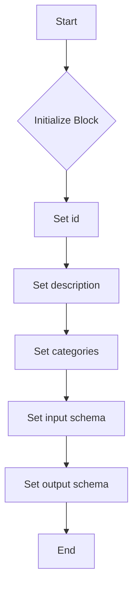
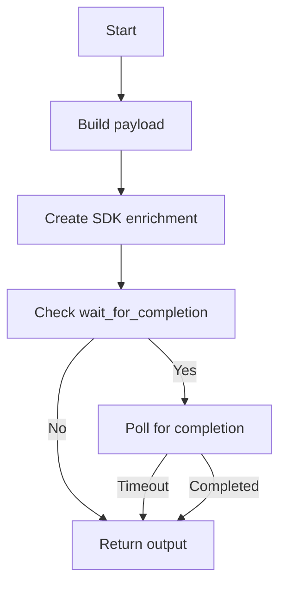
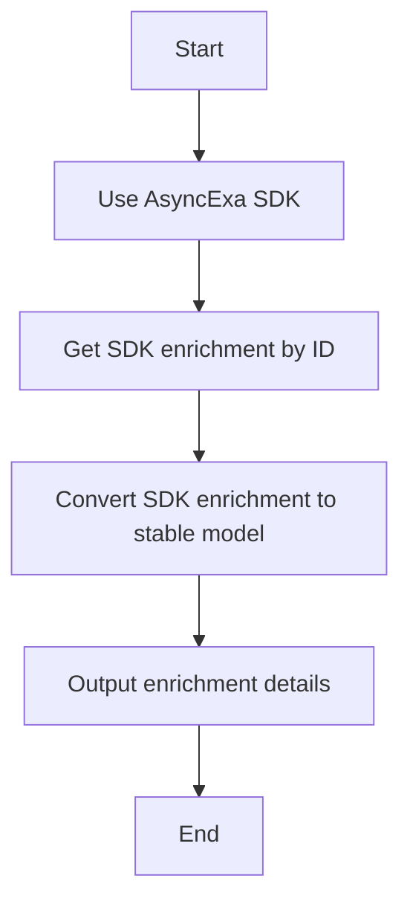
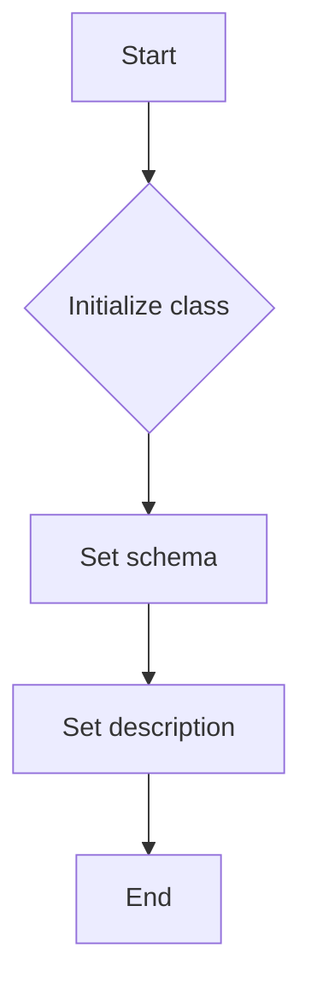
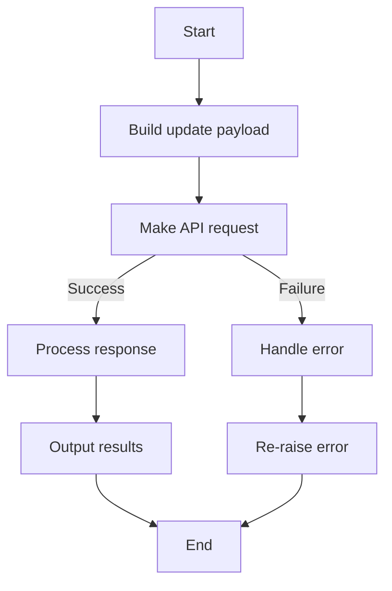
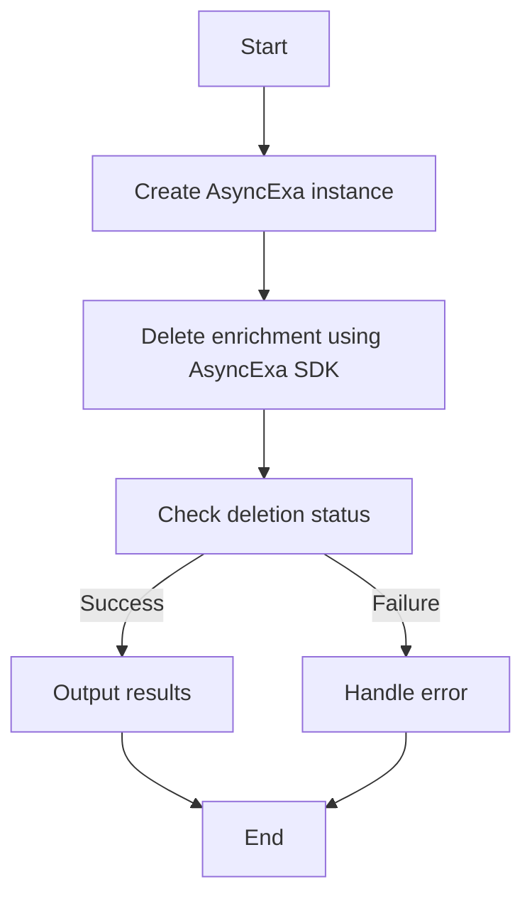
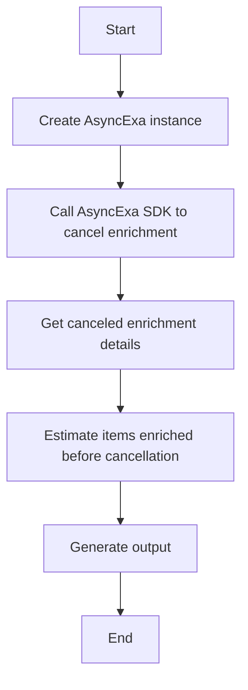

# `.\AutoGPT\autogpt_platform\backend\backend\blocks\exa\websets_enrichment.py` 详细设计文档

This module provides blocks for creating and managing enrichments on webset items, allowing extraction of additional structured data from existing items.

## 整体流程



## 类结构

```
WebsetEnrichmentModel
EnrichmentFormat
ExaCreateEnrichmentBlock
ExaGetEnrichmentBlock
ExaUpdateEnrichmentBlock
ExaDeleteEnrichmentBlock
ExaCancelEnrichmentBlock
```

## 全局变量及字段


### `exa`
    
The AsyncExa SDK instance used for API interactions.

类型：`AsyncExa`
    


### `WebsetEnrichmentModel.id`
    
Unique identifier for the enrichment.

类型：`str`
    


### `WebsetEnrichmentModel.webset_id`
    
Identifier for the webset to which the enrichment belongs.

类型：`str`
    


### `WebsetEnrichmentModel.status`
    
Current status of the enrichment.

类型：`str`
    


### `WebsetEnrichmentModel.title`
    
Short title for the enrichment.

类型：`Optional[str]`
    


### `WebsetEnrichmentModel.description`
    
Description of what data is extracted by the enrichment.

类型：`str`
    


### `WebsetEnrichmentModel.format`
    
Format of the extracted data.

类型：`str`
    


### `WebsetEnrichmentModel.options`
    
Options available for the enrichment when the format is 'options'.

类型：`List[str]`
    


### `WebsetEnrichmentModel.instructions`
    
Instructions generated for the enrichment.

类型：`Optional[str]`
    


### `WebsetEnrichmentModel.metadata`
    
Metadata attached to the enrichment.

类型：`Dict[str, Any]`
    


### `WebsetEnrichmentModel.created_at`
    
Timestamp when the enrichment was created.

类型：`str`
    


### `WebsetEnrichmentModel.updated_at`
    
Timestamp when the enrichment was last updated.

类型：`str`
    
    

## 全局函数及方法


### WebsetEnrichmentModel.from_sdk

Convert SDK WebsetEnrichment to our stable model.

参数：

- `enrichment`：`SdkWebsetEnrichment`，The SDK WebsetEnrichment object to convert.

返回值：`WebsetEnrichmentModel`，The converted stable model.

#### 流程图



#### 带注释源码

```python
@classmethod
def from_sdk(cls, enrichment: SdkWebsetEnrichment) -> "WebsetEnrichmentModel":
    """Convert SDK WebsetEnrichment to our stable model."""
    # Extract options
    options_list = []
    if enrichment.options:
        for option in enrichment.options:
            option_dict = option.model_dump(by_alias=True)
            options_list.append(option_dict.get("label", ""))

    return cls(
        id=enrichment.id,
        webset_id=enrichment.webset_id,
        status=(
            enrichment.status.value
            if hasattr(enrichment.status, "value")
            else str(enrichment.status)
        ),
        title=enrichment.title,
        description=enrichment.description,
        format=(
            enrichment.format.value
            if enrichment.format and hasattr(enrichment.format, "value")
            else "text"
        ),
        options=options_list,
        instructions=enrichment.instructions,
        metadata=enrichment.metadata if enrichment.metadata else {},
        created_at=(
            enrichment.created_at.isoformat() if enrichment.created_at else ""
        ),
        updated_at=(
            enrichment.updated_at.isoformat() if enrichment.updated_at else ""
        ),
    )
```


### ExaCreateEnrichmentBlock.__init__

This method initializes the `ExaCreateEnrichmentBlock` class, setting up its schema and other configurations.

参数：

- `self`：`ExaCreateEnrichmentBlock` 类的实例

返回值：无

#### 流程图



#### 带注释源码

```python
def __init__(self):
    super().__init__(
        id="71146ae8-0cb1-4a15-8cde-eae30de71cb6",
        description="Create enrichments to extract additional structured data from webset items",
        categories={BlockCategory.AI, BlockCategory.SEARCH},
        input_schema=ExaCreateEnrichmentBlock.Input,
        output_schema=ExaCreateEnrichmentBlock.Output,
    )
```


### ExaCreateEnrichmentBlock.run

Create a new enrichment to extract additional structured data from webset items.

参数：

- `input_data`：`Input`，The input data for creating an enrichment.
- `credentials`：`APIKeyCredentials`，The credentials for the Exa integration.
- `**kwargs`：`Any`，Additional keyword arguments.

返回值：`BlockOutput`，The output of the enrichment creation process.

#### 流程图



#### 带注释源码

```python
async def run(self, input_data: Input, *, credentials: APIKeyCredentials, **kwargs) -> BlockOutput:
    # Build the payload
    payload: dict[str, Any] = {
        "description": input_data.description,
        "format": input_data.format.value,
    }

    # Add title if provided
    if input_data.title:
        payload["title"] = input_data.title

    # Add options for 'options' format
    if input_data.format == EnrichmentFormat.OPTIONS and input_data.options:
        payload["options"] = [{"label": opt} for opt in input_data.options]

    # Add metadata if provided
    if input_data.metadata:
        payload["metadata"] = input_data.metadata

    start_time = time.time()

    # Use AsyncExa SDK
    aexa = AsyncExa(api_key=credentials.api_key.get_secret_value())

    sdk_enrichment = await aexa.websets.enrichments.create(
        webset_id=input_data.webset_id, params=payload
    )

    enrichment_id = sdk_enrichment.id
    status = (
        sdk_enrichment.status.value
        if hasattr(sdk_enrichment.status, "value")
        else str(sdk_enrichment.status)
    )

    # If wait_for_completion is True and apply_to_existing is True, poll for completion
    if input_data.wait_for_completion and input_data.apply_to_existing:
        import asyncio

        poll_interval = 5
        max_interval = 30
        poll_start = time.time()
        items_enriched = 0

        while time.time() - poll_start < input_data.polling_timeout:
            current_enrich = await aexa.websets.enrichments.get(
                webset_id=input_data.webset_id, id=enrichment_id
            )
            current_status = (
                current_enrich.status.value
                if hasattr(current_enrich.status, "value")
                else str(current_enrich.status)
            )

            if current_status in ["completed", "failed", "cancelled"]:
                # Estimate items from webset searches
                webset = await aexa.websets.get(id=input_data.webset_id)
                if webset.searches:
                    for search in webset.searches:
                        if search.progress:
                            items_enriched += search.progress.found
                completion_time = time.time() - start_time

                yield "enrichment_id", enrichment_id
                yield "webset_id", input_data.webset_id
                yield "status", current_status
                yield "title", sdk_enrichment.title
                yield "description", input_data.description
                yield "format", input_data.format.value
                yield "instructions", sdk_enrichment.instructions
                yield "items_enriched", items_enriched
                yield "completion_time", completion_time
                return

            await asyncio.sleep(poll_interval)
            poll_interval = min(poll_interval * 1.5, max_interval)

        # Timeout
        completion_time = time.time() - start_time
        yield "enrichment_id", enrichment_id
        yield "webset_id", input_data.webset_id
        yield "status", status
        yield "title", sdk_enrichment.title
        yield "description", input_data.description
        yield "format", input_data.format.value
        yield "instructions", sdk_enrichment.instructions
        yield "items_enriched", 0
        yield "completion_time", completion_time
    else:
        yield "enrichment_id", enrichment_id
        yield "webset_id", input_data.webset_id
        yield "status", status
        yield "title", sdk_enrichment.title
        yield "description", input_data.description
        yield "format", input_data.format.value
        yield "instructions", sdk_enrichment.instructions


### ExaGetEnrichmentBlock.__init__

This method initializes the `ExaGetEnrichmentBlock` class, setting up its metadata and schema for the Exa Websets Enrichment Management Blocks.

参数：

- 无

返回值：无

#### 流程图

```mermaid
classDiagram
    ExaGetEnrichmentBlock <|-- Block
    ExaGetEnrichmentBlock {
        +id: String
        +description: String
        +categories: Set<BlockCategory>
        +input_schema: BlockSchemaInput
        +output_schema: BlockSchemaOutput
    }
    Block {
        +id: String
        +description: String
        +categories: Set<BlockCategory>
        +input_schema: BlockSchemaInput
        +output_schema: BlockSchemaOutput
    }
```

#### 带注释源码

```python
class ExaGetEnrichmentBlock(Block):
    """Get the status and details of a webset enrichment."""

    def __init__(self):
        super().__init__(
            id="b8c9d0e1-f2a3-4567-89ab-cdef01234567",
            description="Get the status and details of a webset enrichment",
            categories={BlockCategory.SEARCH},
            input_schema=ExaGetEnrichmentBlock.Input,
            output_schema=ExaGetEnrichmentBlock.Output,
        )
```


### ExaGetEnrichmentBlock.run

This method retrieves the status and details of a webset enrichment.

参数：

- `input_data`：`Input`，The input data for the block, containing the webset ID and enrichment ID.
- `credentials`：`APIKeyCredentials`，The credentials required for the Exa integration.
- `**kwargs`：Additional keyword arguments.

返回值：`BlockOutput`，The output data for the block, containing the enrichment ID, status, title, description, format, options, instructions, created_at, updated_at, and metadata.

#### 流程图



#### 带注释源码

```python
async def run(self, input_data: Input, *, credentials: APIKeyCredentials, **kwargs) -> BlockOutput:
    # Use AsyncExa SDK
    aexa = AsyncExa(api_key=credentials.api_key.get_secret_value())

    # Get SDK enrichment by ID
    sdk_enrichment = await aexa.websets.enrichments.get(
        webset_id=input_data.webset_id, id=input_data.enrichment_id
    )

    # Convert SDK enrichment to stable model
    enrichment = WebsetEnrichmentModel.from_sdk(sdk_enrichment)

    # Output enrichment details
    yield "enrichment_id", enrichment.id
    yield "status", enrichment.status
    yield "title", enrichment.title
    yield "description", enrichment.description
    yield "format", enrichment.format
    yield "options", enrichment.options
    yield "instructions", enrichment.instructions
    yield "created_at", enrichment.created_at
    yield "updated_at", enrichment.updated_at
    yield "metadata", enrichment.metadata
```


### ExaUpdateEnrichmentBlock.__init__

This method initializes the `ExaUpdateEnrichmentBlock` class, setting up its schema and description.

参数：

- `self`：`None`，The instance of the class being initialized.

返回值：`None`，No return value.

#### 流程图



#### 带注释源码

```python
def __init__(self):
    super().__init__(
        id="c8d5c5fb-9684-4a29-bd2a-5b38d71776c9",
        description="Update an existing enrichment configuration",
        categories={BlockCategory.SEARCH},
        input_schema=ExaUpdateEnrichmentBlock.Input,
        output_schema=ExaUpdateEnrichmentBlock.Output,
    )
```


### ExaUpdateEnrichmentBlock.run

This method updates an existing enrichment configuration in a webset.

参数：

- `input_data`：`Input`，The input data for the update operation.
- `credentials`：`APIKeyCredentials`，The credentials required for the Exa integration.

返回值：`BlockOutput`，The output of the update operation, including the updated enrichment details and a success status.

#### 流程图



#### 带注释源码

```python
async def run(self, input_data: Input, *, credentials: APIKeyCredentials, **kwargs) -> BlockOutput:
    url = f"https://api.exa.ai/websets/v0/websets/{input_data.webset_id}/enrichments/{input_data.enrichment_id}"
    headers = {
        "Content-Type": "application/json",
        "x-api-key": credentials.api_key.get_secret_value(),
    }

    # Build the update payload
    payload = {}

    if input_data.description is not None:
        payload["description"] = input_data.description

    if input_data.format is not None:
        payload["format"] = input_data.format.value

    if input_data.options is not None:
        payload["options"] = [{"label": opt} for opt in input_data.options]

    if input_data.metadata is not None:
        payload["metadata"] = input_data.metadata

    try:
        response = await Requests().patch(url, headers=headers, json=payload)
        data = response.json()

        yield "enrichment_id", data.get("id", "")
        yield "status", data.get("status", "")
        yield "title", data.get("title", "")
        yield "description", data.get("description", "")
        yield "format", data.get("format", "")
        yield "success", "true"

    except ValueError as e:
        # Re-raise user input validation errors
        raise ValueError(f"Failed to update enrichment: {e}") from e
    # Let all other exceptions propagate naturally
```


### ExaDeleteEnrichmentBlock.__init__

This method initializes the `ExaDeleteEnrichmentBlock` class, setting up its metadata and schema for the Exa Websets Enrichment Management Blocks.

参数：

- 无

返回值：无

#### 流程图

```mermaid
classDiagram
    ExaDeleteEnrichmentBlock <|-- Block
    ExaDeleteEnrichmentBlock {
        +id: String
        +description: String
        +categories: Set<BlockCategory>
        +input_schema: BlockSchemaInput
        +output_schema: BlockSchemaOutput
    }
    Block {
        +id: String
        +description: String
        +categories: Set<BlockCategory>
        +input_schema: BlockSchemaInput
        +output_schema: BlockSchemaOutput
    }
```

#### 带注释源码

```python
class ExaDeleteEnrichmentBlock(Block):
    """Delete an enrichment from a webset."""

    class Input(BlockSchemaInput):
        credentials: CredentialsMetaInput = exa.credentials_field(
            description="The Exa integration requires an API Key."
        )
        webset_id: str = SchemaField(
            description="The ID or external ID of the Webset",
            placeholder="webset-id-or-external-id",
        )
        enrichment_id: str = SchemaField(
            description="The ID of the enrichment to delete",
            placeholder="enrichment-id",
        )

    class Output(BlockSchemaOutput):
        enrichment_id: str = SchemaField(description="The ID of the deleted enrichment")
        success: str = SchemaField(description="Whether the deletion was successful")

    def __init__(self):
        super().__init__(
            id="b250de56-2ca6-4237-a7b8-b5684892189f",
            description="Delete an enrichment from a webset",
            categories={BlockCategory.SEARCH},
            input_schema=ExaDeleteEnrichmentBlock.Input,
            output_schema=ExaDeleteEnrichmentBlock.Output,
        )
```


### ExaDeleteEnrichmentBlock.run

This method deletes an enrichment from a webset using the AsyncExa SDK.

参数：

- `input_data`：`Input`，The input data for the deletion operation.
- `credentials`：`APIKeyCredentials`，The credentials required for the Exa integration.

返回值：`BlockOutput`，The output of the deletion operation.

#### 流程图



#### 带注释源码

```python
async def run(self, input_data: Input, *, credentials: APIKeyCredentials, **kwargs) -> BlockOutput:
    # Use AsyncExa SDK
    aexa = AsyncExa(api_key=credentials.api_key.get_secret_value())

    # Delete enrichment using AsyncExa SDK
    deleted_enrichment = await aexa.websets.enrichments.delete(
        webset_id=input_data.webset_id, id=input_data.enrichment_id
    )

    # Output results
    yield "enrichment_id", deleted_enrichment.id
    yield "success", "true"
```


### ExaCancelEnrichmentBlock.__init__

This method initializes the `ExaCancelEnrichmentBlock` class, which is a subclass of `Block`. It sets up the block with its unique identifier, description, categories, input schema, and output schema.

参数：

- 无

返回值：无

#### 流程图

```mermaid
classDiagram
    ExaCancelEnrichmentBlock <|-- Block
    ExaCancelEnrichmentBlock {
        id
        description
        categories
        input_schema
        output_schema
    }
```

#### 带注释源码

```python
class ExaCancelEnrichmentBlock(Block):
    """Cancel a running enrichment operation."""

    class Input(BlockSchemaInput):
        credentials: CredentialsMetaInput = exa.credentials_field(
            description="The Exa integration requires an API Key."
        )
        webset_id: str = SchemaField(
            description="The ID or external ID of the Webset",
            placeholder="webset-id-or-external-id",
        )
        enrichment_id: str = SchemaField(
            description="The ID of the enrichment to cancel",
            placeholder="enrichment-id",
        )

    class Output(BlockSchemaOutput):
        enrichment_id: str = SchemaField(
            description="The ID of the canceled enrichment"
        )
        status: str = SchemaField(description="Status after cancellation")
        items_enriched_before_cancel: int = SchemaField(
            description="Approximate number of items enriched before cancellation"
        )
        success: str = SchemaField(
            description="Whether the cancellation was successful"
        )

    def __init__(self):
        super().__init__(
            id="7e1f8f0f-b6ab-43b3-bd1d-0c534a649295",
            description="Cancel a running enrichment operation",
            categories={BlockCategory.SEARCH},
            input_schema=ExaCancelEnrichmentBlock.Input,
            output_schema=ExaCancelEnrichmentBlock.Output,
        )
```


### ExaCancelEnrichmentBlock.run

This method cancels a running enrichment operation on a webset.

参数：

- `input_data`：`Input`，The input data for the cancellation operation.
- `credentials`：`APIKeyCredentials`，The credentials required for the Exa integration.

返回值：`BlockOutput`，The output of the cancellation operation.

#### 流程图



#### 带注释源码

```python
async def run(self, input_data: Input, *, credentials: APIKeyCredentials, **kwargs) -> BlockOutput:
    # Use AsyncExa SDK
    aexa = AsyncExa(api_key=credentials.api_key.get_secret_value())

    canceled_enrichment = await aexa.websets.enrichments.cancel(
        webset_id=input_data.webset_id, id=input_data.enrichment_id
    )

    # Try to estimate how many items were enriched before cancellation
    items_enriched = 0
    items_response = await aexa.websets.items.list(
        webset_id=input_data.webset_id, limit=100
    )

    for sdk_item in items_response.data:
        # Check if this enrichment is present
        for enrich_result in sdk_item.enrichments:
            if enrich_result.enrichment_id == input_data.enrichment_id:
                items_enriched += 1
                break

    status = (
        canceled_enrichment.status.value
        if hasattr(canceled_enrichment.status, "value")
        else str(canceled_enrichment.status)
    )

    yield "enrichment_id", canceled_enrichment.id
    yield "status", status
    yield "items_enriched_before_cancel", items_enriched
    yield "success", "true"
```


## 关键组件


### 张量索引与惰性加载

张量索引与惰性加载是代码中用于高效处理和访问大型数据集的关键组件。它们允许在需要时才加载数据，从而减少内存消耗并提高性能。

### 反量化支持

反量化支持是代码中用于处理和转换量化数据的关键组件。它允许将量化数据转换回原始数据格式，以便进行进一步的分析和处理。

### 量化策略

量化策略是代码中用于优化数据存储和计算效率的关键组件。它通过减少数据精度来减少内存和计算资源的使用，同时保持足够的准确性。


## 问题及建议


### 已知问题

-   **全局变量和函数依赖**：代码中使用了全局变量 `exa`，这可能导致代码的可移植性和可维护性降低。全局变量和函数的使用应该尽量避免，除非有充分的理由。
-   **异常处理**：代码中在更新和删除操作中使用了简单的异常捕获，但没有提供详细的错误信息或恢复策略。应该增加更详细的异常处理逻辑，以便更好地诊断和解决问题。
-   **代码重复**：在多个类中，如 `ExaCreateEnrichmentBlock` 和 `ExaGetEnrichmentBlock`，存在相似的代码片段，这可能导致维护成本增加。应该考虑提取公共逻辑到单独的函数或类中。
-   **性能问题**：在 `ExaCreateEnrichmentBlock` 中，如果 `wait_for_completion` 为 `True`，代码会持续轮询直到完成或超时。这可能导致不必要的网络请求和计算开销。应该考虑使用更高效的轮询策略或异步通知机制。

### 优化建议

-   **移除全局变量**：将 `exa` 变量移除，改为通过构造函数或配置文件传入，以提高代码的可移植性和可维护性。
-   **改进异常处理**：在异常处理中添加更详细的错误信息，并考虑实现重试逻辑或回滚机制。
-   **减少代码重复**：提取公共逻辑到单独的函数或类中，以减少代码重复并提高代码的可维护性。
-   **优化轮询策略**：考虑使用指数退避策略或异步通知机制来优化轮询逻辑，减少不必要的网络请求和计算开销。
-   **代码注释和文档**：增加代码注释和文档，以提高代码的可读性和可维护性。
-   **单元测试**：编写单元测试来确保代码的正确性和稳定性。


## 其它


### 设计目标与约束

- 设计目标：
  - 提供一个模块，用于创建和管理 enrichments，以从现有的 webset items 中提取额外的结构化数据。
  - 确保与 Exa SDK 的兼容性，以便无缝集成。
  - 提供清晰的 API，易于使用和扩展。
  - 确保数据的安全性和隐私性。

- 约束：
  - 必须使用 Exa SDK 进行操作。
  - 必须遵守 Exa API 的速率限制和限制。
  - 必须处理可能的异常和错误情况。

### 错误处理与异常设计

- 错误处理：
  - 使用 try-except 块捕获可能的异常。
  - 对于 API 错误，返回相应的错误消息和 HTTP 状态码。
  - 对于用户输入错误，返回清晰的错误消息。

- 异常设计：
  - 定义自定义异常类，以处理特定于模块的错误情况。
  - 使用 Python 标准异常，如 ValueError 和 ConnectionError。

### 数据流与状态机

- 数据流：
  - 用户输入数据通过 API 传递到模块。
  - 模块使用 Exa SDK 与 Exa API 通信。
  - 结果数据通过 API 返回给用户。

- 状态机：
  - Enrichment 的状态包括创建、正在处理、完成、失败和取消。
  - 模块根据 Enrichment 的状态更新用户。

### 外部依赖与接口契约

- 外部依赖：
  - Exa SDK
  - Pydantic
  - AsyncExa

- 接口契约：
  - Exa API
  - Exa SDK API
  - Pydantic 模型


    