# `.\AutoGPT\autogpt_platform\backend\backend\blocks\exa\websets_import_export.py` 详细设计文档

This module provides blocks for importing and exporting data from websets using the Exa API, supporting CSV and JSON formats.

## 整体流程

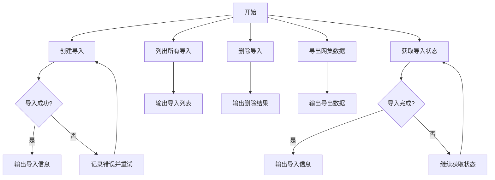

## 类结构

```
ExaCreateImportBlock (创建导入)
├── Input (输入)
│   ├── credentials (API凭证)
│   ├── title (标题)
│   ├── csv_data (CSV数据)
│   ├── entity_type (实体类型)
│   ├── entity_description (实体描述)
│   ├── identifier_column (标识列)
│   ├── url_column (URL列)
│   └── metadata (元数据)
│
├── Output (输出)
│   ├── import_id (导入ID)
│   ├── status (状态)
│   ├── title (标题)
│   ├── count (数量)
│   ├── entity_type (实体类型)
│   ├── upload_url (上传URL)
│   ├── upload_valid_until (上传有效截止时间)
│   └── created_at (创建时间)
│
└── _create_test_mock (创建测试模拟)
  
ExaGetImportBlock (获取导入状态)
├── Input (输入)
│   ├── credentials (API凭证)
│   └── import_id (导入ID)
│
├── Output (输出)
│   ├── import_id (导入ID)
│   ├── status (状态)
│   ├── title (标题)
│   ├── format (格式)
│   ├── entity_type (实体类型)
│   ├── count (数量)
│   ├── upload_url (上传URL)
│   ├── upload_valid_until (上传有效截止时间)
│   ├── failed_reason (失败原因)
│   ├── failed_message (失败消息)
│   ├── created_at (创建时间)
│   └── updated_at (更新时间)
│
└── _create_test_mock (创建测试模拟)
  
ExaListImportsBlock (列出所有导入)
├── Input (输入)
│   ├── credentials (API凭证)
│   └── limit (限制)
│   └── cursor (游标)
│
├── Output (输出)
│   ├── imports (导入列表)
│   ├── import_item (导入项)
│   └── has_more (更多)
│   └── next_cursor (下一个游标)
│
└── _create_test_mock (创建测试模拟)
  
ExaDeleteImportBlock (删除导入)
├── Input (输入)
│   ├── credentials (API凭证)
│   └── import_id (导入ID)
│
├── Output (输出)
│   ├── import_id (导入ID)
│   └── success (成功)
│
└── _create_test_mock (创建测试模拟)
  
ExaExportWebsetBlock (导出网集数据)
├── Input (输入)
│   ├── credentials (API凭证)
│   └── webset_id (网集ID)
│   └── format (格式)
│   └── include_content (包含内容)
│   └── include_enrichments (包含丰富数据)
│   └── max_items (最大项数)
│
├── Output (输出)
│   ├── export_data (导出数据)
│   └── item_count (项数)
│   └── total_items (总项数)
│   └── truncated (截断)
│   └── format (格式)
│
└── _create_test_mock (创建测试模拟)
  
```

## 全局变量及字段


### `exa`
    
The Exa configuration object.

类型：`Exa`
    


### `TEST_CREDENTIALS`
    
Test credentials for Exa integration.

类型：`APIKeyCredentials`
    


### `TEST_CREDENTIALS_INPUT`
    
Test input for Exa credentials.

类型：`CredentialsMetaInput`
    


### `ImportModel.id`
    
Unique identifier for the import.

类型：`str`
    


### `ImportModel.status`
    
Current status of the import.

类型：`str`
    


### `ImportModel.title`
    
Title of the import.

类型：`str`
    


### `ImportModel.format`
    
Format of the imported data.

类型：`str`
    


### `ImportModel.entity_type`
    
Type of entities imported.

类型：`str`
    


### `ImportModel.count`
    
Number of items in the import.

类型：`int`
    


### `ImportModel.upload_url`
    
Upload URL for CSV data (only in CreateImportResponse).

类型：`Optional[str]`
    


### `ImportModel.upload_valid_until`
    
Expiration time for upload URL (only in CreateImportResponse).

类型：`Optional[str]`
    


### `ImportModel.failed_reason`
    
Reason for failure (if applicable).

类型：`str`
    


### `ImportModel.failed_message`
    
Detailed failure message (if applicable).

类型：`str`
    


### `ImportModel.metadata`
    
Metadata attached to the import.

类型：`dict`
    


### `ImportModel.created_at`
    
When the import was created.

类型：`str`
    


### `ImportModel.updated_at`
    
When the import was last updated.

类型：`str`
    


### `ImportModel.ImportModel.id`
    
Unique identifier for the import.

类型：`str`
    


### `ImportModel.ImportModel.status`
    
Current status of the import.

类型：`str`
    


### `ImportModel.ImportModel.title`
    
Title of the import.

类型：`str`
    


### `ImportModel.ImportModel.format`
    
Format of the imported data.

类型：`str`
    


### `ImportModel.ImportModel.entity_type`
    
Type of entities imported.

类型：`str`
    


### `ImportModel.ImportModel.count`
    
Number of items in the import.

类型：`int`
    


### `ImportModel.ImportModel.upload_url`
    
Upload URL for CSV data (only in CreateImportResponse).

类型：`Optional[str]`
    


### `ImportModel.ImportModel.upload_valid_until`
    
Expiration time for upload URL (only in CreateImportResponse).

类型：`Optional[str]`
    


### `ImportModel.ImportModel.failed_reason`
    
Reason for failure (if applicable).

类型：`str`
    


### `ImportModel.ImportModel.failed_message`
    
Detailed failure message (if applicable).

类型：`str`
    


### `ImportModel.ImportModel.metadata`
    
Metadata attached to the import.

类型：`dict`
    


### `ImportModel.ImportModel.created_at`
    
When the import was created.

类型：`str`
    


### `ImportModel.ImportModel.updated_at`
    
When the import was last updated.

类型：`str`
    
    

## 全局函数及方法

### _create_test_mock

#### 描述

该函数用于创建测试模拟对象，以便在单元测试中模拟 AsyncExa SDK 的行为。

#### 参数

- 无

#### 返回值

- `dict`：包含模拟对象的字典。

#### 流程图

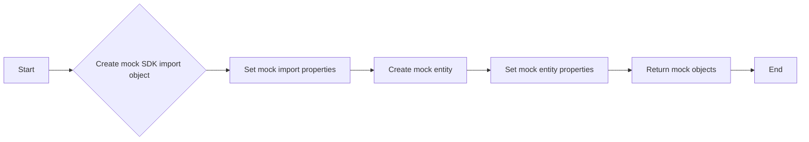

#### 带注释源码

```python
@staticmethod
def _create_test_mock():
    """Create test mocks for the AsyncExa SDK."""
    from datetime import datetime
    from unittest.mock import AsyncMock, MagicMock

    # Create mock SDK import object
    mock_import = MagicMock()
    mock_import.id = "import-123"
    mock_import.status = MagicMock(value="pending")
    mock_import.title = "Test Import"
    mock_import.format = MagicMock(value="csv")
    mock_import.count = 1
    mock_import.upload_url = None
    mock_import.upload_valid_until = None
    mock_import.failed_reason = None
    mock_import.failed_message = ""
    mock_import.metadata = {}
    mock_import.created_at = datetime.fromisoformat("2024-01-01T00:00:00")
    mock_import.updated_at = datetime.fromisoformat("2024-01-01T00:00:00")

    # Mock entity
    mock_entity = MagicMock()
    mock_entity.model_dump = MagicMock(return_value={"type": "company"})
    mock_import.entity = mock_entity

    return {
        "_get_client": lambda *args, **kwargs: MagicMock(
            websets=MagicMock(
                imports=MagicMock(create=AsyncMock(return_value=mock_import))
            )
        )
    }
```

### _get_client

#### 描述

`_get_client` 方法用于获取 Exa 客户端实例，该实例用于与 Exa SDK 进行交互。

#### 参数

- `api_key`：`str`，API 密钥，用于认证和授权与 Exa SDK 的交互。

#### 返回值

- `AsyncExa`：`AsyncExa` 类的实例，用于与 Exa SDK 进行异步交互。

#### 流程图

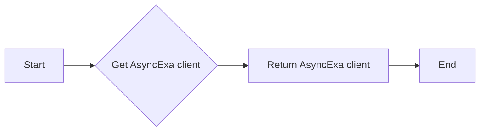

#### 带注释源码

```python
def _get_client(self, api_key: str) -> AsyncExa:
    """Get Exa client (separated for testing)."""
    return AsyncExa(api_key=api_key)
```

### run

`run` 方法是 `ExaCreateImportBlock` 类的一个异步方法，用于创建一个导入任务，将外部数据加载到 Exa Websets 中。

#### 参数

- `input_data`：`Input` 类型，包含导入任务的配置信息，如标题、CSV 数据、实体类型等。
- `credentials`：`APIKeyCredentials` 类型，包含用于访问 Exa API 的凭据。

#### 返回值

- `BlockOutput` 类型，包含导入任务的详细信息，如导入 ID、状态、标题、数量等。

#### 流程图

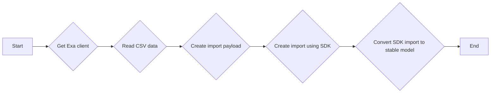

#### 带注释源码

```python
async def run(self, input_data: Input, *, credentials: APIKeyCredentials, **kwargs) -> BlockOutput:
    aexa = self._get_client(credentials.api_key.get_secret_value())

    csv_reader = csv.reader(StringIO(input_data.csv_data))
    rows = list(csv_reader)
    count = len(rows) - 1 if len(rows) > 1 else 0

    size = len(input_data.csv_data.encode("utf-8"))

    payload = {
        "title": input_data.title,
        "format": ImportFormat.CSV.value,
        "count": count,
        "size": size,
        "csv": {
            "identifier": input_data.identifier_column,
        },
    }

    # Add URL column if specified
    if input_data.url_column is not None:
        payload["csv"]["url"] = input_data.url_column

    # Add entity configuration
    entity = {"type": input_data.entity_type.value}
    if (
        input_data.entity_type == ImportEntityType.CUSTOM
        and input_data.entity_description
    ):
        entity["description"] = input_data.entity_description
    payload["entity"] = entity

    # Add metadata if provided
    if input_data.metadata:
        payload["metadata"] = input_data.metadata

    sdk_import = await aexa.websets.imports.create(
        params=payload, csv_data=input_data.csv_data
    )

    import_obj = ImportModel.from_sdk(sdk_import)

    yield "import_id", import_obj.id
    yield "status", import_obj.status
    yield "title", import_obj.title
    yield "count", import_obj.count
    yield "entity_type", import_obj.entity_type
    yield "upload_url", import_obj.upload_url
    yield "upload_valid_until", import_obj.upload_valid_until
    yield "created_at", import_obj.created_at
```

### _flatten_dict

#### 描述

`_flatten_dict` 是一个私有方法，用于将嵌套的字典扁平化，以便于CSV导出。它将嵌套的字典转换为键值对，其中键是父键和当前键的组合，值是原始值。

#### 参数

- `d`：`dict`，要扁平化的字典。
- `parent_key`：`str`，当前字典的父键，默认为空字符串。
- `sep`：`str`，用于连接父键和当前键的分隔符，默认为下划线。

#### 返回值

- `dict`，扁平化后的字典。

#### 流程图

```mermaid
graph LR
A[Start] --> B{Is d a dict?}
B -- Yes --> C[Iterate over d]
B -- No --> D[Return d]
C --> E{Is v a dict?}
E -- Yes --> F[Flatten v]
E -- No --> G[Add (new_key, v) to items]
F --> G
G --> H[Return items]
```

#### 带注释源码

```python
def _flatten_dict(self, d: dict, parent_key: str = "", sep: str = "_") -> dict:
    """Flatten nested dictionaries for CSV export."""
    items = []
    for k, v in d.items():
        new_key = f"{parent_key}{sep}{k}" if parent_key else k
        if isinstance(v, dict):
            items.extend(self._flatten_dict(v, new_key, sep=sep).items())
        elif isinstance(v, list):
            # Convert lists to JSON strings for CSV
            items.append((new_key, json.dumps(v, default=str)))
        else:
            items.append((new_key, v))
    return dict(items)
```

### ImportModel.from_sdk

**描述**

Convert SDK Import or CreateImportResponse to our stable model.

**参数**

- `import_obj`：`Union[SdkImport, CreateImportResponse]`，The SDK Import or CreateImportResponse object to convert.

**返回值**

- `ImportModel`：The converted ImportModel object.

#### 流程图

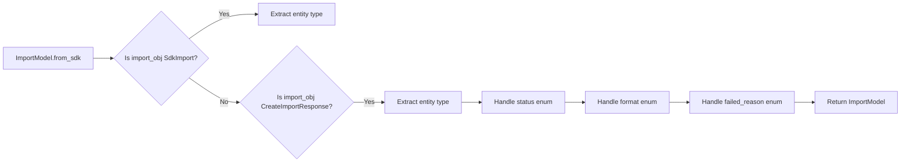

#### 带注释源码

```python
@classmethod
def from_sdk(cls, import_obj: Union[SdkImport, CreateImportResponse]) -> "ImportModel":
    """Convert SDK Import or CreateImportResponse to our stable model."""
    # Extract entity type from union (may be None)
    entity_type = "unknown"
    if import_obj.entity:
        entity_dict = import_obj.entity.model_dump(by_alias=True, exclude_none=True)
        entity_type = entity_dict.get("type", "unknown")

    # Handle status enum
    status_str = (
        import_obj.status.value
        if hasattr(import_obj.status, "value")
        else str(import_obj.status)
    )

    # Handle format enum
    format_str = (
        import_obj.format.value
        if hasattr(import_obj.format, "value")
        else str(import_obj.format)
    )

    # Handle failed_reason enum (may be None or enum)
    failed_reason_str = ""
    if import_obj.failed_reason:
        failed_reason_str = (
            import_obj.failed_reason.value
            if hasattr(import_obj.failed_reason, "value")
            else str(import_obj.failed_reason)
        )

    return cls(
        id=import_obj.id,
        status=status_str,
        title=import_obj.title or "",
        format=format_str,
        entity_type=entity_type,
        count=int(import_obj.count or 0),
        upload_url=getattr(
            import_obj, "upload_url", None
        ),  # Only in CreateImportResponse
        upload_valid_until=getattr(
            import_obj, "upload_valid_until", None
        ),  # Only in CreateImportResponse
        failed_reason=failed_reason_str,
        failed_message=import_obj.failed_message or "",
        metadata=import_obj.metadata or {},
        created_at=(
            import_obj.created_at.isoformat() if import_obj.created_at else ""
        ),
        updated_at=(
            import_obj.updated_at.isoformat() if import_obj.updated_at else ""
        ),
    )
```

### ExaCreateImportBlock.__init__

#### 描述

`ExaCreateImportBlock.__init__` 是 `ExaCreateImportBlock` 类的构造函数，用于初始化一个创建导入的块实例。

#### 参数

- 无

#### 返回值

- 无

#### 流程图

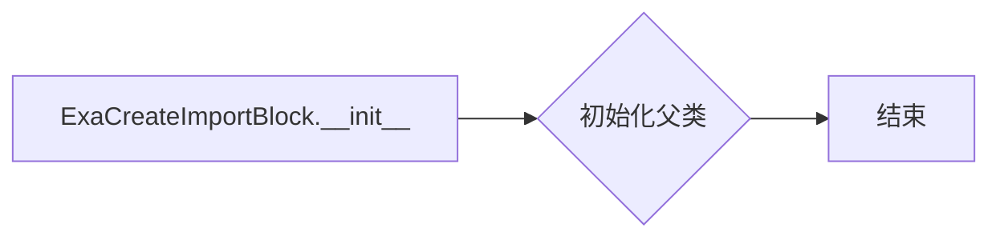

#### 带注释源码

```python
def __init__(self):
    super().__init__(
        id="020a35d8-8a53-4e60-8b60-1de5cbab1df3",
        description="Import CSV data to use with websets for targeted searches",
        categories={BlockCategory.DATA},
        input_schema=ExaCreateImportBlock.Input,
        output_schema=ExaCreateImportBlock.Output,
        test_input={
            "credentials": TEST_CREDENTIALS_INPUT,
            "title": "Test Import",
            "csv_data": "name,url\nAcme,https://acme.com",
            "entity_type": ImportEntityType.COMPANY,
            "identifier_column": 0,
        },
        test_output=[
            ("import_id", "import-123"),
            ("status", "pending"),
            ("title", "Test Import"),
            ("count", 1),
            ("entity_type", "company"),
            ("upload_url", None),
            ("upload_valid_until", None),
            ("created_at", "2024-01-01T00:00:00"),
        ],
        test_credentials=TEST_CREDENTIALS,
        test_mock=self._create_test_mock(),
    )
```

#### 关键组件信息

- `super().__init__`: 初始化父类 `Block`。
- `id`: 块的唯一标识符。
- `description`: 块的描述。
- `categories`: 块的分类。
- `input_schema`: 块的输入模式。
- `output_schema`: 块的输出模式。
- `test_input`: 测试输入数据。
- `test_output`: 测试输出数据。
- `test_credentials`: 测试凭据。
- `test_mock`: 测试模拟。

### `{类名}.{方法名}`

该函数用于创建测试模拟对象，以便在测试环境中模拟 AsyncExa SDK 的行为。

#### 参数

- 无

#### 返回值

- `dict`，包含模拟的 AsyncExa SDK 客户端配置

#### 流程图

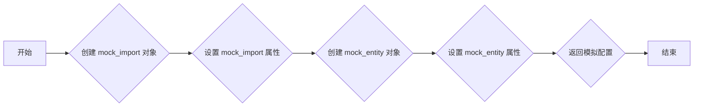

#### 带注释源码

```python
@staticmethod
def _create_test_mock():
    """Create test mocks for the AsyncExa SDK."""
    from datetime import datetime
    from unittest.mock import AsyncMock, MagicMock

    # Create mock SDK import object
    mock_import = MagicMock()
    mock_import.id = "import-123"
    mock_import.status = MagicMock(value="pending")
    mock_import.title = "Test Import"
    mock_import.format = MagicMock(value="csv")
    mock_import.count = 1
    mock_import.upload_url = None
    mock_import.upload_valid_until = None
    mock_import.failed_reason = None
    mock_import.failed_message = ""
    mock_import.metadata = {}
    mock_import.created_at = datetime.fromisoformat("2024-01-01T00:00:00")
    mock_import.updated_at = datetime.fromisoformat("2024-01-01T00:00:00")

    # Mock entity
    mock_entity = MagicMock()
    mock_entity.model_dump = MagicMock(return_value={"type": "company"})
    mock_import.entity = mock_entity

    return {
        "_get_client": lambda *args, **kwargs: MagicMock(
            websets=MagicMock(
                imports=MagicMock(create=AsyncMock(return_value=mock_import))
            )
        )
    }
```

### ExaCreateImportBlock._get_client

#### 描述

获取 Exa 客户端实例。

#### 参数

- `api_key`：`str`，API 密钥。

#### 返回值

- `AsyncExa`，Exa 客户端实例。

#### 流程图

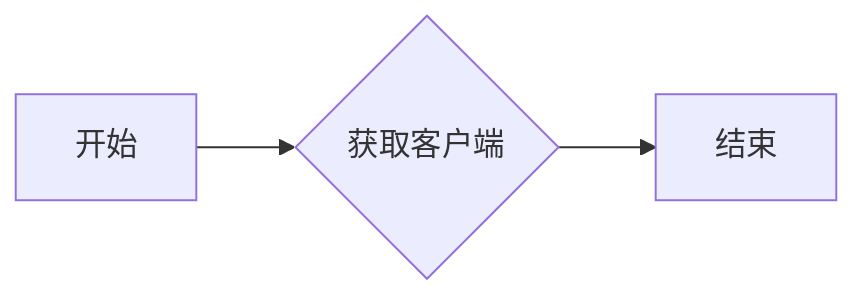

#### 带注释源码

```python
def _get_client(self, api_key: str) -> AsyncExa:
    """Get Exa client (separated for testing)."""
    return AsyncExa(api_key=api_key)
```

### ExaCreateImportBlock.run

**描述**

`ExaCreateImportBlock.run` 方法是 `ExaCreateImportBlock` 类的一个异步方法，用于创建一个导入任务，将外部数据加载到 Exa Websets 中。

**参数**

- `input_data`: `Input` 类型，包含导入任务的配置信息。
- `credentials`: `APIKeyCredentials` 类型，包含用于认证的 API 密钥。

**返回值**

- `BlockOutput` 类型，包含导入任务的详细信息。

**参数名称、类型和描述**

- `input_data`: `Input` 类型，包含导入任务的配置信息，如标题、CSV 数据、实体类型等。
- `credentials`: `APIKeyCredentials` 类型，包含用于认证的 API 密钥。

**返回值类型和描述**

- `BlockOutput` 类型，包含导入任务的详细信息，如导入 ID、状态、标题、数量等。

#### 流程图


#### 带注释源码

```python
async def run(self, input_data: Input, *, credentials: APIKeyCredentials, **kwargs) -> BlockOutput:
    aexa = self._get_client(credentials.api_key.get_secret_value())

    csv_reader = csv.reader(StringIO(input_data.csv_data))
    rows = list(csv_reader)
    count = len(rows) - 1 if len(rows) > 1 else 0

    size = len(input_data.csv_data.encode("utf-8"))

    payload = {
        "title": input_data.title,
        "format": ImportFormat.CSV.value,
        "count": count,
        "size": size,
        "csv": {
            "identifier": input_data.identifier_column,
        },
    }

    # Add URL column if specified
    if input_data.url_column is not None:
        payload["csv"]["url"] = input_data.url_column

    # Add entity configuration
    entity = {"type": input_data.entity_type.value}
    if (
        input_data.entity_type == ImportEntityType.CUSTOM
        and input_data.entity_description
    ):
        entity["description"] = input_data.entity_description
    payload["entity"] = entity

    # Add metadata if provided
    if input_data.metadata:
        payload["metadata"] = input_data.metadata

    sdk_import = await aexa.websets.imports.create(
        params=payload, csv_data=input_data.csv_data
    )

    import_obj = ImportModel.from_sdk(sdk_import)

    yield "import_id", import_obj.id
    yield "status", import_obj.status
    yield "title", import_obj.title
    yield "count", import_obj.count
    yield "entity_type", import_obj.entity_type
    yield "upload_url", import_obj.upload_url
    yield "upload_valid_until", import_obj.upload_valid_until
    yield "created_at", import_obj.created_at
```

### ExaGetImportBlock.__init__

#### 描述

`ExaGetImportBlock.__init__` 是 `ExaGetImportBlock` 类的构造函数，用于初始化 `ExaGetImportBlock` 对象。

#### 参数

- 无

#### 返回值

- 无

#### 流程图

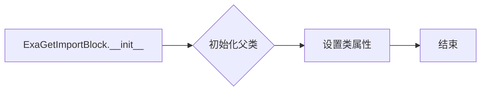

#### 带注释源码

```python
class ExaGetImportBlock(Block):
    """Get the status and details of an import."""

    class Input(BlockSchemaInput):
        credentials: CredentialsMetaInput = exa.credentials_field(
            description="The Exa integration requires an API Key."
        )
        import_id: str = SchemaField(
            description="The ID of the import to retrieve",
            placeholder="import-id",
        )

    class Output(BlockSchemaOutput):
        import_id: str = SchemaField(description="The unique identifier for the import")
        status: str = SchemaField(description="Current status of the import")
        title: str = SchemaField(description="Title of the import")
        format: str = SchemaField(description="Format of the imported data")
        entity_type: str = SchemaField(description="Type of entities imported")
        count: int = SchemaField(description="Number of items imported")
        upload_url: Optional[str] = SchemaField(
            description="Upload URL for CSV data (if import not yet uploaded)"
        )
        upload_valid_until: Optional[str] = SchemaField(
            description="Expiration time for upload URL (if applicable)"
        )
        failed_reason: Optional[str] = SchemaField(
            description="Reason for failure (if applicable)"
        )
        failed_message: Optional[str] = SchemaField(
            description="Detailed failure message (if applicable)"
        )
        created_at: str = SchemaField(description="When the import was created")
        updated_at: str = SchemaField(description="When the import was last updated")
        metadata: dict = SchemaField(description="Metadata attached to the import")

    def __init__(self):
        super().__init__(
            id="236663c8-a8dc-45f7-a050-2676bb0a3dd2",
            description="Get the status and details of an import",
            categories={BlockCategory.DATA},
            input_schema=ExaGetImportBlock.Input,
            output_schema=ExaGetImportBlock.Output,
        )
```

#### 关键组件信息

- `ExaGetImportBlock`: 用于获取导入状态和详细信息的类。
- `Input`: `ExaGetImportBlock` 的输入模式，包含 `credentials` 和 `import_id` 字段。
- `Output`: `ExaGetImportBlock` 的输出模式，包含导入的详细信息字段。

### ExaGetImportBlock.run

#### 描述

该函数用于获取指定导入的状态和详细信息。

#### 参数

- `input_data`: `Input` 类型，包含导入ID和API密钥信息。
- `credentials`: `APIKeyCredentials` 类型，包含API密钥。

#### 返回值

- `BlockOutput` 类型，包含导入ID、状态、标题、格式、实体类型、计数、上传URL、上传有效期、失败原因、失败消息、创建时间和更新时间。

#### 流程图

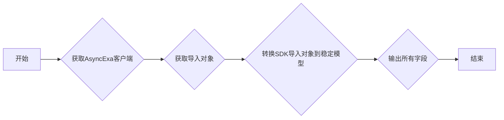

#### 带注释源码

```python
async def run(self, input_data: Input, *, credentials: APIKeyCredentials, **kwargs) -> BlockOutput:
    # Use AsyncExa SDK
    aexa = AsyncExa(api_key=credentials.api_key.get_secret_value())

    # 获取导入对象
    sdk_import = await aexa.websets.imports.get(import_id=input_data.import_id)

    # 转换SDK导入对象到稳定模型
    import_obj = ImportModel.from_sdk(sdk_import)

    # 输出所有字段
    yield "import_id", import_obj.id
    yield "status", import_obj.status
    yield "title", import_obj.title
    yield "format", import_obj.format
    yield "entity_type", import_obj.entity_type
    yield "count", import_obj.count
    yield "upload_url", import_obj.upload_url
    yield "upload_valid_until", import_obj.upload_valid_until
    yield "failed_reason", import_obj.failed_reason
    yield "failed_message", import_obj.failed_message
    yield "created_at", import_obj.created_at
    yield "updated_at", import_obj.updated_at
    yield "metadata", import_obj.metadata
```

### ExaListImportsBlock.__init__

#### 描述

`ExaListImportsBlock.__init__` 方法是 `ExaListImportsBlock` 类的构造函数，用于初始化 `ExaListImportsBlock` 对象。

#### 参数

- 无

#### 返回值

- 无

#### 流程图

```mermaid
classDiagram
    class ExaListImportsBlock {
        -id: String
        -description: String
        -categories: Set<BlockCategory>
        -input_schema: BlockSchemaInput
        -output_schema: BlockSchemaOutput
        -test_input: Map<String, Object>
        -test_output: List<Object[]>
        -test_credentials: Credentials
        -test_mock: Map<String, Object>
    }
    ExaListImportsBlock "has" ExaListImportsBlock.Input
    ExaListImportsBlock "has" ExaListImportsBlock.Output
    ExaListImportsBlock "has" Credentials
    ExaListImportsBlock "has" Map
```

#### 带注释源码

```python
class ExaListImportsBlock(Block):
    """List all imports with pagination."""

    class Input(BlockSchemaInput):
        credentials: CredentialsMetaInput = exa.credentials_field(
            description="The Exa integration requires an API Key."
        )
        limit: int = SchemaField(
            default=25,
            description="Number of imports to return",
            ge=1,
            le=100,
        )
        cursor: Optional[str] = SchemaField(
            default=None,
            description="Cursor for pagination",
            advanced=True,
        )

    class Output(BlockSchemaOutput):
        imports: list[dict] = SchemaField(description="List of imports")
        import_item: dict = SchemaField(
            description="Individual import (yielded for each import)"
        )
        has_more: bool = SchemaField(
            description="Whether there are more imports to paginate through"
        )
        next_cursor: Optional[str] = SchemaField(
            description="Cursor for the next page of results"
        )

    def __init__(self):
        super().__init__(
            id="65323630-f7e9-4692-a624-184ba14c0686",
            description="List all imports with pagination support",
            categories={BlockCategory.DATA},
            input_schema=ExaListImportsBlock.Input,
            output_schema=ExaListImportsBlock.Output,
        )
```

#### 关键组件信息

- `ExaListImportsBlock`: 列出所有导入的块，支持分页。
- `Input`: 输入模式，包含凭据、限制和游标。
- `Output`: 输出模式，包含导入列表、单个导入项、是否有更多导入和下一页的游标。

### ExaListImportsBlock.run

#### 描述

`ExaListImportsBlock.run` 方法用于列出所有导入项，并支持分页。

#### 参数

- `input_data`: `Input` 类型，包含以下字段：
  - `credentials`: `CredentialsMetaInput` 类型，用于认证。
  - `limit`: `int` 类型，默认为 25，表示每页返回的导入项数量。
  - `cursor`: `Optional[str]` 类型，用于分页，默认为 `None`。

#### 返回值

- `BlockOutput` 类型，包含以下字段：
  - `imports`: `list[dict]` 类型，表示导入项列表。
  - `import_item`: `dict` 类型，表示单个导入项。
  - `has_more`: `bool` 类型，表示是否有更多导入项可以分页。
  - `next_cursor`: `Optional[str]` 类型，表示下一页的分页游标。

#### 流程图

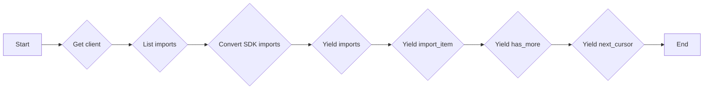

#### 带注释源码

```python
async def run(self, input_data: Input, *, credentials: APIKeyCredentials, **kwargs) -> BlockOutput:
    # Use AsyncExa SDK
    aexa = AsyncExa(api_key=credentials.api_key.get_secret_value())

    response = await aexa.websets.imports.list(
        cursor=input_data.cursor,
        limit=input_data.limit,
    )

    # Convert SDK imports to our stable models
    imports = [ImportModel.from_sdk(i) for i in response.data]

    yield "imports", [i.model_dump() for i in imports]

    for import_obj in imports:
        yield "import_item", import_obj.model_dump()

    yield "has_more", response.has_more
    yield "next_cursor", response.next_cursor
```

### ExaDeleteImportBlock.__init__

#### 描述

`ExaDeleteImportBlock.__init__` 是 `ExaDeleteImportBlock` 类的构造函数，用于初始化 `ExaDeleteImportBlock` 实例。

#### 参数

- 无

#### 返回值

- 无

#### 流程图

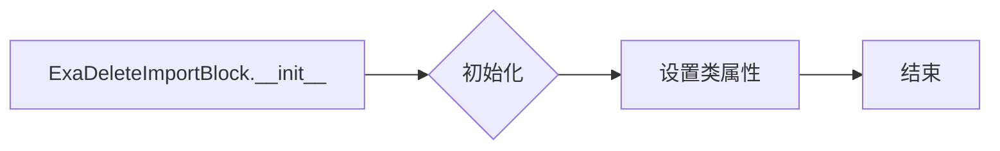

#### 带注释源码

```python
class ExaDeleteImportBlock(Block):
    """Delete an import."""

    class Input(BlockSchemaInput):
        credentials: CredentialsMetaInput = exa.credentials_field(
            description="The Exa integration requires an API Key."
        )
        import_id: str = SchemaField(
            description="The ID of the import to delete",
            placeholder="import-id",
        )

    class Output(BlockSchemaOutput):
        import_id: str = SchemaField(description="The ID of the deleted import")
        success: str = SchemaField(description="Whether the deletion was successful")

    def __init__(self):
        super().__init__(
            id="81ae30ed-c7ba-4b5d-8483-b726846e570c",
            description="Delete an import",
            categories={BlockCategory.DATA},
            input_schema=ExaDeleteImportBlock.Input,
            output_schema=ExaDeleteImportBlock.Output,
        )
```

#### 关键组件信息

- `ExaDeleteImportBlock`: 用于删除 Exa 平台上的导入数据。
- `Input`: 定义了 `ExaDeleteImportBlock` 的输入参数。
- `Output`: 定义了 `ExaDeleteImportBlock` 的输出参数。

### ExaDeleteImportBlock.run

#### 描述

删除指定的导入。

#### 参数

- `input_data`：`Input`，导入数据输入。
- `credentials`：`APIKeyCredentials`，API密钥凭据。

#### 返回值

- `BlockOutput`，包含导入ID和删除操作的成功状态。

#### 流程图

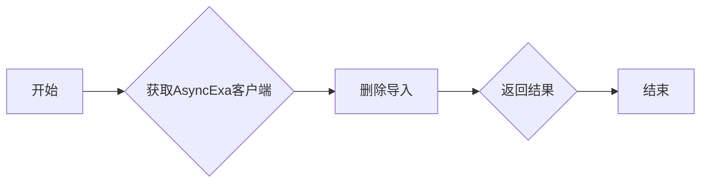

#### 带注释源码

```python
async def run(self, input_data: Input, *, credentials: APIKeyCredentials, **kwargs) -> BlockOutput:
    # Use AsyncExa SDK
    aexa = AsyncExa(api_key=credentials.api_key.get_secret_value())

    # 删除导入
    deleted_import = await aexa.websets.imports.delete(import_id=input_data.import_id)

    # 返回结果
    yield "import_id", deleted_import.id
    yield "success", "true"
```

### ExaExportWebsetBlock.__init__

#### 描述

`ExaExportWebsetBlock.__init__` 方法是 `ExaExportWebsetBlock` 类的构造函数，用于初始化 `ExaExportWebsetBlock` 实例。

#### 参数

- 无

#### 返回值

- 无

#### 流程图

```mermaid
classDiagram
    ExaExportWebsetBlock --> Block: extends
    ExaExportWebsetBlock {
        id
        description
        categories
        input_schema
        output_schema
        test_input
        test_output
        test_credentials
        test_mock
    }
```

#### 带注释源码

```python
class ExaExportWebsetBlock(Block):
    """Export all data from a webset in various formats."""

    class Input(BlockSchemaInput):
        credentials: CredentialsMetaInput = exa.credentials_field(
            description="The Exa integration requires an API Key."
        )
        webset_id: str = SchemaField(
            description="The ID or external ID of the Webset to export",
            placeholder="webset-id-or-external-id",
        )
        format: ExportFormat = SchemaField(
            default=ExportFormat.JSON,
            description="Export format",
        )
        include_content: bool = SchemaField(
            default=True,
            description="Include full content in export",
        )
        include_enrichments: bool = SchemaField(
            default=True,
            description="Include enrichment data in export",
        )
        max_items: int = SchemaField(
            default=100,
            description="Maximum number of items to export",
            ge=1,
            le=100,
        )

    class Output(BlockSchemaOutput):
        export_data: str = SchemaField(
            description="Exported data in the requested format"
        )
        item_count: int = SchemaField(description="Number of items exported")
        total_items: int = SchemaField(
            description="Total number of items in the webset"
        )
        truncated: bool = SchemaField(
            description="Whether the export was truncated due to max_items limit"
        )
        format: str = SchemaField(description="Format of the exported data")

    def __init__(self):
        super().__init__(
            id="5da9d0fd-4b5b-4318-8302-8f71d0ccce9d",
            description="Export webset data in JSON, CSV, or JSON Lines format",
            categories={BlockCategory.DATA},
            input_schema=ExaExportWebsetBlock.Input,
            output_schema=ExaExportWebsetBlock.Output,
            test_input={
                "credentials": TEST_CREDENTIALS_INPUT,
                "webset_id": "test-webset",
                "format": ExportFormat.JSON,
                "include_content": True,
                "include_enrichments": True,
                "max_items": 10,
            },
            test_output=[
                ("export_data", str),
                ("item_count", 2),
                ("total_items", 2),
                ("truncated", False),
                ("format", "json"),
            ],
            test_credentials=TEST_CREDENTIALS,
            test_mock=self._create_test_mock(),
        )
```

### `_create_test_mock`

#### 描述

该函数用于创建测试模拟对象，以便在测试环境中模拟 AsyncExa SDK 的行为。

#### 参数

- 无

#### 返回值

- `dict`：包含模拟对象的字典

#### 流程图

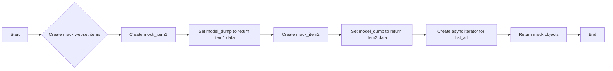

#### 带注释源码

```python
@staticmethod
def _create_test_mock():
    """Create test mocks for the AsyncExa SDK."""
    from unittest.mock import MagicMock

    # Create mock webset items
    mock_item1 = MagicMock()
    mock_item1.model_dump = MagicMock(
        return_value={
            "id": "item-1",
            "url": "https://example.com",
            "title": "Test Item 1",
        }
    )

    mock_item2 = MagicMock()
    mock_item2.model_dump = MagicMock(
        return_value={
            "id": "item-2",
            "url": "https://example.org",
            "title": "Test Item 2",
        }
    )

    # Create async iterator for list_all
    async def async_item_iterator(*args, **kwargs):
        for item in [mock_item1, mock_item2]:
            yield item

    return {
        "_get_client": lambda *args, **kwargs: MagicMock(
            websets=MagicMock(items=MagicMock(list_all=async_item_iterator))
        )
    }
```

### ExaExportWebsetBlock._get_client

#### 描述

获取 Exa 客户端实例。

#### 参数

- `api_key`：`str`，API 密钥。

#### 返回值

- `AsyncExa`，Exa 客户端实例。

#### 流程图


#### 带注释源码

```python
def _get_client(self, api_key: str) -> AsyncExa:
    """Get Exa client (separated for testing)."""
    return AsyncExa(api_key=api_key)
```

### ExaExportWebsetBlock.run

#### 描述

The `run` method of the `ExaExportWebsetBlock` class is responsible for exporting all data from a specified webset in various formats such as JSON, CSV, or JSON Lines. It retrieves items from the webset using the AsyncExa SDK, processes them based on the include flags for content and enrichments, and then formats the data for export.

#### 参数

- `input_data`: `Input`，The input data for the export operation, including the webset ID, format, include flags, and maximum number of items to export.
- `credentials`: `APIKeyCredentials`，The credentials required for the Exa integration, including the API key.

#### 返回值

- `BlockOutput`，The output data for the export operation, including the exported data, item count, total number of items, whether the export was truncated, and the format of the exported data.

#### 流程图

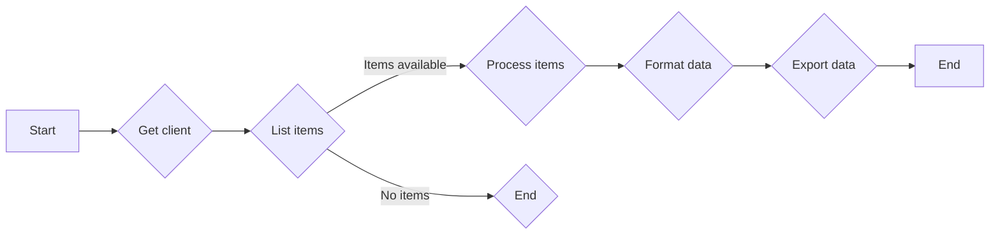

#### 带注释源码

```python
async def run(self, input_data: Input, *, credentials: APIKeyCredentials, **kwargs) -> BlockOutput:
    # Use AsyncExa SDK
    aexa = self._get_client(credentials.api_key.get_secret_value())

    try:
        all_items = []

        # Use SDK's list_all iterator to fetch items
        item_iterator = aexa.websets.items.list_all(
            webset_id=input_data.webset_id, limit=input_data.max_items
        )

        async for sdk_item in item_iterator:
            if len(all_items) >= input_data.max_items:
                break

            # Convert to dict for export
            item_dict = sdk_item.model_dump(by_alias=True, exclude_none=True)
            all_items.append(item_dict)

        # Calculate total and truncated
        total_items = len(all_items)  # SDK doesn't provide total count
        truncated = len(all_items) >= input_data.max_items

        # Process items based on include flags
        if not input_data.include_content:
            for item in all_items:
                item.pop("content", None)

        if not input_data.include_enrichments:
            for item in all_items:
                item.pop("enrichments", None)

        # Format the export data
        export_data = ""

        if input_data.format == ExportFormat.JSON:
            export_data = json.dumps(all_items, indent=2, default=str)

        elif input_data.format == ExportFormat.JSON_LINES:
            lines = [json.dumps(item, default=str) for item in all_items]
            export_data = "\n".join(lines)

        elif input_data.format == ExportFormat.CSV:
            # Extract all unique keys for CSV headers
            all_keys = set()
            for item in all_items:
                all_keys.update(self._flatten_dict(item).keys())

            # Create CSV
            output = StringIO()
            writer = csv.DictWriter(output, fieldnames=sorted(all_keys))
            writer.writeheader()

            for item in all_items:
                flat_item = self._flatten_dict(item)
                writer.writerow(flat_item)

            export_data = output.getvalue()

        yield "export_data", export_data
        yield "item_count", len(all_items)
        yield "total_items", total_items
        yield "truncated", truncated
        yield "format", input_data.format.value

    except ValueError as e:
        # Re-raise user input validation errors
        raise ValueError(f"Failed to export webset: {e}") from e
    # Let all other exceptions propagate naturally
```

### `_flatten_dict`

#### 描述

`_flatten_dict` 方法用于将嵌套的字典扁平化，以便于CSV导出。它将嵌套的字典转换为键名由父键和子键组成的扁平字典。

#### 参数

- `d`：`dict`，需要扁平化的字典。
- `parent_key`：`str`，当前字典的父键，默认为空字符串。
- `sep`：`str`，用于连接父键和子键的分隔符，默认为下划线。

#### 返回值

- `dict`，扁平化后的字典。

#### 流程图

```mermaid
graph LR
A[Start] --> B{Is d a dict?}
B -- Yes --> C[Iterate over d]
B -- No --> D[Return d]
C --> E{Is v a dict?}
E -- Yes --> F[Flatten v]
E -- No --> G[Add (k, v) to result]
F --> G
G --> H[Return result]
```

#### 带注释源码

```python
def _flatten_dict(self, d: dict, parent_key: str = "", sep: str = "_") -> dict:
    """Flatten nested dictionaries for CSV export."""
    items = []
    for k, v in d.items():
        new_key = f"{parent_key}{sep}{k}" if parent_key else k
        if isinstance(v, dict):
            items.extend(self._flatten_dict(v, new_key, sep=sep).items())
        elif isinstance(v, list):
            # Convert lists to JSON strings for CSV
            items.append((new_key, json.dumps(v, default=str)))
        else:
            items.append((new_key, v))
    return dict(items)
```

## 关键组件


### 张量索引与惰性加载

张量索引与惰性加载是代码中用于高效处理大型数据集的关键组件。它们允许在需要时才加载数据，从而减少内存消耗并提高性能。

### 反量化支持

反量化支持是代码中用于处理量化数据的关键组件。它允许在量化过程中进行反向操作，以便在需要时恢复原始数据。

### 量化策略

量化策略是代码中用于优化数据表示和存储的关键组件。它通过减少数据精度来减少内存占用，同时保持足够的准确性。

## 问题及建议


### 已知问题

-   **代码重复**: `ImportModel.from_sdk` 方法中存在大量的重复代码，用于处理不同类型的枚举和字段。这可以通过创建辅助函数或使用映射来简化。
-   **异常处理**: 代码中缺少对 SDK 调用失败的异常处理。如果 SDK 调用失败，应该捕获异常并返回适当的错误信息。
-   **测试覆盖率**: 代码中缺少单元测试，特别是对于辅助函数和异常情况。应该增加测试覆盖率以确保代码的健壮性。
-   **性能**: `ExaExportWebsetBlock` 中的 `_flatten_dict` 方法在处理大型数据集时可能会遇到性能问题，因为它递归地遍历字典。

### 优化建议

-   **重构 `ImportModel.from_sdk`**: 通过创建辅助函数或使用映射来简化 `ImportModel.from_sdk` 方法中的重复代码。
-   **增加异常处理**: 在 SDK 调用周围添加 try-except 块，以捕获并处理可能发生的异常。
-   **编写单元测试**: 为代码中的每个组件编写单元测试，包括辅助函数和异常情况。
-   **优化性能**: 对于 `_flatten_dict` 方法，可以考虑使用迭代而不是递归来提高性能，或者使用更高效的数据结构来存储扁平化的字典。
-   **代码注释**: 增加代码注释，特别是对于复杂的逻辑和辅助函数，以提高代码的可读性和可维护性。
-   **文档**: 更新文档，包括新的测试用例和性能优化信息，以确保所有开发者都了解代码的当前状态。


## 其它


### 设计目标与约束

- 设计目标：
  - 提供一个模块，用于从CSV文件导入数据到websets，以及以不同格式导出webset数据。
  - 确保数据导入和导出过程的稳定性和可靠性。
  - 提供清晰的API接口，方便用户使用。
  - 支持多种数据格式，如CSV、JSON和JSON Lines。
- 约束：
  - 必须使用AsyncExa SDK进行数据操作。
  - 必须遵循websets的数据模型和API规范。
  - 必须处理可能的异常和错误情况。

### 错误处理与异常设计

- 错误处理：
  - 使用try-except语句捕获和处理可能发生的异常。
  - 对于用户输入验证错误，抛出ValueError异常。
  - 对于SDK返回的错误，转换为用户友好的错误消息。
- 异常设计：
  - 定义自定义异常类，用于处理特定类型的错误。
  - 异常类应包含错误代码、错误消息和可能的解决方案。

### 数据流与状态机

- 数据流：
  - 用户通过API提交导入或导出请求。
  - 模块处理请求，与SDK交互，执行数据导入或导出操作。
  - 模块将结果返回给用户。
- 状态机：
  - 导入操作可能经历以下状态：pending、processing、completed、failed。
  - 导出操作可能经历以下状态：pending、processing、completed。

### 外部依赖与接口契约

- 外部依赖：
  - AsyncExa SDK
  - pydantic
  - csv
  - json
  - io
  - enum
- 接口契约：
  - 定义清晰的API接口，包括输入参数和输出结果。
  - 使用SchemaField定义输入和输出参数的验证规则。
  - 使用BaseModel定义数据模型，确保数据的一致性。


    