# `AutoGPT\autogpt_platform\backend\backend\blocks\exa\websets_items.py` 详细设计文档

该模块定义了一系列用于管理 Exa Webset 中条目的集成 Block，实现了条目的获取、列表查询、删除、批量获取、摘要统计以及增量获取功能。模块通过 Pydantic 模型（WebsetItemModel 和 EnrichmentResultModel）封装 SDK 返回的数据，确保输出结构的稳定性，并利用 AsyncExa 客户端与 Exa API 进行异步交互。

## 整体流程

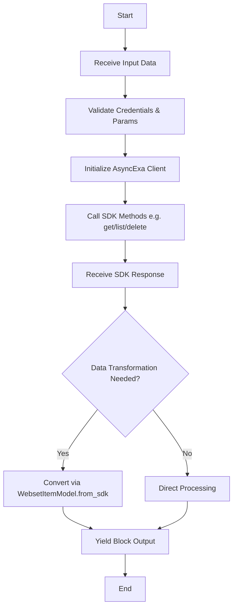

## 类结构

```
pydantic.BaseModel
├── EnrichmentResultModel
└── WebsetItemModel
backend.sdk.Block
├── ExaGetWebsetItemBlock
│   ├── Input
│   └── Output
├── ExaListWebsetItemsBlock
│   ├── Input
│   └── Output
├── ExaDeleteWebsetItemBlock
│   ├── Input
│   └── Output
├── ExaBulkWebsetItemsBlock
│   ├── Input
│   └── Output
├── ExaWebsetItemsSummaryBlock
│   ├── Input
│   └── Output
└── ExaGetNewItemsBlock
    ├── Input
    └── Output
```

## 全局变量及字段


### `exa`
    
The Exa integration configuration instance used to define credential fields.

类型：`ExaIntegration`
    


### `EnrichmentResultModel.enrichment_id`
    
The unique identifier for the enrichment result.

类型：`str`
    


### `EnrichmentResultModel.format`
    
The format of the enrichment result.

类型：`str`
    


### `EnrichmentResultModel.result`
    
The result data of the enrichment.

类型：`Optional[List[str]]`
    


### `EnrichmentResultModel.reasoning`
    
The reasoning behind the enrichment result.

类型：`Optional[str]`
    


### `EnrichmentResultModel.references`
    
List of references associated with the enrichment.

类型：`List[Dict[str, Any]]`
    


### `WebsetItemModel.id`
    
The unique identifier for the webset item.

类型：`str`
    


### `WebsetItemModel.url`
    
The URL of the webset item source.

类型：`Optional[AnyUrl]`
    


### `WebsetItemModel.title`
    
The title of the webset item.

类型：`str`
    


### `WebsetItemModel.content`
    
The main content of the webset item.

类型：`str`
    


### `WebsetItemModel.entity_data`
    
Entity-specific structured data properties.

类型：`Dict[str, Any]`
    


### `WebsetItemModel.enrichments`
    
Dictionary of enrichment results keyed by ID.

类型：`Dict[str, EnrichmentResultModel]`
    


### `WebsetItemModel.created_at`
    
Timestamp when the item was created.

类型：`str`
    


### `WebsetItemModel.updated_at`
    
Timestamp when the item was last updated.

类型：`str`
    


### `ExaGetWebsetItemBlock.Input.credentials`
    
API key credentials for authentication.

类型：`CredentialsMetaInput`
    


### `ExaGetWebsetItemBlock.Input.webset_id`
    
The ID or external ID of the Webset.

类型：`str`
    


### `ExaGetWebsetItemBlock.Input.item_id`
    
The ID of the specific item to retrieve.

类型：`str`
    


### `ExaGetWebsetItemBlock.Output.item_id`
    
The unique identifier for the item.

类型：`str`
    


### `ExaGetWebsetItemBlock.Output.url`
    
The URL of the original source.

类型：`str`
    


### `ExaGetWebsetItemBlock.Output.title`
    
The title of the item.

类型：`str`
    


### `ExaGetWebsetItemBlock.Output.content`
    
The main content of the item.

类型：`str`
    


### `ExaGetWebsetItemBlock.Output.entity_data`
    
Entity-specific structured data.

类型：`dict`
    


### `ExaGetWebsetItemBlock.Output.enrichments`
    
Enrichment data added to the item.

类型：`dict`
    


### `ExaGetWebsetItemBlock.Output.created_at`
    
When the item was added to the webset.

类型：`str`
    


### `ExaGetWebsetItemBlock.Output.updated_at`
    
When the item was last updated.

类型：`str`
    


### `ExaListWebsetItemsBlock.Input.credentials`
    
API key credentials for authentication.

类型：`CredentialsMetaInput`
    


### `ExaListWebsetItemsBlock.Input.webset_id`
    
The ID or external ID of the Webset.

类型：`str`
    


### `ExaListWebsetItemsBlock.Input.limit`
    
Number of items to return (1-100).

类型：`int`
    


### `ExaListWebsetItemsBlock.Input.cursor`
    
Cursor for pagination through results.

类型：`Optional[str]`
    


### `ExaListWebsetItemsBlock.Input.wait_for_items`
    
Wait for items to be available if webset is still processing.

类型：`bool`
    


### `ExaListWebsetItemsBlock.Input.wait_timeout`
    
Maximum time to wait for items in seconds.

类型：`int`
    


### `ExaListWebsetItemsBlock.Output.items`
    
List of webset items.

类型：`list[WebsetItemModel]`
    


### `ExaListWebsetItemsBlock.Output.webset_id`
    
The ID of the webset.

类型：`str`
    


### `ExaListWebsetItemsBlock.Output.item`
    
Individual item (yielded for each item in the list).

类型：`WebsetItemModel`
    


### `ExaListWebsetItemsBlock.Output.has_more`
    
Whether there are more items to paginate through.

类型：`bool`
    


### `ExaListWebsetItemsBlock.Output.next_cursor`
    
Cursor for the next page of results.

类型：`Optional[str]`
    


### `ExaDeleteWebsetItemBlock.Input.credentials`
    
API key credentials for authentication.

类型：`CredentialsMetaInput`
    


### `ExaDeleteWebsetItemBlock.Input.webset_id`
    
The ID or external ID of the Webset.

类型：`str`
    


### `ExaDeleteWebsetItemBlock.Input.item_id`
    
The ID of the item to delete.

类型：`str`
    


### `ExaDeleteWebsetItemBlock.Output.item_id`
    
The ID of the deleted item.

类型：`str`
    


### `ExaDeleteWebsetItemBlock.Output.success`
    
Whether the deletion was successful.

类型：`str`
    


### `ExaBulkWebsetItemsBlock.Input.credentials`
    
API key credentials for authentication.

类型：`CredentialsMetaInput`
    


### `ExaBulkWebsetItemsBlock.Input.webset_id`
    
The ID or external ID of the Webset.

类型：`str`
    


### `ExaBulkWebsetItemsBlock.Input.max_items`
    
Maximum number of items to retrieve (1-1000).

类型：`int`
    


### `ExaBulkWebsetItemsBlock.Input.include_enrichments`
    
Include enrichment data for each item.

类型：`bool`
    


### `ExaBulkWebsetItemsBlock.Input.include_content`
    
Include full content for each item.

类型：`bool`
    


### `ExaBulkWebsetItemsBlock.Output.items`
    
All items from the webset.

类型：`list[WebsetItemModel]`
    


### `ExaBulkWebsetItemsBlock.Output.item`
    
Individual item (yielded for each item).

类型：`WebsetItemModel`
    


### `ExaBulkWebsetItemsBlock.Output.total_retrieved`
    
Total number of items retrieved.

类型：`int`
    


### `ExaBulkWebsetItemsBlock.Output.truncated`
    
Whether results were truncated due to max_items limit.

类型：`bool`
    


### `ExaWebsetItemsSummaryBlock.Input.credentials`
    
API key credentials for authentication.

类型：`CredentialsMetaInput`
    


### `ExaWebsetItemsSummaryBlock.Input.webset_id`
    
The ID or external ID of the Webset.

类型：`str`
    


### `ExaWebsetItemsSummaryBlock.Input.sample_size`
    
Number of sample items to include.

类型：`int`
    


### `ExaWebsetItemsSummaryBlock.Output.total_items`
    
Total number of items in the webset.

类型：`int`
    


### `ExaWebsetItemsSummaryBlock.Output.entity_type`
    
Type of entities in the webset.

类型：`str`
    


### `ExaWebsetItemsSummaryBlock.Output.sample_items`
    
Sample of items from the webset.

类型：`list[WebsetItemModel]`
    


### `ExaWebsetItemsSummaryBlock.Output.enrichment_columns`
    
List of enrichment columns available.

类型：`list[str]`
    


### `ExaGetNewItemsBlock.Input.credentials`
    
API key credentials for authentication.

类型：`CredentialsMetaInput`
    


### `ExaGetNewItemsBlock.Input.webset_id`
    
The ID or external ID of the Webset.

类型：`str`
    


### `ExaGetNewItemsBlock.Input.since_cursor`
    
Cursor from previous run for incremental updates.

类型：`Optional[str]`
    


### `ExaGetNewItemsBlock.Input.max_items`
    
Maximum number of new items to retrieve.

类型：`int`
    


### `ExaGetNewItemsBlock.Output.new_items`
    
Items added since the cursor.

类型：`list[WebsetItemModel]`
    


### `ExaGetNewItemsBlock.Output.item`
    
Individual item (yielded for each new item).

类型：`WebsetItemModel`
    


### `ExaGetNewItemsBlock.Output.count`
    
Number of new items found.

类型：`int`
    


### `ExaGetNewItemsBlock.Output.next_cursor`
    
Save this cursor for the next run.

类型：`Optional[str]`
    


### `ExaGetNewItemsBlock.Output.has_more`
    
Whether there are more new items beyond max_items.

类型：`bool`
    
    

## 全局函数及方法


### `EnrichmentResultModel.from_sdk`

将 SDK 返回的 EnrichmentResult 对象转换为本地稳定的 EnrichmentResultModel 实例，主要处理 format 字段的枚举值提取和 references 的序列化。

参数：
- `sdk_enrich`：`Any`，SDK 返回的原始 EnrichmentResult 对象

返回值：`EnrichmentResultModel`，转换后的稳定输出模型实例

#### 流程图

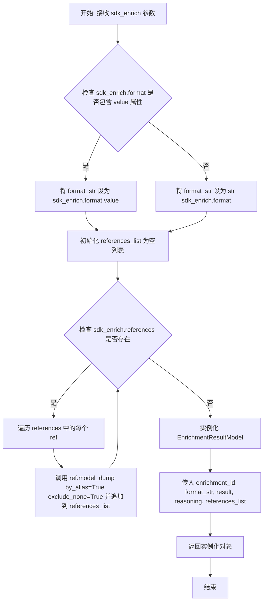

#### 带注释源码

```python
@classmethod
def from_sdk(cls, sdk_enrich) -> "EnrichmentResultModel":
    """Convert SDK EnrichmentResult to our model."""
    # 处理 format 字段：如果是枚举类型则取其 value，否则直接转为字符串
    format_str = (
        sdk_enrich.format.value
        if hasattr(sdk_enrich.format, "value")
        else str(sdk_enrich.format)
    )

    # Convert references to dicts
    # 初始化引用列表
    references_list = []
    # 如果 SDK 对象中存在 references，进行遍历转换
    if sdk_enrich.references:
        for ref in sdk_enrich.references:
            # 将每个 reference 对象序列化为字典，排除 None 值并使用别名
            references_list.append(ref.model_dump(by_alias=True, exclude_none=True))

    # 返回当前类的实例，填充转换后的数据
    return cls(
        enrichment_id=sdk_enrich.enrichment_id,
        format=format_str,
        result=sdk_enrich.result,
        reasoning=sdk_enrich.reasoning,
        references=references_list,
    )
```


### `WebsetItemModel.from_sdk`

该方法是一个类方法，用于将 Exa SDK 原生的 `SdkWebsetItem` 对象转换为项目内部定义的稳定数据模型 `WebsetItemModel`。此过程包括提取通用属性、根据具体的属性子类型（如 Person, Company, Article 等）解析特定字段、转换 enrichments 数据以及格式化时间戳。

参数：

- `item`：`SdkWebsetItem`，来自 Exa SDK 的原始 Webset Item 对象，包含待转换的数据。

返回值：`WebsetItemModel`，转换后的内部数据模型实例，确保了接口的稳定性。

#### 流程图

```mermaid
flowchart TD
    A[开始: from_sdk] --> B{检查 item.properties 是否存在且非空}
    B -- 否 --> C[保留默认值: url=None, title='', content='']
    B -- 是 --> D[将 properties 序列化为字典 properties_dict]
    D --> E[从 properties 获取 url_value]
    E --> F{判断 properties 的具体类型}
    
    F -- Person --> G[title = person.name, content = '']
    F -- Company --> H[title = company.name, content = content or '']
    F -- Article --> I[title = description, content = content or '']
    F -- ResearchPaper --> J[title = description, content = content or '']
    F -- Custom --> K[title = description, content = content or '']
    F -- 其他/Fallback --> L[title = description, content = content or '']
    
    G --> M{检查 item.enrichments 是否存在且非空}
    H --> M
    I --> M
    J --> M
    K --> M
    L --> M
    C --> M

    M -- 否 --> N[enrichments_dict = {}]
    M -- 是 --> O[遍历 enrichments 列表]
    O --> P[调用 EnrichmentResultModel.from_sdk 转换每项]
    P --> Q[以 enrichment_id 为键存入 enrichments_dict]
    Q --> R[格式化 created_at 和 updated_at 为 ISO 字符串]
    N --> R
    R --> S[实例化 WebsetItemModel 并返回]
    S --> T[结束]
```

#### 带注释源码

```python
    @classmethod
    def from_sdk(cls, item: SdkWebsetItem) -> "WebsetItemModel":
        """Convert SDK WebsetItem to our stable model."""
        # 初始化变量，用于存储提取的数据
        properties_dict = {}
        url_value = None
        title = ""
        content = ""

        # 检查并处理 properties 属性
        if hasattr(item, "properties") and item.properties:
            # 将 properties 对象转换为字典，排除 None 值，以便后续存入 entity_data
            properties_dict = item.properties.model_dump(
                by_alias=True, exclude_none=True
            )

            # URL 是所有属性类型共有的，直接提取
            url_value = item.properties.url

            # 根据具体的属性子类型提取特定的 title 和 content
            # SDK 的 properties 是一个联合类型，需要使用 isinstance 进行区分
            if isinstance(item.properties, WebsetItemPersonProperties):
                # Person 类型：使用 person.name 作为标题，无内容
                title = item.properties.person.name
                content = ""  # Person type has no content
            elif isinstance(item.properties, WebsetItemCompanyProperties):
                # Company 类型：使用 company.name 作为标题
                title = item.properties.company.name
                content = item.properties.content or ""
            elif isinstance(item.properties, WebsetItemArticleProperties):
                # Article 类型：使用 description 作为标题
                title = item.properties.description
                content = item.properties.content or ""
            elif isinstance(item.properties, WebsetItemResearchPaperProperties):
                # ResearchPaper 类型：使用 description 作为标题
                title = item.properties.description
                content = item.properties.content or ""
            elif isinstance(item.properties, WebsetItemCustomProperties):
                # Custom 类型：使用 description 作为标题
                title = item.properties.description
                content = item.properties.content or ""
            else:
                # 兜底逻辑：尝试获取 description 和 content
                title = item.properties.description
                content = getattr(item.properties, "content", "")

        # 转换 enrichments：将 SDK 的列表转换为以 enrichment_id 为键的字典
        enrichments_dict: Dict[str, EnrichmentResultModel] = {}
        if hasattr(item, "enrichments") and item.enrichments:
            for sdk_enrich in item.enrichments:
                # 递归调用 EnrichmentResultModel 的转换方法
                enrich_model = EnrichmentResultModel.from_sdk(sdk_enrich)
                enrichments_dict[enrich_model.enrichment_id] = enrich_model

        # 构造并返回最终的模型实例
        return cls(
            id=item.id,
            url=url_value,
            title=title,
            content=content or "",
            entity_data=properties_dict,         # 原始属性数据
            enrichments=enrichments_dict,         # 转换后的富集数据
            created_at=item.created_at.isoformat() if item.created_at else "", # 处理时间戳格式
            updated_at=item.updated_at.isoformat() if item.updated_at else "",
        )
```


### `ExaGetWebsetItemBlock.__init__`

初始化 `ExaGetWebsetItemBlock` 实例，通过调用父类构造函数并传入预定义的配置参数（如ID、描述、类别及输入输出Schema）来设置该Block的基本元数据结构。

参数：

- `self`：`ExaGetWebsetItemBlock`，类的实例引用。

返回值：`None`，初始化方法无返回值。

#### 流程图

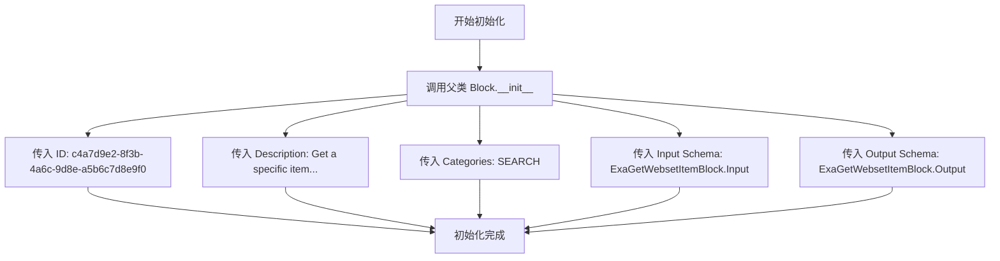

#### 带注释源码

```python
    def __init__(self):
        # 调用父类 Block 的初始化方法，配置 Block 的元数据
        super().__init__(
            # 设置 Block 的唯一标识符
            id="c4a7d9e2-8f3b-4a6c-9d8e-a5b6c7d8e9f0",
            # 设置 Block 的功能描述文本
            description="Get a specific item from a webset by its ID",
            # 设置 Block 所属的分类，这里为搜索类
            categories={BlockCategory.SEARCH},
            # 定义输入数据的 Schema，引用内部类 Input
            input_schema=ExaGetWebsetItemBlock.Input,
            # 定义输出数据的 Schema，引用内部类 Output
            output_schema=ExaGetWebsetItemBlock.Output,
        )
```


### `ExaGetWebsetItemBlock.run`

通过提供的 ID 和凭据从 Webset 中异步检索特定项目，将 SDK 响应转换为稳定的内部模型，并输出该项目的属性。

参数：

-  `input_data`：`ExaGetWebsetItemBlock.Input`，输入数据对象，包含要检索的项目的 `webset_id` 和 `item_id`。
-  `credentials`：`APIKeyCredentials`，包含 Exa API 密钥的凭据对象。
-  `**kwargs`：`Any`，执行框架传递的额外关键字参数。

返回值：`BlockOutput` (AsyncGenerator)，异步生成器，生成表示检索到的 Webset 项目字段（item_id, url, title, content, entity_data, enrichments, created_at, updated_at）的键值对。

#### 流程图

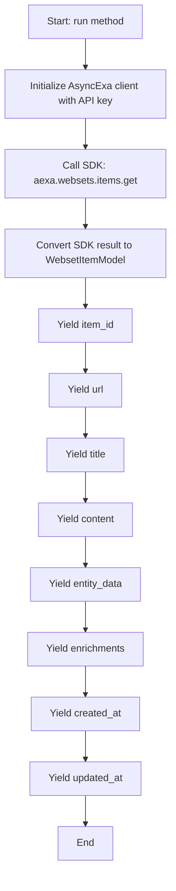

#### 带注释源码

```python
async def run(
    self, input_data: Input, *, credentials: APIKeyCredentials, **kwargs
) -> BlockOutput:
    # 使用凭据中提供的 API 密钥初始化 Exa 异步客户端
    aexa = AsyncExa(api_key=credentials.api_key.get_secret_value())

    # 调用 Exa SDK 根据输入的 webset_id 和 item_id 获取特定项目
    sdk_item = await aexa.websets.items.get(
        webset_id=input_data.webset_id, id=input_data.item_id
    )

    # 将 SDK 返回的原始对象转换为应用程序内部定义的稳定模型 (WebsetItemModel)
    # 这有助于解耦业务逻辑与 SDK 的具体实现细节
    item = WebsetItemModel.from_sdk(sdk_item)

    # 逐个生成（yield）项目的各个属性字段，符合 BlockOutput 的生成器接口规范
    yield "item_id", item.id
    yield "url", item.url
    yield "title", item.title
    yield "content", item.content
    yield "entity_data", item.entity_data
    yield "enrichments", item.enrichments
    yield "created_at", item.created_at
    yield "updated_at", item.updated_at
```


### `ExaListWebsetItemsBlock.__init__`

初始化 `ExaListWebsetItemsBlock` 类的实例，设置该块的元数据，包括唯一标识符、描述、所属分类以及输入输出的数据结构定义。

参数：

- `self`：`ExaListWebsetItemsBlock`，表示类实例本身。

返回值：`None`，该方法无返回值。

#### 流程图

```mermaid
flowchart TD
    A([开始 __init__]) --> B[调用 super().__init__]
    B --> C[设置 id: 7b5e8c9f-01a2-43c4-95e6-f7a8b9c0d1e2]
    B --> D[设置 description: List items in a webset with pagination support]
    B --> E[设置 categories: {BlockCategory.SEARCH}]
    B --> F[设置 input_schema: ExaListWebsetItemsBlock.Input]
    B --> G[设置 output_schema: ExaListWebsetItemsBlock.Output]
    C --> H([结束])
    D --> H
    E --> H
    F --> H
    G --> H
```

#### 带注释源码

```python
def __init__(self):
    # 调用父类 Block 的构造函数，配置该块的基本属性和行为
    super().__init__(
        # 定义块的唯一标识符
        id="7b5e8c9f-01a2-43c4-95e6-f7a8b9c0d1e2",
        # 定义块的描述文本，说明其功能为支持分页列出 webset 中的项目
        description="List items in a webset with pagination support",
        # 将块归类为 SEARCH 类别
        categories={BlockCategory.SEARCH},
        # 指定输入数据的验证模式为内部类 Input
        input_schema=ExaListWebsetItemsBlock.Input,
        # 指定输出数据的结构模式为内部类 Output
        output_schema=ExaListWebsetItemsBlock.Output,
    )
```


### `ExaListWebsetItemsBlock.run`

该方法负责从指定的 Exa Webset 中检索项目列表，支持分页查询和可选的等待数据机制。它会初始化 SDK 客户端，根据输入参数决定是否进行轮询等待，最终将原始 SDK 数据转换为稳定的内部模型并逐个输出结果。

参数：

- `input_data`：`ExaListWebsetItemsBlock.Input`，包含配置块行为的输入数据，具体字段包括 `webset_id`（Webset ID）、`limit`（返回数量限制）、`cursor`（分页游标）、`wait_for_items`（是否等待数据就绪）以及 `wait_timeout`（等待超时时间）。
- `credentials`：`APIKeyCredentials`，用于认证 Exa API 访问权限的凭证对象。
- `**kwargs`：`dict`，接收额外的关键字参数（通常由框架传递，本方法内部未直接使用）。

返回值：`BlockOutput`，一个异步生成器，按顺序产生包含以下键的元组：`items`（项目列表）、`item`（单个项目）、`has_more`（是否还有更多数据）、`next_cursor`（下一页游标）以及 `webset_id`。

#### 流程图

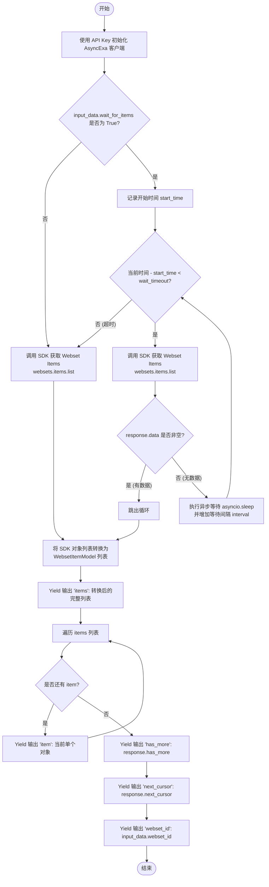

#### 带注释源码

```python
async def run(
    self, input_data: Input, *, credentials: APIKeyCredentials, **kwargs
) -> BlockOutput:
    # 使用提供的 API Key 初始化异步 Exa SDK 客户端
    aexa = AsyncExa(api_key=credentials.api_key.get_secret_value())

    # 检查是否配置了等待数据就绪的逻辑
    if input_data.wait_for_items:
        import asyncio
        import time

        start_time = time.time()
        interval = 2  # 初始轮询间隔为 2 秒
        response = None

        # 轮询循环，直到超时或获取到数据
        while time.time() - start_time < input_data.wait_timeout:
            # 尝试获取 Webset 项目列表
            response = await aexa.websets.items.list(
                webset_id=input_data.webset_id,
                cursor=input_data.cursor,
                limit=input_data.limit,
            )

            # 如果获取到了数据，跳出等待循环
            if response.data:
                break

            # 如果没有数据，等待一段时间后重试
            await asyncio.sleep(interval)
            # 指数退避策略：增加间隔时间，上限为 10 秒
            interval = min(interval * 1.2, 10)

        # 如果超时后 response 仍为 None（理论上循环结束总会执行最后一次 list，这里是兜底）
        if not response:
            response = await aexa.websets.items.list(
                webset_id=input_data.webset_id,
                cursor=input_data.cursor,
                limit=input_data.limit,
            )
    else:
        # 不等待模式，直接调用 API 获取列表
        response = await aexa.websets.items.list(
            webset_id=input_data.webset_id,
            cursor=input_data.cursor,
            limit=input_data.limit,
        )

    # 将 SDK 返回的数据模型转换为系统内部稳定的 WebsetItemModel
    items = [WebsetItemModel.from_sdk(item) for item in response.data]

    # 输出完整的项目列表
    yield "items", items

    # 遍历列表，逐个输出项目，便于下游流式处理
    for item in items:
        yield "item", item

    # 输出分页状态信息
    yield "has_more", response.has_more
    yield "next_cursor", response.next_cursor
    yield "webset_id", input_data.webset_id
```


### `ExaDeleteWebsetItemBlock.__init__`

该方法用于初始化 `ExaDeleteWebsetItemBlock` 类实例，配置块的基本元数据，包括唯一标识符、描述、所属类别以及输入输出模式的定义。

参数：

-   `无`：该方法不接受除了 `self` 之外的显式参数。

返回值：`None`，Python 构造函数的默认返回值，无实际返回内容。

#### 流程图

```mermaid
graph TD
    A[开始: 调用 __init__] --> B[定义块元数据]
    B --> C[设置 ID: 12c57fbe-c270-4877-a2b6-d2d05529ba79]
    B --> D[设置 Description: Delete a specific item...]
    B --> E[设置 Categories: SEARCH]
    B --> F[设置 Input Schema: ExaDeleteWebsetItemBlock.Input]
    B --> G[设置 Output Schema: ExaDeleteWebsetItemBlock.Output]
    C --> H[调用 super().__init__ 传入元数据]
    D --> H
    E --> H
    F --> H
    G --> H
    H --> I[结束: 实例初始化完成]
```

#### 带注释源码

```python
    def __init__(self):
        # 调用父类 Block 的初始化方法
        super().__init__(
            # 块的唯一标识符 (UUID)
            id="12c57fbe-c270-4877-a2b6-d2d05529ba79",
            # 块的功能描述，用于 UI 或文档展示
            description="Delete a specific item from a webset",
            # 定义块所属的分类，此处归属于 SEARCH (搜索) 类别
            categories={BlockCategory.SEARCH},
            # 指定输入数据的 Schema 定义，包含 credentials, webset_id, item_id
            input_schema=ExaDeleteWebsetItemBlock.Input,
            # 指定输出数据的 Schema 定义，包含 item_id, success
            output_schema=ExaDeleteWebsetItemBlock.Output,
        )
```


### `ExaDeleteWebsetItemBlock.run`

该方法通过Exa SDK异步执行删除操作，从指定的Webset中移除特定Item，并输出删除结果的确认信息。

参数：

- `input_data`：`ExaDeleteWebsetItemBlock.Input`，包含执行删除操作所需的输入数据，包括Webset ID和目标Item ID。
- `credentials`：`APIKeyCredentials`，用于认证和访问Exa API的密钥凭据。
- `**kwargs`：`Any`，接收其他额外的关键字参数。

返回值：`BlockOutput`，异步生成器，逐步产生删除后的Item ID及操作成功的状态标识。

#### 流程图

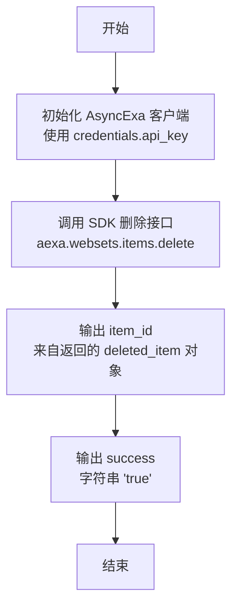

#### 带注释源码

```python
    async def run(
        self, input_data: Input, *, credentials: APIKeyCredentials, **kwargs
    ) -> BlockOutput:
        # 使用提供的API密钥初始化异步Exa客户端
        aexa = AsyncExa(api_key=credentials.api_key.get_secret_value())

        # 调用Exa SDK的delete方法，从指定webset中删除指定id的item
        deleted_item = await aexa.websets.items.delete(
            webset_id=input_data.webset_id, id=input_data.item_id
        )

        # 产生被删除item的ID
        yield "item_id", deleted_item.id
        # 产生操作成功的标识
        yield "success", "true"
```


### `ExaBulkWebsetItemsBlock.__init__`

初始化 ExaBulkWebsetItemsBlock 类的实例，配置其唯一标识符、描述、分类以及输入输出模式。

参数：

-   (无显式参数)

返回值：`None`，构造函数不返回任何值。

#### 流程图

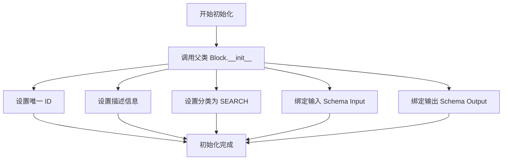

#### 带注释源码

```python
    def __init__(self):
        # 调用父类 Block 的构造函数，初始化块的基本配置
        super().__init__(
            # 定义该块在系统中的唯一标识符
            id="dbd619f5-476e-4395-af9a-a7a7c0fb8c4e",
            # 提供块的描述，说明其功能是在单次操作中批量获取 Webset 项（具有可配置限制）
            description="Get all items from a webset in bulk (with configurable limits)",
            # 将块归类为搜索类别
            categories={BlockCategory.SEARCH},
            # 指定输入数据的 Schema 定义，关联内部类 Input
            input_schema=ExaBulkWebsetItemsBlock.Input,
            # 指定输出数据的 Schema 定义，关联内部类 Output
            output_schema=ExaBulkWebsetItemsBlock.Output,
        )
```


### `ExaBulkWebsetItemsBlock.run`

该方法负责在单次操作中从指定的 Exa Webset 批量获取所有项目。它通过 SDK 的异步迭代器遍历 Webset 中的项目，根据输入参数限制最大获取数量，并可选择是否包含增强数据（enrichments）和完整内容（content），最终输出处理后的项目列表及相关统计信息。

参数：

- `input_data`：`ExaBulkWebsetItemsBlock.Input`，包含 Webset ID、最大获取数量、是否包含增强数据及内容等配置的输入对象。
- `credentials`：`APIKeyCredentials`，用于认证 Exa API 访问权限的凭证对象。
- `**kwargs`：`Any`，额外的关键字参数，用于扩展或传递运行时上下文。

返回值：`BlockOutput`，异步生成器，依次产生项目列表、单个项目实例、检索到的项目总数以及结果是否被截断的布尔值。

#### 流程图

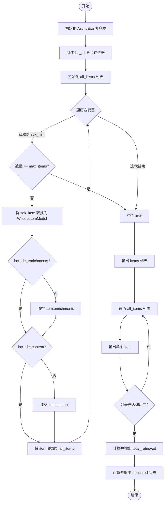

#### 带注释源码

```python
async def run(
    self, input_data: Input, *, credentials: APIKeyCredentials, **kwargs
) -> BlockOutput:
    # 使用传入的 API Key 初始化 Exa 异步客户端
    aexa = AsyncExa(api_key=credentials.api_key.get_secret_value())

    # 初始化用于存储所有项目的列表
    all_items: List[WebsetItemModel] = []
    
    # 调用 SDK 的 list_all 方法创建异步迭代器，设置 limit 为 max_items
    # 注意：SDK 的 list_all 方法本身处理分页，但我们在应用层也做数量限制
    item_iterator = aexa.websets.items.list_all(
        webset_id=input_data.webset_id, limit=input_data.max_items
    )

    # 异步遍历迭代器中的每个 SDK 项目
    async for sdk_item in item_iterator:
        # 检查是否已达到用户设定的最大数量限制
        if len(all_items) >= input_data.max_items:
            break

        # 将 SDK 原始项目转换为稳定的内部模型 WebsetItemModel
        item = WebsetItemModel.from_sdk(sdk_item)

        # 根据配置决定是否剔除增强数据
        if not input_data.include_enrichments:
            item.enrichments = {}
        
        # 根据配置决定是否剔除主要内容
        if not input_data.include_content:
            item.content = ""

        # 将处理后的项目加入结果列表
        all_items.append(item)

    # 输出完整的项目列表
    yield "items", all_items

    # 遍历列表，逐个输出项目，便于下游流式处理
    for item in all_items:
        yield "item", item

    # 输出实际检索到的项目总数
    yield "total_retrieved", len(all_items)
    
    # 输出布尔值，指示结果是否因为达到 max_items 限制而被截断
    yield "truncated", len(all_items) >= input_data.max_items
```


### `ExaWebsetItemsSummaryBlock.__init__`

该方法用于初始化ExaWebsetItemsSummaryBlock实例，通过调用父类构造函数并传入特定参数来配置块的基本元数据、输入输出模式及分类信息。

参数：

- `self`：`ExaWebsetItemsSummaryBlock`，表示类实例对象本身。

返回值：`None`，Python构造函数不返回任何值。

#### 流程图

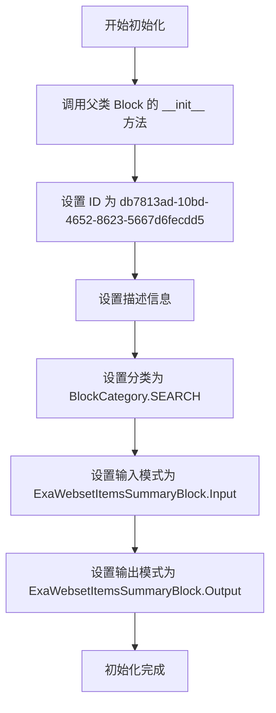

#### 带注释源码

```python
    def __init__(self):
        # 调用父类 Block 的初始化方法，配置该Block的元数据和Schema
        super().__init__(
            # 定义Block的唯一标识符
            id="db7813ad-10bd-4652-8623-5667d6fecdd5",
            # 定义Block的描述文本
            description="Get a summary of webset items without retrieving all data",
            # 定义Block所属的类别，此处为搜索类
            categories={BlockCategory.SEARCH},
            # 定义Block的输入数据结构Schema
            input_schema=ExaWebsetItemsSummaryBlock.Input,
            # 定义Block的输出数据结构Schema
            output_schema=ExaWebsetItemsSummaryBlock.Output,
        )
```


### `ExaWebsetItemsSummaryBlock.run`

获取 Webset 项目摘要的方法，通过检索 Webset 元数据计算项目总数、实体类型和可用的扩充列，并根据配置获取少量样本项目，避免检索全部数据。

参数：

-  `input_data`：`ExaWebsetItemsSummaryBlock.Input`，包含 Webset ID、凭据元数据和样本大小配置的输入对象。
-  `credentials`：`APIKeyCredentials`，用于 Exa API 认证的对象，包含 API 密钥。
-  `**kwargs`：`Any`，其他扩展的关键字参数。

返回值：`BlockOutput`，异步生成器，依次产出总项目数 (`total_items`)、实体类型 (`entity_type`)、样本项目列表 (`sample_items`) 和扩充列名列表 (`enrichment_columns`)。

#### 流程图

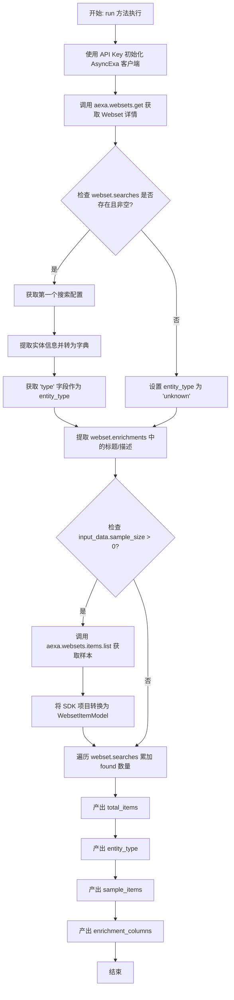

#### 带注释源码

```python
    async def run(
        self, input_data: Input, *, credentials: APIKeyCredentials, **kwargs
    ) -> BlockOutput:
        # 1. 初始化 AsyncExa SDK 客户端，使用传入的凭据
        aexa = AsyncExa(api_key=credentials.api_key.get_secret_value())

        # 2. 获取指定 Webset 的详细元数据
        webset = await aexa.websets.get(id=input_data.webset_id)

        # 3. 确定实体类型
        entity_type = "unknown"
        if webset.searches:
            first_search = webset.searches[0]
            if first_search.entity:
                # 实体是联合类型，需要提取 model_dump 中的 'type' 字段
                entity_dict = first_search.entity.model_dump(by_alias=True)
                entity_type = entity_dict.get("type", "unknown")

        # 4. 获取可用的扩充列名称列表
        enrichment_columns = []
        if webset.enrichments:
            enrichment_columns = [
                e.title if e.title else e.description for e in webset.enrichments
            ]

        # 5. 如果配置了样本大小大于0，则获取样本项目
        sample_items: List[WebsetItemModel] = []
        if input_data.sample_size > 0:
            items_response = await aexa.websets.items.list(
                webset_id=input_data.webset_id, limit=input_data.sample_size
            )
            # 将 SDK 返回的项目转换为稳定的内部模型
            sample_items = [
                WebsetItemModel.from_sdk(item) for item in items_response.data
            ]

        # 6. 计算总项目数（遍历所有搜索配置累加找到的项目数）
        total_items = 0
        if webset.searches:
            for search in webset.searches:
                if search.progress:
                    total_items += search.progress.found

        # 7. 产出运行结果
        yield "total_items", total_items
        yield "entity_type", entity_type
        yield "sample_items", sample_items
        yield "enrichment_columns", enrichment_columns
```


### `ExaGetNewItemsBlock.__init__`

初始化 `ExaGetNewItemsBlock` 实例，通过调用父类构造函数设置该块的唯一标识符、功能描述、所属分类以及输入输出数据的模式定义。

参数：

- `self`：`ExaGetNewItemsBlock`，表示当前类的实例

返回值：`None`，无返回值，主要用于实例对象的初始化配置

#### 流程图

```mermaid
flowchart TD
    A([开始]) --> B[调用父类 super().__init__]
    B --> C[设置 ID 为 3ff9bdf5-9613-4d21-8a60-90eb8b69c414]
    B --> D[设置 description 描述信息]
    B --> E[设置 categories 为 SEARCH 和 DATA]
    B --> F[设置 input_schema 为 ExaGetNewItemsBlock.Input]
    B --> G[设置 output_schema 为 ExaGetNewItemsBlock.Output]
    C --> H([结束])
    D --> H
    E --> H
    F --> H
    G --> H
```

#### 带注释源码

```python
def __init__(self):
    # 调用父类 Block 的初始化方法，注册块的元数据和配置
    super().__init__(
        # 定义该块的唯一标识符 (UUID)
        id="3ff9bdf5-9613-4d21-8a60-90eb8b69c414",
        # 定义该块的描述，说明其功能是获取自游标以来的增量项目，支持增量处理
        description="Get items added since a cursor - enables incremental processing without reprocessing",
        # 定义该块所属的类别，包括 SEARCH (搜索) 和 DATA (数据)
        categories={BlockCategory.SEARCH, BlockCategory.DATA},
        # 指定输入数据的验证模式，关联内部定义的 Input 类
        input_schema=ExaGetNewItemsBlock.Input,
        # 指定输出数据的验证模式，关联内部定义的 Output 类
        output_schema=ExaGetNewItemsBlock.Output,
    )
```


### `ExaGetNewItemsBlock.run`

获取自特定光标以来添加到 Webset 的项目（增量处理辅助工具）。

参数：

- `input_data`：`ExaGetNewItemsBlock.Input`，包含 webset_id、since_cursor 和 max_items 的输入数据对象。
- `credentials`：`APIKeyCredentials`，包含 API 密钥的认证对象。
- `**kwargs`：`dict`，额外的关键字参数。

返回值：`BlockOutput`，异步生成器，产出 WebsetItemModel 列表、单个项目、计数、下一个光标以及是否有更多数据的标志。

#### 流程图

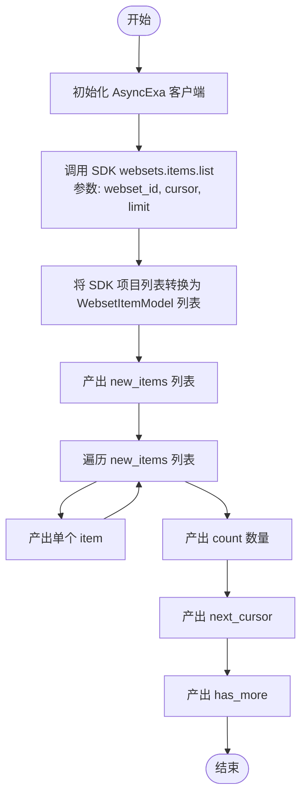

#### 带注释源码

```python
async def run(
    self, input_data: Input, *, credentials: APIKeyCredentials, **kwargs
) -> BlockOutput:
    # 使用获取的 API Key 初始化 Exa 异步客户端
    aexa = AsyncExa(api_key=credentials.api_key.get_secret_value())

    # 调用 SDK 接口获取项目列表
    # webset_id: 目标 webset ID
    # cursor: 增量获取的起始位置 (since_cursor)
    # limit: 本次获取的最大数量
    response = await aexa.websets.items.list(
        webset_id=input_data.webset_id,
        cursor=input_data.since_cursor,
        limit=input_data.max_items,
    )

    # 将 SDK 返回的 WebsetItem 对象转换为内部稳定的 WebsetItemModel
    new_items = [WebsetItemModel.from_sdk(item) for item in response.data]

    # 产出完整的新项目列表
    yield "new_items", new_items

    # 遍历并产出每一个新项目，方便下游逐个处理
    for item in new_items:
        yield "item", item

    # 产出本次获取的项目数量
    yield "count", len(new_items)
    
    # 产出下次请求应使用的光标，用于断点续传
    yield "next_cursor", response.next_cursor
    
    # 产出是否还有更多项目的标志
    yield "has_more", response.has_more
```


## 关键组件


### 稳定数据模型映射
适配器组件，通过 `EnrichmentResultModel` 和 `WebsetItemModel` 将 Exa SDK 的复杂联合类型和动态结构转换为稳定的、本地化的 Pydantic 模型，用于一致性数据输出。

### Webset 项目检索
直接访问组件，根据 Webset ID 和项目 ID 获取单个 Webset 项目，并将输出标准化为稳定模型格式。

### 分页列表与轮询机制
导航组件，通过游标支持检索 Webset 项目，并结合具有指数退避的重试逻辑，以等待异步 Webset 处理完成。

### 批量数据提取与选择性过滤
高性能检索组件，它遍历所有 Webset 项目，同时通过根据用户请求省略大型内容或丰富化字段来优化数据负载。

### Webset 元数据摘要
概览组件，用于检查 Webset 配置并检索高级信息，例如实体类型、总项目数和可用丰富列，以及可选的项目样本。

### 增量数据处理
面向状态的组件，它利用游标获取自最后一个已知状态以来添加的新 Webset 项目，实现高效的增量工作流。

### 资源删除管理
生命周期管理组件，用于从指定的 Webset 中永久移除项目并返回操作结果。


## 问题及建议


### 已知问题

-   **缺乏统一的错误处理机制**：代码中所有的 `run` 方法都直接调用 SDK 的异步方法（如 `await aexa.websets.items.get`），但未包含 `try-except` 块。如果 API 调用失败（例如网络错误、401 未授权、404 未找到或 500 服务器错误），异常将直接向上抛出，导致 Block 执行失败且无法给用户提供友好的错误信息或重试机会。
-   **`WebsetItemModel.from_sdk` 中的类型判断逻辑脆弱**：该方法使用了一长串的 `isinstance` 检查来处理联合类型（如 `WebsetItemPersonProperties`, `WebsetItemCompanyProperties` 等）。这种硬编码的类型检查维护性差，一旦 SDK 引入新的属性类型，代码将面临潜在的运行时错误或数据丢失风险。
-   **`ExaWebsetItemsSummaryBlock` 存在空指针风险**：在计算 `total_items` 时，代码直接访问 `search.progress.found`，如果 `search.progress` 为 `None`，这将导致 `AttributeError`。
-   **代码中存在局部导入**：在 `ExaListWebsetItemsBlock` 的 `run` 方法内部，导入了 `asyncio` 和 `time`。虽然这在 Python 中是合法的，但通常不符合最佳实践，特别是在类库或框架代码中，应当将所有依赖导入放在文件顶部。
-   **轮询逻辑可能存在边界情况**：在 `ExaListWebsetItemsBlock` 的 `wait_for_items` 逻辑中，如果 `response` 在循环内从未被赋值（例如超时极短），循环结束后的 `if not response` 判断虽然尝试补救，但在 `time.time()` 判断逻辑下，如果 `input_data.wait_timeout` 极小可能导致逻辑混乱。

### 优化建议

-   **引入 `match/case` 结构优化类型判断**：如果项目环境支持 Python 3.10+，建议在 `WebsetItemModel.from_sdk` 方法中使用 `match/case` 语句替代当前的 `if-elif-else` 链，以提高代码的可读性和可维护性，同时也更方便处理联合类型的分发。
-   **提取公共逻辑以减少代码重复**：每个 Block 的 `run` 方法中都重复实例化了 `AsyncExa` 客户端并使用了相同的 API Key 获取逻辑。建议创建一个基础类或辅助函数来统一管理 SDK 客户端的创建和凭证处理。
-   **增加空值与属性安全检查**：在 `ExaWebsetItemsSummaryBlock` 中，应添加对 `search.progress` 是否存在的检查（例如使用 `getattr(search.progress, 'found', 0)`），防止因数据不完整导致的崩溃。
-   **将局部导入移至文件顶部**：将 `ExaListWebsetItemsBlock` 中的 `import asyncio` 和 `import time` 移至文件的全局导入区域，保持代码结构的整洁和规范。
-   **实现客户端复用或连接池**：`AsyncExa` 对象在每个 Block 运行时都被重新创建。频繁的创建和销毁可能会带来不必要的性能开销。如果框架支持，可以在上下文或生命周期中复用客户端实例，或者利用 SDK 内部提供的连接池机制（如有）。
-   **完善错误反馈**：在所有涉及 I/O 操作的 Block 中添加 `try-except` 块，捕获 SDK 可能抛出的异常（如 `exa_py.errors.ExaAPIError` 等），并将其转换为 Block 的标准错误输出（例如 yield 一个 `error` 字段），以便下游流程能够感知并处理错误。


## 其它


### 设计目标与约束

**设计目标**
1.  **SDK 解耦与稳定性**：通过定义 `WebsetItemModel` 和 `EnrichmentResultModel` 作为镜像模型，隔离底层 `exa_py` SDK 的变更。确保即使 SDK 内部结构发生变化，Block 的输出接口保持稳定，避免破坏下游依赖。
2.  **异步非阻塞 I/O**：所有 Block 均设计为异步执行（`async def run`），利用 `AsyncExa` 客户端，确保在高并发或网络延迟场景下不阻塞主线程或事件循环。
3.  **灵活的数据获取能力**：提供多种维度的数据访问方式，包括单条获取、分页列表、批量获取、增量获取以及摘要获取，以适应不同的业务场景（如实时流处理、全量同步等）。
4.  **用户体验优化**：在 `ExaListWebsetItemsBlock` 中实现了 `wait_for_items` 机制，自动轮询等待 Webset 处理完成，减少用户端处理“数据未就绪”状态的复杂度。

**约束条件**
1.  **API 限制**：必须遵守 Exa API 的速率限制和分页规则。例如，单次请求的 `limit` 参数受到严格限制（通常 1-100 或 1-1000）。
2.  **内存限制**：在 `ExaBulkWebsetItemsBlock` 中，尽管使用了迭代器，但最终结果列表 `all_items` 会被加载到内存中。虽然设置了 `max_items` 上限（默认 1000），但在获取超大 Webset 时仍需注意内存消耗。
3.  **数据一致性**：镜像模型仅包含 SDK 模型的部分字段。如果 Exa API 返回了新增的必要字段而镜像模型未更新，这些数据将会被丢弃。

### 错误处理与异常设计

1.  **输入验证**：
    *   利用 `pydantic` 的 `BlockSchemaInput` 自动处理输入数据的类型检查和约束验证（如 `ge=1`, `le=100`）。如果输入不符合要求，框架将在执行 `run` 方法前抛出 `ValidationError`。
2.  **异常传播**：
    *   代码中的 `run` 方法内部没有显式的 `try-except` 块捕获网络或 API 错误。这意味着 `exa_py` SDK 抛出的异常（如认证失败 `InvalidAPIKeyError`、资源不存在 `NotFoundError`、网络超时等）将直接向上传播给调用方（即 Block 执行框架）。
    *   这种设计依赖上层框架进行全局的错误捕获、日志记录和用户通知。
3.  **特定重试/轮询逻辑**：
    *   针对 Webset 处理尚未完成的情况，`ExaListWebsetItemsBlock` 实现了自定义的轮询逻辑。它通过检查 `response.data` 是否为空来判断是否需要重试，并带有指数退避策略（`interval * 1.2`）和超时控制（`wait_timeout`），以避免无效的死循环请求。

### 数据流与状态机

**数据流**
1.  **输入阶段**：外部调用者传入参数（如 `webset_id`, `credentials`），经 Pydantic 验证后生成 `Input` 对象。
2.  **适配阶段**：Block 使用凭证实例化 `AsyncExa` 客户端。发起异步请求调用 SDK 方法（如 `aexa.websets.items.get`）。
3.  **转换阶段**：获取到 SDK 返回的原始数据对象（如 `SdkWebsetItem`）后，调用 `WebsetItemModel.from_sdk()` 静态方法。该方法处理复杂的联合类型判断（`isinstance` 检查）和数据提取，将 SDK 对象映射为标准的 Pydantic 模型。
4.  **输出阶段**：转换后的模型对象通过 `yield` 生成器逐步产出，符合 Block 框架的流式输出规范。

**状态机**
该模块中的 Block 大多为无状态，每次调用独立运行。
例外情况是 **增量处理**（`ExaGetNewItemsBlock`）：
*   **状态存储**：通过 `cursor`（游标）和 `next_cursor` 在外部维护处理状态。
*   **流转逻辑**：用户传入 `since_cursor`（初始为空） -> Block 查询该游标之后的数据 -> 返回新数据和 `next_cursor` -> 用户保存 `next_cursor` 用于下一次调用。这构成了一个只向前的增量同步状态机。

### 外部依赖与接口契约

1.  **`exa_py` (Exa Python SDK)**：
    *   **契约**：Block 依赖于 SDK 提供的 `AsyncExa` 客户端及其 `websets.items` 子模块（`get`, `list`, `delete`, `list_all`）。
    *   **稳定性假设**：假设 SDK 的 `model_dump()` 方法和 `isoformat()` 方法行为稳定。假设 SDK 的分页逻辑（`cursor`, `has_more`, `next_cursor`）保持不变。

2.  **`backend.sdk` (Internal Framework)**：
    *   **契约**：所有 Block 必须继承自 `Block` 基类。
    *   **接口要求**：必须实现 `__init__`（注册 ID, Schema 等）和 `async run(self, input_data, *, credentials, **kwargs)` 方法。
    *   **Schema 定义**：必须使用 `BlockSchemaInput` 和 `BlockSchemaOutput` 定义输入输出端口，并使用 `SchemaField` 进行描述。
    *   **认证**：必须能够处理 `APIKeyCredentials` 类型的凭证对象。

3.  **`pydantic`**：
    *   **契约**：用于数据结构的定义、验证和序列化。Block 的输入输出模型以及内部的数据模型 (`WebsetItemModel`) 必须是 `BaseModel` 的子类。

    