# `AutoGPT\autogpt_platform\backend\backend\blocks\exa\websets_monitor.py` 详细设计文档

该代码模块定义了一组用于管理 Exa Webset 监控器（Monitor）的 Block，包括创建、获取、更新、删除和列表显示功能。它通过封装 Exa SDK 调用、使用 Pydantic 模型进行数据验证与转换，以及定义详细的输入输出 Schema，实现了对监控任务生命周期的自动化管理。

## 整体流程

```mermaid
graph TD
    A[开始: 接收输入数据] --> B{选择操作类型}
    B -- Create --> C[构建 Payload (配置行为, 调度)]
    B -- Get --> D[获取 Monitor ID]
    B -- Update --> E[构建 Update Payload (状态, 调度, 元数据)]
    B -- Delete --> F[获取 Monitor ID]
    B -- List --> G[构建查询参数 (过滤, 分页)]
    C --> H[初始化 AsyncExa 客户端]
    D --> H
    E --> H
    F --> H
    G --> H
    H --> I[调用 Exa SDK API]
    I --> J[SDK 返回 SdkMonitor 对象]
    J --> K[使用 MonitorModel.from_sdk 转换数据]
    K --> L[产生输出数据]
    L --> M[结束]
```

## 类结构

```
BaseModel (Pydantic)
└── MonitorModel (稳定数据模型)

Enum (枚举类)
├── MonitorStatus (监控状态)
├── MonitorBehaviorType (行为类型)
└── SearchBehavior (搜索行为)

Block (基类)
├── ExaCreateMonitorBlock (创建监控)
│   ├── Input (输入 Schema)
│   └── Output (输出 Schema)
├── ExaGetMonitorBlock (获取监控)
│   ├── Input
│   └── Output
├── ExaUpdateMonitorBlock (更新监控)
│   ├── Input
│   └── Output
├── ExaDeleteMonitorBlock (删除监控)
│   ├── Input
│   └── Output
└── ExaListMonitorsBlock (列表监控)
    ├── Input
    └── Output
```

## 全局变量及字段


### `MonitorModel.id`
    
The unique identifier for the monitor.

类型：`str`
    


### `MonitorModel.status`
    
The current status of the monitor.

类型：`str`
    


### `MonitorModel.webset_id`
    
The ID of the webset this monitor belongs to.

类型：`str`
    


### `MonitorModel.behavior_type`
    
The type of behavior the monitor performs (e.g., search or refresh).

类型：`str`
    


### `MonitorModel.behavior_config`
    
Configuration details for the monitor's behavior.

类型：`dict`
    


### `MonitorModel.cron_expression`
    
The cron expression defining the monitor's schedule.

类型：`str`
    


### `MonitorModel.timezone`
    
The timezone in which the schedule runs.

类型：`str`
    


### `MonitorModel.next_run_at`
    
The timestamp for when the monitor is scheduled to run next.

类型：`str`
    


### `MonitorModel.last_run`
    
Information about the last execution of the monitor.

类型：`dict`
    


### `MonitorModel.metadata`
    
Additional metadata attached to the monitor.

类型：`dict`
    


### `MonitorModel.created_at`
    
The timestamp when the monitor was created.

类型：`str`
    


### `MonitorModel.updated_at`
    
The timestamp when the monitor was last updated.

类型：`str`
    


### `MonitorStatus.ENABLED`
    
Represents an active monitor state.

类型：`MonitorStatus`
    


### `MonitorStatus.DISABLED`
    
Represents an inactive monitor state.

类型：`MonitorStatus`
    


### `MonitorStatus.PAUSED`
    
Represents a paused monitor state.

类型：`MonitorStatus`
    


### `MonitorBehaviorType.SEARCH`
    
Behavior type to run new searches.

类型：`MonitorBehaviorType`
    


### `MonitorBehaviorType.REFRESH`
    
Behavior type to refresh existing items.

类型：`MonitorBehaviorType`
    


### `SearchBehavior.APPEND`
    
Mode to append search results to existing items.

类型：`SearchBehavior`
    


### `SearchBehavior.OVERRIDE`
    
Mode to override existing items with search results.

类型：`SearchBehavior`
    


### `ExaCreateMonitorBlock.Input`
    
Input schema defining parameters for creating a monitor.

类型：`BlockSchemaInput`
    


### `ExaCreateMonitorBlock.Output`
    
Output schema defining the result of creating a monitor.

类型：`BlockSchemaOutput`
    


### `ExaGetMonitorBlock.Input`
    
Input schema for retrieving a monitor's details.

类型：`BlockSchemaInput`
    


### `ExaGetMonitorBlock.Output`
    
Output schema containing the monitor's details.

类型：`BlockSchemaOutput`
    


### `ExaUpdateMonitorBlock.Input`
    
Input schema for updating a monitor's configuration.

类型：`BlockSchemaInput`
    


### `ExaUpdateMonitorBlock.Output`
    
Output schema confirming the update of a monitor.

类型：`BlockSchemaOutput`
    


### `ExaDeleteMonitorBlock.Input`
    
Input schema for deleting a monitor.

类型：`BlockSchemaInput`
    


### `ExaDeleteMonitorBlock.Output`
    
Output schema confirming the deletion of a monitor.

类型：`BlockSchemaOutput`
    


### `ExaListMonitorsBlock.Input`
    
Input schema for listing monitors with pagination.

类型：`BlockSchemaInput`
    


### `ExaListMonitorsBlock.Output`
    
Output schema containing a list of monitors and pagination info.

类型：`BlockSchemaOutput`
    
    

## 全局函数及方法


### `MonitorModel.from_sdk`

将外部 SDK Monitor 对象转换为内部稳定的 `MonitorModel` 数据类。该方法负责从 SDK 对象中提取嵌套的行为配置、调度信息（cadence）、运行记录，并处理枚举类型转换为字符串、日期对象转换为 ISO 格式字符串以及空值处理，以确保数据模型的稳定性。

参数：

- `monitor`：`SdkMonitor`，来自 Exa SDK 的原始 Monitor 对象，包含监控器的完整信息。

返回值：`MonitorModel`，经过转换和处理后的稳定数据模型实例。

#### 流程图

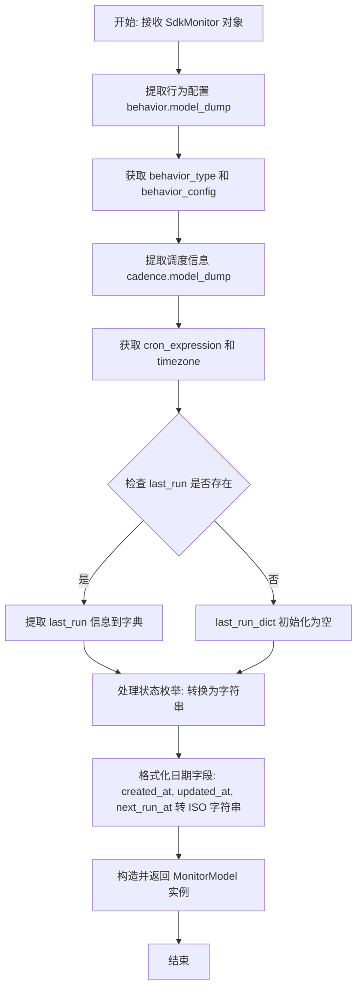

#### 带注释源码

```python
@classmethod
def from_sdk(cls, monitor: SdkMonitor) -> "MonitorModel":
    """Convert SDK Monitor to our stable model."""
    # 提取行为信息，使用 model_dump 转换为字典，并排除 None 值
    behavior_dict = monitor.behavior.model_dump(by_alias=True, exclude_none=True)
    # 获取行为类型，默认为 "unknown"
    behavior_type = behavior_dict.get("type", "unknown")
    # 获取行为配置详情
    behavior_config = behavior_dict.get("config", {})

    # 提取周期性调度（Cadence）信息
    cadence_dict = monitor.cadence.model_dump(by_alias=True, exclude_none=True)
    # 获取 Cron 表达式
    cron_expr = cadence_dict.get("cron", "")
    # 获取时区，默认为 "Etc/UTC"
    timezone = cadence_dict.get("timezone", "Etc/UTC")

    # 提取上次运行信息
    last_run_dict = {}
    if monitor.last_run:
        # 如果存在运行记录，将其转换为字典
        last_run_dict = monitor.last_run.model_dump(
            by_alias=True, exclude_none=True
        )

    # 处理状态枚举，将其转换为字符串值
    status_str = (
        monitor.status.value
        if hasattr(monitor.status, "value")
        else str(monitor.status)
    )

    # 返回初始化后的 MonitorModel 实例
    return cls(
        id=monitor.id,
        status=status_str,
        webset_id=monitor.webset_id,
        behavior_type=behavior_type,
        behavior_config=behavior_config,
        cron_expression=cron_expr,
        timezone=timezone,
        # 将 datetime 对象转换为 ISO 格式字符串，若为空则返回空字符串
        next_run_at=monitor.next_run_at.isoformat() if monitor.next_run_at else "",
        last_run=last_run_dict,
        metadata=monitor.metadata or {},
        created_at=monitor.created_at.isoformat() if monitor.created_at else "",
        updated_at=monitor.updated_at.isoformat() if monitor.updated_at else "",
    )
```


### `ExaCreateMonitorBlock.__init__`

该方法用于初始化 `ExaCreateMonitorBlock` 类实例。它配置了块的唯一标识符、描述、分类、输入输出模式以及用于测试的模拟数据和凭据，最终调用父类 `Block` 的初始化方法完成构建。

参数：

无（该方法仅接受 `self` 作为隐式参数）。

返回值：`None`，构造函数不返回任何值。

#### 流程图

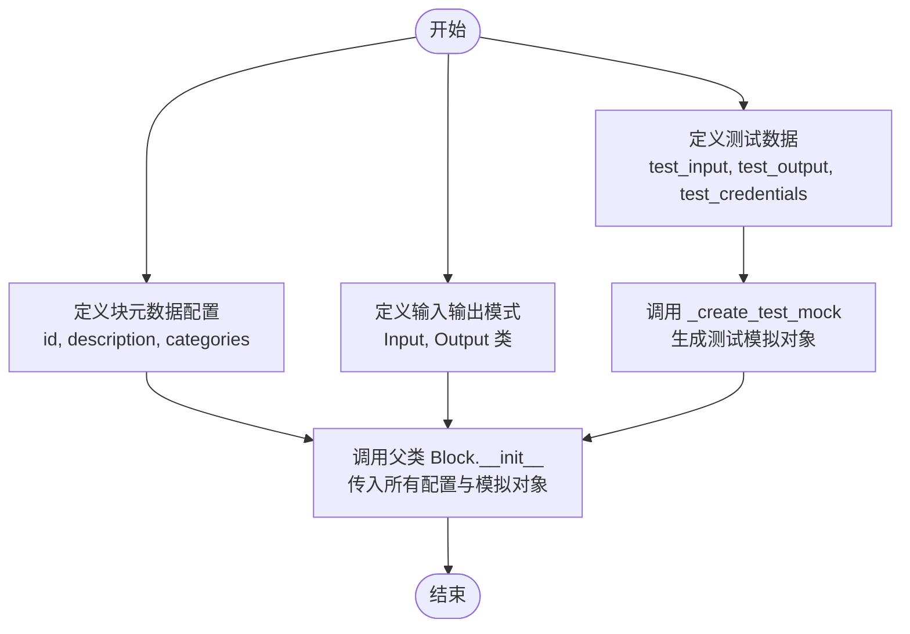

#### 带注释源码

```python
    def __init__(self):
        # 调用父类 Block 的初始化方法，传入块的基本配置和测试环境设置
        super().__init__(
            # 块的唯一标识符
            id="f8a9b0c1-d2e3-4567-890a-bcdef1234567",
            # 块的功能描述，说明其用于创建自动化的 Webset 监视器
            description="Create automated monitors to keep websets updated with fresh data on a schedule",
            # 块所属的分类，这里归类为 SEARCH
            categories={BlockCategory.SEARCH},
            # 指定该块的输入数据结构模式
            input_schema=ExaCreateMonitorBlock.Input,
            # 指定该块的输出数据结构模式
            output_schema=ExaCreateMonitorBlock.Output,
            # 定义用于测试的输入数据，包含模拟的凭据、Webset ID、Cron 表达式等
            test_input={
                "credentials": TEST_CREDENTIALS_INPUT,
                "webset_id": "test-webset",
                "cron_expression": "0 9 * * 1",
                "behavior_type": MonitorBehaviorType.SEARCH,
                "search_query": "AI startups",
                "search_count": 10,
            },
            # 定义预期的测试输出数据，验证块执行后的正确性
            test_output=[
                ("monitor_id", "monitor-123"),
                ("webset_id", "test-webset"),
                ("status", "enabled"),
                ("behavior_type", "search"),
                ("next_run_at", "2024-01-01T00:00:00"),
                ("cron_expression", "0 9 * * 1"),
                ("timezone", "Etc/UTC"),
                ("created_at", "2024-01-01T00:00:00"),
            ],
            # 测试时使用的凭据对象
            test_credentials=TEST_CREDENTIALS,
            # 获取测试模拟对象，用于模拟外部 SDK 调用
            test_mock=self._create_test_mock(),
        )
```


### `ExaCreateMonitorBlock._create_test_mock`

该静态方法用于为 `AsyncExa` SDK 创建测试模拟对象，旨在绕过真实的 API 调用，返回一个预定义的、结构完整的 Monitor 对象，以便在单元测试中验证 Block 的运行逻辑。

参数：

返回值：`dict`，包含模拟方法的字典，键名为 `_get_client`，值为一个 lambda 函数，该函数返回模拟的 Exa 客户端及其调用链。

#### 流程图

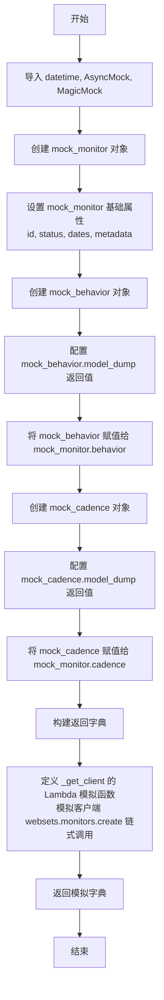

#### 带注释源码

```python
    @staticmethod
    def _create_test_mock():
        """Create test mocks for the AsyncExa SDK."""
        from datetime import datetime
        from unittest.mock import AsyncMock, MagicMock

        # 创建模拟的 SDK Monitor 对象
        mock_monitor = MagicMock()
        # 设置 Monitor 的基础属性
        mock_monitor.id = "monitor-123"
        # 模拟 status 属性，它是一个包含 value 属性的对象
        mock_monitor.status = MagicMock(value="enabled")
        mock_monitor.webset_id = "test-webset"
        # 模拟时间字段，使用 datetime 对象
        mock_monitor.next_run_at = datetime.fromisoformat("2024-01-01T00:00:00")
        mock_monitor.created_at = datetime.fromisoformat("2024-01-01T00:00:00")
        mock_monitor.updated_at = datetime.fromisoformat("2024-01-01T00:00:00")
        mock_monitor.metadata = {}
        mock_monitor.last_run = None

        # 模拟 behavior 对象
        mock_behavior = MagicMock()
        # 配置 model_dump 方法返回特定的字典结构
        mock_behavior.model_dump = MagicMock(
            return_value={"type": "search", "config": {}}
        )
        # 将 behavior 关联到 monitor
        mock_monitor.behavior = mock_behavior

        # 模拟 cadence 对象
        mock_cadence = MagicMock()
        # 配置 model_dump 方法返回 cron 和 timezone 信息
        mock_cadence.model_dump = MagicMock(
            return_value={"cron": "0 9 * * 1", "timezone": "Etc/UTC"}
        )
        # 将 cadence 关联到 monitor
        mock_monitor.cadence = mock_cadence

        # 返回一个字典，用于替换类中的 _get_client 方法
        return {
            "_get_client": lambda *args, **kwargs: MagicMock(
                # 模拟 AsyncExa 客户端的 websets 属性
                websets=MagicMock(
                    # 模拟 monitors 属性
                    monitors=MagicMock(
                        # 模拟 create 方法，使其返回上面构造好的 mock_monitor
                        create=AsyncMock(return_value=mock_monitor)
                    )
                )
            )
        }
```


### `ExaCreateMonitorBlock._get_client`

获取 Exa 客户端（该方法被分离出来以便于进行单元测试）。

参数：

- `api_key`：`str`，用于认证和初始化 SDK 客户端的 API 密钥字符串。

返回值：`AsyncExa`，配置好 API 密钥的 Exa 异步客户端实例。

#### 流程图

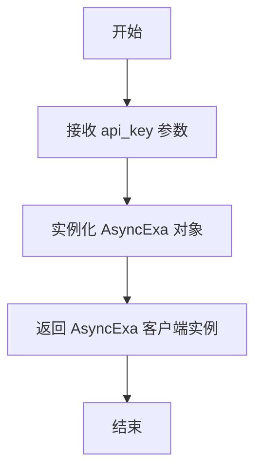

#### 带注释源码

```python
def _get_client(self, api_key: str) -> AsyncExa:
    """Get Exa client (separated for testing)."""
    # 使用提供的 API 密钥实例化并返回 Exa 的异步客户端
    return AsyncExa(api_key=api_key)
```


### `ExaCreateMonitorBlock.run`

该方法负责执行创建监控器（Monitor）的核心逻辑。它根据输入的参数构建请求负载，通过 Exa SDK 异步创建监控器，并将返回的 SDK 对象转换为稳定的内部模型后输出。

参数：

- `input_data`：`ExaCreateMonitorBlock.Input`，包含创建监控器所需的所有输入数据，如 Webset ID、调度配置（Cron表达式、时区）以及行为配置（搜索或刷新参数）。
- `credentials`：`APIKeyCredentials`，用于身份验证的 Exa API 密钥凭证。
- `**kwargs`：`dict`，额外的关键字参数，用于扩展性或上下文传递。

返回值：`BlockOutput`，一个异步生成器，逐个产生创建成功的监控器的详细信息字段（如 monitor_id, status 等）。

#### 流程图

```mermaid
flowchart TD
    A([开始]) --> B[获取 Exa 客户端实例]
    B --> C[初始化 Payload 基础字段<br/>websetId, cadence]
    C --> D{检查行为类型}
    D -->|SEARCH (搜索)| E[构建搜索行为配置<br/>query, count, behavior, criteria, entity]
    E --> G[将搜索配置加入 Payload]
    D -->|REFRESH (刷新)| F[构建刷新行为配置<br/>content, enrichments]
    F --> H[将刷新配置加入 Payload]
    G --> I{是否有元数据?}
    H --> I
    I -->|是| J[将 metadata 加入 Payload]
    I -->|否| K[调用 SDK 创建监控器<br/>aexa.websets.monitors.create]
    J --> K
    K --> L[将 SDK 监控器对象转换为<br/>内部 MonitorModel]
    L --> M[逐个产生输出字段]
    M --> N([结束])
```

#### 带注释源码

```python
async def run(
    self, input_data: Input, *, credentials: APIKeyCredentials, **kwargs
) -> BlockOutput:
    # 使用提供的 API 密钥初始化 Exa 异步客户端
    aexa = self._get_client(credentials.api_key.get_secret_value())

    # 构建请求负载的基础部分，包含 Webset ID 和 调度设置（Cron 和 时区）
    payload = {
        "websetId": input_data.webset_id,
        "cadence": {
            "cron": input_data.cron_expression,
            "timezone": input_data.timezone,
        },
    }

    # 根据监控器行为类型构建不同的配置
    if input_data.behavior_type == MonitorBehaviorType.SEARCH:
        # 构建搜索行为配置：查询词、数量、结果处理方式等
        behavior_config = {
            "query": input_data.search_query or "",
            "count": input_data.search_count,
            "behavior": input_data.search_behavior.value,
        }

        # 如果提供了搜索条件，添加到配置中
        if input_data.search_criteria:
            behavior_config["criteria"] = [
                {"description": c} for c in input_data.search_criteria
            ]

        # 如果指定了实体类型，添加到配置中
        if input_data.entity_type:
            behavior_config["entity"] = {"type": input_data.entity_type}

        # 将搜索行为配置加入 Payload
        payload["behavior"] = {
            "type": "search",
            "config": behavior_config,
        }
    else:
        # 构建刷新行为配置：是否刷新内容和增强数据
        payload["behavior"] = {
            "type": "refresh",
            "config": {
                "content": input_data.refresh_content,
                "enrichments": input_data.refresh_enrichments,
            },
        }

    # 如果提供了元数据，将其加入 Payload
    if input_data.metadata:
        payload["metadata"] = input_data.metadata

    # 调用 Exa SDK 的 create 方法创建监控器
    sdk_monitor = await aexa.websets.monitors.create(params=payload)

    # 将 SDK 返回的监控器对象转换为稳定的内部数据模型 MonitorModel
    monitor = MonitorModel.from_sdk(sdk_monitor)

    # 按顺序产生监控器的各个字段作为输出
    yield "monitor_id", monitor.id
    yield "webset_id", monitor.webset_id
    yield "status", monitor.status
    yield "behavior_type", monitor.behavior_type
    yield "next_run_at", monitor.next_run_at
    yield "cron_expression", monitor.cron_expression
    yield "timezone", monitor.timezone
    yield "created_at", monitor.created_at
```


### `ExaGetMonitorBlock.__init__`

初始化 `ExaGetMonitorBlock`，通过配置其唯一标识符、描述、类别以及输入输出模式，来注册一个用于获取 Webset Monitor 详细信息的块。

参数：

- `self`：`ExaGetMonitorBlock`，类的实例本身。

返回值：`None`，该方法为构造函数，无返回值。

#### 流程图

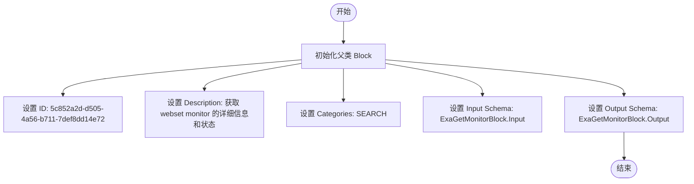

#### 带注释源码

```python
def __init__(self):
    # 调用父类 Block 的初始化方法
    super().__init__(
        # 定义该块的唯一 ID
        id="5c852a2d-d505-4a56-b711-7def8dd14e72",
        # 定义该块的描述信息
        description="Get the details and status of a webset monitor",
        # 定义该块所属的类别
        categories={BlockCategory.SEARCH},
        # 定义输入数据的 Schema 结构，引用内部类 Input
        input_schema=ExaGetMonitorBlock.Input,
        # 定义输出数据的 Schema 结构，引用内部类 Output
        output_schema=ExaGetMonitorBlock.Output,
    )
```


### `ExaGetMonitorBlock.run`

该方法负责通过 Exa SDK 获取指定 Monitor 的详细信息，将其转换为系统内部稳定的模型格式，并逐个产出 Monitor 的属性字段。

参数：

-  `input_data`：`ExaGetMonitorBlock.Input`，包含执行操作所需的输入数据，例如 `credentials`（凭证）和 `monitor_id`（监控ID）。
-  `credentials`：`APIKeyCredentials`，用于身份验证的 API 密钥凭证对象。
-  `**kwargs`：`dict`，其他额外的关键字参数。

返回值：`BlockOutput`，一个异步生成器，用于产出 Monitor 的各个属性键值对。

#### 流程图

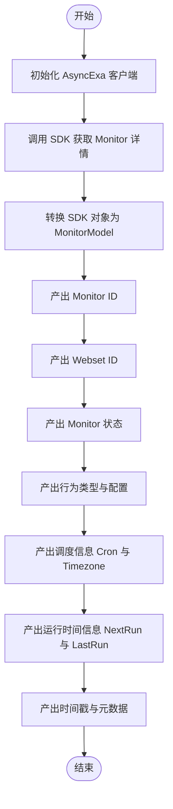

#### 带注释源码

```python
async def run(
    self, input_data: Input, *, credentials: APIKeyCredentials, **kwargs
) -> BlockOutput:
    # 使用提供的 API 密钥初始化 AsyncExa SDK 客户端
    aexa = AsyncExa(api_key=credentials.api_key.get_secret_value())

    # 通过 SDK 调用 get 方法，传入 monitor_id 以获取远程 Monitor 对象
    sdk_monitor = await aexa.websets.monitors.get(monitor_id=input_data.monitor_id)

    # 将可能变化的 SDK Monitor 对象转换为内部定义的稳定 MonitorModel
    monitor = MonitorModel.from_sdk(sdk_monitor)

    # 产出 monitor 的唯一标识符
    yield "monitor_id", monitor.id
    # 产出 monitor 所属的 webset ID
    yield "webset_id", monitor.webset_id
    # 产出 monitor 的当前状态
    yield "status", monitor.status
    # 产出 monitor 的行为类型（如 search 或 refresh）
    yield "behavior_type", monitor.behavior_type
    # 产出行为的具体配置字典
    yield "behavior_config", monitor.behavior_config
    # 产出 cron 表达式形式的调度规则
    yield "cron_expression", monitor.cron_expression
    # 产出调度使用的时区
    yield "timezone", monitor.timezone
    # 产出下一次计划运行的时间字符串
    yield "next_run_at", monitor.next_run_at
    # 产出关于上次运行的详细信息字典
    yield "last_run", monitor.last_run
    # 产出 monitor 的创建时间字符串
    yield "created_at", monitor.created_at
    # 产出 monitor 的最后更新时间字符串
    yield "updated_at", monitor.updated_at
    # 产出附加在 monitor 上的元数据字典
    yield "metadata", monitor.metadata
```


### `ExaUpdateMonitorBlock.__init__`

初始化 `ExaUpdateMonitorBlock` 实例，配置块的唯一标识符、描述、类别以及输入输出模式。

参数：

- `self`：`ExaUpdateMonitorBlock`，类的实例本身

返回值：`None`，无返回值

#### 流程图

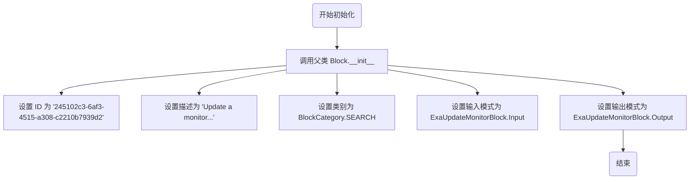

#### 带注释源码

```python
def __init__(self):
    # 调用父类 Block 的初始化方法，注册块的基本元数据
    super().__init__(
        # 定义该块在系统中的唯一 ID
        id="245102c3-6af3-4515-a308-c2210b7939d2",
        # 定义该块的功能描述，用于 UI 展示
        description="Update a monitor's status, schedule, or metadata",
        # 将该块归类到搜索类别中
        categories={BlockCategory.SEARCH},
        # 绑定内部定义的输入数据结构类
        input_schema=ExaUpdateMonitorBlock.Input,
        # 绑定内部定义的输出数据结构类
        output_schema=ExaUpdateMonitorBlock.Output,
    )
```


### `ExaUpdateMonitorBlock.run`

该方法是 `ExaUpdateMonitorBlock` 类的核心执行逻辑，负责根据输入的参数更新 Exa 监视器的配置，包括状态、时间计划和元数据，并通过 SDK 调用完成实际更新，最后返回更新后的监视器信息。

参数：

- `input_data`：`ExaUpdateMonitorBlock.Input`，包含更新监视器所需的输入数据，如监视器 ID、新状态、新的 Cron 表达式、时区和元数据。
- `credentials`：`APIKeyCredentials`，包含用于身份验证的 Exa API 密钥。
- `**kwargs`：`Any`，额外的关键字参数，通常由框架传递以提供执行上下文。

返回值：`BlockOutput`，异步生成器，按顺序产生监视器更新后的 ID、状态、下次运行时间、更新时间戳以及成功标识。

#### 流程图

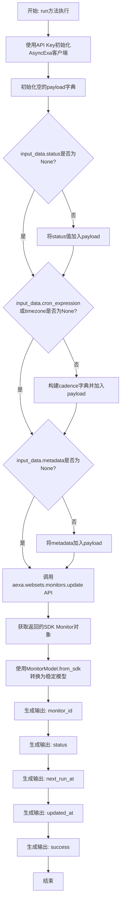

#### 带注释源码

```python
    async def run(
        self, input_data: Input, *, credentials: APIKeyCredentials, **kwargs
    ) -> BlockOutput:
        # 使用凭证中的 API Key 初始化 Exa 异步客户端
        aexa = AsyncExa(api_key=credentials.api_key.get_secret_value())

        # 初始化请求载荷字典，用于存放需要更新的字段
        payload = {}

        # 如果输入中提供了新的状态，则将其转换为字符串值并加入 payload
        if input_data.status is not None:
            payload["status"] = input_data.status.value

        # 如果输入中提供了新的 cron 表达式或时区，则需要更新 cadence 配置
        if input_data.cron_expression is not None or input_data.timezone is not None:
            cadence = {}
            # 只有非空时才添加具体字段
            if input_data.cron_expression:
                cadence["cron"] = input_data.cron_expression
            if input_data.timezone:
                cadence["timezone"] = input_data.timezone
            # 将 cadence 配置加入 payload
            payload["cadence"] = cadence

        # 如果输入中提供了新的元数据，直接加入 payload
        if input_data.metadata is not None:
            payload["metadata"] = input_data.metadata

        # 调用 SDK 的 update 方法，传入监视器 ID 和构建好的 payload
        sdk_monitor = await aexa.websets.monitors.update(
            monitor_id=input_data.monitor_id, params=payload
        )

        # 将 SDK 返回的 Monitor 对象转换为项目内部定义的稳定模型 MonitorModel
        monitor = MonitorModel.from_sdk(sdk_monitor)

        # 按顺序产出更新后的监视器字段，作为 Block 的输出
        yield "monitor_id", monitor.id
        yield "status", monitor.status
        yield "next_run_at", monitor.next_run_at
        yield "updated_at", monitor.updated_at
        yield "success", "true"
```


### `ExaDeleteMonitorBlock.__init__`

初始化删除监控器块，配置其唯一标识符、描述、分类以及输入输出模式。

参数：

- `self`：`ExaDeleteMonitorBlock`，类的实例本身

返回值：`None`，无返回值

#### 流程图

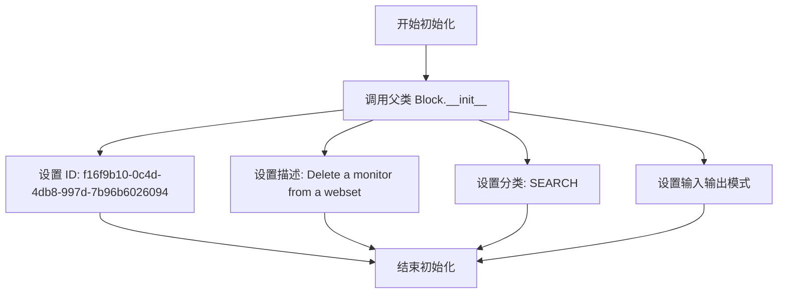

#### 带注释源码

```python
def __init__(self):
    # 调用父类 Block 的构造函数，传入块配置信息
    super().__init__(
        # 块的唯一标识符
        id="f16f9b10-0c4d-4db8-997d-7b96b6026094",
        # 块的功能描述，用于UI展示
        description="Delete a monitor from a webset",
        # 块所属的分类，这里归类为 SEARCH
        categories={BlockCategory.SEARCH},
        # 定义块的输入数据结构模式，引用了内部定义的 Input 类
        input_schema=ExaDeleteMonitorBlock.Input,
        # 定义块的输出数据结构模式，引用了内部定义的 Output 类
        output_schema=ExaDeleteMonitorBlock.Output,
    )
```


### `ExaDeleteMonitorBlock.run`

该方法负责在 Exa API 中执行删除指定 Monitor 的操作。它使用提供的凭证初始化客户端，调用 SDK 的删除接口，并返回删除后的 Monitor ID 及操作状态。

参数：

-  `input_data`：`ExaDeleteMonitorBlock.Input`，包含待删除的 Monitor ID 及相关的元数据输入结构。
-  `credentials`：`APIKeyCredentials`，用于认证的 Exa API 密钥对象。
-  `**kwargs`：`typing.Any`，扩展的关键字参数。

返回值：`BlockOutput`，一个异步生成器，产生包含 `monitor_id` 和 `success` 状态的元组。

#### 流程图

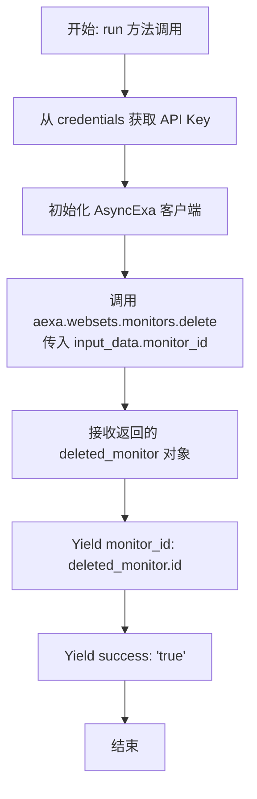

#### 带注释源码

```python
    async def run(
        self, input_data: Input, *, credentials: APIKeyCredentials, **kwargs
    ) -> BlockOutput:
        # 使用 AsyncExa SDK
        # 通过从 credentials 中提取的 API 密钥初始化异步客户端实例
        aexa = AsyncExa(api_key=credentials.api_key.get_secret_value())

        # 调用 SDK 的 delete 方法删除指定的 monitor
        # input_data.monitor_id 包含了用户输入的要删除的监控器 ID
        deleted_monitor = await aexa.websets.monitors.delete(
            monitor_id=input_data.monitor_id
        )

        # 生成输出结果
        # 输出被删除监控器的 ID
        yield "monitor_id", deleted_monitor.id
        # 输出操作成功标识，若未抛出异常则视为成功
        yield "success", "true"
```


### `ExaListMonitorsBlock.__init__`

初始化 `ExaListMonitorsBlock` 实例，设置块的唯一标识、描述、功能分类以及输入输出的数据结构模式。

参数：

- `self`：`ExaListMonitorsBlock`，表示类实例本身。

返回值：`None`，构造函数没有返回值。

#### 流程图

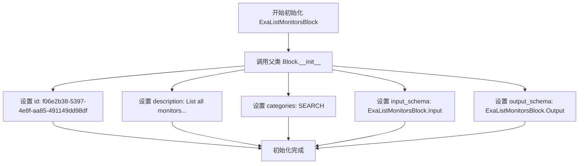

#### 带注释源码

```python
def __init__(self):
    # 调用父类 Block 的构造函数以注册该块的配置
    super().__init__(
        # 定义该块的唯一 ID，用于系统内部识别
        id="f06e2b38-5397-4e8f-aa85-491149dd98df",
        # 描述该块的功能：列出所有监视器并支持可选的 webset 过滤
        description="List all monitors with optional webset filtering",
        # 将该块归类到搜索类别中
        categories={BlockCategory.SEARCH},
        # 指定输入数据的验证模式，使用内部定义的 Input 类
        input_schema=ExaListMonitorsBlock.Input,
        # 指定输出数据的结构模式，使用内部定义的 Output 类
        output_schema=ExaListMonitorsBlock.Output,
    )
```


### `ExaListMonitorsBlock.run`

该方法负责根据提供的过滤条件和分页参数，从 Exa API 获取监控器列表，并将其转换为标准输出模型，同时输出分页信息。

参数：

- `input_data`：`ExaListMonitorsBlock.Input`，包含查询参数的输入数据模型，包括 `webset_id`（过滤条件）、`limit`（返回数量限制）和 `cursor`（分页游标）。
- `credentials`：`APIKeyCredentials`，用于身份验证的 API Key 凭据对象。

返回值：`BlockOutput`，一个异步生成器，产生包含监控器列表、单个监控器详情以及分页元数据（如 `has_more` 和 `next_cursor`）的键值对。

#### 流程图

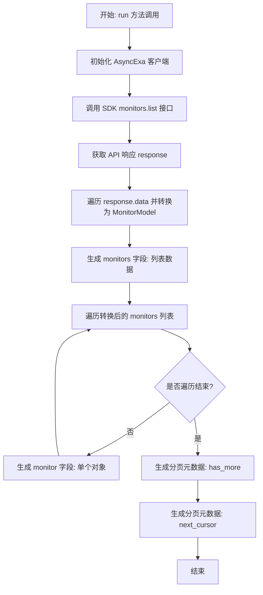

#### 带注释源码

```python
    async def run(
        self, input_data: Input, *, credentials: APIKeyCredentials, **kwargs
    ) -> BlockOutput:
        # 使用凭据中的 API Key 初始化 AsyncExa SDK 客户端
        aexa = AsyncExa(api_key=credentials.api_key.get_secret_value())

        # 调用 SDK 的 list 方法，传入游标、限制数量和 Webset ID 进行查询
        response = await aexa.websets.monitors.list(
            cursor=input_data.cursor,
            limit=input_data.limit,
            webset_id=input_data.webset_id,
        )

        # 将 SDK 返回的 Monitor 对象转换为项目内部的稳定模型 MonitorModel
        monitors = [MonitorModel.from_sdk(m) for m in response.data]

        # 产出 "monitors" 字段，包含所有监控器数据的字典列表
        yield "monitors", [m.model_dump() for m in monitors]

        # 遍历监控器列表，逐个产出 "monitor" 字段
        # 这允许在图中对单个监控器进行后续处理
        for monitor in monitors:
            yield "monitor", monitor.model_dump()

        # 产出 "has_more" 字段，指示是否还有更多数据可分页获取
        yield "has_more", response.has_more
        
        # 产出 "next_cursor" 字段，用于获取下一页数据的游标
        yield "next_cursor", response.next_cursor
```


## 关键组件


### MonitorModel
镜像 SDK Monitor 类型的稳定 Pydantic 模型，用于确保输出一致性和解耦外部依赖。

### ExaCreateMonitorBlock
负责创建新的监控器，以便按预定计划自动更新 webset 的数据。

### ExaGetMonitorBlock
负责根据 ID 获取特定监控器的详细信息、状态和配置。

### ExaUpdateMonitorBlock
负责修改现有监控器的状态、调度计划或元数据。

### ExaDeleteMonitorBlock
负责从 webset 中永久删除指定的监控器。

### ExaListMonitorsBlock
负责列出监控器，并支持分页功能和基于 webset ID 的过滤。


## 问题及建议


### 已知问题

-   **客户端实例化不一致**：`ExaCreateMonitorBlock` 使用了 `_get_client` 方法来获取客户端，该方法在测试中被模拟；而 `ExaGetMonitorBlock`、`ExaUpdateMonitorBlock`、`ExaDeleteMonitorBlock` 和 `ExaListMonitorsBlock` 直接在 `run` 方法中实例化 `AsyncExa`。这使得后者的单元测试难以编写且逻辑不统一。
-   **缺乏异常处理机制**：所有 `Block` 的 `run` 方法中均未包含 `try-except` 块。当 API 调用失败（如网络错误、认证失败、资源未找到）时，异常将直接向上抛出，可能导致工作流崩溃，而没有给出明确的错误信息或状态码。
-   **潜在的业务逻辑漏洞**：在 `ExaCreateMonitorBlock` 中，当 `behavior_type` 为 `SEARCH` 时，如果 `search_query` 为 `None`，代码将其设置为空字符串 `""`。这可能导致 API 调用失败或创建出无效的 Monitor，而没有在输入阶段进行强制性校验。
-   **模型转换的脆弱性**：`MonitorModel.from_sdk` 方法依赖 SDK 对象的内部结构（如 `monitor.behavior.model_dump()`）。如果 SDK 升级改变了内部字段名称或结构，此转换逻辑将在运行时失败，且缺乏防御性编程来处理未知字段。

### 优化建议

-   **统一客户端管理**：引入一个基类或 Mixin，封装 `AsyncExa` 的实例化逻辑（参考 `ExaCreateMonitorBlock` 的 `_get_client`），确保所有 Block 都通过统一的方式获取客户端，便于统一配置超时、重试策略以及单元测试时的 Mock 替换。
-   **引入全面的错误处理**：在调用 SDK 的地方包裹 `try-except` 块，捕获特定的 API 异常或通用的网络异常。建议将错误转换为 Block 的输出（例如 yield `error` 字段）或抛出框架统一的异常类型，以便上层处理。
-   **细化输入验证**：利用 Pydantic 的验证器（`field_validator`）在 `Input` 类中增加业务逻辑校验。例如，当 `behavior_type` 为 `SEARCH` 时，强制要求 `search_query` 不能为空。
-   **提取 Payload 构建逻辑**：`ExaCreateMonitorBlock` 和 `ExaUpdateMonitorBlock` 中构建 API 请求 Payload 的逻辑较为冗长且重复。建议将这些逻辑提取为独立的辅助函数或私有方法，以提高代码的可读性和可维护性。
-   **添加请求超时配置**：在初始化 `AsyncExa` 客户端时，显式配置 `timeout` 参数，防止因外部服务响应缓慢而导致工作流长时间挂起。


## 其它


### 设计目标与约束

本模块旨在提供一个稳定的、与底层SDK解耦的接口层，用于管理Exa Websets的监控任务。

**设计目标**：
1. **接口稳定性**：通过定义`MonitorModel`封装SDK返回的动态数据结构，屏蔽`exa_py` SDK版本升级带来的类型变更风险，确保对外输出结构的稳定性。
2. **异步高性能**：利用Python的`async/await`特性处理I/O密集型网络请求，避免阻塞主线程，提高系统的并发处理能力。
3. **模块化设计**：每个功能（创建、获取、更新、删除、列表）封装为独立的Block类，遵循单一职责原则，便于复用和维护。

**约束条件**：
1. **运行环境**：必须在支持异步事件循环的环境中运行（如Python 3.7+ 的 asyncio）。
2. **API限制**：受限于Exa API的速率限制和配额（如每次搜索最大返回100条结果）。
3. **Cron格式**：Cron表达式必须符合Exa API的特定规范（5字段，最大频率为每天一次）。

### 外部依赖与接口契约

模块核心依赖于 `exa_py` SDK 进行外部通信，并遵循严格的接口契约。

**外部依赖**：
- `exa_py.AsyncExa`: 用于执行实际的API调用。
- `pydantic.BaseModel`: 用于数据验证和序列化。
- `backend.sdk.Block`: 继承的基础框架类，定义了Block的执行规范。

**接口契约**：
1. **认证契约**：
   - 所有Block均要求输入包含`credentials`字段，类型为`CredentialsMetaInput`。
   - 必须通过`credentials.api_key.get_secret_value()`获取有效的Exa API Key才能初始化`AsyncExa`客户端。
2. **数据交互契约**：
   - **输入契约**：输入数据必须符合各Block类内部定义的`Input` Schema。例如，`ExaCreateMonitorBlock`要求`webset_id`和`cron_expression`为必填项，且根据`behavior_type`的不同，可能需要`search_query`。
   - **输出契约**：输出数据必须符合各Block类内部定义的`Output` Schema。输出通过Python生成器`yield`逐个键值对产出。
   - **SDK交互映射**：
     - `create`: 调用 `aexa.websets.monitors.create(params=payload)`，payload需包含`websetId`, `cadence`, `behavior`等键。
     - `get`: 调用 `aexa.websets.monitors.get(monitor_id=input_data.monitor_id)`。
     - `update`: 调用 `aexa.websets.monitors.update(monitor_id=..., params=payload)`，仅更新传入的非空字段。
     - `delete`: 调用 `aexa.websets.monitors.delete(monitor_id=...)`。
     - `list`: 调用 `aexa.websets.monitors.list(cursor=..., limit=..., webset_id=...)`。

### 错误处理与异常设计

当前代码采用“快速失败”策略，不在Block内部捕获具体的业务逻辑异常，而是依赖框架或上层调用者进行异常捕获和处理。

**异常来源**：
1. **认证异常**：当提供的API Key无效或过期时，SDK底层抛出异常（通常是`AuthenticationError`或HTTP 401）。
2. **验证异常**：
   - **输入验证**：Pydantic会在输入数据构造时自动校验（如`search_count`超出1-100范围），抛出`ValidationError`。
   - **业务验证**：Exa API在校验Cron表达式无效或Monitor ID不存在时，会返回HTTP 400或404错误，SDK将其转换为异常抛出。
3. **网络异常**：网络连接超时或中断时，抛出`ReadTimeout`或`ConnectionError`。

**处理机制**：
- `run`方法内部未显式包含`try...except`块，这意味着一旦发生异常，执行会立即中断，异常对象会沿调用栈向上传播。
- 这种设计允许上层的编排系统（如Workflow Engine）统一实现重试逻辑、降级逻辑或错误日志记录，保持Block逻辑的纯粹性。

### 数据流与处理逻辑

数据在系统中的流向遵循严格的单向处理路径：输入 -> 转换 -> 外部交互 -> 模型适配 -> 输出。

**详细数据流**：
1. **输入接收**：Block框架接收外部输入的JSON字典，通过Pydantic模型解析为`Input`类实例，完成数据清洗和类型转换。
2. **载荷构建**：
   - 在`run`方法中，根据业务逻辑将输入字段重组为SDK所需的字典结构。
   - 例如，在`ExaCreateMonitorBlock`中，根据`behavior_type`（SEARCH或REFRESH）的不同，动态构建不同的`behavior`配置块（包含`query`或`content`字段）。
3. **异步调用**：使用构建好的Payload调用`AsyncExa` SDK的对应方法。此阶段会挂起当前协程，等待网络I/O完成。
4. **模型适配**：
   - SDK返回原生的`SdkMonitor`对象。
   - 调用`MonitorModel.from_sdk(sdk_monitor)`静态方法。该方法将嵌套的SDK对象（如`behavior`, `cadence`）拍平为字典，并将`datetime`对象转换为ISO 8601格式的字符串，将Enum转换为字符串值。
5. **流式输出**：适配后的`MonitorModel`对象被拆解，通过`yield`语句逐个字段输出，符合Block框架的流式输出要求，允许下游Block尽早接收数据。

### 安全与认证设计

模块在安全性方面主要关注凭证的敏感信息保护和输入参数的安全验证。

**认证设计**：
- **敏感字段隔离**：API Key不直接以明文形式出现在输入Schema的普通字段中，而是通过`CredentialsMetaInput`类型封装。
- **安全获取**：在运行时使用`credentials.api_key.get_secret_value()`获取密钥。该方法通常集成在密钥管理系统中，确保密钥在日志或调试输出中会被自动脱敏或隐藏。
- **生命周期管理**：客户端实例`aexa`仅在`run`方法作用域内有效，随请求结束而销毁，避免长连接持有密钥带来的风险。

**输入安全**：
- **范围限制**：使用Pydantic的`ge`（大于等于）和`le`（小于等于）约束数值范围（如`search_count`限制在1-100），防止恶意大数值导致服务端资源耗尽。
- **注入防护**：通过Pydantic模型对输入字符串进行类型强制和结构化处理，减少了直接字符串拼接导致的注入风险，尽管最终查询内容仍由Exa API处理。

    