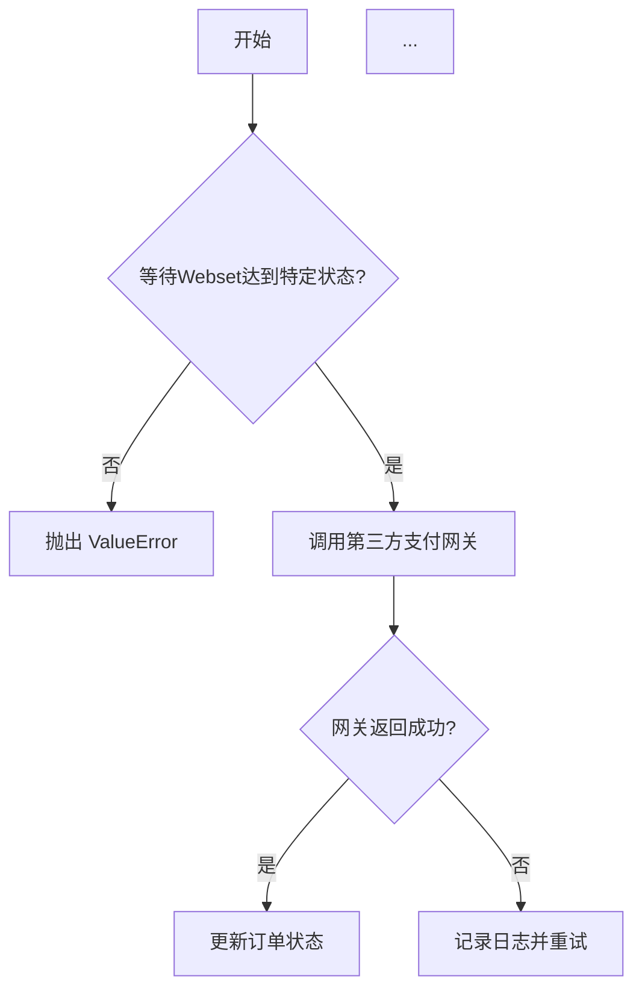
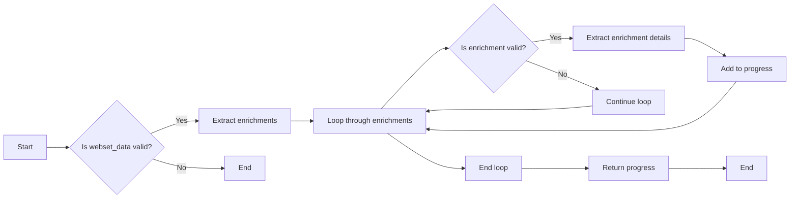
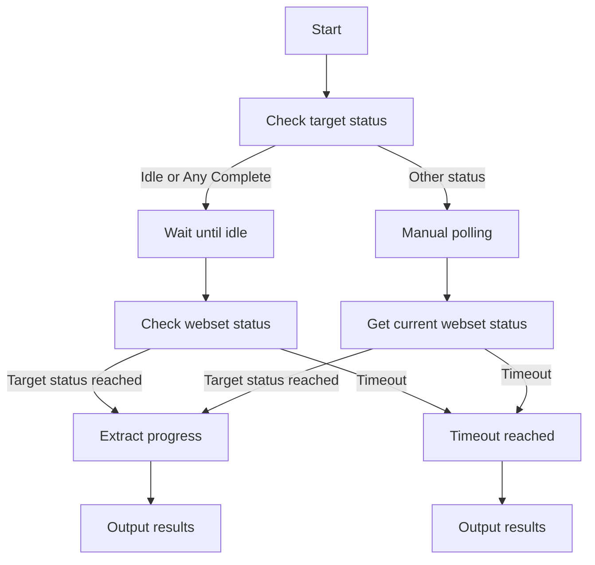
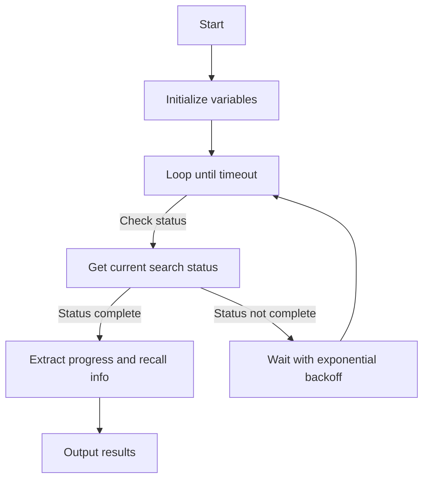
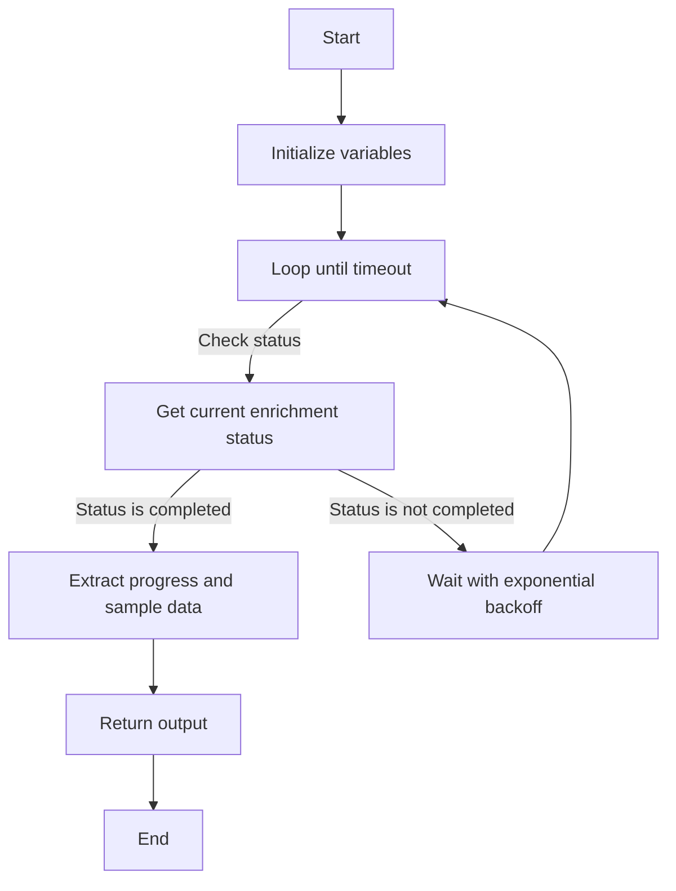
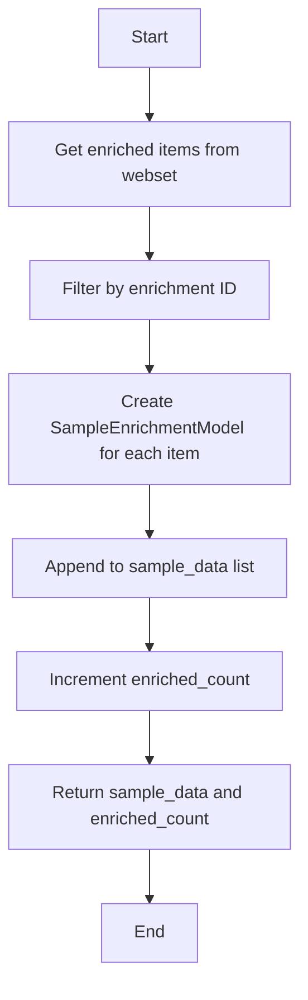

# `.\AutoGPT\autogpt_platform\backend\backend\blocks\exa\websets_polling.py` 详细设计文档

This module provides dedicated polling blocks for waiting on webset operations to complete, with progress tracking and timeout management.

## 整体流程



## 类结构

```
ExaWaitForWebsetBlock
├── Input
│   ├── credentials
│   ├── webset_id
│   ├── target_status
│   ├── timeout
│   ├── check_interval
│   ├── max_interval
│   └── include_progress
│   └── Output
│       ├── webset_id
│       ├── final_status
│       ├── elapsed_time
│       ├── item_count
│       ├── search_progress
│       ├── enrichment_progress
│       └── timed_out
└── ExaWaitForSearchBlock
    └── Input
        ├── credentials
        ├── webset_id
        ├── search_id
        ├── timeout
        ├── check_interval
        └── Output
            ├── search_id
            ├── final_status
            ├── items_found
            ├── items_analyzed
            ├── completion_percentage
            ├── elapsed_time
            ├── recall_info
            └── timed_out
└── ExaWaitForEnrichmentBlock
    └── Input
        ├── credentials
        ├── webset_id
        ├── enrichment_id
        ├── timeout
        ├── check_interval
        ├── sample_results
        └── Output
            ├── enrichment_id
            ├── final_status
            ├── items_enriched
            ├── enrichment_title
            ├── elapsed_time
            ├── sample_data
            └── timed_out
└── SampleEnrichmentModel
└── WebsetTargetStatus
└── AsyncExa
└── APIKeyCredentials
└── Block
└── BlockCategory
└── BlockOutput
└── BlockSchemaInput
└── BlockSchemaOutput
└── CredentialsMetaInput
└── SchemaField
└── WebsetItemModel
```

## 全局变量及字段


### `exa`
    
The Exa integration object used for API interactions.

类型：`AsyncExa`
    


### `WebsetItemModel`
    
Model for webset items used in enrichment samples.

类型：`class`
    


### `SampleEnrichmentModel`
    
Model for sample enrichment result for display.

类型：`BaseModel`
    


### `WebsetTargetStatus`
    
Enum for webset target status options.

类型：`Enum`
    


### `APIKeyCredentials`
    
Credentials class for API key authentication.

类型：`class`
    


### `Block`
    
Base class for blocks in the system.

类型：`class`
    


### `BlockCategory`
    
Enum for block categories.

类型：`Enum`
    


### `BlockOutput`
    
Base class for block output.

类型：`class`
    


### `BlockSchemaInput`
    
Base class for block input schema.

类型：`class`
    


### `BlockSchemaOutput`
    
Base class for block output schema.

类型：`class`
    


### `CredentialsMetaInput`
    
Input class for credentials metadata.

类型：`class`
    


### `SchemaField`
    
Field class for schema fields.

类型：`class`
    


### `AsyncExa`
    
Asynchronous Exa SDK client.

类型：`class`
    


### `asyncio`
    
Asynchronous I/O module.

类型：`module`
    


### `time`
    
Time-related functions module.

类型：`module`
    


### `Enum`
    
Base class for enumeration types.

类型：`class`
    


### `Dict`
    
Type for dictionaries.

类型：`type`
    


### `Any`
    
Type for any type.

类型：`type`
    


### `BaseModel`
    
Base class for Pydantic models.

类型：`class`
    


### `asyncio.TimeoutError`
    
Exception raised when a timeout occurs in asyncio.

类型：`class`
    


### `ValueError`
    
Exception raised for invalid input values.

类型：`class`
    


### `asyncio.sleep`
    
Suspends execution for a given number of seconds.

类型：`function`
    


### `min`
    
Returns the minimum of two numbers.

类型：`function`
    


### `max`
    
Returns the maximum of two numbers.

类型：`function`
    


### `SampleEnrichmentModel.item_id`
    
Unique identifier for the item.

类型：`str`
    


### `SampleEnrichmentModel.item_title`
    
Title of the item.

类型：`str`
    


### `SampleEnrichmentModel.enrichment_data`
    
Enrichment data associated with the item.

类型：`Dict[str, Any]`
    


### `WebsetTargetStatus.IDLE`
    
Status indicating the webset is idle.

类型：`str`
    


### `WebsetTargetStatus.COMPLETED`
    
Status indicating the webset is completed.

类型：`str`
    


### `WebsetTargetStatus.RUNNING`
    
Status indicating the webset is running.

类型：`str`
    


### `WebsetTargetStatus.PAUSED`
    
Status indicating the webset is paused.

类型：`str`
    


### `WebsetTargetStatus.ANY_COMPLETE`
    
Status indicating the webset is either idle or completed.

类型：`str`
    


### `ExaWaitForWebsetBlock.id`
    
Unique identifier for the block.

类型：`str`
    


### `ExaWaitForWebsetBlock.description`
    
Description of the block.

类型：`str`
    


### `ExaWaitForWebsetBlock.categories`
    
Categories to which the block belongs.

类型：`Set[BlockCategory]`
    


### `ExaWaitForWebsetBlock.input_schema`
    
Input schema for the block.

类型：`BlockSchemaInput`
    


### `ExaWaitForWebsetBlock.output_schema`
    
Output schema for the block.

类型：`BlockSchemaOutput`
    


### `ExaWaitForSearchBlock.id`
    
Unique identifier for the block.

类型：`str`
    


### `ExaWaitForSearchBlock.description`
    
Description of the block.

类型：`str`
    


### `ExaWaitForSearchBlock.categories`
    
Categories to which the block belongs.

类型：`Set[BlockCategory]`
    


### `ExaWaitForSearchBlock.input_schema`
    
Input schema for the block.

类型：`BlockSchemaInput`
    


### `ExaWaitForSearchBlock.output_schema`
    
Output schema for the block.

类型：`BlockSchemaOutput`
    


### `ExaWaitForEnrichmentBlock.id`
    
Unique identifier for the block.

类型：`str`
    


### `ExaWaitForEnrichmentBlock.description`
    
Description of the block.

类型：`str`
    


### `ExaWaitForEnrichmentBlock.categories`
    
Categories to which the block belongs.

类型：`Set[BlockCategory]`
    


### `ExaWaitForEnrichmentBlock.input_schema`
    
Input schema for the block.

类型：`BlockSchemaInput`
    


### `ExaWaitForEnrichmentBlock.output_schema`
    
Output schema for the block.

类型：`BlockSchemaOutput`
    
    

## 全局函数及方法


### `_extract_search_progress`

Extract search progress information from webset data.

参数：

- `webset_data`：`dict`，The webset data from which to extract search progress information.

返回值：`dict`，A dictionary containing the search progress information.

#### 流程图

```mermaid
graph TD
    A[Start] --> B[Get webset data]
    B --> C[Check if "searches" key exists]
    C -- Yes --> D[Loop through searches]
    C -- No --> E[Return empty progress]
    D --> F[Get search ID and progress]
    F --> G[Build progress dictionary]
    G --> H[Return progress dictionary]
    H --> I[End]
```

#### 带注释源码

```python
def _extract_search_progress(self, webset_data: dict) -> dict:
    """Extract search progress information from webset data."""
    progress = {}
    searches = webset_data.get("searches", [])

    for idx, search in enumerate(searches):
        search_id = search.get("id", f"search_{idx}")
        search_progress = search.get("progress", {})

        progress[search_id] = {
            "status": search.get("status", "unknown"),
            "found": search_progress.get("found", 0),
            "analyzed": search_progress.get("analyzed", 0),
            "completion": search_progress.get("completion", 0),
            "time_left": search_progress.get("timeLeft", 0),
        }

    return progress
``` 


### `_extract_enrichment_progress`

Extract enrichment progress information from webset data.

参数：

- `webset_data`：`dict`，The webset data to extract progress from.

返回值：`dict`，The extracted enrichment progress information.

#### 流程图



#### 带注释源码

```python
def _extract_enrichment_progress(self, webset_data: dict) -> dict:
    """Extract enrichment progress information from webset data."""
    progress = {}
    enrichments = webset_data.get("enrichments", [])

    for idx, enrichment in enumerate(enrichments):
        enrich_id = enrichment.get("id", f"enrichment_{idx}")

        progress[enrich_id] = {
            "status": enrichment.get("status", "unknown"),
            "title": enrichment.get("title", ""),
            "description": enrichment.get("description", ""),
        }

    return progress
```


### ExaWaitForWebsetBlock.run

This method runs the ExaWaitForWebsetBlock, which waits for a webset to reach a specific status with progress tracking.

参数：

- `input_data`：`Input`，The input data for the block, including webset ID, target status, timeout, check interval, and other parameters.
- `credentials`：`APIKeyCredentials`，The credentials for the Exa integration, including the API key.
- `**kwargs`：`Any`，Additional keyword arguments.

返回值：`BlockOutput`，The output of the block, including webset ID, final status, elapsed time, item count, search progress, enrichment progress, and whether the operation timed out.

#### 流程图



#### 带注释源码

```python
async def run(self, input_data: Input, *, credentials: APIKeyCredentials, **kwargs) -> BlockOutput:
    start_time = time.time()
    aexa = AsyncExa(api_key=credentials.api_key.get_secret_value())

    try:
        if input_data.target_status in [
            WebsetTargetStatus.IDLE,
            WebsetTargetStatus.ANY_COMPLETE,
        ]:
            final_webset = await aexa.websets.wait_until_idle(
                id=input_data.webset_id,
                timeout=input_data.timeout,
                poll_interval=input_data.check_interval,
            )

            elapsed = time.time() - start_time

            status_str = (
                final_webset.status.value
                if hasattr(final_webset.status, "value")
                else str(final_webset.status)
            )

            item_count = 0
            if final_webset.searches:
                for search in final_webset.searches:
                    if search.progress:
                        item_count += search.progress.found

            # Extract progress if requested
            search_progress = {}
            enrichment_progress = {}
            if input_data.include_progress:
                webset_dict = final_webset.model_dump(
                    by_alias=True, exclude_none=True
                )
                search_progress = self._extract_search_progress(webset_dict)
                enrichment_progress = self._extract_enrichment_progress(webset_dict)

            yield "webset_id", input_data.webset_id
            yield "final_status", status_str
            yield "elapsed_time", elapsed
            yield "item_count", item_count
            if input_data.include_progress:
                yield "search_progress", search_progress
                yield "enrichment_progress", enrichment_progress
            yield "timed_out", False
        else:
            # For other status targets, manually poll
            interval = input_data.check_interval
            while time.time() - start_time < input_data.timeout:
                # Get current webset status
                webset = await aexa.websets.get(id=input_data.webset_id)
                current_status = (
                    webset.status.value
                    if hasattr(webset.status, "value")
                    else str(webset.status)
                )

                # Check if target status reached
                if current_status == input_data.target_status.value:
                    elapsed = time.time() - start_time

                    # Estimate item count from search progress
                    item_count = 0
                    if webset.searches:
                        for search in webset.searches:
                            if search.progress:
                                item_count += search.progress.found

                    search_progress = {}
                    enrichment_progress = {}
                    if input_data.include_progress:
                        webset_dict = webset.model_dump(
                            by_alias=True, exclude_none=True
                        )
                        search_progress = self._extract_search_progress(webset_dict)
                        enrichment_progress = self._extract_enrichment_progress(webset_dict)

                    yield "webset_id", input_data.webset_id
                    yield "final_status", current_status
                    yield "elapsed_time", elapsed
                    yield "item_count", item_count
                    if input_data.include_progress:
                        yield "search_progress", search_progress
                        yield "enrichment_progress", enrichment_progress
                    yield "timed_out", False
                    return

                # Wait before next check with exponential backoff
                await asyncio.sleep(interval)
                interval = min(interval * 1.5, input_data.max_interval)

            # Timeout reached
            elapsed = time.time() - start_time
            webset = await aexa.websets.get(id=input_data.webset_id)
            final_status = (
                webset.status.value
                if hasattr(webset.status, "value")
                else str(webset.status)
            )

            item_count = 0
            if webset.searches:
                for search in webset.searches:
                    if search.progress:
                        item_count += search.progress.found

            search_progress = {}
            enrichment_progress = {}
            if input_data.include_progress:
                webset_dict = webset.model_dump(by_alias=True, exclude_none=True)
                search_progress = self._extract_search_progress(webset_dict)
                enrichment_progress = self._extract_enrichment_progress(webset_dict)

            yield "webset_id", input_data.webset_id
            yield "final_status", final_status
            yield "elapsed_time", elapsed
            yield "item_count", item_count
            if input_data.include_progress:
                yield "search_progress", search_progress
                yield "enrichment_progress", enrichment_progress
            yield "timed_out", True

    except asyncio.TimeoutError:
        raise ValueError(
            f"Polling timed out after {input_data.timeout} seconds"
        ) from None
```


### ExaWaitForSearchBlock.run

Wait for a specific webset search to complete with progress tracking.

参数：

- `input_data`：`Input`，The input data for the block.
- `credentials`：`APIKeyCredentials`，The credentials for the Exa integration.
- `**kwargs`：`Any`，Additional keyword arguments.

返回值：`BlockOutput`，The output of the block.

#### 流程图



#### 带注释源码

```python
async def run(self, input_data: Input, *, credentials: APIKeyCredentials, **kwargs) -> BlockOutput:
    start_time = time.time()
    interval = input_data.check_interval
    max_interval = 30
    # Use AsyncExa SDK
    aexa = AsyncExa(api_key=credentials.api_key.get_secret_value())

    try:
        while time.time() - start_time < input_data.timeout:
            # Get current search status using SDK
            search = await aexa.websets.searches.get(
                webset_id=input_data.webset_id, id=input_data.search_id
            )

            # Extract status
            status = (
                search.status.value
                if hasattr(search.status, "value")
                else str(search.status)
            )

            # Check if search is complete
            if status in ["completed", "failed", "canceled"]:
                elapsed = time.time() - start_time

                # Extract progress information
                progress_dict = {}
                if search.progress:
                    progress_dict = search.progress.model_dump(
                        by_alias=True, exclude_none=True
                    )

                # Extract recall information
                recall_info = {}
                if search.recall:
                    recall_dict = search.recall.model_dump(
                        by_alias=True, exclude_none=True
                    )
                    expected = recall_dict.get("expected", {})
                    recall_info = {
                        "expected_total": expected.get("total", 0),
                        "confidence": expected.get("confidence", ""),
                        "min_expected": expected.get("bounds", {}).get("min", 0),
                        "max_expected": expected.get("bounds", {}).get("max", 0),
                        "reasoning": recall_dict.get("reasoning", ""),
                    }

                yield "search_id", input_data.search_id
                yield "final_status", status
                yield "items_found", progress_dict.get("found", 0)
                yield "items_analyzed", progress_dict.get("analyzed", 0)
                yield "completion_percentage", progress_dict.get("completion", 0)
                yield "elapsed_time", elapsed
                yield "recall_info", recall_info
                yield "timed_out", False

                return

            # Wait before next check with exponential backoff
            await asyncio.sleep(interval)
            interval = min(interval * 1.5, max_interval)

        # Timeout reached
        elapsed = time.time() - start_time

        # Get last known status
        search = await aexa.websets.searches.get(
            webset_id=input_data.webset_id, id=input_data.search_id
        )
        final_status = (
            search.status.value
            if hasattr(search.status, "value")
            else str(search.status)
        )

        progress_dict = {}
        if search.progress:
            progress_dict = search.progress.model_dump(
                by_alias=True, exclude_none=True
            )

        yield "search_id", input_data.search_id
        yield "final_status", final_status
        yield "items_found", progress_dict.get("found", 0)
        yield "items_analyzed", progress_dict.get("analyzed", 0)
        yield "completion_percentage", progress_dict.get("completion", 0)
        yield "elapsed_time", elapsed
        yield "timed_out", True

    except asyncio.TimeoutError:
        raise ValueError(
            f"Search polling timed out after {input_data.timeout} seconds"
        ) from None
```


### ExaWaitForEnrichmentBlock.run

This method waits for a webset enrichment to complete with progress tracking and returns the final status, number of items enriched, and sample data if requested.

参数：

- `input_data`：`Input`，The input data for the block, containing the webset ID, enrichment ID, timeout, check interval, and whether to include sample results.
- `credentials`：`APIKeyCredentials`，The credentials for the Exa integration, including the API key.
- `**kwargs`：`Any`，Additional keyword arguments.

返回值：`BlockOutput`，The output data for the block, including the enrichment ID, final status, number of items enriched, enrichment title, elapsed time, sample data (if requested), and whether the operation timed out.

#### 流程图



#### 带注释源码

```python
async def run(self, input_data: Input, *, credentials: APIKeyCredentials, **kwargs) -> BlockOutput:
    start_time = time.time()
    interval = input_data.check_interval
    max_interval = 30
    # Use AsyncExa SDK
    aexa = AsyncExa(api_key=credentials.api_key.get_secret_value())

    try:
        while time.time() - start_time < input_data.timeout:
            # Get current enrichment status using SDK
            enrichment = await aexa.websets.enrichments.get(
                webset_id=input_data.webset_id, id=input_data.enrichment_id
            )

            # Extract status
            status = (
                enrichment.status.value
                if hasattr(enrichment.status, "value")
                else str(enrichment.status)
            )

            # Check if enrichment is complete
            if status in ["completed", "failed", "canceled"]:
                elapsed = time.time() - start_time

                # Get sample enriched items if requested
                sample_data = []
                items_enriched = 0
                if input_data.sample_results and status == "completed":
                    sample_data, items_enriched = (
                        await self._get_sample_enrichments(
                            input_data.webset_id, input_data.enrichment_id, aexa
                        )
                    )

                yield "enrichment_id", input_data.enrichment_id
                yield "final_status", status
                yield "items_enriched", items_enriched
                yield "enrichment_title", enrichment.title or enrichment.description or ""
                yield "elapsed_time", elapsed
                if input_data.sample_results:
                    yield "sample_data", sample_data
                yield "timed_out", False

                return

            # Wait before next check with exponential backoff
            await asyncio.sleep(interval)
            interval = min(interval * 1.5, max_interval)

        # Timeout reached
        elapsed = time.time() - start_time

        # Get last known status
        enrichment = await aexa.websets.enrichments.get(
            webset_id=input_data.webset_id, id=input_data.enrichment_id
        )
        final_status = (
            enrichment.status.value
            if hasattr(enrichment.status, "value")
            else str(enrichment.status)
        )
        title = enrichment.title or enrichment.description or ""

        yield "enrichment_id", input_data.enrichment_id
        yield "final_status", final_status
        yield "items_enriched", 0
        yield "enrichment_title", title
        yield "elapsed_time", elapsed
        yield "timed_out", True

    except asyncio.TimeoutError:
        raise ValueError(
            f"Enrichment polling timed out after {input_data.timeout} seconds"
        ) from None
```


### `_get_sample_enrichments`

This method retrieves sample enriched data and counts the number of items that have been enriched.

参数：

- `webset_id`：`str`，The ID of the webset to retrieve enriched items from.
- `enrichment_id`：`str`，The ID of the enrichment to filter the enriched items by.
- `aexa`：`AsyncExa`，The AsyncExa SDK instance used to interact with the Exa API.

返回值：`tuple[list[SampleEnrichmentModel], int]`，A tuple containing a list of `SampleEnrichmentModel` objects representing the sample enriched data and an integer representing the count of enriched items.

#### 流程图



#### 带注释源码

```python
async def _get_sample_enrichments(
    self, webset_id: str, enrichment_id: str, aexa: AsyncExa
) -> tuple[list[SampleEnrichmentModel], int]:
    """Get sample enriched data and count."""
    # Get a few items to see enrichment results using SDK
    response = await aexa.websets.items.list(webset_id=webset_id, limit=5)

    sample_data: list[SampleEnrichmentModel] = []
    enriched_count = 0

    for sdk_item in response.data:
        # Convert to our WebsetItemModel first
        item = WebsetItemModel.from_sdk(sdk_item)

        # Check if this item has the enrichment we're looking for
        if enrichment_id in item.enrichments:
            enriched_count += 1
            enrich_model = item.enrichments[enrichment_id]

            # Create sample using our typed model
            sample = SampleEnrichmentModel(
                item_id=item.id,
                item_title=item.title,
                enrichment_data=enrich_model.model_dump(exclude_none=True),
            )
            sample_data.append(sample)

    return sample_data, enriched_count
``` 


## 关键组件


### 张量索引与惰性加载

张量索引与惰性加载是代码中用于高效处理大型数据集的关键组件。它允许在需要时才加载数据，从而减少内存消耗并提高性能。

### 反量化支持

反量化支持是代码中用于处理量化数据的关键组件。它允许在量化过程中进行反向操作，以便在需要时恢复原始数据。

### 量化策略

量化策略是代码中用于优化数据表示和存储的关键组件。它通过减少数据精度来减少内存占用，同时保持足够的精度以满足应用需求。


## 问题及建议


### 已知问题

-   **全局变量和函数依赖性**：代码中使用了全局变量 `exa`，这可能导致代码的可移植性和可维护性降低。全局变量和函数的使用应该最小化，以避免潜在的命名冲突和难以追踪的问题。
-   **异常处理**：代码中使用了 `asyncio.TimeoutError` 来处理超时，但没有对其他可能的异常进行捕获和处理。应该添加更全面的异常处理来确保代码的健壮性。
-   **代码重复**：`_extract_search_progress` 和 `_extract_enrichment_progress` 方法在多个类中重复出现，这可能导致维护成本增加。应该考虑将这些方法提取到单独的模块或类中。
-   **类型注解**：代码中的一些类型注解可能不够精确，这可能导致在使用类型检查工具时出现错误。应该确保类型注解尽可能精确。

### 优化建议

-   **移除全局变量**：将 `exa` 变量移除，并在需要的地方使用参数传递的方式。
-   **增强异常处理**：添加对其他可能异常的捕获和处理，例如网络请求失败、数据解析错误等。
-   **减少代码重复**：将重复的方法提取到单独的模块或类中，以减少代码重复并提高可维护性。
-   **改进类型注解**：确保类型注解尽可能精确，以帮助类型检查工具更好地识别潜在的错误。
-   **使用更现代的异步编程模式**：考虑使用更现代的异步编程模式，例如 `asyncio` 的 `wait_for` 或 `asyncio.gather`，以提高代码的可读性和效率。
-   **日志记录**：添加日志记录功能，以便于调试和监控代码的运行情况。
-   **单元测试**：编写单元测试来确保代码的正确性和稳定性。


## 其它


### 设计目标与约束

- 设计目标：
  - 提供一个模块，用于等待Webset操作完成，并跟踪进度和超时管理。
  - 支持多种Webset操作，如搜索、富化和同步。
  - 提供详细的进度信息和超时处理。
- 约束：
  - 使用AsyncExa SDK进行Webset操作。
  - 输入参数需符合Pydantic模型定义。
  - 超时时间限制为30分钟。
  - 进度检查间隔最小为1秒，最大为60秒。

### 错误处理与异常设计

- 错误处理：
  - 使用try-except块捕获异步操作中的异常。
  - 捕获`asyncio.TimeoutError`异常，并在超时后抛出`ValueError`。
  - 捕获其他异常，并记录错误信息。
- 异常设计：
  - 定义自定义异常类，如`WebsetOperationError`，用于处理Webset操作相关的错误。

### 数据流与状态机

- 数据流：
  - 输入数据通过Pydantic模型进行验证和解析。
  - 使用AsyncExa SDK与Webset API进行交互。
  - 输出数据通过Pydantic模型进行序列化。
- 状态机：
  - Webset操作可能处于以下状态：空闲、完成、运行、暂停。
  - 根据操作类型和目标状态，状态机将决定下一步操作。

### 外部依赖与接口契约

- 外部依赖：
  - AsyncExa SDK：用于与Webset API进行交互。
  - Pydantic：用于数据验证和模型定义。
  - asyncio：用于异步编程。
- 接口契约：
  - Webset API：定义了Webset操作和状态查询的接口。
  - AsyncExa SDK：封装了Webset API的异步调用。
  - Pydantic模型：定义了输入和输出数据的结构。


    