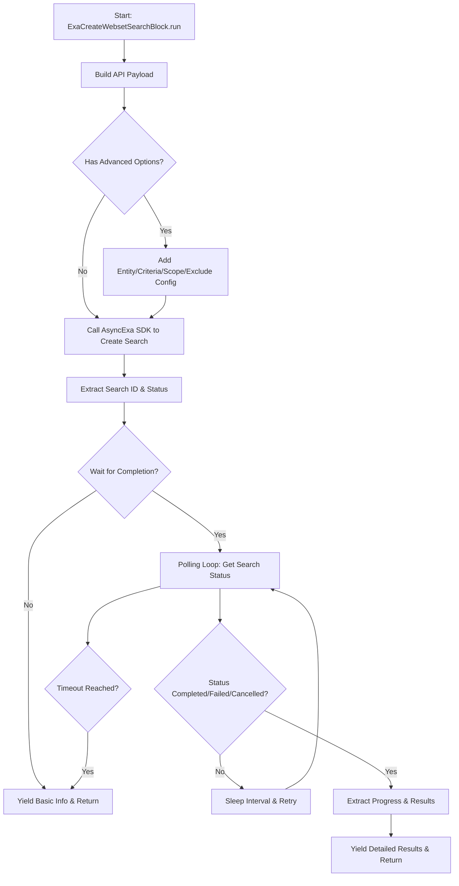
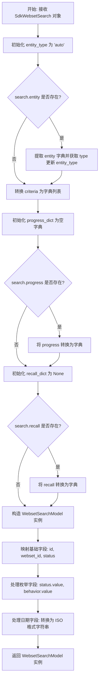
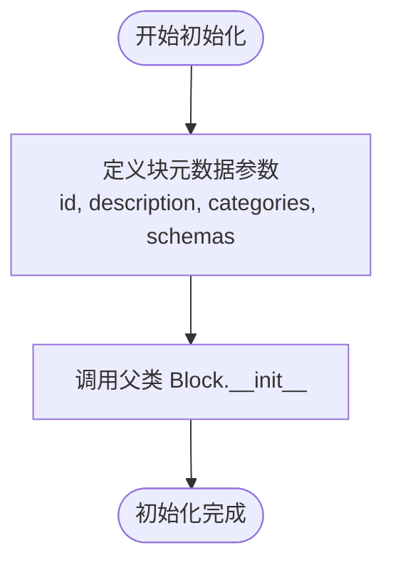
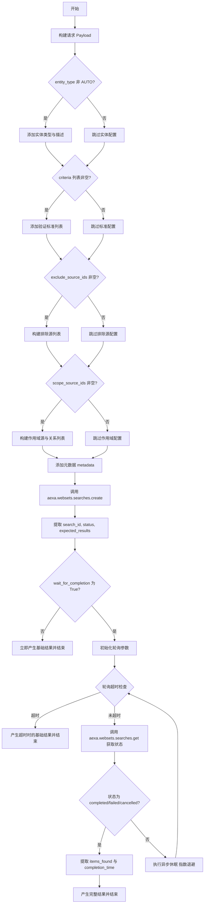
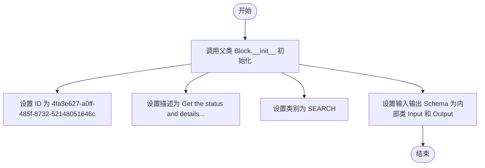
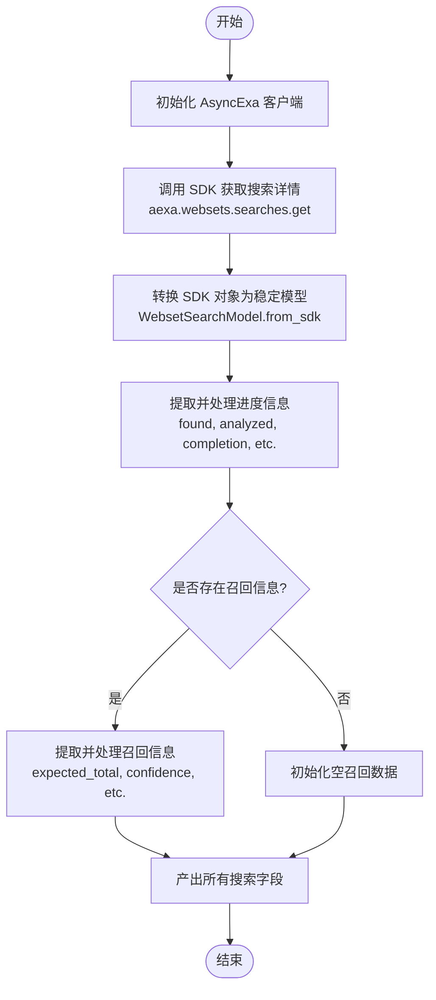
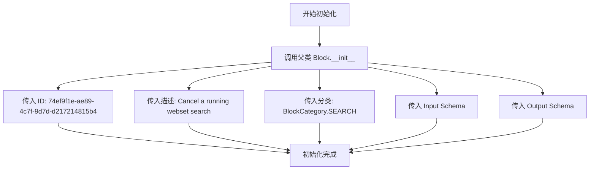
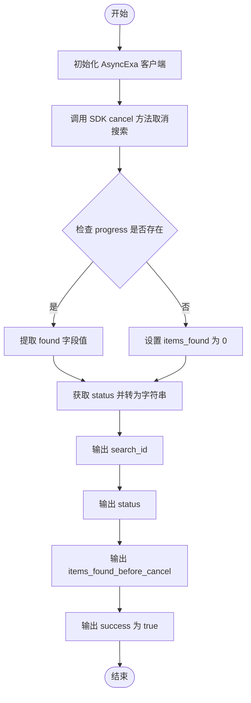
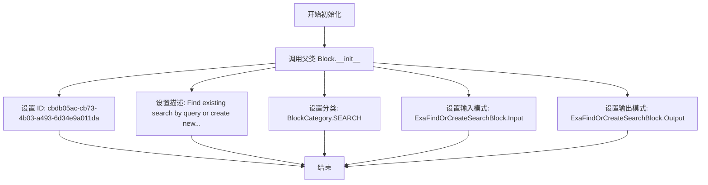
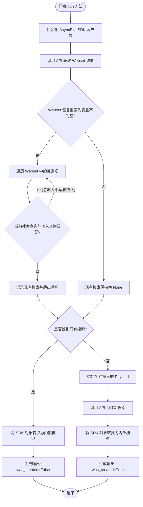

# `AutoGPT\autogpt_platform\backend\backend\blocks\exa\websets_search.py` 详细设计文档

This module provides workflow blocks for creating, managing, and monitoring searches within Exa Websets, including functionality to add new searches, check status, cancel operations, and conditionally create searches to prevent duplicates.

## 整体流程



## 类结构

```
BaseModel
└── WebsetSearchModel
Enum
├── SearchBehavior
└── SearchEntityType
Block
├── ExaCreateWebsetSearchBlock
│   ├── Input
│   └── Output
├── ExaGetWebsetSearchBlock
│   ├── Input
│   └── Output
├── ExaCancelWebsetSearchBlock
│   ├── Input
│   └── Output
└── ExaFindOrCreateSearchBlock
    ├── Input
    └── Output
```

## 全局变量及字段


### `WebsetSearchModel.id`
    
The unique identifier for the search

类型：`str`
    


### `WebsetSearchModel.webset_id`
    
The ID of the webset this search belongs to

类型：`str`
    


### `WebsetSearchModel.status`
    
Current status of the search

类型：`str`
    


### `WebsetSearchModel.query`
    
The search query describing what to find

类型：`str`
    


### `WebsetSearchModel.entity_type`
    
Type of entity being searched

类型：`str`
    


### `WebsetSearchModel.criteria`
    
List of criteria that items must meet

类型：`List[Dict[str, Any]]`
    


### `WebsetSearchModel.count`
    
Number of items to find

类型：`int`
    


### `WebsetSearchModel.behavior`
    
Behavior for how new search results interact with existing items

类型：`str`
    


### `WebsetSearchModel.progress`
    
Search progress information

类型：`Dict[str, Any]`
    


### `WebsetSearchModel.recall`
    
Recall estimation information

类型：`Optional[Dict[str, Any]]`
    


### `WebsetSearchModel.created_at`
    
ISO format timestamp of when the search was created

类型：`str`
    


### `WebsetSearchModel.updated_at`
    
ISO format timestamp of when the search was last updated

类型：`str`
    


### `WebsetSearchModel.canceled_at`
    
ISO format timestamp of when the search was canceled

类型：`Optional[str]`
    


### `WebsetSearchModel.canceled_reason`
    
Reason for cancellation

类型：`Optional[str]`
    


### `WebsetSearchModel.metadata`
    
Metadata attached to the search

类型：`Dict[str, Any]`
    


### `SearchBehavior.OVERRIDE`
    
Replace existing items

类型：`str`
    


### `SearchBehavior.APPEND`
    
Add to existing items

类型：`str`
    


### `SearchBehavior.MERGE`
    
Merge with existing items

类型：`str`
    


### `SearchEntityType.COMPANY`
    
Represents a company entity

类型：`str`
    


### `SearchEntityType.PERSON`
    
Represents a person entity

类型：`str`
    


### `SearchEntityType.ARTICLE`
    
Represents an article entity

类型：`str`
    


### `SearchEntityType.RESEARCH_PAPER`
    
Represents a research paper entity

类型：`str`
    


### `SearchEntityType.CUSTOM`
    
Represents a custom entity type

类型：`str`
    


### `SearchEntityType.AUTO`
    
Represents an automatically determined entity type

类型：`str`
    


### `ExaCreateWebsetSearchBlock.Input`
    
Input schema for creating a webset search

类型：`BlockSchemaInput`
    


### `ExaCreateWebsetSearchBlock.Output`
    
Output schema for creating a webset search

类型：`BlockSchemaOutput`
    


### `ExaGetWebsetSearchBlock.Input`
    
Input schema for getting a webset search

类型：`BlockSchemaInput`
    


### `ExaGetWebsetSearchBlock.Output`
    
Output schema for getting a webset search

类型：`BlockSchemaOutput`
    


### `ExaCancelWebsetSearchBlock.Input`
    
Input schema for canceling a webset search

类型：`BlockSchemaInput`
    


### `ExaCancelWebsetSearchBlock.Output`
    
Output schema for canceling a webset search

类型：`BlockSchemaOutput`
    


### `ExaFindOrCreateSearchBlock.Input`
    
Input schema for finding or creating a webset search

类型：`BlockSchemaInput`
    


### `ExaFindOrCreateSearchBlock.Output`
    
Output schema for finding or creating a webset search

类型：`BlockSchemaOutput`
    
    

## 全局函数及方法


### `WebsetSearchModel.from_sdk`

该方法是一个类方法，用于将 Exa SDK 返回的 `SdkWebsetSearch` 对象转换为内部定义的稳定数据模型 `WebsetSearchModel`，处理了对象属性的映射、枚举值的提取、日期格式的转换以及嵌套对象的序列化。

参数：

-  `search`：`SdkWebsetSearch`，来自 Exa SDK 的原始 WebsetSearch 对象，包含需要转换的搜索数据。

返回值：`WebsetSearchModel`，转换完成后的稳定 Pydantic 模型实例。

#### 流程图



#### 带注释源码

```python
    @classmethod
    def from_sdk(cls, search: SdkWebsetSearch) -> "WebsetSearchModel":
        """Convert SDK WebsetSearch to our stable model."""
        # 1. 提取并处理实体类型，默认为 'auto'
        entity_type = "auto"
        if search.entity:
            # 将 SDK 对象转储为字典，并获取其中的 'type' 属性
            entity_dict = search.entity.model_dump(by_alias=True)
            entity_type = entity_dict.get("type", "auto")

        # 2. 转换搜索条件列表，将对象列表转换为字典列表
        criteria = [c.model_dump(by_alias=True) for c in search.criteria]

        # 3. 转换进度信息，处理 None 情况
        progress_dict = {}
        if search.progress:
            progress_dict = search.progress.model_dump(by_alias=True)

        # 4. 转换召回信息，处理 None 情况
        recall_dict = None
        if search.recall:
            recall_dict = search.recall.model_dump(by_alias=True)

        # 5. 实例化并返回模型，处理各字段的类型转换（枚举取值、日期转字符串）
        return cls(
            id=search.id,
            webset_id=search.webset_id,
            # 处理状态枚举：如果有 value 属性则取值，否则转字符串
            status=(
                search.status.value
                if hasattr(search.status, "value")
                else str(search.status)
            ),
            query=search.query,
            entity_type=entity_type,
            criteria=criteria,
            count=search.count,
            # 处理行为枚举：存在则取 value，否则默认 'override'
            behavior=search.behavior.value if search.behavior else "override",
            progress=progress_dict,
            recall=recall_dict,
            # 处理创建时间：存在则转 ISO 格式字符串，否则为空字符串
            created_at=search.created_at.isoformat() if search.created_at else "",
            # 处理更新时间：存在则转 ISO 格式字符串，否则为空字符串
            updated_at=search.updated_at.isoformat() if search.updated_at else "",
            # 处理取消时间：存在则转 ISO 格式字符串，否则为 None
            canceled_at=search.canceled_at.isoformat() if search.canceled_at else None,
            # 处理取消原因：存在则取枚举值，否则为 None
            canceled_reason=(
                search.canceled_reason.value if search.canceled_reason else None
            ),
            # 处理元数据：存在则保留，否则为空字典
            metadata=search.metadata if search.metadata else {},
        )
```


### `ExaCreateWebsetSearchBlock.__init__`

该方法是 `ExaCreateWebsetSearchBlock` 类的构造函数，用于初始化块的元数据，包括唯一标识符、描述、所属类别以及输入输出模式的定义。通过调用父类的 `__init__` 方法完成注册。

参数：

-   `self`：`ExaCreateWebsetSearchBlock`，类实例自身，在 Python 中隐式传递。

返回值：`None`，构造函数不返回任何值，仅完成实例的初始化配置。

#### 流程图



#### 带注释源码

```python
    def __init__(self):
        # 调用父类 Block 的初始化方法，配置块的基本属性
        super().__init__(
            # 块的唯一标识符 (UUID)
            id="342ff776-2e2c-4cdb-b392-4eeb34b21d5f",
            # 块的功能描述，用于 UI 展示或文档说明
            description="Add a new search to an existing webset to find more items",
            # 将块归类到 SEARCH 类别中，便于在系统中分类管理
            categories={BlockCategory.SEARCH},
            # 绑定定义的输入模式类 Input，规范入参结构
            input_schema=ExaCreateWebsetSearchBlock.Input,
            # 绑定定义的输出模式类 Output，规范出参结构
            output_schema=ExaCreateWebsetSearchBlock.Output,
        )
```


### `ExaCreateWebsetSearchBlock.run`

该方法负责向指定的 Webset 添加一个新的搜索任务。它根据输入参数构建复杂的请求负载（包含实体、标准、排除源等配置），调用 Exa SDK 创建搜索，并根据配置决定是立即返回初步结果，还是通过轮询机制等待搜索完成后再返回最终结果。

参数：

-  `input_data`：`ExaCreateWebsetSearchBlock.Input`，包含搜索配置的输入数据对象，涵盖 Webset ID、查询文本、数量、实体类型、行为模式、排除/限制源范围以及轮询设置等。
-  `credentials`：`APIKeyCredentials`，用于身份认证的凭据对象，包含访问 Exa API 所需的 API Key。
-  `**kwargs`：`Any`，额外的关键字参数，用于扩展或传递上下文信息。

返回值：`BlockOutput`，一个异步生成器，按顺序产生包含搜索 ID、状态、查询内容、预期结果以及可选的完成进度（如找到的项目数和耗时）的键值对元组。

#### 流程图



#### 带注释源码

```python
    async def run(
        self, input_data: Input, *, credentials: APIKeyCredentials, **kwargs
    ) -> BlockOutput:
        import time

        # 1. 初始化基础请求 Payload
        payload = {
            "query": input_data.query,
            "count": input_data.count,
            "behavior": input_data.behavior.value,
            "recall": input_data.recall,
        }

        # 2. 处理实体配置
        # 如果指定了具体的实体类型（非 AUTO），则添加实体信息
        if input_data.entity_type != SearchEntityType.AUTO:
            entity = {"type": input_data.entity_type.value}
            # 如果是自定义实体类型，补充描述信息
            if (
                input_data.entity_type == SearchEntityType.CUSTOM
                and input_data.entity_description
            ):
                entity["description"] = input_data.entity_description
            payload["entity"] = entity

        # 3. 处理验证标准
        # 将输入的标准字符串列表转换为 API 需要的字典列表格式
        if input_data.criteria:
            payload["criteria"] = [{"description": c} for c in input_data.criteria]

        # 4. 处理排除源
        # 构建 exclude 列表，关联 source ID 和 type
        if input_data.exclude_source_ids:
            exclude_list = []
            for idx, src_id in enumerate(input_data.exclude_source_ids):
                src_type = "import"
                # 如果提供了对应的类型，则使用提供的类型，否则默认为 import
                if input_data.exclude_source_types and idx < len(
                    input_data.exclude_source_types
                ):
                    src_type = input_data.exclude_source_types[idx]
                exclude_list.append({"source": src_type, "id": src_id})
            payload["exclude"] = exclude_list

        # 5. 处理作用域源
        # 构建 scope 列表，支持复杂的源限制和关系定义
        if input_data.scope_source_ids:
            scope_list: list[dict[str, Any]] = []
            for idx, src_id in enumerate(input_data.scope_source_ids):
                scope_item: dict[str, Any] = {"source": "import", "id": src_id}

                # 设置源类型
                if input_data.scope_source_types and idx < len(
                    input_data.scope_source_types
                ):
                    scope_item["source"] = input_data.scope_source_types[idx]

                # 添加关系定义
                if input_data.scope_relationships and idx < len(
                    input_data.scope_relationships
                ):
                    relationship: dict[str, Any] = {
                        "definition": input_data.scope_relationships[idx]
                    }
                    # 添加关系限制
                    if input_data.scope_relationship_limits and idx < len(
                        input_data.scope_relationship_limits
                    ):
                        relationship["limit"] = input_data.scope_relationship_limits[
                            idx
                        ]
                    scope_item["relationship"] = relationship

                scope_list.append(scope_item)
            payload["scope"] = scope_list

        # 6. 添加元数据
        if input_data.metadata:
            payload["metadata"] = input_data.metadata

        start_time = time.time()

        # 7. 初始化 Exa SDK 客户端
        aexa = AsyncExa(api_key=credentials.api_key.get_secret_value())

        # 8. 创建搜索
        sdk_search = await aexa.websets.searches.create(
            webset_id=input_data.webset_id, params=payload
        )

        # 提取基础返回信息
        search_id = sdk_search.id
        status = (
            sdk_search.status.value
            if hasattr(sdk_search.status, "value")
            else str(sdk_search.status)
        )

        # 9. 提取预期结果
        expected_results = {}
        if sdk_search.recall:
            recall_dict = sdk_search.recall.model_dump(by_alias=True)
            expected = recall_dict.get("expected", {})
            expected_results = {
                "total": expected.get("total", 0),
                "confidence": expected.get("confidence", ""),
                "min": expected.get("bounds", {}).get("min", 0),
                "max": expected.get("bounds", {}).get("max", 0),
                "reasoning": recall_dict.get("reasoning", ""),
            }

        # 10. 轮询逻辑处理
        # 如果配置为等待完成，则进入轮询循环
        if input_data.wait_for_completion:
            import asyncio

            poll_interval = 5  # 初始轮询间隔
            max_interval = 30 # 最大轮询间隔
            poll_start = time.time()

            # 循环直到超时
            while time.time() - poll_start < input_data.polling_timeout:
                # 获取最新搜索状态
                current_search = await aexa.websets.searches.get(
                    webset_id=input_data.webset_id, id=search_id
                )
                current_status = (
                    current_search.status.value
                    if hasattr(current_search.status, "value")
                    else str(current_search.status)
                )

                # 检查是否达到终态
                if current_status in ["completed", "failed", "cancelled"]:
                    items_found = 0
                    if current_search.progress:
                        items_found = current_search.progress.found
                    completion_time = time.time() - start_time

                    # 产出包含完整进度的结果
                    yield "search_id", search_id
                    yield "webset_id", input_data.webset_id
                    yield "status", current_status
                    yield "query", input_data.query
                    yield "expected_results", expected_results
                    yield "items_found", items_found
                    yield "completion_time", completion_time
                    return

                # 等待一段时间后再次轮询
                await asyncio.sleep(poll_interval)
                # 指数退避策略，增加轮询间隔
                poll_interval = min(poll_interval * 1.5, max_interval)

            # 11. 超时处理
            # 如果循环结束（超时）仍未完成，产出当前状态
            yield "search_id", search_id
            yield "webset_id", input_data.webset_id
            yield "status", status
            yield "query", input_data.query
            yield "expected_results", expected_results
            yield "items_found", 0
            yield "completion_time", time.time() - start_time
        else:
            # 12. 非轮询模式：立即返回
            yield "search_id", search_id
            yield "webset_id", input_data.webset_id
            yield "status", status
            yield "query", input_data.query
            yield "expected_results", expected_results
```


### `ExaGetWebsetSearchBlock.__init__`

初始化 `ExaGetWebsetSearchBlock` 类实例，配置块的唯一标识符、描述、分类以及输入和输出的数据模式（Schema）。

参数：

-   `self`：`ExaGetWebsetSearchBlock`，类实例本身

返回值：`None`，无返回值，仅执行父类初始化操作

#### 流程图



#### 带注释源码

```python
    def __init__(self):
        # 调用父类 Block 的构造函数以注册块的基本元数据
        super().__init__(
            # 块的唯一标识符 (UUID)
            id="4fa3e627-a0ff-485f-8732-52148051646c",
            # 块的文本描述，说明其功能
            description="Get the status and details of a webset search",
            # 定义块所属的分类，这里归类为搜索类
            categories={BlockCategory.SEARCH},
            # 指定输入数据的 Schema 定义，使用内部类 Input
            input_schema=ExaGetWebsetSearchBlock.Input,
            # 指定输出数据的 Schema 定义，使用内部类 Output
            output_schema=ExaGetWebsetSearchBlock.Output,
        )
```


### `ExaGetWebsetSearchBlock.run`

获取 Webset 搜索的状态和详细信息。该方法通过 Exa SDK 根据提供的 Webset ID 和搜索 ID 获取搜索对象，将其转换为稳定的数据模型，提取进度和召回（Recall）信息，并将这些数据作为输出产出。

参数：

- `input_data`：`ExaGetWebsetSearchBlock.Input`，输入数据块，包含凭据、Webset ID 和搜索 ID。
- `credentials`：`APIKeyCredentials`，Exa API 的凭据对象，用于鉴权。
- `**kwargs`：`Any`，额外的关键字参数。

返回值：`BlockOutput`，一个异步生成器，产出包含搜索详情、状态、进度和召回信息的键值对。

#### 流程图



#### 带注释源码

```python
async def run(
    self, input_data: Input, *, credentials: APIKeyCredentials, **kwargs
) -> BlockOutput:
    # 使用 AsyncExa SDK
    # 根据提供的凭据初始化 Exa 异步客户端
    aexa = AsyncExa(api_key=credentials.api_key.get_secret_value())

    # 调用 SDK 获取指定 Webset 中的特定搜索详情
    sdk_search = await aexa.websets.searches.get(
        webset_id=input_data.webset_id, id=input_data.search_id
    )

    # 将 SDK 返回的搜索对象转换为内部稳定的数据模型 (WebsetSearchModel)
    search = WebsetSearchModel.from_sdk(sdk_search)

    # 提取进度信息
    # 从 search 对象中获取 found, analyzed, completion 等字段，构建 progress_info 字典
    progress_info = {
        "found": search.progress.get("found", 0),
        "analyzed": search.progress.get("analyzed", 0),
        "completion": search.progress.get("completion", 0),
        "time_left": search.progress.get("timeLeft", 0),
    }

    # 提取召回（Recall）信息
    recall_data = {}
    if search.recall:
        # 如果存在召回数据，提取预期结果总数、置信度、边界范围和推理原因
        expected = search.recall.get("expected", {})
        recall_data = {
            "expected_total": expected.get("total", 0),
            "confidence": expected.get("confidence", ""),
            "min_expected": expected.get("bounds", {}).get("min", 0),
            "max_expected": expected.get("bounds", {}).get("max", 0),
            "reasoning": search.recall.get("reasoning", ""),
        }

    # 产出搜索的基本信息和元数据
    yield "search_id", search.id
    yield "status", search.status
    yield "query", search.query
    yield "entity_type", search.entity_type
    yield "criteria", search.criteria
    
    # 产出处理后的进度和召回信息
    yield "progress", progress_info
    yield "recall", recall_data
    
    # 产出时间戳和取消相关信息
    yield "created_at", search.created_at
    yield "updated_at", search.updated_at
    yield "canceled_at", search.canceled_at
    yield "canceled_reason", search.canceled_reason
    yield "metadata", search.metadata
```


### `ExaCancelWebsetSearchBlock.__init__`

初始化 `ExaCancelWebsetSearchBlock` 类实例，配置该块的唯一标识符、描述、所属分类以及输入输出Schema结构。

参数：

-   `self`：`ExaCancelWebsetSearchBlock`，指向类实例本身的引用

返回值：`None`，该方法用于实例初始化，无返回值

#### 流程图



#### 带注释源码

```python
def __init__(self):
    # 调用父类 Block 的初始化方法，注册块的元数据
    super().__init__(
        # 定义该块的唯一标识符 (UUID)
        id="74ef9f1e-ae89-4c7f-9d7d-d217214815b4",
        # 定义该块的描述信息
        description="Cancel a running webset search",
        # 定义该块所属的分类为搜索类
        categories={BlockCategory.SEARCH},
        # 绑定输入数据结构定义
        input_schema=ExaCancelWebsetSearchBlock.Input,
        # 绑定输出数据结构定义
        output_schema=ExaCancelWebsetSearchBlock.Output,
    )
```


### `ExaCancelWebsetSearchBlock.run`

该方法通过调用 Exa SDK 取消指定 Webset 中正在运行的搜索任务，并返回取消后的状态、已找到的项目数量以及操作成功的确认信息。

参数：

-   `input_data`：`ExaCancelWebsetSearchBlock.Input`，包含目标 Webset ID 和要取消的 Search ID 的输入数据对象。
-   `credentials`：`APIKeyCredentials`，用于 API 身份验证的凭证对象，包含 Exa API Key。
-   `**kwargs`：`Any`，扩展用的关键字参数。

返回值：`BlockOutput`，异步生成器，逐步产生包含取消结果详情的键值对。

#### 流程图



#### 带注释源码

```python
async def run(
    self, input_data: Input, *, credentials: APIKeyCredentials, **kwargs
) -> BlockOutput:
    # 使用传入的 API Key 初始化 AsyncExa SDK 客户端
    aexa = AsyncExa(api_key=credentials.api_key.get_secret_value())

    # 调用 SDK 的 websets.searches.cancel 方法，传入 webset_id 和 search_id 来执行取消操作
    canceled_search = await aexa.websets.searches.cancel(
        webset_id=input_data.webset_id, id=input_data.search_id
    )

    # 初始化已找到的项目数量为 0
    items_found = 0
    # 如果取消后的搜索对象包含进度信息，则获取已找到的项目数
    if canceled_search.progress:
        items_found = canceled_search.progress.found

    # 获取搜索状态，处理枚举类型以确保返回字符串形式的值
    status = (
        canceled_search.status.value
        if hasattr(canceled_search.status, "value")
        else str(canceled_search.status)
    )

    # 产生并输出取消后的搜索 ID
    yield "search_id", canceled_search.id
    # 产生并输出取消后的状态
    yield "status", status
    # 产生并输出取消前已找到的项目数量
    yield "items_found_before_cancel", items_found
    # 产生并输出操作成功的标志，这里固定为 "true"
    yield "success", "true"
```


### `ExaFindOrCreateSearchBlock.__init__`

初始化 `ExaFindOrCreateSearchBlock` 类实例，配置该块的唯一标识符、描述信息、所属分类以及输入输出数据模式。

参数：

- `self`: `ExaFindOrCreateSearchBlock`，类实例自身，用于在初始化时引用当前对象。

返回值：`None`，初始化方法无返回值。

#### 流程图



#### 带注释源码

```python
def __init__(self):
    # 调用父类 Block 的初始化方法，配置块的基本元数据和结构
    super().__init__(
        id="cbdb05ac-cb73-4b03-a493-6d34e9a011da",  # 指定该块的唯一标识符
        description="Find existing search by query or create new - prevents duplicate searches in workflows",  # 块的功能描述，说明其用于查找或创建搜索以防止重复
        categories={BlockCategory.SEARCH},  # 将块归类为搜索类别
        input_schema=ExaFindOrCreateSearchBlock.Input,  # 定义输入数据的验证模式，使用内部类 Input
        output_schema=ExaFindOrCreateSearchBlock.Output,  # 定义输出数据的验证模式，使用内部类 Output
    )
```


### `ExaFindOrCreateSearchBlock.run`

该方法是 `ExaFindOrCreateSearchBlock` 的核心执行逻辑，旨在幂等地处理 Webset 搜索任务。它首先尝试在指定的 Webset 中查找是否存在与输入查询相匹配的现有搜索，以避免重复创建；如果未找到，则根据提供的参数创建一个新的搜索，并返回相应的搜索详情及创建状态标识。

参数：

- `input_data`：`ExaFindOrCreateSearchBlock.Input`，包含执行搜索所需的输入数据，如 Webset ID、查询语句、结果数量限制、实体类型及行为配置等。
- `credentials`：`APIKeyCredentials`，用于身份验证的 API 密钥凭证对象。
- `**kwargs`：`Any`，额外的关键字参数，用于扩展或传递上下文信息。

返回值：`BlockOutput`，一个异步生成器，逐步产生搜索结果数据，包含搜索 ID、所属 Webset ID、当前状态、查询语句、是否为新创建的布尔标志以及已找到的项目数量。

#### 流程图



#### 带注释源码

```python
    async def run(
        self, input_data: Input, *, credentials: APIKeyCredentials, **kwargs
    ) -> BlockOutput:
        # 1. 初始化 SDK 客户端，使用提供的凭证
        aexa = AsyncExa(api_key=credentials.api_key.get_secret_value())

        # 2. 获取目标 Webset 的详细信息，用于检查其中已有的搜索
        webset = await aexa.websets.get(id=input_data.webset_id)

        # 3. 初始化变量用于存储匹配到的现有搜索
        existing_search = None
        
        # 4. 检查 Webset 中是否存在搜索列表
        if webset.searches:
            # 5. 遍历所有现有搜索，尝试查找查询条件相同的搜索（忽略大小写和首尾空格）
            for search in webset.searches:
                if search.query.strip().lower() == input_data.query.strip().lower():
                    existing_search = search
                    break # 找到匹配项后立即跳出循环

        # 6. 分支逻辑：如果找到了现有搜索
        if existing_search:
            # 6.1 将 SDK 返回的搜索对象转换为内部稳定的数据模型
            search = WebsetSearchModel.from_sdk(existing_search)

            # 6.2 产出结果：标识 was_created 为 False，并返回现有搜索的状态和进度
            yield "search_id", search.id
            yield "webset_id", input_data.webset_id
            yield "status", search.status
            yield "query", search.query
            yield "was_created", False
            yield "items_found", search.progress.get("found", 0)
        else:
            # 7. 分支逻辑：未找到现有搜索，需要创建新的搜索
            
            # 7.1 构建创建搜索的请求参数 Payload
            payload: Dict[str, Any] = {
                "query": input_data.query,
                "count": input_data.count,
                "behavior": input_data.behavior.value,
            }

            # 7.2 如果实体类型不是 AUTO，则添加实体配置到 Payload
            if input_data.entity_type != SearchEntityType.AUTO:
                payload["entity"] = {"type": input_data.entity_type.value}

            # 7.3 调用 SDK 执行搜索创建操作
            sdk_search = await aexa.websets.searches.create(
                webset_id=input_data.webset_id, params=payload
            )

            # 7.4 将 SDK 返回的新搜索对象转换为内部数据模型
            search = WebsetSearchModel.from_sdk(sdk_search)

            # 7.5 产出结果：标识 was_created 为 True，初始 items_found 为 0
            yield "search_id", search.id
            yield "webset_id", input_data.webset_id
            yield "status", search.status
            yield "query", search.query
            yield "was_created", True
            yield "items_found", 0  # 新创建的搜索尚未找到条目
```


## 关键组件


### WebsetSearchModel

稳定的 Pydantic 模型，用于封装 SDK 的 WebsetSearch 对象，提供 `from_sdk` 类方法将动态 SDK 响应转换为稳定的数据结构，确保对外输出的数据格式一致性。

### SearchBehavior

枚举组件，定义了搜索结果与现有 Webset 条目交互的策略，包括覆盖、追加和合并三种模式，用于控制新数据的写入行为。

### SearchEntityType

枚举组件，指定搜索目标的实体类型，支持公司、人员、文章、论文、自定义及自动检测等多种类型，用于精细化搜索范围。

### ExaCreateWebsetSearchBlock

核心功能块，负责在 Webset 中创建新搜索，支持复杂的参数配置（如实体类型、验证标准、源范围排除、元数据）及异步轮询等待完成的机制。

### ExaGetWebsetSearchBlock

查询功能块，用于获取指定 Webset 搜索的详细状态、进度、召回估算及元数据信息，将 SDK 数据转换为标准化的输出格式。

### ExaCancelWebsetSearchBlock

控制功能块，用于取消正在运行的 Webset 搜索操作，并返回取消前的进度状态，允许用户中断长时间运行的任务。

### ExaFindOrCreateSearchBlock

幂等逻辑块，根据查询字符串检查 Webset 中是否存在相同搜索，若无匹配项则创建新搜索，有效防止工作流中的重复执行。


## 问题及建议


### 已知问题

-   **输入字段列表对齐风险**: 在 `ExaCreateWebsetSearchBlock` 中，`exclude_source_ids` 与 `exclude_source_types` 以及 `scope_source_ids` 与 `scope_source_types` 等字段是通过索引一一对应的。如果用户提供的两个列表长度不一致，逻辑会导致部分数据缺失或被忽略，且难以调试。
-   **低效的重复搜索检测**: `ExaFindOrCreateSearchBlock` 通过获取 Webset 的所有搜索并在内存中遍历比对 `query` 来判断是否存在。当 Webset 包含大量历史搜索记录时，这会导致性能下降和网络带宽浪费，且基于字符串的比对可能不够精确（例如忽略大小写但未忽略标点差异）。
-   **代码重复**: 提取 `status` 值的逻辑（`status.value if hasattr... else str...`）在多个 Blocks 的 `run` 方法以及 `WebsetSearchModel.from_sdk` 中重复出现，增加了维护成本。
-   **局部导入**: 在 `ExaCreateWebsetSearchBlock.run` 方法中使用了 `import time` 和 `import asyncio`。这违反了 Python 的常规惯例（PEP 8），降低了代码的可读性，且没有明显的性能收益。
-   **轮询机制缺乏错误处理**: `ExaCreateWebsetSearchBlock` 的 `wait_for_completion` 逻辑中，如果 `aexa.websets.searches.get` 在轮询过程中发生网络瞬态故障，循环会直接抛出异常中断，而没有自动重试机制。

### 优化建议

-   **使用复合 Pydantic 模型优化输入**: 建议将 `exclude_source_ids`/`types` 和 `scope_source_ids`/`types` 等相关联的字段组合成单独的 Pydantic 模型（如 `SourceReference`），并在 Input Schema 中使用 `List[SourceReference]`。这能从数据结构层面保证 ID 和 Type 的强绑定。
-   **提取公共辅助函数**: 将 SDK 状态提取、日期格式化等重复逻辑提取为模块内的辅助函数（如 `_get_status_value`），以遵循 DRY（Don't Repeat Yourself）原则。
-   **标准化导入语句**: 将 `time` 和 `asyncio` 等标准库的 `import` 语句移至文件顶部，以符合 Python 代码规范并提升代码整洁度。
-   **增强轮询逻辑的健壮性**: 在轮询循环中加入 `try-except` 块，针对特定的网络错误（如超时、连接错误）实现指数退避重试策略，而不是直接失败。
-   **依赖注入 SDK 客户端**: 目前 `AsyncExa` 是在每个 `run` 方法中实例化的。建议通过依赖注入或初始化配置传入 `AsyncExa` 实例，以便在单元测试中注入 Mock 对象，提高代码的可测试性。


## 其它


### 设计目标与约束

1.  **稳定性与解耦**：通过引入 `WebsetSearchModel` 作为 SDK 响应的镜像模型，隔离了外部 SDK (`exa_py`) 的数据结构变更对系统核心逻辑的影响，确保了输出接口的长期稳定性。
2.  **异步非阻塞**：所有的搜索操作（创建、获取、取消）均基于异步 I/O (`AsyncExa`) 实现，以适应高并发环境下的性能要求，避免阻塞主线程。
3.  **操作幂等性与去重**：提供 `ExaFindOrCreateSearchBlock`，基于 Query 进行去重查询，防止在自动化工作流中因重复触发而产生冗余的搜索任务。
4.  **灵活的执行模式**：支持“异步返回”和“同步等待”两种模式。用户可通过 `wait_for_completion` 参数选择是否等待搜索完成，以平衡实时性与资源占用。
5.  **资源限制约束**：
    *   `count` 参数限制在 1 到 1000 之间，防止单次请求数据量过大。
    *   `polling_timeout` 限制在 1 到 600 秒之间，防止长时间挂起的连接消耗服务器资源。

### 错误处理与异常设计

1.  **输入验证**：
    *   利用 `Pydantic` 的 `BlockSchemaInput` 对所有入参进行严格的类型检查和约束校验（如 `ge=1` 最小值限制），在运行前拦截非法输入。
    *   通过 `CredentialsMetaInput` 确保 API Key 的有效性。
2.  **API 异常传播**：
    *   代码中未显式捕获 `AsyncExa` 抛出的网络或业务异常（如 401 Unauthorized, 404 Not Found），这些异常将向上抛出，由上层的 Block 执行框架或工作流引擎进行统一捕获和重试处理。
3.  **超时与降级处理**：
    *   在 `ExaCreateWebsetSearchBlock` 中，如果启用 `wait_for_completion` 但达到 `polling_timeout` 仍未完成，系统不会抛出超时异常，而是优雅退出轮询循环，返回当前已获取的搜索状态（可能仍在运行中），保证了流程的继续执行。
4.  **防御性编程**：
    *   在 `WebsetSearchModel.from_sdk` 转换方法中，对可能为 `None` 的字段（如 `created_at`, `progress`）进行了显式检查和默认值填充，防止因上游数据缺失导致的 `AttributeError`。

### 数据流与状态机

1.  **数据流**：
    *   **输入流**：外部调用方提供凭证与配置参数 -> Block Input Schema 校验 -> `payload` 字典构建 -> `AsyncExa` SDK 调用。
    *   **转换流**：SDK 返回原生 `SdkWebsetSearch` 对象 -> `WebsetSearchModel.from_sdk` 映射为内部稳定模型 -> 提取特定字段（如 `expected_results`, `progress_info`）。
    *   **输出流**：内部模型数据 -> Block Output Schema 格式化 -> 通过 `yield` 生成器逐步输出键值对给下游组件。
2.  **状态机**：
    *   搜索任务主要包含以下状态：`created` (已创建) -> `running` (运行中) -> `completed` (完成) / `failed` (失败) / `cancelled` (已取消)。
    *   **轮询逻辑**：`ExaCreateWebsetSearchBlock` 实现了一个基于时间的状态监听器。它初始化一个轮询循环，定期检查任务状态，只有当状态进入终态 (`completed`, `failed`, `cancelled`) 时，才会停止计时并返回最终结果（包含 `items_found` 和 `completion_time`）。

### 外部依赖与接口契约

1.  **`exa_py` (SDK)**：
    *   **契约**：模块依赖于 `AsyncExa` 类进行 HTTP 通信。
    *   **接口**：核心交互接口包括 `websets.searches.create` (创建搜索)、`websets.searches.get` (获取详情)、`websets.searches.cancel` (取消搜索) 以及 `websets.get` (获取 Webset 信息以实现查找功能)。
    *   **数据类型**：依赖 `exa_py.websets.types.WebsetSearch` 作为数据源。
2.  **`backend.sdk` (框架层)**：
    *   **契约**：所有 Block 必须继承自 `Block` 类，并实现 `async run` 方法。
    *   **接口**：必须定义嵌套类 `Input` (继承 `BlockSchemaInput`) 和 `Output` (继承 `BlockSchemaOutput`) 来定义输入输出的元数据契约。
3.  **`pydantic` (数据层)**：
    *   **契约**：用于定义数据模型和配置类，确保数据的序列化和反序列化符合预期。

    