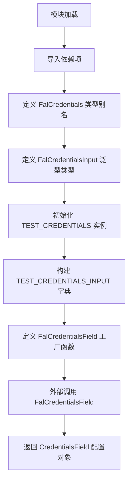
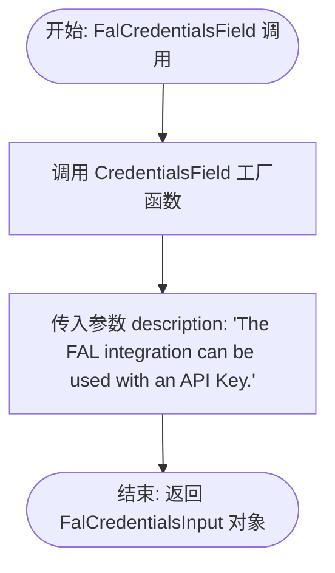

# `AutoGPT\autogpt_platform\backend\backend\blocks\fal\_auth.py` 详细设计文档

该文件主要负责定义和配置 FAL 服务提供商的 API 凭据模型。它包含类型别名 `FalCredentials` 和 `FalCredentialsInput` 用于类型注解，预设了 Mock 数据 `TEST_CREDENTIALS` 和 `TEST_CREDENTIALS_INPUT` 供测试使用，并提供了 `FalCredentialsField` 工厂函数用于在 Block 中创建凭据输入字段。

## 整体流程



## 类结构

```
fal.py
├── Types (类型定义)
│   ├── FalCredentials
│   └── FalCredentialsInput
├── Constants (测试常量)
│   ├── TEST_CREDENTIALS
│   └── TEST_CREDENTIALS_INPUT
└── Functions (工厂函数)
    └── FalCredentialsField
```

## 全局变量及字段


### `FalCredentials`
    
FAL 提供者的凭证类型别名，指向 APIKeyCredentials 类。

类型：`APIKeyCredentials`
    


### `FalCredentialsInput`
    
定义 FAL 提供者凭证输入的泛型类型，指定了提供者名称为 'fal' 且认证字段为 'api_key'。

类型：`CredentialsMetaInput`
    


### `TEST_CREDENTIALS`
    
预定义的测试凭证对象，包含模拟的 FAL API 密钥及相关元数据。

类型：`APIKeyCredentials`
    


### `TEST_CREDENTIALS_INPUT`
    
预定义的测试输入字典，用于模拟用户提交的 FAL 凭证元数据结构。

类型：`dict`
    


    

## 全局函数及方法


### `FalCredentialsField`

该函数用于创建并返回一个 Pydantic 模型字段，专门用于在区块中配置 FAL 服务的 API Key 凭证输入。

参数：

返回值：`FalCredentialsInput`，包含 FAL 集成凭证输入定义的 Pydantic 字段对象。

#### 流程图



#### 带注释源码

```python
def FalCredentialsField() -> FalCredentialsInput:
    """
    Creates a FAL credentials input on a block.
    """
    # 调用 CredentialsField 工厂函数，并传入描述文本
    # 生成一个用于输入 FAL API Key 的 Pydantic 字段实例
    return CredentialsField(
        description="The FAL integration can be used with an API Key.",
    )
```


## 关键组件


### FalCredentials
FAL 提供商的 API 密钥凭证类型别名，基于通用的 APIKeyCredentials 定义。

### FalCredentialsInput
用于定义 FAL 凭证输入结构的类型，严格限制了提供商名称为 "fal" 以及凭证类型为 "api_key"。

### FalCredentialsField
工厂函数组件，用于在集成块上生成 FAL 凭证输入字段，包含特定的描述信息。

### TEST_CREDENTIALS
用于测试和演示的模拟凭证对象，包含预定义的 ID、提供商、模拟 API Key 等信息。

### TEST_CREDENTIALS_INPUT
用于测试和演示的模拟凭证输入字典，模拟了从前端或配置文件传入的数据结构。


## 问题及建议


### 已知问题

-   **硬编码测试凭证存在安全风险**：`TEST_CREDENTIALS` 和 `TEST_CREDENTIALS_INPUT` 包含硬编码的模拟 API Key。虽然前缀为 `TEST_`，但如果该文件被部署到生产环境或被不当引用，可能导致敏感信息泄露。
-   **测试数据存在维护成本和一致性风险**：`TEST_CREDENTIALS_INPUT` 是手动构造的字典，依赖于 `TEST_CREDENTIALS`。如果 `APIKeyCredentials` 的字段结构发生变化（例如新增字段），需要手动同步更新该字典，否则会导致测试数据不一致或失效。
-   **命名规范不符合标准 Python 风格**：函数 `FalCredentialsField` 使用了 PascalCase（大驼峰）命名。在 Python PEP 8 规范中，函数名通常推荐使用 snake_case（小写加下划线），除非是遵循特定框架（如部分类工厂模式）的强制约定。

### 优化建议

-   **隔离测试数据**：建议将 `TEST_CREDENTIALS` 和 `TEST_CREDENTIALS_INPUT` 迁移至专门的测试模块（如 `tests/` 目录下）或使用 Pytest 的 fixture 功能进行管理，避免在核心业务代码中保留测试数据。
-   **动态生成测试输入数据**：利用 Pydantic 模型的 `model_dump()` 方法或 `dict()` 方法，直接从 `TEST_CREDENTIALS` 实例生成 `TEST_CREDENTIALS_INPUT`，消除硬编码字典，确保数据结构的一致性。
-   **统一代码风格**：除非项目有特殊的架构约定（例如为了配合特定的前端接口生成），否则建议将函数名重命名为 `fal_credentials_field` 以符合 PEP 8 编码规范，提高代码的可读性和通用性。


## 其它


### 设计目标与约束

*   **类型安全与一致性**：利用 Python 的 `typing.Literal` 和 Pydantic 模型，确保 FAL 提供商的凭证结构在编译期和运行期都严格符合项目统一的 `CredentialsMetaInput` 规范，防止拼写错误和类型不匹配。
*   **安全性**：强制使用 `SecretStr` 包装 API Key。这是为了确保在日志打印、调试输出或对象序列化时，敏感信息不会被明文展示。
*   **可测试性**：通过定义 `TEST_CREDENTIALS` 和 `TEST_CREDENTIALS_INPUT`，为单元测试和集成测试提供了标准的 Mock 数据，降低了测试环境的搭建成本。
*   **框架约束**：必须基于 `backend.data.model` 中定义的基础凭证类型进行扩展，不能破坏原有的数据模型架构。

### 外部依赖与接口契约

*   **外部库依赖**：
    *   `pydantic`: 提供核心的数据验证功能，特别是 `SecretStr` 类型用于安全地存储字符串。
    *   `typing`: Python 标准库，用于类型提示（`Literal`）。
*   **内部模块依赖**：
    *   `backend.data.model`: 依赖 `APIKeyCredentials` 作为基础数据类，依赖 `CredentialsField` 作为字段构建器，依赖 `CredentialsMetaInput` 作为输入元模型。
    *   `backend.integrations.providers`: 依赖 `ProviderName` 枚举来标识特定的提供商名称。
*   **接口契约**：
    *   **`FalCredentialsField()` 函数契约**：
        *   **输入**：无参数。
        *   **输出**：返回 `FalCredentialsInput` 类型的实例（实际上是 `CredentialsField` 的实例）。
        *   **行为**：返回的对象必须能够被 Pydantic 验证，并且包含 `provider="fal"`、`type="api_key"` 等隐式元数据，以及显式的 `description` 字段供前端展示。

### 错误处理与异常设计

*   **委托验证机制**：本模块不包含显式的 `try-except` 块。错误处理依赖于底层的 `CredentialsField` 和 Pydantic 模型。如果系统尝试构建无效的凭证结构（例如缺少必需字段），Pydantic 将抛出 `ValidationError`。
*   **敏感数据保护**：`SecretStr` 的设计本身也是一种防御性编程。即使发生未捕获的异常导致对象状态被转储，API Key 的值也会被掩码处理（显示为 `**********`），从而减少安全泄露风险。

### 数据流与状态机

*   **初始化阶段**：模块被加载时，Python 解释器执行类型别名定义（`FalCredentials`, `FalCredentialsInput`）和全局常量初始化（`TEST_CREDENTIALS`, `TEST_CREDENTIALS_INPUT`）。
*   **运行时调用阶段**：
    1.  外部系统（如 Block 定义或 UI 配置生成器）调用 `FalCredentialsField()`。
    2.  该函数内部实例化 `CredentialsField`，注入特定的描述文本 "The FAL integration can be used with an API Key."。
    3.  `CredentialsField` 根据泛型 `FalCredentialsInput` 的定义，自动填充 `provider` 为 "fal" 和 `type` 为 "api_key"。
    4.  返回构建完成的字段对象，该对象随后被用于构建动态表单或验证用户输入。
*   **状态机**：本模块属于无状态设计。所有的函数都是纯函数（输出仅取决于输入，无副作用），常量在运行期间不可变。不涉及复杂的状态转换逻辑。

    