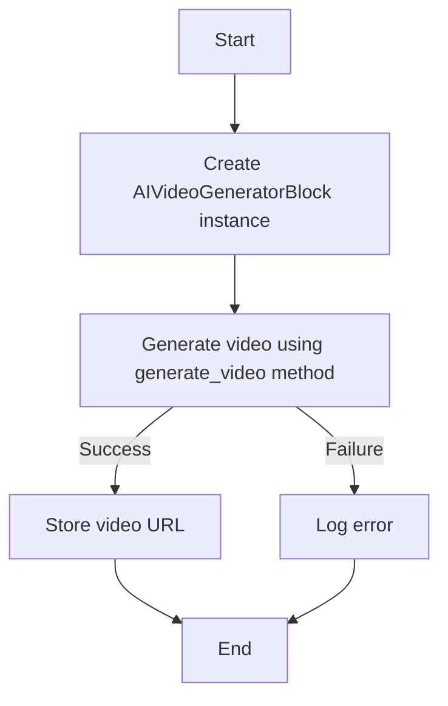
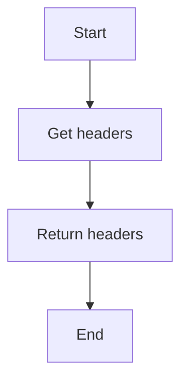
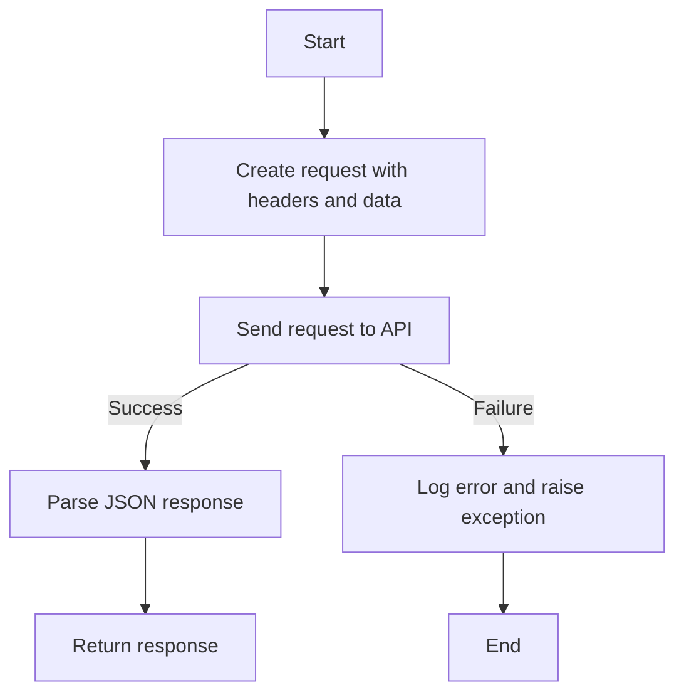
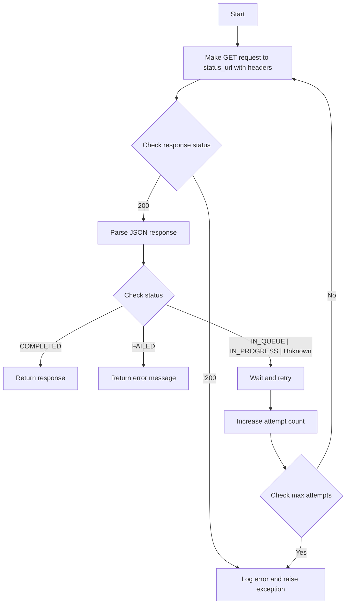
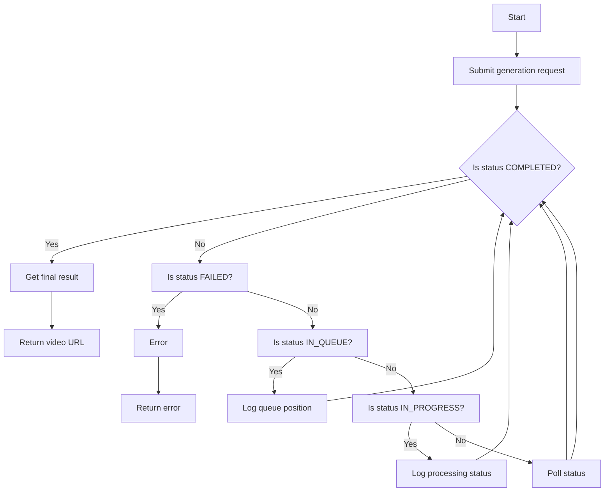
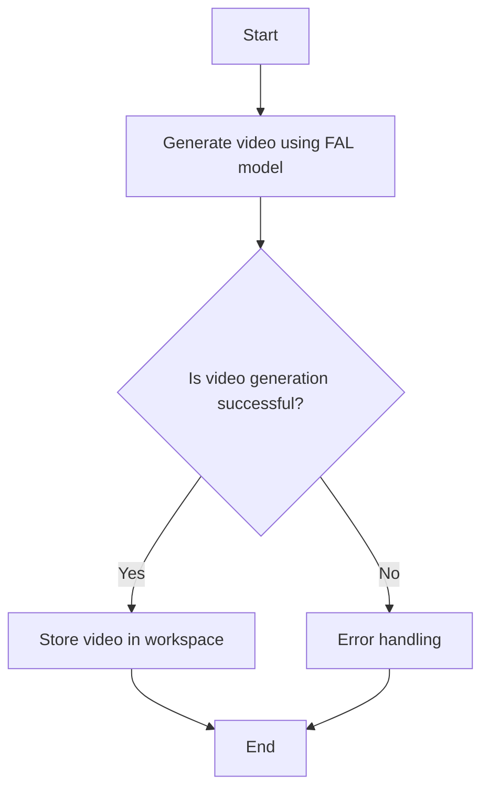
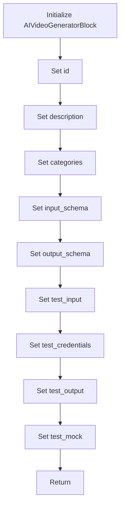
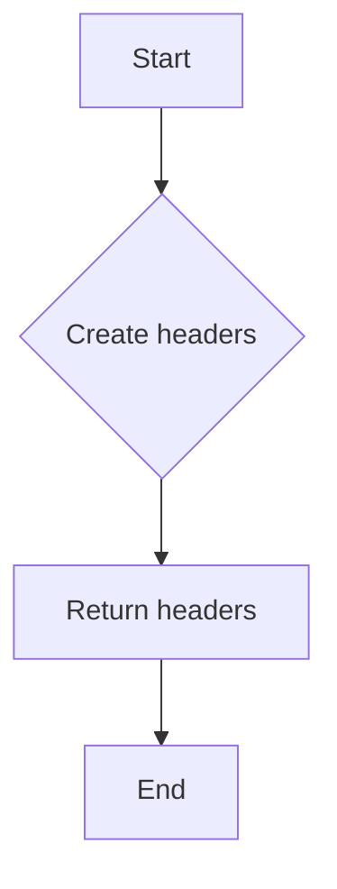
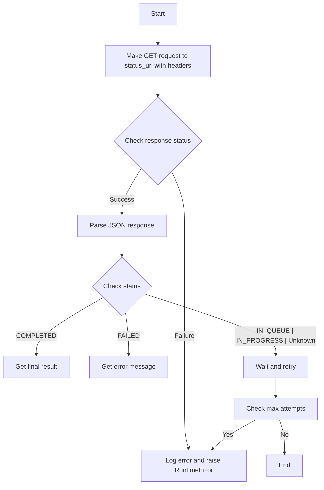
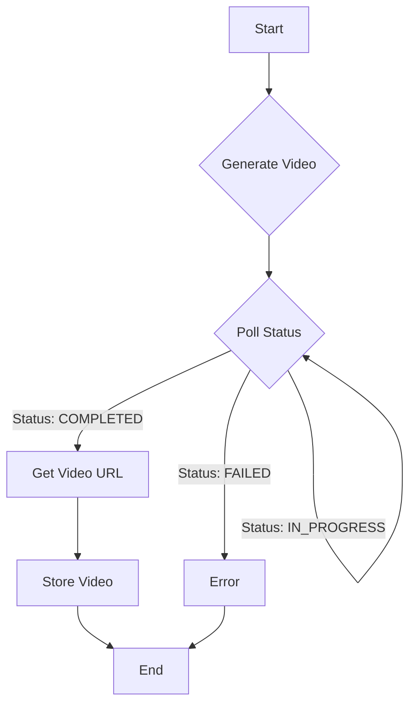

# `.\AutoGPT\autogpt_platform\backend\backend\blocks\fal\ai_video_generator.py` 详细设计文档

The code defines a class AIVideoGeneratorBlock that generates videos using FAL AI models. It handles the process of submitting a video generation request to the FAL API, polling the status of the request, and retrieving the generated video URL.

## 整体流程



## 类结构

```
AIVideoGeneratorBlock (Concrete Block)
├── Input (BlockSchemaInput)
│   ├── prompt (str)
│   ├── model (FalModel)
│   └── credentials (FalCredentialsInput)
├── Output (BlockSchemaOutput)
│   ├── video_url (str)
│   ├── error (str)
│   └── logs (list[str])
└── _get_headers (api_key: str) -> dict[str, str]
```

## 全局变量及字段


### `logger`
    
Logger instance for logging messages.

类型：`logging.Logger`
    


### `TEST_CREDENTIALS`
    
Default credentials for testing purposes.

类型：`FalCredentials`
    


### `TEST_CREDENTIALS_INPUT`
    
Default input credentials for testing purposes.

类型：`FalCredentialsInput`
    


### `FalCredentials`
    
Class representing credentials for FAL API.

类型：`class`
    


### `FalCredentialsField`
    
Class representing a field in FalCredentials.

类型：`class`
    


### `FalCredentialsInput`
    
Class representing input credentials for FAL API.

类型：`class`
    


### `Block`
    
Base class for all blocks.

类型：`class`
    


### `BlockCategory`
    
Enum representing categories of blocks.

类型：`class`
    


### `BlockOutput`
    
Class representing output of a block.

类型：`class`
    


### `BlockSchemaInput`
    
Class representing input schema for a block.

类型：`class`
    


### `BlockSchemaOutput`
    
Class representing output schema for a block.

类型：`class`
    


### `ExecutionContext`
    
Class representing execution context for a block.

类型：`class`
    


### `SchemaField`
    
Class representing a field in a schema.

类型：`class`
    


### `store_media_file`
    
Function to store media files.

类型：`function`
    


### `Requests`
    
Class representing HTTP requests.

类型：`class`
    


### `ClientResponseError`
    
Exception raised for client response errors.

类型：`class`
    


### `MediaFileType`
    
Class representing media file types.

类型：`class`
    


### `AIVideoGeneratorBlock.id`
    
Unique identifier for the block.

类型：`str`
    


### `AIVideoGeneratorBlock.description`
    
Description of the block.

类型：`str`
    


### `AIVideoGeneratorBlock.categories`
    
Categories to which the block belongs.

类型：`set`
    


### `AIVideoGeneratorBlock.input_schema`
    
Input schema for the block.

类型：`Input`
    


### `AIVideoGeneratorBlock.output_schema`
    
Output schema for the block.

类型：`Output`
    


### `AIVideoGeneratorBlock.test_input`
    
Test input data for the block.

类型：`dict`
    


### `AIVideoGeneratorBlock.test_credentials`
    
Test credentials for the block.

类型：`FalCredentials`
    


### `AIVideoGeneratorBlock.test_output`
    
Test output data for the block.

类型：`list`
    


### `AIVideoGeneratorBlock.test_mock`
    
Test mock data for the block.

类型：`dict`
    


### `Input.prompt`
    
Prompt for the video generation.

类型：`str`
    


### `Input.model`
    
FAL model to use for video generation.

类型：`FalModel`
    


### `Input.credentials`
    
Credentials for the FAL API.

类型：`FalCredentialsInput`
    


### `Output.video_url`
    
URL of the generated video.

类型：`str`
    


### `Output.error`
    
Error message if video generation failed.

类型：`str`
    


### `Output.logs`
    
Generation progress logs.

类型：`list`
    
    

## 全局函数及方法


### `_get_headers`

Get headers for FAL API Requests.

参数：

- `api_key`：`str`，API key for authentication with the FAL API.

返回值：`dict[str, str]`，A dictionary containing the headers for the FAL API request.

#### 流程图



#### 带注释源码

```python
def _get_headers(self, api_key: str) -> dict[str, str]:
    """Get headers for FAL API Requests."""
    return {
        "Authorization": f"Key {api_key}",
        "Content-Type": "application/json",
    }
```


### `_submit_request`

Submit a request to the FAL API.

参数：

- `url`：`str`，The URL to which the request is to be submitted.
- `headers`：`dict[str, str]`，The headers to be included in the request.
- `data`：`dict[str, Any]`，The data to be sent in the request body.

返回值：`dict[str, Any]`，The JSON response from the API.

#### 流程图



#### 带注释源码

```python
async def _submit_request(self, url: str, headers: dict[str, str], data: dict[str, Any]) -> dict[str, Any]:
    """Submit a request to the FAL API."""
    try:
        response = await Requests().post(url, headers=headers, json=data)
        return response.json()
    except ClientResponseError as e:
        logger.error(f"FAL API request failed: {str(e)}")
        raise RuntimeError(f"Failed to submit request: {str(e)}")
```


### `_poll_status`

Poll the status endpoint until completion or failure.

参数：

- `status_url`：`str`，The URL of the status endpoint to poll.
- `headers`：`dict[str, str]`，The headers to use for the API request.

返回值：`dict[str, Any]`，The JSON response from the status endpoint.

#### 流程图



#### 带注释源码

```python
async def _poll_status(self, status_url: str, headers: dict[str, str]) -> dict[str, Any]:
    """Poll the status endpoint until completion or failure."""
    try:
        response = await Requests().get(status_url, headers=headers)
        return response.json()
    except ClientResponseError as e:
        logger.error(f"Failed to get status: {str(e)}")
        raise RuntimeError(f"Failed to get status: {str(e)}")
```


### `AIVideoGeneratorBlock.generate_video`

Generate video using the specified FAL model.

参数：

- `input_data`：`Input`，The input data for video generation.
- `credentials`：`FalCredentials`，The credentials for accessing the FAL API.

返回值：`str`，The URL of the generated video.

#### 流程图



#### 带注释源码

```python
async def generate_video(
    self, input_data: Input, credentials: FalCredentials
) -> str:
    """Generate video using the specified FAL model."""
    base_url = "https://queue.fal.run"
    api_key = credentials.api_key.get_secret_value()
    headers = self._get_headers(api_key)

    # Submit generation request
    submit_url = f"{base_url}/{input_data.model.value}"
    submit_data = {"prompt": input_data.prompt}
    if input_data.model == FalModel.VEO3:
        submit_data["generate_audio"] = True  # type: ignore

    seen_logs = set()

    try:
        # Submit request to queue
        submit_response = await Requests().post(
            submit_url, headers=headers, json=submit_data
        )
        request_data = submit_response.json()

        # Get request_id and urls from initial response
        request_id = request_data.get("request_id")
        status_url = request_data.get("status_url")
        result_url = request_data.get("response_url")

        if not all([request_id, status_url, result_url]):
            raise ValueError("Missing required data in submission response")

        # Ensure status_url is a string
        if not isinstance(status_url, str):
            raise ValueError("Invalid status URL format")

        # Ensure result_url is a string
        if not isinstance(result_url, str):
            raise ValueError("Invalid result URL format")

        # Poll for status with exponential backoff
        max_attempts = 30
        attempt = 0
        base_wait_time = 5

        while attempt < max_attempts:
            status_response = await Requests().get(
                f"{status_url}?logs=1", headers=headers
            )
            status_data = status_response.json()

            # Process new logs only
            logs = status_data.get("logs", [])
            if logs and isinstance(logs, list):
                for log in logs:
                    if isinstance(log, dict):
                        # Create a unique key for this log entry
                        log_key = (
                            f"{log.get('timestamp', '')}-{log.get('message', '')}"
                        )
                        if log_key not in seen_logs:
                            seen_logs.add(log_key)
                            message = log.get("message", "")
                            if message:
                                logger.debug(
                                    f"[FAL Generation] [{log.get('level', 'INFO')}] [{log.get('source', '')}] [{log.get('timestamp', '')}] {message}"
                                )

            status = status_data.get("status")
            if status == "COMPLETED":
                # Get the final result
                result_response = await Requests().get(result_url, headers=headers)
                result_data = result_response.json()

                if "video" not in result_data or not isinstance(
                    result_data["video"], dict
                ):
                    raise ValueError("Invalid response format - missing video data")

                video_url = result_data["video"].get("url")
                if not video_url or not isinstance(video_url, str):
                    raise ValueError("No valid video URL in response")

                return video_url

            elif status == "FAILED":
                error_msg = status_data.get("error", "No error details provided")
                raise RuntimeError(f"Video generation failed: {error_msg}")
            elif status == "IN_QUEUE":
                position = status_data.get("queue_position", "unknown")
                logger.debug(
                    f"[FAL Generation] Status: In queue, position: {position}"
                )
            elif status == "IN_PROGRESS":
                logger.debug(
                    "[FAL Generation] Status: Request is being processed..."
                )
            else:
                logger.info(f"[FAL Generation] Status: Unknown status: {status}")

            wait_time = min(base_wait_time * (2**attempt), 60)  # Cap at 60 seconds
            await asyncio.sleep(wait_time)
            attempt += 1

        raise RuntimeError("Maximum polling attempts reached")

    except ClientResponseError as e:
        raise RuntimeError(f"API request failed: {str(e)}")
```


### `AIVideoGeneratorBlock.run`

This method generates a video using the specified FAL model and handles the storage of the generated video in the user's workspace.

参数：

- `input_data`：`Input`，The input data for video generation, including prompt, model, and credentials.
- `credentials`：`FalCredentials`，The credentials required for authentication with the FAL API.
- `execution_context`：`ExecutionContext`，The execution context containing information about the current execution environment.
- `**kwargs`：`Any`，Additional keyword arguments that may be required by the method.

返回值：`BlockOutput`，The output of the block, which includes the URL of the generated video and any error messages.

#### 流程图



#### 带注释源码

```python
async def run(
    self,
    input_data: Input,
    *,
    credentials: FalCredentials,
    execution_context: ExecutionContext,
    **kwargs,
) -> BlockOutput:
    try:
        video_url = await self.generate_video(input_data, credentials)
        # Store the generated video to the user's workspace for persistence
        stored_url = await store_media_file(
            file=MediaFileType(video_url),
            execution_context=execution_context,
            return_format="for_block_output",
        )
        yield "video_url", stored_url
    except Exception as e:
        error_message = str(e)
        yield "error", error_message
```


### AIVideoGeneratorBlock.__init__

This method initializes the AIVideoGeneratorBlock class, setting up its properties and configurations for video generation using FAL AI models.

参数：

- `id`: `str`，The unique identifier for the block.
- `description`: `str`，A description of the block's functionality.
- `categories`: `set`，A set of categories that the block belongs to.
- `input_schema`: `BlockSchemaInput`，The schema for the input data of the block.
- `output_schema`: `BlockSchemaOutput`，The schema for the output data of the block.
- `test_input`: `dict`，The test input data for the block.
- `test_credentials`: `FalCredentials`，The test credentials for the block.
- `test_output`: `list`，The test output data for the block.
- `test_mock`: `dict`，Mock data for testing the block.

返回值：`None`，This method does not return any value.

#### 流程图



#### 带注释源码

```python
def __init__(self):
    super().__init__(
        id="530cf046-2ce0-4854-ae2c-659db17c7a46",
        description="Generate videos using FAL AI models.",
        categories={BlockCategory.AI},
        input_schema=self.Input,
        output_schema=self.Output,
        test_input={
            "prompt": "A dog running in a field.",
            "model": FalModel.MOCHI,
            "credentials": TEST_CREDENTIALS_INPUT,
        },
        test_credentials=TEST_CREDENTIALS,
        test_output=[
            # Output will be a workspace ref or data URI depending on context
            ("video_url", lambda x: x.startswith(("workspace://", "data:"))),
        ],
        test_mock={
            # Use data URI to avoid HTTP requests during tests
            "generate_video": lambda *args, **kwargs: "data:video/mp4;base64,AAAA"
        },
    )
```


### `_get_headers`

Get headers for FAL API Requests.

参数：

- `api_key`：`str`，API key for authentication with the FAL API.

返回值：`dict[str, str]`，A dictionary containing the headers for the FAL API request.

#### 流程图



#### 带注释源码

```python
def _get_headers(self, api_key: str) -> dict[str, str]:
    """Get headers for FAL API Requests."""
    return {
        "Authorization": f"Key {api_key}",
        "Content-Type": "application/json",
    }
```


### `_submit_request`

Submit a request to the FAL API.

参数：

- `url`：`str`，The URL to which the request is to be submitted.
- `headers`：`dict[str, str]`，The headers to be included in the request.
- `data`：`dict[str, Any]`，The data to be sent in the request body.

返回值：`dict[str, Any]`，The JSON response from the API.

#### 流程图


#### 带注释源码

```python
async def _submit_request(self, url: str, headers: dict[str, str], data: dict[str, Any]) -> dict[str, Any]:
    """Submit a request to the FAL API."""
    try:
        response = await Requests().post(url, headers=headers, json=data)
        return response.json()
    except ClientResponseError as e:
        logger.error(f"FAL API request failed: {str(e)}")
        raise RuntimeError(f"Failed to submit request: {str(e)}")
```


### AIVideoGeneratorBlock._poll_status

Poll the status endpoint until completion or failure.

参数：

- `status_url`：`str`，The URL of the status endpoint to poll.
- `headers`：`dict[str, str]`，The headers to use for the API request.

返回值：`dict[str, Any]`，The JSON response from the status endpoint.

#### 流程图



#### 带注释源码

```python
async def _poll_status(self, status_url: str, headers: dict[str, str]) -> dict[str, Any]:
    """Poll the status endpoint until completion or failure."""
    try:
        response = await Requests().get(status_url, headers=headers)
        return response.json()
    except ClientResponseError as e:
        logger.error(f"Failed to get status: {str(e)}")
        raise RuntimeError(f"Failed to get status: {str(e)}")
```


### AIVideoGeneratorBlock.generate_video

Generate video using the specified FAL model.

参数：

- `input_data`：`Input`，The input data for video generation.
- `credentials`：`FalCredentials`，The credentials for accessing the FAL API.

返回值：`str`，The URL of the generated video.

#### 流程图


#### 带注释源码

```python
async def generate_video(
    self, input_data: Input, credentials: FalCredentials
) -> str:
    """Generate video using the specified FAL model."""
    base_url = "https://queue.fal.run"
    api_key = credentials.api_key.get_secret_value()
    headers = self._get_headers(api_key)

    # Submit generation request
    submit_url = f"{base_url}/{input_data.model.value}"
    submit_data = {"prompt": input_data.prompt}
    if input_data.model == FalModel.VEO3:
        submit_data["generate_audio"] = True  # type: ignore

    seen_logs = set()

    try:
        # Submit request to queue
        submit_response = await Requests().post(
            submit_url, headers=headers, json=submit_data
        )
        request_data = submit_response.json()

        # Get request_id and urls from initial response
        request_id = request_data.get("request_id")
        status_url = request_data.get("status_url")
        result_url = request_data.get("response_url")

        if not all([request_id, status_url, result_url]):
            raise ValueError("Missing required data in submission response")

        # Ensure status_url is a string
        if not isinstance(status_url, str):
            raise ValueError("Invalid status URL format")

        # Ensure result_url is a string
        if not isinstance(result_url, str):
            raise ValueError("Invalid result URL format")

        # Poll for status with exponential backoff
        max_attempts = 30
        attempt = 0
        base_wait_time = 5

        while attempt < max_attempts:
            status_response = await Requests().get(
                f"{status_url}?logs=1", headers=headers
            )
            status_data = status_response.json()

            # Process new logs only
            logs = status_data.get("logs", [])
            if logs and isinstance(logs, list):
                for log in logs:
                    if isinstance(log, dict):
                        # Create a unique key for this log entry
                        log_key = (
                            f"{log.get('timestamp', '')}-{log.get('message', '')}"
                        )
                        if log_key not in seen_logs:
                            seen_logs.add(log_key)
                            message = log.get("message", "")
                            if message:
                                logger.debug(
                                    f"[FAL Generation] [{log.get('level', 'INFO')}] [{log.get('source', '')}] [{log.get('timestamp', '')}] {message}"
                                )

            status = status_data.get("status")
            if status == "COMPLETED":
                # Get the final result
                result_response = await Requests().get(result_url, headers=headers)
                result_data = result_response.json()

                if "video" not in result_data or not isinstance(
                    result_data["video"], dict
                ):
                    raise ValueError("Invalid response format - missing video data")

                video_url = result_data["video"].get("url")
                if not video_url or not isinstance(video_url, str):
                    raise ValueError("No valid video URL in response")

                return video_url

            elif status == "FAILED":
                error_msg = status_data.get("error", "No error details provided")
                raise RuntimeError(f"Video generation failed: {error_msg}")
            elif status == "IN_QUEUE":
                position = status_data.get("queue_position", "unknown")
                logger.debug(
                    f"[FAL Generation] Status: In queue, position: {position}"
                )
            elif status == "IN_PROGRESS":
                logger.debug(
                    "[FAL Generation] Status: Request is being processed..."
                )
            else:
                logger.info(f"[FAL Generation] Status: Unknown status: {status}")

            wait_time = min(base_wait_time * (2**attempt), 60)  # Cap at 60 seconds
            await asyncio.sleep(wait_time)
            attempt += 1

        raise RuntimeError("Maximum polling attempts reached")

    except ClientResponseError as e:
        raise RuntimeError(f"API request failed: {str(e)}")
```


### AIVideoGeneratorBlock.run

This method runs the AI video generation process using the specified FAL model and credentials.

参数：

- `input_data`：`Input`，The input data for the video generation, including the prompt, model, and credentials.
- `credentials`：`FalCredentials`，The credentials required to access the FAL API.
- `execution_context`：`ExecutionContext`，The execution context for the block.
- `**kwargs`：Any additional keyword arguments.

返回值：`BlockOutput`，The output of the block, including the video URL, error message, and logs.

#### 流程图



#### 带注释源码

```python
async def run(
    self,
    input_data: Input,
    *,
    credentials: FalCredentials,
    execution_context: ExecutionContext,
    **kwargs,
) -> BlockOutput:
    try:
        video_url = await self.generate_video(input_data, credentials)
        # Store the generated video to the user's workspace for persistence
        stored_url = await store_media_file(
            file=MediaFileType(video_url),
            execution_context=execution_context,
            return_format="for_block_output",
        )
        yield "video_url", stored_url
    except Exception as e:
        error_message = str(e)
        yield "error", error_message
```


## 关键组件


### 张量索引与惰性加载

张量索引与惰性加载是代码中用于高效处理和访问大型数据集的关键组件，通过延迟计算和按需加载数据，优化内存使用和性能。

### 反量化支持

反量化支持是代码中用于处理量化数据的关键组件，它允许模型在量化后仍然能够正确执行，确保量化过程不会影响模型的性能。

### 量化策略

量化策略是代码中用于优化模型性能的关键组件，它通过减少模型中使用的精度来减少模型大小和计算需求，同时保持可接受的性能水平。


## 问题及建议


### 已知问题

-   **全局变量和函数依赖性**：代码中使用了全局变量 `logger` 和全局函数 `Requests()`，这可能导致代码的可测试性和可维护性降低。全局变量和函数的使用应该尽量避免，除非有充分的理由。
-   **异常处理**：代码中使用了 `ClientResponseError` 和 `RuntimeError` 来处理异常，但没有对特定类型的错误进行详细的分类和处理。这可能导致在出现特定错误时，无法提供足够的信息来诊断问题。
-   **日志记录**：日志记录主要集中在错误和调试信息，缺少对正常流程的记录，这可能会影响对系统运行状态的监控。
-   **代码重复**：在 `generate_video` 方法中，对于不同模型的特定参数处理存在代码重复，这可以通过提取公共逻辑来优化。

### 优化建议

-   **重构全局变量和函数**：将全局变量 `logger` 和全局函数 `Requests()` 移至模块级别，并确保它们在模块初始化时被正确设置。
-   **细化异常处理**：根据不同的错误类型定义更具体的异常类，并在捕获异常时提供更详细的错误信息。
-   **增强日志记录**：增加对正常流程的日志记录，以便更好地监控系统的运行状态。
-   **减少代码重复**：通过提取公共逻辑到一个单独的函数或类中，减少 `generate_video` 方法中的代码重复。
-   **使用配置文件**：将 API 密钥和其他配置信息存储在配置文件中，而不是硬编码在代码中，以提高安全性。
-   **异步操作优化**：考虑使用更高效的异步操作来处理网络请求，例如使用 `aiohttp` 替代 `Requests()`。
-   **错误处理和状态机**：实现一个更复杂的错误处理和状态机，以更好地管理视频生成过程中的不同状态和错误情况。


## 其它


### 设计目标与约束

- 设计目标：
  - 实现一个基于FAL AI模型的视频生成功能。
  - 提供一个模块化的架构，易于扩展和维护。
  - 确保视频生成的质量和效率。
  - 提供清晰的错误处理和日志记录。

- 约束：
  - 必须使用FAL API进行视频生成。
  - 需要处理API请求失败和超时的情况。
  - 必须遵守FAL API的速率限制和认证要求。

### 错误处理与异常设计

- 错误处理：
  - 使用`ClientResponseError`来捕获和处理API请求错误。
  - 使用`RuntimeError`来处理视频生成过程中的异常情况，如状态检查失败、数据格式错误等。
  - 使用`ValueError`来处理输入数据验证错误。

- 异常设计：
  - 异常应该提供足够的信息，以便于调试和修复。
  - 异常应该遵循PEP 8风格指南。

### 数据流与状态机

- 数据流：
  - 用户输入通过`generate_video`方法传递给FAL API。
  - API响应通过状态检查和日志记录返回给用户。

- 状态机：
  - 状态包括：`IN_QUEUE`、`IN_PROGRESS`、`COMPLETED`、`FAILED`。
  - 状态转换基于API响应和日志记录。

### 外部依赖与接口契约

- 外部依赖：
  - FAL API：用于视频生成。
  - `Requests`库：用于HTTP请求。
  - `asyncio`库：用于异步编程。

- 接口契约：
  - `generate_video`方法定义了输入和输出契约。
  - `FalCredentials`和`FalCredentialsInput`定义了认证契约。
  - `Block`和`BlockSchemaInput`/`BlockSchemaOutput`定义了数据块契约。


    