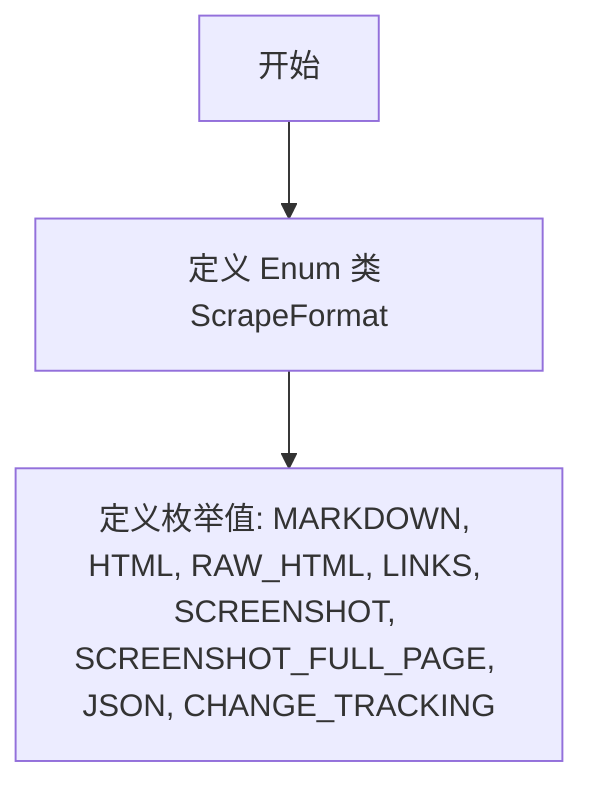

# `.\AutoGPT\autogpt_platform\backend\backend\blocks\firecrawl\_api.py` 详细设计文档

This code defines an Enum class named ScrapeFormat that represents different formats for scraping data.

## 整体流程



## 类结构

```
ScrapeFormat (Enum)
```

## 全局变量及字段


### `ScrapeFormat.MARKDOWN`
    
Represents the Markdown format for scraping data.

类型：`str`
    


### `ScrapeFormat.HTML`
    
Represents the HTML format for scraping data.

类型：`str`
    


### `ScrapeFormat.RAW_HTML`
    
Represents the raw HTML format for scraping data.

类型：`str`
    


### `ScrapeFormat.LINKS`
    
Represents the links format for scraping data.

类型：`str`
    


### `ScrapeFormat.SCREENSHOT`
    
Represents the screenshot format for scraping data.

类型：`str`
    


### `ScrapeFormat.SCREENSHOT_FULL_PAGE`
    
Represents the full page screenshot format for scraping data.

类型：`str`
    


### `ScrapeFormat.JSON`
    
Represents the JSON format for scraping data.

类型：`str`
    


### `ScrapeFormat.CHANGE_TRACKING`
    
Represents the change tracking format for scraping data.

类型：`str`
    
    

## 全局函数及方法


## 关键组件


### ScrapeFormat

ScrapeFormat 是一个枚举类，用于定义数据抓取的格式类型。


## 问题及建议


### 已知问题

-   **缺乏文档注释**：代码中没有提供任何文档注释，这会使得其他开发者难以理解枚举类的用途和每个选项的含义。
-   **未使用枚举的优势**：虽然使用了枚举来定义ScrapeFormat，但并没有充分利用枚举的特性，如枚举值不可变、类型安全等。

### 优化建议

-   **添加文档注释**：在每个枚举值旁边添加描述性的注释，说明其用途和可能的场景。
-   **考虑枚举值的使用场景**：如果某些枚举值有特定的使用场景或限制，可以在注释中说明，或者通过额外的类或方法来封装这些逻辑。
-   **使用枚举的更多特性**：如果枚举值之间有依赖关系或需要额外的逻辑处理，可以考虑使用类或方法来封装这些逻辑，而不是仅仅使用枚举值。


## 其它


### 设计目标与约束

- 设计目标：定义一个枚举类，用于表示数据抓取的不同格式。
- 约束条件：枚举值必须是唯一的，且枚举类型应保持向后兼容。

### 错误处理与异常设计

- 错误处理：该枚举类不涉及复杂逻辑，因此错误处理需求较低。
- 异常设计：如果需要，可以通过自定义异常来处理与枚举相关的错误。

### 数据流与状态机

- 数据流：该枚举类主要用于定义数据格式，不涉及数据流。
- 状态机：该枚举类不涉及状态转换，因此没有状态机设计。

### 外部依赖与接口契约

- 外部依赖：该枚举类不依赖于外部库或服务。
- 接口契约：该枚举类作为内部使用，没有外部接口契约。


    