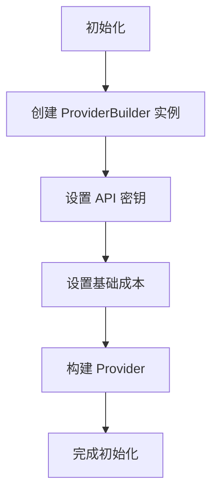
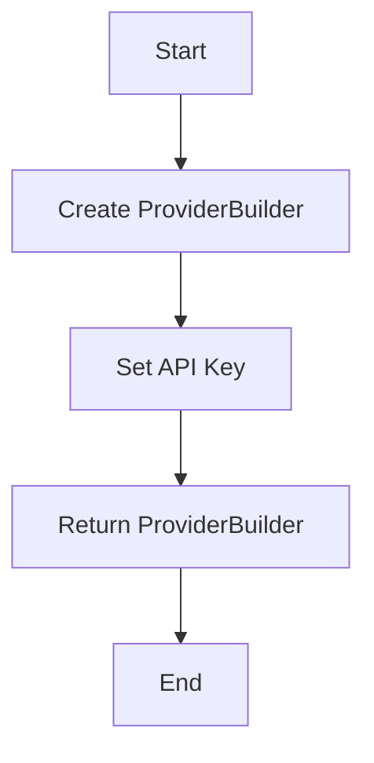
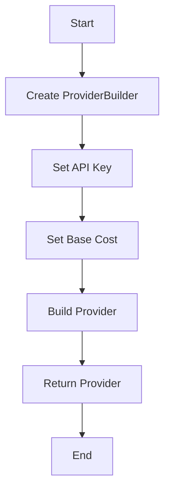

# `.\AutoGPT\autogpt_platform\backend\backend\blocks\firecrawl\_config.py` 详细设计文档

The code initializes and configures a provider for a firecrawl service using an API key and base cost settings.

## 整体流程



## 类结构

```
ProviderBuilder (类)
```

## 全局变量及字段


### `firecrawl`
    
An instance of ProviderBuilder configured for the 'firecrawl' provider.

类型：`ProviderBuilder`
    


### `ProviderBuilder.provider_name`
    
The name of the provider.

类型：`str`
    


### `ProviderBuilder.api_key`
    
The API key for the provider.

类型：`str`
    


### `ProviderBuilder.base_cost`
    
The base cost for the provider.

类型：`int`
    


### `ProviderBuilder.cost_type`
    
The cost type for the provider.

类型：`BlockCostType`
    
    

## 全局函数及方法


### ProviderBuilder.with_api_key

该函数用于设置ProviderBuilder实例的API密钥。

参数：

- `api_key`：`str`，API密钥的名称
- `value`：`str`，API密钥的实际值

返回值：`ProviderBuilder`，返回修改后的ProviderBuilder实例

#### 流程图



#### 带注释源码

```python
from backend.sdk import ProviderBuilder

# 创建ProviderBuilder实例
firecrawl = ProviderBuilder("firecrawl")

# 设置API密钥
firecrawl = firecrawl.with_api_key("FIRECRAWL_API_KEY", "Firecrawl API Key")

# 构建ProviderBuilder实例
firecrawl = firecrawl.build()
```


### ProviderBuilder.with_api_key

该函数用于设置ProviderBuilder实例的API密钥。

参数：

- `api_key`：`str`，API密钥的名称
- `value`：`str`，API密钥的实际值

返回值：`ProviderBuilder`，返回修改后的ProviderBuilder实例

#### 流程图

```mermaid
graph TD
    A[Start] --> B[ProviderBuilder("firecrawl")]
    B --> C[with_api_key("FIRECRAWL_API_KEY", "Firecrawl API Key")]
    C --> D[with_base_cost(1, BlockCostType.RUN)]
    D --> E[build()]
    E --> F[firecrawl]
    F --> G[End]
```

#### 带注释源码

```
from backend.sdk import BlockCostType, ProviderBuilder

# 创建ProviderBuilder实例
firecrawl = (
    ProviderBuilder("firecrawl")  # 初始化ProviderBuilder实例
    .with_api_key("FIRECRAWL_API_KEY", "Firecrawl API Key")  # 设置API密钥
    .with_base_cost(1, BlockCostType.RUN)  # 设置基础成本
    .build()  # 构建Provider实例
)
``` 


### ProviderBuilder.with_base_cost

该函数用于设置基础成本，它是ProviderBuilder类的一个方法，用于在创建Provider实例时指定基础成本。

参数：

- `cost`：`int`，表示基础成本值。
- `cost_type`：`BlockCostType`，表示成本类型。

返回值：`ProviderBuilder`，返回修改后的ProviderBuilder实例，以便进行链式调用。

#### 流程图

```mermaid
graph TD
    A[Start] --> B[ProviderBuilder("firecrawl")]
    B --> C[with_api_key("FIRECRAWL_API_KEY", "Firecrawl API Key")]
    C --> D[with_base_cost(1, BlockCostType.RUN)]
    D --> E[build()]
    E --> F[firecrawl]
    F --> G[End]
```

#### 带注释源码

```python
from backend.sdk import BlockCostType, ProviderBuilder

# 创建ProviderBuilder实例
firecrawl = (
    ProviderBuilder("firecrawl")
    # 设置API密钥
    .with_api_key("FIRECRAWL_API_KEY", "Firecrawl API Key")
    # 设置基础成本
    .with_base_cost(1, BlockCostType.RUN)
    # 构建Provider实例
    .build()
)
```


### ProviderBuilder.build

该函数用于构建一个Provider对象，配置了API密钥和基础成本。

参数：

- `self`：`ProviderBuilder`，当前构建器实例
- `...`：其他配置参数，如`with_api_key`和`with_base_cost`

返回值：`Provider`，构建好的Provider对象

#### 流程图



#### 带注释源码

```
from backend.sdk import ProviderBuilder

# 假设ProviderBuilder类定义如下
class ProviderBuilder:
    def __init__(self, name):
        self.name = name
        self.config = {}

    def with_api_key(self, key, value):
        self.config[key] = value
        return self

    def with_base_cost(self, cost, cost_type):
        self.config['base_cost'] = (cost, cost_type)
        return self

    def build(self):
        # 构建Provider对象
        provider = Provider(self.name, self.config)
        return provider

# 使用ProviderBuilder构建Provider
firecrawl = (
    ProviderBuilder("firecrawl")
    .with_api_key("FIRECRAWL_API_KEY", "Firecrawl API Key")
    .with_base_cost(1, BlockCostType.RUN)
    .build()
)
```


## 关键组件


### 张量索引与惰性加载

张量索引与惰性加载是指在处理大规模数据时，只对需要的数据进行索引和加载，以减少内存消耗和提高处理速度。

### 反量化支持

反量化支持是指代码能够处理和转换不同量化的数据，以便在不同的量化策略之间进行转换。

### 量化策略

量化策略是指对数据或模型进行量化处理的方法，以减少模型大小和提高计算效率。


## 问题及建议


### 已知问题

-   {问题1}：代码中使用了硬编码的API密钥“FIRECRAWL_API_KEY”，这可能导致密钥泄露的风险。如果密钥被泄露，攻击者可能会滥用API。
-   {问题2}：代码没有实现错误处理机制，如果API调用失败或出现异常，程序可能会崩溃或产生不可预测的行为。
-   {问题3}：代码没有提供任何日志记录或监控机制，这使得在出现问题时难以追踪和调试。

### 优化建议

-   {建议1}：将API密钥存储在环境变量或配置文件中，而不是硬编码在代码中，以减少密钥泄露的风险。
-   {建议2}：添加异常处理逻辑，确保在API调用失败时能够优雅地处理错误，并提供有用的错误信息。
-   {建议3}：实现日志记录功能，记录关键操作和潜在的错误，以便于问题追踪和调试。
-   {建议4}：考虑使用依赖注入来管理依赖项，这可以提高代码的可测试性和可维护性。
-   {建议5}：如果API支持，可以考虑实现重试逻辑，以处理暂时性的网络问题或服务中断。


## 其它


### 设计目标与约束

- 设计目标：确保代码能够高效地从Firecrawl API获取数据，同时保持代码的可维护性和可扩展性。
- 约束条件：遵循API的使用规范，确保API密钥的安全存储和使用。

### 错误处理与异常设计

- 错误处理：在API调用过程中，捕获可能的异常，如网络错误、API限制等，并返回相应的错误信息。
- 异常设计：定义自定义异常类，以区分不同类型的错误情况。

### 数据流与状态机

- 数据流：从API获取数据，经过处理，最终用于应用程序的其他部分。
- 状态机：无状态设计，不涉及状态转换。

### 外部依赖与接口契约

- 外部依赖：依赖于Firecrawl API和ProviderBuilder类。
- 接口契约：遵循ProviderBuilder类的接口规范，确保与API的兼容性。

### 安全性与隐私

- 安全性：确保API密钥的安全存储，避免在代码中硬编码。
- 隐私：不涉及用户隐私数据，仅处理API返回的数据。

### 测试与验证

- 测试策略：编写单元测试和集成测试，确保代码的正确性和稳定性。
- 验证方法：使用模拟数据和环境进行测试，验证API调用的正确性。

### 性能优化

- 性能指标：监控API调用响应时间和资源消耗。
- 优化策略：根据性能指标调整代码，如缓存API响应结果，减少不必要的API调用。

### 维护与更新

- 维护策略：定期更新依赖库，修复已知问题。
- 更新流程：遵循版本控制，确保代码的稳定性和可追溯性。


    