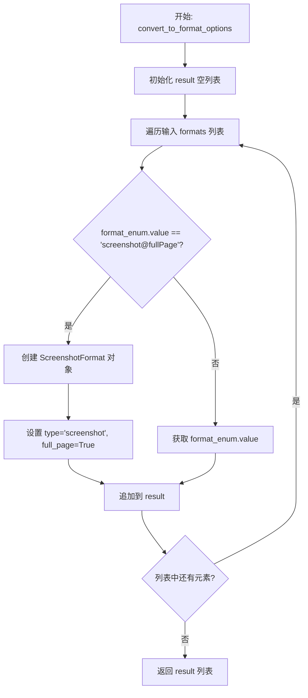
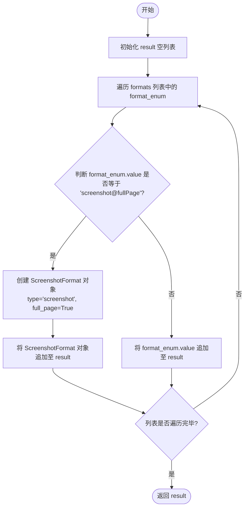

# `AutoGPT\autogpt_platform\backend\backend\blocks\firecrawl\_format_utils.py` 详细设计文档

该文件提供了将自定义的 ScrapeFormat 枚举类型转换为 firecrawl API 所需的 FormatOption 类型的工具函数，专门处理了全页截图（screenshot@fullPage）的特殊转换逻辑。

## 整体流程



## 类结构

```

```

## 全局变量及字段


    

## 全局函数及方法


### `convert_to_format_options`

该函数用于将内部的 `ScrapeFormat` 枚举值列表转换为 Firecrawl API 所需的 `FormatOption` 类型列表，特别处理了全页面截图（`screenshot@fullPage`）的特殊转换逻辑。

参数：

-  `formats`：`List[ScrapeFormat]`，包含内部定义的抓取格式枚举的列表。

返回值：`List[FormatOption]`，转换后的兼容 Firecrawl API 的格式选项列表。

#### 流程图



#### 带注释源码

```python
def convert_to_format_options(
    formats: List[ScrapeFormat],
) -> List[FormatOption]:
    """Convert our ScrapeFormat enum values to firecrawl FormatOption types.

    Handles special cases like screenshot@fullPage which needs to be converted
    to a ScreenshotFormat object.
    """
    # 初始化结果列表，用于存放转换后的格式选项
    result: List[FormatOption] = []

    # 遍历输入的所有格式枚举
    for format_enum in formats:
        # 检查是否为需要特殊处理的全页面截图格式
        if format_enum.value == "screenshot@fullPage":
            # 特殊情况：创建一个 ScreenshotFormat 对象，并设置 full_page 为 True
            # 这是因为 Firecrawl API 需要特定的对象结构而不仅仅是字符串
            result.append(ScreenshotFormat(type="screenshot", full_page=True))
        else:
            # 常规情况：直接使用枚举值的字符串形式（如 "markdown", "html" 等）
            result.append(format_enum.value)

    # 返回转换完成后的列表
    return result
```


## 关键组件


### 枚举格式转换
将内部的 `ScrapeFormat` 枚举值映射为外部 firecrawl API 所需的 `FormatOption` 类型的核心逻辑。

### 特殊格式实例化
处理 "screenshot@fullPage" 字符串的特殊逻辑，将其转换为 `ScreenshotFormat` 对象而非普通字符串，并设置 `full_page` 参数。


## 问题及建议


### 已知问题

-   依赖硬编码字符串 `screenshot@fullPage` 进行判断，如果枚举值发生变化或引入新的变体（如 `screenshot@mobile`），代码容易出错且缺乏鲁棒性。
-   转换逻辑集中在 `if-else` 结构中，违反了开闭原则，随着 Firecrawl 支持的特殊格式类型增加，维护成本将显著上升。
-   缺乏对输入列表 `formats` 为空或包含无效类型的防御性检查，虽然使用了类型提示，但在运行时未做校验。

### 优化建议

-   引入策略模式或字典映射，将格式字符串与对应的转换逻辑或构造函数解耦，避免硬编码的字符串比较。
-   重构 `ScrapeFormat` 枚举，在其中添加如 `to_firecrawl_option` 的实例方法，利用多态性将转换逻辑封装在枚举类内部，提高代码的内聚性。
-   考虑使用 match 语句（如果环境支持 Python 3.10+）替代当前的 if-else，以获得更清晰的模式匹配语法。
-   增加单元测试覆盖，特别是针对特殊格式转换逻辑的边界情况测试。


## 其它


### 设计目标与约束

**设计目标**：
该模块旨在提供一个适配层，实现内部 `ScrapeFormat` 枚举类型与外部 Firecrawl SDK `FormatOption` 类型之间的无缝转换。其核心目标是解耦内部业务逻辑与第三方 SDK 的具体实现细节，确保当 SDK 版本升级或类型定义变更时，只需修改此转换逻辑而不影响上层代码。

**约束**：
1. **特殊处理约束**：必须正确识别并处理 `screenshot@fullPage` 这一特殊枚举值，将其转换为带有 `full_page=True` 属性的 `ScreenshotFormat` 对象，而非普通的字符串字面量。
2. **无状态约束**：该函数被设计为纯函数，不依赖外部共享状态，不产生副作用，对于相同的输入必须产生相同的输出。
3. **类型安全约束**：利用 Python 类型注解确保输入为 `List[ScrapeFormat]`，输出为 `List[FormatOption]`，以辅助静态类型检查工具（如 mypy）发现潜在错误。

### 错误处理与异常设计

**设计原则**：
当前代码遵循“快速失败”原则，不在函数内部捕获或吞没异常，而是将错误抛给调用方处理，以便在开发阶段尽早发现配置或集成问题。

**潜在异常**：
1. **`AttributeError`**：如果传入 `formats` 列表中的对象不包含 `value` 属性（即不是预期的 `ScrapeFormat` 枚举类型），代码将在访问 `.value` 时抛出异常。
2. **`ImportError` / `ModuleNotFoundError`**：如果 `firecrawl` 库未安装或版本不匹配（导致 `firecrawl.v2.types` 不可用），模块加载阶段即会失败。
3. **`TypeError`**：如果 `firecrawl` SDK 中的 `ScreenshotFormat` 构造函数签名发生变更（例如不再接受 `type` 或 `full_page` 参数），实例化过程将抛出类型错误。

**调用方责任**：
调用方需确保传入的数据源正确，并在调用此函数时做好相应的异常捕获与回滚处理。

### 数据流与状态机

**数据流**：
该模块不涉及复杂的状态机逻辑，仅包含线性的数据转换流：
1. **输入阶段**：接收外部传入的内部格式枚举列表 `List[ScrapeFormat]`。
2. **转换阶段**：遍历列表中的每一个枚举项。通过条件分支（`if-else`）判断枚举值。
   - 若值为 `"screenshot@fullPage"`，则实例化复杂的 `ScreenshotFormat` 数据结构。
   - 否则，直接提取枚举的原始字符串值。
3. **输出阶段**：将转换后的结果收集到新的列表中，并返回 `List[FormatOption]`。

**状态说明**：
由于是纯函数设计，模块内部没有持久化状态或中间状态变量，所有的转换均发生在函数栈帧内。

### 外部依赖与接口契约

**外部依赖**：
1. **`firecrawl` (v2)**：核心第三方依赖，使用了其中的 `FormatOption` 类型别名和 `ScreenshotFormat` 数据类。代码假定 Firecrawl v2 SDK 的 API 接口保持稳定。
2. **`backend.blocks.firecrawl._api`**：内部项目依赖，提供了 `ScrapeFormat` 枚举定义。这意味着本模块与内部定义的块结构紧密耦合。

**接口契约**：
1. **输入契约**：函数 `convert_to_format_options` 要求输入参数 `formats` 必须是一个列表，且列表中的元素必须是 `ScrapeFormat` 枚举的实例。
2. **输出契约**：函数保证返回一个列表。对于输入中的 `ScrapeFormat.SCREENSHOT_FULLPAGE`（假定对应值 "screenshot@fullPage"），返回列表中对应位置必须是 `ScreenshotFormat(type="screenshot", full_page=True)` 对象；对于其他输入，返回列表中对应位置必须是字符串类型的枚举值。
3. **映射契约**：内部枚举值 "screenshot@fullPage" 与外部对象 `ScreenshotFormat` 之间存在显式的映射契约，这是业务逻辑中区分全页截图与普通截图的关键依据。

    