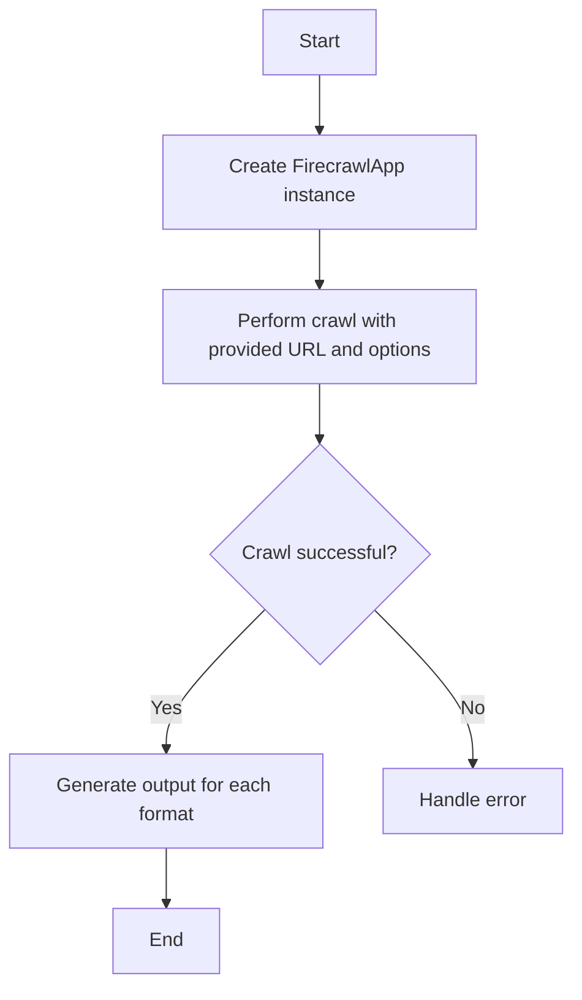
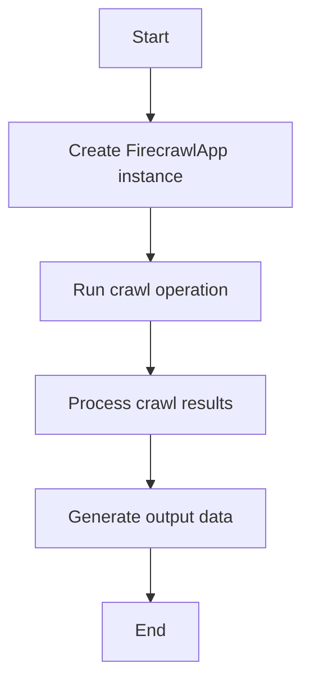
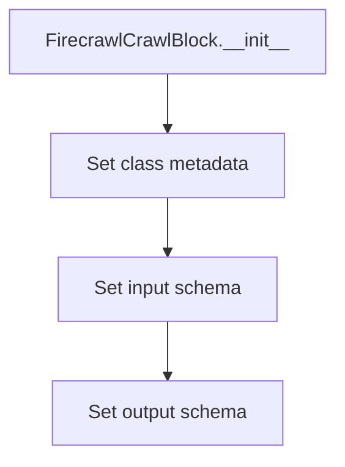
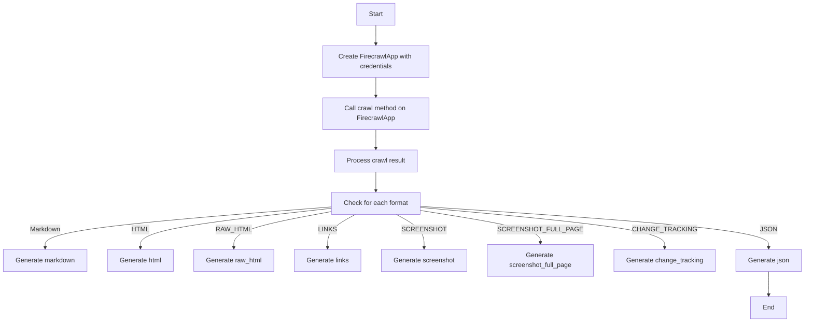

# `.\AutoGPT\autogpt_platform\backend\backend\blocks\firecrawl\crawl.py` 详细设计文档

The code defines a FirecrawlCrawlBlock class that uses the FirecrawlApp to crawl websites and extract comprehensive data, providing various output formats.

## 整体流程



## 类结构

```
FirecrawlCrawlBlock (Concrete Block)
├── Input (BlockSchemaInput)
│   ├── credentials (CredentialsMetaInput)
│   ├── url (str)
│   ├── limit (int)
│   ├── only_main_content (bool)
│   ├── max_age (int)
│   ├── wait_for (int)
│   └── formats (list[ScrapeFormat])
└── Output (BlockSchemaOutput)
    ├── data (list[dict[str, Any]])
    ├── markdown (str)
    ├── html (str)
    ├── raw_html (str)
    ├── links (list[str])
    ├── screenshot (str)
    ├── screenshot_full_page (str)
    ├── json_data (dict[str, Any])
    ├── change_tracking (dict[str, Any])
    └── error (str)
```

## 全局变量及字段


### `firecrawl`
    
The credentials field for the Firecrawl app.

类型：`CredentialsMetaInput`
    


### `convert_to_format_options`
    
A function that converts a list of ScrapeFormat to format options for the crawl.

类型：`function`
    


### `FirecrawlCrawlBlock.id`
    
The unique identifier for the FirecrawlCrawlBlock class.

类型：`str`
    


### `FirecrawlCrawlBlock.description`
    
The description of the FirecrawlCrawlBlock class.

类型：`str`
    


### `FirecrawlCrawlBlock.categories`
    
The categories to which the FirecrawlCrawlBlock class belongs.

类型：`set`
    


### `FirecrawlCrawlBlock.input_schema`
    
The input schema for the FirecrawlCrawlBlock class.

类型：`BlockSchemaInput`
    


### `FirecrawlCrawlBlock.output_schema`
    
The output schema for the FirecrawlCrawlBlock class.

类型：`BlockSchemaOutput`
    


### `Input.credentials`
    
The credentials for the crawl.

类型：`CredentialsMetaInput`
    


### `Input.url`
    
The URL to crawl.

类型：`str`
    


### `Input.limit`
    
The number of pages to crawl.

类型：`int`
    


### `Input.only_main_content`
    
Whether to only return the main content of the page.

类型：`bool`
    


### `Input.max_age`
    
The maximum age of the page in milliseconds.

类型：`int`
    


### `Input.wait_for`
    
The delay in milliseconds before fetching the content.

类型：`int`
    


### `Input.formats`
    
The format of the crawl.

类型：`list[ScrapeFormat]`
    


### `Output.data`
    
The result of the crawl.

类型：`list[dict[str, Any]]`
    


### `Output.markdown`
    
The markdown of the crawl.

类型：`str`
    


### `Output.html`
    
The html of the crawl.

类型：`str`
    


### `Output.raw_html`
    
The raw html of the crawl.

类型：`str`
    


### `Output.links`
    
The links of the crawl.

类型：`list[str]`
    


### `Output.screenshot`
    
The screenshot of the crawl.

类型：`str`
    


### `Output.screenshot_full_page`
    
The screenshot full page of the crawl.

类型：`str`
    


### `Output.json_data`
    
The json data of the crawl.

类型：`dict[str, Any]`
    


### `Output.change_tracking`
    
The change tracking of the crawl.

类型：`dict[str, Any]`
    


### `Output.error`
    
Error message if the crawl failed.

类型：`str`
    


### `FirecrawlCrawlBlock.id`
    
The unique identifier for the FirecrawlCrawlBlock class.

类型：`str`
    


### `FirecrawlCrawlBlock.description`
    
The description of the FirecrawlCrawlBlock class.

类型：`str`
    


### `FirecrawlCrawlBlock.categories`
    
The categories to which the FirecrawlCrawlBlock class belongs.

类型：`set`
    


### `FirecrawlCrawlBlock.input_schema`
    
The input schema for the FirecrawlCrawlBlock class.

类型：`BlockSchemaInput`
    


### `FirecrawlCrawlBlock.output_schema`
    
The output schema for the FirecrawlCrawlBlock class.

类型：`BlockSchemaOutput`
    


### `Input.credentials`
    
The credentials for the crawl.

类型：`CredentialsMetaInput`
    


### `Input.url`
    
The URL to crawl.

类型：`str`
    


### `Input.limit`
    
The number of pages to crawl.

类型：`int`
    


### `Input.only_main_content`
    
Whether to only return the main content of the page.

类型：`bool`
    


### `Input.max_age`
    
The maximum age of the page in milliseconds.

类型：`int`
    


### `Input.wait_for`
    
The delay in milliseconds before fetching the content.

类型：`int`
    


### `Input.formats`
    
The format of the crawl.

类型：`list[ScrapeFormat]`
    


### `Output.data`
    
The result of the crawl.

类型：`list[dict[str, Any]]`
    


### `Output.markdown`
    
The markdown of the crawl.

类型：`str`
    


### `Output.html`
    
The html of the crawl.

类型：`str`
    


### `Output.raw_html`
    
The raw html of the crawl.

类型：`str`
    


### `Output.links`
    
The links of the crawl.

类型：`list[str]`
    


### `Output.screenshot`
    
The screenshot of the crawl.

类型：`str`
    


### `Output.screenshot_full_page`
    
The screenshot full page of the crawl.

类型：`str`
    


### `Output.json_data`
    
The json data of the crawl.

类型：`dict[str, Any]`
    


### `Output.change_tracking`
    
The change tracking of the crawl.

类型：`dict[str, Any]`
    


### `Output.error`
    
Error message if the crawl failed.

类型：`str`
    
    

## 全局函数及方法


### FirecrawlCrawlBlock.run

This method is responsible for running the crawl operation using the FirecrawlApp to extract comprehensive data from a website.

参数：

- `input_data`：`Input`，The input data containing the URL to crawl, the number of pages to crawl, options for scraping, and the formats to convert the crawl results into.
- `credentials`：`APIKeyCredentials`，The credentials required to authenticate with the Firecrawl service.
- `**kwargs`：`Any`，Additional keyword arguments that may be passed to the method.

返回值：`BlockOutput`，The output data containing the results of the crawl, including the data, markdown, HTML, raw HTML, links, screenshot, screenshot full page, JSON data, change tracking, and error message if the crawl failed.

#### 流程图



#### 带注释源码

```python
async def run(self, input_data: Input, *, credentials: APIKeyCredentials, **kwargs) -> BlockOutput:
    app = FirecrawlApp(api_key=credentials.api_key.get_secret_value())

    # Sync call
    crawl_result = app.crawl(
        input_data.url,
        limit=input_data.limit,
        scrape_options=ScrapeOptions(
            formats=convert_to_format_options(input_data.formats),
            only_main_content=input_data.only_main_content,
            max_age=input_data.max_age,
            wait_for=input_data.wait_for,
        ),
    )
    yield "data", crawl_result.data

    for data in crawl_result.data:
        for f in input_data.formats:
            if f == ScrapeFormat.MARKDOWN:
                yield "markdown", data.markdown
            elif f == ScrapeFormat.HTML:
                yield "html", data.html
            elif f == ScrapeFormat.RAW_HTML:
                yield "raw_html", data.raw_html
            elif f == ScrapeFormat.LINKS:
                yield "links", data.links
            elif f == ScrapeFormat.SCREENSHOT:
                yield "screenshot", data.screenshot
            elif f == ScrapeFormat.SCREENSHOT_FULL_PAGE:
                yield "screenshot_full_page", data.screenshot
            elif f == ScrapeFormat.CHANGE_TRACKING:
                yield "change_tracking", data.change_tracking
            elif f == ScrapeFormat.JSON:
                yield "json", data.json
```


### FirecrawlCrawlBlock.__init__

This method initializes the `FirecrawlCrawlBlock` class, setting up its metadata and schema for the Firecrawl application.

参数：

- `self`：`FirecrawlCrawlBlock`，The instance of the class being initialized.

返回值：无，This method does not return any value.

#### 流程图



#### 带注释源码

```python
def __init__(self):
    super().__init__(
        id="bdbbaba0-03b7-4971-970e-699e2de6015e",
        description="Firecrawl crawls websites to extract comprehensive data while bypassing blockers.",
        categories={BlockCategory.SEARCH},
        input_schema=self.Input,
        output_schema=self.Output,
    )
```


### FirecrawlCrawlBlock.run

This method is responsible for running the crawl operation using the FirecrawlApp, extracting data from the specified URL, and yielding the results in various formats.

参数：

- `input_data`：`Input`，The input data for the crawl operation, including URL, limit, and other options.
- `credentials`：`APIKeyCredentials`，The credentials required to authenticate with the Firecrawl service.
- `**kwargs`：`Any`，Additional keyword arguments that may be passed to the method.

返回值：`BlockOutput`，The output of the crawl operation, including the data, markdown, html, raw_html, links, screenshot, screenshot_full_page, json_data, change_tracking, and error.

#### 流程图



#### 带注释源码

```python
async def run(self, input_data: Input, *, credentials: APIKeyCredentials, **kwargs) -> BlockOutput:
    app = FirecrawlApp(api_key=credentials.api_key.get_secret_value())

    # Sync call
    crawl_result = app.crawl(
        input_data.url,
        limit=input_data.limit,
        scrape_options=ScrapeOptions(
            formats=convert_to_format_options(input_data.formats),
            only_main_content=input_data.only_main_content,
            max_age=input_data.max_age,
            wait_for=input_data.wait_for,
        ),
    )
    yield "data", crawl_result.data

    for data in crawl_result.data:
        for f in input_data.formats:
            if f == ScrapeFormat.MARKDOWN:
                yield "markdown", data.markdown
            elif f == ScrapeFormat.HTML:
                yield "html", data.html
            elif f == ScrapeFormat.RAW_HTML:
                yield "raw_html", data.raw_html
            elif f == ScrapeFormat.LINKS:
                yield "links", data.links
            elif f == ScrapeFormat.SCREENSHOT:
                yield "screenshot", data.screenshot
            elif f == ScrapeFormat.SCREENSHOT_FULL_PAGE:
                yield "screenshot_full_page", data.screenshot
            elif f == ScrapeFormat.CHANGE_TRACKING:
                yield "change_tracking", data.change_tracking
            elif f == ScrapeFormat.JSON:
                yield "json", data.json
```


## 关键组件


### 张量索引与惰性加载

用于高效地索引和访问大型数据集，同时延迟加载数据以减少内存消耗。

### 反量化支持

提供对量化策略的支持，允许在模型训练过程中进行量化以减少模型大小和提高推理速度。

### 量化策略

定义了不同的量化方法，如整数量化、浮点量化等，以适应不同的应用场景和性能需求。


## 问题及建议


### 已知问题

-   **异步处理与同步调用**: 代码中使用了 `async def run`，但内部调用了同步的 `app.crawl` 方法。这可能导致异步函数的运行效率降低，因为同步调用会阻塞事件循环。
-   **代码重复**: 对于不同的 `ScrapeFormat`，代码中存在重复的 `if-elif` 结构来处理不同的输出格式。这可以通过循环或映射来简化。
-   **错误处理**: 代码中没有明确的错误处理机制。如果 `app.crawl` 调用失败，应该有机制来捕获异常并返回适当的错误信息。
-   **资源管理**: 代码中没有显示地管理外部资源，如网络连接。如果 `FirecrawlApp` 或 `app.crawl` 没有正确地关闭这些资源，可能会导致资源泄漏。

### 优化建议

-   **使用异步调用**: 将 `app.crawl` 调用改为异步调用，以充分利用异步处理的优势。
-   **简化代码重复**: 使用循环或映射来简化处理不同输出格式的代码。
-   **增加错误处理**: 添加异常处理来捕获和处理可能发生的错误。
-   **资源管理**: 确保在不再需要时关闭外部资源，例如使用 `with` 语句或确保调用适当的清理方法。
-   **文档和注释**: 增加代码的文档和注释，以提高代码的可读性和可维护性。
-   **单元测试**: 编写单元测试来验证代码的功能和错误处理。


## 其它


### 设计目标与约束

- 设计目标：
  - 提供一个模块化的爬虫系统，能够高效地从网站提取数据。
  - 确保数据提取的准确性和完整性。
  - 支持多种数据格式输出，如Markdown、HTML、JSON等。
  - 确保爬虫行为符合网站的使用条款和法律法规。

- 约束条件：
  - 爬虫操作需遵守robots.txt文件规定。
  - 爬虫操作需限制请求频率，避免对目标网站造成过大压力。
  - 爬虫操作需处理网络异常和页面解析错误。

### 错误处理与异常设计

- 错误处理：
  - 爬虫操作中可能遇到的错误包括网络错误、页面解析错误、API限制等。
  - 系统应捕获这些错误，并返回相应的错误信息。
  - 错误信息应包括错误类型、错误描述和可能的解决方案。

- 异常设计：
  - 使用try-except语句捕获和处理异常。
  - 对于不可恢复的异常，记录错误信息并停止爬虫操作。
  - 对于可恢复的异常，记录错误信息并尝试重新执行操作。

### 数据流与状态机

- 数据流：
  - 输入：用户输入的URL、爬取限制、数据格式等。
  - 处理：通过FirecrawlApp进行数据爬取。
  - 输出：爬取结果以多种格式返回。

- 状态机：
  - 初始状态：等待用户输入。
  - 爬取状态：执行爬取操作。
  - 输出状态：返回爬取结果。

### 外部依赖与接口契约

- 外部依赖：
  - FirecrawlApp：用于执行爬取操作。
  - APIKeyCredentials：用于认证API访问。
  - ScrapeOptions：用于配置爬取选项。

- 接口契约：
  - FirecrawlApp接口：提供爬取方法。
  - APIKeyCredentials接口：提供API密钥认证。
  - ScrapeOptions接口：提供爬取选项配置。

    