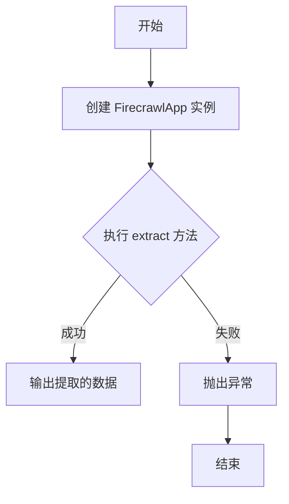
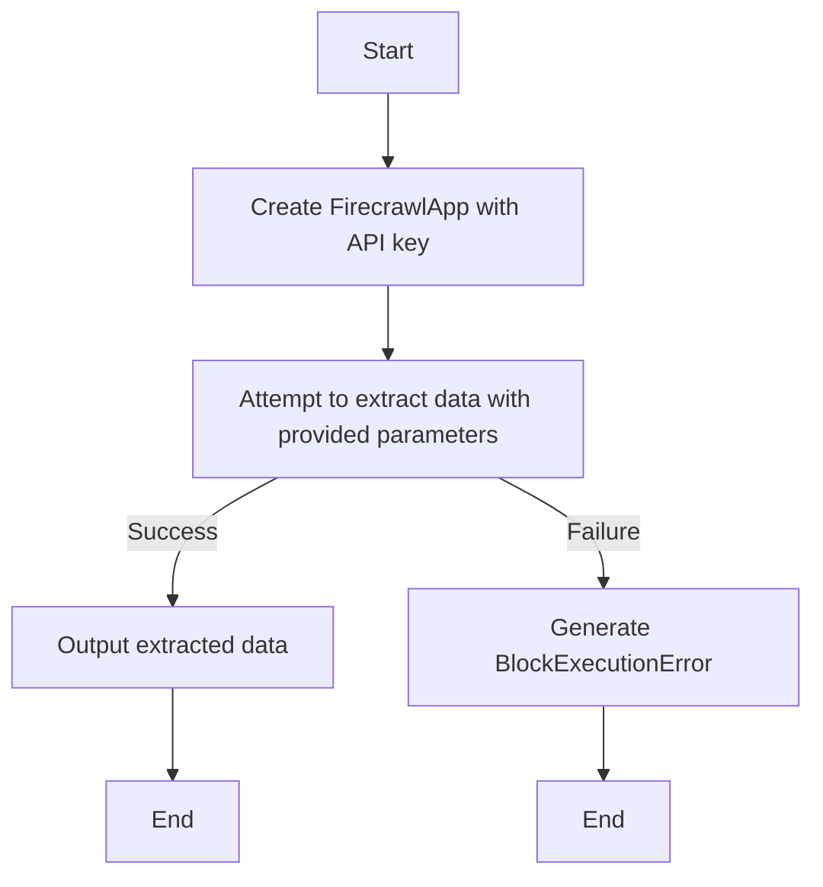
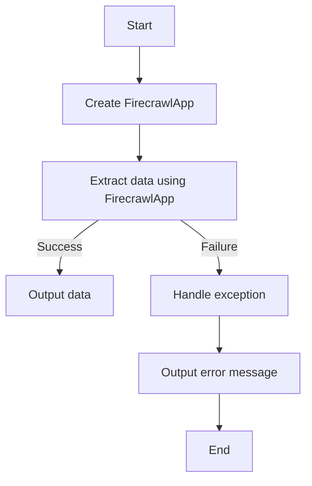

# `.\AutoGPT\autogpt_platform\backend\backend\blocks\firecrawl\extract.py` 详细设计文档

The code defines a custom block for the FirecrawlApp that extracts data from websites using provided URLs and configurations.

## 整体流程



## 类结构

```
FirecrawlExtractBlock (自定义块类)
```

## 全局变量及字段


### `firecrawl`
    
Configuration object for the Firecrawl application.

类型：`object`
    


### `Block`
    
Base class for all blocks in the backend.

类型：`class`
    


### `BlockCategory`
    
Enum class for block categories.

类型：`class`
    


### `BlockCost`
    
Class representing the cost of a block.

类型：`class`
    


### `BlockCostType`
    
Enum class for block cost types.

类型：`class`
    


### `BlockOutput`
    
Class representing the output of a block.

类型：`class`
    


### `BlockSchemaInput`
    
Class representing the input schema for a block.

类型：`class`
    


### `BlockSchemaOutput`
    
Class representing the output schema for a block.

类型：`class`
    


### `CredentialsMetaInput`
    
Class representing credentials metadata input.

类型：`class`
    


### `SchemaField`
    
Class representing a schema field.

类型：`class`
    


### `cost`
    
Decorator function for applying costs to blocks.

类型：`function`
    


### `APIKeyCredentials`
    
Class representing API key credentials.

类型：`class`
    


### `BlockExecutionError`
    
Exception class for block execution errors.

类型：`class`
    


### `FirecrawlApp`
    
Class representing the Firecrawl application instance.

类型：`class`
    


### `FirecrawlExtractBlock.id`
    
Unique identifier for the block.

类型：`str`
    


### `FirecrawlExtractBlock.description`
    
Description of the block.

类型：`str`
    


### `FirecrawlExtractBlock.categories`
    
Set of categories to which the block belongs.

类型：`set`
    


### `FirecrawlExtractBlock.input_schema`
    
Input schema for the block.

类型：`BlockSchemaInput`
    


### `FirecrawlExtractBlock.output_schema`
    
Output schema for the block.

类型：`BlockSchemaOutput`
    
    

## 全局函数及方法


### FirecrawlExtractBlock.run

FirecrawlExtractBlock.run is a coroutine method that runs the Firecrawl application to extract data from specified URLs.

参数：

- `input_data`：`Input`，The input data for the Firecrawl block, including URLs to crawl, prompt, output schema, and enable_web_search flag.
- `credentials`：`APIKeyCredentials`，The credentials required to authenticate with the Firecrawl service.
- `**kwargs`：`Any`，Additional keyword arguments that may be passed to the Firecrawl application.

返回值：`BlockOutput`，The output of the Firecrawl block, containing the extracted data and any error messages.

#### 流程图



#### 带注释源码

```python
async def run(self, input_data: Input, *, credentials: APIKeyCredentials, **kwargs) -> BlockOutput:
    app = FirecrawlApp(api_key=credentials.api_key.get_secret_value())

    try:
        extract_result = app.extract(
            urls=input_data.urls,
            prompt=input_data.prompt,
            schema=input_data.output_schema,
            enable_web_search=input_data.enable_web_search,
        )
    except Exception as e:
        raise BlockExecutionError(
            message=f"Extract failed: {e}",
            block_name=self.name,
            block_id=self.id,
        ) from e

    yield "data", extract_result.data
```


### FirecrawlExtractBlock.__init__

初始化FirecrawlExtractBlock类，设置其基本属性和配置。

参数：

- `self`：`FirecrawlExtractBlock` 类的实例，用于访问类的属性和方法。

返回值：无

#### 流程图

```mermaid
graph TD
    A[FirecrawlExtractBlock.__init__] --> B{设置id}
    B --> C[设置description]
    C --> D[设置categories]
    D --> E[设置input_schema]
    E --> F[设置output_schema]
    F --> G[调用super().__init__]
```

#### 带注释源码

```python
def __init__(self):
    super().__init__(
        id="d1774756-4d9e-40e6-bab1-47ec0ccd81b2",
        description="Firecrawl crawls websites to extract comprehensive data while bypassing blockers.",
        categories={BlockCategory.SEARCH},
        input_schema=self.Input,
        output_schema=self.Output,
    )
```


### FirecrawlExtractBlock.run

FirecrawlExtractBlock.run is a coroutine method that runs the Firecrawl block, which is responsible for crawling websites to extract comprehensive data while bypassing blockers.

参数：

- `input_data`：`Input`，The input data for the block, which includes credentials, URLs to crawl, prompt for the crawl, output schema, and whether to enable web search.
- `credentials`：`APIKeyCredentials`，The credentials required to access the Firecrawl service.
- `**kwargs`：`Any`，Additional keyword arguments that may be passed to the method.

返回值：`BlockOutput`，The output of the block, which includes the result of the crawl and an error message if the extraction failed.

#### 流程图



#### 带注释源码

```python
async def run(self, input_data: Input, *, credentials: APIKeyCredentials, **kwargs) -> BlockOutput:
    app = FirecrawlApp(api_key=credentials.api_key.get_secret_value())

    try:
        extract_result = app.extract(
            urls=input_data.urls,
            prompt=input_data.prompt,
            schema=input_data.output_schema,
            enable_web_search=input_data.enable_web_search,
        )
    except Exception as e:
        raise BlockExecutionError(
            message=f"Extract failed: {e}",
            block_name=self.name,
            block_id=self.id,
        ) from e

    yield "data", extract_result.data
```


## 关键组件


### 张量索引与惰性加载

张量索引与惰性加载是用于高效处理大规模数据集的关键技术，它允许在需要时才加载数据，从而减少内存消耗和提高性能。

### 反量化支持

反量化支持是针对量化模型的一种优化技术，它通过将量化模型转换为非量化模型来提高模型的准确性和效率。

### 量化策略

量化策略是用于优化模型性能的一种方法，它通过减少模型中使用的数值范围来减少模型的复杂性和计算量。


## 问题及建议


### 已知问题

-   **异常处理**: 代码中使用了通用的 `Exception` 来捕获异常，这可能导致一些非预期的错误被捕获。建议使用更具体的异常类型来捕获和处理错误。
-   **API密钥安全性**: 代码中直接从 `APIKeyCredentials` 获取密钥值，这可能会在日志中暴露敏感信息。建议使用环境变量或配置文件来存储敏感信息。
-   **代码复用**: `FirecrawlApp` 的实例化在每次 `run` 方法调用时都会发生，这可能会影响性能。建议考虑将 `FirecrawlApp` 实例化为一个类属性或全局变量，以避免重复实例化。

### 优化建议

-   **使用特定异常**: 替换通用的 `Exception` 捕获，使用更具体的异常类型，如 `FirecrawlApp` 可能抛出的异常。
-   **安全存储密钥**: 使用环境变量或配置文件来存储 `APIKeyCredentials`，而不是直接在代码中硬编码。
-   **优化实例化**: 将 `FirecrawlApp` 实例化为一个类属性或全局变量，以减少实例化开销。
-   **日志记录**: 增加日志记录，以便在发生错误时提供更多上下文信息。
-   **单元测试**: 为 `FirecrawlExtractBlock` 类编写单元测试，以确保代码的稳定性和正确性。


## 其它


### 设计目标与约束

- 设计目标：确保FirecrawlExtractBlock能够高效、准确地从指定URL中提取数据，同时处理异常情况并返回错误信息。
- 约束：遵循APIKeyCredentials的使用规范，确保数据提取过程符合安全性和隐私性要求。

### 错误处理与异常设计

- 错误处理：通过捕获异常并抛出BlockExecutionError来处理数据提取过程中的错误。
- 异常设计：定义了BlockExecutionError异常，包含错误消息、块名称和块ID。

### 数据流与状态机

- 数据流：输入数据通过APIKeyCredentials进行验证，然后传递给FirecrawlApp进行数据提取。
- 状态机：数据提取过程包括初始化、执行和结果返回三个状态。

### 外部依赖与接口契约

- 外部依赖：依赖于FirecrawlApp、APIKeyCredentials、Block、BlockCategory、BlockCost等外部模块和类。
- 接口契约：FirecrawlExtractBlock类遵循Block接口契约，提供输入和输出schema定义。


    