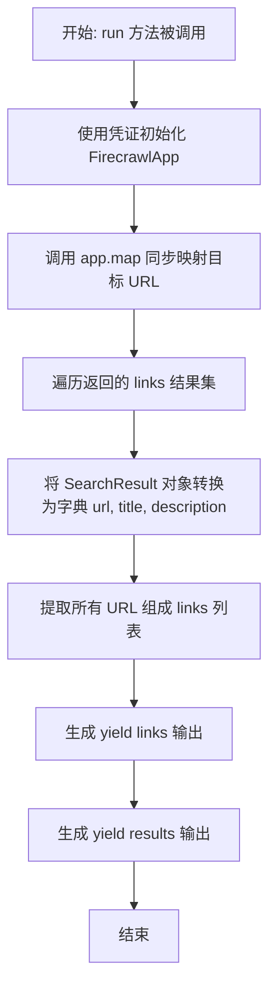
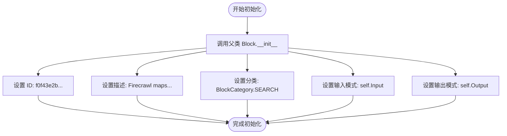
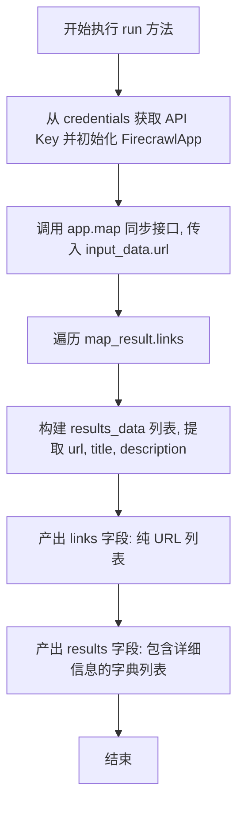

# `AutoGPT\autogpt_platform\backend\backend\blocks\firecrawl\map.py` 详细设计文档

该代码定义了一个名为 FirecrawlMapWebsiteBlock 的类，用于集成 Firecrawl 服务，通过输入的网站 URL 映射并提取该站点所有链接及其元数据（如标题和描述），最终以结构化数据（链接列表和详细信息列表）的形式输出。

## 整体流程



## 类结构

```
FirecrawlMapWebsiteBlock (继承自 Block)
├── Input (内部类, 继承自 BlockSchemaInput)
│   ├── credentials: CredentialsMetaInput
│   └── url: str
├── Output (内部类, 继承自 BlockSchemaOutput)
│   ├── links: list[str]
│   ├── results: list[dict[str, Any]]
│   └── error: str
├── __init__(self)
└── run(self, input_data, *, credentials, **kwargs)
```

## 全局变量及字段


### `FirecrawlMapWebsiteBlock.Input`
    
Defines the input schema for the block, specifying the required credentials and the target URL.

类型：`BlockSchemaInput`
    


### `FirecrawlMapWebsiteBlock.Output`
    
Defines the output schema for the block, providing the mapped links, detailed results, and potential error messages.

类型：`BlockSchemaOutput`
    


### `FirecrawlMapWebsiteBlock.Input.credentials`
    
API key credentials required to authenticate with the Firecrawl service.

类型：`CredentialsMetaInput`
    


### `FirecrawlMapWebsiteBlock.Input.url`
    
The website url to map

类型：`str`
    


### `FirecrawlMapWebsiteBlock.Output.links`
    
List of URLs found on the website

类型：`list[str]`
    


### `FirecrawlMapWebsiteBlock.Output.results`
    
List of search results with url, title, and description

类型：`list[dict[str, Any]]`
    


### `FirecrawlMapWebsiteBlock.Output.error`
    
Error message if the map failed

类型：`str`
    
    

## 全局函数及方法


### `FirecrawlMapWebsiteBlock.__init__`

该构造函数用于初始化 `FirecrawlMapWebsiteBlock` 实例，通过调用父类 `Block` 的初始化方法，设置块的唯一标识符、功能描述、分类以及输入输出的数据结构定义。

参数：

-  无

返回值：`None`，构造函数不返回任何值，仅完成对象的初始化。

#### 流程图



#### 带注释源码

```python
def __init__(self):
    # 调用父类 Block 的初始化方法，配置该 Block 的基本元数据和结构
    super().__init__(
        # 指定该 Block 的唯一标识符 UUID
        id="f0f43e2b-c943-48a0-a7f1-40136ca4d3b9",
        # 简要描述该 Block 的核心功能
        description="Firecrawl maps a website to extract all the links.",
        # 定义该 Block 所属的功能分类（此处为搜索类）
        categories={BlockCategory.SEARCH},
        # 指定输入数据的验证模式，使用内部类 Input
        input_schema=self.Input,
        # 指定输出数据的验证模式，使用内部类 Output
        output_schema=self.Output,
    )
```


### `FirecrawlMapWebsiteBlock.run`

使用 Firecrawl API 对指定的网站 URL 进行映射（map）操作，提取网站中的所有链接、标题及描述信息。

参数：

-  `input_data`：`Input`，包含配置的输入数据，具体包括需要映射的网站 URL (`url`)。
-  `credentials`：`APIKeyCredentials`，用于身份验证的 API 密钥凭据对象，包含访问 Firecrawl 服务所需的密钥。
-  `**kwargs`：`Any`，额外的关键字参数（当前实现中未使用）。

返回值：`BlockOutput`，一个异步生成器，依次产出包含 "links"（链接列表）和 "results"（详细结果列表）的元组。

#### 流程图



#### 带注释源码

```python
async def run(
    self, input_data: Input, *, credentials: APIKeyCredentials, **kwargs
) -> BlockOutput:
    # 使用提供的凭证中的 API 密钥初始化 FirecrawlApp 客户端实例
    app = FirecrawlApp(api_key=credentials.api_key.get_secret_value())

    # 同步调用 Firecrawl 的 map 接口，传入目标 URL 获取站点映射结果
    # 注意：虽然当前方法是 async def，但此处的 SDK 调用是同步的
    map_result = app.map(
        url=input_data.url,
    )

    # 将返回的 SearchResult 对象列表转换为字典列表，提取 url、title 和 description 字段
    results_data = [
        {
            "url": link.url,
            "title": link.title,
            "description": link.description,
        }
        for link in map_result.links
    ]

    # 产出 "links" 输出：包含所有找到的 URL 字符串列表
    yield "links", [link.url for link in map_result.links]
    
    # 产出 "results" 输出：包含详细信息的字典列表
    yield "results", results_data
```


## 关键组件


### FirecrawlMapWebsiteBlock
封装了将网站映射功能集成到基于块的架构中的主类。

### Input Schema
定义了执行 API 调用所需的输入参数结构，具体包括 API 凭据和目标 URL。

### Output Schema
定义了生成的数据结构，包含提取的 URL 列表和详细的结果元数据。

### FirecrawlApp Client
处理与 Firecrawl 服务通信以执行网站地图操作的库实例。

### Data Transformation Logic
将原生 API 响应对象转换为目标字典格式的过程，以便于序列化和进一步处理。


## 问题及建议


### 已知问题

-   **异步上下文中的阻塞调用**：`run` 方法被定义为 `async` 异步函数，但其内部调用的 `app.map(...)` 是同步阻塞调用。这会阻塞事件循环，降低系统的并发处理能力，尤其是在高并发场景下。
-   **缺乏异常处理机制**：代码中未对 `app.map(...)` 的调用进行 `try-except` 包裹。当网络请求失败、URL 无效或 API Key 错误时，会导致程序崩溃或未捕获的异常传播，且定义的 `error` 输出字段从未被使用。
-   **客户端实例化的耦合**：`FirecrawlApp` 直接在 `run` 方法中实例化，导致该 Block 与具体的 SDK 实现强耦合，增加了编写单元测试时进行 Mock（模拟）的难度。

### 优化建议

-   **使用线程池执行阻塞操作**：利用 `asyncio.to_thread` 或 `loop.run_in_executor` 将同步的 `app.map` 调用转移到独立的线程池中执行，以释放事件循环，保持异步架构的非阻塞特性。
-   **实现健壮的错误处理**：在核心逻辑外层添加 `try-except` 块，捕获潜在的异常（如连接错误、API 异常），并将错误信息 yield 到 `error` 输出端口，确保流程可被下游处理且不中断服务。
-   **支持依赖注入**：允许通过构造函数或配置传入 `FirecrawlApp` 实例或工厂函数，而不是在内部硬编码实例化逻辑，从而提高代码的可测试性和灵活性。
-   **增加输入校验**：在调用 API 前，检查 `input_data.url` 的格式合法性，避免无效请求浪费 API 配额。


## 其它


### 设计目标与约束

**设计目标：**
该模块旨在封装 Firecrawl 的网站映射功能，将其集成为标准化的 Block 组件。通过接收目标 URL 和认证凭证，异步提取并返回网站的链接结构及元数据（标题、描述），以便在上层工作流中进行进一步的搜索或爬取操作。

**约束条件：**
1.  **外部 API 依赖：** 功能完全依赖于 `firecrawl` 库及其背后的 Firecrawl API 服务，要求网络连通性及有效的 API Key。
2.  **同步调用限制：** 当前实现中，虽然 `run` 方法被定义为异步方法，但底层的 `app.map()` 调用是同步阻塞的，这会阻塞事件循环直到 API 响应返回。
3.  **数据格式约束：** 输入 URL 必须符合 Firecrawl 支持的格式；输出结果受到 Firecrawl 返回结构的限制，特别是 `description` 或 `title` 字段可能为空。
4.  **资源消耗：** 对于包含大量链接的大型网站，一次性获取和转换所有链接可能会消耗较多内存和时间。

### 错误处理与异常设计

**当前设计现状：**
1.  **异常传播：** 代码中未包含显式的 `try-except` 块来捕获 `FirecrawlApp` 初始化或 `app.map()` 调用过程中可能发生的异常（如网络错误、认证失败、无效 URL 等）。这意味着这些异常会直接向上抛出，依赖调用方（工作流引擎）进行全局捕获和处理。
2.  **错误字段未使用：** 在 `Output` 类中定义了 `error: str` 字段，但在 `run` 方法的执行逻辑中，并未在任何分支向该字段写入错误信息。这使得该字段目前实际上处于“未实现”状态，用户无法通过输出接口直接获取具体的业务级错误描述。

**改进建议：**
应当引入 `try-except` 结构捕获特定的 `firecrawl` 异常或通用的网络异常，在捕获异常后，应当 `yield "error", "error message"`，以确保错误能通过 Block 的输出接口被消费，而不是中断整个流程。

### 外部依赖与接口契约

**外部依赖：**
1.  **`firecrawl` 库：** 具体依赖 `FirecrawlApp` 类来进行实际的 API 交互。
2.  **`backend.sdk`：** 依赖 `Block` 基类以及相关的类型定义（如 `BlockSchemaInput`, `APIKeyCredentials` 等），这是组件运行的框架基础。

**接口契约：**
1.  **输入契约：**
    *   `credentials`: 必须包含有效的 Firecrawl API Key。Key 内容通过 `get_secret_value()` 获取。
    *   `url`: 必须为非空字符串，且符合 HTTP/HTTPS URL 格式。
2.  **输出契约：**
    *   `links`: 约束为字符串列表，每个元素代表一个从目标站点提取的 URL。
    *   `results`: 约束为字典列表，每个字典必须包含 `url` (str), `title` (str), `description` (str) 三个键，值可为空字符串但键必须存在。
    *   `error`: (目前未实现) 约束为字符串，描述执行过程中的错误信息。

### 数据流与状态机

**数据流：**
1.  **输入阶段：** 外部调用者传入 `Input` 数据模型（包含 URL）和 `credentials`（API Key）。
2.  **初始化阶段：** 使用 API Key 实例化 `FirecrawlApp` 客户端。
3.  **执行阶段：**
    *   客户端向 Firecrawl API 发送同步的 `map` 请求。
    *   API 返回包含 `SearchResult` 对象集合的响应对象。
4.  **转换阶段：** 使用列表推导式遍历 `SearchResult` 集合，提取 `url`, `title`, `description` 属性，构建成标准的字典列表 `results_data`。
5.  **输出阶段：**
    *   通过 `yield "links", ...` 输出纯 URL 列表。
    *   通过 `yield "results", ...` 输出包含元数据的字典列表。

**状态机：**
该 Block 是无状态的。它不维护任何跨请求的实例变量，每次 `run` 调用都是独立的，不依赖前次调用的结果，也不修改自身状态。

### 并发与异步策略

**当前策略：**
1.  **接口声明：** `run` 方法被声明为 `async def`，表明该组件设计意图是在异步 I/O 循环（如 asyncio）中运行。
2.  **实际执行：** 代码注释明确指出了 `# Sync call`，即 `app.map()` 是一个同步阻塞调用。

**潜在问题：**
在异步运行时中直接调用阻塞的同步函数会阻塞整个事件循环。如果 Firecrawl API 响应缓慢或网络延迟高，这将导致挂起其他并发任务的执行，降低系统的吞吐量。

**优化建议：**
为了不阻塞事件循环，应使用 `asyncio.to_thread()` 或在线程池执行器中运行 `app.map()` 调用，或者寻找 Firecrawl 库的官方异步版本（如果存在）。

    