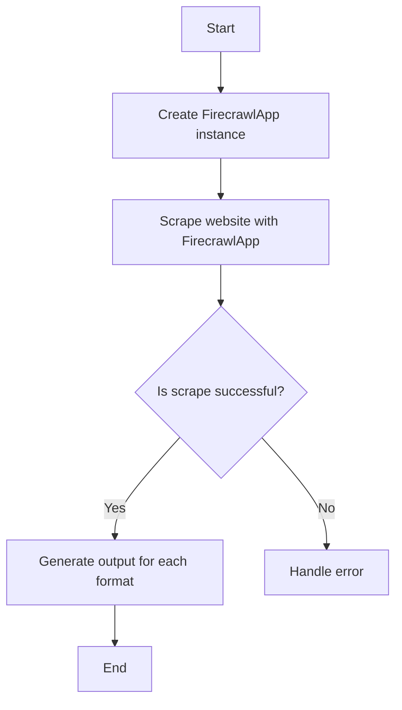
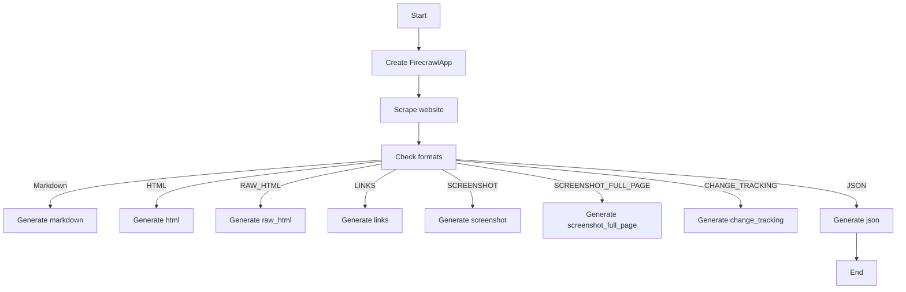
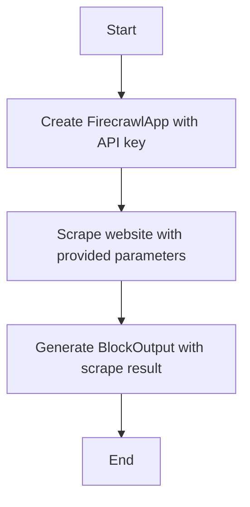
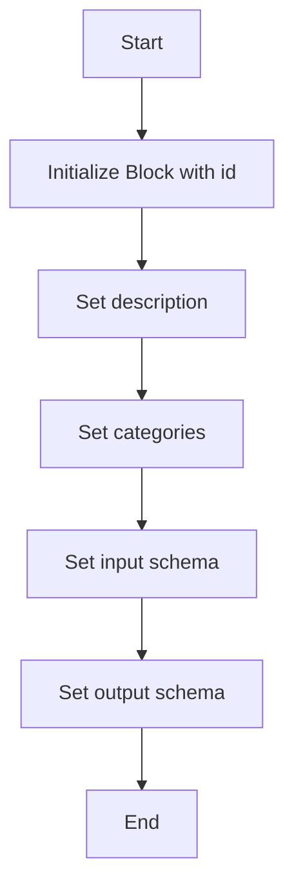
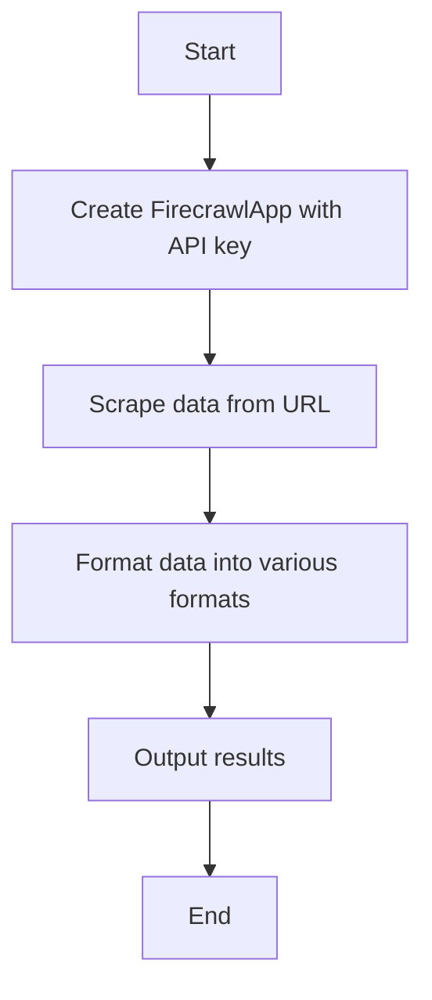

# `.\AutoGPT\autogpt_platform\backend\backend\blocks\firecrawl\scrape.py` 详细设计文档

The code defines a FirecrawlScrapeBlock class that uses the FirecrawlApp to scrape a website and extract comprehensive data, providing various output formats.

## 整体流程



## 类结构

```
FirecrawlScrapeBlock (Concrete Block)
├── Input (BlockSchemaInput)
│   ├── credentials (CredentialsMetaInput)
│   ├── url (str)
│   ├── limit (int)
│   ├── only_main_content (bool)
│   ├── max_age (int)
│   ├── wait_for (int)
│   └── formats (list[ScrapeFormat])
└── Output (BlockSchemaOutput)
    ├── data (dict[str, Any])
    ├── markdown (str)
    ├── html (str)
    ├── raw_html (str)
    ├── links (list[str])
    ├── screenshot (str)
    ├── screenshot_full_page (str)
    ├── json_data (dict[str, Any])
    ├── change_tracking (dict[str, Any])
    └── error (str)
```

## 全局变量及字段


### `firecrawl`
    
The credentials field for the Firecrawl app.

类型：`CredentialsMetaInput`
    


### `convert_to_format_options`
    
A function that converts a list of ScrapeFormat to format options.

类型：`function`
    


### `id`
    
The unique identifier for the FirecrawlScrapeBlock class.

类型：`str`
    


### `description`
    
The description of the FirecrawlScrapeBlock class.

类型：`str`
    


### `categories`
    
The categories to which the FirecrawlScrapeBlock class belongs.

类型：`set`
    


### `input_schema`
    
The input schema for the FirecrawlScrapeBlock class.

类型：`Input`
    


### `output_schema`
    
The output schema for the FirecrawlScrapeBlock class.

类型：`Output`
    


### `credentials`
    
The API key credentials for the Firecrawl app.

类型：`APIKeyCredentials`
    


### `url`
    
The URL to crawl.

类型：`str`
    


### `limit`
    
The number of pages to crawl.

类型：`int`
    


### `only_main_content`
    
Whether to only return the main content of the page.

类型：`bool`
    


### `max_age`
    
The maximum age of the page in milliseconds.

类型：`int`
    


### `wait_for`
    
The delay in milliseconds before fetching the content.

类型：`int`
    


### `formats`
    
The format of the crawl.

类型：`list[ScrapeFormat]`
    


### `data`
    
The result of the crawl.

类型：`dict[str, Any]`
    


### `markdown`
    
The markdown of the crawl.

类型：`str`
    


### `html`
    
The html of the crawl.

类型：`str`
    


### `raw_html`
    
The raw html of the crawl.

类型：`str`
    


### `links`
    
The links of the crawl.

类型：`list[str]`
    


### `screenshot`
    
The screenshot of the crawl.

类型：`str`
    


### `screenshot_full_page`
    
The screenshot full page of the crawl.

类型：`str`
    


### `json_data`
    
The json data of the crawl.

类型：`dict[str, Any]`
    


### `change_tracking`
    
The change tracking of the crawl.

类型：`dict[str, Any]`
    


### `error`
    
Error message if the scrape failed.

类型：`str`
    


### `FirecrawlScrapeBlock.id`
    
The unique identifier for the FirecrawlScrapeBlock class.

类型：`str`
    


### `FirecrawlScrapeBlock.description`
    
The description of the FirecrawlScrapeBlock class.

类型：`str`
    


### `FirecrawlScrapeBlock.categories`
    
The categories to which the FirecrawlScrapeBlock class belongs.

类型：`set`
    


### `FirecrawlScrapeBlock.input_schema`
    
The input schema for the FirecrawlScrapeBlock class.

类型：`Input`
    


### `FirecrawlScrapeBlock.output_schema`
    
The output schema for the FirecrawlScrapeBlock class.

类型：`Output`
    


### `Input.credentials`
    
The credentials for the Firecrawl app.

类型：`CredentialsMetaInput`
    


### `Input.url`
    
The URL to crawl.

类型：`str`
    


### `Input.limit`
    
The number of pages to crawl.

类型：`int`
    


### `Input.only_main_content`
    
Whether to only return the main content of the page.

类型：`bool`
    


### `Input.max_age`
    
The maximum age of the page in milliseconds.

类型：`int`
    


### `Input.wait_for`
    
The delay in milliseconds before fetching the content.

类型：`int`
    


### `Input.formats`
    
The format of the crawl.

类型：`list[ScrapeFormat]`
    


### `Output.data`
    
The result of the crawl.

类型：`dict[str, Any]`
    


### `Output.markdown`
    
The markdown of the crawl.

类型：`str`
    


### `Output.html`
    
The html of the crawl.

类型：`str`
    


### `Output.raw_html`
    
The raw html of the crawl.

类型：`str`
    


### `Output.links`
    
The links of the crawl.

类型：`list[str]`
    


### `Output.screenshot`
    
The screenshot of the crawl.

类型：`str`
    


### `Output.screenshot_full_page`
    
The screenshot full page of the crawl.

类型：`str`
    


### `Output.json_data`
    
The json data of the crawl.

类型：`dict[str, Any]`
    


### `Output.change_tracking`
    
The change tracking of the crawl.

类型：`dict[str, Any]`
    


### `Output.error`
    
Error message if the scrape failed.

类型：`str`
    
    

## 全局函数及方法


### `FirecrawlScrapeBlock.run`

This method is responsible for running the FirecrawlApp to scrape a website and extract comprehensive data.

参数：

- `input_data`：`Input`，The input data for the Firecrawl block, including URL, limit, and other options.
- `credentials`：`APIKeyCredentials`，The credentials used to authenticate with the Firecrawl API.

返回值：`BlockOutput`，The output of the Firecrawl block, including the result of the crawl and any error messages.

#### 流程图



#### 带注释源码

```python
async def run(self, input_data: Input, *, credentials: APIKeyCredentials, **kwargs) -> BlockOutput:
    app = FirecrawlApp(api_key=credentials.api_key.get_secret_value())

    scrape_result = app.scrape(
        input_data.url,
        formats=convert_to_format_options(input_data.formats),
        only_main_content=input_data.only_main_content,
        max_age=input_data.max_age,
        wait_for=input_data.wait_for,
    )
    yield "data", scrape_result

    for f in input_data.formats:
        if f == ScrapeFormat.MARKDOWN:
            yield "markdown", scrape_result.markdown
        elif f == ScrapeFormat.HTML:
            yield "html", scrape_result.html
        elif f == ScrapeFormat.RAW_HTML:
            yield "raw_html", scrape_result.raw_html
        elif f == ScrapeFormat.LINKS:
            yield "links", scrape_result.links
        elif f == ScrapeFormat.SCREENSHOT:
            yield "screenshot", scrape_result.screenshot
        elif f == ScrapeFormat.SCREENSHOT_FULL_PAGE:
            yield "screenshot_full_page", scrape_result.screenshot
        elif f == ScrapeFormat.CHANGE_TRACKING:
            yield "change_tracking", scrape_result.change_tracking
        elif f == ScrapeFormat.JSON:
            yield "json", scrape_result.json
```


### `FirecrawlScrapeBlock.scrape`

This method is responsible for scraping a website using the FirecrawlApp to extract comprehensive data while bypassing blockers.

参数：

- `input_data.url`：`str`，The URL to crawl
- `input_data.formats`：`list[ScrapeFormat]`，The format of the crawl
- `input_data.only_main_content`：`bool`，Only return the main content of the page excluding headers, navs, footers, etc.
- `input_data.max_age`：`int`，The maximum age of the page in milliseconds - default is 1 hour
- `input_data.wait_for`：`int`，Specify a delay in milliseconds before fetching the content, allowing the page sufficient time to load.

返回值：`BlockOutput`，The result of the crawl

#### 流程图



#### 带注释源码

```python
async def run(self, input_data: Input, *, credentials: APIKeyCredentials, **kwargs) -> BlockOutput:
    app = FirecrawlApp(api_key=credentials.api_key.get_secret_value())

    scrape_result = app.scrape(
        input_data.url,
        formats=convert_to_format_options(input_data.formats),
        only_main_content=input_data.only_main_content,
        max_age=input_data.max_age,
        wait_for=input_data.wait_for,
    )
    yield "data", scrape_result

    for f in input_data.formats:
        if f == ScrapeFormat.MARKDOWN:
            yield "markdown", scrape_result.markdown
        elif f == ScrapeFormat.HTML:
            yield "html", scrape_result.html
        elif f == ScrapeFormat.RAW_HTML:
            yield "raw_html", scrape_result.raw_html
        elif f == ScrapeFormat.LINKS:
            yield "links", scrape_result.links
        elif f == ScrapeFormat.SCREENSHOT:
            yield "screenshot", scrape_result.screenshot
        elif f == ScrapeFormat.SCREENSHOT_FULL_PAGE:
            yield "screenshot_full_page", scrape_result.screenshot
        elif f == ScrapeFormat.CHANGE_TRACKING:
            yield "change_tracking", scrape_result.change_tracking
        elif f == ScrapeFormat.JSON:
            yield "json", scrape_result.json
```


### FirecrawlScrapeBlock.__init__

This method initializes the `FirecrawlScrapeBlock` class, setting up its metadata and schema for the block.

参数：

- `self`：`FirecrawlScrapeBlock`，The instance of the class being initialized.

返回值：无，This method does not return any value.

#### 流程图



#### 带注释源码

```python
def __init__(self):
    super().__init__(
        id="ac444320-cf5e-4697-b586-2604c17a3e75",
        description="Firecrawl scrapes a website to extract comprehensive data while bypassing blockers.",
        categories={BlockCategory.SEARCH},
        input_schema=self.Input,
        output_schema=self.Output,
    )
```


### FirecrawlScrapeBlock.run

This method is responsible for running the Firecrawl scraping process, which involves fetching data from a specified URL and formatting the results in various formats.

参数：

- `input_data`：`Input`，The input data for the block, including URL, formats, and other parameters.
- `credentials`：`APIKeyCredentials`，The credentials required to authenticate with the Firecrawl API.

返回值：`BlockOutput`，The output of the block, which includes the result of the crawl in various formats.

#### 流程图



#### 带注释源码

```python
async def run(self, input_data: Input, *, credentials: APIKeyCredentials, **kwargs) -> BlockOutput:
    app = FirecrawlApp(api_key=credentials.api_key.get_secret_value())

    scrape_result = app.scrape(
        input_data.url,
        formats=convert_to_format_options(input_data.formats),
        only_main_content=input_data.only_main_content,
        max_age=input_data.max_age,
        wait_for=input_data.wait_for,
    )
    yield "data", scrape_result

    for f in input_data.formats:
        if f == ScrapeFormat.MARKDOWN:
            yield "markdown", scrape_result.markdown
        elif f == ScrapeFormat.HTML:
            yield "html", scrape_result.html
        elif f == ScrapeFormat.RAW_HTML:
            yield "raw_html", scrape_result.raw_html
        elif f == ScrapeFormat.LINKS:
            yield "links", scrape_result.links
        elif f == ScrapeFormat.SCREENSHOT:
            yield "screenshot", scrape_result.screenshot
        elif f == ScrapeFormat.SCREENSHOT_FULL_PAGE:
            yield "screenshot_full_page", scrape_result.screenshot
        elif f == ScrapeFormat.CHANGE_TRACKING:
            yield "change_tracking", scrape_result.change_tracking
        elif f == ScrapeFormat.JSON:
            yield "json", scrape_result.json
```


## 关键组件


### 张量索引与惰性加载

张量索引与惰性加载是代码中用于高效处理大量数据的技术，通过延迟计算和按需加载数据来优化性能。

### 反量化支持

反量化支持是代码中实现的一种功能，允许对量化过程进行逆操作，以便在需要时恢复原始数据。

### 量化策略

量化策略是代码中用于优化数据表示和存储的技术，通过减少数据精度来降低内存使用和计算成本。


## 问题及建议


### 已知问题

-   **依赖外部库**: 代码依赖于`firecrawl`库，这可能导致维护和部署的复杂性。如果该库更新或不再维护，可能会影响整个系统的稳定性。
-   **硬编码配置**: `firecrawl.credentials_field()`可能硬编码了某些配置，这不利于配置的灵活性和可维护性。
-   **错误处理**: 代码中没有明确的错误处理机制，如果`app.scrape()`调用失败，可能会导致异常未被捕获和处理。
-   **代码重复**: 对于不同的`ScrapeFormat`，代码中存在重复的逻辑来处理不同的输出格式，这可以通过代码重构来减少。

### 优化建议

-   **模块化**: 将与`firecrawl`库的交互封装在一个单独的模块中，以便于替换或升级库。
-   **配置管理**: 使用配置文件或环境变量来管理敏感信息和配置，而不是硬编码在代码中。
-   **错误处理**: 添加异常处理逻辑，确保在`app.scrape()`调用失败时能够捕获并处理异常。
-   **代码重构**: 使用工厂模式或策略模式来处理不同的输出格式，减少代码重复并提高可维护性。
-   **单元测试**: 为代码添加单元测试，确保每个功能都按预期工作，并有助于在未来的更改中保持代码质量。
-   **文档**: 为代码添加详细的文档，包括如何配置和使用该块，以及如何处理可能出现的错误。


## 其它


### 设计目标与约束

- 设计目标：
  - 提供一个模块化的爬虫工具，能够从网站提取数据。
  - 支持多种数据格式输出，如Markdown、HTML、JSON等。
  - 确保爬虫过程高效且易于配置。
  - 提供错误处理机制，确保爬虫的健壮性。

- 约束条件：
  - 遵循APIKeyCredentials的认证机制。
  - 限制爬取的页面数量，以避免对目标网站造成过大压力。
  - 确保爬取的数据符合指定的格式要求。

### 错误处理与异常设计

- 错误处理：
  - 在爬取过程中，如果遇到网络错误、API限制或其他异常，应记录错误信息并返回给用户。
  - 使用try-except语句捕获异常，并设置默认的错误消息。

- 异常设计：
  - 定义自定义异常类，如`FirecrawlError`，用于处理特定的爬虫错误。
  - 异常类应包含错误代码和错误消息，以便于用户识别和调试。

### 数据流与状态机

- 数据流：
  - 用户输入URL和爬取参数。
  - 系统调用FirecrawlApp进行爬取。
  - 爬取结果通过不同格式输出。

- 状态机：
  - 初始状态：等待用户输入。
  - 爬取状态：正在爬取数据。
  - 输出状态：数据已爬取并输出。

### 外部依赖与接口契约

- 外部依赖：
  - FirecrawlApp：用于执行爬取操作。
  - APIKeyCredentials：用于认证。
  - Block、BlockCategory、BlockOutput等：用于构建Block。

- 接口契约：
  - FirecrawlApp的接口应提供统一的爬取方法。
  - APIKeyCredentials应提供API密钥的获取方法。
  - Block应遵循统一的输入输出规范。


    