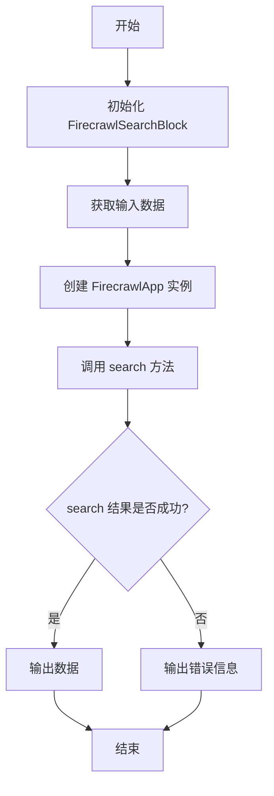
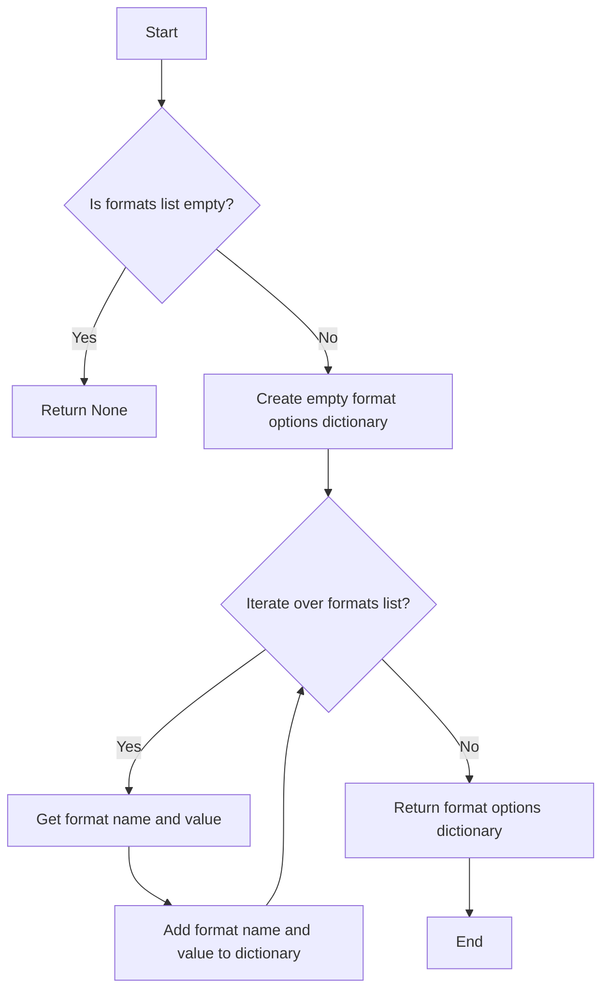
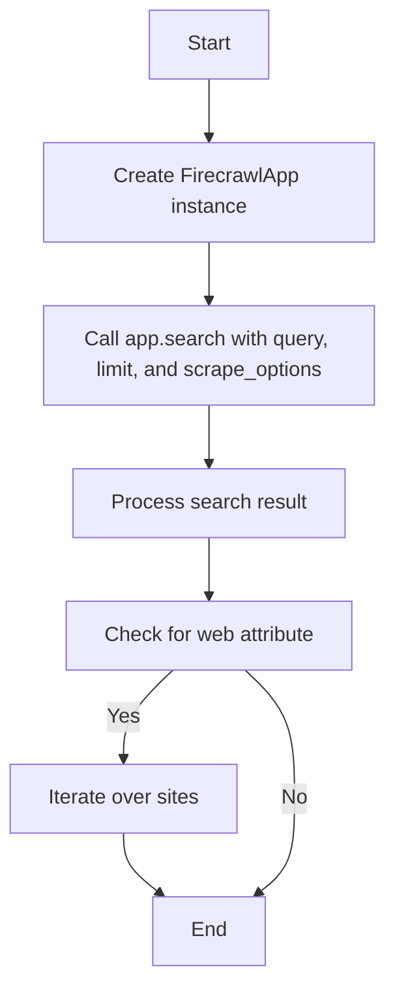
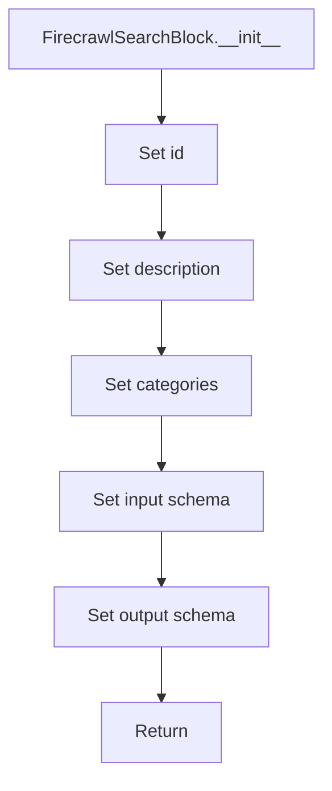
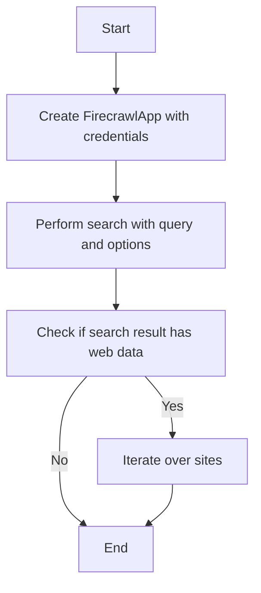

# `.\AutoGPT\autogpt_platform\backend\backend\blocks\firecrawl\search.py` 详细设计文档

The code defines a FirecrawlSearchBlock class that uses the FirecrawlApp to search the web for a given query and returns the results.

## 整体流程



## 类结构

```
FirecrawlSearchBlock (类)
```

## 全局变量及字段


### `FirecrawlApp`
    
Represents the Firecrawl application with methods to perform web searches.

类型：`class`
    


### `APIKeyCredentials`
    
Holds API key credentials for authentication.

类型：`class`
    


### `Block`
    
Base class for all blocks in the backend system.

类型：`class`
    


### `BlockCategory`
    
Enumerates the categories to which a block belongs.

类型：`class`
    


### `BlockOutput`
    
Represents the output of a block.

类型：`class`
    


### `BlockSchemaInput`
    
Represents the input schema for a block.

类型：`class`
    


### `BlockSchemaOutput`
    
Represents the output schema for a block.

类型：`class`
    


### `CredentialsMetaInput`
    
Represents metadata for credentials inputs.

类型：`class`
    


### `SchemaField`
    
Represents a field in a schema with metadata.

类型：`class`
    


### `ScrapeFormat`
    
Represents the format of the scraped content.

类型：`class`
    


### `ScrapeOptions`
    
Represents the options for scraping content.

类型：`class`
    


### `convert_to_format_options`
    
Converts a list of ScrapeFormat to a list of format options.

类型：`function`
    


### `FirecrawlSearchBlock.id`
    
Unique identifier for the block.

类型：`str`
    


### `FirecrawlSearchBlock.description`
    
Description of the block's functionality.

类型：`str`
    


### `FirecrawlSearchBlock.categories`
    
Categories to which the block belongs.

类型：`set[str]`
    


### `FirecrawlSearchBlock.input_schema`
    
Input schema for the block.

类型：`BlockSchemaInput`
    


### `FirecrawlSearchBlock.output_schema`
    
Output schema for the block.

类型：`BlockSchemaOutput`
    
    

## 全局函数及方法


### convert_to_format_options

This function converts a list of ScrapeFormat objects into a format options dictionary that can be used by the FirecrawlApp to scrape content.

参数：

- `formats`：`list[ScrapeFormat]`，A list of ScrapeFormat objects representing the desired formats for scraping.

返回值：`dict[str, Any]`，A dictionary containing the format options that can be used by the FirecrawlApp to scrape content.

#### 流程图



#### 带注释源码

```python
def convert_to_format_options(formats: list[ScrapeFormat]) -> dict[str, Any]:
    """
    Converts a list of ScrapeFormat objects into a format options dictionary.
    
    :param formats: list[ScrapeFormat] - A list of ScrapeFormat objects representing the desired formats for scraping.
    :return: dict[str, Any] - A dictionary containing the format options that can be used by the FirecrawlApp to scrape content.
    """
    format_options = {}
    for format in formats:
        format_name = format.name
        format_value = format.value
        format_options[format_name] = format_value
    return format_options
```


### app.search

The `app.search` method is a part of the `FirecrawlApp` class and is used to search the web for the given query using the Firecrawl service.

参数：

- `query`：`str`，The query to search for. This is the text that will be used to search the web.
- `limit`：`int`，The number of pages to crawl. This specifies how many pages should be crawled for the search results.
- `scrape_options`：`ScrapeOptions`，An instance of `ScrapeOptions` that contains additional options for the scraping process, such as the formats to return, the maximum age of the pages, and the delay before fetching the content.

返回值：`Any`，The result of the search, which is a dictionary containing the data, site information, and any error messages.

#### 流程图



#### 带注释源码

```python
# Sync call
scrape_result = app.search(
    input_data.query,
    limit=input_data.limit,
    scrape_options=ScrapeOptions(
        formats=convert_to_format_options(input_data.formats) or None,
        max_age=input_data.max_age,
        wait_for=input_data.wait_for,
    ),
)
```


### FirecrawlSearchBlock.__init__

This method initializes the FirecrawlSearchBlock class, setting up its metadata and schema for the block.

参数：

- `self`：`FirecrawlSearchBlock`，The instance of the class being initialized.
- `id`：`str`，The unique identifier for the block.
- `description`：`str`，A description of the block's functionality.
- `categories`：`set`，A set of categories that the block belongs to.
- `input_schema`：`BlockSchemaInput`，The schema for the input data of the block.
- `output_schema`：`BlockSchemaOutput`，The schema for the output data of the block.

返回值：`None`，This method does not return a value.

#### 流程图



#### 带注释源码

```
def __init__(self):
    super().__init__(
        id="f8d2f28d-b3a1-405b-804e-418c087d288b",
        description="Firecrawl searches the web for the given query.",
        categories={BlockCategory.SEARCH},
        input_schema=self.Input,
        output_schema=self.Output,
    )
```


### FirecrawlSearchBlock.run

FirecrawlSearchBlock.run is a coroutine method that performs a search on the web using the FirecrawlApp, taking a query and various options as input, and yields the search results and site information.

参数：

- `input_data`：`Input`，The input data for the block, which includes the query, limit, max_age, wait_for, and formats.
- `credentials`：`APIKeyCredentials`，The credentials required to authenticate with the FirecrawlApp.
- `**kwargs`：`Any`，Additional keyword arguments that may be passed to the method.

返回值：`BlockOutput`，The output of the block, which includes the search data, site information, and an error message if the search failed.

#### 流程图



#### 带注释源码

```python
async def run(self, input_data: Input, *, credentials: APIKeyCredentials, **kwargs) -> BlockOutput:
    app = FirecrawlApp(api_key=credentials.api_key.get_secret_value())

    # Sync call
    scrape_result = app.search(
        input_data.query,
        limit=input_data.limit,
        scrape_options=ScrapeOptions(
            formats=convert_to_format_options(input_data.formats) or None,
            max_age=input_data.max_age,
            wait_for=input_data.wait_for,
        ),
    )
    yield "data", scrape_result
    if hasattr(scrape_result, "web") and scrape_result.web:
        for site in scrape_result.web:
            yield "site", site
```


## 关键组件


### 张量索引与惰性加载

用于高效地索引和延迟加载大型数据集，以优化内存使用和性能。

### 反量化支持

提供对反量化操作的支持，允许在量化过程中进行逆量化处理。

### 量化策略

定义了量化策略，用于在模型训练和推理过程中对权重和激活进行量化。


## 问题及建议


### 已知问题

-   **异步调用同步处理**：`FirecrawlApp.search` 方法是一个异步方法，但在 `run` 方法中，它被当作同步方法调用。这可能导致阻塞，尤其是在网络延迟或处理时间较长的情况下。
-   **错误处理**：代码中没有明确的错误处理逻辑。如果 `app.search` 调用失败，应该有机制来处理异常并返回适当的错误信息。
-   **全局变量使用**：`firecrawl.credentials_field()` 和 `convert_to_format_options` 函数的使用没有明确的文档说明，这可能导致代码的可维护性降低。
-   **代码复用**：`convert_to_format_options` 函数可能被多个地方使用，但没有封装成一个类或模块，这可能导致代码重复和维护困难。

### 优化建议

-   **使用异步调用**：将 `app.search` 调用改为异步调用，并使用 `await` 关键字等待结果，以提高代码的响应性和效率。
-   **增加错误处理**：在调用 `app.search` 方法时，增加异常处理逻辑，确保在出现错误时能够捕获异常并返回适当的错误信息。
-   **文档和封装**：为 `firecrawl.credentials_field()` 和 `convert_to_format_options` 函数提供文档说明，并将 `convert_to_format_options` 封装成一个类或模块，以提高代码的可维护性和复用性。
-   **代码审查**：进行代码审查，确保代码风格一致，并遵循最佳实践。
-   **性能监控**：考虑添加性能监控，以便跟踪 `FirecrawlSearchBlock` 的性能，特别是在高负载情况下。


## 其它


### 设计目标与约束

- 设计目标：
  - 实现一个模块化的搜索引擎，能够根据用户输入的查询搜索网络内容。
  - 提供灵活的搜索选项，如限制搜索结果数量、页面年龄和抓取格式。
  - 确保搜索结果的可读性和准确性。
- 约束：
  - 必须使用FirecrawlApp进行搜索操作。
  - 输入数据必须符合预定义的schema。
  - 异步执行以避免阻塞主线程。

### 错误处理与异常设计

- 错误处理：
  - 如果搜索过程中发生错误，将捕获异常并返回错误信息。
  - 使用`try-except`块捕获可能的异常，如网络错误或API限制。
- 异常设计：
  - 定义自定义异常类，如`SearchError`，以提供更具体的错误信息。
  - 在`run`方法中抛出异常，并在输出中返回错误信息。

### 数据流与状态机

- 数据流：
  - 用户输入查询和搜索选项。
  - `FirecrawlSearchBlock`接收输入并调用FirecrawlApp进行搜索。
  - 搜索结果通过`yield`语句返回给调用者。
- 状态机：
  - 当前状态：等待输入数据。
  - 下一状态：执行搜索并返回结果或错误。

### 外部依赖与接口契约

- 外部依赖：
  - `firecrawl`：用于搜索和抓取网络内容。
  - `backend.blocks.firecrawl._api`：提供API接口和工具。
  - `backend.sdk`：提供块和凭证管理。
- 接口契约：
  - `FirecrawlApp`：提供搜索和抓取功能。
  - `APIKeyCredentials`：用于存储API密钥。
  - `Block`：定义块的行为和接口。
  - `SchemaField`：定义输入和输出schema的字段。
    