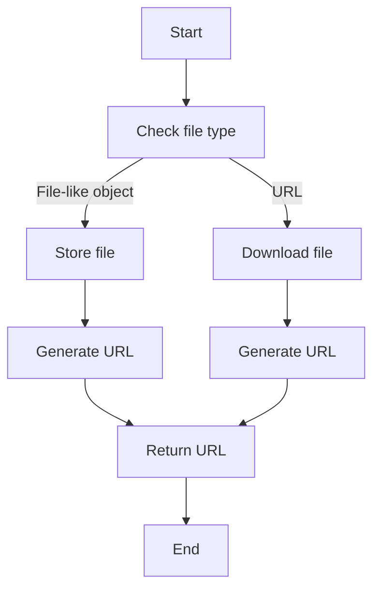
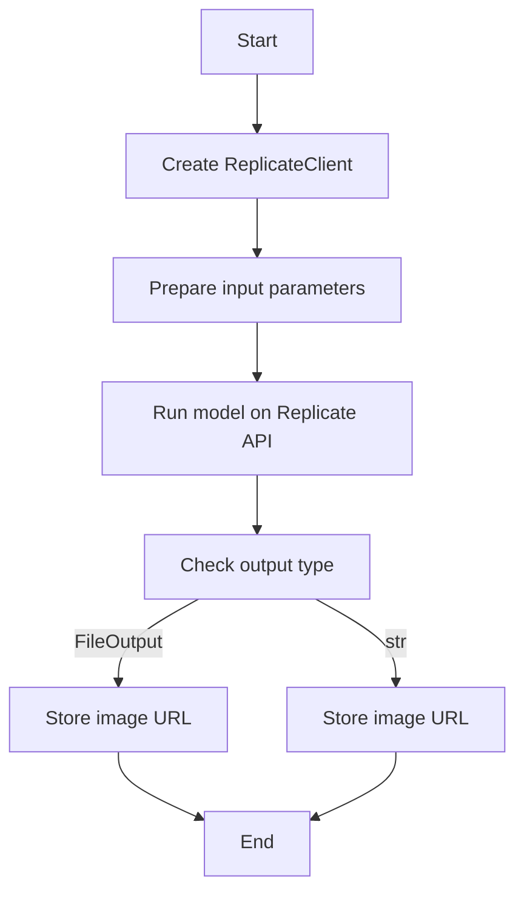
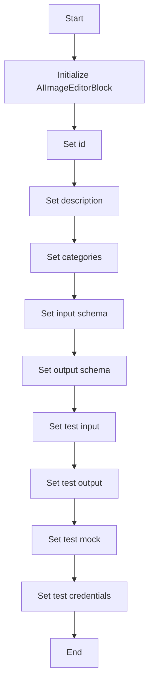
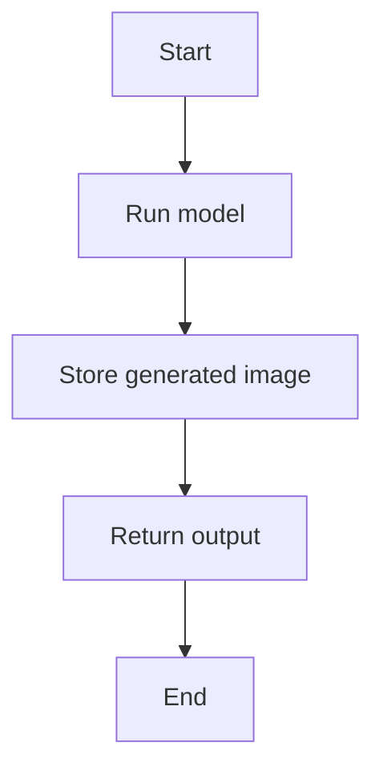
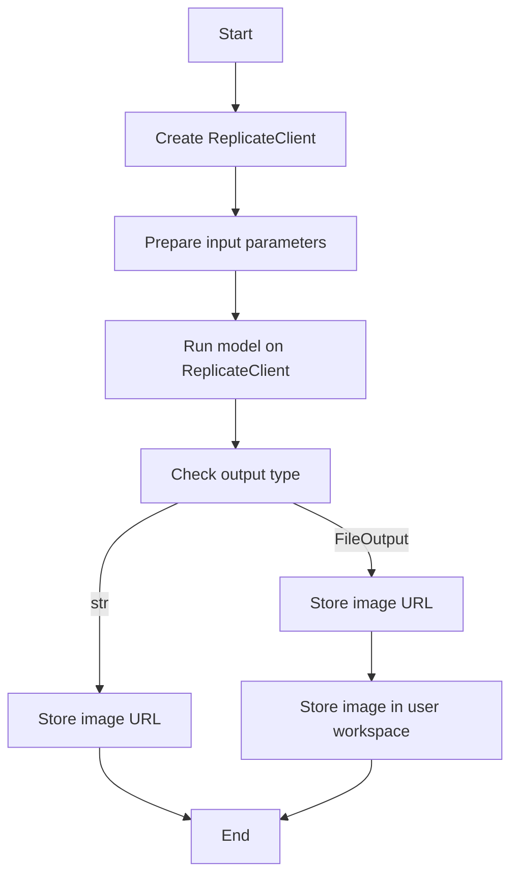

# `.\AutoGPT\autogpt_platform\backend\backend\blocks\flux_kontext.py` 详细设计文档

The AIImageEditorBlock class is designed to edit images using BlackForest Labs' Flux Kontext models, allowing users to provide a prompt and an optional reference image to generate a modified image.

## 整体流程

```mermaid
graph TD
    A[Start] --> B[Create AIImageEditorBlock instance]
    B --> C[Run AIImageEditorBlock.run() method]
    C --> D[Run AIImageEditorBlock.run_model() method]
    D --> E[Store generated image]
    E --> F[Return output image URL]
    F --> G[End]
```

## 类结构

```
AIImageEditorBlock (Concrete Block)
├── Input (BlockSchemaInput)
│   ├── credentials (CredentialsMetaInput)
│   ├── prompt (str)
│   ├── input_image (Optional[MediaFileType])
│   ├── aspect_ratio (AspectRatio)
│   ├── seed (Optional[int])
│   └── model (FluxKontextModelName)
└── Output (BlockSchemaOutput)
    └── output_image (MediaFileType)
```

## 全局变量及字段


### `TEST_CREDENTIALS`
    
Replicate API credentials for Flux Kontext models

类型：`APIKeyCredentials`
    


### `TEST_CREDENTIALS_INPUT`
    
Input data for testing AIImageEditorBlock with mock credentials

类型：`dict`
    


### `AIImageEditorBlock.id`
    
Unique identifier for the AIImageEditorBlock

类型：`str`
    


### `AIImageEditorBlock.description`
    
Description of the AIImageEditorBlock's functionality

类型：`str`
    


### `AIImageEditorBlock.categories`
    
Categories to which the AIImageEditorBlock belongs

类型：`set`
    


### `AIImageEditorBlock.input_schema`
    
Input schema for the AIImageEditorBlock

类型：`BlockSchemaInput`
    


### `AIImageEditorBlock.output_schema`
    
Output schema for the AIImageEditorBlock

类型：`BlockSchemaOutput`
    


### `AIImageEditorBlock.test_input`
    
Test input data for the AIImageEditorBlock

类型：`dict`
    


### `AIImageEditorBlock.test_output`
    
Test output data for the AIImageEditorBlock

类型：`list`
    


### `AIImageEditorBlock.test_mock`
    
Mock data for testing the AIImageEditorBlock

类型：`dict`
    


### `AIImageEditorBlock.test_credentials`
    
Test credentials for the AIImageEditorBlock

类型：`APIKeyCredentials`
    


### `Input.credentials`
    
Credentials required for the AIImageEditorBlock

类型：`CredentialsMetaInput`
    


### `Input.prompt`
    
Prompt text for the AIImageEditorBlock

类型：`str`
    


### `Input.input_image`
    
Input image for the AIImageEditorBlock

类型：`MediaFileType`
    


### `Input.aspect_ratio`
    
Aspect ratio for the generated image

类型：`AspectRatio`
    


### `Input.seed`
    
Random seed for reproducible generation

类型：`Optional[int]`
    


### `Input.model`
    
Model variant to use for the AIImageEditorBlock

类型：`FluxKontextModelName`
    


### `Output.output_image`
    
URL of the transformed image

类型：`MediaFileType`
    
    

## 全局函数及方法


### store_media_file

This function is responsible for storing a media file in the system, typically for use with external APIs like Replicate.

参数：

- `file`：`MediaFileType`，The media file to be stored. This can be a file-like object or a URL.
- `execution_context`：`ExecutionContext`，The execution context containing information about the current execution environment.
- `return_format`：`Literal['for_external_api', 'for_block_output']`，The format in which the file should be returned. This determines how the file is stored and accessed.

返回值：`str`，The URL or path to the stored media file.

#### 流程图



#### 带注释源码

```python
async def store_media_file(
    file: MediaFileType,
    execution_context: ExecutionContext,
    return_format: Literal['for_external_api', 'for_block_output'],
) -> str:
    # Implementation details are omitted for brevity
    # This function would handle storing the file and returning the appropriate URL or path
    pass
```


### `AIImageEditorBlock.run_model`

This method is responsible for running the AI model using the provided parameters and returning the output image.

参数：

- `api_key`：`SecretStr`，Replicate API的密钥，用于认证请求。
- `model_name`：`str`，模型名称，用于指定要运行的模型。
- `prompt`：`str`，文本指令，描述了所需的编辑。
- `input_image_b64`：`Optional[str]`，输入图像的Base64编码字符串，如果提供，则用于生成图像。
- `aspect_ratio`：`str`，生成图像的纵横比。
- `seed`：`Optional[int]`，随机种子，用于生成可重复的结果。
- `user_id`：`str`，用户ID，用于记录和跟踪。
- `graph_exec_id`：`str`，图形执行ID，用于记录和跟踪。

返回值：`MediaFileType`，输出图像的URL。

#### 流程图



#### 带注释源码

```python
async def run_model(
    self,
    api_key: SecretStr,
    model_name: str,
    prompt: str,
    input_image_b64: Optional[str],
    aspect_ratio: str,
    seed: Optional[int],
    user_id: str,
    graph_exec_id: str,
) -> MediaFileType:
    client = ReplicateClient(api_token=api_key.get_secret_value())
    input_params = {
        "prompt": prompt,
        "input_image": input_image_b64,
        "aspect_ratio": aspect_ratio,
        **({"seed": seed} if seed is not None else {}),
    }

    try:
        output: FileOutput | list[FileOutput] = await client.async_run(  # type: ignore
            model_name,
            input=input_params,
            wait=False,
        )
    except Exception as e:
        if "flagged as sensitive" in str(e).lower():
            raise ModerationError(
                message="Content was flagged as sensitive by the model provider",
                user_id=user_id,
                graph_exec_id=graph_exec_id,
                moderation_type="model_provider",
            )
        raise ValueError(f"Model execution failed: {e}") from e

    if isinstance(output, list) and output:
        output = output[0]

    if isinstance(output, FileOutput):
        return MediaFileType(output.url)
    if isinstance(output, str):
        return MediaFileType(output)

    raise ValueError("No output received")
```


### AIImageEditorBlock.__init__

This method initializes an instance of the AIImageEditorBlock class, setting up its properties and configurations.

参数：

- `id`：`str`，The unique identifier for the block.
- `description`：`str`，A description of the block's functionality.
- `categories`：`set`，A set of categories that the block belongs to.
- `input_schema`：`BlockSchemaInput`，The schema for the block's input data.
- `output_schema`：`BlockSchemaOutput`，The schema for the block's output data.
- `test_input`：`dict`，The test input data for the block.
- `test_output`：`list`，The expected test output data for the block.
- `test_mock`：`dict`，Mock data for testing the block.
- `test_credentials`：`APIKeyCredentials`，Test credentials for the block.

返回值：`None`，This method does not return a value.

#### 流程图



#### 带注释源码

```python
def __init__(self):
    super().__init__(
        id="3fd9c73d-4370-4925-a1ff-1b86b99fabfa",
        description=(
            "Edit images using BlackForest Labs' Flux Kontext models. Provide a prompt "
            "and optional reference image to generate a modified image."
        ),
        categories={BlockCategory.AI, BlockCategory.MULTIMEDIA},
        input_schema=AIImageEditorBlock.Input,
        output_schema=AIImageEditorBlock.Output,
        test_input={
            "prompt": "Add a hat to the cat",
            "input_image": "data:image/png;base64,MQ==",
            "aspect_ratio": AspectRatio.MATCH_INPUT_IMAGE,
            "seed": None,
            "model": FluxKontextModelName.PRO,
            "credentials": TEST_CREDENTIALS_INPUT,
        },
        test_output=[
            # Output will be a workspace ref or data URI depending on context
            ("output_image", lambda x: x.startswith(("workspace://", "data:"))),
        ],
        test_mock={
            # Use data URI to avoid HTTP requests during tests
            "run_model": lambda *args, **kwargs: "data:image/png;base64,iVBORw0KGgoAAAANSUhEUgAAAAEAAAABCAYAAAAfFcSJAAAADUlEQVR42mNk+M9QDwADhgGAWjR9awAAAABJRU5ErkJggg==",
        },
        test_credentials=TEST_CREDENTIALS,
    )
```


### AIImageEditorBlock.run

This method runs the AIImageEditorBlock, which uses BlackForest Labs' Flux Kontext models to edit images based on a prompt and optional reference image.

参数：

- `input_data`：`Input`，The input data for the AIImageEditorBlock, including the prompt, input image, aspect ratio, seed, and model.
- `credentials`：`APIKeyCredentials`，The API key credentials for the Replicate service.
- `execution_context`：`ExecutionContext`，The execution context containing user and graph execution IDs.
- `**kwargs`：Additional keyword arguments that may be required by the underlying model execution.

返回值：`BlockOutput`，The output of the AIImageEditorBlock, which includes the URL of the transformed image.

#### 流程图



#### 带注释源码

```python
async def run(
    self,
    input_data: Input,
    *,
    credentials: APIKeyCredentials,
    execution_context: ExecutionContext,
    **kwargs,
) -> BlockOutput:
    result = await self.run_model(
        api_key=credentials.api_key,
        model_name=input_data.model.api_name,
        prompt=input_data.prompt,
        input_image_b64=(
            await store_media_file(
                file=input_data.input_image,
                execution_context=execution_context,
                return_format="for_external_api",  # Get content for Replicate API
            )
            if input_data.input_image
            else None
        ),
        aspect_ratio=input_data.aspect_ratio.value,
        seed=input_data.seed,
        user_id=execution_context.user_id or "",
        graph_exec_id=execution_context.graph_exec_id or "",
    )
    # Store the generated image to the user's workspace for persistence
    stored_url = await store_media_file(
        file=result,
        execution_context=execution_context,
        return_format="for_block_output",
    )
    yield "output_image", stored_url
```


### AIImageEditorBlock.run_model

This method runs the AI model provided by BlackForest Labs' Flux Kontext to generate an image based on a given prompt and optional input image.

参数：

- `api_key`：`SecretStr`，Replicate API的密钥，用于认证请求。
- `model_name`：`str`，Flux Kontext模型的名称，用于指定要使用的模型。
- `prompt`：`str`，描述所需编辑的文本指令。
- `input_image_b64`：`Optional[str]`，输入图像的Base64编码字符串，如果提供，则用于生成图像。
- `aspect_ratio`：`str`，生成图像的纵横比。
- `seed`：`Optional[int]`，随机种子，用于生成可重复的结果。
- `user_id`：`str`，用户ID，用于记录和跟踪请求。
- `graph_exec_id`：`str`，图形执行ID，用于记录和跟踪请求。

返回值：`MediaFileType`，转换后的图像的URL。

#### 流程图



#### 带注释源码

```python
async def run_model(
    self,
    api_key: SecretStr,
    model_name: str,
    prompt: str,
    input_image_b64: Optional[str],
    aspect_ratio: str,
    seed: Optional[int],
    user_id: str,
    graph_exec_id: str,
) -> MediaFileType:
    client = ReplicateClient(api_token=api_key.get_secret_value())
    input_params = {
        "prompt": prompt,
        "input_image": input_image_b64,
        "aspect_ratio": aspect_ratio,
        **({"seed": seed} if seed is not None else {}),
    }

    try:
        output: FileOutput | list[FileOutput] = await client.async_run(  # type: ignore
            model_name,
            input=input_params,
            wait=False,
        )
    except Exception as e:
        if "flagged as sensitive" in str(e).lower():
            raise ModerationError(
                message="Content was flagged as sensitive by the model provider",
                user_id=user_id,
                graph_exec_id=graph_exec_id,
                moderation_type="model_provider",
            )
        raise ValueError(f"Model execution failed: {e}") from e

    if isinstance(output, list) and output:
        output = output[0]

    if isinstance(output, FileOutput):
        return MediaFileType(output.url)
    if isinstance(output, str):
        return MediaFileType(output)

    raise ValueError("No output received")
```


## 关键组件


### 张量索引与惰性加载

用于在模型运行时动态地索引和加载张量，以优化内存使用和提高性能。

### 反量化支持

提供对模型反量化的支持，允许在模型训练和推理之间进行转换，以适应不同的硬件和性能需求。

### 量化策略

定义了不同的量化策略，用于在模型训练过程中减少模型的精度，从而提高推理速度和降低模型大小。


## 问题及建议


### 已知问题

-   **依赖管理**：代码中使用了`ReplicateClient`和`FileOutput`，但没有明确说明这些依赖的版本管理策略，可能导致兼容性问题。
-   **异常处理**：`run_model`方法中捕获了所有异常，并抛出了`ValueError`，但没有针对不同类型的异常进行更细致的处理，可能影响调试和错误定位。
-   **代码重复**：`store_media_file`函数在`run`和`run_model`方法中被调用，存在代码重复，可以考虑将其提取为公共方法。
-   **测试数据**：测试代码中使用了硬编码的`data:image/png;base64,iVBORw0KGgoAAAANSUhEUgAAAAEAAAABCAYAAAAfFcSJAAAADUlEQVR42mNk+M9QDwADhgGAWjR9awAAAABJRU5ErkJggg==`，这不利于测试的复现和验证。
-   **全局变量**：`TEST_CREDENTIALS`和`TEST_CREDENTIALS_INPUT`作为全局变量使用，这可能会引起命名空间污染和难以追踪的问题。

### 优化建议

-   **依赖管理**：使用`pip`或`conda`等工具管理依赖，并明确指定版本号，确保环境的一致性。
-   **异常处理**：针对不同类型的异常进行分类处理，例如，对于`ModerationError`可以单独处理，并记录相关信息。
-   **代码重构**：将`store_media_file`函数提取为公共方法，减少代码重复，并提高代码的可维护性。
-   **测试数据**：使用可配置的测试数据，以便于测试的复现和验证。
-   **全局变量**：避免使用全局变量，如果必须使用，则确保其命名清晰，并考虑使用类或模块来封装。
-   **代码注释**：增加必要的代码注释，提高代码的可读性和可维护性。
-   **单元测试**：编写单元测试来覆盖关键功能，确保代码的稳定性和可靠性。
-   **性能优化**：考虑使用异步编程模式来提高代码的执行效率，特别是在处理网络请求时。


## 其它


### 设计目标与约束

- 设计目标：
  - 提供一个模块化的图像编辑服务，使用BlackForest Labs的Flux Kontext模型。
  - 支持多种图像编辑功能，如添加文本描述、调整图像大小等。
  - 确保图像编辑过程的安全性和合规性。
  - 提供易于使用的API接口，方便集成到其他系统中。

- 约束：
  - 必须使用BlackForest Labs的Flux Kontext模型进行图像编辑。
  - 输入图像必须符合特定的格式要求。
  - 输出图像必须存储在用户的工作空间中。
  - 系统必须能够处理敏感内容，并在必要时抛出异常。

### 错误处理与异常设计

- 异常处理：
  - 使用自定义异常`ModerationError`处理敏感内容问题。
  - 使用`ValueError`处理模型执行失败的情况。
  - 使用`pydantic`的验证错误处理输入数据的有效性。

- 异常类型：
  - `ModerationError`: 当模型提供者标记内容为敏感时抛出。
  - `ValueError`: 当模型执行失败或输入数据无效时抛出。

### 数据流与状态机

- 数据流：
  - 用户提交图像编辑请求，包括文本描述、参考图像等。
  - 系统验证输入数据的有效性。
  - 系统调用Flux Kontext模型进行图像编辑。
  - 系统将编辑后的图像存储在用户的工作空间中。
  - 系统返回编辑后的图像URL。

- 状态机：
  - 初始状态：用户提交请求。
  - 验证状态：系统验证输入数据。
  - 编辑状态：系统调用模型进行编辑。
  - 存储状态：系统存储编辑后的图像。
  - 完成状态：系统返回结果。

### 外部依赖与接口契约

- 外部依赖：
  - `ReplicateClient`: 用于与Replicate API交互。
  - `SecretStr`: 用于处理敏感信息。
  - `MediaFileType`: 用于表示媒体文件类型。

- 接口契约：
  - `APIKeyCredentials`: 用于存储API密钥信息。
  - `CredentialsField`: 用于验证输入数据。
  - `SchemaField`: 用于定义输入和输出数据的结构。
  - `Block`: 用于定义图像编辑块的基本属性。
  - `BlockSchemaInput`和`BlockSchemaOutput`: 用于定义输入和输出数据的schema。
  - `ExecutionContext`: 用于存储执行上下文信息。


    