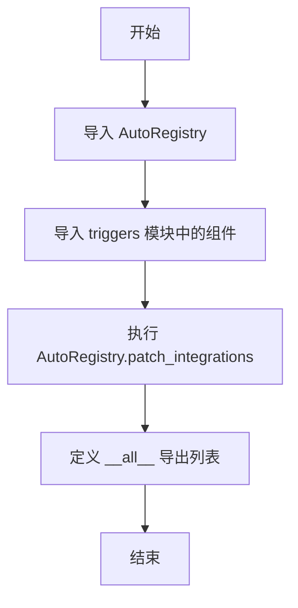

# `AutoGPT\autogpt_platform\backend\backend\blocks\generic_webhook\__init__.py` 详细设计文档

该模块作为 Webhook 集成功能的入口点，负责从本地 triggers 子模块导入核心类 GenericWebhookTriggerBlock 和函数 generic_webhook，并在导入时调用 AutoRegistry.patch_integrations 方法以确保集成管理器被正确注册到 SDK 注册表中，最后通过 __all__ 定义模块的公开接口。

## 整体流程



## 类结构

```

```

## 全局变量及字段


### `__all__`
    
定义模块的公共接口，指定在使用 'from module import *' 时应导出的符号，此处包含 'GenericWebhookTriggerBlock' 和 'generic_webhook'。

类型：`List[str]`
    


    

## 全局函数及方法


## 关键组件


### AutoRegistry

来自 SDK 的核心注册表组件，负责在运行时对系统集成进行动态打补丁和注册，确保模块的集成能力被正确加载。

### GenericWebhookTriggerBlock

通用 Webhook 触发器块类，封装了处理外部 Webhook 请求的核心逻辑和配置，用于在系统中构建基于 Webhook 的工作流。

### generic_webhook

通用 Webhook 触发器的具体实现或辅助函数，作为触发器块的对外接口，处理具体的 Webhook 接收与分发逻辑。


## 问题及建议


### 已知问题

-   **导入时产生副作用**：模块在顶层直接调用 `AutoRegistry.patch_integrations()`，这意味着仅仅导入该模块就会修改全局注册表状态。这会导致单元测试困难（难以隔离测试环境）、引入不确定的初始化顺序依赖，并增加了代码理解的隐式负担。
-   **缺乏错误处理机制**：`AutoRegistry.patch_integrations()` 的调用没有任何异常捕获。如果注册过程失败或抛出异常，将导致引用该模块的应用程序直接崩溃，且缺乏容错或重试机制。
-   **隐式的全局状态依赖**：该模块强依赖于 `backend.sdk.registry.AutoRegistry` 的全局状态。这种隐式耦合使得代码难以维护，一旦 SDK 内部实现变更（例如注册方法重命名或行为改变），此处代码极易中断而不被察觉。

### 优化建议

-   **采用显式初始化函数**：将 `AutoRegistry.patch_integrations()` 移至一个显式的初始化函数（如 `register_webhook_integrations()`），交由应用的主入口或启动流程统一调用，而不是在模块导入时自动执行，以确保控制流的清晰和可预测性。
-   **增加日志记录**：在执行补丁操作前后添加详细的日志记录（如 `info` 或 `debug` 级别），以便在部署和调试时能够清晰地追踪集成注册的状态和结果。
-   **引入异常捕获与降级处理**：使用 `try-except` 包裹注册逻辑，捕获特定的注册异常，并提供有意义的错误信息或降级策略，防止因单个组件注册失败导致系统整体不可用。
-   **封装外部依赖**：考虑使用适配器模式或工厂模式封装 `AutoRegistry` 的调用，减少业务逻辑层对 SDK 具体实现的直接依赖，提高代码的可测试性和可替换性。


## 其它


### 设计目标与约束

**设计目标**：
1. **模块化集成**：将通用的 Webhook 触发器功能无缝集成到核心系统中，实现解耦和复用。
2. **自动注册机制**：利用 SDK 的注册表机制，在模块导入时自动完成功能的注册与发现，无需手动配置。
3. **接口统一**：通过 `__all__` 明确暴露的公共接口，确保外部调用方只能访问预定的类和函数。

**约束条件**：
1. **初始化顺序依赖**：本模块必须在主系统启动流程的特定阶段被导入，以确保 `AutoRegistry` 已准备就绪且其他依赖模块未被锁定。
2. **环境耦合**：强依赖于 `backend.sdk.registry` 的具体实现，特别是 `AutoRegistry.patch_integrations` 方法的行为稳定性。
3. **副作用**：模块导入时会执行全局代码（`patch_integrations`），产生不可逆的副作用，不适合在非主进程或轻量级任务中随意导入。

### 外部依赖与接口契约

**外部依赖**：
1. **backend.sdk.registry**：
   - 描述：核心 SDK 提供的组件注册中心。
   - 接口契约：`AutoRegistry` 类必须实现静态方法 `patch_integrations()`。该方法负责扫描当前环境并更新内部注册表，且不应抛出阻断性的异常。
2. **.triggers (本地模块)**：
   - 描述：包含具体 Webhook 触发器实现的本地模块。
   - 接口契约：必须导出 `GenericWebhookTriggerBlock` 类（通常需继承自特定的基类）和 `generic_webhook` 实例或函数。

**接口契约**：
- **调用方契约**：调用方只需导入本模块即可激活 Webhook 功能，无需额外实例化操作。
- **被调用方契约**：`AutoRegistry` 必须保证 `patch_integrations` 是幂等的或线程安全的，以防多次导入导致状态不一致。

### 错误处理与异常设计

**异常传播策略**：
本代码块本身未包含显式的 `try-except` 错误捕获逻辑，遵循 Python 的“异常即控制流”原则。
1. **导入错误**：如果 `backend.sdk.registry` 或 `.triggers` 模块不存在，Python 解释器将直接抛出 `ModuleNotFoundError`，导致加载进程中断。
2. **属性错误**：如果 `AutoRegistry` 不存在 `patch_integrations` 方法，将抛出 `AttributeError`。
3. **运行时错误**：如果 `patch_integrations()` 内部逻辑出错（如版本不兼容），异常将直接向上冒泡至顶层调用者。

**设计假设**：
假设上述依赖项在健康环境下总是可用的，且初始化失败属于系统级致命错误，应直接终止程序而非静默处理。

### 数据流与状态机

**数据流**：
1. **加载阶段**：Python 解释器读取文件 -> 导入 `AutoRegistry` -> 导入本地 `triggers` 模块 -> 执行 `AutoRegistry.patch_integrations()`。
2. **注册阶段**：`patch_integrations` 读取内存中的类定义 -> 将 `GenericWebhookTriggerBlock` 映射到系统内部的处理器字典或路由表中。
3. **暴露阶段**：将 `GenericWebhookTriggerBlock` 和 `generic_webhook` 加载到当前模块的命名空间，供外部导入使用。

**状态机**：
- **初始状态 (Unpatched)**：系统注册表不包含通用 Webhook 触发器的处理逻辑。
- **过渡动作**：执行 `AutoRegistry.patch_integrations()`。
- **最终状态 (Patched/Active)**：系统注册表已更新，Webhook 触发逻辑已挂载到系统中，处于监听就绪状态。

### 安全性与合规性

**安全性考虑**：
1. **动态补丁风险**：`patch_integrations` 暗示了运行时修改系统行为的可能性。需确保此补丁操作仅在可信的初始化上下文中执行，避免被恶意代码利用进行逻辑篡改。
2. **全局命名空间污染**：通过 `__all__` 限制了导出内容，防止内部实现细节泄露，符合最小权限原则。

**合规性**：
- 代码导出的 `GenericWebhookTriggerBlock` 需确保符合后端 API 的数据处理规范（如输入验证、速率限制），尽管这些逻辑主要在 `.triggers` 内部实现，但作为入口点需承担合规性审查的责任。

    