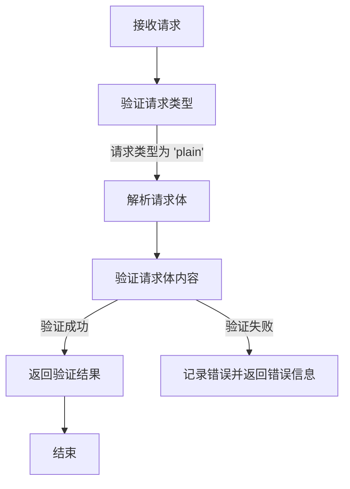
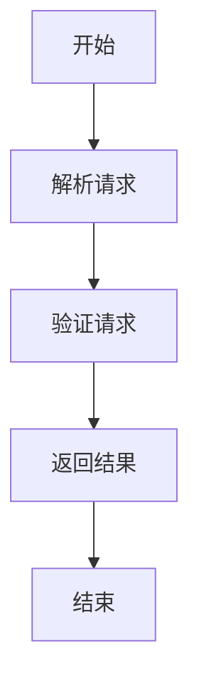

# `.\AutoGPT\autogpt_platform\backend\backend\blocks\generic_webhook\_webhook.py` 详细设计文档

The code defines a class `GenericWebhooksManager` that manages webhooks, validating payloads and handling requests using FastAPI framework.

## 整体流程



## 类结构

```
GenericWebhooksManager (类)
```

## 全局变量及字段


### `logger`
    
Logger instance for the module.

类型：`logging.getLogger`
    


### `GenericWebhookType`
    
Enum for defining different types of webhooks.

类型：`StrEnum`
    


### `GenericWebhooksManager.WebhookType`
    
Class attribute to define the webhook type.

类型：`GenericWebhookType`
    
    

## 全局函数及方法


### validate_payload

该函数用于验证Webhook请求的负载，并返回负载和事件类型。

参数：

- `webhook`：`Webhook`，Webhook对象，表示Webhook的相关信息。
- `request`：`Request`，FastAPI请求对象，包含请求的详细信息。
- `credentials`：`Credentials | None`，可选的Credentials对象，用于验证请求。

返回值：`tuple[dict, str]`，包含负载和事件类型的元组。

#### 流程图



#### 带注释源码

```
async def validate_payload(cls, webhook: Webhook, request: Request, credentials: Credentials | None = None) -> tuple[dict, str]:
    payload = await request.json()
    event_type = GenericWebhookType.PLAIN

    return payload, event_type
```


## 关键组件


### 张量索引与惰性加载

张量索引与惰性加载是处理大规模数据集时常用的技术，它允许在需要时才加载数据的一部分，从而减少内存消耗和提高效率。

### 反量化支持

反量化支持是指系统对量化操作的反向操作的支持，允许在量化后的模型上进行反向传播，以优化模型参数。

### 量化策略

量化策略是用于将浮点数模型转换为低精度整数模型的方法，以减少模型大小和提高推理速度。


## 问题及建议


### 已知问题

-   {问题1}：代码中使用了 `strenum` 库，这是一个第三方库，可能会引入技术债务。如果项目对性能有严格要求，可以考虑使用原生 Python 类型或自定义枚举类来替代。
-   {问题2}：`validate_payload` 方法中，`event_type` 被设置为 `GenericWebhookType.PLAIN`，但没有对其他可能的 `event_type` 进行处理，这可能导致代码的可扩展性不足。
-   {问题3}：代码中没有对 `credentials` 参数进行详细的处理，如果需要使用到认证信息，应该提供更详细的说明和错误处理机制。

### 优化建议

-   {建议1}：考虑移除 `strenum` 库，并使用原生 Python 类型或自定义枚举类来定义 `GenericWebhookType`。
-   {建议2}：扩展 `validate_payload` 方法，以支持多种 `event_type`，并增加相应的错误处理逻辑。
-   {建议3}：在 `validate_payload` 方法中增加对 `credentials` 的处理，确保认证信息的正确性和安全性。
-   {建议4}：考虑增加单元测试，以确保代码的稳定性和可维护性。
-   {建议5}：在文档中详细说明 `Credentials` 类的用途和如何使用它，以帮助其他开发者理解代码。


## 其它


### 设计目标与约束

- 设计目标：
  - 提供一个通用的Webhook管理器，能够处理不同类型的Webhook。
  - 确保Webhook的验证过程安全可靠。
  - 提供灵活的扩展性，以便于未来添加新的Webhook类型。

- 约束条件：
  - 必须使用FastAPI框架进行Webhook的接收和处理。
  - 需要集成strenum库来处理枚举类型。
  - 必须遵守ManualWebhookManagerBase类的接口规范。

### 错误处理与异常设计

- 错误处理：
  - 对于无效的Webhook数据，应返回相应的错误信息。
  - 对于网络请求错误，应记录错误并返回错误信息。

- 异常设计：
  - 使用try-except块捕获可能发生的异常，并记录异常信息。
  - 定义自定义异常类，以便于更好地处理特定类型的错误。

### 数据流与状态机

- 数据流：
  - Webhook请求到达 -> 请求解析 -> 验证请求 -> 返回响应

- 状态机：
  - 初始状态：等待Webhook请求
  - 处理状态：解析请求并验证
  - 结束状态：返回响应

### 外部依赖与接口契约

- 外部依赖：
  - FastAPI框架
  - strenum库
  - backend.sdk模块中的Credentials和ManualWebhookManagerBase类

- 接口契约：
  - GenericWebhooksManager类必须遵循ManualWebhookManagerBase类的接口规范。
  - validate_payload方法必须返回一个包含有效载荷和事件类型的元组。


    