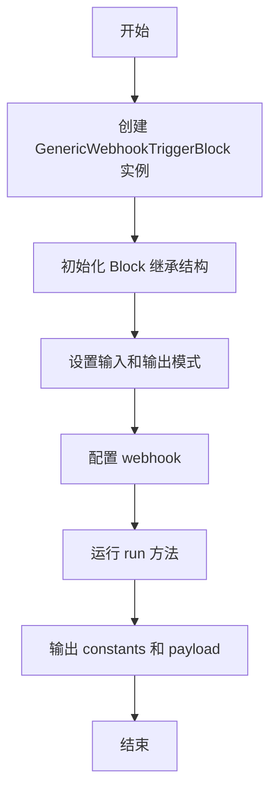
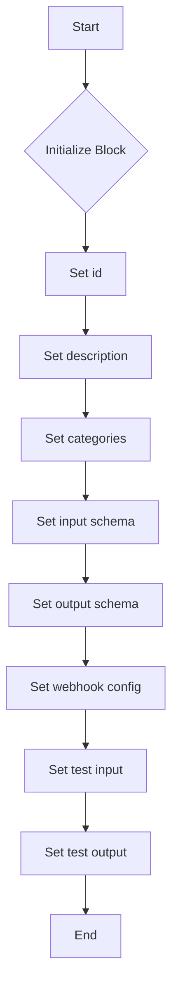
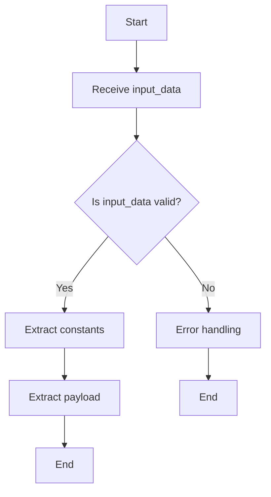

# `.\AutoGPT\autogpt_platform\backend\backend\blocks\generic_webhook\triggers.py` 详细设计文档

The code defines a generic webhook trigger block that outputs the contents of the generic input for the webhook, including payload and constants.

## 整体流程



## 类结构

```
GenericWebhookTriggerBlock (类)
├── Input (类，BlockSchemaInput)
│   ├── payload (dict)
│   └── constants (dict)
└── Output (类，BlockSchemaOutput)
    ├── payload (dict)
    └── constants (dict)
```

## 全局变量及字段


### `generic_webhook`
    
A ProviderBuilder instance configured for the generic webhook.

类型：`ProviderBuilder`
    


### `GenericWebhookTriggerBlock.id`
    
The unique identifier for the GenericWebhookTriggerBlock.

类型：`str`
    


### `GenericWebhookTriggerBlock.description`
    
A description of the GenericWebhookTriggerBlock.

类型：`str`
    


### `GenericWebhookTriggerBlock.categories`
    
A set of categories that the block belongs to.

类型：`set`
    


### `GenericWebhookTriggerBlock.input_schema`
    
The input schema for the GenericWebhookTriggerBlock.

类型：`GenericWebhookTriggerBlock.Input`
    


### `GenericWebhookTriggerBlock.output_schema`
    
The output schema for the GenericWebhookTriggerBlock.

类型：`GenericWebhookTriggerBlock.Output`
    


### `GenericWebhookTriggerBlock.webhook_config`
    
The webhook configuration for the GenericWebhookTriggerBlock.

类型：`BlockManualWebhookConfig`
    


### `GenericWebhookTriggerBlock.test_input`
    
The test input data for the GenericWebhookTriggerBlock.

类型：`dict`
    


### `GenericWebhookTriggerBlock.test_output`
    
The test output data for the GenericWebhookTriggerBlock.

类型：`list`
    


### `Input.payload`
    
The payload data for the Input class.

类型：`dict`
    


### `Input.constants`
    
The constants for the Input class.

类型：`dict`
    


### `Output.payload`
    
The payload data for the Output class.

类型：`dict`
    


### `Output.constants`
    
The constants for the Output class.

类型：`dict`
    


### `GenericWebhookTriggerBlock.id`
    
The unique identifier for the block.

类型：`str`
    


### `GenericWebhookTriggerBlock.description`
    
A description of the block.

类型：`str`
    


### `GenericWebhookTriggerBlock.categories`
    
The categories to which the block belongs.

类型：`set`
    


### `GenericWebhookTriggerBlock.input_schema`
    
The input schema for the block.

类型：`GenericWebhookTriggerBlock.Input`
    


### `GenericWebhookTriggerBlock.output_schema`
    
The output schema for the block.

类型：`GenericWebhookTriggerBlock.Output`
    


### `GenericWebhookTriggerBlock.webhook_config`
    
The webhook configuration for the block.

类型：`BlockManualWebhookConfig`
    


### `GenericWebhookTriggerBlock.test_input`
    
The test input data for the block.

类型：`dict`
    


### `GenericWebhookTriggerBlock.test_output`
    
The test output data for the block.

类型：`list`
    


### `Input.payload`
    
The payload data for the input.

类型：`dict`
    


### `Input.constants`
    
The constants for the input.

类型：`dict`
    


### `Output.payload`
    
The payload data for the output.

类型：`dict`
    


### `Output.constants`
    
The constants for the output.

类型：`dict`
    
    

## 全局函数及方法


### `GenericWebhookTriggerBlock.__init__`

初始化 `GenericWebhookTriggerBlock` 类，设置其属性和配置。

参数：

- `id`：`str`，块的唯一标识符。
- `description`：`str`，块的描述信息。
- `categories`：`set`，块的类别集合。
- `input_schema`：`Input`，输入模式。
- `output_schema`：`Output`，输出模式。
- `webhook_config`：`BlockManualWebhookConfig`，Webhook配置。
- `test_input`：`dict`，测试输入数据。
- `test_output`：`list`，测试输出数据。

返回值：无

#### 流程图



#### 带注释源码

```python
def __init__(self):
    super().__init__(
        id="8fa8c167-2002-47ce-aba8-97572fc5d387",
        description="This block will output the contents of the generic input for the webhook.",
        categories={BlockCategory.INPUT},
        input_schema=GenericWebhookTriggerBlock.Input,
        output_schema=GenericWebhookTriggerBlock.Output,
        webhook_config=BlockManualWebhookConfig(
            provider=ProviderName(generic_webhook.name),
            webhook_type=GenericWebhookType.PLAIN,
        ),
        test_input={"constants": {"key": "value"}, "payload": self.example_payload},
        test_output=[
            ("constants", {"key": "value"}),
            ("payload", self.example_payload),
        ],
    )
```


### GenericWebhookTriggerBlock.run

This method is responsible for processing the input data received from a generic webhook and yielding the constants and payload to the output.

参数：

- `input_data`：`Input`，The input data received from the webhook, which includes the payload and constants.

返回值：`BlockOutput`，The output data that includes the constants and payload.

#### 流程图



#### 带注释源码

```python
async def run(self, input_data: Input, **kwargs) -> BlockOutput:
    yield "constants", input_data.constants
    yield "payload", input_data.payload
```


## 关键组件


### 张量索引与惰性加载

张量索引与惰性加载是用于高效处理大型数据集的关键组件，它允许在需要时才加载数据，从而减少内存消耗和提高性能。

### 反量化支持

反量化支持是用于处理量化数据的关键组件，它允许在量化过程中进行逆量化操作，以便在需要时恢复原始数据。

### 量化策略

量化策略是用于优化模型性能的关键组件，它通过减少模型中使用的数值精度来减少模型大小和计算需求。


## 问题及建议


### 已知问题

-   **全局变量和函数依赖性**：代码中使用了全局变量 `generic_webhook`，这可能导致代码的可测试性和可维护性降低，因为全局状态难以控制。
-   **异步方法实现**：`run` 方法被声明为异步方法，但没有使用 `async` 关键字，这可能导致运行时错误。
-   **代码复用性**：`GenericWebhookTriggerBlock` 类中的 `example_payload` 是一个静态常量，这限制了代码的灵活性和可配置性。

### 优化建议

-   **移除全局变量**：考虑将 `generic_webhook` 作为参数传递给 `GenericWebhookTriggerBlock` 类，或者将其作为类属性存储，以减少全局状态的使用。
-   **修正异步方法**：确保 `run` 方法使用 `async` 关键字，以正确处理异步操作。
-   **增加配置选项**：允许用户在实例化 `GenericWebhookTriggerBlock` 时提供自定义的 `example_payload`，以提高代码的灵活性和可配置性。
-   **单元测试**：为 `GenericWebhookTriggerBlock` 类编写单元测试，以确保代码的正确性和稳定性。
-   **文档化**：为类和方法添加适当的文档字符串，以提高代码的可读性和可维护性。


## 其它


### 设计目标与约束

- 设计目标：确保代码能够可靠地触发和接收通用Webhook，同时保持模块化和可扩展性。
- 约束：遵循现有框架和API规范，确保与外部系统的兼容性。

### 错误处理与异常设计

- 错误处理：在`run`方法中，捕获并处理可能发生的异常，如网络错误或数据解析错误。
- 异常设计：定义自定义异常类，以提供更具体的错误信息。

### 数据流与状态机

- 数据流：输入数据通过`run`方法处理，并输出到输出流。
- 状态机：该类不涉及状态机，但可以扩展以支持更复杂的状态管理。

### 外部依赖与接口契约

- 外部依赖：依赖于`backend.sdk`模块中的类和函数。
- 接口契约：确保与`Block`类和`GenericWebhookTriggerBlock`类的接口契约一致。


    