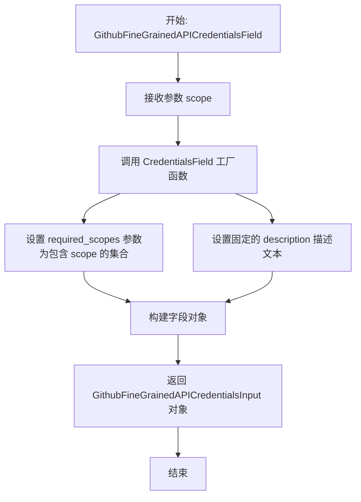

# `AutoGPT\autogpt_platform\backend\backend\blocks\github\_auth.py` 详细设计文档

该代码文件定义了GitHub集成的凭证类型系统，包括支持API密钥和OAuth2两种认证方式的类型别名、动态配置的Pydantic输入模型、用于生成凭证字段的工厂函数，以及用于测试目的的模拟凭证数据。

## 整体流程

```mermaid
graph TD
    A[开始: 加载模块] --> B[导入依赖库与模型]
    B --> C[实例化 Secrets 配置对象]
    C --> D{检查 GitHub OAuth 配置 Client ID 和 Secret 是否存在?}
    D -- 是 --> E[设置 GITHUB_OAUTH_IS_CONFIGURED = True]
    D -- 否 --> F[设置 GITHUB_OAUTH_IS_CONFIGURED = False]
    E --> G[定义 GithubCredentials 联合类型 APIKey | OAuth2]
    F --> G
    G --> H[根据配置定义 GithubCredentialsInput 泛型类型]
    H --> I[定义 GithubFineGrainedAPICredentials 相关类型]
    I --> J[定义 GithubCredentialsField 工厂函数]
    J --> K[定义 GithubFineGrainedAPICredentialsField 工厂函数]
    K --> L[初始化 TEST_CREDENTIALS 测试凭证]
    L --> M[初始化 TEST_FINE_GRAINED_CREDENTIALS 测试凭证]
    M --> N[结束: 模块定义完成]
```

## 类结构

```
github_credentials (模块)
├── 全局变量
│   ├── secrets
│   ├── GITHUB_OAUTH_IS_CONFIGURED
│   ├── TEST_CREDENTIALS
│   ├── TEST_CREDENTIALS_INPUT
│   ├── TEST_FINE_GRAINED_CREDENTIALS
│   └── TEST_FINE_GRAINED_CREDENTIALS_INPUT
├── 类型别名
│   ├── GithubCredentials
│   ├── GithubCredentialsInput
│   ├── GithubFineGrainedAPICredentials
│   └── GithubFineGrainedAPICredentialsInput
└── 函数
    ├── GithubCredentialsField
    └── GithubFineGrainedAPICredentialsField
```

## 全局变量及字段


### `secrets`
    
用于加载和管理应用程序配置及敏感信息的工具实例。

类型：`Secrets`
    


### `GITHUB_OAUTH_IS_CONFIGURED`
    
标记 GitHub OAuth 客户端 ID 和密钥是否已配置的布尔值。

类型：`bool`
    


### `TEST_CREDENTIALS`
    
用于测试的模拟 GitHub API 密钥凭证对象。

类型：`APIKeyCredentials`
    


### `TEST_CREDENTIALS_INPUT`
    
用于模拟输入数据的测试凭证元数据字典。

类型：`dict`
    


### `TEST_FINE_GRAINED_CREDENTIALS`
    
用于测试的模拟 GitHub 细粒度 API 密钥凭证对象。

类型：`APIKeyCredentials`
    


### `TEST_FINE_GRAINED_CREDENTIALS_INPUT`
    
用于模拟输入数据的测试细粒度凭证元数据字典。

类型：`dict`
    


    

## 全局函数及方法


### `GithubCredentialsField`

该函数用于创建一个适用于 Pydantic 模型的 GitHub 凭据输入字段，支持 API Key 和 OAuth2 两种认证方式，并指定了运行 Block 所需的特定授权范围。

参数：

-  `scope`：`str`，授权范围，用于定义 Block 工作所需的 GitHub API 权限（如 `repo`, `user` 等，详情参考 GitHub Scopes 文档）。

返回值：`GithubCredentialsInput`，返回一个 Pydantic 模型字段对象，该对象配置了必需的权限范围和描述信息，用于验证和接收 GitHub 的 API Key 或 OAuth2 凭据。

#### 流程图

```mermaid
flowchart TD
    A[开始: 调用 GithubCredentialsField] --> B[接收参数 scope: str]
    B --> C[调用 CredentialsField 工厂函数]
    C --> D[配置 required_scopes 参数<br>将 scope 包装为集合 {scope}]
    C --> E[配置 description 参数<br>设置支持的认证方式说明]
    D --> F[生成 CredentialsField 实例]
    E --> F
    F --> G[结束: 返回实例化的字段对象]
```

#### 带注释源码

```python
def GithubCredentialsField(scope: str) -> GithubCredentialsInput:
    """
    Creates a GitHub credentials input on a block.

    Params:
        scope: The authorization scope needed for the block to work. ([list of available scopes](https://docs.github.com/en/apps/oauth-apps/building-oauth-apps/scopes-for-oauth-apps#available-scopes))
    """  # noqa
    # 调用通用的凭据字段生成函数
    return CredentialsField(
        # required_scopes: 设置必须包含的权限集合。
        # 这里传入包含单个 scope 字符串的集合，确保传入的凭据拥有该权限。
        required_scopes={scope},
        # description: 字段的用户提示信息。
        # 说明该集成支持 OAuth 或 API Key，且必须具备操作 Block 所需的权限。
        description="The GitHub integration can be used with OAuth, "
        "or any API key with sufficient permissions for the blocks it is used on.",
    )
```


### `GithubFineGrainedAPICredentialsField`

该函数用于创建一个专门针对 GitHub 细粒度 API 的凭证输入字段定义，主要用于在自动化区块中配置并验证 GitHub API Key 所需的特定权限范围。

参数：

- `scope`：`str`，定义了操作 GitHub API 所需的授权范围（例如 "repo" 或 "user"），用于限制 API 密钥的权限级别。

返回值：`GithubFineGrainedAPICredentialsInput`，返回一个经过配置的凭证输入字段对象（通常是 Pydantic 模型字段），其中包含所需的作用域和描述信息。

#### 流程图



#### 带注释源码

```python
def GithubFineGrainedAPICredentialsField(
    scope: str,
) -> GithubFineGrainedAPICredentialsInput:
    # 调用 CredentialsField 创建凭证字段配置
    return CredentialsField(
        # 将传入的 scope 转换为集合，作为必需的权限范围
        required_scopes={scope},
        # 设置字段的用户提示文本，说明该字段接受 OAuth 或 API Key
        description="The GitHub integration can be used with OAuth, "
        "or any API key with sufficient permissions for the blocks it is used on.",
    )
```


## 关键组件


### GithubCredentials

GitHub 的凭证类型定义，支持 API 密钥或 OAuth2 认证方式的联合类型。

### GithubCredentialsInput

用于 GitHub 凭证输入的 Pydantic 模型类型，根据 OAuth 配置状态动态调整允许的认证类型。

### GithubCredentialsField

一个工厂函数，用于创建具有特定授权范围要求的 GitHub 凭证输入字段。

### GithubFineGrainedAPICredentials

专门为 GitHub 细粒度 API 访问定义的凭证类型，限定为 API 密钥认证。

### GithubFineGrainedAPICredentialsField

生成 GitHub 细粒度 API 凭证输入字段的辅助函数，用于处理特定的权限范围。

### GITHUB_OAUTH_IS_CONFIGURED

一个全局布尔标志，用于检查系统是否已配置必要的 GitHub OAuth 客户端 ID 和密钥。

### TEST_CREDENTIALS

用于单元测试或开发环境模拟的 GitHub API 凭证对象。

### TEST_FINE_GRAINED_CREDENTIALS

用于测试细粒度 API 功能的模拟 GitHub API 凭证对象。


## 问题及建议


### 已知问题

-   **测试数据生成逻辑错误**：在 `TEST_CREDENTIALS_INPUT` 和 `TEST_FINE_GRAINED_CREDENTIALS_INPUT` 字典中，`title` 字段被错误地赋值为 `TEST_CREDENTIALS.type`（通常返回的是 `"api_key"` 这样的类型字符串），而原始凭证对象中 `title` 是 `"Mock GitHub API key"`。这会导致测试数据与预期不符。
-   **描述文本与类型定义不一致**：`GithubFineGrainedAPICredentialsField` 函数的 `description` 参数中提到支持 "OAuth"，但其对应的类型别名 `GithubFineGrainedAPICredentials` 和 `GithubFineGrainedAPICredentialsInput` 严格限制为 `APIKeyCredentials`（即仅支持 API Key）。这种不一致会给使用者造成混淆。
-   **模块加载时的副作用**：`secrets = Secrets()` 和 `GITHUB_OAUTH_IS_CONFIGURED` 在模块导入时立即执行。这意味着该模块依赖于运行时的环境变量状态，这增加了单元测试的复杂性（难以 Mock 环境），且如果环境变量在模块加载后动态变化，该变量不会更新。

### 优化建议

-   **消除代码重复**：`GithubCredentialsField` 和 `GithubFineGrainedAPICredentialsField` 两个函数的内部实现逻辑完全一致（除了返回类型注解）。建议提取公共逻辑或合并函数，通过参数控制行为，以减少代码冗余和维护成本。
-   **延迟加载配置状态**：将 `GITHUB_OAUTH_IS_CONFIGURED` 的检查移至运行时或函数内部，或者通过依赖注入的方式获取配置状态，而不是在模块顶层直接计算。这有助于解耦代码逻辑与外部环境配置，提高代码的可测试性。
-   **修正测试数据构建**：修正 `TEST_CREDENTIALS_INPUT` 等字典的构建逻辑，确保 `title` 字段引用了正确的属性（如 `TEST_CREDENTIALS.title`）或显式指定的字符串，以保证测试数据的准确性。
-   **细化描述文本**：针对 `GithubFineGrainedAPICredentialsField`，修改其描述文本，移除关于 OAuth 支持的说明，使其与实际的类型定义（仅支持 API Key）保持一致。


## 其它


### 设计目标与约束

1.  **统一认证抽象**：旨在为系统中的 GitHub 集成提供统一、类型安全的凭证定义，支持标准的 API Key 和 OAuth2 两种认证模式。
2.  **动态配置适应性**：设计目标之一是根据运行时环境变量（`GITHUB_OAUTH_IS_CONFIGURED`）动态调整可用的认证类型。如果未配置 OAuth 密钥，系统应仅暴露 API Key 认证类型，从而在类型层面限制无效输入。
3.  **细粒度权限控制**：通过 `GithubFineGrainedAPICredentials` 区分标准 API Key 和细粒度 API Key，以满足不同安全级别和权限范围的业务需求。
4.  **类型安全约束**：利用 Python 的 `Literal` 类型严格限定 `provider` 和 `type` 字段的取值范围，防止因拼写错误导致的配置问题。

### 外部依赖与接口契约

1.  **`backend.data.model` 模块**：
    *   **契约**：依赖该模块提供的 `APIKeyCredentials`, `OAuth2Credentials` 作为基础数据模型。依赖 `CredentialsField` 工厂函数生成 Pydantic 字段，该函数必须接受 `required_scopes` 和 `description` 参数。
    *   **依赖**：`CredentialsMetaInput` 用于定义输入类型的泛型基类。
2.  **`backend.util.settings` 模块**：
    *   **契约**：依赖 `Secrets` 类提供配置管理。`Secrets` 实例必须包含 `github_client_id` 和 `github_client_secret` 属性，且这些属性在未设置时应评估为 False 或 None，以供逻辑判断。
3.  **`pydantic` 库**：
    *   **契约**：使用 `SecretStr` 类型处理敏感字符串，确保其在日志或序列化过程中默认隐藏，符合安全契约。
4.  **`backend.integrations.providers` 模块**：
    *   **契约**：依赖 `ProviderName.GITHUB` 常量，该常量的值必须与系统中定义的 GitHub 提供商标识符一致。

### 数据流与初始化逻辑

该模块的执行流主要分为模块加载阶段和运行时调用阶段：

1.  **模块加载阶段**：
    *   **环境检测**：代码执行开始，实例化 `Secrets` 对象。
    *   **状态判定**：检查 `secrets.github_client_id` 和 `secrets.github_client_secret` 是否存在，计算布尔值 `GITHUB_OAUTH_IS_CONFIGURED`。
    *   **类型构造**：根据 `GITHUB_OAUTH_IS_CONFIGURED` 的值，动态构造 `GithubCredentialsInput` 类型别名。如果为 True，则包含 `"oauth2"`；否则仅包含 `"api_key"`。
    *   **常量初始化**：创建测试用的凭证常量（`TEST_CREDENTIALS` 等）供全局使用。

2.  **运行时调用阶段**：
    *   **入口**：外部代码调用 `GithubCredentialsField(scope)` 或 `GithubFineGrainedAPICredentialsField(scope)`。
    *   **参数传递**：传入所需的权限范围字符串（如 `repo`, `user` 等）。
    *   **字段生成**：函数内部调用 `CredentialsField`，将传入的 scope 包装为集合 `required_scopes`，并附加描述信息。
    *   **返回**：返回符合 Pydantic 规范的字段定义对象，用于后续的模型验证或表单生成。

### 错误处理与异常设计

1.  **隐式验证机制**：该模块本身不包含显式的 `try-except` 块，而是依赖于 `pydantic` 的强类型校验机制。
    *   **类型不匹配**：如果用户尝试使用未定义的认证类型（例如在仅支持 API Key 的环境下传入 OAuth），Pydantic 的 `Literal` 类型校验将抛出 `ValidationError`。
    *   **格式错误**：如果传入的凭证结构不符合 `APIKeyCredentials` 或 `OAuth2Credentials` 的模型定义，同样会触发 `ValidationError`。
2.  **配置缺失处理**：代码通过 `bool(...)` 检查处理了 OAuth 配置缺失的情况，这是一种“优雅降级”策略。代码不会因缺少 OAuth 配置而崩溃，而是通过类型系统从可用选项中移除 OAuth 支持。
3.  **安全性处理**：通过 `SecretStr` 封装 `api_key`，确保即便在调试打印或异常堆栈中（如果不特别处理），敏感信息也不会以明文形式泄露。

    