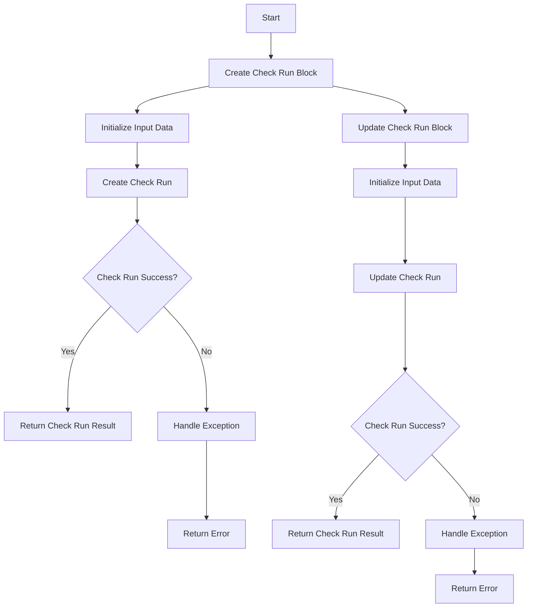
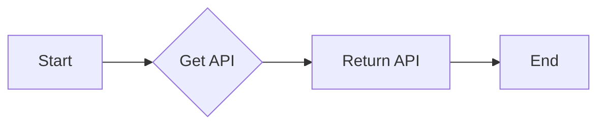
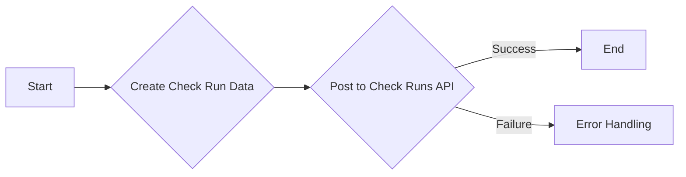
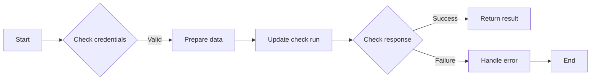
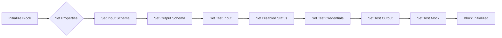
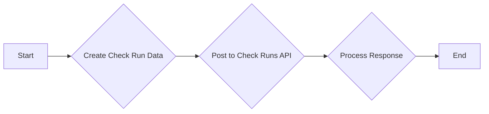
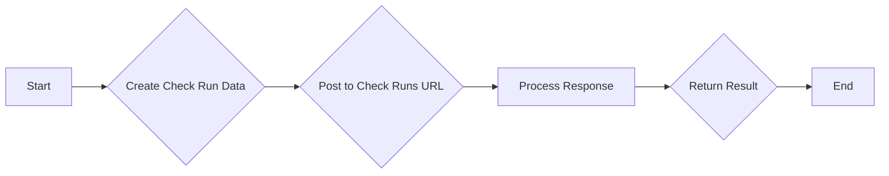
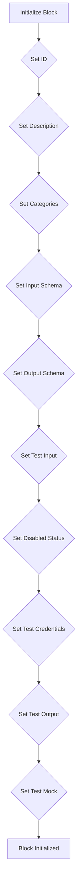
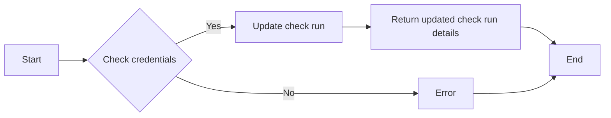
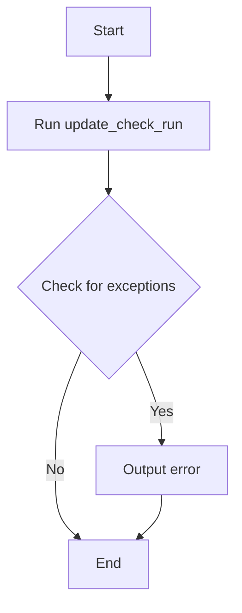

# `.\AutoGPT\autogpt_platform\backend\backend\blocks\github\checks.py` 详细设计文档

This code defines two classes for creating and updating check runs on GitHub repositories. It uses the GitHub API to interact with the GitHub repository and manages the input and output data for these operations.

## 整体流程



## 类结构

```
GithubCreateCheckRunBlock (Concrete Block)
├── Input (BlockSchemaInput)
│   ├── credentials (GithubCredentialsInput)
│   ├── repo_url (str)
│   ├── name (str)
│   ├── head_sha (str)
│   ├── status (ChecksStatus)
│   ├── conclusion (Optional[ChecksConclusion])
│   ├── details_url (str)
│   ├── output_title (str)
│   ├── output_summary (str)
│   └── output_text (str)
├── Output (BlockSchemaOutput)
│   ├── CheckRunResult (BaseModel)
│   │   ├── id (int)
│   │   ├── html_url (str)
│   │   └── status (str)
│   └── error (str)
└── GithubUpdateCheckRunBlock (Concrete Block)
    ├── Input (BlockSchemaInput)
    │   ├── credentials (GithubCredentialsInput)
    │   ├── repo_url (str)
    │   ├── check_run_id (int)
    │   ├── status (ChecksStatus)
    │   ├── conclusion (ChecksConclusion)
    │   ├── output_title (Optional[str])
    │   ├── output_summary (Optional[str])
    │   └── output_text (Optional[str])
    └── Output (BlockSchemaOutput)
        ├── CheckRunResult (BaseModel)
        │   ├── id (int)
        │   ├── html_url (str)
        │   └── status (str)
        └── conclusion (Optional[str])
```

## 全局变量及字段


### `TEST_CREDENTIALS`
    
Test credentials for GitHub API access.

类型：`GithubCredentials`
    


### `TEST_CREDENTIALS_INPUT`
    
Input schema for test credentials.

类型：`GithubCredentialsInput`
    


### `QUEUED`
    
Enum value representing the queued status of a check run.

类型：`str`
    


### `IN_PROGRESS`
    
Enum value representing the in_progress status of a check run.

类型：`str`
    


### `COMPLETED`
    
Enum value representing the completed status of a check run.

类型：`str`
    


### `WAITING`
    
Enum value representing the waiting status of a check run.

类型：`str`
    


### `REQUESTED`
    
Enum value representing the requested status of a check run.

类型：`str`
    


### `PENDING`
    
Enum value representing the pending status of a check run.

类型：`str`
    


### `SUCCESS`
    
Enum value representing the success conclusion of a check run.

类型：`str`
    


### `FAILURE`
    
Enum value representing the failure conclusion of a check run.

类型：`str`
    


### `NEUTRAL`
    
Enum value representing the neutral conclusion of a check run.

类型：`str`
    


### `CANCELLED`
    
Enum value representing the cancelled conclusion of a check run.

类型：`str`
    


### `TIMED_OUT`
    
Enum value representing the timed_out conclusion of a check run.

类型：`str`
    


### `ACTION_REQUIRED`
    
Enum value representing the action_required conclusion of a check run.

类型：`str`
    


### `SKIPPED`
    
Enum value representing the skipped conclusion of a check run.

类型：`str`
    


### `id`
    
Unique identifier for the block.

类型：`str`
    


### `description`
    
Description of the block's functionality.

类型：`str`
    


### `categories`
    
Categories to which the block belongs.

类型：`set`
    


### `input_schema`
    
Input schema for the block.

类型：`BlockSchemaInput`
    


### `output_schema`
    
Output schema for the block.

类型：`BlockSchemaOutput`
    


### `test_input`
    
Test input data for the block.

类型：`dict`
    


### `disabled`
    
Flag indicating whether the block is disabled.

类型：`bool`
    


### `test_credentials`
    
Test credentials for the block.

类型：`GithubCredentials`
    


### `test_output`
    
Test output data for the block.

类型：`list`
    


### `test_mock`
    
Mock data for testing the block.

类型：`dict`
    


### `GithubCreateCheckRunBlock.id`
    
Unique identifier for the GitHubCreateCheckRunBlock class.

类型：`str`
    


### `GithubCreateCheckRunBlock.description`
    
Description of the GitHubCreateCheckRunBlock class's functionality.

类型：`str`
    


### `GithubCreateCheckRunBlock.categories`
    
Categories to which the GitHubCreateCheckRunBlock class belongs.

类型：`set`
    


### `GithubCreateCheckRunBlock.input_schema`
    
Input schema for the GitHubCreateCheckRunBlock class.

类型：`BlockSchemaInput`
    


### `GithubCreateCheckRunBlock.output_schema`
    
Output schema for the GitHubCreateCheckRunBlock class.

类型：`BlockSchemaOutput`
    


### `GithubCreateCheckRunBlock.test_input`
    
Test input data for the GitHubCreateCheckRunBlock class.

类型：`dict`
    


### `GithubCreateCheckRunBlock.disabled`
    
Flag indicating whether the GitHubCreateCheckRunBlock class is disabled.

类型：`bool`
    


### `GithubCreateCheckRunBlock.test_credentials`
    
Test credentials for the GitHubCreateCheckRunBlock class.

类型：`GithubCredentials`
    


### `GithubCreateCheckRunBlock.test_output`
    
Test output data for the GitHubCreateCheckRunBlock class.

类型：`list`
    


### `GithubCreateCheckRunBlock.test_mock`
    
Mock data for testing the GitHubCreateCheckRunBlock class.

类型：`dict`
    


### `GithubUpdateCheckRunBlock.id`
    
Unique identifier for the GithubUpdateCheckRunBlock class.

类型：`str`
    


### `GithubUpdateCheckRunBlock.description`
    
Description of the GithubUpdateCheckRunBlock class's functionality.

类型：`str`
    


### `GithubUpdateCheckRunBlock.categories`
    
Categories to which the GithubUpdateCheckRunBlock class belongs.

类型：`set`
    


### `GithubUpdateCheckRunBlock.input_schema`
    
Input schema for the GithubUpdateCheckRunBlock class.

类型：`BlockSchemaInput`
    


### `GithubUpdateCheckRunBlock.output_schema`
    
Output schema for the GithubUpdateCheckRunBlock class.

类型：`BlockSchemaOutput`
    


### `GithubUpdateCheckRunBlock.disabled`
    
Flag indicating whether the GithubUpdateCheckRunBlock class is disabled.

类型：`bool`
    


### `GithubUpdateCheckRunBlock.test_input`
    
Test input data for the GithubUpdateCheckRunBlock class.

类型：`dict`
    


### `GithubUpdateCheckRunBlock.test_credentials`
    
Test credentials for the GithubUpdateCheckRunBlock class.

类型：`GithubCredentials`
    


### `GithubUpdateCheckRunBlock.test_output`
    
Test output data for the GithubUpdateCheckRunBlock class.

类型：`list`
    


### `GithubUpdateCheckRunBlock.test_mock`
    
Mock data for testing the GithubUpdateCheckRunBlock class.

类型：`dict`
    
    

## 全局函数及方法


### `get_api`

获取API实例。

参数：

- `credentials`：`GithubCredentials`，GitHub凭据对象，用于认证API请求。

返回值：`API`，API实例，用于执行GitHub API请求。

#### 流程图



#### 带注释源码

```python
from ._api import get_api

@staticmethod
async def create_check_run(
    credentials: GithubCredentials,
    repo_url: str,
    name: str,
    head_sha: str,
    status: ChecksStatus,
    conclusion: Optional[ChecksConclusion] = None,
    details_url: Optional[str] = None,
    output_title: Optional[str] = None,
    output_summary: Optional[str] = None,
    output_text: Optional[str] = None,
) -> dict:
    api = get_api(credentials)
    # ... (rest of the method)
```


### `GithubCreateCheckRunBlock.create_check_run`

This function creates a new check run on a GitHub repository for a specific commit.

参数：

- `credentials`：`GithubCredentials`，The GitHub credentials used to authenticate the request.
- `repo_url`：`str`，The URL of the GitHub repository.
- `name`：`str`，The name of the check run (e.g., 'code-coverage').
- `head_sha`：`str`，The SHA of the commit to check.
- `status`：`ChecksStatus`，Current status of the check run.
- `conclusion`：`Optional[ChecksConclusion]`，The final conclusion of the check (required if status is completed).
- `details_url`：`Optional[str]`，The URL for the full details of the check.
- `output_title`：`Optional[str]`，Title of the check run output.
- `output_summary`：`Optional[str]`，Summary of the check run output.
- `output_text`：`Optional[str]`，Detailed text of the check run output.

返回值：`dict`，Details of the created check run.

#### 流程图



#### 带注释源码

```python
@staticmethod
async def create_check_run(
    credentials: GithubCredentials,
    repo_url: str,
    name: str,
    head_sha: str,
    status: ChecksStatus,
    conclusion: Optional[ChecksConclusion] = None,
    details_url: Optional[str] = None,
    output_title: Optional[str] = None,
    output_summary: Optional[str] = None,
    output_text: Optional[str] = None,
) -> dict:
    api = get_api(credentials)

    class CheckRunData(BaseModel):
        name: str
        head_sha: str
        status: str
        conclusion: Optional[str] = None
        details_url: Optional[str] = None
        output: Optional[dict[str, str]] = None

    data = CheckRunData(
        name=name,
        head_sha=head_sha,
        status=status.value,
    )

    if conclusion:
        data.conclusion = conclusion.value

    if details_url:
        data.details_url = details_url

    if output_title or output_summary or output_text:
        output_data = {
            "title": output_title or "",
            "summary": output_summary or "",
            "text": output_text or "",
        }
        data.output = output_data

    check_runs_url = f"{repo_url}/check-runs"
    response = await api.post(
        check_runs_url, data=data.model_dump_json(exclude_none=True)
    )
    result = response.json()

    return {
        "id": result["id"],
        "html_url": result["html_url"],
        "status": result["status"],
    }
```


### `GithubUpdateCheckRunBlock.update_check_run`

Updates the status and conclusion of an existing check run in a GitHub repository.

参数：

- `credentials`：`GithubCredentials`，The GitHub credentials used to authenticate the request.
- `repo_url`：`str`，The URL of the GitHub repository.
- `check_run_id`：`int`，The ID of the check run to update.
- `status`：`ChecksStatus`，The new status of the check run.
- `conclusion`：`Optional[ChecksConclusion]`，The final conclusion of the check (required if status is completed).
- `output_title`：`Optional[str]`，The new title of the check run output.
- `output_summary`：`Optional[str]`，The new summary of the check run output.
- `output_text`：`Optional[str]`，The new detailed text of the check run output.

返回值：`dict`，Details of the updated check run.

#### 流程图



#### 带注释源码

```python
    @staticmethod
    async def update_check_run(
        credentials: GithubCredentials,
        repo_url: str,
        check_run_id: int,
        status: ChecksStatus,
        conclusion: Optional[ChecksConclusion] = None,
        output_title: Optional[str] = None,
        output_summary: Optional[str] = None,
        output_text: Optional[str] = None,
    ) -> dict:
        api = get_api(credentials)

        class UpdateCheckRunData(BaseModel):
            status: str
            conclusion: Optional[str] = None
            output: Optional[dict[str, str]] = None

        data = UpdateCheckRunData(
            status=status.value,
        )

        if conclusion:
            data.conclusion = conclusion.value

        if output_title or output_summary or output_text:
            output_data = {
                "title": output_title or "",
                "summary": output_summary or "",
                "text": output_text or "",
            }
            data.output = output_data

        check_run_url = f"{repo_url}/check-runs/{check_run_id}"
        response = await api.patch(
            check_run_url, data=data.model_dump_json(exclude_none=True)
        )
        result = response.json()

        return {
            "id": result["id"],
            "html_url": result["html_url"],
            "status": result["status"],
            "conclusion": result.get("conclusion"),
        }
``` 


### `GithubCreateCheckRunBlock.__init__`

This method initializes the `GithubCreateCheckRunBlock` class, setting up its properties and configurations for creating a new check run on a GitHub repository.

参数：

- `id`: `str`，A unique identifier for the block.
- `description`: `str`，A description of the block's functionality.
- `categories`: `set`，A set of categories that the block belongs to.
- `input_schema`: `BlockSchemaInput`，The input schema for the block.
- `output_schema`: `BlockSchemaOutput`，The output schema for the block.
- `test_input`: `dict`，Sample input data for testing the block.
- `disabled`: `bool`，A flag indicating whether the block is disabled.
- `test_credentials`: `GithubCredentials`，Test credentials for the block.
- `test_output`: `list`，Expected output for testing the block.
- `test_mock`: `dict`，Mock data for testing the block.

返回值：无

#### 流程图



#### 带注释源码

```python
def __init__(self):
    super().__init__(
        id="2f45e89a-3b7d-4f22-b89e-6c4f5c7e1234",
        description="Creates a new check run for a specific commit in a GitHub repository",
        categories={BlockCategory.DEVELOPER_TOOLS},
        input_schema=GithubCreateCheckRunBlock.Input,
        output_schema=GithubCreateCheckRunBlock.Output,
        test_input={
            "repo_url": "https://github.com/owner/repo",
            "name": "test-check",
            "head_sha": "ce587453ced02b1526dfb4cb910479d431683101",
            "status": ChecksStatus.COMPLETED.value,
            "conclusion": ChecksConclusion.SUCCESS.value,
            "output_title": "Test Results",
            "output_summary": "All tests passed",
            "credentials": TEST_CREDENTIALS_INPUT,
        },
        disabled=True,
        test_credentials=TEST_CREDENTIALS,
        test_output=[
            (
                "check_run",
                {
                    "id": 4,
                    "html_url": "https://github.com/owner/repo/runs/4",
                    "status": "completed",
                },
            ),
        ],
        test_mock={
            "create_check_run": lambda *args, **kwargs: {
                "id": 4,
                "html_url": "https://github.com/owner/repo/runs/4",
                "status": "completed",
            }
        },
    )
```


### `GithubCreateCheckRunBlock.create_check_run`

This function creates a new check run on a GitHub repository.

参数：

- `credentials`：`GithubCredentials`，The GitHub credentials used to authenticate the request.
- `repo_url`：`str`，The URL of the GitHub repository.
- `name`：`str`，The name of the check run (e.g., 'code-coverage').
- `head_sha`：`str`，The SHA of the commit to check.
- `status`：`ChecksStatus`，Current status of the check run.
- `conclusion`：`Optional[ChecksConclusion]`，The final conclusion of the check (required if status is completed).
- `details_url`：`Optional[str]`，The URL for the full details of the check.
- `output_title`：`Optional[str]`，Title of the check run output.
- `output_summary`：`Optional[str]`，Summary of the check run output.
- `output_text`：`Optional[str]`，Detailed text of the check run output.

返回值：`dict`，Details of the created check run.

#### 流程图



#### 带注释源码

```python
@staticmethod
async def create_check_run(
    credentials: GithubCredentials,
    repo_url: str,
    name: str,
    head_sha: str,
    status: ChecksStatus,
    conclusion: Optional[ChecksConclusion] = None,
    details_url: Optional[str] = None,
    output_title: Optional[str] = None,
    output_summary: Optional[str] = None,
    output_text: Optional[str] = None,
) -> dict:
    api = get_api(credentials)

    class CheckRunData(BaseModel):
        name: str
        head_sha: str
        status: str
        conclusion: Optional[str] = None
        details_url: Optional[str] = None
        output: Optional[dict[str, str]] = None

    data = CheckRunData(
        name=name,
        head_sha=head_sha,
        status=status.value,
    )

    if conclusion:
        data.conclusion = conclusion.value

    if details_url:
        data.details_url = details_url

    if output_title or output_summary or output_text:
        output_data = {
            "title": output_title or "",
            "summary": output_summary or "",
            "text": output_text or "",
        }
        data.output = output_data

    check_runs_url = f"{repo_url}/check-runs"
    response = await api.post(
        check_runs_url, data=data.model_dump_json(exclude_none=True)
    )
    result = response.json()

    return {
        "id": result["id"],
        "html_url": result["html_url"],
        "status": result["status"],
    }
``` 


### `GithubCreateCheckRunBlock.create_check_run`

This method creates a new check run on a GitHub repository.

参数：

- `credentials`：`GithubCredentials`，The GitHub credentials used to authenticate the request.
- `repo_url`：`str`，The URL of the GitHub repository.
- `name`：`str`，The name of the check run (e.g., 'code-coverage').
- `head_sha`：`str`，The SHA of the commit to check.
- `status`：`ChecksStatus`，Current status of the check run.
- `conclusion`：`Optional[ChecksConclusion]`，The final conclusion of the check (required if status is completed).
- `details_url`：`Optional[str]`，The URL for the full details of the check.
- `output_title`：`Optional[str]`，Title of the check run output.
- `output_summary`：`Optional[str]`，Summary of the check run output.
- `output_text`：`Optional[str]`，Detailed text of the check run output.

返回值：`dict`，Details of the created check run.

#### 流程图



#### 带注释源码

```python
@staticmethod
async def create_check_run(
    credentials: GithubCredentials,
    repo_url: str,
    name: str,
    head_sha: str,
    status: ChecksStatus,
    conclusion: Optional[ChecksConclusion] = None,
    details_url: Optional[str] = None,
    output_title: Optional[str] = None,
    output_summary: Optional[str] = None,
    output_text: Optional[str] = None,
) -> dict:
    api = get_api(credentials)

    class CheckRunData(BaseModel):
        name: str
        head_sha: str
        status: str
        conclusion: Optional[str] = None
        details_url: Optional[str] = None
        output: Optional[dict[str, str]] = None

    data = CheckRunData(
        name=name,
        head_sha=head_sha,
        status=status.value,
    )

    if conclusion:
        data.conclusion = conclusion.value

    if details_url:
        data.details_url = details_url

    if output_title or output_summary or output_text:
        output_data = {
            "title": output_title or "",
            "summary": output_summary or "",
            "text": output_text or "",
        }
        data.output = output_data

    check_runs_url = f"{repo_url}/check-runs"
    response = await api.post(
        check_runs_url, data=data.model_dump_json(exclude_none=True)
    )
    result = response.json()

    return {
        "id": result["id"],
        "html_url": result["html_url"],
        "status": result["status"],
    }
```


### `GithubUpdateCheckRunBlock.__init__`

This method initializes the `GithubUpdateCheckRunBlock` class, setting up its properties and configurations.

参数：

- `id`: `str`，A unique identifier for the block.
- `description`: `str`，A description of the block's functionality.
- `categories`: `set`，A set of categories that the block belongs to.
- `input_schema`: `BlockSchemaInput`，The input schema for the block.
- `output_schema`: `BlockSchemaOutput`，The output schema for the block.
- `test_input`: `dict`，Sample input data for testing the block.
- `disabled`: `bool`，A flag indicating whether the block is disabled.
- `test_credentials`: `GithubCredentials`，Test credentials for the block.
- `test_output`: `list`，Expected output for testing the block.
- `test_mock`: `dict`，Mock data for testing the block.

返回值：`None`，This method does not return any value.

#### 流程图



#### 带注释源码

```python
def __init__(self):
    super().__init__(
        id="8a23c567-9d01-4e56-b789-0c12d3e45678",  # Generated UUID
        description="Updates an existing check run in a GitHub repository",
        categories={BlockCategory.DEVELOPER_TOOLS},
        input_schema=GithubUpdateCheckRunBlock.Input,
        output_schema=GithubUpdateCheckRunBlock.Output,
        # requires a github app not available to oauth in our current system
        disabled=True,
        test_input={
            "repo_url": "https://github.com/owner/repo",
            "check_run_id": 4,
            "status": ChecksStatus.COMPLETED.value,
            "conclusion": ChecksConclusion.SUCCESS.value,
            "output_title": "Updated Results",
            "output_summary": "All tests passed after retry",
            "credentials": TEST_CREDENTIALS_INPUT,
        },
        test_credentials=TEST_CREDENTIALS,
        test_output=[
            (
                "check_run",
                {
                    "id": 4,
                    "html_url": "https://github.com/owner/repo/runs/4",
                    "status": "completed",
                    "conclusion": "success",
                },
            ),
        ],
        test_mock={
            "update_check_run": lambda *args, **kwargs: {
                "id": 4,
                "html_url": "https://github.com/owner/repo/runs/4",
                "status": "completed",
                "conclusion": "success",
            }
        },
    )
```


### `GithubUpdateCheckRunBlock.update_check_run`

This method updates an existing check run in a GitHub repository.

参数：

- `credentials`：`GithubCredentials`，The GitHub credentials used to authenticate the request.
- `repo_url`：`str`，The URL of the GitHub repository where the check run is located.
- `check_run_id`：`int`，The ID of the check run to update.
- `status`：`ChecksStatus`，The new status of the check run.
- `conclusion`：`Optional[ChecksConclusion]`，The final conclusion of the check (required if status is completed).
- `output_title`：`Optional[str]`，The new title of the check run output.
- `output_summary`：`Optional[str]`，The new summary of the check run output.
- `output_text`：`Optional[str]`，The new detailed text of the check run output.

返回值：`dict`，Details of the updated check run.

#### 流程图



#### 带注释源码

```python
@staticmethod
async def update_check_run(
    credentials: GithubCredentials,
    repo_url: str,
    check_run_id: int,
    status: ChecksStatus,
    conclusion: Optional[ChecksConclusion] = None,
    output_title: Optional[str] = None,
    output_summary: Optional[str] = None,
    output_text: Optional[str] = None,
) -> dict:
    api = get_api(credentials)

    class UpdateCheckRunData(BaseModel):
        status: str
        conclusion: Optional[str] = None
        output: Optional[dict[str, str]] = None

    data = UpdateCheckRunData(
        status=status.value,
    )

    if conclusion:
        data.conclusion = conclusion.value

    if output_title or output_summary or output_text:
        output_data = {
            "title": output_title or "",
            "summary": output_summary or "",
            "text": output_text or "",
        }
        data.output = output_data

    check_run_url = f"{repo_url}/check-runs/{check_run_id}"
    response = await api.patch(
        check_run_url, data=data.model_dump_json(exclude_none=True)
    )
    result = response.json()

    return {
        "id": result["id"],
        "html_url": result["html_url"],
        "status": result["status"],
        "conclusion": result.get("conclusion"),
    }
```


### `GithubUpdateCheckRunBlock.run`

This method updates an existing check run in a GitHub repository.

参数：

- `input_data`：`Input`，The input data for the block, containing details about the check run to update.
- `credentials`：`GithubCredentials`，The GitHub credentials used to authenticate the request.

返回值：`BlockOutput`，The output of the block, containing the details of the updated check run or an error message if the update failed.

#### 流程图



#### 带注释源码

```python
async def run(self, input_data: Input, *, credentials: GithubCredentials, **kwargs) -> BlockOutput:
    try:
        result = await self.update_check_run(
            credentials=credentials,
            repo_url=input_data.repo_url,
            check_run_id=input_data.check_run_id,
            status=input_data.status,
            conclusion=input_data.conclusion,
            output_title=input_data.output_title,
            output_summary=input_data.output_summary,
            output_text=input_data.output_text,
        )
        yield "check_run", result
    except Exception as e:
        yield "error", str(e)
```


## 关键组件


### 张量索引与惰性加载

张量索引与惰性加载是代码中处理数据结构的核心组件，它允许对大型数据集进行高效访问，同时减少内存消耗。

### 反量化支持

反量化支持是代码中用于处理量化数据的核心组件，它允许在量化过程中进行反向操作，以恢复原始数据。

### 量化策略

量化策略是代码中用于优化数据表示和处理的组件，它通过减少数据精度来减少内存和计算需求。


## 问题及建议


### 已知问题

-   **全局变量和函数依赖性**：代码中存在全局变量和函数，如`get_api`和`TEST_CREDENTIALS`，这些可能使得代码难以测试和维护，因为它们依赖于外部状态。
-   **硬编码的GitHub App权限**：代码中提到需要一个GitHub App，并且当前系统不支持OAuth，这可能导致代码在需要OAuth的场景下无法工作。
-   **异常处理**：代码中的异常处理较为简单，仅捕获所有异常并返回错误信息，没有针对不同类型的异常进行区分处理。
-   **代码重复**：`GithubCreateCheckRunBlock`和`GithubUpdateCheckRunBlock`类中存在大量重复代码，可以考虑提取公共逻辑以减少冗余。

### 优化建议

-   **重构全局变量和函数**：将全局变量和函数封装到类中，或者使用依赖注入来减少外部依赖，提高代码的可测试性和可维护性。
-   **实现OAuth支持**：如果需要支持OAuth，应考虑实现OAuth认证流程，以便在需要时能够使用OAuth进行认证。
-   **改进异常处理**：根据异常的类型进行不同的处理，例如对于网络异常、认证异常等进行特定的处理，以提高用户体验。
-   **提取公共逻辑**：将`GithubCreateCheckRunBlock`和`GithubUpdateCheckRunBlock`类中的公共逻辑提取出来，创建一个基类或者工具函数，以减少代码重复。
-   **文档和注释**：增加代码的文档和注释，特别是对于复杂的逻辑和外部依赖，以提高代码的可读性和可维护性。
-   **单元测试**：编写单元测试来覆盖代码的关键路径，确保代码的正确性和稳定性。
-   **代码风格**：遵循一致的代码风格指南，以提高代码的可读性和一致性。


## 其它


### 设计目标与约束

- 设计目标：
  - 实现对GitHub仓库中检查运行的创建和更新功能。
  - 提供一个易于使用的接口，允许用户通过配置文件或API调用创建和更新检查运行。
  - 确保代码的可维护性和可扩展性，以便未来可以添加更多功能。

- 约束：
  - 代码需要与GitHub API兼容。
  - 代码需要处理可能的异常和错误，如网络问题或API限制。
  - 代码需要遵循最佳实践，如代码风格和异常处理。

### 错误处理与异常设计

- 错误处理：
  - 代码应捕获和处理所有可能的异常，如网络错误、API限制或无效输入。
  - 异常应转换为用户友好的错误消息，并通过输出字段返回。

- 异常设计：
  - 定义自定义异常类，以区分不同类型的错误。
  - 使用try-except块捕获和处理异常。

### 数据流与状态机

- 数据流：
  - 用户输入数据（如仓库URL、检查运行名称等）。
  - 数据通过API发送到GitHub。
  - GitHub返回响应数据。
  - 响应数据被处理并返回给用户。

- 状态机：
  - 检查运行可能处于以下状态：queued, in_progress, completed, waiting, requested, pending。
  - 状态根据操作（如创建或更新）和GitHub API响应而变化。

### 外部依赖与接口契约

- 外部依赖：
  - GitHub API。
  - Pydantic库用于数据验证。
  - Asyncio库用于异步操作。

- 接口契约：
  - 定义清晰的API接口，包括输入和输出参数。
  - 使用类型注解和Pydantic模型确保数据的有效性。
  - 提供文档说明API的使用方法和预期行为。


    