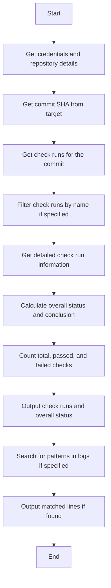
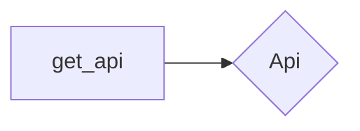
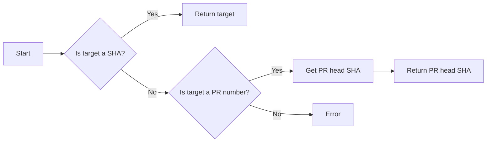
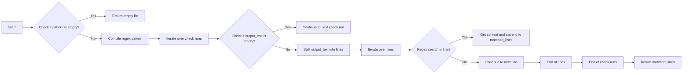
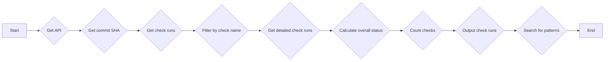
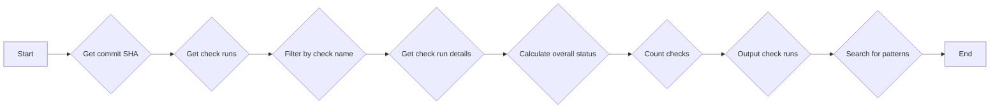
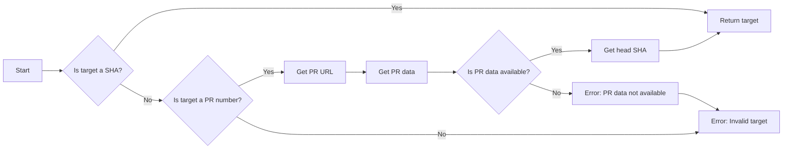
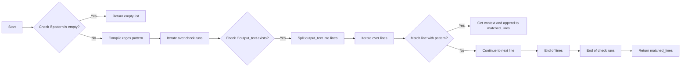

# `.\AutoGPT\autogpt_platform\backend\backend\blocks\github\ci.py` 详细设计文档

The code defines a block for fetching CI results from GitHub repositories, including detailed check runs and optional search for specific errors/warnings in logs.

## 整体流程



## 类结构

```
GithubGetCIResultsBlock (Concrete Block)
├── Input (BlockSchemaInput)
│   ├── credentials (GithubCredentialsInput)
│   ├── repo (str)
│   ├── target (str | int)
│   └── search_pattern (Optional[str])
│       └── check_name_filter (Optional[str])
├── Output (BlockSchemaOutput)
│   ├── CheckRunItem (TypedDict)
│   │   ├── id (int)
│   │   ├── name (str)
│   │   ├── status (str)
│   │   ├── conclusion (Optional[str])
│   │   ├── started_at (Optional[str])
│   │   ├── completed_at (Optional[str])
│   │   ├── html_url (str)
│   │   ├── details_url (Optional[str])
│   │   ├── output_title (Optional[str])
│   │   ├── output_summary (Optional[str])
│   │   ├── output_text (Optional[str])
│   │   └── annotations (list[dict])
│   ├── check_run (CheckRunItem)
│   ├── check_runs (list[CheckRunItem])
│   ├── matched_line (MatchedLine)
│   ├── matched_lines (list[MatchedLine])
│   ├── overall_status (str)
│   ├── overall_conclusion (str)
│   ├── total_checks (int)
│   ├── passed_checks (int)
│   └── failed_checks (int)
└── CheckRunConclusion (Enum)
    ├── SUCCESS
    ├── FAILURE
    ├── NEUTRAL
    ├── CANCELLED
    ├── SKIPPED
    ├── TIMED_OUT
    └── ACTION_REQUIRED
```

## 全局变量及字段


### `logger`
    
Logger instance for logging messages.

类型：`logging.Logger`
    


### `CheckRunStatus`
    
Enum representing possible statuses of a check run.

类型：`Enum`
    


### `CheckRunConclusion`
    
Enum representing possible conclusions of a check run.

类型：`Enum`
    


### `TEST_CREDENTIALS`
    
Test credentials for GitHub API access.

类型：`GithubCredentials`
    


### `TEST_CREDENTIALS_INPUT`
    
Test input for GitHub credentials.

类型：`GithubCredentialsInput`
    


### `GithubCredentials`
    
Class representing GitHub credentials.

类型：`class`
    


### `GithubCredentialsField`
    
Class representing fields of GitHub credentials.

类型：`class`
    


### `GithubCredentialsInput`
    
Class representing input for GitHub credentials.

类型：`class`
    


### `Block`
    
Base class for blocks.

类型：`class`
    


### `BlockCategory`
    
Enum representing categories of blocks.

类型：`class`
    


### `BlockOutput`
    
Class representing output schema for blocks.

类型：`class`
    


### `SchemaField`
    
Class representing schema fields.

类型：`class`
    


### `TypedDict`
    
Class representing typed dictionaries.

类型：`class`
    


### `get_api`
    
Function to get GitHub API instance.

类型：`function`
    


### `re`
    
Module for regular expressions.

类型：`module`
    


### `Enum`
    
Class for creating enumerations.

类型：`class`
    


### `TypedDict`
    
Class for creating typed dictionaries.

类型：`class`
    


### `Optional`
    
Type for optional values.

类型：`type`
    


### `async`
    
Keyword for asynchronous functions.

类型：`keyword`
    


### `await`
    
Keyword for awaiting asynchronous functions.

类型：`keyword`
    


### `lambda`
    
Keyword for creating anonymous functions.

类型：`keyword`
    


### `fnmatch`
    
Module for filename matching operations.

类型：`module`
    


### `dict`
    
Class for creating dictionaries.

类型：`class`
    


### `list`
    
Class for creating lists.

类型：`class`
    


### `str`
    
Class for creating strings.

类型：`class`
    


### `int`
    
Class for creating integers.

类型：`class`
    


### `GithubGetCIResultsBlock.id`
    
Unique identifier for the block.

类型：`str`
    


### `GithubGetCIResultsBlock.description`
    
Description of the block.

类型：`str`
    


### `GithubGetCIResultsBlock.categories`
    
Categories to which the block belongs.

类型：`set`
    


### `GithubGetCIResultsBlock.input_schema`
    
Input schema for the block.

类型：`class`
    


### `GithubGetCIResultsBlock.output_schema`
    
Output schema for the block.

类型：`class`
    


### `GithubGetCIResultsBlock.test_input`
    
Test input data for the block.

类型：`dict`
    


### `GithubGetCIResultsBlock.test_credentials`
    
Test credentials for the block.

类型：`GithubCredentials`
    


### `GithubGetCIResultsBlock.test_output`
    
Test output data for the block.

类型：`list`
    


### `GithubGetCIResultsBlock.test_mock`
    
Test mock data for the block.

类型：`dict`
    


### `Input.credentials`
    
Credentials for accessing GitHub API.

类型：`GithubCredentialsInput`
    


### `Input.repo`
    
GitHub repository name.

类型：`str`
    


### `Input.target`
    
Commit SHA or PR number to get CI results for.

类型：`str | int`
    


### `Input.search_pattern`
    
Optional regex pattern to search for in CI logs.

类型：`Optional[str]`
    


### `Input.check_name_filter`
    
Optional filter for specific check names.

类型：`Optional[str]`
    


### `Output.CheckRunItem`
    
Typed dictionary for check run items.

类型：`TypedDict`
    


### `Output.MatchedLine`
    
Typed dictionary for matched lines in logs.

类型：`TypedDict`
    


### `Output.overall_status`
    
Overall CI status.

类型：`str`
    


### `Output.overall_conclusion`
    
Overall CI conclusion if completed.

类型：`str`
    


### `Output.total_checks`
    
Total number of CI checks.

类型：`int`
    


### `Output.passed_checks`
    
Number of passed checks.

类型：`int`
    


### `Output.failed_checks`
    
Number of failed checks.

类型：`int`
    
    

## 全局函数及方法


### `get_api`

获取API实例。

参数：

- `credentials`：`GithubCredentials`，GitHub凭据对象
- `convert_urls`：`Optional[bool]`，是否将URL转换为绝对路径，默认为`False`

返回值：`Api`，API实例

#### 流程图



#### 带注释源码

```python
def get_api(credentials: GithubCredentials, convert_urls: Optional[bool] = False) -> Api:
    # 创建API实例
    api = Api(credentials, convert_urls=convert_urls)
    return api
```


### `get_commit_sha`

Get commit SHA from either a commit SHA or PR URL.

参数：

- `api`：`Api`，API client used to make requests.
- `repo`：`str`，GitHub repository.
- `target`：`str | int`，Commit SHA or PR number to get CI results for.

返回值：`str`，Commit SHA.

#### 流程图



#### 带注释源码

```python
@staticmethod
async def get_commit_sha(api, repo: str, target: str | int) -> str:
    """Get commit SHA from either a commit SHA or PR URL."""
    # If it's already a SHA, return it
    if isinstance(target, str):
        if re.match(r"^[0-9a-f]{6,40}$", target, re.IGNORECASE):
            return target

    # If it's a PR URL, get the head SHA
    if isinstance(target, int):
        pr_url = f"https://api.github.com/repos/{repo}/pulls/{target}"
        response = await api.get(pr_url)
        pr_data = response.json()
        return pr_data["head"]["sha"]

    raise ValueError("Target must be a commit SHA or PR URL")
```


### `GithubGetCIResultsBlock.search_in_logs`

Search for a specific pattern in the logs of check runs.

参数：

- `check_runs`：`list`，A list of check runs containing logs.
- `pattern`：`str`，The regex pattern to search for in the logs.

返回值：`list`，A list of matched lines with context.

#### 流程图



#### 带注释源码

```python
@staticmethod
async def search_in_logs(
    check_runs: list,
    pattern: str,
) -> list[Output.MatchedLine]:
    """Search for pattern in check run logs."""
    if not pattern:
        return []

    matched_lines = []
    regex = re.compile(pattern, re.IGNORECASE | re.MULTILINE)

    for check in check_runs:
        output_text = check.get("output_text", "") or ""
        if not output_text:
            continue

        lines = output_text.split("\n")
        for i, line in enumerate(lines):
            if regex.search(line):
                # Get context (2 lines before and after)
                start = max(0, i - 2)
                end = min(len(lines), i + 3)
                context = lines[start:end]

                matched_lines.append(
                    {
                        "check_name": check["name"],
                        "line_number": i + 1,
                        "line": line,
                        "context": context,
                    }
                )

    return matched_lines
```


### `GithubGetCIResultsBlock.get_ci_results`

This method retrieves CI results for a given commit or pull request from GitHub.

参数：

- `credentials`：`GithubCredentials`，GitHub credentials for authentication.
- `repo`：`str`，GitHub repository.
- `target`：`str | int`，Commit SHA or PR number to get CI results for.
- `search_pattern`：`Optional[str]`，Optional regex pattern to search for in CI logs (e.g., error messages, file names).
- `check_name_filter`：`Optional[str]`，Optional filter for specific check names (supports wildcards).

返回值：`dict`，A dictionary containing CI results.

#### 流程图



#### 带注释源码

```python
    @staticmethod
    async def get_ci_results(
        credentials: GithubCredentials,
        repo: str,
        target: str | int,
        search_pattern: Optional[str] = None,
        check_name_filter: Optional[str] = None,
    ) -> dict:
        api = get_api(credentials, convert_urls=False)

        # Get the commit SHA
        commit_sha = await GithubGetCIResultsBlock.get_commit_sha(api, repo, target)

        # Get check runs for the commit
        check_runs_url = (
            f"https://api.github.com/repos/{repo}/commits/{commit_sha}/check-runs"
        )

        # Get all pages of check runs
        all_check_runs = []
        page = 1
        per_page = 100

        while True:
            response = await api.get(
                check_runs_url, params={"per_page": per_page, "page": page}
            )
            data = response.json()

            check_runs = data.get("check_runs", [])
            all_check_runs.extend(check_runs)

            if len(check_runs) < per_page:
                break
            page += 1

        # Filter by check name if specified
        if check_name_filter:
            import fnmatch

            filtered_runs = []
            for run in all_check_runs:
                if fnmatch.fnmatch(run["name"].lower(), check_name_filter.lower()):
                    filtered_runs.append(run)
            all_check_runs = filtered_runs

        # Get check run details with logs
        detailed_runs = []
        for run in all_check_runs:
            # Get detailed output including logs
            if run.get("output", {}).get("text"):
                # Already has output
                detailed_run = {
                    "id": run["id"],
                    "name": run["name"],
                    "status": run["status"],
                    "conclusion": run.get("conclusion"),
                    "started_at": run.get("started_at"),
                    "completed_at": run.get("completed_at"),
                    "html_url": run["html_url"],
                    "details_url": run.get("details_url"),
                    "output_title": run.get("output", {}).get("title"),
                    "output_summary": run.get("output", {}).get("summary"),
                    "output_text": run.get("output", {}).get("text"),
                    "annotations": [],
                }
            else:
                # Try to get logs from the check run
                detailed_run = {
                    "id": run["id"],
                    "name": run["name"],
                    "status": run["status"],
                    "conclusion": run.get("conclusion"),
                    "started_at": run.get("started_at"),
                    "completed_at": run.get("completed_at"),
                    "html_url": run["html_url"],
                    "details_url": run.get("details_url"),
                    "output_title": run.get("output", {}).get("title"),
                    "output_summary": run.get("output", {}).get("summary"),
                    "output_text": None,
                    "annotations": [],
                }

            # Get annotations if available
            if run.get("output", {}).get("annotations_count", 0) > 0:
                annotations_url = f"https://api.github.com/repos/{repo}/check-runs/{run['id']}/annotations"
                try:
                    ann_response = await api.get(annotations_url)
                    detailed_run["annotations"] = ann_response.json()
                except Exception:
                    pass

            detailed_runs.append(detailed_run)

        return {
            "check_runs": detailed_runs,
            "total_count": len(detailed_runs),
        }
``` 


### `GithubGetCIResultsBlock.run`

This method runs the CI results retrieval process for a given GitHub repository and target commit or PR, with optional search for specific errors/warnings in logs.

参数：

- `input_data`：`Input`，The input data for the block, containing the repository, target, and optional search pattern.
- `credentials`：`GithubCredentials`，The GitHub credentials to use for authentication.
- `**kwargs`：Additional keyword arguments that may be passed to the method.

返回值：`BlockOutput`，The output data containing the overall status, conclusion, total checks, passed checks, failed checks, check runs, and matched lines if a search pattern is provided.

#### 流程图



#### 带注释源码

```python
async def run(
    self,
    input_data: Input,
    *,
    credentials: GithubCredentials,
    **kwargs,
) -> BlockOutput:
    try:
        target = int(input_data.target)
    except ValueError:
        target = input_data.target

    result = await self.get_ci_results(
        credentials,
        input_data.repo,
        target,
        input_data.search_pattern,
        input_data.check_name_filter,
    )

    check_runs = result["check_runs"]

    # Calculate overall status
    if not check_runs:
        yield "overall_status", "no_checks"
        yield "overall_conclusion", "no_checks"
    else:
        all_completed = all(run["status"] == "completed" for run in check_runs)
        if all_completed:
            yield "overall_status", "completed"
            # Determine overall conclusion
            has_failure = any(
                run["conclusion"] in ["failure", "timed_out", "action_required"]
                for run in check_runs
            )
            if has_failure:
                yield "overall_conclusion", "failure"
            else:
                yield "overall_conclusion", "success"
        else:
            yield "overall_status", "pending"
            yield "overall_conclusion", "pending"

    # Count checks
    total = len(check_runs)
    passed = sum(1 for run in check_runs if run.get("conclusion") == "success")
    failed = sum(
        1 for run in check_runs if run.get("conclusion") in ["failure", "timed_out"]
    )

    yield "total_checks", total
    yield "passed_checks", passed
    yield "failed_checks", failed

    # Output check runs
    yield "check_runs", check_runs

    # Search for patterns if specified
    if input_data.search_pattern:
        matched_lines = await self.search_in_logs(
            check_runs, input_data.search_pattern
        )
        if matched_lines:
            yield "matched_lines", matched_lines
```


### `GithubGetCIResultsBlock.__init__`

This method initializes the `GithubGetCIResultsBlock` class, setting up its configuration and schema for the GitHub CI results retrieval.

参数：

- `id`：`str`，The unique identifier for the block.
- `description`：`str`，A description of the block's functionality.
- `categories`：`set`，A set of categories that the block belongs to.
- `input_schema`：`Input`，The schema for the block's input.
- `output_schema`：`Output`，The schema for the block's output.
- `test_input`：`dict`，The test input data for the block.
- `test_credentials`：`GithubCredentials`，The test credentials for the block.
- `test_output`：`list`，The expected test output data for the block.
- `test_mock`：`dict`，Mock data for testing the block.

返回值：无

#### 流程图

```mermaid
classDiagram
    GithubGetCIResultsBlock <|-- Block
    GithubGetCIResultsBlock {
        Input
        Output
        get_ci_results()
        run()
    }
```

#### 带注释源码

```python
def __init__(self):
    super().__init__(
        id="8ad9e103-78f2-4fdb-ba12-3571f2c95e98",
        description="This block gets CI results for a commit or PR, with optional search for specific errors/warnings in logs.",
        categories={BlockCategory.DEVELOPER_TOOLS},
        input_schema=GithubGetCIResultsBlock.Input,
        output_schema=GithubGetCIResultsBlock.Output,
        test_input={
            "repo": "owner/repo",
            "target": "abc123def456",
            "credentials": TEST_CREDENTIALS_INPUT,
        },
        test_credentials=TEST_CREDENTIALS,
        test_output=[
            ("overall_status", "completed"),
            ("overall_conclusion", "success"),
            ("total_checks", 1),
            ("passed_checks", 1),
            ("failed_checks", 0),
            (
                "check_runs",
                [
                    {
                        "id": 123456,
                        "name": "build",
                        "status": "completed",
                        "conclusion": "success",
                        "started_at": "2024-01-01T00:00:00Z",
                        "completed_at": "2024-01-01T00:05:00Z",
                        "html_url": "https://github.com/owner/repo/runs/123456",
                        "details_url": None,
                        "output_title": "Build passed",
                        "output_summary": "All tests passed",
                        "output_text": "Build log output...",
                        "annotations": [],
                    }
                ],
            ),
        ],
        test_mock={
            "get_ci_results": lambda *args, **kwargs: {
                "check_runs": [
                    {
                        "id": 123456,
                        "name": "build",
                        "status": "completed",
                        "conclusion": "success",
                        "started_at": "2024-01-01T00:00:00Z",
                        "completed_at": "2024-01-01T00:05:00Z",
                        "html_url": "https://github.com/owner/repo/runs/123456",
                        "details_url": None,
                        "output_title": "Build passed",
                        "output_summary": "All tests passed",
                        "output_text": "Build log output...",
                        "annotations": [],
                    }
                ],
                "total_count": 1,
            }
        },
    )
```


### `GithubGetCIResultsBlock.get_commit_sha`

Get commit SHA from either a commit SHA or PR URL.

参数：

- `api`：`API`，The GitHub API client instance.
- `repo`：`str`，The GitHub repository.
- `target`：`str | int`，The commit SHA or PR number to get CI results for.

返回值：`str`，The commit SHA.

#### 流程图



#### 带注释源码

```python
@staticmethod
async def get_commit_sha(api, repo: str, target: str | int) -> str:
    """Get commit SHA from either a commit SHA or PR URL."""
    # If it's already a SHA, return it
    if isinstance(target, str):
        if re.match(r"^[0-9a-f]{6,40}$", target, re.IGNORECASE):
            return target

    # If it's a PR URL, get the head SHA
    if isinstance(target, int):
        pr_url = f"https://api.github.com/repos/{repo}/pulls/{target}"
        response = await api.get(pr_url)
        pr_data = response.json()
        return pr_data["head"]["sha"]

    raise ValueError("Target must be a commit SHA or PR URL")
```


### `GithubGetCIResultsBlock.search_in_logs`

Searches for a specific pattern in the logs of check runs.

参数：

- `check_runs`：`list`，A list of check runs containing logs.
- `pattern`：`str`，The regex pattern to search for in the logs.

返回值：`list`，A list of matched lines with context.

#### 流程图



#### 带注释源码

```python
@staticmethod
async def search_in_logs(
    check_runs: list,
    pattern: str,
) -> list[Output.MatchedLine]:
    """Search for pattern in check run logs."""
    if not pattern:
        return []

    matched_lines = []
    regex = re.compile(pattern, re.IGNORECASE | re.MULTILINE)

    for check in check_runs:
        output_text = check.get("output_text", "") or ""
        if not output_text:
            continue

        lines = output_text.split("\n")
        for i, line in enumerate(lines):
            if regex.search(line):
                # Get context (2 lines before and after)
                start = max(0, i - 2)
                end = min(len(lines), i + 3)
                context = lines[start:end]

                matched_lines.append(
                    {
                        "check_name": check["name"],
                        "line_number": i + 1,
                        "line": line,
                        "context": context,
                    }
                )

    return matched_lines
``` 


### `GithubGetCIResultsBlock.get_ci_results`

This method retrieves CI results for a given commit or pull request from GitHub.

参数：

- `credentials`：`GithubCredentials`，GitHub credentials for authentication.
- `repo`：`str`，GitHub repository.
- `target`：`str | int`，Commit SHA or PR number to get CI results for.
- `search_pattern`：`Optional[str]`，Optional regex pattern to search for in CI logs.
- `check_name_filter`：`Optional[str]`，Optional filter for specific check names.

返回值：`dict`，A dictionary containing CI results including check runs, matched lines, overall status, and counts of checks.

#### 流程图


#### 带注释源码

```python
    @staticmethod
    async def get_ci_results(
        credentials: GithubCredentials,
        repo: str,
        target: str | int,
        search_pattern: Optional[str] = None,
        check_name_filter: Optional[str] = None,
    ) -> dict:
        api = get_api(credentials, convert_urls=False)

        # Get the commit SHA
        commit_sha = await GithubGetCIResultsBlock.get_commit_sha(api, repo, target)

        # Get check runs for the commit
        check_runs_url = f"https://api.github.com/repos/{repo}/commits/{commit_sha}/check-runs"

        # Get all pages of check runs
        all_check_runs = []
        page = 1
        per_page = 100

        while True:
            response = await api.get(
                check_runs_url, params={"per_page": per_page, "page": page}
            )
            data = response.json()

            check_runs = data.get("check_runs", [])
            all_check_runs.extend(check_runs)

            if len(check_runs) < per_page:
                break
            page += 1

        # Filter by check name if specified
        if check_name_filter:
            import fnmatch

            filtered_runs = []
            for run in all_check_runs:
                if fnmatch.fnmatch(run["name"].lower(), check_name_filter.lower()):
                    filtered_runs.append(run)
            all_check_runs = filtered_runs

        # Get check run details with logs
        detailed_runs = []
        for run in all_check_runs:
            # Get detailed output including logs
            if run.get("output", {}).get("text"):
                # Already has output
                detailed_run = {
                    "id": run["id"],
                    "name": run["name"],
                    "status": run["status"],
                    "conclusion": run.get("conclusion"),
                    "started_at": run.get("started_at"),
                    "completed_at": run.get("completed_at"),
                    "html_url": run["html_url"],
                    "details_url": run.get("details_url"),
                    "output_title": run.get("output", {}).get("title"),
                    "output_summary": run.get("output", {}).get("summary"),
                    "output_text": run.get("output", {}).get("text"),
                    "annotations": [],
                }
            else:
                # Try to get logs from the check run
                detailed_run = {
                    "id": run["id"],
                    "name": run["name"],
                    "status": run["status"],
                    "conclusion": run.get("conclusion"),
                    "started_at": run.get("started_at"),
                    "completed_at": run.get("completed_at"),
                    "html_url": run["html_url"],
                    "details_url": run.get("details_url"),
                    "output_title": run.get("output", {}).get("title"),
                    "output_summary": run.get("output", {}).get("summary"),
                    "output_text": None,
                    "annotations": [],
                }

            # Get annotations if available
            if run.get("output", {}).get("annotations_count", 0) > 0:
                annotations_url = f"https://api.github.com/repos/{repo}/check-runs/{run['id']}/annotations"
                try:
                    ann_response = await api.get(annotations_url)
                    detailed_run["annotations"] = ann_response.json()
                except Exception:
                    pass

            detailed_runs.append(detailed_run)

        return {
            "check_runs": detailed_runs,
            "total_count": len(detailed_runs),
        }
``` 


### `GithubGetCIResultsBlock.run`

This method runs the `GithubGetCIResultsBlock` class, which retrieves CI results for a given commit or PR from GitHub.

参数：

- `input_data`：`Input`，The input data for the block, including repository, target, and optional search pattern.
- `credentials`：`GithubCredentials`，The GitHub credentials to authenticate the request.

返回值：`BlockOutput`，The output of the block, including overall status, check runs, and matched lines.

#### 流程图


#### 带注释源码

```python
async def run(self, input_data: Input, *, credentials: GithubCredentials, **kwargs) -> BlockOutput:
    try:
        target = int(input_data.target)
    except ValueError:
        target = input_data.target

    result = await self.get_ci_results(
        credentials,
        input_data.repo,
        target,
        input_data.search_pattern,
        input_data.check_name_filter,
    )

    check_runs = result["check_runs"]

    # Calculate overall status
    if not check_runs:
        yield "overall_status", "no_checks"
        yield "overall_conclusion", "no_checks"
    else:
        all_completed = all(run["status"] == "completed" for run in check_runs)
        if all_completed:
            yield "overall_status", "completed"
            # Determine overall conclusion
            has_failure = any(
                run["conclusion"] in ["failure", "timed_out", "action_required"]
                for run in check_runs
            )
            if has_failure:
                yield "overall_conclusion", "failure"
            else:
                yield "overall_conclusion", "success"
        else:
            yield "overall_status", "pending"
            yield "overall_conclusion", "pending"

    # Count checks
    total = len(check_runs)
    passed = sum(1 for run in check_runs if run.get("conclusion") == "success")
    failed = sum(
        1 for run in check_runs if run.get("conclusion") in ["failure", "timed_out"]
    )

    yield "total_checks", total
    yield "passed_checks", passed
    yield "failed_checks", failed

    # Output check runs
    yield "check_runs", check_runs

    # Search for patterns if specified
    if input_data.search_pattern:
        matched_lines = await self.search_in_logs(
            check_runs, input_data.search_pattern
        )
        if matched_lines:
            yield "matched_lines", matched_lines
``` 


## 关键组件


### 张量索引与惰性加载

用于高效地索引和访问大型数据集，通过延迟加载数据以减少内存消耗。

### 反量化支持

提供对反量化操作的支持，允许在运行时动态调整量化参数。

### 量化策略

实现不同的量化策略，如全精度到半精度转换，以优化模型性能和存储需求。


## 问题及建议


### 已知问题

-   **代码重复**：`get_ci_results` 方法中，获取检查运行详情的逻辑被重复使用。可以考虑将这部分逻辑提取到一个单独的函数中，以减少代码重复并提高可维护性。
-   **异常处理**：在 `get_ci_results` 方法中，当尝试获取检查运行日志时，如果发生异常，则不会记录任何错误信息。建议添加适当的异常处理逻辑，以便在出现问题时记录详细的错误信息。
-   **性能问题**：在处理大量检查运行时，`search_in_logs` 方法可能会变得性能瓶颈。可以考虑使用更高效的正则表达式匹配或并行处理来提高性能。
-   **代码风格**：代码中存在一些不一致的缩进和命名约定，这可能会影响代码的可读性。建议进行代码格式化，并遵循一致的代码风格指南。

### 优化建议

-   **提取重复逻辑**：将获取检查运行详情的逻辑提取到一个单独的函数中，并在需要的地方调用该函数。
-   **增强异常处理**：在 `get_ci_results` 方法中添加异常处理逻辑，以便在出现问题时记录详细的错误信息。
-   **优化性能**：考虑使用更高效的正则表达式匹配或并行处理来提高 `search_in_logs` 方法的性能。
-   **统一代码风格**：进行代码格式化，并遵循一致的代码风格指南，以提高代码的可读性和可维护性。
-   **文档化**：为代码添加更详细的文档注释，以便其他开发者更好地理解代码的功能和用法。
-   **测试**：编写单元测试来验证代码的正确性和健壮性，确保代码在修改后仍然能够正常工作。


## 其它


### 设计目标与约束

- 设计目标：实现一个能够获取GitHub仓库中特定提交或PR的CI结果的块，支持搜索特定错误或警告。
- 约束：
  - 必须使用GitHub API进行数据获取。
  - 输入参数包括仓库、目标（提交SHA或PR编号）、可选的搜索模式和检查名称过滤器。
  - 输出结果包括检查运行项、匹配的行、总体状态和结论。

### 错误处理与异常设计

- 错误处理：在API调用和数据处理过程中，使用try-except语句捕获可能的异常，并记录错误信息。
- 异常设计：定义自定义异常类，用于处理特定错误情况，如无效的目标类型或API请求失败。

### 数据流与状态机

- 数据流：输入数据通过API调用获取CI结果，然后进行处理和转换，最后生成输出数据。
- 状态机：定义了检查运行的状态，包括队列、进行中、完成等，以及结论，如成功、失败、中性等。

### 外部依赖与接口契约

- 外部依赖：依赖于GitHub API和内部API。
- 接口契约：定义了与GitHub API交互的接口，包括获取提交SHA、获取检查运行结果等。

### 安全性与认证

- 安全性：使用GitHub凭据进行认证，确保只有授权用户可以访问CI结果。
- 认证：通过环境变量或配置文件提供GitHub凭据。

### 性能优化

- 性能优化：优化API请求，减少不必要的网络请求，提高数据处理效率。

### 可维护性与可扩展性

- 可维护性：代码结构清晰，易于理解和维护。
- 可扩展性：设计允许轻松添加新的功能，如支持更多的GitHub API端点或集成其他CI工具。

### 测试与文档

- 测试：编写单元测试和集成测试，确保代码质量和功能正确性。
- 文档：提供详细的API文档和用户指南，帮助用户理解和使用该块。


    