# `AutoGPT\autogpt_platform\backend\backend\blocks\github\issues.py` 详细设计文档

该文件定义了一系列继承自 Block 的类，用于封装 GitHub API 的交互逻辑，实现了在 GitHub 仓库中发布评论、更新评论、列出评论、创建 Issue、读取 Issue、列出 Issue、管理标签以及分配/取消分配用户等功能。

## 整体流程

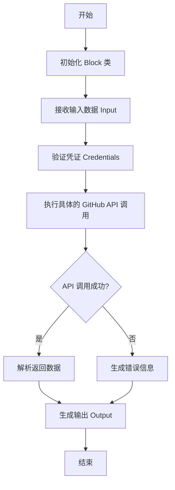

## 类结构

```
Block (外部基类)
├── GithubCommentBlock
├── GithubUpdateCommentBlock
├── GithubListCommentsBlock
├── GithubMakeIssueBlock
├── GithubReadIssueBlock
├── GithubListIssuesBlock
├── GithubAddLabelBlock
├── GithubRemoveLabelBlock
├── GithubAssignIssueBlock
└── GithubUnassignIssueBlock
```

## 全局变量及字段


### `logger`
    
Module-level logger for recording runtime information and errors.

类型：`logging.Logger`
    


### `GithubCommentBlock.Input.credentials`
    
GitHub authentication credentials for repository access.

类型：`GithubCredentialsInput`
    


### `GithubCommentBlock.Input.issue_url`
    
URL of the GitHub issue or pull request.

类型：`str`
    


### `GithubCommentBlock.Input.comment`
    
Comment to post on the issue or pull request.

类型：`str`
    


### `GithubCommentBlock.Output.id`
    
ID of the created comment.

类型：`int`
    


### `GithubCommentBlock.Output.url`
    
URL to the comment on GitHub.

类型：`str`
    


### `GithubCommentBlock.Output.error`
    
Error message if the comment posting failed.

类型：`str`
    


### `GithubUpdateCommentBlock.Input.credentials`
    
GitHub authentication credentials for repository access.

类型：`GithubCredentialsInput`
    


### `GithubUpdateCommentBlock.Input.comment_url`
    
URL of the GitHub comment.

类型：`str`
    


### `GithubUpdateCommentBlock.Input.issue_url`
    
URL of the GitHub issue or pull request.

类型：`str`
    


### `GithubUpdateCommentBlock.Input.comment_id`
    
ID of the GitHub comment.

类型：`str`
    


### `GithubUpdateCommentBlock.Input.comment`
    
Comment to update.

类型：`str`
    


### `GithubUpdateCommentBlock.Output.id`
    
ID of the updated comment.

类型：`int`
    


### `GithubUpdateCommentBlock.Output.url`
    
URL to the comment on GitHub.

类型：`str`
    


### `GithubUpdateCommentBlock.Output.error`
    
Error message if the comment update failed.

类型：`str`
    


### `GithubListCommentsBlock.Input.credentials`
    
GitHub authentication credentials for repository access.

类型：`GithubCredentialsInput`
    


### `GithubListCommentsBlock.Input.issue_url`
    
URL of the GitHub issue or pull request.

类型：`str`
    


### `GithubListCommentsBlock.Output.comment`
    
Comments with their ID, body, user, and URL.

类型：`CommentItem`
    


### `GithubListCommentsBlock.Output.comments`
    
List of comments with their ID, body, user, and URL.

类型：`list[CommentItem]`
    


### `GithubMakeIssueBlock.Input.credentials`
    
GitHub authentication credentials for repository access.

类型：`GithubCredentialsInput`
    


### `GithubMakeIssueBlock.Input.repo_url`
    
URL of the GitHub repository.

类型：`str`
    


### `GithubMakeIssueBlock.Input.title`
    
Title of the issue.

类型：`str`
    


### `GithubMakeIssueBlock.Input.body`
    
Body of the issue.

类型：`str`
    


### `GithubMakeIssueBlock.Output.number`
    
Number of the created issue.

类型：`int`
    


### `GithubMakeIssueBlock.Output.url`
    
URL of the created issue.

类型：`str`
    


### `GithubMakeIssueBlock.Output.error`
    
Error message if the issue creation failed.

类型：`str`
    


### `GithubReadIssueBlock.Input.credentials`
    
GitHub authentication credentials for repository access.

类型：`GithubCredentialsInput`
    


### `GithubReadIssueBlock.Input.issue_url`
    
URL of the GitHub issue.

类型：`str`
    


### `GithubReadIssueBlock.Output.title`
    
Title of the issue.

类型：`str`
    


### `GithubReadIssueBlock.Output.body`
    
Body of the issue.

类型：`str`
    


### `GithubReadIssueBlock.Output.user`
    
User who created the issue.

类型：`str`
    


### `GithubReadIssueBlock.Output.error`
    
Error message if reading the issue failed.

类型：`str`
    


### `GithubListIssuesBlock.Input.credentials`
    
GitHub authentication credentials for repository access.

类型：`GithubCredentialsInput`
    


### `GithubListIssuesBlock.Input.repo_url`
    
URL of the GitHub repository.

类型：`str`
    


### `GithubListIssuesBlock.Output.issue`
    
Issues with their title and URL.

类型：`IssueItem`
    


### `GithubListIssuesBlock.Output.issues`
    
List of issues with their title and URL.

类型：`list[IssueItem]`
    


### `GithubAddLabelBlock.Input.credentials`
    
GitHub authentication credentials for repository access.

类型：`GithubCredentialsInput`
    


### `GithubAddLabelBlock.Input.issue_url`
    
URL of the GitHub issue or pull request.

类型：`str`
    


### `GithubAddLabelBlock.Input.label`
    
Label to add to the issue or pull request.

类型：`str`
    


### `GithubAddLabelBlock.Output.status`
    
Status of the label addition operation.

类型：`str`
    


### `GithubAddLabelBlock.Output.error`
    
Error message if the label addition failed.

类型：`str`
    


### `GithubRemoveLabelBlock.Input.credentials`
    
GitHub authentication credentials for repository access.

类型：`GithubCredentialsInput`
    


### `GithubRemoveLabelBlock.Input.issue_url`
    
URL of the GitHub issue or pull request.

类型：`str`
    


### `GithubRemoveLabelBlock.Input.label`
    
Label to remove from the issue or pull request.

类型：`str`
    


### `GithubRemoveLabelBlock.Output.status`
    
Status of the label removal operation.

类型：`str`
    


### `GithubRemoveLabelBlock.Output.error`
    
Error message if the label removal failed.

类型：`str`
    


### `GithubAssignIssueBlock.Input.credentials`
    
GitHub authentication credentials for repository access.

类型：`GithubCredentialsInput`
    


### `GithubAssignIssueBlock.Input.issue_url`
    
URL of the GitHub issue.

类型：`str`
    


### `GithubAssignIssueBlock.Input.assignee`
    
Username to assign to the issue.

类型：`str`
    


### `GithubAssignIssueBlock.Output.status`
    
Status of the issue assignment operation.

类型：`str`
    


### `GithubAssignIssueBlock.Output.error`
    
Error message if the issue assignment failed.

类型：`str`
    


### `GithubUnassignIssueBlock.Input.credentials`
    
GitHub authentication credentials for repository access.

类型：`GithubCredentialsInput`
    


### `GithubUnassignIssueBlock.Input.issue_url`
    
URL of the GitHub issue.

类型：`str`
    


### `GithubUnassignIssueBlock.Input.assignee`
    
Username to unassign from the issue.

类型：`str`
    


### `GithubUnassignIssueBlock.Output.status`
    
Status of the issue unassignment operation.

类型：`str`
    


### `GithubUnassignIssueBlock.Output.error`
    
Error message if the issue unassignment failed.

类型：`str`
    
    

## 全局函数及方法


### `is_github_url`

判断给定的 URL 字符串是否指向 GitHub 官方网站 (github.com)。

参数：

- `url`: `str`，待检查的 URL 字符串。

返回值：`bool`，如果解析出的域名等于 "github.com" 返回 True，否则返回 False。

#### 流程图

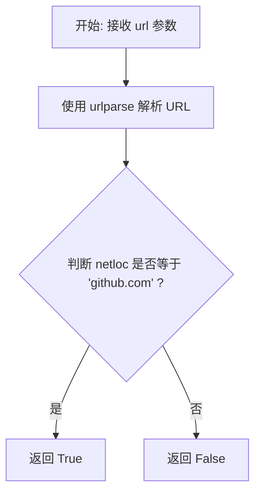

#### 带注释源码

```python
def is_github_url(url: str) -> bool:
    # 使用 urlparse 解析 URL 字符串，提取其中的网络位置部分
    # 例如：将 "https://github.com/owner/repo" 解析为 netloc="github.com"
    parsed_url = urlparse(url)
    
    # 检查提取出的 netloc 是否严格等于 "github.com"
    return parsed_url.netloc == "github.com"
```


### `GithubCommentBlock.__init__`

初始化 `GithubCommentBlock` 类的实例，配置该块的基本元数据（如ID、描述、类别）、输入输出Schema定义以及用于单元测试的测试数据、凭据和模拟行为。

参数：

-  `self`：`GithubCommentBlock`，类的实例本身。

返回值：`None`，该方法没有返回值。

#### 流程图

```mermaid
flowchart TD
    A[开始: __init__] --> B[定义块元数据<br>id, 描述, 类别]
    B --> C[定义模式<br>input_schema, output_schema]
    C --> D[定义测试数据<br>test_input, test_credentials, test_output]
    D --> E[定义测试模拟<br>test_mock]
    E --> F[调用父类初始化<br>super().__init__]
    F --> G[结束]
```

#### 带注释源码

```python
def __init__(self):
    # 调用父类 Block 的初始化方法，配置块的各项属性
    super().__init__(
        # 块的唯一标识符
        id="a8db4d8d-db1c-4a25-a1b0-416a8c33602b",
        # 块的功能描述
        description="A block that posts comments on GitHub issues or pull requests using the GitHub API.",
        # 块所属的分类，此处为开发者工具
        categories={BlockCategory.DEVELOPER_TOOLS},
        # 定义输入数据的 Schema，继承自内部类 Input
        input_schema=GithubCommentBlock.Input,
        # 定义输出数据的 Schema，继承自内部类 Output
        output_schema=GithubCommentBlock.Output,
        # 定义测试用例的输入数据，包含 Issue 和 Pull Request 两种场景
        test_input=[
            {
                "issue_url": "https://github.com/owner/repo/issues/1",
                "comment": "This is a test comment.",
                "credentials": TEST_CREDENTIALS_INPUT,
            },
            {
                "issue_url": "https://github.com/owner/repo/pull/1",
                "comment": "This is a test comment.",
                "credentials": TEST_CREDENTIALS_INPUT,
            },
        ],
        # 定义测试使用的凭据
        test_credentials=TEST_CREDENTIALS,
        # 定义预期的测试输出结果
        test_output=[
            ("id", 1337),
            ("url", "https://github.com/owner/repo/issues/1#issuecomment-1337"),
            ("id", 1337),
            (
                "url",
                "https://github.com/owner/repo/issues/1#issuecomment-1337",
            ),
        ],
        # 定义测试模拟函数，避免在测试时进行真实的 API 调用
        # 模拟 post_comment 方法返回固定的 ID 和 URL
        test_mock={
            "post_comment": lambda *args, **kwargs: (
                1337,
                "https://github.com/owner/repo/issues/1#issuecomment-1337",
            )
        },
    )
```


### `GithubCommentBlock.post_comment`

该方法用于通过 GitHub API 在指定的 GitHub Issue 或 Pull Request 上发布评论，处理了 Pull Request URL 到 Issues API URL 的转换，并返回新建评论的 ID 和 URL。

参数：

-  `credentials`：`GithubCredentials`，用于 GitHub API 认证的凭证对象
-  `issue_url`：`str`，GitHub Issue 或 Pull Request 的 URL 地址
-  `body_text`：`str`，要发布的评论内容文本

返回值：`tuple[int, str]`，包含新建评论的 ID 和评论在 GitHub 上的 HTML URL 的元组

#### 流程图

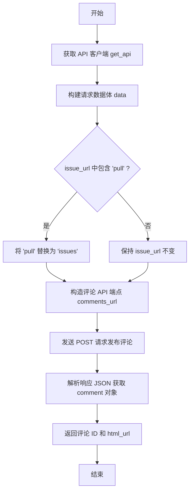

#### 带注释源码

```python
    @staticmethod
    async def post_comment(
        credentials: GithubCredentials, issue_url: str, body_text: str
    ) -> tuple[int, str]:
        # 根据提供的凭证获取 GitHub API 客户端实例
        api = get_api(credentials)
        
        # 准备 POST 请求所需的 JSON 数据，包含评论正文
        data = {"body": body_text}
        
        # 检查 URL 中是否包含 "pull"，因为 GitHub API 对 PR 的评论也是使用 issues 端点
        if "pull" in issue_url:
            # 将 URL 中的 "pull" 替换为 "issues" 以适配 API 调用
            issue_url = issue_url.replace("pull", "issues")
            
        # 拼接完整的评论 API 路径
        comments_url = issue_url + "/comments"
        
        # 异步调用 API 发送 POST 请求提交评论
        response = await api.post(comments_url, json=data)
        
        # 解析返回的 JSON 响应体
        comment = response.json()
        
        # 返回新建评论的 ID 和其对应的 HTML URL
        return comment["id"], comment["html_url"]
```


### `GithubCommentBlock.run`

该方法是 `GithubCommentBlock` 的核心执行入口，负责接收输入数据（包含 GitHub Issue/PR URL 和评论内容）以及认证凭据，通过调用 GitHub API 发送评论请求，并将返回的评论 ID 和 URL 作为生成器输出。

参数：

-   `self`：`GithubCommentBlock`，类实例本身。
-   `input_data`：`GithubCommentBlock.Input`，包含运行时所需的输入数据结构，具体包含 `issue_url`（GitHub issue 或 pull request 的 URL）和 `comment`（要发布的评论内容）。
-   `credentials`：`GithubCredentials`，用于访问 GitHub API 的认证凭据。
-   `**kwargs`：`dict`，接收额外的关键字参数。

返回值：`BlockOutput`，一个生成器（Generator），逐步产出包含所创建评论 ID 和 URL 的键值对。

#### 流程图

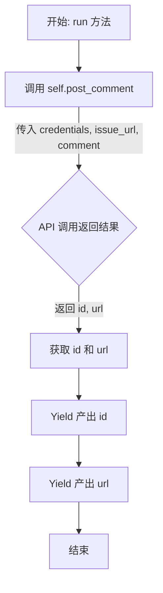

#### 带注释源码

```python
    async def run(
        self,
        input_data: Input,
        *,
        credentials: GithubCredentials,
        **kwargs,
    ) -> BlockOutput:
        # 调用静态方法 post_comment 执行实际的 API 请求
        # 传入凭据、目标 issue/PR 的 URL 以及评论正文
        id, url = await self.post_comment(
            credentials,
            input_data.issue_url,
            input_data.comment,
        )
        # 产出评论的 ID
        yield "id", id
        # 产出评论在 GitHub 上的完整 URL
        yield "url", url
```


### `GithubUpdateCommentBlock.__init__`

该方法用于初始化 `GithubUpdateCommentBlock` 类实例，通过调用父类的初始化方法，设置该功能块的唯一标识符、描述信息、输入输出 Schema（模式）、所属分类以及用于单元测试的模拟数据、测试输入和预期输出。

参数：

-  `self`：`GithubUpdateCommentBlock`，表示类实例本身。

返回值：`None`，无返回值。

#### 流程图

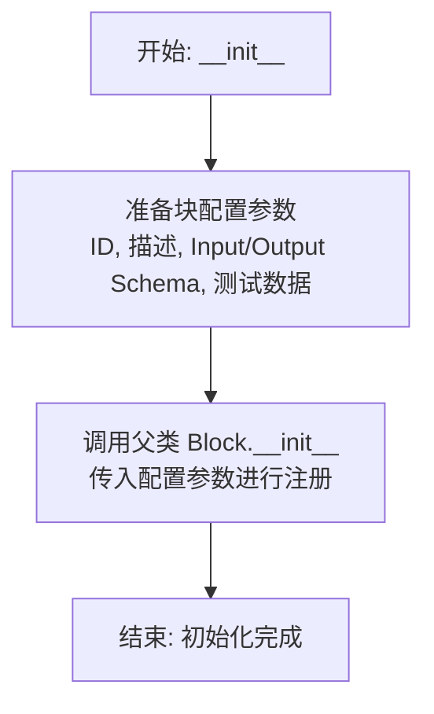

#### 带注释源码

```python
def __init__(self):
    # 调用父类 Block 的初始化方法，注册当前块的基本信息和测试配置
    super().__init__(
        # 块的唯一标识符 (UUID)
        id="b3f4d747-10e3-4e69-8c51-f2be1d99c9a7",
        # 块的功能描述
        description="A block that updates an existing comment on a GitHub issue or pull request.",
        # 块所属的分类
        categories={BlockCategory.DEVELOPER_TOOLS},
        # 定义输入数据的 Schema，继承自类内定义的 Input 类
        input_schema=GithubUpdateCommentBlock.Input,
        # 定义输出数据的 Schema，继承自类内定义的 Output 类
        output_schema=GithubUpdateCommentBlock.Output,
        # 定义测试输入数据，包含评论URL、评论内容和测试凭证
        test_input={
            "comment_url": "https://github.com/owner/repo/issues/1#issuecomment-123456789",
            "comment": "This is an updated comment.",
            "credentials": TEST_CREDENTIALS_INPUT,
        },
        # 指定测试用的凭证对象
        test_credentials=TEST_CREDENTIALS,
        # 定义预期的测试输出结果
        test_output=[
            ("id", 123456789),
            (
                "url",
                "https://github.com/owner/repo/issues/1#issuecomment-123456789",
            ),
        ],
        # 定义测试模拟函数，当运行测试时，替代实际的网络请求 update_comment 方法
        test_mock={
            "update_comment": lambda *args, **kwargs: (
                123456789,
                "https://github.com/owner/repo/issues/1#issuecomment-123456789",
            )
        },
    )
```


### `GithubUpdateCommentBlock.update_comment`

该方法通过 GitHub API 更新 GitHub Issue 或 Pull Request 上的现有评论。它接收认证信息、评论的 URL 以及新的评论内容，构建 API 请求并返回更新后的评论 ID 和 URL。

参数：

- `credentials`：`GithubCredentials`，用于进行 GitHub API 身份验证的凭证对象。
- `comment_url`：`str`，GitHub 评论的 URL，可以是网页端 URL。
- `body_text`：`str`，想要更新为的评论内容。

返回值：`tuple[int, str]`，包含更新后的评论 ID (int) 和评论在 GitHub 上的 HTML URL (str) 的元组。

#### 流程图

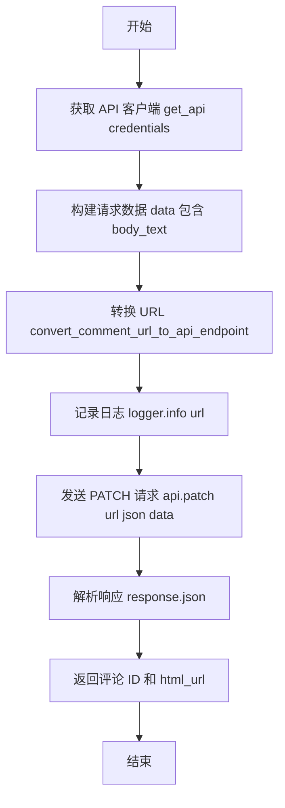

#### 带注释源码

```python
    @staticmethod
    async def update_comment(
        credentials: GithubCredentials, comment_url: str, body_text: str
    ) -> tuple[int, str]:
        # 1. 获取 API 客户端实例，设置 convert_urls=False 以保留传入的 URL 结构
        api = get_api(credentials, convert_urls=False)
        
        # 2. 准备要发送的 JSON 数据，包含评论的正文
        data = {"body": body_text}
        
        # 3. 将 GitHub 评论的网页 URL 转换为 API 调用所需的端点 URL
        url = convert_comment_url_to_api_endpoint(comment_url)

        # 4. 记录即将请求的 API URL 以便调试
        logger.info(url)
        
        # 5. 发送异步 PATCH 请求以更新评论
        response = await api.patch(url, json=data)
        
        # 6. 解析返回的 JSON 数据
        comment = response.json()
        
        # 7. 返回更新后的评论 ID 和 HTML URL
        return comment["id"], comment["html_url"]
```


### `GithubUpdateCommentBlock.run`

该方法是 `GithubUpdateCommentBlock` 的核心执行逻辑，负责处理输入数据，通过 GitHub API 更新指定的评论。它支持直接提供评论 URL 或通过 Issue URL 和评论 ID 组合的方式定位评论。

参数：

-  `input_data`：`Input`，包含评论更新所需的输入数据，如 credentials、comment_url、issue_url、comment_id 和新的评论内容。
-  `credentials`：`GithubCredentials`，用于认证的 GitHub 凭证对象，包含访问 GitHub API 所需的 token。
-  `**kwargs`：`Any`，扩展用的关键字参数，当前未使用。

返回值：`BlockOutput`，一个异步生成器，产出更新后评论的 ID 和 URL。

#### 流程图

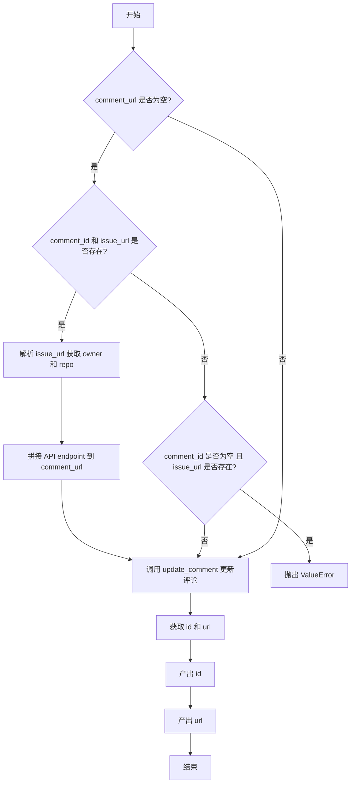

#### 带注释源码

```python
    async def run(
        self,
        input_data: Input,
        *,
        credentials: GithubCredentials,
        **kwargs,
    ) -> BlockOutput:
        # 场景1：如果未提供 comment_url，但提供了 comment_id 和 issue_url
        if (
            not input_data.comment_url
            and input_data.comment_id
            and input_data.issue_url
        ):
            # 解析 issue_url 以获取仓库所有者 (owner) 和仓库名 (repo)
            parsed_url = urlparse(input_data.issue_url)
            path_parts = parsed_url.path.strip("/").split("/")
            owner, repo = path_parts[0], path_parts[1]

            # 手动构建 GitHub API 的评论更新 endpoint
            input_data.comment_url = f"https://api.github.com/repos/{owner}/{repo}/issues/comments/{input_data.comment_id}"

        # 场景2：如果未提供 comment_url 且未提供 comment_id，但提供了 issue_url，则无法确定更新哪个评论
        elif (
            not input_data.comment_url
            and not input_data.comment_id
            and input_data.issue_url
        ):
            raise ValueError(
                "Must provide either comment_url or comment_id and issue_url"
            )
        
        # 调用静态方法 update_comment 执行实际的更新操作
        # 如果 comment_url 已提供，直接使用；否则使用上述逻辑构建的 URL
        id, url = await self.update_comment(
            credentials,
            input_data.comment_url,
            input_data.comment,
        )
        # 产出更新后的评论 ID
        yield "id", id
        # 产出更新后的评论 URL
        yield "url", url
```


### `GithubListCommentsBlock.__init__`

初始化 `GithubListCommentsBlock` 实例，配置块的唯一标识、描述、类别、输入输出模型以及用于单元测试的模拟数据。

参数：

-  `self`：`GithubListCommentsBlock`，类实例自身。

返回值：`None`，无返回值。

#### 流程图

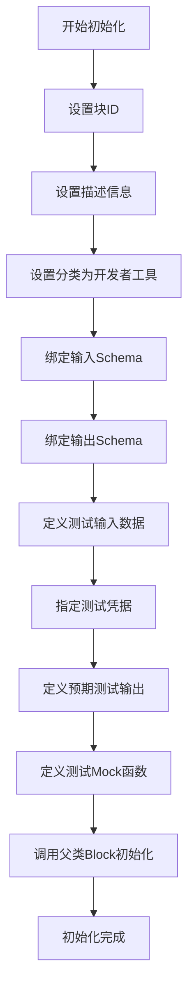

#### 带注释源码

```python
def __init__(self):
    # 调用父类 Block 的初始化方法，传入配置参数
    super().__init__(
        # 块的唯一标识符 (UUID)
        id="c4b5fb63-0005-4a11-b35a-0c2467bd6b59",
        # 块的功能描述：从 GitHub issue 或 PR 获取评论及元数据
        description="A block that retrieves all comments from a GitHub issue or pull request, including comment metadata and content.",
        # 块所属的分类：开发者工具
        categories={BlockCategory.DEVELOPER_TOOLS},
        # 定义输入数据的 Schema，引用内部类 Input
        input_schema=GithubListCommentsBlock.Input,
        # 定义输出数据的 Schema，引用内部类 Output
        output_schema=GithubListCommentsBlock.Output,
        # 定义用于测试的输入数据，包含 issue URL 和测试凭据
        test_input={
            "issue_url": "https://github.com/owner/repo/issues/1",
            "credentials": TEST_CREDENTIALS_INPUT,
        },
        # 指定测试使用的凭据对象
        test_credentials=TEST_CREDENTIALS,
        # 定义预期的测试输出，包含单个评论对象和评论列表
        test_output=[
            (
                "comment",
                {
                    "id": 123456789,
                    "body": "This is a test comment.",
                    "user": "test_user",
                    "url": "https://github.com/owner/repo/issues/1#issuecomment-123456789",
                },
            ),
            (
                "comments",
                [
                    {
                        "id": 123456789,
                        "body": "This is a test comment.",
                        "user": "test_user",
                        "url": "https://github.com/owner/repo/issues/1#issuecomment-123456789",
                    }
                ],
            ),
        ],
        # 定义 Mock 函数，用于在测试中模拟 'list_comments' 方法的行为，避免实际 API 调用
        test_mock={
            "list_comments": lambda *args, **kwargs: [
                {
                    "id": 123456789,
                    "body": "This is a test comment.",
                    "user": "test_user",
                    "url": "https://github.com/owner/repo/issues/1#issuecomment-123456789",
                }
            ]
        },
    )
```


### `GithubListCommentsBlock.list_comments`

该方法负责根据提供的 GitHub issue 或 pull request 的 URL，解析出仓库信息和 issue 编号，构造对应的 GitHub API 请求地址，获取该话题下的所有评论数据，并将其转换为结构化的字典列表返回。

参数：

-  `credentials`：`GithubCredentials`，用于身份验证的 GitHub 凭证对象。
-  `issue_url`：`str`，目标 GitHub issue 或 pull request 的网页 URL。

返回值：`list[Output.CommentItem]`，包含评论详细信息（ID、内容、用户、URL）的字典列表。

#### 流程图

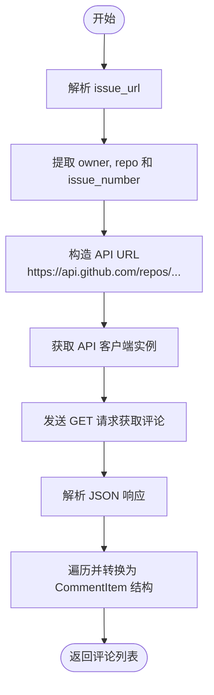

#### 带注释源码

```python
    @staticmethod
    async def list_comments(
        credentials: GithubCredentials, issue_url: str
    ) -> list[Output.CommentItem]:
        # 使用 urlparse 解析输入的 issue_url
        parsed_url = urlparse(issue_url)
        # 去除路径首尾的斜杠并按斜杠分割，获取路径各部分
        # 例如: 'owner/repo/issues/1' -> ['owner', 'repo', 'issues', '1']
        path_parts = parsed_url.path.strip("/").split("/")

        # 路径的第 0 部分通常是仓库所有者
        owner = path_parts[0]
        # 路径的第 1 部分是仓库名称
        repo = path_parts[1]

        # GitHub API 对于 issue 和 pull request 的评论都使用 'issues' 端点
        # 路径的第 3 部分是 issue 或 pull request 的编号
        issue_number = path_parts[3]  # 无论路径是 'issues/123' 还是 'pull/123'

        # 直接构造正确的 API URL
        api_url = f"https://api.github.com/repos/{owner}/{repo}/issues/{issue_number}/comments"

        # 获取 API 客户端，设置 convert_urls=False 因为我们已经提供了完整的 API URL
        api = get_api(credentials, convert_urls=False)
        # 发送异步 GET 请求
        response = await api.get(api_url)
        # 将响应解析为 JSON 对象
        comments = response.json()
        
        # 遍历获取到的评论列表，提取关键字段并构造成内部定义的 CommentItem 格式
        parsed_comments: list[GithubListCommentsBlock.Output.CommentItem] = [
            {
                "id": comment["id"],          # 评论 ID
                "body": comment["body"],      # 评论内容
                "user": comment["user"]["login"], # 评论者用户名
                "url": comment["html_url"],   # 评论的网页 URL
            }
            for comment in comments
        ]
        # 返回处理后的评论列表
        return parsed_comments
```


### `GithubListCommentsBlock.run`

该方法是 `GithubListCommentsBlock` 的核心执行入口，负责处理输入数据，调用 GitHub API 获取指定 Issue 或 Pull Request 的所有评论，并通过生成器逐个产出评论详情以及完整的评论列表。

参数：

- `input_data`：`GithubListCommentsBlock.Input`，包含运行所需的输入数据，如 `issue_url`。
- `credentials`：`GithubCredentials`，用于访问 GitHub API 的认证凭据。
- `**kwargs`：`dict`，接收任意额外的关键字参数。

返回值：`BlockOutput`，一个异步生成器，产出包含评论数据的键值对元组。

#### 流程图

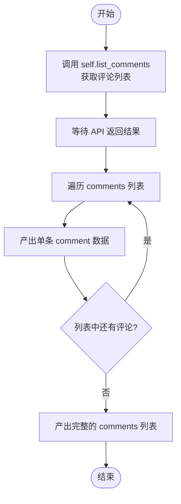

#### 带注释源码

```python
    async def run(
        self,
        input_data: Input,
        *,
        credentials: GithubCredentials,
        **kwargs,
    ) -> BlockOutput:
        # 调用静态方法 list_comments，传入凭据和 Issue URL，异步获取评论列表
        comments = await self.list_comments(
            credentials,
            input_data.issue_url,
        )
        # 遍历获取到的每一条评论
        for comment in comments:
            # 产出单条评论数据，键名为 "comment"
            yield "comment", comment
        # 产出所有评论的列表数据，键名为 "comments"
        yield "comments", comments
```


### `GithubMakeIssueBlock.__init__`

该方法用于初始化 `GithubMakeIssueBlock` 类的实例，通过调用父类 `Block` 的构造函数配置块的基本属性，包括唯一标识符、描述、分类、输入输出 Schema 以及用于测试的输入、输出和 Mock 数据。

参数：

-  `self`：`GithubMakeIssueBlock`，类的实例本身。

返回值：`None`，无返回值。

#### 流程图

```mermaid
flowchart TD
    Start([开始]) --> CallSuper[调用父类 Block.__init__ 初始化]
    CallSuper --> SetConfig[设置块配置参数]
    SetConfig --> SetID[设置 ID: 691dad47-f494-44c3-a1e8-05b7990f2dab]
    SetConfig --> SetDesc[设置 Description: Creates new issues on GitHub]
    SetConfig --> SetCat[设置 Category: DEVELOPER_TOOLS]
    SetConfig --> SetInputSchema[设置 Input Schema: GithubMakeIssueBlock.Input]
    SetConfig --> SetOutputSchema[设置 Output Schema: GithubMakeIssueBlock.Output]
    SetConfig --> SetTestData[设置测试数据<br/>(Test Input, Credentials, Output)]
    SetConfig --> SetMock[设置 Mock: create_issue]
    SetTestData --> End([结束])
```

#### 带注释源码

```python
def __init__(self):
    # 调用父类 Block 的构造函数，传入定义好的块属性和配置
    super().__init__(
        # 块的唯一标识符
        id="691dad47-f494-44c3-a1e8-05b7990f2dab",
        # 块的功能描述，用于UI展示
        description="A block that creates new issues on GitHub repositories with a title and body content.",
        # 块所属的分类，归类为开发者工具
        categories={BlockCategory.DEVELOPER_TOOLS},
        # 指定输入数据的结构定义，使用内部类 Input
        input_schema=GithubMakeIssueBlock.Input,
        # 指定输出数据的结构定义，使用内部类 Output
        output_schema=GithubMakeIssueBlock.Output,
        # 定义测试用例所需的输入数据
        test_input={
            "repo_url": "https://github.com/owner/repo",
            "title": "Test Issue",
            "body": "This is a test issue.",
            "credentials": TEST_CREDENTIALS_INPUT,
        },
        # 定义测试用例所需的认证凭证
        test_credentials=TEST_CREDENTIALS,
        # 定义期望的测试输出结果（模拟成功创建 Issue 后返回的数据）
        test_output=[
            ("number", 1),
            ("url", "https://github.com/owner/repo/issues/1"),
        ],
        # 定义 Mock 方法，用于在测试环境中替代真实的 API 调用
        # 这里 Mock 了 'create_issue' 方法，使其返回固定的 Issue ID 和 URL
        test_mock={
            "create_issue": lambda *args, **kwargs: (
                1,
                "https://github.com/owner/repo/issues/1",
            )
        },
    )
```


### `GithubMakeIssueBlock.create_issue`

该方法是一个异步静态方法，用于通过 GitHub API 在指定的仓库中创建一个新的 Issue，并返回创建成功的 Issue 编号和 URL。

参数：

-  `credentials`：`GithubCredentials`，GitHub 认证凭据，用于 API 访问授权
-  `repo_url`：`str`，目标 GitHub 仓库的 URL
-  `title`：`str`，要创建的 Issue 的标题
-  `body`：`str`，要创建的 Issue 的正文内容

返回值：`tuple[int, str]`，包含两个元素的元组，第一个元素是创建的 Issue 编号（int），第二个元素是 Issue 的 URL（str）。

#### 流程图

```mermaid
graph TD
    A[开始] --> B[调用 get_api 初始化 API 客户端]
    B --> C[构造请求数据 data 包含 title 和 body]
    C --> D[拼接目标地址 issues_url = repo_url + '/issues']
    D --> E[发送异步 POST 请求]
    E --> F[解析响应 JSON 数据]
    F --> G[提取 issue['number'] 和 issue['html_url']]
    G --> H[返回 number, url 元组]
```

#### 带注释源码

```python
    @staticmethod
    async def create_issue(
        credentials: GithubCredentials, repo_url: str, title: str, body: str
    ) -> tuple[int, str]:
        # 1. 获取 GitHub API 客户端实例
        api = get_api(credentials)
        
        # 2. 准备 POST 请求的数据体，包含 Issue 的标题和正文
        data = {"title": title, "body": body}
        
        # 3. 构建创建 Issue 的 API 接口地址
        # 将仓库 URL（如 https://github.com/owner/repo）转换为 API 端点
        issues_url = repo_url + "/issues"
        
        # 4. 发送异步 POST 请求创建 Issue
        response = await api.post(issues_url, json=data)
        
        # 5. 解析返回的 JSON 数据
        issue = response.json()
        
        # 6. 返回 Issue 的编号和 HTML URL
        return issue["number"], issue["html_url"]
```


### `GithubMakeIssueBlock.run`

该方法是 `GithubMakeIssueBlock` 的核心执行逻辑，负责协调输入数据与 GitHub API 交互以创建新的 Issue。它接收仓库地址、标题和正文内容，通过内部辅助方法 `create_issue` 调用 GitHub API，最终异步生成并返回新创建 Issue 的编号和 URL。

参数：

-   `input_data`：`GithubMakeIssueBlock.Input`，包含创建 Issue 所需的输入数据，具体字段包括 `repo_url`（仓库地址）、`title`（标题）和 `body`（正文）。
-   `credentials`：`GithubCredentials`，用于身份验证的 GitHub 凭证对象，包含访问仓库所需的 Token 等信息。
-   `**kwargs`：`dict`，扩展的关键字参数，通常由框架传递，当前方法未直接使用。

返回值：`BlockOutput`，一个异步生成器，按顺序产生包含 Issue 编号（`number`）和 Issue URL（`url`）的键值对。

#### 流程图

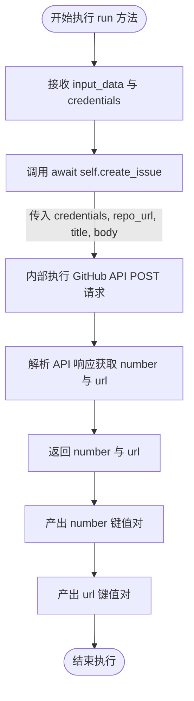

#### 带注释源码

```python
    async def run(
        self,
        input_data: Input,
        *,
        credentials: GithubCredentials,
        **kwargs,
    ) -> BlockOutput:
        # 调用静态辅助方法 create_issue，传入凭证和从 input_data 中提取的仓库地址、标题及正文
        # 该方法负责处理具体的 API 调用逻辑
        number, url = await self.create_issue(
            credentials,
            input_data.repo_url,
            input_data.title,
            input_data.body,
        )
        # 产出创建成功的 Issue 编号
        yield "number", number
        # 产出创建成功的 Issue 访问 URL
        yield "url", url
```


### `GithubReadIssueBlock.__init__`

`GithubReadIssueBlock` 类的构造函数，负责初始化该块的基本元数据、输入输出模式定义以及用于测试的模拟数据和配置。

参数：

- `self`：`GithubReadIssueBlock`，类实例自身，在 Python 中作为构造函数的第一个隐式参数传递。

返回值：`None`，构造函数不返回任何值。

#### 流程图

```mermaid
flowchart TD
    A[Start: __init__] --> B[Call super().__init__]
    B --> C[Set Block ID]
    C --> D[Set Block Description]
    D --> E[Set Block Category to DEVELOPER_TOOLS]
    E --> F[Assign Input Schema]
    F --> G[Assign Output Schema]
    G --> H[Configure Test Input Data]
    H --> I[Configure Test Credentials]
    I --> J[Define Expected Test Output]
    J --> K[Configure Test Mock for read_issue]
    K --> L[End: Initialization Complete]
```

#### 带注释源码

```python
def __init__(self):
    # 调用父类 Block 的初始化方法，传递配置参数
    super().__init__(
        # 定义该块的唯一标识符 UUID
        id="6443c75d-032a-4772-9c08-230c707c8acc",
        # 定义该块的描述，说明其功能是获取 GitHub Issue 的信息
        description="A block that retrieves information about a specific GitHub issue, including its title, body content, and creator.",
        # 定义该块的所属分类为开发者工具
        categories={BlockCategory.DEVELOPER_TOOLS},
        # 指定输入数据的结构模式，包含凭证和 Issue URL
        input_schema=GithubReadIssueBlock.Input,
        # 指定输出数据的结构模式，包含标题、正文和创建者
        output_schema=GithubReadIssueBlock.Output,
        # 配置测试用的输入数据样例
        test_input={
            "issue_url": "https://github.com/owner/repo/issues/1",
            "credentials": TEST_CREDENTIALS_INPUT,
        },
        # 配置测试用的凭证对象
        test_credentials=TEST_CREDENTIALS,
        # 配置期望的测试输出结果流
        test_output=[
            ("title", "Title of the issue"),
            ("body", "This is the body of the issue."),
            ("user", "username"),
        ],
        # 配置测试时的 Mock 函数，模拟 API 调用返回数据，避免实际网络请求
        test_mock={
            "read_issue": lambda *args, **kwargs: (
                "Title of the issue",
                "This is the body of the issue.",
                "username",
            )
        },
    )
```


### `GithubReadIssueBlock.read_issue`

该函数通过 GitHub API 获取指定 URL 的 Issue 详情，并提取其标题、正文内容以及创建者的用户名。

参数：

- `credentials`：`GithubCredentials`，GitHub API 认证凭据，用于授权访问。
- `issue_url`：`str`，GitHub Issue 的 URL 地址。

返回值：`tuple[str, str, str]`，包含三个字符串元素的元组，分别代表 Issue 的标题、正文内容和创建者用户名。

#### 流程图

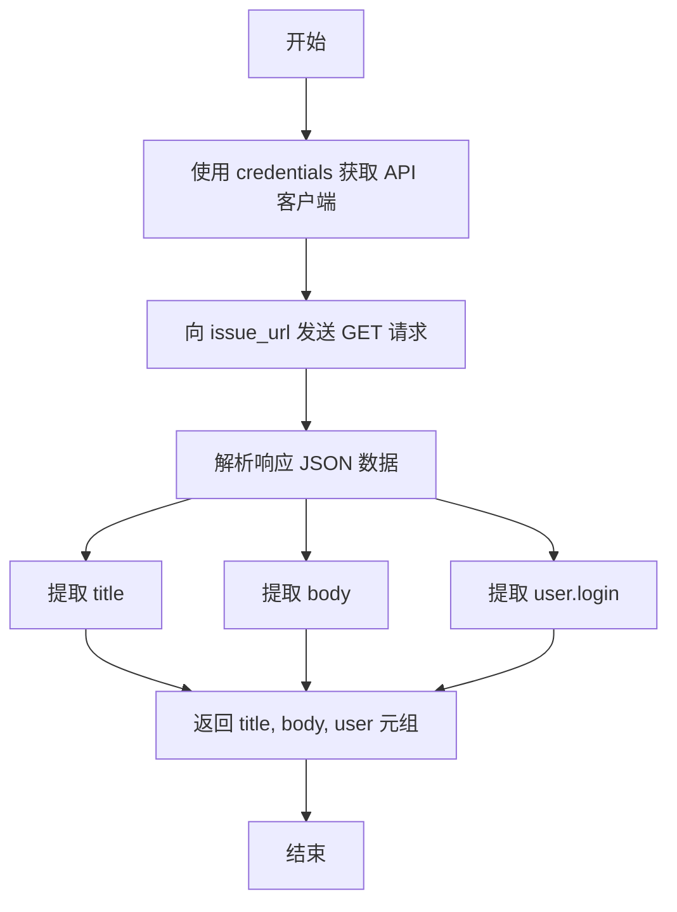

#### 带注释源码

```python
    @staticmethod
    async def read_issue(
        credentials: GithubCredentials, issue_url: str
    ) -> tuple[str, str, str]:
        # 根据提供的凭据获取 API 客户端实例
        api = get_api(credentials)
        # 异步发送 GET 请求获取 Issue 数据
        response = await api.get(issue_url)
        # 将响应内容解析为 JSON 格式
        data = response.json()
        # 从数据中获取标题，若不存在则使用默认值
        title = data.get("title", "No title found")
        # 从数据中获取正文，若不存在则使用默认值
        body = data.get("body", "No body content found")
        # 从嵌套的 user 对象中获取登录用户名，若不存在则使用默认值
        user = data.get("user", {}).get("login", "No user found")
        # 返回包含标题、正文和用户的元组
        return title, body, user
```


### `GithubReadIssueBlock.run`

该方法是 `GithubReadIssueBlock` 的核心执行逻辑，负责通过提供的凭据读取指定 GitHub Issue 的详细信息，并将 Issue 的标题、正文和创建者信息作为输出流式返回。

参数：

-   `input_data`：`GithubReadIssueBlock.Input`，包含输入数据的对象，主要字段为 `issue_url`（GitHub Issue 的 URL）。
-   `credentials`：`GithubCredentials`，用于进行 GitHub API 身份验证的凭据对象。
-   `**kwargs`：`Any`，其他可选的关键字参数。

返回值：`BlockOutput`，一个异步生成器，逐个产出包含字段名（如 "title", "body", "user"）和对应值的元组。

#### 流程图

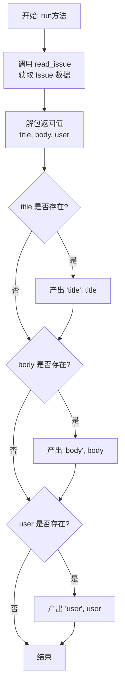

#### 带注释源码

```python
    async def run(
        self,
        input_data: Input,
        *,
        credentials: GithubCredentials,
        **kwargs,
    ) -> BlockOutput:
        # 调用静态方法 read_issue 异步获取 GitHub Issue 数据
        # 传入凭据和输入数据中的 Issue URL
        title, body, user = await self.read_issue(
            credentials,
            input_data.issue_url,
        )
        
        # 如果获取到的 title 不为空，则产出字段 "id" 和对应的 title
        if title:
            yield "title", title
        
        # 如果获取到的 body 不为空，则产出字段 "body" 和对应的 body
        if body:
            yield "body", body
        
        # 如果获取到的 user 不为空，则产出字段 "user" 和对应的 user
        if user:
            yield "user", user
```


### `GithubListIssuesBlock.__init__`

初始化 `GithubListIssuesBlock` 实例，配置其元数据（如 ID、描述）、输入输出 Schema 以及用于单元测试的模拟数据和预期输出。

参数：

-  `self`：`GithubListIssuesBlock`，表示类的实例本身。

返回值：`None`，初始化方法不返回任何值。

#### 流程图

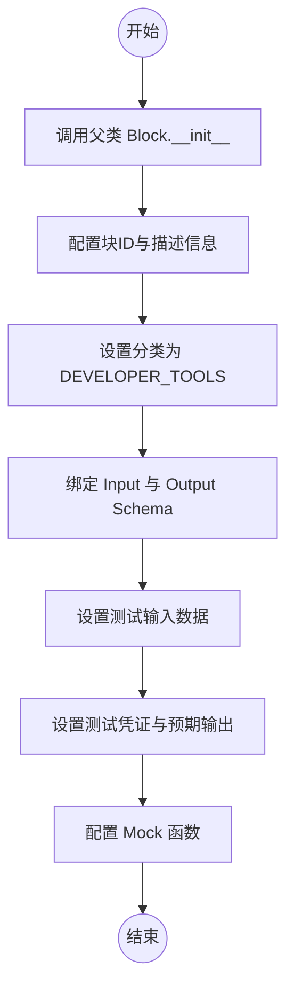

#### 带注释源码

```python
def __init__(self):
    # 调用父类 Block 的初始化方法，配置块的基本属性和行为
    super().__init__(
        # 块的唯一标识符
        id="c215bfd7-0e57-4573-8f8c-f7d4963dcd74",
        # 块的功能描述：从GitHub仓库检索包含标题和URL的issue列表
        description="A block that retrieves a list of issues from a GitHub repository with their titles and URLs.",
        # 块所属的分类：开发者工具
        categories={BlockCategory.DEVELOPER_TOOLS},
        # 定义输入数据的Schema，包含凭证和仓库URL
        input_schema=GithubListIssuesBlock.Input,
        # 定义输出数据的Schema，包含单个issue和issue列表
        output_schema=GithubListIssuesBlock.Output,
        # 定义用于测试的输入参数模拟数据
        test_input={
            "repo_url": "https://github.com/owner/repo",
            "credentials": TEST_CREDENTIALS_INPUT,
        },
        # 定义用于测试的凭证
        test_credentials=TEST_CREDENTIALS,
        # 定义预期的测试输出结果（列表项和单个项）
        test_output=[
            (
                "issues",
                [
                    {
                        "title": "Issue 1",
                        "url": "https://github.com/owner/repo/issues/1",
                    }
                ],
            ),
            (
                "issue",
                {
                    "title": "Issue 1",
                    "url": "https://github.com/owner/repo/issues/1",
                },
            ),
        ],
        # 定义测试时的Mock函数，模拟API返回数据
        test_mock={
            "list_issues": lambda *args, **kwargs: [
                {
                    "title": "Issue 1",
                    "url": "https://github.com/owner/repo/issues/1",
                }
            ]
        },
    )
```


### `GithubListIssuesBlock.list_issues`

该方法用于从指定的GitHub仓库中获取Issues列表。它通过构造API请求端点，利用提供的凭证访问GitHub API，获取原始数据后，将其解析并精简为仅包含标题和URL的对象列表返回。

参数：

-  `credentials`：`GithubCredentials`，用于身份验证的GitHub凭证对象，包含访问仓库所需的令牌。
-  `repo_url`：`str`，GitHub仓库的URL地址，例如 `https://github.com/owner/repo`。

返回值：`list[Output.IssueItem]`，一个字典列表，其中每个字典包含仓库中单个Issue的标题（`title`）和URL（`url`）。

#### 流程图

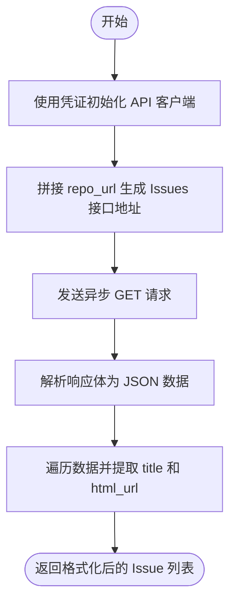

#### 带注释源码

```python
    @staticmethod
    async def list_issues(
        credentials: GithubCredentials, repo_url: str
    ) -> list[Output.IssueItem]:
        # 1. 使用提供的凭证获取API客户端实例
        api = get_api(credentials)
        
        # 2. 在仓库URL后追加"/issues"以构建完整的API请求路径
        issues_url = repo_url + "/issues"
        
        # 3. 发送异步GET请求获取Issues数据
        response = await api.get(issues_url)
        
        # 4. 将响应内容解析为JSON格式
        data = response.json()
        
        # 5. 遍历获取到的数据列表，提取每个Issue的标题和HTML URL，构建简化的字典列表
        issues: list[GithubListIssuesBlock.Output.IssueItem] = [
            {"title": issue["title"], "url": issue["html_url"]} for issue in data
        ]
        
        # 6. 返回处理后的Issue列表
        return issues
```


### `GithubListIssuesBlock.run`

此方法负责执行获取 GitHub 仓库 Issue 列表的主要逻辑，它通过调用内部静态方法获取数据，并将结果以列表和单个对象的形式产出。

参数：

- `input_data`：`Input`，包含输入数据的对象，主要是仓库的 URL (`repo_url`)。
- `credentials`：`GithubCredentials`，GitHub 认证凭据对象，用于授权访问 GitHub API。
- `**kwargs`：`dict`，接收其他额外的关键字参数。

返回值：`BlockOutput`，一个异步生成器，产出包含 Issue 列表的数据以及逐个产出的单个 Issue 对象。

#### 流程图

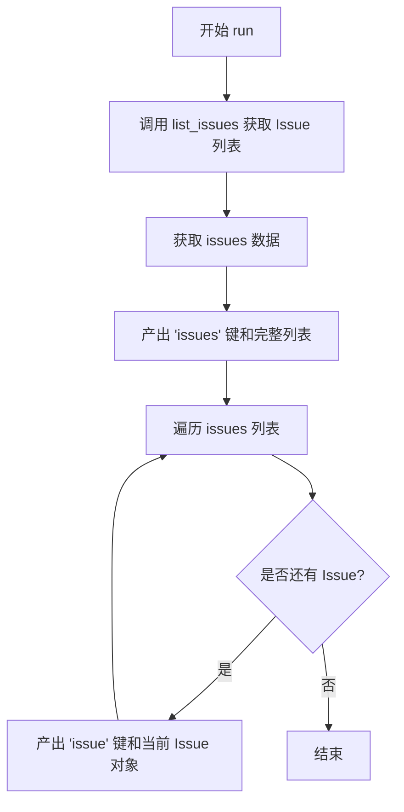

#### 带注释源码

```python
async def run(
    self,
    input_data: Input,
    *,
    credentials: GithubCredentials,
    **kwargs,
) -> BlockOutput:
    # 调用静态方法 list_issues，传入凭据和仓库 URL，异步获取 Issue 列表
    issues = await self.list_issues(
        credentials,
        input_data.repo_url,
    )
    # 产出 'issues' 字段，值为完整的 Issue 列表
    yield "issues", issues
    # 遍历获取到的 Issue 列表
    for issue in issues:
        # 逐个产出 'issue' 字段，值为单个 Issue 对象
        yield "issue", issue
```


### `GithubAddLabelBlock.__init__`

该方法用于初始化 `GithubAddLabelBlock` 实例，通过配置其唯一标识符、功能描述、所属分类、输入输出模式以及测试相关的配置（如测试输入、模拟输出和模拟函数），将其注册为一个可执行的开发工具类块。

参数：

-  `self`：`GithubAddLabelBlock`，表示类的实例本身。

返回值：`None`，初始化方法不返回任何值。

#### 流程图

```mermaid
flowchart TD
    Start([开始]) --> InitParent[调用父类 Block.__init__]
    InitParent --> Config[配置块元数据]
    Config --> SetID[设置 ID: 98bd6b77...]
    Config --> SetDesc[设置 Description]
    Config --> SetCat[设置 Category: DEVELOPER_TOOLS]
    Config --> SetIO[设置 Input/Output Schema]
    Config --> SetTest[设置 Test Config]
    SetTest --> End([结束])
```

#### 带注释源码

```python
    def __init__(self):
        # 调用父类 Block 的初始化方法，配置块的基本属性和元数据
        super().__init__(
            # 块的唯一标识符 UUID
            id="98bd6b77-9506-43d5-b669-6b9733c4b1f1",
            # 块的描述，说明其功能是为 GitHub issue 或 PR 添加标签
            description="A block that adds a label to a GitHub issue or pull request for categorization and organization.",
            # 块所属的分类，这里归为开发者工具
            categories={BlockCategory.DEVELOPER_TOOLS},
            # 指定输入数据的 Schema 定义，包含 credentials, issue_url, label
            input_schema=GithubAddLabelBlock.Input,
            # 指定输出数据的 Schema 定义，包含 status, error
            output_schema=GithubAddLabelBlock.Output,
            # 定义单元测试或示例中使用的输入数据
            test_input={
                "issue_url": "https://github.com/owner/repo/issues/1",
                "label": "bug",
                "credentials": TEST_CREDENTIALS_INPUT,
            },
            # 定义测试时使用的凭证对象
            test_credentials=TEST_CREDENTIALS,
            # 定义预期的测试输出结果
            test_output=[("status", "Label added successfully")],
            # 定义测试模拟行为，当调用 add_label 时返回预设的成功消息，避免实际调用 API
            test_mock={"add_label": lambda *args, **kwargs: "Label added successfully"},
        )
```


### `GithubAddLabelBlock.add_label`

该方法是 `GithubAddLabelBlock` 类中的一个静态异步方法，用于通过 GitHub API 向指定的 issue 或 pull request 添加标签。

参数：

- `credentials`: `GithubCredentials`，用于 GitHub API 身份验证的凭证对象。
- `issue_url`: `str`，GitHub issue 或 pull request 的 URL 地址。
- `label`: `str`，需要添加到 issue 或 pull request 的标签名称。

返回值：`str`，表示操作状态的信息（成功时返回 "Label added successfully"）。

#### 流程图

```mermaid
graph TD
    A[开始: add_label] --> B[获取 API 客户端实例<br/>get_api(credentials)]
    B --> C[构建请求载荷 data<br/>{'labels': [label]}]
    C --> D[构建标签接口 URL<br/>labels_url = issue_url + '/labels']
    D --> E[发送 POST 请求<br/>await api.post(labels_url, json=data)]
    E --> F[返回成功状态字符串<br/>Label added successfully]
```

#### 带注释源码

```python
    @staticmethod
    async def add_label(
        credentials: GithubCredentials, issue_url: str, label: str
    ) -> str:
        # 使用提供的凭证获取 API 客户端实例
        api = get_api(credentials)
        
        # 准备要发送的数据，将标签放入列表中
        data = {"labels": [label]}
        
        # 构建用于添加标签的完整 API URL
        labels_url = issue_url + "/labels"
        
        # 异步发送 POST 请求，将标签添加到指定的 issue 或 PR
        await api.post(labels_url, json=data)
        
        # 返回操作成功的状态消息
        return "Label added successfully"
```


### `GithubAddLabelBlock.run`

该方法是 `GithubAddLabelBlock` 的核心执行函数，负责协调整个向 GitHub Issue 或 Pull Request 添加标签的流程。它接收包含目标 URL 和标签内容的输入数据以及认证凭据，调用底层 API 方法执行添加操作，并以生成器的形式返回执行状态。

参数：

- `input_data`：`GithubAddLabelBlock.Input`，包含运行所需的输入数据，具体包含 GitHub Issue 或 PR 的 URL (`issue_url`) 和要添加的标签文本 (`label`)。
- `credentials`：`GithubCredentials`，用于进行 GitHub API 身份验证的凭据对象。
- `**kwargs`：`dict`，扩展用的关键字参数，通常用于传递额外的上下文信息（本流程中未显式使用）。

返回值：`BlockOutput`，一个异步生成器，产生包含输出字段名称和值的元组。在此方法中，主要产生一个元组，键为 "status"，值为操作结果的描述字符串。

#### 流程图

```mermaid
flowchart TD
    A[开始: run 方法被调用] --> B[提取 input_data 中的 issue_url 和 label]
    B --> C[调用 self.add_label 方法]
    C --> D[传入 credentials, issue_url, label]
    D --> E[等待 API 响应并获取 status 字符串]
    E --> F[生成元组: 'status', status]
    F --> G[结束]
```

#### 带注释源码

```python
    async def run(
        self,
        input_data: Input,
        *,
        credentials: GithubCredentials,
        **kwargs,
    ) -> BlockOutput:
        # 调用静态方法 add_label 执行实际的 API 请求
        # 传入认证凭据、目标 issue/PR 的 URL 和要添加的标签名
        status = await self.add_label(
            credentials,
            input_data.issue_url,
            input_data.label,
        )
        # 将执行状态作为 "status" 字段输出
        yield "status", status
```


### `GithubRemoveLabelBlock.__init__`

初始化 `GithubRemoveLabelBlock` 实例，配置其唯一标识符、描述、类别、输入输出 Schema 以及测试相关的配置数据（如测试输入、输出、凭证和模拟函数）。

参数：

- `self`：`GithubRemoveLabelBlock`，类的实例自身。

返回值：`None`，无返回值。

#### 流程图

```mermaid
flowchart TD
    Start([开始]) --> CallSuper[调用父类 Block.__init__]
    CallSuper --> SetID[设置块唯一ID: 78f050c5...]
    SetID --> SetDesc[设置描述: Removes a label...]
    SetDesc --> SetCat[设置分类: DEVELOPER_TOOLS]
    SetCat --> SetSchema[设置输入/输出 Schema]
    SetSchema --> SetTest[设置测试输入、凭证、输出及 Mock]
    SetTest --> End([结束])
```

#### 带注释源码

```python
def __init__(self):
    # 调用父类 Block 的初始化方法，配置块的基本元数据和测试配置
    super().__init__(
        # 块的唯一标识符
        id="78f050c5-3e3a-48c0-9e5b-ef1ceca5589c",
        # 块的功能描述
        description="A block that removes a label from a GitHub issue or pull request.",
        # 块所属的分类，此处为开发者工具
        categories={BlockCategory.DEVELOPER_TOOLS},
        # 定义块的输入数据结构 Schema
        input_schema=GithubRemoveLabelBlock.Input,
        # 定义块的输出数据结构 Schema
        output_schema=GithubRemoveLabelBlock.Output,
        # 定义用于测试的输入数据样例
        test_input={
            "issue_url": "https://github.com/owner/repo/issues/1",
            "label": "bug",
            "credentials": TEST_CREDENTIALS_INPUT,
        },
        # 定义用于测试的凭证
        test_credentials=TEST_CREDENTIALS,
        # 定义期望的测试输出结果
        test_output=[("status", "Label removed successfully")],
        # 定义测试时的模拟行为，这里模拟 remove_label 方法直接返回成功字符串
        test_mock={
            "remove_label": lambda *args, **kwargs: "Label removed successfully"
        },
    )
```


### `GithubRemoveLabelBlock.remove_label`

该方法通过调用 GitHub API，从指定的 GitHub issue 或 pull request 中移除一个特定的标签。

参数：

-  `credentials`：`GithubCredentials`，用于身份验证的 GitHub 凭据对象，包含访问令牌等信息。
-  `issue_url`：`str`，GitHub issue 或 pull request 的 URL。
-  `label`：`str`，需要从 issue 或 pull request 中移除的标签名称。

返回值：`str`，操作执行后返回的状态描述字符串（例如 "Label removed successfully"）。

#### 流程图

```mermaid
flowchart TD
    Start([开始]) --> GetAPI[根据 credentials 获取 API 客户端]
    GetAPI --> BuildURL[拼接特定标签的 API 端点 URL]
    BuildURL --> DeleteReq[向 URL 发送异步 DELETE 请求]
    DeleteReq --> ReturnMsg[返回成功状态字符串]
    ReturnMsg --> End([结束])
```

#### 带注释源码

```python
    @staticmethod
    async def remove_label(
        credentials: GithubCredentials, issue_url: str, label: str
    ) -> str:
        # 获取配置好的 GitHub API 客户端实例
        api = get_api(credentials)
        
        # 构建删除特定标签的 API URL
        # GitHub API 路径格式通常为: {issue_url}/labels/{label_name}
        label_url = issue_url + f"/labels/{label}"
        
        # 异步调用 API 的 delete 方法删除标签
        await api.delete(label_url)
        
        # 返回操作成功的消息字符串
        return "Label removed successfully"
```


### `GithubRemoveLabelBlock.run`

该方法是 `GithubRemoveLabelBlock` 的核心执行函数，负责协调输入参数、调用底层的 GitHub API 逻辑来从指定的 Issue 或 Pull Request 中移除标签，并异步生成执行结果的状态信息。

参数：

- `input_data`：`GithubRemoveLabelBlock.Input`，包含目标 GitHub Issue 或 Pull Request 的 URL (`issue_url`) 以及需要移除的标签名称 (`label`) 的输入数据对象。
- `credentials`：`GithubCredentials`，用于身份验证的 GitHub 凭证对象，包含访问 GitHub API 所需的 Token。
- `**kwargs`：`typing.Any`，其他扩展的关键字参数，用于传递额外的上下文信息（当前逻辑中未使用）。

返回值：`BlockOutput`，一个异步生成器，产出包含操作状态（如 `"status"`）的键值对元组。

#### 流程图

```mermaid
flowchart TD
    A[开始: GithubRemoveLabelBlock.run] --> B[接收 input_data 和 credentials]
    B --> C[调用 self.remove_label 方法]
    C --> D[获取 GitHub API 实例]
    D --> E[拼接删除标签的 API URL<br>issue_url + /labels/{label}]
    E --> F[发送异步 DELETE 请求]
    F --> G{请求是否成功?}
    G -- 是 --> H[返回成功状态字符串]
    G -- 否 --> I[抛出异常或返回错误信息]
    H --> J[生成输出: status, 状态字符串]
    J --> K[结束]
```

#### 带注释源码

```python
    async def run(
        self,
        input_data: Input,
        *,
        credentials: GithubCredentials,
        **kwargs,
    ) -> BlockOutput:
        # 调用静态方法 remove_label 执行实际的删除操作
        # 传入 credentials, issue_url 和 label
        status = await self.remove_label(
            credentials,
            input_data.issue_url,
            input_data.label,
        )
        # 产出操作结果，key 为 "status"，value 为操作返回的状态描述
        yield "status", status
```


### `GithubAssignIssueBlock.__init__`

初始化 `GithubAssignIssueBlock` 实例，配置块的元数据、输入输出 Schema 以及用于单元测试的模拟数据和预期结果。

参数：

-   `self`：`GithubAssignIssueBlock`，类的实例本身

返回值：`None`，无返回值

#### 流程图

```mermaid
graph TD
    Start([开始]) --> DefineConfig[定义块静态配置信息<br/>ID, 描述, 分类等]
    DefineConfig --> SetSchemas[设置输入与输出 Schema]
    SetSchemas --> SetTestData[配置测试数据与 Mock 函数]
    SetTestData --> CallSuper[调用父类 Block.__init__ 初始化]
    CallSuper --> End([结束])
```

#### 带注释源码

```python
def __init__(self):
    super().__init__(
        # 块的唯一标识符 (UUID)
        id="90507c72-b0ff-413a-886a-23bbbd66f542",
        # 块的功能描述：将 GitHub 用户指派给 Issue
        description="A block that assigns a GitHub user to an issue for task ownership and tracking.",
        # 块所属的分类：开发者工具
        categories={BlockCategory.DEVELOPER_TOOLS},
        # 定义块的输入 Schema，包含凭证、Issue URL 和被指派人
        input_schema=GithubAssignIssueBlock.Input,
        # 定义块的输出 Schema，包含操作状态和错误信息
        output_schema=GithubAssignIssueBlock.Output,
        # 定义测试输入参数，模拟 Issue URL、用户名和测试凭证
        test_input={
            "issue_url": "https://github.com/owner/repo/issues/1",
            "assignee": "username1",
            "credentials": TEST_CREDENTIALS_INPUT,
        },
        # 定义测试环境使用的凭证
        test_credentials=TEST_CREDENTIALS,
        # 定义预期的测试输出结果
        test_output=[("status", "Issue assigned successfully")],
        # 定义测试模拟函数，用于在测试中拦截真实的 API 调用
        test_mock={
            "assign_issue": lambda *args, **kwargs: "Issue assigned successfully"
        },
    )
```


### `GithubAssignIssueBlock.assign_issue`

该方法负责将指定的 GitHub 用户指派给特定的 Issue。它利用提供的凭证初始化 API 客户端，构建目标 Issue 的指派接口 URL，并通过发送 POST 请求来完成用户指派操作。

参数：

- `credentials`：`GithubCredentials`，用于访问 GitHub API 的认证凭证。
- `issue_url`：`str`，目标 GitHub Issue 的 URL 地址。
- `assignee`：`str`，需要被指派的 GitHub 用户名。

返回值：`str`，表示操作成功的状态消息（"Issue assigned successfully"）。

#### 流程图

```mermaid
flowchart TD
    A[Start: assign_issue] --> B[Initialize API client using credentials]
    B --> C[Construct URL: issue_url + '/assignees']
    C --> D[Prepare payload: {'assignees': [assignee]}]
    D --> E[Send POST request to API]
    E --> F[Return success message]
```

#### 带注释源码

```python
    @staticmethod
    async def assign_issue(
        credentials: GithubCredentials,
        issue_url: str,
        assignee: str,
    ) -> str:
        # 使用提供的凭证获取 API 客户端实例
        api = get_api(credentials)
        
        # 构建用于指派审查者的 API 端点 URL
        assignees_url = issue_url + "/assignees"
        
        # 准备请求数据，包含需要指派的用户名列表
        data = {"assignees": [assignee]}
        
        # 发送 POST 请求执行指派操作
        await api.post(assignees_url, json=data)
        
        # 返回操作成功的状态信息
        return "Issue assigned successfully"
```


### `GithubAssignIssueBlock.run`

执行将指定用户分配给 GitHub Issue 的逻辑，通过调用内部辅助方法完成 API 交互，并返回操作状态。

参数：

-  `self`：`GithubAssignIssueBlock`，类的实例。
-  `input_data`：`Input`，包含输入数据的对象，具体包括 `issue_url`（GitHub Issue URL）和 `assignee`（被分配的用户名）。
-  `credentials`：`GithubCredentials`，用于身份验证的 GitHub 凭据对象。
-  `**kwargs`：`dict`，额外的关键字参数。

返回值：`BlockOutput`，异步生成器，产生包含操作状态的键值对。

#### 流程图

```mermaid
flowchart TD
    Start([开始]) --> CallAssign[调用 self.assign_issue]
    CallAssign --> GetAPI[通过 credentials 获取 API 客户端]
    GetAPI --> ConstructURL[构建 assignees API URL]
    ConstructURL --> BuildPayload[构建包含 assignee 的请求体]
    BuildPayload --> PostRequest[发送 POST 请求]
    PostRequest --> ReturnStatus[返回状态字符串]
    ReturnStatus --> AssignVar[将结果赋值给 status 变量]
    AssignVar --> YieldStatus[生成 status 输出]
    YieldStatus --> End([结束])
```

#### 带注释源码

```python
async def run(
    self,
    input_data: Input,
    *,
    credentials: GithubCredentials,
    **kwargs,
) -> BlockOutput:
    # 调用静态方法 assign_issue，传入凭据、Issue URL 和被分配人
    # 该方法负责处理具体的 API 调用逻辑
    status = await self.assign_issue(
        credentials,
        input_data.issue_url,
        input_data.assignee,
    )
    # 生成输出结果，包含操作状态描述
    yield "status", status
```


### `GithubUnassignIssueBlock.__init__`

初始化 GitHub 移除 Issue 负责人（Unassign Issue）功能块，配置其元数据、输入输出模式、分类及测试模拟数据，用于从 GitHub Issue 中移除指定用户的负责人身份。

参数：

-  `self`：`GithubUnassignIssueBlock`，表示类实例本身。

返回值：`None`，该方法主要用于初始化对象配置，无返回值。

#### 流程图

```mermaid
flowchart TD
    Start([开始]) --> CallSuper[调用父类 Block.__init__]
    CallSuper --> SetID[设置块 ID: d154002a-38f4-46c2-962d-2488f2b05ece]
    SetID --> SetDesc[设置描述: 移除 GitHub Issue 的负责人]
    SetDesc --> SetCat[设置分类: DEVELOPER_TOOLS]
    SetCat --> SetInputSchema[设置输入模式 Input<br>包含 credentials, issue_url, assignee]
    SetInputSchema --> SetOutputSchema[设置输出模式 Output<br>包含 status, error]
    SetOutputSchema --> SetTestConfig[配置测试参数<br>test_input, test_credentials, test_output, test_mock]
    SetTestConfig --> End([结束])
```

#### 带注释源码

```python
def __init__(self):
    # 调用父类 Block 的初始化方法，配置块的元数据和行为
    super().__init__(
        # 块的唯一标识符
        id="d154002a-38f4-46c2-962d-2488f2b05ece",
        # 块的功能描述：从 GitHub issue 中移除用户分配
        description="A block that removes a user's assignment from a GitHub issue.",
        # 块所属的分类：开发者工具
        categories={BlockCategory.DEVELOPER_TOOLS},
        # 定义输入模式，继承自内部类 Input，包含凭证、Issue URL 和取消分配的用户名
        input_schema=GithubUnassignIssueBlock.Input,
        # 定义输出模式，继承自内部类 Output，包含操作状态和错误信息
        output_schema=GithubUnassignIssueBlock.Output,
        # 定义测试用的输入数据，模拟 Issue URL 和用户名
        test_input={
            "issue_url": "https://github.com/owner/repo/issues/1",
            "assignee": "username1",
            "credentials": TEST_CREDENTIALS_INPUT,
        },
        # 定义测试用的凭证
        test_credentials=TEST_CREDENTIALS,
        # 定义预期的输出数据
        test_output=[("status", "Issue unassigned successfully")],
        # 定义测试时的模拟行为，使用 lambda 表达式模拟 API 返回成功状态
        test_mock={
            "unassign_issue": lambda *args, **kwargs: "Issue unassigned successfully"
        },
    )
```


### `GithubUnassignIssueBlock.unassign_issue`

该静态方法用于从指定的 GitHub Issue 中移除特定用户的分配，通过调用 GitHub API 的 DELETE 请求实现。

参数：

- `credentials`：`GithubCredentials`，用于认证的 GitHub API 凭证。
- `issue_url`：`str`，目标 GitHub Issue 的 URL 地址。
- `assignee`：`str`，需要被取消分配的 GitHub 用户名。

返回值：`str`，表示取消分配操作状态的消息字符串。

#### 流程图

```mermaid
flowchart TD
    A["开始: unassign_issue"] --> B["获取 API 客户端: get_api(credentials)"]
    B --> C["构建 API 端点: issue_url + '/assignees'"]
    C --> D["构造请求数据: {'assignees': [assignee]}"]
    D --> E["发送 DELETE 请求: api.delete"]
    E --> F["返回成功状态: 'Issue unassigned successfully'"]
    F --> G["结束"]
```

#### 带注释源码

```python
    @staticmethod
    async def unassign_issue(
        credentials: GithubCredentials,
        issue_url: str,
        assignee: str,
    ) -> str:
        # 获取 GitHub API 客户端实例
        api = get_api(credentials)
        # 拼接删除受让人的 API 地址
        assignees_url = issue_url + "/assignees"
        # 准备包含需要移除的用户名的请求体
        data = {"assignees": [assignee]}
        # 发送 DELETE 请求以移除该用户对该 Issue 的分配
        await api.delete(assignees_url, json=data)
        # 返回操作成功的状态消息
        return "Issue unassigned successfully"
```


### `GithubUnassignIssueBlock.run`

执行从 GitHub issue 取消分配指定用户的异步操作。该方法接收包含凭证和 issue 信息的输入数据，调用 API 移除指派，并返回操作状态。

参数：

-  `input_data`：`Input`，包含凭证（credentials）、GitHub issue URL（issue_url）和需要取消分配的用户名（assignee）的输入数据结构。
-  `credentials`：`GithubCredentials`，用于认证 GitHub API 请求的凭据对象。
-  `**kwargs`：`Any`，扩展关键字参数，用于传递额外的上下文信息。

返回值：`BlockOutput`，一个生成器，产生包含操作状态键值对的数据块。

#### 流程图

```mermaid
flowchart TD
    Start([开始]) --> CallUnassign[调用 unassign_issue 静态方法]
    CallUnassign --> PassParams[传递 credentials, issue_url, assignee]
    PassParams --> AwaitAPI[等待 GitHub API 删除指派请求]
    AwaitAPI --> GetStatus[获取返回的状态字符串]
    GetStatus --> YieldResult[生成 'status' 键和状态值]
    YieldResult --> End([结束])
```

#### 带注释源码

```python
async def run(
    self,
    input_data: Input,
    *,
    credentials: GithubCredentials,
    **kwargs,
) -> BlockOutput:
    # 调用静态方法 unassign_issue 执行取消分配逻辑
    # 传入认证凭证、目标 issue URL 和待移除的用户名
    status = await self.unassign_issue(
        credentials,
        input_data.issue_url,
        input_data.assignee,
    )
    # 生成操作结果，包含 "status" 字段和对应的状态消息
    yield "status", status
```


## 关键组件


### GithubCommentBlock
A block that posts comments on GitHub issues or pull requests using the GitHub API.

### GithubUpdateCommentBlock
A block that updates an existing comment on a GitHub issue or pull request.

### GithubListCommentsBlock
A block that retrieves all comments from a GitHub issue or pull request, including comment metadata and content.

### GithubMakeIssueBlock
A block that creates new issues on GitHub repositories with a title and body content.

### GithubReadIssueBlock
A block that retrieves information about a specific GitHub issue, including its title, body content, and creator.

### GithubListIssuesBlock
A block that retrieves a list of issues from a GitHub repository with their titles and URLs.

### GithubAddLabelBlock
A block that adds a label to a GitHub issue or pull request for categorization and organization.

### GithubRemoveLabelBlock
A block that removes a label from a GitHub issue or pull request.

### GithubAssignIssueBlock
A block that assigns a GitHub user to an issue for task ownership and tracking.

### GithubUnassignIssueBlock
A block that removes a user's assignment from a GitHub issue.


## 问题及建议


### 已知问题

-   **URL 转换逻辑脆弱**：在 `GithubCommentBlock` 中，使用了 `issue_url.replace("pull", "issues")` 来处理 Pull Request URL。这种简单的字符串替换逻辑非常脆弱，如果仓库名称包含 "pull" 或 URL 结构发生变化，将导致逻辑错误。
-   **缺乏异常处理机制**：所有的 API 调用（如 `api.post`, `api.get`）以及 `response.json()` 的解析均未包裹在 `try-except` 块中。当 GitHub API 返回 4xx/5xx 错误或网络请求失败时，程序会抛出未捕获的异常，导致 Block 崩溃，而无法通过定义的 `error` 输出端口返回错误信息。
-   **输入数据被修改**：在 `GithubUpdateCommentBlock` 的 `run` 方法中，直接修改了输入参数 `input_data.comment_url`。在函数式或数据流的 Block 设计中，直接修改输入数据是不良实践，可能导致副作用或难以追踪的数据状态变化。
-   **代码重复**：URL 解析逻辑（如提取 owner, repo, issue number）在 `GithubUpdateCommentBlock` 和 `GithubListCommentsBlock` 中被重复编写。这不仅增加了维护成本，也容易导致不同 Block 之间的解析逻辑不一致。
-   **硬编码 API 端点**：`GithubUpdateCommentBlock` 和 `GithubListCommentsBlock` 中手动构造了 `https://api.github.com/...` 字符串，绕过了 `get_api` 函数可能提供的统一 URL 转换或配置管理逻辑，降低了代码的抽象层次。

### 优化建议

-   **引入统一的 URL 解析工具**：创建一个共享的辅助函数（如 `parse_github_resource_url`），用于统一处理 GitHub URL 的解析，提取 owner、repo、issue number、comment ID 等信息，消除代码重复，并确保 URL 处理逻辑的一致性和健壮性。
-   **增强错误处理与反馈**：在所有 API 调用的外围添加 `try-except` 异常捕获逻辑。捕获 `httpx.HTTPStatusError` 或网络异常，并将具体的错误信息 yield 到输出定义的 `error` 字段中，确保 Block 在出错时能优雅地降级并传递错误信息。
-   **避免直接字符串操作构建 API URL**：应更多依赖 `get_api` 函数的 `convert_urls` 参数或内部的 URL 处理机制，而非手动拼接 `https://api.github.com` 前缀，以保持对 API 基础路径配置的灵活性。
-   **消除输入参数的副作用**：在 `GithubUpdateCommentBlock` 中，使用局部变量存储计算出的 API URL，而不是直接覆写 `input_data.comment_url`，保持输入数据的不可变性。
-   **规范化 Pull Request 处理**：利用 URL 解析工具识别资源类型（Issue 或 Pull Request），通过修改路径部分（`/pull/` -> `/issues/`）来构建 API 请求，而非简单的全局字符串替换。


## 其它


### 设计目标与约束

**设计目标：**
1.  **模块化封装**：将 GitHub Issue 和 Pull Request 的常见操作（如评论、创建、读取、标签管理、指派管理）封装为独立的、可复用的代码块。
2.  **统一接口**：所有 Block 均遵循统一的 `Block` 基类接口规范，便于在自动化流水线中集成和编排。
3.  **异步执行**：所有的网络请求操作均设计为异步（Async），以支持高并发场景，避免阻塞主线程。

**设计约束：**
1.  **继承规范**：所有功能块必须继承自 `backend.data.block.Block`，并实现 `run` 方法。
2.  **身份认证**：所有涉及 API 写操作或读取私有信息的 Block 必须依赖 `GithubCredentials` 进行认证。
3.  **URL 处理**：必须兼容 GitHub 的 Issue 和 Pull Request URL 结构，并在内部将其正确映射到 GitHub REST API 的端点（例如 Pull Request 的评论在 API 中通常归为 Issues 接口）。
4.  **依赖隔离**：具体的 HTTP 请求逻辑委托给外部的 `_api` 模块，本模块仅负责业务逻辑和参数组装。

### 错误处理与异常设计

**输入验证：**
*   **必填字段检查**：在 `GithubUpdateCommentBlock` 的 `run` 方法中实现了显式的逻辑检查。如果用户既未提供 `comment_url`，也未同时提供 `comment_id` 和 `issue_url`，代码会显式抛出 `ValueError` 并提示“Must provide either comment_url or comment_id and issue_url”。

**异常传播机制：**
*   **API 异常**：代码中调用的 `api.get`、`api.post`、`api.patch`、`api.delete` 方法依赖于外部 `_api` 模块。当前设计未在 Block 内部显式捕获这些 API 调用可能抛出的网络异常（如连接超时）或 HTTP 错误（如 404 Not Found, 403 Forbidden）。异常通常会向上抛出至调用方或由框架层处理。
*   **数据解析异常**：假设 API 返回的 JSON 数据结构符合预期（如 `comment["id"]`），若数据结构不符，将触发 `KeyError` 或 `TypeError`，当前未做防御性编程处理。

**错误输出设计：**
*   每个 Block 的 `Output` Schema 中都定义了 `error: str` 字段。这表明设计意图是支持将错误信息作为输出流的一部分返回，但当前代码实现中主要依赖异常抛出，并未在代码中显式捕获异常并填充该 `error` 字段。

### 数据流与状态机

**数据流：**
1.  **输入阶段**：外部系统通过 `Input` Schema 注入参数（如 URL、凭据、评论内容等）。
2.  **凭证提取**：`run` 方法接收 `credentials` 参数（类型为 `GithubCredentials`）。
3.  **URL 转换与参数处理**：
    *   静态辅助方法（如 `post_comment`）接收参数。
    *   对 URL 进行预处理：例如将 Pull Request URL 转换为 API 兼容的 Issues URL，或解析 URL 获取 Owner、Repo、Issue Number。
    *   构造请求体（如 `{"body": "..."}`）。
4.  **网络交互**：调用 `_api.get_api` 获取客户端实例，执行对应的 HTTP 请求。
5.  **响应处理**：解析返回的 JSON 数据，提取关键字段（如 `id`, `html_url`, `title` 等）。
6.  **输出阶段**：通过 `yield` 关键字将处理结果逐个产出，符合 `BlockOutput` 的生成器规范。

**状态机：**
*   本模块中的所有 Block 均为**无状态**组件。它们不保存任何执行过程中的上下文或状态信息，每次 `run` 调用都是独立的，不依赖于前一次执行的结果。

### 外部依赖与接口契约

**模块依赖：**
1.  **`backend.data.block`**：
    *   `Block`：所有类的基类，定义了元数据和执行接口。
    *   `BlockCategory`, `BlockOutput`, `BlockSchemaInput`, `BlockSchemaOutput`：用于类型注解和 Schema 定义。
2.  **`backend.data.model`**：
    *   `SchemaField`：用于定义 Input 和 Output 的字段属性（描述、占位符等）。
3.  **`._api` (本地模块)**：
    *   `get_api(credentials, convert_urls=True)`：工厂函数，用于获取 API 客户端实例。契约：返回的对象必须支持异步 `get`, `post`, `patch`, `delete` 方法，且参数包含 `url` 和 `json`。
    *   `convert_comment_url_to_api_endpoint(url)`：辅助函数，用于将 HTML 注释 URL 转换为 API Endpoint URL。
4.  **`._auth` (本地模块)**：
    *   `GithubCredentials`：认证凭据的数据结构。
    *   `GithubCredentialsField`：用于自动注入和处理认证字段的 Schema 工具。
    *   `TEST_CREDENTIALS` / `TEST_CREDENTIALS_INPUT`：用于单元测试的模拟数据。

**外部服务契约：**
*   **GitHub REST API v3**：代码隐式依赖 GitHub API 的 URL 结构和响应格式。例如：
    *   Issues 端点格式：`/repos/{owner}/{repo}/issues/{number}`
    *   评论端点格式：`/repos/{owner}/{repo}/issues/{number}/comments`
    *   响应 JSON 必须包含 `id`, `html_url`, `body`, `user.login` 等字段。

    