# `AutoGPT\autogpt_platform\backend\backend\blocks\github\pull_requests.py` 详细设计文档

该文件定义了一系列用于与GitHub Pull Request交互的Block类，实现了列出PR、创建PR、读取PR详情、分配/取消分配审查者以及列出审查者的功能，通过异步API调用封装了具体的GitHub操作。

## 整体流程

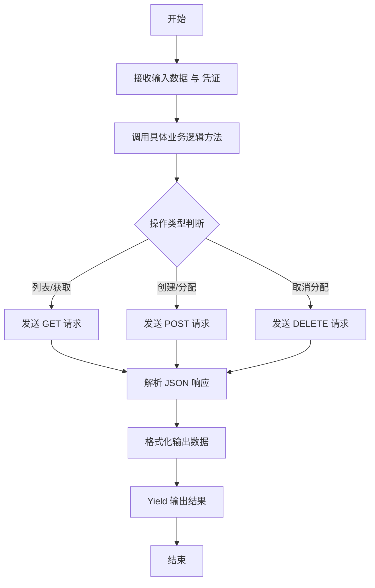

## 类结构

```
Block (基类)
├── GithubListPullRequestsBlock
├── GithubMakePullRequestBlock
├── GithubReadPullRequestBlock
├── GithubAssignPRReviewerBlock
├── GithubUnassignPRReviewerBlock
└── GithubListPRReviewersBlock
```

## 全局变量及字段


### `GithubListPullRequestsBlock.Input`
    
Defines the input schema for listing pull requests, including credentials and repository URL.

类型：`BlockSchemaInput`
    


### `GithubListPullRequestsBlock.Output`
    
Defines the output schema for listing pull requests, containing a list of PR items and error messages.

类型：`BlockSchemaOutput`
    


### `GithubMakePullRequestBlock.Input`
    
Defines the input schema for creating a pull request, specifying repo URL, title, body, and branch names.

类型：`BlockSchemaInput`
    


### `GithubMakePullRequestBlock.Output`
    
Defines the output schema for creating a pull request, returning the PR number and URL.

类型：`BlockSchemaOutput`
    


### `GithubReadPullRequestBlock.Input`
    
Defines the input schema for reading a pull request, including the PR URL and an option to include changes.

类型：`BlockSchemaInput`
    


### `GithubReadPullRequestBlock.Output`
    
Defines the output schema for reading a pull request, providing title, body, author, and changes.

类型：`BlockSchemaOutput`
    


### `GithubAssignPRReviewerBlock.Input`
    
Defines the input schema for assigning a reviewer, requiring the PR URL and the reviewer's username.

类型：`BlockSchemaInput`
    


### `GithubAssignPRReviewerBlock.Output`
    
Defines the output schema for assigning a reviewer, returning the operation status or error.

类型：`BlockSchemaOutput`
    


### `GithubUnassignPRReviewerBlock.Input`
    
Defines the input schema for unassigning a reviewer, requiring the PR URL and the reviewer's username.

类型：`BlockSchemaInput`
    


### `GithubUnassignPRReviewerBlock.Output`
    
Defines the output schema for unassigning a reviewer, returning the operation status or error.

类型：`BlockSchemaOutput`
    


### `GithubListPRReviewersBlock.Input`
    
Defines the input schema for listing reviewers, requiring the PR URL.

类型：`BlockSchemaInput`
    


### `GithubListPRReviewersBlock.Output`
    
Defines the output schema for listing reviewers, returning a list of reviewers with their details.

类型：`BlockSchemaOutput`
    
    

## 全局函数及方法


### `prepare_pr_api_url`

根据提供的 GitHub Pull Request Web URL，构造特定的 API 资源路径字符串。该函数通过正则表达式解析出仓库基础信息和 PR 编号，并将其与给定的子路径组合生成新的 URL。

参数：

-  `pr_url`：`str`，GitHub 拉取请求的标准 Web URL（例如："https://github.com/owner/repo/pull/1"）。
-  `path`：`str`，需要附加到 PR URL 后的 API 子路径（例如："files"、"requested_reviewers"）。

返回值：`str`，构造后的 URL 字符串，包含仓库基础路径、PR 编号及指定的子路径。

#### 流程图

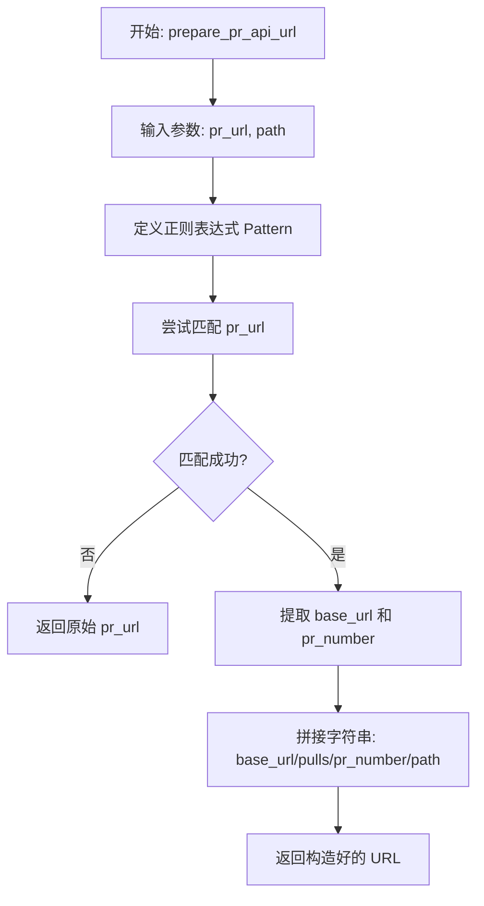

#### 带注释源码

```python
def prepare_pr_api_url(pr_url: str, path: str) -> str:
    # 定义正则表达式模式，用于解析 GitHub PR URL
    # (?:https?://)? : 非捕获组，匹配可选的 http:// 或 https:// 协议头
    # ([^/]+/[^/]+/[^/]+) : 捕获组1，匹配 domain/owner/repo 形式的 base_url
    # /pull/ : 匹配固定字符串 "/pull/"
    # (\d+) : 捕获组2，匹配 PR 的数字编号
    pattern = r"^(?:https?://)?([^/]+/[^/]+/[^/]+)/pull/(\d+)"
    
    # 使用正则匹配输入的 URL
    match = re.match(pattern, pr_url)
    
    # 如果没有匹配到预期的格式，直接返回原始 URL
    if not match:
        return pr_url

    # 从匹配结果中获取 base_url (例如: github.com/owner/repo) 和 pr_number
    base_url, pr_number = match.groups()
    
    # 构造并返回新的 API 路径字符串
    return f"{base_url}/pulls/{pr_number}/{path}"
```


### `GithubListPullRequestsBlock.__init__`

该方法是 `GithubListPullRequestsBlock` 类的构造函数，负责初始化块的基本元数据，包括唯一标识符、描述、分类、输入/输出架构定义以及用于测试的模拟数据和凭证。它通过调用父类 `Block` 的构造函数来完成注册。

参数：

- `self`：`GithubListPullRequestsBlock`，类实例本身。

返回值：`None`，无返回值。

#### 流程图

```mermaid
graph TD
    A[开始: __init__] --> B[调用 super().__init__]
    B --> C[传入 ID: ffef3c4c-6cd0-48dd-817d-459f975219f4]
    C --> D[传入描述和分类信息]
    D --> E[传入 Input 和 Output Schema]
    E --> F[传入测试配置]
    F --> G[结束初始化]
```

#### 带注释源码

```python
    def __init__(self):
        # 调用父类 Block 的初始化方法，配置该 Block 的所有元数据和运行时行为
        super().__init__(
            # 定义该 Block 的唯一标识符
            id="ffef3c4c-6cd0-48dd-817d-459f975219f4",
            # 提供该 Block 的功能描述，用于界面展示或文档说明
            description="This block lists all pull requests for a specified GitHub repository.",
            # 指定该 Block 所属的分类，此处归类为开发者工具
            categories={BlockCategory.DEVELOPER_TOOLS},
            # 指定该 Block 的输入数据结构 Schema，定义了预期的输入字段
            input_schema=GithubListPullRequestsBlock.Input,
            # 指定该 Block 的输出数据结构 Schema，定义了返回的字段类型
            output_schema=GithubListPullRequestsBlock.Output,
            # 定义用于单元测试或功能验证的标准输入数据
            test_input={
                "repo_url": "https://github.com/owner/repo",
                "credentials": TEST_CREDENTIALS_INPUT,
            },
            # 定义用于测试环境的凭证对象
            test_credentials=TEST_CREDENTIALS,
            # 定义执行测试时预期的输出结果列表，包含不同输出端口的数据
            test_output=[
                (
                    "pull_requests",
                    [
                        {
                            "title": "Pull request 1",
                            "url": "https://github.com/owner/repo/pull/1",
                        }
                    ],
                ),
                (
                    "pull_request",
                    {
                        "title": "Pull request 1",
                        "url": "https://github.com/owner/repo/pull/1",
                    },
                ),
            ],
            # 定义测试模拟对象，用于在测试过程中拦截真实的 API 调用并返回预设数据
            test_mock={
                "list_prs": lambda *args, **kwargs: [
                    {
                        "title": "Pull request 1",
                        "url": "https://github.com/owner/repo/pull/1",
                    }
                ]
            },
        )
```


### `GithubListPullRequestsBlock.list_prs`

该函数用于异步获取指定 GitHub 仓库的所有拉取请求（Pull Request）列表，并提取每个 PR 的标题和 URL 信息。

参数：

- `credentials`：`GithubCredentials`，用于认证访问 GitHub API 的凭据对象。
- `repo_url`：`str`，目标 GitHub 仓库的 URL 地址。

返回值：`list[Output.PRItem]`，包含拉取请求信息的字典列表，每个字典包含 `title` 和 `url` 字段。

#### 流程图

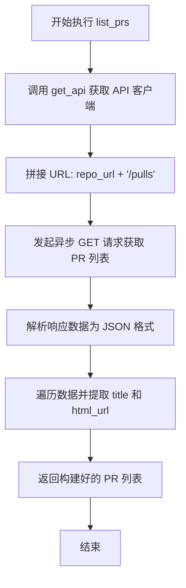

#### 带注释源码

```python
    @staticmethod
    async def list_prs(
        credentials: GithubCredentials, repo_url: str
    ) -> list[Output.PRItem]:
        # 使用提供的凭据初始化 API 客户端
        api = get_api(credentials)
        # 构建 API 端点 URL，追加 "/pulls" 以获取拉取请求列表
        pulls_url = repo_url + "/pulls"
        # 发送异步 GET 请求到 GitHub API
        response = await api.get(pulls_url)
        # 将响应体解析为 JSON 格式的数据
        data = response.json()
        # 使用列表推导式提取每个 PR 的标题和 URL，构建规范化的输出列表
        pull_requests: list[GithubListPullRequestsBlock.Output.PRItem] = [
            {"title": pr["title"], "url": pr["html_url"]} for pr in data
        ]
        # 返回处理后的拉取请求列表
        return pull_requests
```


### `GithubListPullRequestsBlock.run`

执行获取指定 GitHub 仓库 Pull Requests 的核心逻辑。该方法通过调用辅助方法获取数据，并将结果同时以列表形式和单个 Pull Request 对象的形式产出，以便后续流程处理。

参数：

-  `input_data`：`GithubListPullRequestsBlock.Input`，包含输入数据的对象，主要是仓库的 URL。
-  `credentials`：`GithubCredentials`，用于身份验证的 GitHub 凭据对象。
-  `**kwargs`：`dict`，其他可选的关键字参数。

返回值：`BlockOutput`，异步生成器类型，产出包含 Pull Requests 列表和单个 Pull Request 的元组数据。

#### 流程图

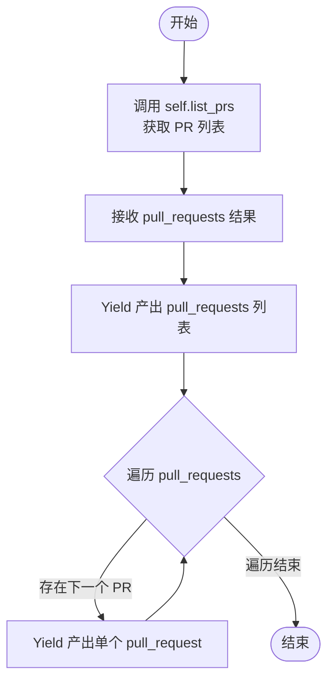

#### 带注释源码

```python
    async def run(
        self,
        input_data: Input,
        *,
        credentials: GithubCredentials,
        **kwargs,
    ) -> BlockOutput:
        # 调用静态方法 list_prs，传入凭据和仓库 URL，异步获取 PR 列表
        pull_requests = await self.list_prs(
            credentials,
            input_data.repo_url,
        )
        # 产出键为 "pull_requests" 的结果，包含完整的 PR 列表
        yield "pull_requests", pull_requests
        # 遍历获取到的每一个 PR，逐个产出
        for pr in pull_requests:
            yield "pull_request", pr
```


### `GithubMakePullRequestBlock.__init__`

该方法是 `GithubMakePullRequestBlock` 类的构造函数，用于初始化块的基本元数据（如ID、描述、分类）、输入输出模式以及测试配置（包括测试输入、凭证、输出和模拟函数）。它通过调用父类 `Block` 的构造函数来完成这些配置。

参数：

- `self`：`GithubMakePullRequestBlock`，类的实例本身。

返回值：`None`，无返回值。

#### 流程图

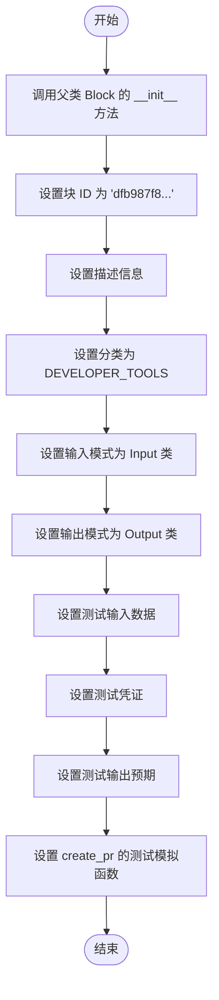

#### 带注释源码

```python
def __init__(self):
    # 调用父类 Block 的构造函数以注册块的元数据和配置
    super().__init__(
        # 块的唯一标识符
        id="dfb987f8-f197-4b2e-bf19-111812afd692",
        # 块的功能描述，用于 UI 展示
        description="This block creates a new pull request on a specified GitHub repository.",
        # 将块归类为开发者工具
        categories={BlockCategory.DEVELOPER_TOOLS},
        # 定义输入数据的结构模式，引用内部类 Input
        input_schema=GithubMakePullRequestBlock.Input,
        # 定义输出数据的结构模式，引用内部类 Output
        output_schema=GithubMakePullRequestBlock.Output,
        # 定义用于测试的模拟输入数据，包含仓库 URL、标题、内容、分支信息和凭证
        test_input={
            "repo_url": "https://github.com/owner/repo",
            "title": "Test Pull Request",
            "body": "This is a test pull request.",
            "head": "feature-branch",
            "base": "main",
            "credentials": TEST_CREDENTIALS_INPUT,
        },
        # 定义测试时使用的凭证
        test_credentials=TEST_CREDENTIALS,
        # 定义测试运行时期望的输出结果
        test_output=[
            ("number", 1),
            ("url", "https://github.com/owner/repo/pull/1"),
        ],
        # 定义测试模拟对象，避免实际 API 调用，模拟 create_pr 方法的返回值
        test_mock={
            "create_pr": lambda *args, **kwargs: (
                1,
                "https://github.com/owner/repo/pull/1",
            )
        },
    )
```


### `GithubMakePullRequestBlock.create_pr`

该方法是一个静态方法，用于通过 GitHub API 在指定的仓库中创建一个新的 Pull Request。它构造必要的 API 请求参数，发送 POST 请求，并返回新创建的 Pull Request 的编号和 URL。

参数：

- `credentials`：`GithubCredentials`，GitHub 认证凭证，用于初始化 API 客户端。
- `repo_url`：`str`，目标 GitHub 仓库的 URL。
- `title`：`str`，Pull Request 的标题。
- `body`：`str`，Pull Request 的内容描述。
- `head`：`str`，源分支名称（即包含更改的分支）。
- `base`：`str`，目标分支名称（即请求合并入的分支）。

返回值：`tuple[int, str]`，包含新创建的 Pull Request 编号（int）和 URL（str）的元组。

#### 流程图

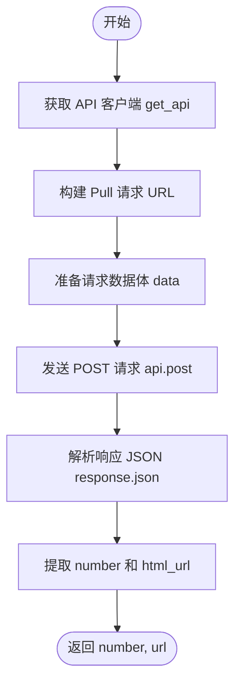

#### 带注释源码

```python
    @staticmethod
    async def create_pr(
        credentials: GithubCredentials,
        repo_url: str,
        title: str,
        body: str,
        head: str,
        base: str,
    ) -> tuple[int, str]:
        # 使用提供的凭证初始化 API 客户端
        api = get_api(credentials)
        
        # 拼接完整的 API 端点 URL，用于创建 Pull Request
        pulls_url = repo_url + "/pulls"
        
        # 构造 POST 请求的 JSON 负载，包含标题、内容、源分支和目标分支
        data = {"title": title, "body": body, "head": head, "base": base}
        
        # 异步发送 POST 请求到 GitHub API
        response = await api.post(pulls_url, json=data)
        
        # 解析响应体为 JSON 格式
        pr_data = response.json()
        
        # 从响应数据中提取 Pull Request 的编号和 HTML URL 并返回
        return pr_data["number"], pr_data["html_url"]
```


### `GithubMakePullRequestBlock.run`

执行创建 GitHub 拉取请求的核心逻辑，通过调用 API 将指定分支的变更为一个 PR，并返回该 PR 的编号和 URL，或在出错时返回错误信息。

参数：

- `input_data`：`GithubMakePullRequestBlock.Input`，包含创建 PR 所需的配置信息，如仓库地址、标题、内容、源分支和目标分支。
- `credentials`：`GithubCredentials`，用于向 GitHub API 进行身份验证的凭据。
- `**kwargs`：`dict`，扩展关键字参数，当前未使用。

返回值：`BlockOutput`，一个异步生成器，依次输出创建成功的 Pull Request 编号（"number"）和链接（"url"），或者在发生异常时输出错误信息（"error"）。

#### 流程图

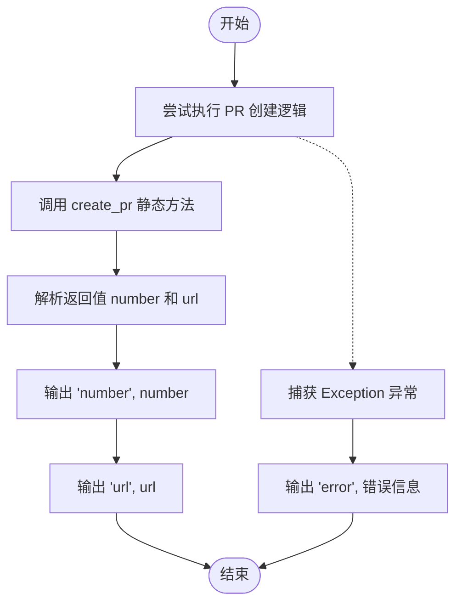

#### 带注释源码

```python
    async def run(
        self,
        input_data: Input,
        *,
        credentials: GithubCredentials,
        **kwargs,
    ) -> BlockOutput:
        try:
            # 调用静态方法 create_pr，传入凭据和输入数据以发起创建请求
            number, url = await self.create_pr(
                credentials,
                input_data.repo_url,
                input_data.title,
                input_data.body,
                input_data.head,
                input_data.base,
            )
            # 输出成功创建的 Pull Request 编号
            yield "number", number
            # 输出成功创建的 Pull Request URL
            yield "url", url
        except Exception as e:
            # 捕获过程中的任何异常，并输出错误信息字符串
            yield "error", str(e)
```


### `GithubReadPullRequestBlock.__init__`

初始化 `GithubReadPullRequestBlock` 类的实例，配置该 Block 的唯一标识符、描述、分类、输入输出 Schema 以及用于测试的模拟数据和预期输出。

参数：

- `self`：`GithubReadPullRequestBlock`，类实例本身。

返回值：`None`，构造函数不返回任何值。

#### 流程图

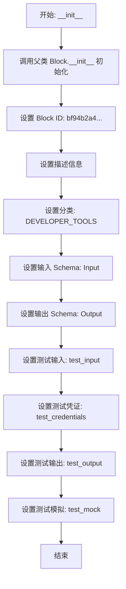

#### 带注释源码

```python
def __init__(self):
    # 调用父类 Block 的构造函数，传入配置参数
    super().__init__(
        # 设置该 Block 的唯一标识符
        id="bf94b2a4-1a30-4600-a783-a8a44ee31301",
        # 设置该 Block 的功能描述
        description="This block reads the body, title, user, and changes of a specified GitHub pull request.",
        # 设置该 Block 所属的分类
        categories={BlockCategory.DEVELOPER_TOOLS},
        # 定义输入数据的 Schema，引用内部类 Input
        input_schema=GithubReadPullRequestBlock.Input,
        # 定义输出数据的 Schema，引用内部类 Output
        output_schema=GithubReadPullRequestBlock.Output,
        # 定义测试用的输入数据
        test_input={
            "pr_url": "https://github.com/owner/repo/pull/1",
            "include_pr_changes": True,
            "credentials": TEST_CREDENTIALS_INPUT,
        },
        # 定义测试用的凭证
        test_credentials=TEST_CREDENTIALS,
        # 定义测试预期的输出列表
        test_output=[
            ("title", "Title of the pull request"),
            ("body", "This is the body of the pull request."),
            ("author", "username"),
            ("changes", "List of changes made in the pull request."),
        ],
        # 定义测试时的模拟行为，用于替换实际的 API 调用
        test_mock={
            "read_pr": lambda *args, **kwargs: (
                "Title of the pull request",
                "This is the body of the pull request.",
                "username",
            ),
            "read_pr_changes": lambda *args, **kwargs: "List of changes made in the pull request.",
        },
    )
```


### `GithubReadPullRequestBlock.read_pr`

该静态方法通过 GitHub API 获取指定 Pull Request 的详细信息，包括标题、正文内容和作者。为了获取这些文本信息，它将 PR URL 转换为 Issues API 端点进行请求。

参数：

-  `credentials`：`GithubCredentials`，用于身份验证以访问 GitHub API 的凭据对象。
-  `pr_url`：`str`，目标 GitHub Pull Request 的 URL。

返回值：`tuple[str, str, str]`，包含三个元素的元组，分别代表 Pull Request 的标题、正文内容和作者用户名。

#### 流程图

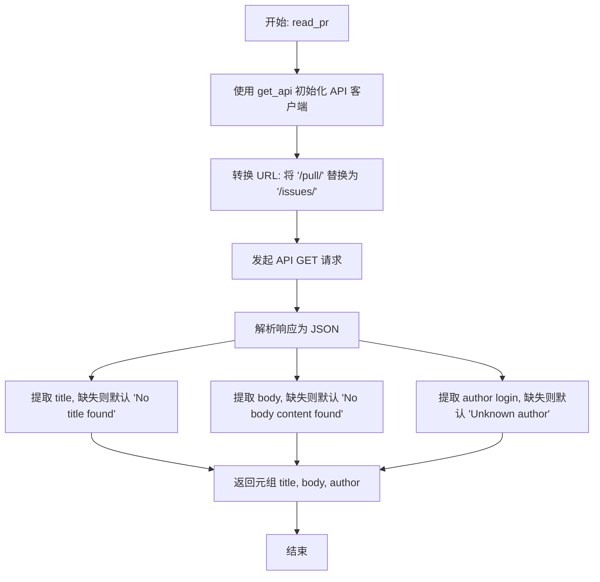

#### 带注释源码

```python
    @staticmethod
    async def read_pr(
        credentials: GithubCredentials, pr_url: str
    ) -> tuple[str, str, str]:
        # 根据提供的凭据获取 GitHub API 客户端实例
        api = get_api(credentials)

        # 将 PR URL 转换为 Issues API URL
        # GitHub API 允许通过 Issues 端点获取 PR 的标题、正文和作者信息
        issue_url = pr_url.replace("/pull/", "/issues/")

        # 异步发送 GET 请求获取数据
        response = await api.get(issue_url)

        # 将响应体解析为 JSON 格式
        data = response.json()

        # 从数据中提取标题，如果不存在则使用默认文本
        title = data.get("title", "No title found")

        # 从数据中提取正文，如果不存在则使用默认文本
        body = data.get("body", "No body content found")

        # 从嵌套的 user 对象中提取作者登录名，如果不存在则使用默认文本
        author = data.get("user", {}).get("login", "Unknown author")

        # 返回包含标题、正文和作者的元组
        return title, body, author
```


### `GithubReadPullRequestBlock.read_pr_changes`

该方法用于获取指定 GitHub Pull Request 的文件变更详情。它通过调用 GitHub API 获取 PR 中涉及的所有文件列表，并根据文件状态（如新增、删除、修改或重命名）构建符合 unified diff 格式的变更字符串。

参数：

- `credentials`：`GithubCredentials`，用于认证 GitHub API 访问权限的凭据对象。
- `pr_url`：`str`，GitHub Pull Request 的 URL 地址。

返回值：`str`，包含 Pull Request 中所有文件变更详情的字符串，格式为类似 diff 的文本块。

#### 流程图

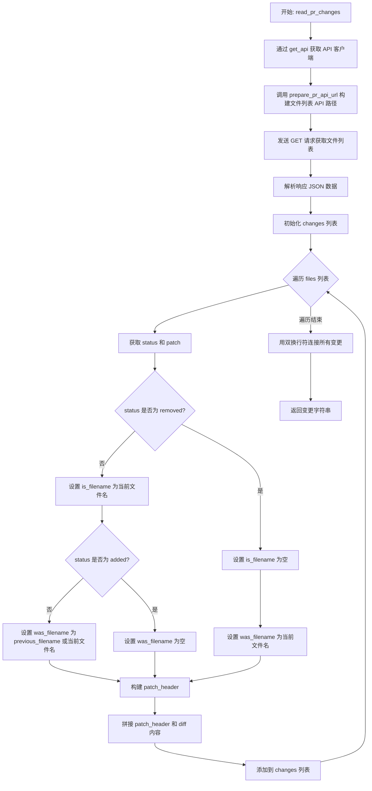

#### 带注释源码

```python
    @staticmethod
    async def read_pr_changes(credentials: GithubCredentials, pr_url: str) -> str:
        # 获取配置好的 API 客户端实例
        api = get_api(credentials)
        
        # 使用辅助函数构建获取 PR 文件列表的 API URL
        # 例如将 "https://github.com/owner/repo/pull/1" 转换为 API 地址并附加 "files" 路径
        files_url = prepare_pr_api_url(pr_url=pr_url, path="files")
        
        # 发送异步 GET 请求获取文件数据
        response = await api.get(files_url)
        
        # 将响应体解析为 JSON 格式
        files = response.json()
        
        # 用于存储每个文件的变更详情字符串
        changes = []
        
        # 遍历每一个受影响的文件
        for file in files:
            # 获取文件状态 (added, removed, modified, renamed 等)
            status: str = file.get("status", "")
            # 获取具体的差异内容
            diff: str = file.get("patch", "")
            
            # 根据文件状态处理文件名的显示逻辑
            if status != "removed":
                # 如果文件未被删除，获取当前文件名
                is_filename: str = file.get("filename", "")
                
                # 如果文件不是新增的，获取变更前的文件名（用于处理重命名或修改）
                # 如果是新增文件，变更前文件名则为空
                was_filename: str = (
                    file.get("previous_filename", is_filename)
                    if status != "added"
                    else ""
                )
            else:
                # 如果文件被删除，当前文件名为空，只保留删除前的文件名
                is_filename = ""
                was_filename: str = file.get("filename", "")

            # 构建 diff 头部信息 (类似于 --- a/file.js +++ b/file.js)
            patch_header = ""
            if was_filename:
                patch_header += f"--- {was_filename}\n"
            if is_filename:
                patch_header += f"+++ {is_filename}\n"
                
            # 将头部和具体的 diff 内容合并，加入结果列表
            changes.append(patch_header + diff)
            
        # 将所有文件的变更用两个换行符连接，形成一个完整的字符串返回
        return "\n\n".join(changes)
```


### `GithubReadPullRequestBlock.run`

该方法是 `GithubReadPullRequestBlock` 的核心执行逻辑，负责异步读取指定 GitHub Pull Request 的详细信息（包括标题、正文和作者），并根据配置决定是否获取并返回该 Pull Request 的代码变更内容。

参数：

- `self`：`GithubReadPullRequestBlock`，类的实例。
- `input_data`：`Input`，包含输入数据的对象，字段包括 `pr_url`（Pull Request 的 URL）和 `include_pr_changes`（布尔值，指示是否包含代码变更）。
- `credentials`：`GithubCredentials`，用于认证的 GitHub 凭证对象。
- `**kwargs`：`dict`，额外的关键字参数。

返回值：`BlockOutput`，异步生成器，逐步产生包含 Pull Request 各项信息的元组（键值对）。

#### 流程图

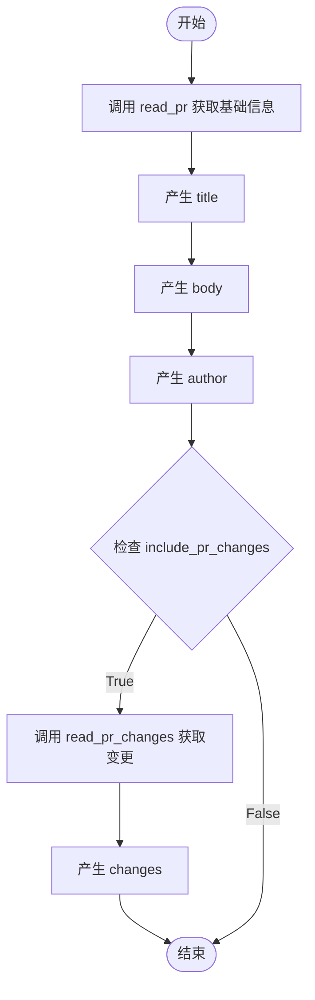

#### 带注释源码

```python
async def run(
    self,
    input_data: Input,
    *,
    credentials: GithubCredentials,
    **kwargs,
) -> BlockOutput:
    # 调用静态方法 read_pr 获取 Pull Request 的标题、正文和作者信息
    title, body, author = await self.read_pr(
        credentials,
        input_data.pr_url,
    )
    # 依次产生 title, body, author 输出
    yield "title", title
    yield "body", body
    yield "author", author

    # 检查输入配置中是否要求包含 Pull Request 的代码变更
    if input_data.include_pr_changes:
        # 如果需要，调用静态方法 read_pr_changes 获取代码变更内容
        changes = await self.read_pr_changes(
            credentials,
            input_data.pr_url,
        )
        # 产生 changes 输出
        yield "changes", changes
```


### `GithubAssignPRReviewerBlock.__init__`

该方法是 `GithubAssignPRReviewerBlock` 类的构造函数，负责初始化此 Block 的元数据、输入输出结构定义以及测试配置。它将特定的 ID、描述、类别、Schema（模式）和测试数据传递给父类 `Block` 进行注册。

参数：

-   `self`：`GithubAssignPRReviewerBlock`，类的实例对象本身。

返回值：`None`，无返回值。

#### 流程图

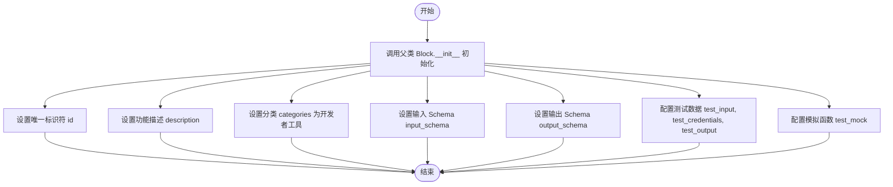

#### 带注释源码

```python
    def __init__(self):
        super().__init__(
            # 定义 Block 的唯一标识符
            id="c0d22c5e-e688-43e3-ba43-d5faba7927fd",
            # 定义 Block 的功能描述，用于展示给用户
            description="This block assigns a reviewer to a specified GitHub pull request.",
            # 定义 Block 所属的分类，这里归类为开发者工具
            categories={BlockCategory.DEVELOPER_TOOLS},
            # 定义 Block 的输入数据结构 Schema，引用类内部定义的 Input 类
            input_schema=GithubAssignPRReviewerBlock.Input,
            # 定义 Block 的输出数据结构 Schema，引用类内部定义的 Output 类
            output_schema=GithubAssignPRReviewerBlock.Output,
            # 定义用于测试的输入数据样例
            test_input={
                "pr_url": "https://github.com/owner/repo/pull/1",
                "reviewer": "reviewer_username",
                "credentials": TEST_CREDENTIALS_INPUT,
            },
            # 定义测试时使用的凭证
            test_credentials=TEST_CREDENTIALS,
            # 定义预期的测试输出结果
            test_output=[("status", "Reviewer assigned successfully")],
            # 定义模拟函数，用于在测试环境中替代真实的 assign_reviewer API 调用
            test_mock={
                "assign_reviewer": lambda *args, **kwargs: "Reviewer assigned successfully"
            },
        )
```


### `GithubAssignPRReviewerBlock.assign_reviewer`

该静态方法的主要功能是利用GitHub API将指定用户作为审查者分配给特定的拉取请求（PR）。它通过解析PR的URL来构建API请求地址，并结合提供的认证凭证发送POST请求以完成审查者的分配操作。

参数：

-  `credentials`：`GithubCredentials`，用于认证和访问GitHub API的凭证对象。
-  `pr_url`：`str`，目标GitHub拉取请求的完整URL地址。
-  `reviewer`：`str`，将被分配为审查者的GitHub用户名。

返回值：`str`，表示审查者分配成功的确认消息 "Reviewer assigned successfully"。

#### 流程图

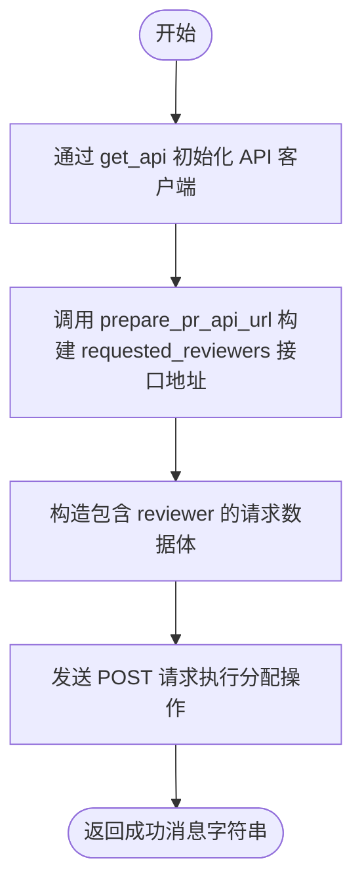

#### 带注释源码

```python
    @staticmethod
    async def assign_reviewer(
        credentials: GithubCredentials, pr_url: str, reviewer: str
    ) -> str:
        # 1. 获取已配置好认证信息的 API 客户端实例
        api = get_api(credentials)
        
        # 2. 根据输入的 PR URL 和特定的路径 'requested_reviewers' 构建完整的 API 请求地址
        reviewers_url = prepare_pr_api_url(pr_url=pr_url, path="requested_reviewers")
        
        # 3. 准备请求体数据，将审查者用户名放入列表中
        data = {"reviewers": [reviewer]}
        
        # 4. 异步发送 POST 请求到 GitHub API 以分配审查者
        await api.post(reviewers_url, json=data)
        
        # 5. 返回表示操作成功的字符串
        return "Reviewer assigned successfully"
```


### `GithubAssignPRReviewerBlock.run`

该方法是 `GithubAssignPRReviewerBlock` 的核心执行逻辑，负责调用 API 为指定的 GitHub Pull Request 分配审查员，并返回操作状态或捕获的错误信息。

参数：

- `input_data`：`Input`，输入数据对象，包含 PR 的 URL (`pr_url`) 和审查员的用户名 (`reviewer`)。
- `credentials`：`GithubCredentials`，GitHub API 认证凭证，用于授权操作。
- `**kwargs`：`dict`，其他扩展关键字参数。

返回值：`BlockOutput`，一个异步生成器，产生包含操作状态 (`status`) 或错误信息 (`error`) 的元组。

#### 流程图

```mermaid
flowchart TD
    Start([开始运行]) --> TryBlock[进入 Try 异常处理块]
    TryBlock --> CallMethod[调用 self.assign_reviewer<br/>传入 credentials, pr_url, reviewer]
    CallMethod --> CheckSuccess{调用是否成功?}
    CheckSuccess -- 成功 --> YieldStatus[输出 ('status', 成功消息)]
    CheckSuccess -- 失败/异常 --> CatchException[捕获 Exception e]
    CatchException --> YieldError[输出 ('error', 异常信息)]
    YieldStatus --> End([结束])
    YieldError --> End
```

#### 带注释源码

```python
    async def run(
        self,
        input_data: Input,
        *,
        credentials: GithubCredentials,
        **kwargs,
    ) -> BlockOutput:
        # 使用 try-except 结构捕获并处理可能发生的异常
        try:
            # 调用静态方法 assign_reviewer 执行实际的审查员分配逻辑
            # 该方法内部会构造 API 请求并发送
            status = await self.assign_reviewer(
                credentials,            # 传入 GitHub 认证凭证
                input_data.pr_url,     # 从输入数据中获取 Pull Request 的 URL
                input_data.reviewer,   # 从输入数据中获取审查员的用户名
            )
            # 如果操作成功，产生 "status" 输出及对应的状态消息
            yield "status", status
        except Exception as e:
            # 如果在过程中发生任何异常，产生 "error" 输出及异常信息字符串
            yield "error", str(e)
```


### `GithubUnassignPRReviewerBlock.__init__`

该方法是 `GithubUnassignPRReviewerBlock` 类的构造函数，负责初始化 Block 的元数据、输入输出结构以及用于测试的模拟数据。它通过调用父类 `Block` 的构造函数来配置该 Block 的唯一标识、描述、分类、Schema 定义和测试行为。

参数：

-   `self`：`GithubUnassignPRReviewerBlock`，类的实例

返回值：`None`，该方法为构造函数，主要用于初始化配置，无显式返回值

#### 流程图

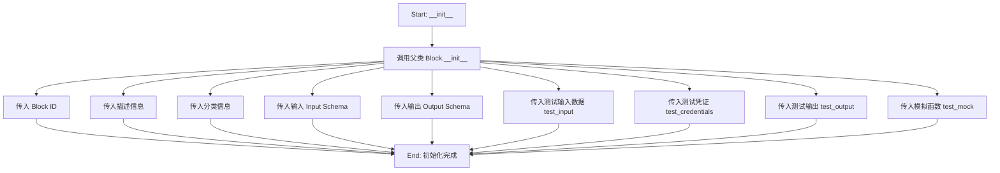

#### 带注释源码

```python
    def __init__(self):
        # 调用父类 Block 的构造函数，传入配置参数
        super().__init__(
            # 定义该 Block 的唯一标识符
            id="9637945d-c602-4875-899a-9c22f8fd30de",
            # 定义该 Block 的功能描述
            description="This block unassigns a reviewer from a specified GitHub pull request.",
            # 定义该 Block 所属的分类（开发者工具）
            categories={BlockCategory.DEVELOPER_TOOLS},
            # 定义输入数据的 Schema 结构，使用内部类 Input
            input_schema=GithubUnassignPRReviewerBlock.Input,
            # 定义输出数据的 Schema 结构，使用内部类 Output
            output_schema=GithubUnassignPRReviewerBlock.Output,
            # 定义用于测试的输入参数样本
            test_input={
                "pr_url": "https://github.com/owner/repo/pull/1",
                "reviewer": "reviewer_username",
                "credentials": TEST_CREDENTIALS_INPUT,
            },
            # 定义用于测试的凭证对象
            test_credentials=TEST_CREDENTIALS,
            # 定义预期的测试输出结果
            test_output=[("status", "Reviewer unassigned successfully")],
            # 定义测试时用于替换实际逻辑的模拟函数
            test_mock={
                "unassign_reviewer": lambda *args, **kwargs: "Reviewer unassigned successfully"
            },
        )
```


### `GithubUnassignPRReviewerBlock.unassign_reviewer`

该静态方法用于通过向 GitHub API 发送 DELETE 请求，从指定的 Pull Request 中移除指定的审查者。

参数：

-  `credentials`：`GithubCredentials`，用于授权 API 请求的 GitHub 凭证。
-  `pr_url`：`str`，GitHub Pull Request 的网页 URL（例如 https://github.com/owner/repo/pull/1）。
-  `reviewer`：`str`，需要取消分配的审查者的用户名。

返回值：`str`，操作结果的字符串描述，成功时返回 "Reviewer unassigned successfully"。

#### 流程图

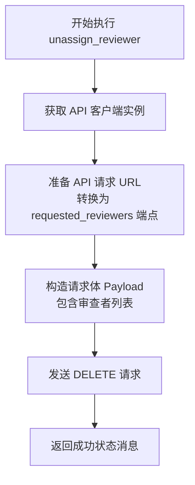

#### 带注释源码

```python
    @staticmethod
    async def unassign_reviewer(
        credentials: GithubCredentials, pr_url: str, reviewer: str
    ) -> str:
        # 获取初始化好的 API 客户端实例
        api = get_api(credentials)
        
        # 调用辅助函数 prepare_pr_api_url 将 PR 的网页 URL 转换为 API 端点 URL
        # path="requested_reviewers" 指向具体的资源路径
        reviewers_url = prepare_pr_api_url(pr_url=pr_url, path="requested_reviewers")
        
        # 构造请求体数据，GitHub API 要求 reviewes 是一个数组
        data = {"reviewers": [reviewer]}
        
        # 使用 api.delete 方法发送异步删除请求，传入 URL 和 JSON 数据
        await api.delete(reviewers_url, json=data)
        
        # 返回操作成功的提示字符串
        return "Reviewer unassigned successfully"
```


### `GithubUnassignPRReviewerBlock.run`

该方法是 `GithubUnassignPRReviewerBlock` 的核心执行逻辑，负责协调输入数据的处理，调用底层 API 取消分配指定的 GitHub PR 审查者，并处理执行过程中可能出现的异常，最终输出操作状态或错误信息。

参数：

- `input_data`：`GithubUnassignPRReviewerBlock.Input`，包含运行所需的所有输入数据，具体包括 `credentials`（凭证）、`pr_url`（Pull Request URL）和 `reviewer`（审查者用户名）。
- `credentials`：`GithubCredentials`，用于认证和访问 GitHub API 的凭据对象。
- `kwargs`：`**kwargs`，其他扩展的关键字参数。

返回值：`BlockOutput`，一个异步生成器，产生包含操作结果（如 "status" 或 "error"）的键值对元组。

#### 流程图

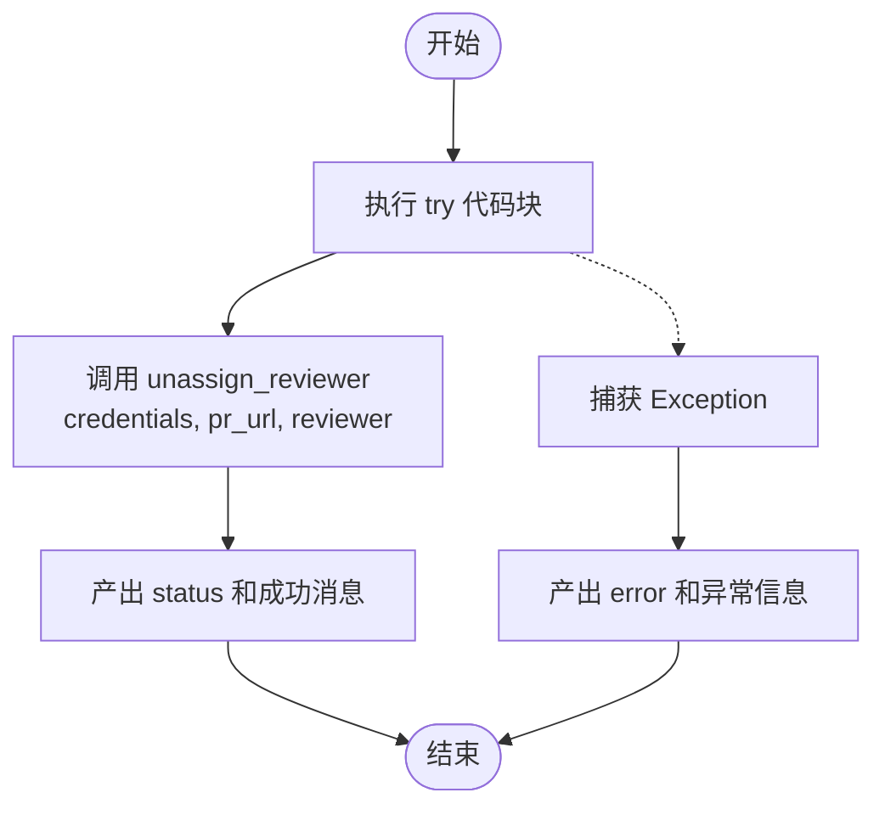

#### 带注释源码

```python
    async def run(
        self,
        input_data: Input,
        *,
        credentials: GithubCredentials,
        **kwargs,
    ) -> BlockOutput:
        try:
            # 调用静态方法执行取消分配审查者的实际操作
            # 传入凭证、PR URL 和审查者用户名
            status = await self.unassign_reviewer(
                credentials,
                input_data.pr_url,
                input_data.reviewer,
            )
            # 如果操作成功，产出 "status" 字段及返回的状态消息
            yield "status", status
        except Exception as e:
            # 如果在操作过程中发生任何异常，捕获该异常
            # 产出 "error" 字段及异常的字符串描述
            yield "error", str(e)
```


### `GithubListPRReviewersBlock.__init__`

初始化 GitHub 列出 PR 审查者块，设置其唯一标识符、描述、分类、输入输出模式以及用于测试的模拟数据和预期输出。

参数：

-  `self`：`GithubListPRReviewersBlock`，类实例自身

返回值：`None`，无返回值

#### 流程图

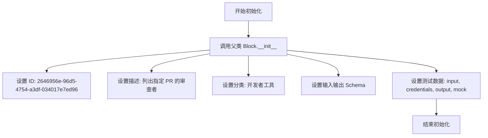

#### 带注释源码

```python
    def __init__(self):
        # 调用父类 Block 的初始化方法，配置块的基本属性和测试行为
        super().__init__(
            # 块的唯一标识符
            id="2646956e-96d5-4754-a3df-034017e7ed96",
            # 块的功能描述
            description="This block lists all reviewers for a specified GitHub pull request.",
            # 块所属的分类
            categories={BlockCategory.DEVELOPER_TOOLS},
            # 定义块的输入数据结构
            input_schema=GithubListPRReviewersBlock.Input,
            # 定义块的输出数据结构
            output_schema=GithubListPRReviewersBlock.Output,
            # 定义用于测试的输入数据
            test_input={
                "pr_url": "https://github.com/owner/repo/pull/1",
                "credentials": TEST_CREDENTIALS_INPUT,
            },
            # 定义用于测试的凭据
            test_credentials=TEST_CREDENTIALS,
            # 定义预期的测试输出结果
            test_output=[
                (
                    "reviewers",
                    [
                        {
                            "username": "reviewer1",
                            "url": "https://github.com/reviewer1",
                        }
                    ],
                ),
                (
                    "reviewer",
                    {
                        "username": "reviewer1",
                        "url": "https://github.com/reviewer1",
                    },
                ),
            ],
            # 定义测试时用于模拟实际 API 调用的函数
            test_mock={
                "list_reviewers": lambda *args, **kwargs: [
                    {
                        "username": "reviewer1",
                        "url": "https://github.com/reviewer1",
                    }
                ]
            },
        )
```


### `GithubListPRReviewersBlock.list_reviewers`

该静态方法用于通过 GitHub API 异步获取指定 Pull Request 的请求评审人列表，并将返回的数据格式化为包含用户名和 URL 的对象列表。

参数：

- `credentials`：`GithubCredentials`，用于身份验证和授权访问 GitHub API 的凭据对象。
- `pr_url`：`str`，目标 GitHub Pull Request 的网页 URL。

返回值：`list[GithubListPRReviewersBlock.Output.ReviewerItem]`，包含评审人信息的字典列表，每个字典包含 `username`（用户名）和 `url`（个人主页地址）。

#### 流程图

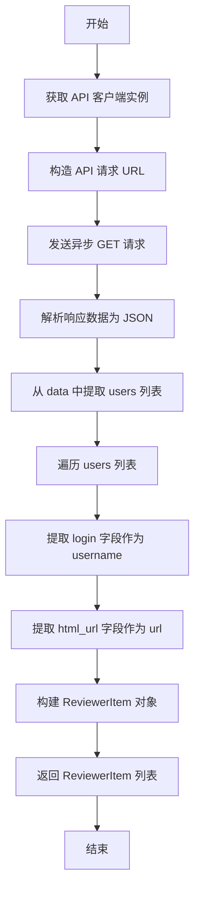

#### 带注释源码

```python
    @staticmethod
    async def list_reviewers(
        credentials: GithubCredentials, pr_url: str
    ) -> list[Output.ReviewerItem]:
        # 使用提供的凭据初始化 API 客户端
        api = get_api(credentials)
        
        # 根据传入的 PR URL 和指定路径构造 API 请求地址
        # 这里的路径是 'requested_reviewers'，用于获取请求的评审人
        reviewers_url = prepare_pr_api_url(pr_url=pr_url, path="requested_reviewers")
        
        # 发送异步 GET 请求到构造好的 URL
        response = await api.get(reviewers_url)
        
        # 将响应内容解析为 JSON 格式
        data = response.json()
        
        # 从解析后的数据中提取 'users' 字段（如果存在），并进行列表推导
        # 将每个用户信息映射为 Output.ReviewerItem 结构（包含 username 和 url）
        reviewers: list[GithubListPRReviewersBlock.Output.ReviewerItem] = [
            {"username": reviewer["login"], "url": reviewer["html_url"]}
            for reviewer in data.get("users", [])
        ]
        
        # 返回格式化后的评审人列表
        return reviewers
```


### `GithubListPRReviewersBlock.run`

该方法是 `GithubListPRReviewersBlock` 的核心执行逻辑，负责获取指定 GitHub Pull Request 的审查者列表，并将列表整体以及单个审查者逐个作为生成器的输出进行返回。

参数：

- `input_data`：`GithubListPRReviewersBlock.Input`，包含执行该 Block 所需的输入数据，如 PR URL 和凭证信息。
- `credentials`：`GithubCredentials`，用于身份验证的 GitHub 凭证对象，包含访问仓库所需的权限。
- `**kwargs`：`dict`，额外的关键字参数，用于传递上下文或其他扩展信息。

返回值：`BlockOutput`，一个异步生成器，依次产出包含 "reviewers"（审查者列表）和 "reviewer"（单个审查者）键值对的数据元组。

#### 流程图

```mermaid
graph TD
    A[开始执行 run 方法] --> B[调用 list_reviewers 获取审查者列表]
    B --> C[等待异步结果返回]
    C --> D[产出 'reviewers' 列表数据]
    D --> E[开始遍历审查者列表]
    E --> F{列表中是否还有审查者?}
    F -- 是 --> G[产出单个 'reviewer' 数据]
    G --> E
    F -- 否 --> H[方法执行结束]
```

#### 带注释源码

```python
    async def run(
        self,
        input_data: Input,
        *,
        credentials: GithubCredentials,
        **kwargs,
    ) -> BlockOutput:
        # 调用静态方法 list_reviewers，传入凭证和 PR URL，从 GitHub API 获取审查者列表
        reviewers = await self.list_reviewers(
            credentials,
            input_data.pr_url,
        )
        # 第一个输出：产出包含所有审查者信息的列表，键名为 'reviewers'
        yield "reviewers", reviewers
        
        # 遍历获取到的审查者列表
        for reviewer in reviewers:
            # 后续输出：逐个产出单个审查者信息，键名为 'reviewer'
            yield "reviewer", reviewer
```


## 关键组件


### Pull Request Listing Component
该组件负责获取并列出指定 GitHub 仓库下的所有拉取请求，提取并返回每个请求的标题和 URL。

### Pull Request Creation Component
该组件用于在指定的 GitHub 仓库中创建新的拉取请求，支持配置请求的标题、正文内容、源分支及目标分支。

### Pull Request Reading and Diffing Component
该组件负责读取指定拉取请求的详细信息（如标题、正文、作者），并可根据配置获取该请求涉及的文件代码变更差异。

### Pull Request Reviewer Management Component
该组件集成了审查者管理功能，支持向拉取请求指派审查者、取消指派审查者以及列出当前所有的审查请求。

### GitHub API URL Construction Utility
该组件是一个辅助工具，使用正则表达式将用户提供的 GitHub Pull Request Web URL 解析并转换为 API 交互所需的标准端点路径。


## 问题及建议


### 已知问题

-   **URL 构建脆弱且不透明**：`prepare_pr_api_url` 函数依赖硬编码的正则表达式来手动解析和重构 URL。它去除了协议（`https://`），导致生成的字符串（如 `github.com/owner/repo/pulls/1/files`）不符合标准 URI 格式。这种行为高度依赖底层 `get_api()` 的具体实现来“修复”或处理这些非标准路径，存在极高的维护风险和跨环境兼容性问题。
-   **缺乏分页支持**：`list_prs` 和 `list_reviewers` 方法仅处理 API 响应的第一页数据。对于包含大量 Pull Request 或审查者的仓库，该代码将返回截断的数据，导致功能不完整。
-   **错误处理不一致**：`GithubListPullRequestsBlock` 和 `GithubReadPullRequestBlock` 的 `run` 方法缺少 try-except 块。如果 API 请求失败（如 401, 404, 500 错误），这些块将抛出未处理的异常而不是按照预期生成 `error` 输出，这会导致工作流执行中断。
-   **Diff 提取逻辑存在盲点**：在 `GithubReadPullRequestBlock.read_pr_changes` 中，代码直接获取 `file.get("patch", "")`。GitHub API 对于二进制文件或超过一定大小（通常为 300 行）的文件不会返回 `patch` 字段。当前代码将这些情况视为“无更改”，向用户反馈了错误信息。
-   **硬编码 API 变通方案**：`read_pr` 方法使用 `pr_url.replace("/pull/", "/issues/")` 来获取元数据。这是依赖 GitHub API 的具体实现细节（即 Issues 端点也能返回 PR 数据），这种“魔术字符串”式的做法缺乏抽象，一旦 API 变更极易出错。

### 优化建议

-   **统一错误处理机制**：在所有 Block 的 `run` 方法外层包裹 try-except 块，捕获 `Exception` 并确保在发生错误时始终输出 `error` 字段，以保证工作流的健壮性和一致性。
-   **实现标准化的 URL 路由**：重构 `prepare_pr_api_url` 及相关的字符串拼接逻辑，建议使用 `urllib.parse` 或专用库将标准的 GitHub Web URL（`https://github.com/owner/repo/...`）明确转换为标准的 GitHub API URL（`https://api.github.com/repos/owner/repo/...`），消除对正则和底层库兼容性的依赖。
-   **增加自动分页处理**：修改列表方法（`list_prs`，`list_reviewers`），使其能够检测响应头中的 `Link` 字段，并自动循环请求所有页面，聚合完整结果集后再返回。
-   **增强 Diff 处理的健壮性**：在 `read_pr_changes` 中增加对 `patch` 字段是否存在的检查。如果缺失，应根据文件状态生成提示信息（如 "File too large to display" 或 "Binary file"），而不是返回空字符串。
-   **封装“Issues”端点访问逻辑**：将 `read_pr` 中利用 `/issues/` 端点获取 PR 详情的逻辑提取为一个独立且命名清晰的私有方法（如 `_fetch_pr_metadata_via_issue_endpoint`），并添加注释说明其原因，以提高代码可读性和可维护性。
-   **代码清理与重构**：在 `GithubReadPullRequestBlock.read_pr_changes` 中，优化变量作用域和类型标注逻辑，避免在循环内部重复声明和赋值类型，或者将文件名的提取逻辑提取为辅助函数。


## 其它


### 设计目标与约束

本模块旨在为自动化工作流系统提供一组可复用的异步代码块，用于与 GitHub 拉取请求（Pull Request）进行交互。设计目标包括模块化、高内聚低耦合，以及通过统一的接口抽象 GitHub API 的复杂性。主要约束如下：
1. **异步约束**：所有网络请求操作必须使用 `async/await` 语法，以支持高并发环境下的非阻塞执行。
2. **输入输出约束**：必须继承自 `Block` 基类，并严格遵循预定义的 `Input` 和 `Output` Schema 结构，确保与工作流引擎的契约一致性。
3. **认证约束**：所有操作均依赖有效的 `GithubCredentials`，未授权操作将导致执行失败。
4. **URL 格式约束**：代码假设输入的仓库 URL 和 PR URL 遵循标准的 GitHub URL 格式（如 `https://github.com/owner/repo`），内部使用正则进行解析转换。

### 错误处理与异常设计

代码采用了分层和混合的异常处理策略：
1. **显式捕获并输出**：在状态变更类操作（如 `GithubMakePullRequestBlock`, `GithubAssignPRReviewerBlock`, `GithubUnassignPRReviewerBlock`）中，`run` 方法显式包含 `try...except` 块。捕获到的异常信息会被转换为字符串并通过 `yield "error", str(e)` 输出，允许工作流后续步骤处理错误。
2. **隐式传递**：在数据读取类操作（如 `GithubListPullRequestsBlock`, `GithubReadPullRequestBlock`, `GithubListPRReviewersBlock`）中，`run` 方法未包含显式的异常捕获。这意味着如果发生网络错误或数据解析错误，异常将直接向上抛出，依赖上层框架或调用者进行全局处理。
3. **数据容错**：在 `GithubReadPullRequestBlock.read_pr` 中，使用了 `.get(key, default)` 方法从 JSON 响应中提取数据，防止因某些字段缺失（如 `title` 或 `user`）而直接抛出 KeyError 异常，提供了默认值以增强鲁棒性。

### 数据流与状态机

1. **数据流**：
   *   **输入流**：外部通过 `Input` Schema 注入凭证、URL 和特定参数（如标题、分支名）。
   *   **处理流**：凭证被传递给 `get_api` 获取 API 客户端实例；URL 通过 `prepare_pr_api_url` 或字符串拼接转换为 GitHub API 端点。
   *   **输出流**：
       *   **聚合输出**：部分操作（如获取列表）先输出完整的列表结果。
       *   **流式输出**：部分操作（如 `GithubListPullRequestsBlock` 和 `GithubListPRReviewersBlock`）在聚合输出后，会遍历集合，逐个 `yield` 单个对象，支持流式消费。
2. **状态机**：
   *   **无状态组件**：所有的 Block 类本身是无状态的，不维护内部实例变量，每次执行都是独立的。
   *   **外部状态依赖**：业务逻辑的“状态”完全依赖于 GitHub 服务器的数据（如 PR 是否存在、审查者是否已分配）。操作仅是触发状态的读取或变更。

### 外部依赖与接口契约

1. **外部依赖**：
   *   **框架核心**：`backend.data.block`（提供 `Block`, `BlockOutput` 等基类），`backend.data.model`（提供 `SchemaField`）。
   *   **内部模块**：
       *   `._api`：提供 `get_api` 函数，用于获取认证后的 API 客户端。
       *   `._auth`：提供 `GithubCredentials`, `GithubCredentialsInput` 及测试凭证。
   *   **第三方库**：`typing_extensions` (用于 TypedDict)，`re` (标准库，用于 URL 解析)。
2. **接口契约**：
   *   **API 客户端契约**：`get_api(credentials)` 返回的对象必须支持异步方法 `get(url)`, `post(url, json=data)`, `delete(url, json=data)`，且返回的对象必须具有 `.json()` 方法以解析响应体。
   *   **GitHub API 契约**：代码隐式依赖 GitHub REST API v3 的响应结构。例如，PR 列表响应包含 `title` 和 `html_url` 字段；文件列表响应包含 `status`, `patch`, `filename` 等字段。
   *   **URL 转换契约**：`prepare_pr_api_url` 函数契约要求输入的 `pr_url` 必须匹配正则模式 `^(?:https?://)?([^/]+/[^/]+/[^/]+)/pull/(\d+)`，以便正确提取仓库路径和 PR 编号。

    