# `AutoGPT\autogpt_platform\backend\backend\blocks\github\repo.py` 详细设计文档

This code defines a collection of integration blocks for interacting with the GitHub API, enabling functionalities such as listing tags, branches, discussions, releases, and stargazers, as well as reading and creating files, managing folders, creating/deleting branches, and creating new repositories within a developer automation platform.

## 整体流程

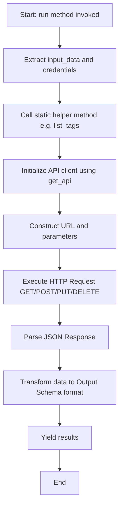

## 类结构

```
Block (Parent Class)
├── GithubListTagsBlock
├── GithubListBranchesBlock
├── GithubListDiscussionsBlock
├── GithubListReleasesBlock
├── GithubReadFileBlock
├── GithubReadFolderBlock
├── GithubMakeBranchBlock
├── GithubDeleteBranchBlock
├── GithubCreateFileBlock
├── GithubUpdateFileBlock
├── GithubCreateRepositoryBlock
└── GithubListStargazersBlock
```

## 全局变量及字段


### `GithubListTagsBlock.Input.credentials`
    
GitHub repository credentials for authentication

类型：`GithubCredentialsInput`
    


### `GithubListTagsBlock.Input.repo_url`
    
URL of the GitHub repository

类型：`str`
    


### `GithubListTagsBlock.Output.tag`
    
Tags with their name and file tree browser URL

类型：`TagItem`
    


### `GithubListTagsBlock.Output.tags`
    
List of tags with their name and file tree browser URL

类型：`list[TagItem]`
    


### `GithubListBranchesBlock.Input.credentials`
    
GitHub repository credentials for authentication

类型：`GithubCredentialsInput`
    


### `GithubListBranchesBlock.Input.repo_url`
    
URL of the GitHub repository

类型：`str`
    


### `GithubListBranchesBlock.Output.branch`
    
Branches with their name and file tree browser URL

类型：`BranchItem`
    


### `GithubListBranchesBlock.Output.branches`
    
List of branches with their name and file tree browser URL

类型：`list[BranchItem]`
    


### `GithubListDiscussionsBlock.Input.credentials`
    
GitHub repository credentials for authentication

类型：`GithubCredentialsInput`
    


### `GithubListDiscussionsBlock.Input.repo_url`
    
URL of the GitHub repository

类型：`str`
    


### `GithubListDiscussionsBlock.Input.num_discussions`
    
Number of discussions to fetch

类型：`int`
    


### `GithubListDiscussionsBlock.Output.discussion`
    
Discussions with their title and URL

类型：`DiscussionItem`
    


### `GithubListDiscussionsBlock.Output.discussions`
    
List of discussions with their title and URL

类型：`list[DiscussionItem]`
    


### `GithubListDiscussionsBlock.Output.error`
    
Error message if listing discussions failed

类型：`str`
    


### `GithubListReleasesBlock.Input.credentials`
    
GitHub repository credentials for authentication

类型：`GithubCredentialsInput`
    


### `GithubListReleasesBlock.Input.repo_url`
    
URL of the GitHub repository

类型：`str`
    


### `GithubListReleasesBlock.Output.release`
    
Releases with their name and file tree browser URL

类型：`ReleaseItem`
    


### `GithubListReleasesBlock.Output.releases`
    
List of releases with their name and file tree browser URL

类型：`list[ReleaseItem]`
    


### `GithubReadFileBlock.Input.credentials`
    
GitHub repository credentials for authentication

类型：`GithubCredentialsInput`
    


### `GithubReadFileBlock.Input.repo_url`
    
URL of the GitHub repository

类型：`str`
    


### `GithubReadFileBlock.Input.file_path`
    
Path to the file in the repository

类型：`str`
    


### `GithubReadFileBlock.Input.branch`
    
Branch to read from

类型：`str`
    


### `GithubReadFileBlock.Output.text_content`
    
Content of the file (decoded as UTF-8 text)

类型：`str`
    


### `GithubReadFileBlock.Output.raw_content`
    
Raw base64-encoded content of the file

类型：`str`
    


### `GithubReadFileBlock.Output.size`
    
The size of the file (in bytes)

类型：`int`
    


### `GithubReadFolderBlock.Input.credentials`
    
GitHub repository credentials for authentication

类型：`GithubCredentialsInput`
    


### `GithubReadFolderBlock.Input.repo_url`
    
URL of the GitHub repository

类型：`str`
    


### `GithubReadFolderBlock.Input.folder_path`
    
Path to the folder in the repository

类型：`str`
    


### `GithubReadFolderBlock.Input.branch`
    
Branch name to read from (defaults to master)

类型：`str`
    


### `GithubReadFolderBlock.Output.file`
    
Files in the folder

类型：`FileEntry`
    


### `GithubReadFolderBlock.Output.dir`
    
Directories in the folder

类型：`DirEntry`
    


### `GithubReadFolderBlock.Output.error`
    
Error message if reading the folder failed

类型：`str`
    


### `GithubMakeBranchBlock.Input.credentials`
    
GitHub repository credentials for authentication

类型：`GithubCredentialsInput`
    


### `GithubMakeBranchBlock.Input.repo_url`
    
URL of the GitHub repository

类型：`str`
    


### `GithubMakeBranchBlock.Input.new_branch`
    
Name of the new branch

类型：`str`
    


### `GithubMakeBranchBlock.Input.source_branch`
    
Name of the source branch

类型：`str`
    


### `GithubMakeBranchBlock.Output.status`
    
Status of the branch creation operation

类型：`str`
    


### `GithubMakeBranchBlock.Output.error`
    
Error message if the branch creation failed

类型：`str`
    


### `GithubDeleteBranchBlock.Input.credentials`
    
GitHub repository credentials for authentication

类型：`GithubCredentialsInput`
    


### `GithubDeleteBranchBlock.Input.repo_url`
    
URL of the GitHub repository

类型：`str`
    


### `GithubDeleteBranchBlock.Input.branch`
    
Name of the branch to delete

类型：`str`
    


### `GithubDeleteBranchBlock.Output.status`
    
Status of the branch deletion operation

类型：`str`
    


### `GithubDeleteBranchBlock.Output.error`
    
Error message if the branch deletion failed

类型：`str`
    


### `GithubCreateFileBlock.Input.credentials`
    
GitHub repository credentials for authentication

类型：`GithubCredentialsInput`
    


### `GithubCreateFileBlock.Input.repo_url`
    
URL of the GitHub repository

类型：`str`
    


### `GithubCreateFileBlock.Input.file_path`
    
Path where the file should be created

类型：`str`
    


### `GithubCreateFileBlock.Input.content`
    
Content to write to the file

类型：`str`
    


### `GithubCreateFileBlock.Input.branch`
    
Branch where the file should be created

类型：`str`
    


### `GithubCreateFileBlock.Input.commit_message`
    
Message for the commit

类型：`str`
    


### `GithubCreateFileBlock.Output.url`
    
URL of the created file

类型：`str`
    


### `GithubCreateFileBlock.Output.sha`
    
SHA of the commit

类型：`str`
    


### `GithubCreateFileBlock.Output.error`
    
Error message if the file creation failed

类型：`str`
    


### `GithubUpdateFileBlock.Input.credentials`
    
GitHub repository credentials for authentication

类型：`GithubCredentialsInput`
    


### `GithubUpdateFileBlock.Input.repo_url`
    
URL of the GitHub repository

类型：`str`
    


### `GithubUpdateFileBlock.Input.file_path`
    
Path to the file to update

类型：`str`
    


### `GithubUpdateFileBlock.Input.content`
    
New content for the file

类型：`str`
    


### `GithubUpdateFileBlock.Input.branch`
    
Branch containing the file

类型：`str`
    


### `GithubUpdateFileBlock.Input.commit_message`
    
Message for the commit

类型：`str`
    


### `GithubUpdateFileBlock.Output.url`
    
URL of the updated file

类型：`str`
    


### `GithubUpdateFileBlock.Output.sha`
    
SHA of the commit

类型：`str`
    


### `GithubCreateRepositoryBlock.Input.credentials`
    
GitHub repository credentials for authentication

类型：`GithubCredentialsInput`
    


### `GithubCreateRepositoryBlock.Input.name`
    
Name of the repository to create

类型：`str`
    


### `GithubCreateRepositoryBlock.Input.description`
    
Description of the repository

类型：`str`
    


### `GithubCreateRepositoryBlock.Input.private`
    
Whether the repository should be private

类型：`bool`
    


### `GithubCreateRepositoryBlock.Input.auto_init`
    
Whether to initialize the repository with a README

类型：`bool`
    


### `GithubCreateRepositoryBlock.Input.gitignore_template`
    
Git ignore template to use (e.g., Python, Node, Java)

类型：`str`
    


### `GithubCreateRepositoryBlock.Output.url`
    
URL of the created repository

类型：`str`
    


### `GithubCreateRepositoryBlock.Output.clone_url`
    
Git clone URL of the repository

类型：`str`
    


### `GithubCreateRepositoryBlock.Output.error`
    
Error message if the repository creation failed

类型：`str`
    


### `GithubListStargazersBlock.Input.credentials`
    
GitHub repository credentials for authentication

类型：`GithubCredentialsInput`
    


### `GithubListStargazersBlock.Input.repo_url`
    
URL of the GitHub repository

类型：`str`
    


### `GithubListStargazersBlock.Output.stargazer`
    
Stargazers with their username and profile URL

类型：`StargazerItem`
    


### `GithubListStargazersBlock.Output.stargazers`
    
List of stargazers with their username and profile URL

类型：`list[StargazerItem]`
    


### `GithubListStargazersBlock.Output.error`
    
Error message if listing stargazers failed

类型：`str`
    
    

## 全局函数及方法


### `GithubListTagsBlock.__init__`

初始化该代码块，配置其唯一标识符、描述、分类、输入输出模式以及用于测试的输入、凭证、输出和模拟函数。

参数：

-  `self`：`GithubListTagsBlock`，类的实例本身

返回值：`None`，无返回值

#### 流程图

```mermaid
flowchart TD
    Start(["开始"] --> CallSuper["调用 super().__init__ 初始化父类 Block"])
    CallSuper --> PassParams["传递配置参数"]
    
    subgraph ConfigParams ["配置参数详情"]
        PassParams --> ID["设置 ID: 358924e7..."]
        PassParams --> Desc["设置描述: Description"]
        PassParams --> Category["设置分类: DEVELOPER_TOOLS"]
        PassParams --> Schemas["设置输入/输出模式: Input/Output Schema"]
        PassParams --> TestData["设置测试数据: Input/Credentials/Output/Mock"]
    end

    ConfigParams --> End(["结束"])
```

#### 带注释源码

```python
def __init__(self):
    super().__init__(
        # 定义该 Block 的唯一标识符
        id="358924e7-9a11-4d1a-a0f2-13c67fe59e2e",
        # 描述该 Block 的核心功能：列出指定 GitHub 仓库的所有标签
        description="This block lists all tags for a specified GitHub repository.",
        # 定义该 Block 所属的分类：开发者工具
        categories={BlockCategory.DEVELOPER_TOOLS},
        # 定义输入数据的 Schema 结构
        input_schema=GithubListTagsBlock.Input,
        # 定义输出数据的 Schema 结构
        output_schema=GithubListTagsBlock.Output,
        # 定义测试用的输入数据
        test_input={
            "repo_url": "https://github.com/owner/repo",
            "credentials": TEST_CREDENTIALS_INPUT,
        },
        # 定义测试用的凭证
        test_credentials=TEST_CREDENTIALS,
        # 定义预期的测试输出结果
        test_output=[
            (
                "tags",
                [
                    {
                        "name": "v1.0.0",
                        "url": "https://github.com/owner/repo/tree/v1.0.0",
                    }
                ],
            ),
            (
                "tag",
                {
                    "name": "v1.0.0",
                    "url": "https://github.com/owner/repo/tree/v1.0.0",
                },
            ),
        ],
        # 定义测试时的 Mock 函数，用于模拟 list_tags 方法的返回值
        test_mock={
            "list_tags": lambda *args, **kwargs: [
                {
                    "name": "v1.0.0",
                    "url": "https://github.com/owner/repo/tree/v1.0.0",
                }
            ]
        },
    )
```


### `GithubListTagsBlock.list_tags`

获取指定 GitHub 仓库的所有标签，构造包含标签名称和文件树浏览器 URL 的对象列表。

参数：

- `credentials`：`GithubCredentials`，用于访问 GitHub API 的认证凭据对象。
- `repo_url`：`str`，目标 GitHub 仓库的 URL（例如 "https://github.com/owner/repo"）。

返回值：`list[Output.TagItem]`，返回一个列表，其中包含字典（TypedDict），每个字典表示一个标签，包含标签名称和对应的浏览器 URL。

#### 流程图

```mermaid
flowchart TD
    A[开始] --> B[通过 get_api 初始化 API 客户端]
    B --> C[构造 Tags API URL: repo_url + /tags]
    C --> D[执行异步 GET 请求]
    D --> E[解析响应 JSON 数据]
    E --> F[处理 URL 提取仓库路径: owner/repo]
    F --> G[遍历返回的标签数据列表]
    G --> H[构造 TagItem: {name, url}]
    H --> I[返回处理后的 tags 列表]
    I --> J[结束]
```

#### 带注释源码

```python
    @staticmethod
    async def list_tags(
        credentials: GithubCredentials, repo_url: str
    ) -> list[Output.TagItem]:
        # 通过凭据获取 API 客户端实例
        api = get_api(credentials)
        
        # 拼接获取仓库 Tags 的 API 端点 URL
        tags_url = repo_url + "/tags"
        
        # 发送异步 GET 请求到 GitHub API
        response = await api.get(tags_url)
        
        # 将响应体解析为 JSON 格式的数据
        data = response.json()
        
        # 从仓库 URL 中提取路径部分 (例如将 "https://github.com/owner/repo" 转换为 "owner/repo")
        repo_path = repo_url.replace("https://github.com/", "")
        
        # 使用列表推导式遍历数据，构造包含标签名称和浏览器 URL 的对象列表
        tags: list[GithubListTagsBlock.Output.TagItem] = [
            {
                # 获取标签的名称 (如 "v1.0.0")
                "name": tag["name"],
                # 拼接生成该标签的 GitHub 文件树浏览器访问链接
                "url": f"https://github.com/{repo_path}/tree/{tag['name']}",
            }
            for tag in data
        ]
        
        # 返回构造好的标签列表
        return tags
```


### `GithubListTagsBlock.run`

该方法负责执行获取指定GitHub仓库标签列表的核心逻辑，首先获取所有标签并输出完整列表，随后逐个遍历标签以输出单个标签详情。

参数：

-  `input_data`：`Input`，包含执行该块所需的输入数据，例如仓库URL。
-  `credentials`：`GithubCredentials`，用于认证的GitHub凭证对象。
-  `**kwargs`：`Any`，扩展用的关键字参数。

返回值：`BlockOutput`，一个异步生成器，产生包含输出名称和对应数据的元组。

#### 流程图

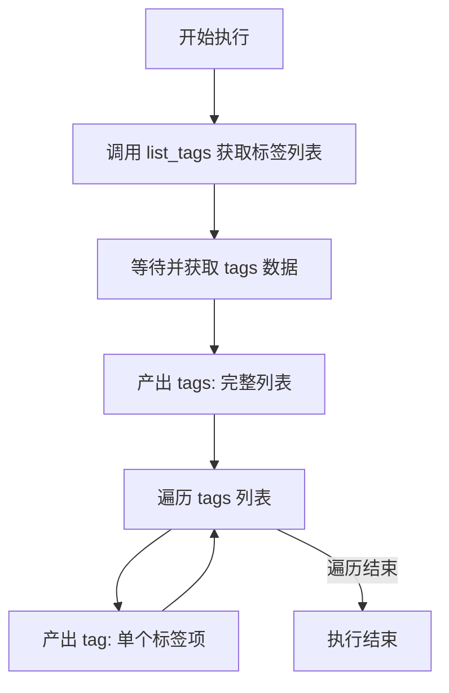

#### 带注释源码

```python
    async def run(
        self,
        input_data: Input,  # 输入数据，包含 repo_url 等信息
        *,
        credentials: GithubCredentials,  # GitHub 认证凭证
        **kwargs,  # 其他可选关键字参数
    ) -> BlockOutput:  # 返回类型为块输出生成器
        # 调用静态方法 list_tags 异步获取标签列表
        tags = await self.list_tags(
            credentials,
            input_data.repo_url,
        )
        
        # 产出 "tags" 键，对应的值为获取到的标签列表
        yield "tags", tags
        
        # 遍历标签列表，逐个产出 "tag" 键，对应的值为单个标签对象
        for tag in tags:
            yield "tag", tag
```


### `GithubListBranchesBlock.__init__`

该方法是 `GithubListBranchesBlock` 类的构造函数，用于初始化列出 GitHub 仓库分支的功能块。它通过调用父类 `Block` 的构造函数，配置了该块的唯一标识符、描述信息、所属分类、输入输出数据结构（Schema）以及用于测试的模拟数据。

参数：

- `self`：`GithubListBranchesBlock`，类的实例本身。

返回值：`None`，无返回值。

#### 流程图

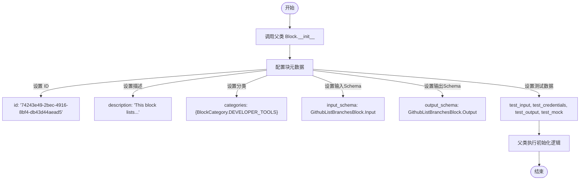

#### 带注释源码

```python
def __init__(self):
    # 调用父类 Block 的构造函数，传入核心配置参数
    super().__init__(
        # 块的唯一标识符 (UUID)
        id="74243e49-2bec-4916-8bf4-db43d44aead5",
        # 块的功能描述文本
        description="This block lists all branches for a specified GitHub repository.",
        # 块所属的分类，此处为开发者工具
        categories={BlockCategory.DEVELOPER_TOOLS},
        # 定义输入数据的结构，包含 credentials 和 repo_url
        input_schema=GithubListBranchesBlock.Input,
        # 定义输出数据的结构，包含 branch 和 branches
        output_schema=GithubListBranchesBlock.Output,
        # 定义单元测试使用的输入数据
        test_input={
            "repo_url": "https://github.com/owner/repo",
            "credentials": TEST_CREDENTIALS_INPUT,
        },
        # 定义单元测试使用的凭证
        test_credentials=TEST_CREDENTIALS,
        # 定义单元测试期望的输出数据
        test_output=[
            (
                "branches",
                [
                    {
                        "name": "main",
                        "url": "https://github.com/owner/repo/tree/main",
                    }
                ],
            ),
            (
                "branch",
                {
                    "name": "main",
                    "url": "https://github.com/owner/repo/tree/main",
                },
            ),
        ],
        # 定义模拟执行逻辑，用于在测试中模拟 'list_branches' 方法的返回值
        test_mock={
            "list_branches": lambda *args, **kwargs: [
                {
                    "name": "main",
                    "url": "https://github.com/owner/repo/tree/main",
                }
            ]
        },
    )
```


### `GithubListBranchesBlock.list_branches`

该方法通过 GitHub API 获取指定仓库的所有分支信息，并将其转换为包含分支名称和文件树浏览器 URL 的列表返回。

参数：

-   `credentials`：`GithubCredentials`，用于认证的 GitHub 凭据对象。
-   `repo_url`：`str`，GitHub 仓库的 URL（例如：`https://github.com/owner/repo`）。

返回值：`list[GithubListBranchesBlock.Output.BranchItem]`，包含分支名称和 URL 的字典列表。

#### 流程图

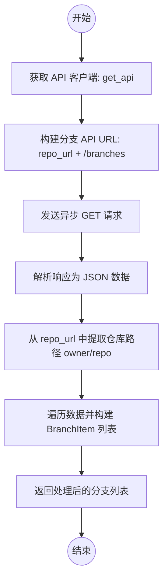

#### 带注释源码

```python
@staticmethod
async def list_branches(
    credentials: GithubCredentials, repo_url: str
) -> list[Output.BranchItem]:
    # 1. 根据提供的凭据获取 GitHub API 客户端实例
    api = get_api(credentials)

    # 2. 构建获取分支列表的 API 端点 URL
    branches_url = repo_url + "/branches"

    # 3. 发送异步 GET 请求以获取分支数据
    response = await api.get(branches_url)

    # 4. 将响应体解析为 JSON 格式
    data = response.json()

    # 5. 从仓库 URL 中提取路径部分 (例如 "owner/repo")，用于后续构建浏览器 URL
    repo_path = repo_url.replace("https://github.com/", "")

    # 6. 遍历获取到的分支数据，提取名称并构建浏览器可访问的 URL
    branches: list[GithubListBranchesBlock.Output.BranchItem] = [
        {
            "name": branch["name"],  # 分支名称
            "url": f"https://github.com/{repo_path}/tree/{branch['name']}",  # 文件树浏览器 URL
        }
        for branch in data
    ]

    # 7. 返回构建好的分支列表
    return branches
```


### `GithubListBranchesBlock.run`

执行获取并输出指定 GitHub 仓库分支列表的核心逻辑，分别输出完整的分支列表和单个分支项。

参数：

-  `self`：`GithubListBranchesBlock`，类实例本身
-  `input_data`：`Input`，包含 `repo_url` 等输入数据的对象
-  `credentials`：`GithubCredentials`，用于进行 GitHub API 认证的凭据对象
-  `**kwargs`：`dict`，其他关键字参数

返回值：`BlockOutput`，异步生成器，产生包含分支数据的元组（键, 值）

#### 流程图

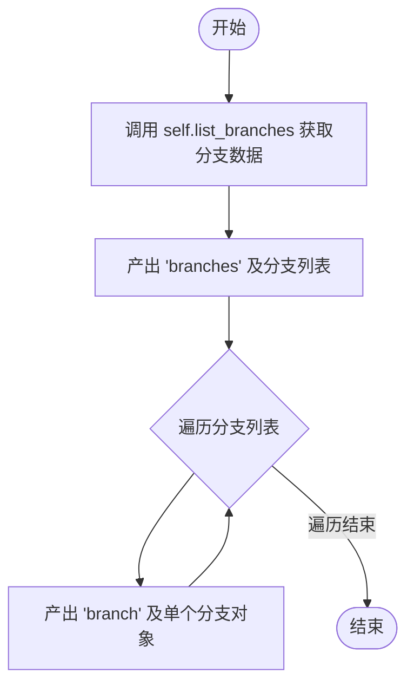

#### 带注释源码

```python
    async def run(
        self,
        input_data: Input,
        *,
        credentials: GithubCredentials,
        **kwargs,
    ) -> BlockOutput:
        # 调用静态方法 list_branches，传入凭据和仓库URL，获取分支列表
        branches = await self.list_branches(
            credentials,
            input_data.repo_url,
        )
        # 输出完整的分支列表，键名为 "branches"
        yield "branches", branches
        # 遍历每个分支，逐个输出，键名为 "branch"
        for branch in branches:
            yield "branch", branch
```


### `GithubListDiscussionsBlock.__init__`

初始化 GitHub Discussions 列表块，设置其 ID、描述、分类、输入输出模式以及测试相关配置。

参数：

- `self`：`GithubListDiscussionsBlock`，实例对象本身

返回值：`None`，无返回值

#### 流程图

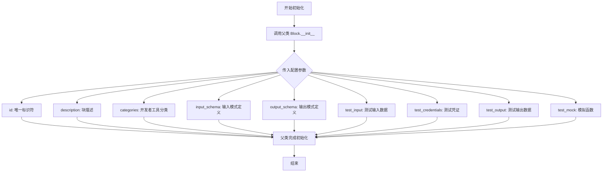

#### 带注释源码

```python
    def __init__(self):
        super().__init__(
            # 块的唯一标识符 UUID
            id="3ef1a419-3d76-4e07-b761-de9dad4d51d7",
            # 块的功能描述，用于说明该块列出指定仓库的最近讨论
            description="This block lists recent discussions for a specified GitHub repository.",
            # 块所属的分类，这里归类为开发者工具
            categories={BlockCategory.DEVELOPER_TOOLS},
            # 定义输入数据的模式，包含凭证、仓库 URL 和讨论数量
            input_schema=GithubListDiscussionsBlock.Input,
            # 定义输出数据的模式，包含讨论列表、单个讨论和错误信息
            output_schema=GithubListDiscussionsBlock.Output,
            # 测试用的输入数据，模拟真实的请求参数
            test_input={
                "repo_url": "https://github.com/owner/repo",
                "num_discussions": 3,
                "credentials": TEST_CREDENTIALS_INPUT,
            },
            # 测试用的凭证对象
            test_credentials=TEST_CREDENTIALS,
            # 期望的测试输出结果，用于验证功能正确性
            test_output=[
                (
                    "discussions",
                    [
                        {
                            "title": "Discussion 1",
                            "url": "https://github.com/owner/repo/discussions/1",
                        }
                    ],
                ),
                (
                    "discussion",
                    {
                        "title": "Discussion 1",
                        "url": "https://github.com/owner/repo/discussions/1",
                    },
                ),
            ],
            # 测试时的模拟函数，用于模拟 API 调用行为
            test_mock={
                "list_discussions": lambda *args, **kwargs: [
                    {
                        "title": "Discussion 1",
                        "url": "https://github.com/owner/repo/discussions/1",
                    }
                ]
            },
        )
```


### `GithubListDiscussionsBlock.list_discussions`

该方法是一个静态异步方法，用于通过 GitHub GraphQL API 获取指定仓库的讨论列表。

参数：

-   `credentials`：`GithubCredentials`，GitHub 认证凭据，用于授权 API 请求。
-   `repo_url`：`str`，GitHub 仓库的 URL（例如：https://github.com/owner/repo）。
-   `num_discussions`：`int`，需要获取的讨论数量。

返回值：`list[Output.DiscussionItem]`，返回一个字典列表，其中每个字典包含讨论的标题（`title`）和 URL（`url`）。

#### 流程图

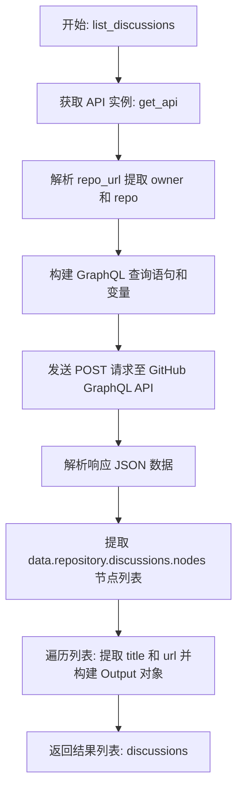

#### 带注释源码

```python
    @staticmethod
    async def list_discussions(
        credentials: GithubCredentials, repo_url: str, num_discussions: int
    ) -> list[Output.DiscussionItem]:
        # 1. 获取已配置认证信息的 API 客户端实例
        api = get_api(credentials)
        
        # 2. 从完整的仓库 URL 中提取路径部分 (例如 "owner/repo")
        repo_path = repo_url.replace("https://github.com/", "")
        
        # 3. 将路径分割为所有者 (owner) 和仓库名 (repo)
        owner, repo = repo_path.split("/")
        
        # 4. 定义 GraphQL 查询语句，请求仓库的讨论标题和 URL，并限制返回数量
        query = """
        query($owner: String!, $repo: String!, $num: Int!) {
            repository(owner: $owner, name: $repo) {
                discussions(first: $num) {
                    nodes {
                        title
                        url
                    }
                }
            }
        }
        """
        
        # 5. 准备查询所需的变量
        variables = {"owner": owner, "repo": repo, "num": num_discussions}
        
        # 6. 向 GitHub GraphQL API 端点发送 POST 请求
        response = await api.post(
            "https://api.github.com/graphql",
            json={"query": query, "variables": variables},
        )
        
        # 7. 解析响应内容为 JSON 格式
        data = response.json()
        
        # 8. 遍历查询结果，提取 title 和 url，并构建符合 Output.DiscussionItem 格式的对象列表
        discussions: list[GithubListDiscussionsBlock.Output.DiscussionItem] = [
            {"title": discussion["title"], "url": discussion["url"]}
            for discussion in data["data"]["repository"]["discussions"]["nodes"]
        ]
        
        # 9. 返回处理后的讨论列表
        return discussions
```


### `GithubListDiscussionsBlock.run`

该方法负责获取指定 GitHub 仓库的讨论列表。它通过调用 `list_discussions` 静态方法利用提供的凭证和仓库 URL 获取数据，首先产出完整的讨论列表，随后遍历列表逐个产出每一条讨论的详细信息。

参数：

- `input_data`：`Input`，包含仓库 URL (`repo_url`) 和要获取的讨论数量 (`num_discussions`) 的输入数据结构。
- `credentials`：`GithubCredentials`，用于进行 GitHub API 认证的凭证对象。
- `**kwargs`：`dict`，额外的关键字参数，用于扩展性传递。

返回值：`BlockOutput`，一个异步生成器，产出键值对形式的元组，包含讨论列表 (`discussions`) 和单个讨论项 (`discussion`)。

#### 流程图

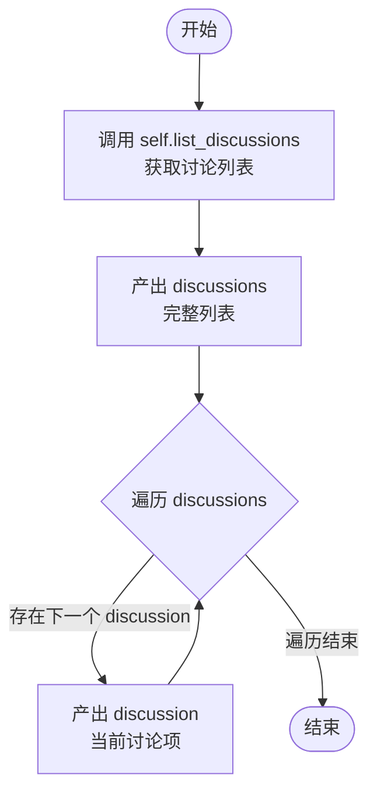

#### 带注释源码

```python
async def run(
    self,
    input_data: Input,
    *,
    credentials: GithubCredentials,
    **kwargs,
) -> BlockOutput:
    # 调用静态方法获取讨论列表，传入凭证、仓库URL和数量限制
    discussions = await self.list_discussions(
        credentials,
        input_data.repo_url,
        input_data.num_discussions,
    )
    
    # 产出 "discussions" 键，对应完整的讨论列表
    yield "discussions", discussions
    
    # 遍历讨论列表，逐个产出 "discussion" 键，对应单个讨论对象
    for discussion in discussions:
        yield "discussion", discussion
```


### `GithubListReleasesBlock.__init__`

该方法是 `GithubListReleasesBlock` 类的构造函数，负责初始化块的基本属性。它配置了块的唯一标识符、描述信息、分类、输入输出模式，以及用于测试的模拟数据、凭证和预期输出，最终通过调用父类 `Block` 的构造函数完成注册。

参数：

- `self`：`GithubListReleasesBlock`，类的实例本身。

返回值：`None`，构造函数没有返回值，但会完成实例的初始化配置。

#### 流程图

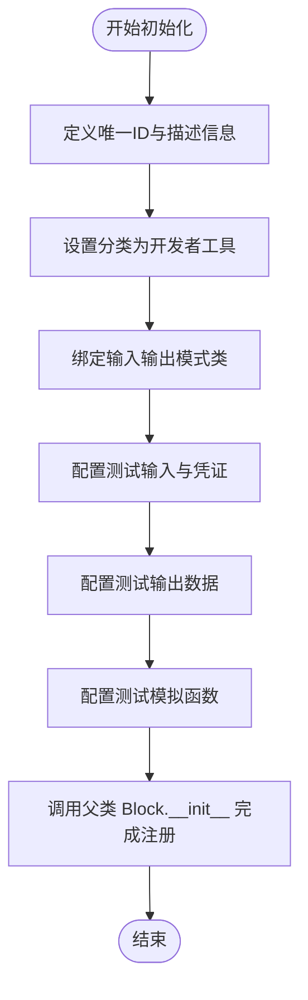

#### 带注释源码

```python
def __init__(self):
    # 调用父类 Block 的构造函数，传入配置参数
    super().__init__(
        # 块的唯一标识符 (UUID)
        id="3460367a-6ba7-4645-8ce6-47b05d040b92",
        # 块的功能描述
        description="This block lists all releases for a specified GitHub repository.",
        # 块所属的分类，此处为开发者工具
        categories={BlockCategory.DEVELOPER_TOOLS},
        # 指定输入数据的结构定义类
        input_schema=GithubListReleasesBlock.Input,
        # 指定输出数据的结构定义类
        output_schema=GithubListReleasesBlock.Output,
        # 定义用于测试的输入数据，包含仓库 URL 和测试凭证
        test_input={
            "repo_url": "https://github.com/owner/repo",
            "credentials": TEST_CREDENTIALS_INPUT,
        },
        # 定义用于测试的凭证对象
        test_credentials=TEST_CREDENTIALS,
        # 定义预期的测试输出结果，包含 releases 列表和单个 release 对象
        test_output=[
            (
                "releases",
                [
                    {
                        "name": "v1.0.0",
                        "url": "https://github.com/owner/repo/releases/tag/v1.0.0",
                    }
                ],
            ),
            (
                "release",
                {
                    "name": "v1.0.0",
                    "url": "https://github.com/owner/repo/releases/tag/v1.0.0",
                },
            ),
        ],
        # 定义测试时的模拟函数，替代实际的 API 调用
        test_mock={
            "list_releases": lambda *args, **kwargs: [
                {
                    "name": "v1.0.0",
                    "url": "https://github.com/owner/repo/releases/tag/v1.0.0",
                }
            ]
        },
    )
```


### `GithubListReleasesBlock.list_releases`

该静态方法用于获取指定 GitHub 仓库的所有发布版本信息，并返回包含发布名称和 URL 的列表。

参数：

-  `credentials`：`GithubCredentials`，用于访问 GitHub API 的认证凭据。
-  `repo_url`：`str`，目标 GitHub 仓库的 URL。

返回值：`list[GithubListReleasesBlock.Output.ReleaseItem]`，包含发布名称及其对应的 HTML URL 的字典列表。

#### 流程图

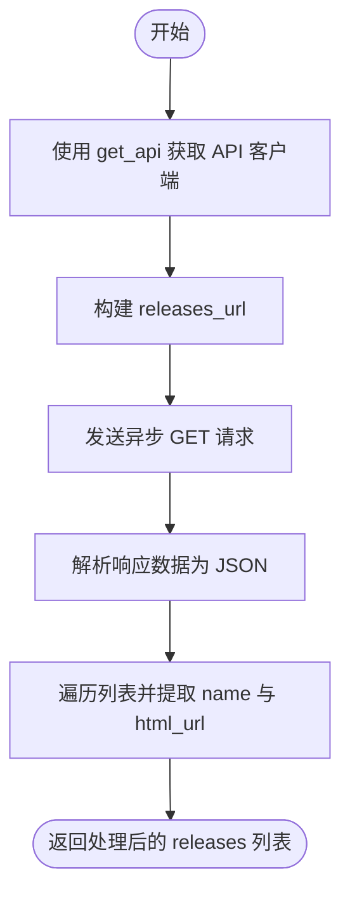

#### 带注释源码

```python
    @staticmethod
    async def list_releases(
        credentials: GithubCredentials, repo_url: str
    ) -> list[Output.ReleaseItem]:
        # 1. 根据提供的凭证初始化 API 客户端
        api = get_api(credentials)
        
        # 2. 拼接获取 Releases 的 API 地址
        releases_url = repo_url + "/releases"
        
        # 3. 发送异步 GET 请求获取数据
        response = await api.get(releases_url)
        
        # 4. 将响应体解析为 JSON 格式
        data = response.json()
        
        # 5. 提取关键信息，构建结构化的 ReleaseItem 列表
        releases: list[GithubListReleasesBlock.Output.ReleaseItem] = [
            {"name": release["name"], "url": release["html_url"]} for release in data
        ]
        
        # 6. 返回处理后的发布列表
        return releases
```


### `GithubListReleasesBlock.run`

该方法是 `GithubListReleasesBlock` 的核心执行函数，负责协调整个发布版本列表的获取与输出流程。它首先调用辅助方法获取指定仓库的所有发布版本数据，然后先输出完整的列表，随后逐个输出单个发布版本对象。

参数：

-  `input_data`：`Input`，包含执行所需的数据，具体包含 `credentials`（GitHub 凭据）和 `repo_url`（仓库地址）。
-  `credentials`：`GithubCredentials`，用于认证 GitHub API 请求的凭据对象。
-  `**kwargs`：`dict`，扩展的关键字参数，用于传递额外的上下文信息。

返回值：`BlockOutput`，一个异步生成器，按顺序产生键值对元组。首先产生包含所有发布版本的列表，然后针对列表中的每一项产生单个发布版本信息。

#### 流程图

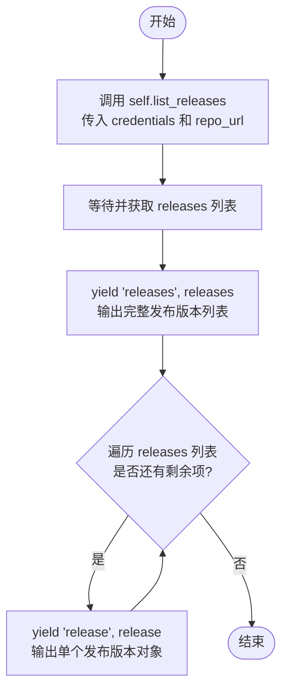

#### 带注释源码

```python
    async def run(
        self,
        input_data: Input,
        *,
        credentials: GithubCredentials,
        **kwargs,
    ) -> BlockOutput:
        # 调用静态方法 list_releases 获取指定仓库的所有发布版本
        # 传入认证凭据和从 input_data 中提取的仓库 URL
        releases = await self.list_releases(
            credentials,
            input_data.repo_url,
        )
        
        # 第一步输出：产出 "releases" 键对应的完整发布版本列表
        yield "releases", releases
        
        # 第二步输出：遍历获取到的发布版本列表
        for release in releases:
            # 逐个产出 "release" 键对应的单个发布版本对象
            yield "release", release
```


### `GithubReadFileBlock.__init__`

初始化 `GithubReadFileBlock` 实例，配置其元数据、输入/输出模式以及用于测试的模拟数据和预期结果。

参数：

- `self`: `GithubReadFileBlock`，表示类实例本身

返回值：`None`，无返回值

#### 流程图

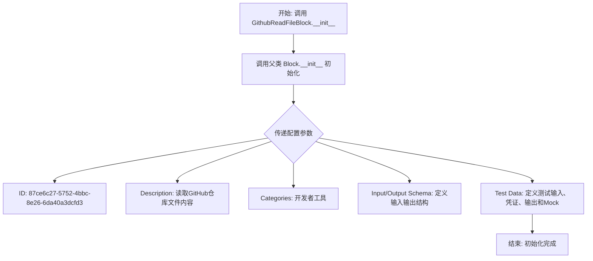

#### 带注释源码

```python
def __init__(self):
    # 调用父类 Block 的初始化方法，配置块的元数据和测试环境
    super().__init__(
        # 块的唯一标识符
        id="87ce6c27-5752-4bbc-8e26-6da40a3dcfd3",
        # 块的功能描述
        description="This block reads the content of a specified file from a GitHub repository.",
        # 块所属的分类
        categories={BlockCategory.DEVELOPER_TOOLS},
        # 定义输入数据的 Schema
        input_schema=GithubReadFileBlock.Input,
        # 定义输出数据的 Schema
        output_schema=GithubReadFileBlock.Output,
        # 定义测试用的输入数据
        test_input={
            "repo_url": "https://github.com/owner/repo",
            "file_path": "path/to/file",
            "branch": "master",
            "credentials": TEST_CREDENTIALS_INPUT,
        },
        # 定义测试用的凭证
        test_credentials=TEST_CREDENTIALS,
        # 定义预期的测试输出结果
        test_output=[
            ("raw_content", "RmlsZSBjb250ZW50"),
            ("text_content", "File content"),
            ("size", 13),
        ],
        # 定义测试时的模拟行为，避免实际调用 API
        test_mock={"read_file": lambda *args, **kwargs: ("RmlsZSBjb250ZW50", 13)},
    )
```


### `GithubReadFileBlock.read_file`

该静态方法通过 GitHub API 获取指定仓库中特定文件的内容和大小。它会构造 API 请求 URL，处理可能存在的多种响应结构（例如路径下包含多个条目的情况），验证目标对象确认为文件，并返回 Base64 编码的文件内容及字节大小。

参数：

- `credentials`：`GithubCredentials`，用于认证的 GitHub 凭证对象
- `repo_url`：`str`，GitHub 仓库的 URL
- `file_path`：`str`，仓库内文件的路径
- `branch`：`str`，要读取的分支名称

返回值：`tuple[str, int]`，包含 Base64 编码的文件内容和文件大小（字节）的元组

#### 流程图

```mermaid
flowchart TD
    A[开始] --> B[通过凭证获取 API 客户端]
    B --> C[构造 API URL: repo_url + /contents/file_path?ref=branch]
    C --> D[发送 GET 异步请求]
    D --> E[解析响应 JSON 数据]
    E --> F{数据是否为列表?}
    F -- 是 --> G[在列表中查找 type 为 file 的条目]
    G --> H{找到文件条目?}
    H -- 否 --> I[抛出 TypeError: Not a file]
    H -- 是 --> J[将 data 更新为该文件条目]
    J --> K{data['type'] 等于 'file'?}
    F -- 否 --> K
    K -- 否 --> I
    K -- 是 --> L[返回 data['content'], data['size']]
    L --> M[结束]
```

#### 带注释源码

```python
    @staticmethod
    async def read_file(
        credentials: GithubCredentials, repo_url: str, file_path: str, branch: str
    ) -> tuple[str, int]:
        # 初始化 API 客户端
        api = get_api(credentials)
        
        # 构造获取文件内容的 GitHub API URL，包含分支引用参数
        content_url = repo_url + f"/contents/{file_path}?ref={branch}"
        
        # 发送 GET 请求获取文件信息
        response = await api.get(content_url)
        data = response.json()

        # 检查返回的数据是否为列表
        if isinstance(data, list):
            # 如果是列表，说明该路径下可能包含多个条目（文件或目录）
            # 尝试找到类型为 'file' 的第一个条目
            if not (file := next((f for f in data if f["type"] == "file"), None)):
                raise TypeError("Not a file")
            data = file

        # 确保最终解析的数据类型确实是文件
        if data["type"] != "file":
            raise TypeError("Not a file")

        # 返回文件的 Base64 编码内容和大小
        return data["content"], data["size"]
```


### `GithubReadFileBlock.run`

该方法是 `GithubReadFileBlock` 的核心执行逻辑，负责协调输入数据、调用底层的文件读取接口，并将结果以生成器的形式输出，包括文件的原始内容、解码后的文本内容和文件大小。

参数：

- `input_data`：`Input`，包含仓库 URL (`repo_url`)、文件路径 (`file_path`) 和分支名 (`branch`) 的输入数据对象。
- `credentials`：`GithubCredentials`，用于认证访问 GitHub API 的凭据对象。
- `**kwargs`：`dict`，接收额外的关键字参数（通常用于传递上下文信息）。

返回值：`BlockOutput`，一个生成器，依次产生包含原始内容 (`raw_content`)、文本内容 (`text_content`) 和文件大小 (`size`) 的元组。

#### 流程图

```mermaid
flowchart TD
    A[开始: run 方法被调用] --> B[调用 self.read_file]
    B --> C[等待 read_file 返回<br>获取 content (base64) 和 size]
    C --> D[产出 'raw_content' 数据]
    D --> E[将 content 进行 base64 解码<br>并转为 UTF-8 字符串]
    E --> F[产出 'text_content' 数据]
    F --> G[产出 'size' 数据]
    G --> H[结束: 流程完成]
```

#### 带注释源码

```python
    async def run(
        self,
        input_data: Input,
        *,
        credentials: GithubCredentials,
        **kwargs,
    ) -> BlockOutput:
        # 调用静态方法 read_file 获取文件内容（Base64编码）和文件大小
        # 传入凭证、仓库地址、文件路径和分支名
        content, size = await self.read_file(
            credentials,
            input_data.repo_url,
            input_data.file_path,
            input_data.branch,
        )
        
        # 产出原始内容，即未经解码的 Base64 字符串
        yield "raw_content", content
        
        # 产出文本内容，将 Base64 字符串解码为字节，再转换为 UTF-8 文本
        yield "text_content", base64.b64decode(content).decode("utf-8")
        
        # 产出文件大小（以字节为单位）
        yield "size", size
```


### `GithubReadFolderBlock.__init__`

初始化 `GithubReadFolderBlock` 实例，配置该块用于读取 GitHub 仓库中指定文件夹的内容。此方法调用父类 `Block` 的构造函数，设置了块的唯一标识、描述、分类、输入输出 Schema 以及用于测试的模拟数据和预期输出。

参数：

-   `self`：`GithubReadFolderBlock`，类实例本身。

返回值：`None`，无返回值。

#### 流程图

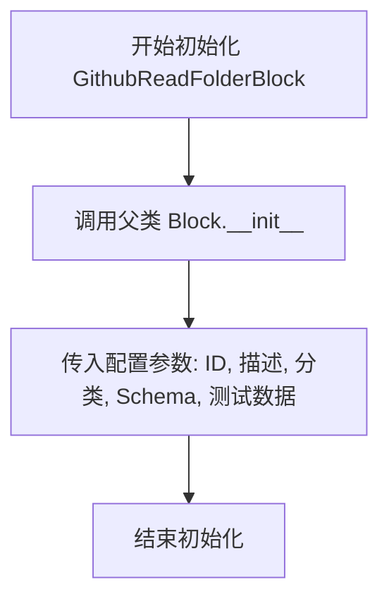

#### 带注释源码

```python
def __init__(self):
    super().__init__(
        id="1355f863-2db3-4d75-9fba-f91e8a8ca400",  # 块的唯一标识符
        description="This block reads the content of a specified folder from a GitHub repository.",  # 块的功能描述
        categories={BlockCategory.DEVELOPER_TOOLS},  # 块所属的分类，这里为开发者工具
        input_schema=GithubReadFolderBlock.Input,  # 定义输入数据的 Schema，包含凭证、仓库URL、文件夹路径和分支名
        output_schema=GithubReadFolderBlock.Output,  # 定义输出数据的 Schema，包含文件、目录和错误信息
        test_input={  # 定义用于测试的输入数据
            "repo_url": "https://github.com/owner/repo",
            "folder_path": "path/to/folder",
            "branch": "master",
            "credentials": TEST_CREDENTIALS_INPUT,
        },
        test_credentials=TEST_CREDENTIALS,  # 定义用于测试的凭证
        test_output=[  # 定义预期的测试输出结果
            (
                "file",
                {
                    "name": "file1.txt",
                    "path": "path/to/folder/file1.txt",
                    "size": 1337,
                },
            ),
            ("dir", {"name": "dir2", "path": "path/to/folder/dir2"}),
        ],
        test_mock={  # 定义模拟函数，用于在测试中替代实际的 API 调用
            "read_folder": lambda *args, **kwargs: (
                [
                    {
                        "name": "file1.txt",
                        "path": "path/to/folder/file1.txt",
                        "size": 1337,
                    }
                ],
                [{"name": "dir2", "path": "path/to/folder/dir2"}],
            )
        },
    )
```


### `GithubReadFolderBlock.read_folder`

该方法用于从 GitHub 仓库的指定分支读取特定文件夹的内容，并将解析出的文件和目录分别以结构化列表的形式返回。

参数：

- `credentials`：`GithubCredentials`，包含 GitHub 访问令牌的认证凭证。
- `repo_url`：`str`，GitHub 仓库的 URL 地址。
- `folder_path`：`str`，仓库中目标文件夹的路径。
- `branch`：`str`，指定读取的分支名称。

返回值：`tuple[list[Output.FileEntry], list[Output.DirEntry]]`，包含两个列表的元组，第一个列表包含文件条目（包含名称、路径、大小），第二个列表包含目录条目（包含名称、路径）。

#### 流程图

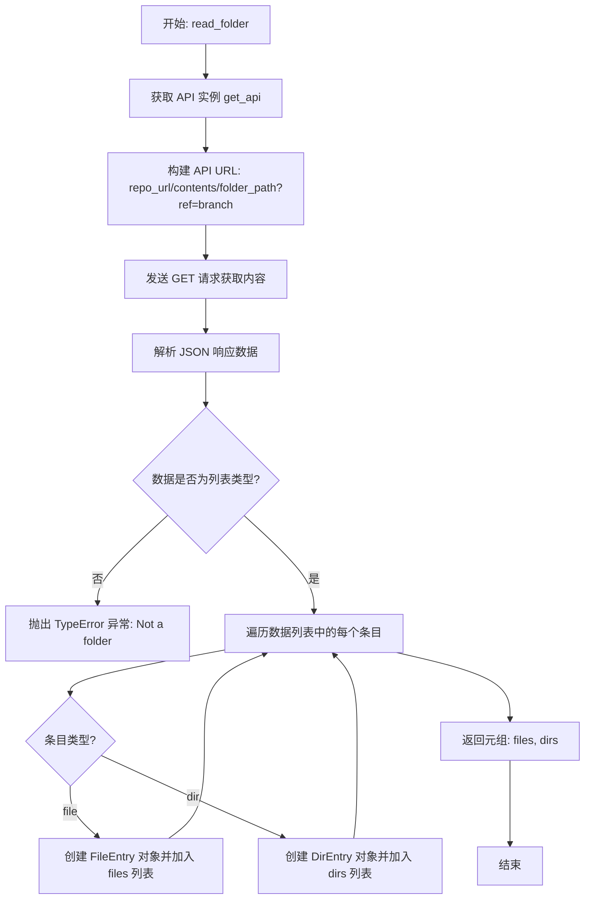

#### 带注释源码

```python
    @staticmethod
    async def read_folder(
        credentials: GithubCredentials, repo_url: str, folder_path: str, branch: str
    ) -> tuple[list[Output.FileEntry], list[Output.DirEntry]]:
        # 1. 根据凭证获取已配置的 API 客户端实例
        api = get_api(credentials)
        
        # 2. 构造获取文件夹内容的 API 端点 URL
        contents_url = repo_url + f"/contents/{folder_path}?ref={branch}"
        
        # 3. 异步发送 GET 请求获取文件夹内容
        response = await api.get(contents_url)
        
        # 4. 将响应体解析为 JSON 数据
        data = response.json()

        # 5. 验证返回的数据是否为列表（列表代表文件夹内容，字典代表单个文件）
        if not isinstance(data, list):
            raise TypeError("Not a folder")

        # 6. 筛选并构建文件列表
        files: list[GithubReadFolderBlock.Output.FileEntry] = [
            GithubReadFolderBlock.Output.FileEntry(
                name=entry["name"],  # 文件名
                path=entry["path"],  # 文件完整路径
                size=entry["size"],  # 文件大小（字节）
            )
            for entry in data
            if entry["type"] == "file"  # 仅处理类型为 file 的条目
        ]

        # 7. 筛选并构建目录列表
        dirs: list[GithubReadFolderBlock.Output.DirEntry] = [
            GithubReadFolderBlock.Output.DirEntry(
                name=entry["name"],  # 目录名
                path=entry["path"],  # 目录完整路径
            )
            for entry in data
            if entry["type"] == "dir"  # 仅处理类型为 dir 的条目
        ]

        # 8. 返回包含文件列表和目录列表的元组
        return files, dirs
```


### `GithubReadFolderBlock.run`

该方法是 `GithubReadFolderBlock` 的核心执行入口，负责协调从指定的 GitHub 仓库分支中读取特定文件夹的内容。它会调用辅助方法获取文件和目录列表，并将它们作为生成器的输出逐个返回。

参数：

-   `input_data`：`GithubReadFolderBlock.Input`，包含执行操作所需的输入数据，具体包括仓库 URL (`repo_url`)、文件夹路径 (`folder_path`) 和分支名称 (`branch`)。
-   `credentials`：`GithubCredentials`，用于身份验证的 GitHub 凭证对象，用于授权 API 请求。
-   `**kwargs`：`dict`，扩展关键字参数，用于传递其他可能的上下文信息。

返回值：`BlockOutput`，一个异步生成器，逐步产出包含文件详情（键名为 `file`）和目录详情（键名为 `dir`）的数据字典。

#### 流程图

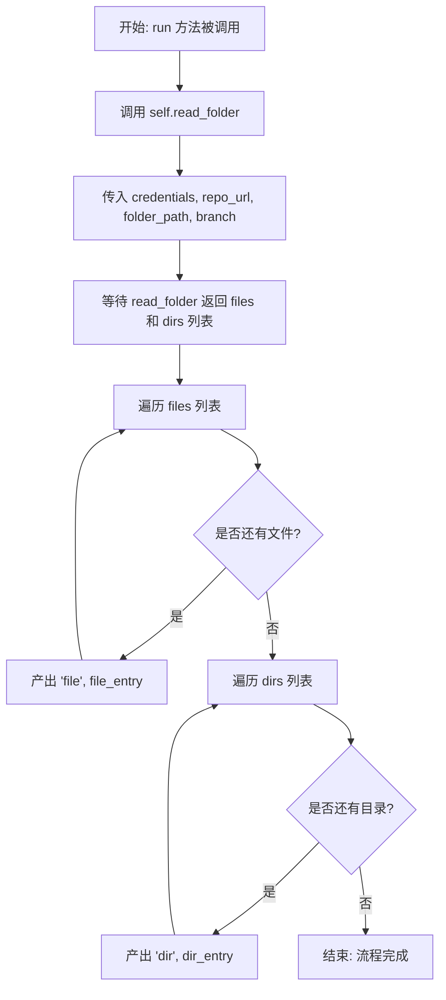

#### 带注释源码

```python
async def run(
    self,
    input_data: Input,
    *,
    credentials: GithubCredentials,
    **kwargs,
) -> BlockOutput:
    # 调用静态方法 read_folder 获取文件和目录列表
    # 使用 lstrip("/") 清理文件夹路径前可能存在的斜杠
    files, dirs = await self.read_folder(
        credentials,
        input_data.repo_url,
        input_data.folder_path.lstrip("/"),
        input_data.branch,
    )
    
    # 遍历获取到的文件列表，逐个产出文件信息
    for file in files:
        yield "file", file
        
    # 遍历获取到的目录列表，逐个产出目录信息
    for dir in dirs:
        yield "dir", dir
```


### `GithubMakeBranchBlock.__init__`

该方法用于初始化 `GithubMakeBranchBlock` 类实例，通过调用父类 `Block` 的初始化方法，配置该块的唯一标识符、描述、分类、输入输出模式、以及用于测试的模拟数据。

参数：

-  `self`：`GithubMakeBranchBlock`，类实例自身，在实例化时自动传递。

返回值：`None`，构造函数通常不返回值，主要完成对象的初始化配置。

#### 流程图

```mermaid
graph TD
    A[Start: __init__] --> B[设置 Block ID]
    B --> C[设置 Block 描述]
    C --> D[设置 Block 分类]
    D --> E[设置 Input Schema]
    E --> F[设置 Output Schema]
    F --> G[设置测试输入数据]
    G --> H[设置测试凭证]
    H --> I[设置测试输出数据]
    I --> J[设置测试 Mock 函数]
    J --> K[调用 super().__init__ 传递所有配置]
    K --> L[End: 初始化完成]
```

#### 带注释源码

```python
    def __init__(self):
        # 调用父类 Block 的初始化方法，传入元数据和配置
        super().__init__(
            # 块的唯一标识符 (UUID)
            id="944cc076-95e7-4d1b-b6b6-b15d8ee5448d",
            # 块的功能描述文本
            description="This block creates a new branch from a specified source branch.",
            # 块所属的分类集合，此处归为开发者工具
            categories={BlockCategory.DEVELOPER_TOOLS},
            # 定义输入数据的结构模式，引用嵌套类 Input
            input_schema=GithubMakeBranchBlock.Input,
            # 定义输出数据的结构模式，引用嵌套类 Output
            output_schema=GithubMakeBranchBlock.Output,
            # 定义用于单元测试的输入参数样本
            test_input={
                "repo_url": "https://github.com/owner/repo",
                "new_branch": "new_branch_name",
                "source_branch": "source_branch_name",
                "credentials": TEST_CREDENTIALS_INPUT,
            },
            # 定义用于单元测试的认证凭证
            test_credentials=TEST_CREDENTIALS,
            # 定义预期的单元测试输出结果
            test_output=[("status", "Branch created successfully")],
            # 定义测试时的 Mock 函数，用于模拟 API 响应而不进行实际网络调用
            test_mock={
                "create_branch": lambda *args, **kwargs: "Branch created successfully"
            },
        )
```


### `GithubMakeBranchBlock.create_branch`

该静态方法用于在指定的GitHub仓库中基于源分支创建一个新分支。它首先通过API获取源分支的最新提交SHA值，然后使用该SHA值创建一个新的Git引用。

参数：

-   `credentials`：`GithubCredentials`，包含访问GitHub仓库所需的认证凭据。
-   `repo_url`：`str`，GitHub仓库的URL地址（例如 https://github.com/owner/repo）。
-   `new_branch`：`str`，待创建的新分支的名称。
-   `source_branch`：`str`，作为新分支起点的源分支名称。

返回值：`str`，表示分支创建操作成功的状态信息（"Branch created successfully"）。

#### 流程图

```mermaid
flowchart TD
    A[开始: create_branch] --> B[获取 API 客户端实例]
    B --> C[构建源分支引用 URL<br>/git/refs/heads/{source_branch}]
    C --> D[发送 GET 请求获取源分支信息]
    D --> E[解析响应数据并提取 SHA 值]
    E --> F[构建创建引用的 URL<br>/git/refs]
    F --> G[准备请求体<br>包含 refs/heads/{new_branch} 和 SHA]
    G --> H[发送 POST 请求创建新分支]
    H --> I[返回成功状态信息]
```

#### 带注释源码

```python
    @staticmethod
    async def create_branch(
        credentials: GithubCredentials,
        repo_url: str,
        new_branch: str,
        source_branch: str,
    ) -> str:
        # 1. 使用提供的凭据初始化 API 客户端
        api = get_api(credentials)
        
        # 2. 构建获取源分支引用信息的 URL
        ref_url = repo_url + f"/git/refs/heads/{source_branch}"
        
        # 3. 发送 GET 请求获取源分支的最新提交 SHA
        response = await api.get(ref_url)
        data = response.json()
        
        # 4. 提取源分支的 SHA 哈希值，这是新分支的起点
        sha = data["object"]["sha"]

        # 5. 准备创建新分支的请求
        new_ref_url = repo_url + "/git/refs"
        data = {
            "ref": f"refs/heads/{new_branch}", # 定义新分支的完整引用路径
            "sha": sha,                        # 指向源分支的当前提交
        }
        
        # 6. 发送 POST 请求以在仓库中创建新的引用
        response = await api.post(new_ref_url, json=data)
        
        # 7. 返回操作成功的消息
        return "Branch created successfully"
```


### `GithubMakeBranchBlock.run`

该方法是执行创建新分支逻辑的入口点，负责协调输入数据的提取、调用底层API接口以及返回执行状态。

参数：

-  `input_data`：`Input`，包含目标仓库URL、新分支名称和源分支名称的输入数据对象。
-  `credentials`：`GithubCredentials`，用于GitHub API认证的凭据对象。
-  `**kwargs`：`Any`，扩展的关键字参数，用于接收额外的上下文信息。

返回值：`BlockOutput`，一个异步生成器，逐步产生执行结果数据块。

#### 流程图

```mermaid
flowchart TD
    A[开始: run方法调用] --> B[接收 input_data 和 credentials]
    B --> C[从 input_data 提取 repo_url, new_branch, source_branch]
    C --> D[调用 await self.create_branch]
    D --> E{API调用是否成功?}
    E -- 成功 --> F[获取返回的 status 字符串]
    E -- 失败 --> G[抛出异常或返回错误信息]
    F --> H[Yield 输出 'status' 和 status 字符串]
    H --> I[结束]
```

#### 带注释源码

```python
    async def run(
        self,
        input_data: Input,
        *,
        credentials: GithubCredentials,
        **kwargs,
    ) -> BlockOutput:
        # 调用静态方法 create_branch 执行实际的分支创建操作
        # 传入认证信息、仓库地址、新分支名和源分支名
        status = await self.create_branch(
            credentials,
            input_data.repo_url,
            input_data.new_branch,
            input_data.source_branch,
        )
        # 将操作状态通过生成器 yield 出去，键名为 "status"
        yield "status", status
```


### `GithubDeleteBranchBlock.__init__`

该方法用于初始化 `GithubDeleteBranchBlock` 类，设置块的唯一标识符、描述信息、分类、输入输出模式以及用于测试的模拟数据和预期结果。

参数：

- `self`：`GithubDeleteBranchBlock`，类的实例

返回值：`None`，无返回值

#### 流程图

```mermaid
flowchart TD
    A[开始: GithubDeleteBranchBlock.__init__] --> B[调用父类 Block.__init__ 初始化]
    B --> C[传入块ID '0d4130f7-e0ab-4d55-adc3-0a40225e80f4']
    B --> D[传入描述 'This block deletes a specified branch.']
    B --> E[传入分类 BlockCategory.DEVELOPER_TOOLS]
    B --> F[传入输入模式 GithubDeleteBranchBlock.Input]
    B --> G[传入输出模式 GithubDeleteBranchBlock.Output]
    B --> H[传入测试输入 test_input]
    B --> I[传入测试凭证 test_credentials]
    B --> J[传入测试输出 test_output]
    B --> K[传入测试模拟 test_mock]
    K --> L[结束]
```

#### 带注释源码

```python
    def __init__(self):
        # 调用父类 Block 的初始化方法，配置该块的基本属性和行为
        super().__init__(
            # 块的唯一标识符
            id="0d4130f7-e0ab-4d55-adc3-0a40225e80f4",
            # 块的功能描述
            description="This block deletes a specified branch.",
            # 块所属的分类，这里归类为开发者工具
            categories={BlockCategory.DEVELOPER_TOOLS},
            # 定义块的输入数据结构模式，包含凭证、仓库URL和分支名
            input_schema=GithubDeleteBranchBlock.Input,
            # 定义块的输出数据结构模式，包含操作状态或错误信息
            output_schema=GithubDeleteBranchBlock.Output,
            # 定义测试用的输入数据
            test_input={
                "repo_url": "https://github.com/owner/repo",
                "branch": "branch_name",
                "credentials": TEST_CREDENTIALS_INPUT,
            },
            # 定义测试用的凭证
            test_credentials=TEST_CREDENTIALS,
            # 定义预期的测试输出结果
            test_output=[("status", "Branch deleted successfully")],
            # 定义测试时用于模拟实际 API 调用的函数
            test_mock={
                "delete_branch": lambda *args, **kwargs: "Branch deleted successfully"
            },
        )
```


### `GithubDeleteBranchBlock.delete_branch`

该函数通过调用 GitHub API 删除指定 GitHub 仓库中的特定分支。

参数：

- `credentials`: `GithubCredentials`，用于认证的 GitHub 凭证对象。
- `repo_url`: `str`，GitHub 仓库的 URL。
- `branch`: `str`，要删除的分支名称。

返回值：`str`，分支删除操作的状态信息（成功时返回 "Branch deleted successfully"）。

#### 流程图

```mermaid
graph TD
    A[开始: delete_branch] --> B[通过 get_api 获取 API 客户端]
    B --> C[构造引用 URL: repo_url + /git/refs/heads/branch]
    C --> D[调用 api.delete 发送删除请求]
    D --> E[返回成功状态信息: Branch deleted successfully]
    E --> F[结束]
```

#### 带注释源码

```python
    @staticmethod
    async def delete_branch(
        credentials: GithubCredentials, repo_url: str, branch: str
    ) -> str:
        # 1. 获取 API 客户端实例
        api = get_api(credentials)
        
        # 2. 构造指向特定分支 Git 引用的 URL
        ref_url = repo_url + f"/git/refs/heads/{branch}"
        
        # 3. 向该 URL 发送异步 DELETE 请求以删除分支
        await api.delete(ref_url)
        
        # 4. 返回操作成功的字符串消息
        return "Branch deleted successfully"
```


### `GithubDeleteBranchBlock.run`

该方法是 `GithubDeleteBranchBlock` 的核心执行入口，负责协调整个删除分支的流程。它接收包含仓库地址和分支名的输入数据，利用提供的 GitHub 凭证调用底层的删除 API，并将操作结果的状态以生成器的形式输出。

参数：

- `input_data`：`Input`，包含仓库 URL（`repo_url`）和待删除分支名称（`branch`）的输入数据对象。
- `credentials`：`GithubCredentials`，用于进行身份验证和授权访问 GitHub API 的凭证对象。
- `**kwargs`：`dict`，额外的关键字参数，通常由框架传递，用于上下文或其他扩展用途。

返回值：`BlockOutput`，一个异步生成器，产生包含输出字段名称和对应值的元组。本方法产生一个元组：`("status", status_message)`，表示删除操作的状态描述。

#### 流程图

```mermaid
flowchart TD
    Start([开始]) --> InputExtract[从 input_data 提取 repo_url 和 branch]
    InputExtract --> CallMethod[调用 self.delete_branch]
    CallMethod -- 传入 credentials, repo_url, branch --> AwaitMethod[异步等待 API 删除操作]
    AwaitMethod --> GetStatus[获取返回的状态信息 status]
    GetStatus --> YieldOutput[生成输出: yield 'status', status]
    YieldOutput --> End([结束])
```

#### 带注释源码

```python
    async def run(
        self,
        input_data: Input,
        *,
        credentials: GithubCredentials,
        **kwargs,
    ) -> BlockOutput:
        # 调用类中的静态方法 delete_branch，传入凭证、仓库 URL 和分支名，执行实际的删除操作
        # 使用 await 等待异步 API 调用完成并获取状态字符串
        status = await self.delete_branch(
            credentials,
            input_data.repo_url,
            input_data.branch,
        )
        # 通过生成器产出执行结果，键为 "status"，值为具体的操作状态信息
        yield "status", status
```


### `GithubCreateFileBlock.__init__`

该方法是 `GithubCreateFileBlock` 类的构造函数，负责初始化在 GitHub 仓库中创建新文件的操作块。它通过调用父类 `Block` 的构造函数，并传入预设的唯一标识符、描述、分类、输入输出模式以及用于测试的模拟数据来完成配置。

参数：

- `self`：`GithubCreateFileBlock`，类实例本身，用于指向当前正在初始化的对象。

返回值：`None`，构造函数不返回任何值。

#### 流程图

```mermaid
graph TD
    A[开始: GithubCreateFileBlock.__init__] --> B[调用父类 Block.__init__]
    B --> C[传递基础配置<br>id, description, categories]
    B --> D[传递 Schema 定义<br>input_schema, output_schema]
    B --> E[传递测试配置<br>test_input, test_credentials, test_output, test_mock]
    E --> F[初始化完成]
```

#### 带注释源码

```python
def __init__(self):
    # 调用父类 Block 的构造函数以初始化块的基本属性和行为
    super().__init__(
        # 块的唯一标识符 (UUID)
        id="8fd132ac-b917-428a-8159-d62893e8a3fe",
        # 块的功能描述文本
        description="This block creates a new file in a GitHub repository.",
        # 块所属的分类，这里归类为开发者工具
        categories={BlockCategory.DEVELOPER_TOOLS},
        # 定义输入参数的 Schema，引用了内部类 Input
        input_schema=GithubCreateFileBlock.Input,
        # 定义输出结果的 Schema，引用了内部类 Output
        output_schema=GithubCreateFileBlock.Output,
        # 定义用于单元测试的模拟输入数据
        test_input={
            "repo_url": "https://github.com/owner/repo",
            "file_path": "test/file.txt",
            "content": "Test content",
            "branch": "main",
            "commit_message": "Create test file",
            "credentials": TEST_CREDENTIALS_INPUT,
        },
        # 定义测试用的凭证对象
        test_credentials=TEST_CREDENTIALS,
        # 定义预期的测试输出结果，包含 URL 和 SHA
        test_output=[
            ("url", "https://github.com/owner/repo/blob/main/test/file.txt"),
            ("sha", "abc123"),
        ],
        # 定义模拟函数，用于在测试环境中替代真实的 API 调用
        test_mock={
            "create_file": lambda *args, **kwargs: (
                "https://github.com/owner/repo/blob/main/test/file.txt",
                "abc123",
            )
        },
    )
```


### `GithubCreateFileBlock.create_file`

在指定的 GitHub 仓库分支上创建一个新文件，内容经过 Base64 编码，并附带指定的提交信息。

参数：

- `credentials`：`GithubCredentials`，用于认证和访问 GitHub API 的凭证对象。
- `repo_url`：`str`，目标 GitHub 仓库的 URL 地址。
- `file_path`：`str`，文件在仓库中的存储路径。
- `content`：`str`，要写入文件的文本内容。
- `branch`：`str`，目标分支名称（默认为 "main"）。
- `commit_message`：`str`，创建文件时使用的提交信息。

返回值：`tuple[str, str]`，包含创建成功的文件 URL (`html_url`) 和提交 SHA (`commit_sha`) 的元组。

#### 流程图

```mermaid
flowchart TD
    Start[开始] --> GetAPI[获取 API 客户端]
    GetAPI --> BuildURL[构建 Contents API URL]
    BuildURL --> EncodeBase64[将文件内容编码为 Base64]
    EncodeBase64 --> PreparePayload[准备请求 Payload<br/>message, content, branch]
    PreparePayload --> SendRequest[发送 PUT 请求]
    SendRequest --> ParseResponse[解析响应 JSON]
    ParseResponse --> ExtractData[提取 html_url 和 sha]
    ExtractData --> End[返回 URL 和 SHA]
```

#### 带注释源码

```python
    @staticmethod
    async def create_file(
        credentials: GithubCredentials,
        repo_url: str,
        file_path: str,
        content: str,
        branch: str,
        commit_message: str,
    ) -> tuple[str, str]:
        # 获取已配置好的 GitHub API 客户端实例
        api = get_api(credentials)
        
        # 构建用于创建文件的 GitHub API 端点 URL
        contents_url = repo_url + f"/contents/{file_path}"
        
        # 将文件内容字符串编码为 Base64 格式，因为 GitHub API 要求文件内容必须为 Base64
        content_base64 = base64.b64encode(content.encode()).decode()
        
        # 构造请求体数据
        data = {
            "message": commit_message,  # 提交消息
            "content": content_base64,   # Base64 编码的文件内容
            "branch": branch,            # 目标分支
        }
        
        # 发送 PUT 请求以创建文件
        response = await api.put(contents_url, json=data)
        
        # 解析响应返回的 JSON 数据
        data = response.json()
        
        # 返回新创建文件的 HTML URL 和提交记录的 SHA 值
        return data["content"]["html_url"], data["commit"]["sha"]
```


### `GithubCreateFileBlock.run`

该方法负责协调整个文件创建流程，调用底层 API 完成文件写入并根据结果或异常产出相应的状态信息。

参数：

-  `input_data`：`Input`，包含仓库 URL、文件路径、文件内容、分支名和提交信息等输入数据。
-  `credentials`：`GithubCredentials`，GitHub API 认证凭据。
-  `**kwargs`：`typing.Any`，扩展参数。

返回值：`BlockOutput`，异步生成器，产出包含文件 URL、提交 SHA 或错误信息的键值对。

#### 流程图

```mermaid
flowchart TD
    A([开始]) --> B[调用 self.create_file<br>执行文件创建]
    B --> C{执行是否成功?}
    C -- 是 --> D[产出 'url']
    D --> E[产出 'sha']
    E --> F([结束])
    C -- 否(捕获异常) --> G[产出 'error']
    G --> F
```

#### 带注释源码

```python
    async def run(
        self,
        input_data: Input,
        *,
        credentials: GithubCredentials,
        **kwargs,
    ) -> BlockOutput:
        try:
            # 调用静态方法 create_file 执行实际的文件创建 API 请求
            url, sha = await self.create_file(
                credentials,
                input_data.repo_url,
                input_data.file_path,
                input_data.content,
                input_data.branch,
                input_data.commit_message,
            )
            # 如果成功，产出文件的 HTML URL
            yield "url", url
            # 如果成功，产出提交记录的 SHA 值
            yield "sha", sha
        except Exception as e:
            # 如果发生异常，捕获并产出错误信息字符串
            yield "error", str(e)
```


### `GithubUpdateFileBlock.__init__`

该方法是 `GithubUpdateFileBlock` 类的构造函数，负责初始化该 Block 的元数据、输入输出 Schema、测试用例及模拟配置，用于更新 GitHub 仓库中的现有文件。

参数：

- `self`：`GithubUpdateFileBlock`，类实例本身

返回值：`None`，构造函数不返回任何值

#### 流程图

```mermaid
flowchart TD
    Start([开始]) --> Init[调用 super().__init__ 初始化父类 Block]
    Init --> Config[配置 Block 属性]
    Config --> SetID[设置 ID: 30be12a4-57cb-4aa4-baf5-fcc68d136076]
    Config --> SetDesc[设置描述: This block updates an existing file...]
    Config --> SetCategory[设置类别: DEVELOPER_TOOLS]
    Config --> SetInputSchema[设置输入 Schema: GithubUpdateFileBlock.Input]
    Config --> SetOutputSchema[设置输出 Schema: GithubUpdateFileBlock.Output]
    Config --> SetTestData[设置测试数据]
    SetTestData --> SetTestInput[设置 test_input]
    SetTestData --> SetTestCreds[设置 test_credentials]
    SetTestData --> SetTestOutput[设置 test_output]
    SetTestData --> SetTestMock[设置 test_mock]
    SetTestMock --> End([结束])
```

#### 带注释源码

```python
def __init__(self):
    # 调用父类 Block 的构造函数，初始化该 Block 的核心配置
    super().__init__(
        # Block 的唯一标识符
        id="30be12a4-57cb-4aa4-baf5-fcc68d136076",
        # Block 的功能描述
        description="This block updates an existing file in a GitHub repository.",
        # Block 所属的分类，这里归类为开发者工具
        categories={BlockCategory.DEVELOPER_TOOLS},
        # 定义输入数据的 Schema，引用内部类 Input
        input_schema=GithubUpdateFileBlock.Input,
        # 定义输出数据的 Schema，引用内部类 Output
        output_schema=GithubUpdateFileBlock.Output,
        # 定义用于单元测试的输入数据样例
        test_input={
            "repo_url": "https://github.com/owner/repo",
            "file_path": "test/file.txt",
            "content": "Updated content",
            "branch": "main",
            "commit_message": "Update test file",
            "credentials": TEST_CREDENTIALS_INPUT,
        },
        # 定义用于单元测试的认证凭据
        test_credentials=TEST_CREDENTIALS,
        # 定义预期的单元测试输出结果
        test_output=[
            ("url", "https://github.com/owner/repo/blob/main/test/file.txt"),
            ("sha", "def456"),
        ],
        # 定义测试时的模拟行为，模拟 update_file 方法返回预设值
        test_mock={
            "update_file": lambda *args, **kwargs: (
                "https://github.com/owner/repo/blob/main/test/file.txt",
                "def456",
            )
        },
    )
```


### `GithubUpdateFileBlock.update_file`

该静态方法通过 GitHub API 异步更新指定仓库中的现有文件内容。它首先获取目标文件的当前 SHA 校验和以确保版本一致性，将新内容编码为 Base64，然后构建包含提交信息、文件 SHA 和分支名的请求体，最终执行 PUT 操作完成文件更新。

参数：

- `credentials`：`GithubCredentials`，用于身份验证的 GitHub 凭证对象。
- `repo_url`：`str`，GitHub 仓库的 URL（例如：https://github.com/owner/repo）。
- `file_path`：`str`，仓库中待更新文件的路径（例如：path/to/file.txt）。
- `content`：`str`，要写入文件的新内容。
- `branch`：`str`，文件所在的分支名称（默认为 main）。
- `commit_message`：`str`，提交变更时的说明信息。

返回值：`tuple[str, str]`，包含两个元素的元组，第一个元素是更新后文件的 URL，第二个元素是提交记录的 SHA 值。

#### 流程图

```mermaid
graph TD
    A[开始: update_file] --> B[获取 API 客户端 get_api]
    B --> C[构造文件内容 API URL]
    C --> D[发送 GET 请求获取文件元数据]
    D --> E[解析响应 JSON 获取当前文件 SHA]
    E --> F[将新内容字符串编码为 Base64]
    F --> G[构造 PUT 请求数据体]
    G --> H[发送 PUT 请求更新文件]
    H --> I[解析响应 JSON]
    I --> J[返回 tuple 文件 URL, 提交 SHA]
    J --> K[结束]
```

#### 带注释源码

```python
    @staticmethod
    async def update_file(
        credentials: GithubCredentials,
        repo_url: str,
        file_path: str,
        content: str,
        branch: str,
        commit_message: str,
    ) -> tuple[str, str]:
        # 初始化 API 客户端
        api = get_api(credentials)
        
        # 拼接获取文件内容的 API 端点
        contents_url = repo_url + f"/contents/{file_path}"
        
        # 设置查询参数，指定分支
        params = {"ref": branch}
        
        # 发送 GET 请求获取文件当前状态（主要是为了获取文件的 SHA 哈希值，用于乐观锁控制）
        response = await api.get(contents_url, params=params)
        data = response.json()

        # 将新的文件内容字符串进行 Base64 编码，这是 GitHub API 的要求
        content_base64 = base64.b64encode(content.encode()).decode()
        
        # 构造用于更新文件的请求体数据
        data = {
            "message": commit_message,  # 提交消息
            "content": content_base64,   # Base64 编码后的文件内容
            "sha": data["sha"],         # 必须提供当前文件的 SHA，否则更新会失败
            "branch": branch,           # 目标分支
        }
        
        # 发送 PUT 请求执行更新操作
        response = await api.put(contents_url, json=data)
        data = response.json()
        
        # 返回更新后的文件 HTML 页面 URL 和新提交的 SHA 值
        return data["content"]["html_url"], data["commit"]["sha"]
```


### `GithubUpdateFileBlock.run`

该方法是 `GithubUpdateFileBlock` 的核心执行入口，负责协调整个文件更新流程。它接收包含更新详情的输入数据和 GitHub 凭证，调用底层 API 逻辑执行更新操作，并捕获可能发生的异常，最终将更新后的文件 URL、提交 SHA 或错误信息通过生成器返回。

参数：

-  `input_data`：`GithubUpdateFileBlock.Input`，包含仓库 URL、目标文件路径、新文件内容、目标分支名称及提交消息的输入数据结构。
-  `credentials`：`GithubCredentials`，用于 GitHub API 身份验证的凭证对象。
-  `**kwargs`：`Any`，扩展用的关键字参数，当前未使用。

返回值：`BlockOutput`，一个异步生成器，产生包含输出名称和值的元组。成功时产生 `url` 和 `sha`，失败时产生 `error`。

#### 流程图

```mermaid
flowchart TD
    A[开始: run 方法执行] --> B[从 input_data 提取参数]
    B --> C[调用 await self.update_file 执行更新]
    C --> D{更新是否成功?}
    D -- 否 (抛出异常) --> E[捕获异常]
    E --> F[生成 'error', 异常信息]
    F --> G[结束]
    D -- 是 --> H[接收返回值 url 和 sha]
    H --> I[生成 'url', 文件链接]
    I --> J[生成 'sha', 提交哈希]
    J --> G
```

#### 带注释源码

```python
    async def run(
        self,
        input_data: Input,
        *,
        credentials: GithubCredentials,
        **kwargs,
    ) -> BlockOutput:
        try:
            # 调用静态方法 update_file 执行实际的更新操作
            # 传入凭证、仓库地址、文件路径、新内容、分支和提交信息
            # 期望返回一个包含更新后文件 url 和 commit sha 的元组
            url, sha = await self.update_file(
                credentials,
                input_data.repo_url,
                input_data.file_path,
                input_data.content,
                input_data.branch,
                input_data.commit_message,
            )
            # 如果成功，产出文件在 GitHub 上的 URL
            yield "url", url
            # 产出本次操作的提交 SHA
            yield "sha", sha
        except Exception as e:
            # 如果在更新过程中发生任何异常，捕获并产出错误信息
            yield "error", str(e)
```


### `GithubCreateRepositoryBlock.__init__`

初始化 `GithubCreateRepositoryBlock` 实例，配置其元数据（ID、描述、类别）、输入/输出模式以及用于测试目的的模拟数据。

参数：

-  `self`：`GithubCreateRepositoryBlock`，类的实例本身。

返回值：`None`，构造函数不返回任何值。

#### 流程图

```mermaid
flowchart TD
    A([开始初始化]) --> B[调用父类 Block.__init__]
    B --> C[传入唯一标识符 ID]
    B --> D[传入描述 Description]
    B --> E[传入分类 Categories]
    B --> F[传入输入模式 Input Schema]
    B --> G[传入输出模式 Output Schema]
    B --> H[传入测试输入 Test Input]
    B --> I[传入测试凭证 Test Credentials]
    B --> J[传入测试输出 Test Output]
    B --> K[传入模拟对象 Test Mock]
    C & D & E & F & G & H & I & J & K --> L([初始化完成])
```

#### 带注释源码

```python
def __init__(self):
    # 调用父类 Block 的构造函数，传入配置参数以初始化块
    super().__init__(
        # 块的唯一标识符 (UUID)
        id="029ec3b8-1cfd-46d3-b6aa-28e4a706efd1",
        # 块的功能描述文本
        description="This block creates a new GitHub repository.",
        # 块所属的分类集合，此处为开发者工具
        categories={BlockCategory.DEVELOPER_TOOLS},
        # 定义块的输入数据结构模式
        input_schema=GithubCreateRepositoryBlock.Input,
        # 定义块的输出数据结构模式
        output_schema=GithubCreateRepositoryBlock.Output,
        # 定义用于测试的模拟输入数据
        test_input={
            "name": "test-repo",
            "description": "A test repository",
            "private": False,
            "auto_init": True,
            "gitignore_template": "Python",
            "credentials": TEST_CREDENTIALS_INPUT,
        },
        # 定义用于测试的凭证
        test_credentials=TEST_CREDENTIALS,
        # 定义预期的测试输出结果列表
        test_output=[
            ("url", "https://github.com/owner/test-repo"),
            ("clone_url", "https://github.com/owner/test-repo.git"),
        ],
        # 定义测试时用于模拟实际 API 调用的 Mock 函数
        test_mock={
            "create_repository": lambda *args, **kwargs: (
                "https://github.com/owner/test-repo",
                "https://github.com/owner/test-repo.git",
            )
        },
    )
```


### `GithubCreateRepositoryBlock.create_repository`

使用提供的凭据和配置创建一个新的 GitHub 仓库。

参数：

-  `credentials`：`GithubCredentials`，GitHub API 认证凭据
-  `name`：`str`，仓库名称
-  `description`：`str`，仓库描述
-  `private`：`bool`，是否设为私有仓库
-  `auto_init`：`bool`，是否初始化仓库（如创建 README）
-  `gitignore_template`：`str`，使用的 .gitignore 模板名称

返回值：`tuple[str, str]`，包含仓库页面 URL 和 Git Clone URL 的元组

#### 流程图

```mermaid
flowchart TD
    A[开始] --> B[获取 API 客户端实例]
    B --> C[构建请求数据体<br>包含名称、描述、可见性等]
    C --> D[调用 API 发送 POST 请求<br>至 /user/repos]
    D --> E[解析 JSON 响应]
    E --> F[返回元组: html_url, clone_url]
    F --> G[结束]
```

#### 带注释源码

```python
    @staticmethod
    async def create_repository(
        credentials: GithubCredentials,
        name: str,
        description: str,
        private: bool,
        auto_init: bool,
        gitignore_template: str,
    ) -> tuple[str, str]:
        # 1. 根据提供的凭据获取 API 客户端
        api = get_api(credentials)

        # 2. 构建创建仓库所需的 JSON 数据载荷
        data = {
            "name": name,                    # 仓库名称
            "description": description,      # 仓库描述
            "private": private,              # 私有/公有设置
            "auto_init": auto_init,          # 是否自动初始化
            "gitignore_template": gitignore_template, # .gitignore 模板
        }

        # 3. 向 GitHub API 的用户仓库端点发送 POST 请求
        response = await api.post("https://api.github.com/user/repos", json=data)

        # 4. 解析返回的 JSON 数据
        data = response.json()

        # 5. 返回仓库的 HTML URL 和 Clone URL
        return data["html_url"], data["clone_url"]
```


### `GithubCreateRepositoryBlock.run`

该方法是执行创建 GitHub 仓库逻辑的核心入口，负责处理输入数据、调用底层 API 创建仓库，并根据执行结果返回仓库的 URL 或错误信息。

参数：

- `input_data`：`GithubCreateRepositoryBlock.Input`，包含待创建仓库的配置信息，如仓库名称、描述、私有性标志、是否自动初始化以及 .gitignore 模板等。
- `credentials`：`GithubCredentials`，用于验证身份并授权访问 GitHub API 的凭证对象。
- `**kwargs`：`dict`，扩展用的额外关键字参数。

返回值：`BlockOutput`，一个异步生成器，按顺序产生包含仓库 URL、克隆 URL 或错误信息的键值对元组。

#### 流程图

```mermaid
graph TD
    Start([开始执行]) --> TryBlock[进入 Try 异常处理块]
    TryBlock --> CallMethod[调用 create_repository 静态方法]
    CallMethod --> ExtractParams[传入 credentials 及 input_data 中的各项参数]
    ExtractParams --> AwaitResult[等待 API 响应并获取 url 和 clone_url]
    
    AwaitResult --> CheckSuccess{执行是否成功?}
    
    CheckSuccess -- 是 --> YieldURL[生成输出: url]
    YieldURL --> YieldClone[生成输出: clone_url]
    YieldClone --> End([结束])
    
    CheckSuccess -- 否 (抛出异常) --> CatchException[捕获 Exception 对象]
    CatchException --> YieldError[生成输出: error, 附带异常信息]
    YieldError --> End
```

#### 带注释源码

```python
    async def run(
        self,
        input_data: Input,
        *,
        credentials: GithubCredentials,
        **kwargs,
    ) -> BlockOutput:
        try:
            # 调用静态方法 create_repository 执行实际的创建操作
            # 传入认证信息和从 input_data 中提取的仓库配置参数
            url, clone_url = await self.create_repository(
                credentials,
                input_data.name,
                input_data.description,
                input_data.private,
                input_data.auto_init,
                input_data.gitignore_template,
            )
            # 如果创建成功，产出仓库的网页 URL
            yield "url", url
            # 产出仓库的 Git 克隆 URL
            yield "clone_url", clone_url
        except Exception as e:
            # 如果在创建过程中发生任何错误（如网络问题、认证失败、参数无效等），
            # 捕获异常并产出错误信息
            yield "error", str(e)
```


### `GithubListStargazersBlock.__init__`

初始化 `GithubListStargazersBlock` 实例，配置该 Block 的元数据，包括唯一标识符、描述、分类、输入输出 Schema 以及用于测试的模拟数据和预期输出。该方法通过调用父类 `Block` 的构造函数完成注册。

参数：

-  `self`：`GithubListStargazersBlock`，类实例本身

返回值：`None`，初始化过程无返回值

#### 流程图

```mermaid
graph TD
    A[开始 __init__] --> B[定义 Block 配置参数]
    B --> C[设置 ID, 描述, 分类]
    B --> D[设置输入输出 Schema]
    B --> E[设置测试数据 输入, 凭证, 输出, Mock]
    C & D & E --> F[调用父类 Block.__init__]
    F --> G[结束]
```

#### 带注释源码

```python
def __init__(self):
    super().__init__(
        # 块的唯一标识符 (UUID)
        id="a4b9c2d1-e5f6-4g7h-8i9j-0k1l2m3n4o5p",
        # 块的功能描述
        description="This block lists all users who have starred a specified GitHub repository.",
        # 块所属的分类
        categories={BlockCategory.DEVELOPER_TOOLS},
        # 定义输入数据的 Schema
        input_schema=GithubListStargazersBlock.Input,
        # 定义输出数据的 Schema
        output_schema=GithubListStargazersBlock.Output,
        # 定义测试输入数据
        test_input={
            "repo_url": "https://github.com/owner/repo",
            "credentials": TEST_CREDENTIALS_INPUT,
        },
        # 定义测试凭证
        test_credentials=TEST_CREDENTIALS,
        # 定义预期的测试输出结果
        test_output=[
            (
                "stargazers",
                [
                    {
                        "username": "octocat",
                        "url": "https://github.com/octocat",
                    }
                ],
            ),
            (
                "stargazer",
                {
                    "username": "octocat",
                    "url": "https://github.com/octocat",
                },
            ),
        ],
        # 定义 Mock 函数，用于在测试环境中模拟 API 调用
        test_mock={
            "list_stargazers": lambda *args, **kwargs: [
                {
                    "username": "octocat",
                    "url": "https://github.com/octocat",
                }
            ]
        },
    )
```


### `GithubListStargazersBlock.list_stargazers`

该方法用于获取指定 GitHub 仓库的所有 Stargazers（点赞用户）列表。它通过构造 API 请求地址，调用 GitHub API 获取数据，并将响应中的用户信息（登录名和主页地址）提取并格式化为指定的输出列表。

参数：

- `credentials`: `GithubCredentials`, 用于认证的 GitHub 凭证对象，包含访问 API 所需的权限信息。
- `repo_url`: `str`, 目标 GitHub 仓库的 URL 地址（例如：https://github.com/owner/repo）。

返回值：`list[GithubListStargazersBlock.Output.StargazerItem]`, 返回一个包含 Stargazer 信息的列表，每个元素是一个字典，包含 `username`（用户名）和 `url`（用户主页 URL）。

#### 流程图

```mermaid
graph TD
    A[开始] --> B[通过 credentials 获取 API 实例]
    B --> C[构建 Stargazers 请求 URL]
    C --> D[发送异步 GET 请求]
    D --> E[解析响应 JSON 数据]
    E --> F[遍历数据并提取 login 和 html_url]
    F --> G[构造 StargazerItem 列表]
    G --> H[返回格式化后的列表]
    H --> I[结束]
```

#### 带注释源码

```python
    @staticmethod
    async def list_stargazers(
        credentials: GithubCredentials, repo_url: str
    ) -> list[Output.StargazerItem]:
        # 1. 根据凭证获取已配置的 API 客户端实例
        api = get_api(credentials)
        
        # 2. 构造获取 Stargazers 的 API URL，在仓库 URL 后追加 "/stargazers"
        stargazers_url = repo_url + "/stargazers"
        
        # 3. 发起异步 GET 请求获取数据
        response = await api.get(stargazers_url)
        
        # 4. 将响应内容解析为 JSON 格式
        data = response.json()
        
        # 5. 使用列表推导式遍历原始数据，提取 'login' 字段作为 username，'html_url' 作为 url
        stargazers: list[GithubListStargazersBlock.Output.StargazerItem] = [
            {
                "username": stargazer["login"],
                "url": stargazer["html_url"],
            }
            for stargazer in data
        ]
        
        # 6. 返回处理后的 Stargazer 列表
        return stargazers
```


### `GithubListStargazersBlock.run`

执行获取指定 GitHub 仓库的 Stargazers（关注者）列表的操作，并产出结果。该方法首先获取完整的 Stargazers 列表进行产出，随后遍历该列表逐个产出每一个 Stargazer 的详细信息。

参数：

-  `input_data`：`GithubListStargazersBlock.Input`，包含执行该块所需的输入数据，具体包含仓库 URL (`repo_url`) 和认证信息。
-  `credentials`：`GithubCredentials`，用于访问 GitHub API 的认证凭证对象。
-  `**kwargs`：`dict`，扩展参数，通常包含执行上下文信息。

返回值：`BlockOutput`，一个异步生成器，用于产出包含 Stargazers 信息的键值对。

#### 流程图

```mermaid
flowchart TD
    A([开始]) --> B[调用 list_stargazers]
    B --> C[等待 API 返回 Stargazers 列表]
    C --> D[产出 'stargazers' 列表]
    D --> E{列表中是否还有元素?}
    E -- 是 --> F[产出单个 'stargazer' 对象]
    F --> E
    E -- 否 --> G([结束])
```

#### 带注释源码

```python
    async def run(
        self,
        input_data: Input,
        *,
        credentials: GithubCredentials,
        **kwargs,
    ) -> BlockOutput:
        # 调用静态方法 list_stargazers 获取仓库的所有 Stargazer 列表
        # 传入认证凭证和从输入数据中获取的仓库 URL
        stargazers = await self.list_stargazers(
            credentials,
            input_data.repo_url,
        )
        
        # 首先产出包含所有 Stargazer 的完整列表，键为 "stargazers"
        yield "stargazers", stargazers
        
        # 遍历获取到的 Stargazers 列表
        for stargazer in stargazers:
            # 逐个产出单个 Stargazer 的详细信息，键为 "stargazer"
            # 这种设计允许下游节点既可以处理整体列表，也可以处理流式的单个对象
            yield "stargazer", stargazer
```


## 关键组件


### GithubListTagsBlock

This block lists all tags for a specified GitHub repository.

### GithubListBranchesBlock

This block lists all branches for a specified GitHub repository.

### GithubListDiscussionsBlock

This block lists recent discussions for a specified GitHub repository.

### GithubListReleasesBlock

This block lists all releases for a specified GitHub repository.

### GithubReadFileBlock

This block reads the content of a specified file from a GitHub repository.

### GithubReadFolderBlock

This block reads the content of a specified folder from a GitHub repository.

### GithubMakeBranchBlock

This block creates a new branch from a specified source branch.

### GithubDeleteBranchBlock

This block deletes a specified branch.

### GithubCreateFileBlock

This block creates a new file in a GitHub repository.

### GithubUpdateFileBlock

This block updates an existing file in a GitHub repository.

### GithubCreateRepositoryBlock

This block creates a new GitHub repository.

### GithubListStargazersBlock

This block lists all users who have starred a specified GitHub repository.


## 问题及建议


### 已知问题

-   **缺乏分页处理:** 所有列表类操作（如 ListTags, ListBranches, ListStargazers 等）仅发起单次请求获取数据。如果目标仓库的资源数量超过 GitHub API 的默认分页限制（通常为 30 条），将导致大量数据丢失，无法获取完整列表。
-   **URL 解析逻辑脆弱:** 代码中多次使用硬编码字符串操作（如 `repo_url.replace("https://github.com/", "")`）来提取仓库所有者和名称。这种方式无法兼容 `http` 协议、带尾部斜杠的 URL、GitHub Enterprise 实例或非标准格式的输入，极易导致解析错误。
-   **错误处理机制不一致:** 部分类（如 `GithubCreateFileBlock` 和 `GithubUpdateFileBlock`）在 `run` 方法中包含 `try-except` 块并输出 `error` 字段，而其他大多数类（如 `GithubListTagsBlock`）缺乏异常捕获机制。这导致部分模块在 API 调用失败或网络异常时行为不可预测（可能崩溃或挂起）。
-   **API 端点构造逻辑不明确:** 代码通过字符串拼接（例如 `repo_url + "/tags"`）构造请求 URL。如果输入的 `repo_url` 是网页地址且底层的 `api` 客户端未自动将其转换为 API 端点格式（`api.github.com`），请求将命中 HTML 页面导致 `response.json()` 解析失败。
-   **GraphQL 响应解析缺乏健壮性:** `GithubListDiscussionsBlock` 直接访问深层嵌套字典（`data["data"]["repository"]["discussions"]`）而未进行空值或键存在性检查。如果仓库不存在或 API 返回了错误信息，将直接抛出 `KeyError`。
-   **二进制文件解码风险:** `GithubReadFileBlock` 强制将文件内容按 UTF-8 解码。如果读取的是二进制文件（如图片或压缩包），解码操作将抛出 `UnicodeDecodeError`。

### 优化建议

-   **实现通用分页支持:** 在 `_api` 模块或各 Block 的静态方法中实现自动分页逻辑，通过检测响应头的 `Link` 字段或循环递增 `page` 参数，确保获取所有数据。
-   **封装 URL 解析工具:** 创建一个通用的辅助函数，使用 `urllib.parse` 安全地解析 `repo_url`，提取 `owner` 和 `repo`，并支持动态生成符合 GitHub REST API 规范的端点 URL。
-   **统一异常处理策略:** 建议在基类 `Block` 中引入统一的执行包装器，或者使用装饰器捕获 `httpx`/`aiohttp` 异常及 GitHub API 错误，统一转换为 `error` 输出流，保证所有 Block 的错误处理行为一致。
-   **增强输入验证:** 对输入的 `repo_url`、分支名、文件路径等进行正则校验，确保格式符合 GitHub 规范；在读取文件时增加 MIME 类型检测或异常捕获，优雅处理二进制文件。
-   **优化 GraphQL 查询管理:** 将 GraphQL 查询的构建、POST 请求发送以及结果解析（包括处理 API 返回的 `errors` 列表）封装成独立的服务层方法，提高代码复用率并降低维护成本。


## 其它


### 设计目标与约束

本代码模块旨在为自动化工作流系统提供一套模块化、可复用的 GitHub 集成代码块。设计目标包括封装复杂的 GitHub API 调用逻辑，提供统一的输入输出接口，以支持仓库信息读取、文件管理、分支操作及仓库创建等常见任务。

主要设计约束如下：
1.  **架构一致性**：所有类必须继承自 `Block` 基类，并严格遵守框架定义的 `Input` 和 `Output` Schema 规范。
2.  **异步模型**：所有网络请求操作必须使用 Python 的 `async/await` 语法，以适应非阻塞的异步执行环境。
3.  **认证依赖**：所有操作依赖于有效的 `GithubCredentials`，凭证通过依赖注入的方式传入，由内部的 `get_api` 工厂函数处理会话管理。
4.  **数据处理**：文件内容读写操作必须处理 Base64 编码与解码，以兼容 GitHub API 的传输格式。
5.  **API 限制**：隐式受到 GitHub API 的速率限制约束，虽未在代码中实现重试机制，但设计上假设调用方需处理可能的 429 或 403 错误。

### 错误处理与异常设计

本模块采用了混合的错误处理策略，区分了业务逻辑错误和系统级异常：

1.  **显式异常抛出**：
    *   在 `GithubReadFileBlock.read_file` 和 `GithubReadFolderBlock.read_folder` 中，包含防御性编程逻辑。当 API 返回的数据结构表明路径指向的是目录而非文件，或反之，代码会显式检查类型并抛出 `TypeError`，以阻断后续无效的处理逻辑。
    *   网络层或 API 层的错误（如 404 Not Found, 401 Unauthorized）通常由底层的 `api` 对象抛出，并在静态方法中向上层传播。

2.  **Try-Catch 捕获与输出**：
    *   在部分涉及写操作的 `run` 方法中（如 `GithubCreateFileBlock` 和 `GithubCreateRepositoryBlock`），使用了 `try...except Exception` 结构。
    *   捕获到的异常不会导致程序崩溃，而是被转换为字符串，通过输出 Schema 中定义的 `error` 字段 Yield 出来。这使得工作流可以根据 `error` 字段是否存在来判断步骤是否成功，从而实现条件分支。

3.  **默认行为**：
    *   对于只读操作（如 `GithubListTagsBlock`），`run` 方法通常不包含异常捕获，允许异常直接冒泡至工作流引擎触发全局错误处理，这符合只读查询失败的即时中断原则。

### 数据流与状态机

数据流在模块内表现为线性的转换过程，遵循异步生成器模式：

1.  **输入阶段**：外部调用方通过 `Input` 类传递配置信息（如 `repo_url`, `branch`）和凭证。
2.  **凭证解析**：`credentials` 对象被传递给 `get_api` 函数，生成具备认证能力的 API 客户端实例。
3.  **请求执行**：静态辅助方法（如 `list_tags`）构造 API 端点 URL（REST 或 GraphQL），发起异步 HTTP 请求。
4.  **数据转换**：
    *   原始 JSON 响应被解析。
    *   数据被映射并转换为强类型的 `TypedDict` 结构（如 `TagItem`, `BranchItem`）。
    *   对于文件内容，执行 Base64 解码；对于链接，执行字符串拼接以生成浏览器 URL。
5.  **输出流**：
    *   `run` 方法作为生成器，首先 Yield 包含所有项目的列表（如 `"tags"`）。
    *   随后遍历列表，逐个 Yield 单个项目（如 `"tag"`）。这种设计允许下游节点既可以一次性获取全部数据，也可以逐条处理数据流。

系统本身无持久化状态机，每次执行都是无状态的，但在生成器迭代期间保持了本地作用域的数据状态。

### 外部依赖与接口契约

本模块不仅依赖于 Python 标准库（如 `base64`），还深度耦合了项目内部的基础设施和外部服务：

1.  **内部依赖**：
    *   `backend.data.block`：依赖 `Block` 基类、`BlockOutput` 类型别名、`BlockCategory` 枚举以及 Schema 相关的基类。
    *   `backend.data.model`：依赖 `SchemaField` 用于定义输入输出的元数据。
    *   `._api`：依赖 `get_api` 函数，该函数负责根据 `GithubCredentials` 返回一个可用的 API 客户端实例。
    *   `._auth`：依赖 `GithubCredentials`、`GithubCredentialsInput` 等认证相关的数据结构。

2.  **外部服务**：
    *   **GitHub REST API**：大多数块（Tags, Branches, Releases, Files, Repositories）通过标准的 `https://api.github.com` 端点进行交互。
    *   **GitHub GraphQL API**：`GithubListDiscussionsBlock` 专门使用 GraphQL 端点 (`https://api.github.com/graphql`) 来获取讨论数据。

3.  **接口契约**：
    *   **API 客户端契约**：由 `get_api` 返回的对象必须实现异步 HTTP 方法接口，包括 `get(url)`、`post(url, json=...)`、`put(url, json=...)` 和 `delete(url)`。这些方法必须返回一个响应对象，该对象包含 `json()` 方法用于解析响应体。
    *   **凭证契约**：传入的 `credentials` 对象必须包含有效的 Token，且该 Token 必须拥有对应操作所需的权限（如 `repo` 读写权限、`public_repo` 权限等）。

    