# `AutoGPT\autogpt_platform\backend\backend\blocks\github\reviews.py` 详细设计文档

该代码文件定义了一系列用于处理 GitHub Pull Request 审查操作的 Block 类，涵盖了创建 PR 评论/批准/请求变更、列出所有审查、提交待定状态的审查、解决/取消解决审查讨论以及获取特定或所有审查评论的功能，同时也提供了构建评论对象的辅助 Block。

## 整体流程

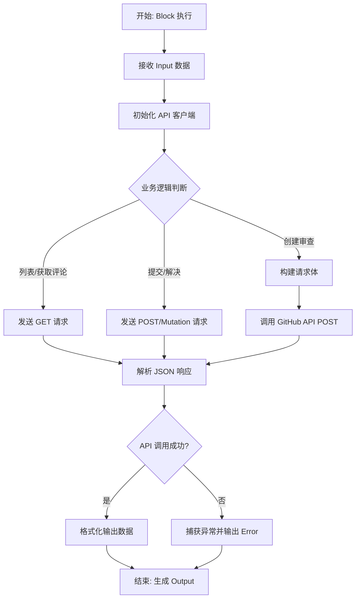

## 类结构

```
Block (抽象基类)
├── GithubCreatePRReviewBlock
├── GithubListPRReviewsBlock
├── GithubSubmitPendingReviewBlock
├── GithubResolveReviewDiscussionBlock
├── GithubGetPRReviewCommentsBlock
└── GithubCreateCommentObjectBlock

ReviewEvent (Enum)
├── COMMENT
├── APPROVE
└── REQUEST_CHANGES
```

## 全局变量及字段


### `logger`
    
用于记录模块运行日志信息的全局日志记录器实例。

类型：`logging.Logger`
    


### `GithubCreatePRReviewBlock.Input`
    
定义创建 GitHub PR 审查的输入参数结构，包含凭证、仓库信息、PR 编号、审查主体、事件类型及可选的内联评论列表。

类型：`BlockSchemaInput`
    


### `GithubCreatePRReviewBlock.Output`
    
定义创建 GitHub PR 审查的输出结果结构，返回审查 ID、状态、HTML URL 或错误信息。

类型：`BlockSchemaOutput`
    


### `GithubListPRReviewsBlock.Input`
    
定义列出 GitHub PR 审查的输入参数结构，包含凭证、仓库信息及 PR 编号。

类型：`BlockSchemaInput`
    


### `GithubListPRReviewsBlock.Output`
    
定义列出 GitHub PR 审查的输出结果结构，返回单个审查对象详情及所有审查的列表。

类型：`BlockSchemaOutput`
    


### `GithubSubmitPendingReviewBlock.Input`
    
定义提交待定 GitHub PR 审查的输入参数结构，包含凭证、仓库信息、PR 编号、待提交的审查 ID 及目标事件类型。

类型：`BlockSchemaInput`
    


### `GithubSubmitPendingReviewBlock.Output`
    
定义提交待定 GitHub PR 审查的输出结果结构，返回提交后的审查状态及 HTML URL。

类型：`BlockSchemaOutput`
    


### `GithubResolveReviewDiscussionBlock.Input`
    
定义解决或取消解决 GitHub PR 审查讨论的输入参数结构，包含凭证、仓库信息、PR 编号、评论 ID 及解析状态标志。

类型：`BlockSchemaInput`
    


### `GithubResolveReviewDiscussionBlock.Output`
    
定义解决或取消解决 GitHub PR 审查讨论的输出结果结构，指示操作是否成功。

类型：`BlockSchemaOutput`
    


### `GithubGetPRReviewCommentsBlock.Input`
    
定义获取 GitHub PR 审查评论的输入参数结构，包含凭证、仓库信息、PR 编号及可选的特定审查 ID。

类型：`BlockSchemaInput`
    


### `GithubGetPRReviewCommentsBlock.Output`
    
定义获取 GitHub PR 审查评论的输出结果结构，返回单个评论对象详情及所有评论的列表。

类型：`BlockSchemaOutput`
    


### `GithubCreateCommentObjectBlock.Input`
    
定义创建 GitHub 评论对象的输入参数结构，包含文件路径、评论内容、位置/行号及 Diff 侧边信息。

类型：`BlockSchemaInput`
    


### `GithubCreateCommentObjectBlock.Output`
    
定义创建 GitHub 评论对象的输出结果结构，返回适用于 GitHub API 的格式化评论对象字典。

类型：`BlockSchemaOutput`
    


### `ReviewEvent.COMMENT`
    
表示仅评论的审查事件，不对 Pull Request 提出明确的批准或更改请求。

类型：`ReviewEvent`
    


### `ReviewEvent.APPROVE`
    
表示批准的审查事件，表明审查者同意合并 Pull Request。

类型：`ReviewEvent`
    


### `ReviewEvent.REQUEST_CHANGES`
    
表示请求更改的审查事件，表明审查者认为在合并前需要进行修改。

类型：`ReviewEvent`
    
    

## 全局函数及方法


### `GithubCreatePRReviewBlock.__init__`

初始化 `GithubCreatePRReviewBlock` 类，设置块的唯一标识符、描述、分类、输入输出模式以及用于单元测试的模拟数据和凭据。

参数：

- `self`：`GithubCreatePRReviewBlock`，类的实例引用

返回值：`None`，初始化构造函数不返回值

#### 流程图

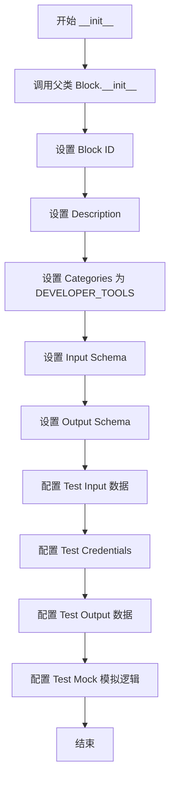

#### 带注释源码

```python
def __init__(self):
    # 调用父类 Block 的初始化方法，传入配置参数
    super().__init__(
        # 块的唯一标识符
        id="84754b30-97d2-4c37-a3b8-eb39f268275b",
        # 块的功能描述，说明了创建评论、草稿以及行内注释的注意事项
        description="This block creates a review on a GitHub pull request with optional inline comments. You can create it as a draft or post it immediately. Note: For inline comments, 'position' should be the line number in the diff (starting from the first @@ hunk header).",
        # 将块归类为开发者工具
        categories={BlockCategory.DEVELOPER_TOOLS},
        # 定义输入数据的结构模式
        input_schema=GithubCreatePRReviewBlock.Input,
        # 定义输出数据的结构模式
        output_schema=GithubCreatePRReviewBlock.Output,
        # 定义测试用的输入数据样本
        test_input={
            "repo": "owner/repo",
            "pr_number": 1,
            "body": "This looks good to me!",
            "event": "APPROVE",
            "create_as_draft": False,
            "credentials": TEST_CREDENTIALS_INPUT,
        },
        # 定义测试用的认证凭据
        test_credentials=TEST_CREDENTIALS,
        # 定义预期的测试输出结果
        test_output=[
            ("review_id", 123456),
            ("state", "APPROVED"),
            (
                "html_url",
                "https://github.com/owner/repo/pull/1#pullrequestreview-123456",
            ),
        ],
        # 定义测试时的 Mock 函数，模拟 API 返回数据
        test_mock={
            "create_review": lambda *args, **kwargs: (
                123456,
                "APPROVED",
                "https://github.com/owner/repo/pull/1#pullrequestreview-123456",
            )
        },
    )
```


### `GithubCreatePRReviewBlock.create_review`

该静态方法用于通过 GitHub API 异步创建 Pull Request 评审。它支持构建一般的评审主体、指定评审事件（如批准、请求更改、评论）、设置草稿状态，并允许添加针对特定文件和 diff 位置的可选内联评论。

参数：

-   `credentials`：`GithubCredentials`，用于认证和访问 GitHub API 的凭据对象。
-   `repo`：`str`，GitHub 仓库标识符，格式通常为 "owner/repo"。
-   `pr_number`：`int`，要评审的 Pull Request 编号。
-   `body`：`str`，评审的主要评论文本内容。
-   `event`：`ReviewEvent`，评审动作类型，枚举值包括 APPROVE（批准）、REQUEST_CHANGES（请求更改）或 COMMENT（仅评论）。
-   `create_as_draft`：`bool`，标识是否将评审创建为草稿（即挂起状态，不立即通知他人）。
-   `comments`：`Optional[List[Input.ReviewComment]]`，可选参数，包含一系列针对特定文件和行的内联评论对象。

返回值：`tuple[int, str, str]`，包含三个元素的元组，依次为创建的评审 ID (`int`)、评审状态 (`str`) 和评审的 HTML 链接 (`str`)。

#### 流程图

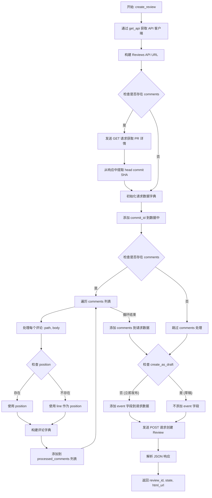

#### 带注释源码

```python
    @staticmethod
    async def create_review(
        credentials: GithubCredentials,
        repo: str,
        pr_number: int,
        body: str,
        event: ReviewEvent,
        create_as_draft: bool,
        comments: Optional[List[Input.ReviewComment]] = None,
    ) -> tuple[int, str, str]:
        # 初始化 API 客户端
        api = get_api(credentials, convert_urls=False)

        # 构建 GitHub API 创建评审的端点 URL
        reviews_url = f"https://api.github.com/repos/{repo}/pulls/{pr_number}/reviews"

        # 初始化 commit_id 变量
        # GitHub API 要求：如果在创建评审时附带内联评论，通常需要提供 commit_id
        commit_id = None
        if comments:
            # 如果有内联评论，需要先获取 PR 的详细信息以获取最新的 head commit SHA
            pr_url = f"https://api.github.com/repos/{repo}/pulls/{pr_number}"
            pr_response = await api.get(pr_url)
            pr_data = pr_response.json()
            commit_id = pr_data["head"]["sha"]

        # 准备 POST 请求的数据体
        data: dict[str, Any] = {"body": body}

        # 如果获取到了 commit_id，则添加到数据中
        if commit_id:
            data["commit_id"] = commit_id

        # 处理内联评论
        if comments:
            processed_comments = []
            for comment in comments:
                # 构建单个评论的数据结构
                comment_data: dict = {
                    "path": comment.get("path", ""),
                    "body": comment.get("body", ""),
                }
                
                # 处理位置信息
                # 注意：GitHub Review API 仅支持 position (diff 中的行号)，不支持直接的 line (文件行号)
                if "position" in comment and comment.get("position") is not None:
                    comment_data["position"] = comment.get("position")
                elif "line" in comment and comment.get("line") is not None:
                    # 如果没有提供 position，代码尝试使用 line 作为 fallback
                    # 但这可能导致位置不准确，因为 diff position 和文件 line 是不同的概念
                    comment_data["position"] = comment.get("line")

                processed_comments.append(comment_data)

            data["comments"] = processed_comments

        # 处理草稿状态
        # GitHub API 规则：如果不提供 event 字段，评审会被创建为 PENDING (草稿) 状态
        if not create_as_draft:
            # 如果不是草稿，则添加 event 字段以立即提交评审
            data["event"] = event.value

        # 发送 POST 请求创建评审
        response = await api.post(reviews_url, json=data)
        review_data = response.json()

        # 返回评审的关键信息：ID, 状态, URL
        return review_data["id"], review_data["state"], review_data["html_url"]
```


### `GithubCreatePRReviewBlock.run`

该方法是 `GithubCreatePRReviewBlock` 的核心执行入口，负责协调整个 GitHub Pull Request Review 的创建流程。它接收包含仓库信息、PR 编号、评审批注及事件类型的输入数据，通过调用内部辅助方法与 GitHub API 交互，并最终生成包含 Review ID、状态及 URL 的输出，或在发生异常时返回错误信息。

参数：

-   `input_data`：`Input`，包含创建 review 所需的所有输入信息，如仓库路径、PR 编号、评论文本、审核事件（批准/拒绝/评论）、是否为草稿以及具体的行内评论列表。
-   `credentials`：`GithubCredentials`，用于 GitHub API 认证的凭据对象，通过关键字参数传入。
-   `**kwargs`：`Any`，扩展用的关键字参数，当前方法逻辑中未直接使用。

返回值：`BlockOutput`，一个异步生成器，产生包含输出键值对的元组，如 `("review_id", 123)` 或 `("error", "message")`。

#### 流程图

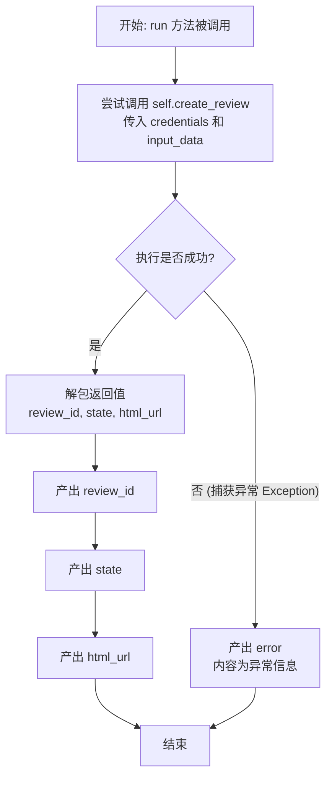

#### 带注释源码

```python
    async def run(
        self,
        input_data: Input,
        *,
        credentials: GithubCredentials,
        **kwargs,
    ) -> BlockOutput:
        try:
            # 调用静态方法 create_review 发起实际的网络请求
            # 将 input_data 中的字段和 credentials 传递进去
            review_id, state, html_url = await self.create_review(
                credentials,
                input_data.repo,
                input_data.pr_number,
                input_data.body,
                input_data.event,
                input_data.create_as_draft,
                input_data.comments,
            )
            # 成功创建后，依次产出 review 的 ID, 状态和 URL
            yield "review_id", review_id
            yield "state", state
            yield "html_url", html_url
        except Exception as e:
            # 如果在创建过程中发生任何异常，产出错误信息
            yield "error", str(e)
```


### `GithubListPRReviewsBlock.__init__`

初始化 `GithubListPRReviewsBlock` 实例，通过调用父类 `Block` 的构造函数来配置该块的唯一标识、描述、分类、输入/输出模式以及用于测试的模拟数据。

参数：

-  `self`：`GithubListPRReviewsBlock`，类实例本身

返回值：`None`，构造函数不返回任何值

#### 流程图

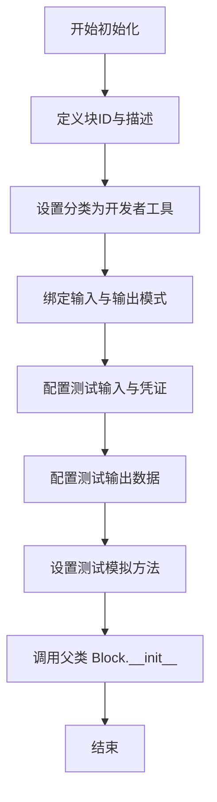

#### 带注释源码

```python
def __init__(self):
    # 调用父类 Block 的初始化方法，传入配置参数
    super().__init__(
        # 块的唯一标识符 UUID
        id="f79bc6eb-33c0-4099-9c0f-d664ae1ba4d0",
        # 块的功能描述文本
        description="This block lists all reviews for a specified GitHub pull request.",
        # 块所属的分类集合，此处为开发者工具
        categories={BlockCategory.DEVELOPER_TOOLS},
        # 定义输入数据的模式（Schema），引用了内部类 Input
        input_schema=GithubListPRReviewsBlock.Input,
        # 定义输出数据的模式（Schema），引用了内部类 Output
        output_schema=GithubListPRReviewsBlock.Output,
        # 定义用于测试的输入数据样本
        test_input={
            "repo": "owner/repo",
            "pr_number": 1,
            "credentials": TEST_CREDENTIALS_INPUT,
        },
        # 定义用于测试的凭证对象
        test_credentials=TEST_CREDENTIALS,
        # 定义预期的测试输出数据样本（包含 reviews 列表和单个 review）
        test_output=[
            (
                "reviews",
                [
                    {
                        "id": 123456,
                        "user": "reviewer1",
                        "state": "APPROVED",
                        "body": "Looks good!",
                        "html_url": "https://github.com/owner/repo/pull/1#pullrequestreview-123456",
                    }
                ],
            ),
            (
                "review",
                {
                    "id": 123456,
                    "user": "reviewer1",
                    "state": "APPROVED",
                    "body": "Looks good!",
                    "html_url": "https://github.com/owner/repo/pull/1#pullrequestreview-123456",
                },
            ),
        ],
        # 定义测试模拟对象，覆盖 'list_reviews' 方法以避免实际 API 调用
        test_mock={
            "list_reviews": lambda *args, **kwargs: [
                {
                    "id": 123456,
                    "user": "reviewer1",
                    "state": "APPROVED",
                    "body": "Looks good!",
                    "html_url": "https://github.com/owner/repo/pull/1#pullrequestreview-123456",
                }
            ]
        },
    )
```


### `GithubListPRReviewsBlock.list_reviews`

异步获取指定 GitHub 仓库 Pull Request 的所有审查评论列表，并将 API 返回的数据转换为标准化的字典列表结构。

参数：

-  `credentials`：`GithubCredentials`，用于进行身份验证和 API 请求的 GitHub 凭证对象。
-  `repo`：`str`，GitHub 仓库的标识符，通常格式为 "owner/repo"。
-  `pr_number`：`int`，要查询审查评论的 Pull Request 编号。

返回值：`list[Output.ReviewItem]`，包含 Pull Request 所有审查信息的列表，其中每个元素是一个包含 id、user、state、body 和 html_url 的字典。

#### 流程图

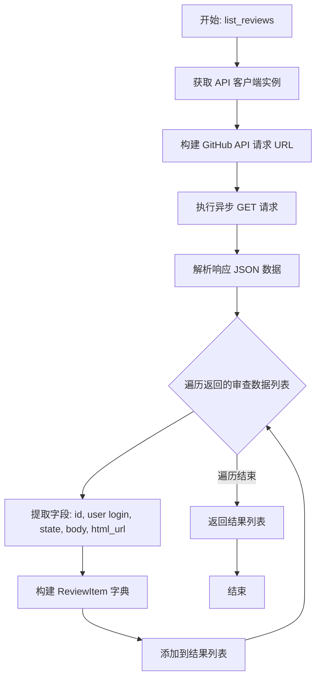

#### 带注释源码

```python
    @staticmethod
    async def list_reviews(
        credentials: GithubCredentials, repo: str, pr_number: int
    ) -> list[Output.ReviewItem]:
        # 使用提供的凭证初始化 API 客户端，不进行 URL 自动转换
        api = get_api(credentials, convert_urls=False)

        # 构建 GitHub API 端点 URL，用于获取指定 PR 的审查列表
        reviews_url = f"https://api.github.com/repos/{repo}/pulls/{pr_number}/reviews"

        # 发送异步 GET 请求获取审查数据
        response = await api.get(reviews_url)
        
        # 将响应内容解析为 JSON 格式
        data = response.json()

        # 使用列表推导式处理原始数据，提取并映射所需字段到 Output.ReviewItem 结构
        reviews: list[GithubListPRReviewsBlock.Output.ReviewItem] = [
            {
                "id": review["id"],                                      # 审查 ID
                "user": review["user"]["login"],                          # 审查者用户名
                "state": review["state"],                                # 审查状态 (如 APPROVED, COMMENTED)
                "body": review.get("body", ""),                          # 审查正文内容，默认为空字符串
                "html_url": review["html_url"],                          # 审查的网页链接
            }
            for review in data
        ]
        
        # 返回处理后的审查列表
        return reviews
```


### `GithubListPRReviewsBlock.run`

该方法是 `GithubListPRReviewsBlock` 类的核心执行入口，负责协调整个流程以获取指定 GitHub Pull Request 的所有审查评论，并将结果以生成器的形式输出。

参数：

- `input_data`：`GithubListPRReviewsBlock.Input`，包含执行所需的数据，如仓库标识和 PR 编号。
- `credentials`：`GithubCredentials`，用于访问 GitHub API 的认证凭证。
- `**kwargs`：`Any`，其他扩展的关键字参数。

返回值：`BlockOutput`，一个异步生成器，首先产出包含所有审查列表的数据，随后逐个产出单个审查的详细数据。

#### 流程图

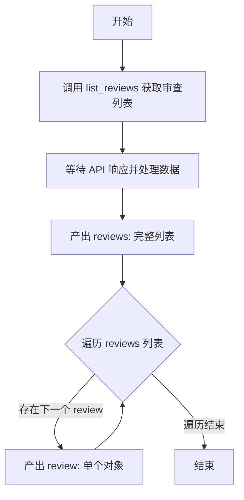

#### 带注释源码

```python
async def run(
    self,
    input_data: Input,
    *,
    credentials: GithubCredentials,
    **kwargs,
) -> BlockOutput:
    # 调用静态方法 list_reviews，传入凭据、仓库名和 PR 编号，获取所有审查数据
    reviews = await self.list_reviews(
        credentials,
        input_data.repo,
        input_data.pr_number,
    )
    # 输出键为 "reviews" 的数据，包含所有的审查列表
    yield "reviews", reviews
    # 遍历获取到的审查列表
    for review in reviews:
        # 逐个输出键为 "review" 的数据，方便下游对单个审查进行处理
        yield "review", review
```


### `GithubSubmitPendingReviewBlock.__init__`

初始化 `GithubSubmitPendingReviewBlock` 类，配置块的元数据（ID、描述、类别），定义输入和输出架构，并设置用于测试目的的模拟数据和预期输出。

参数：

- `self`：`GithubSubmitPendingReviewBlock`，类实例的引用。

返回值：`None`，该方法没有返回值，仅用于初始化对象配置。

#### 流程图

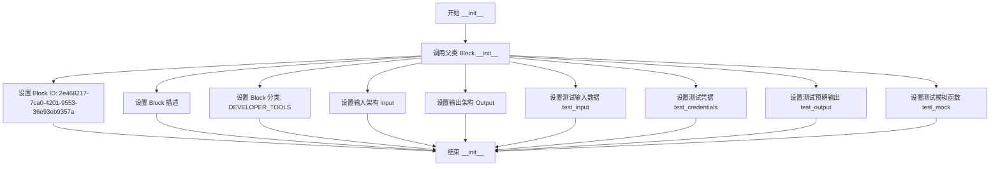

#### 带注释源码

```python
def __init__(self):
    # 调用父类 Block 的初始化方法，传递配置参数
    super().__init__(
        # 块的唯一标识符
        id="2e468217-7ca0-4201-9553-36e93eb9357a",
        # 块的功能描述，说明该块用于提交 GitHub 上的待审核审查
        description="This block submits a pending (draft) review on a GitHub pull request.",
        # 块所属的分类，这里标记为开发者工具
        categories={BlockCategory.DEVELOPER_TOOLS},
        # 定义块的输入数据结构模式，引用嵌套类 Input
        input_schema=GithubSubmitPendingReviewBlock.Input,
        # 定义块的输出数据结构模式，引用嵌套类 Output
        output_schema=GithubSubmitPendingReviewBlock.Output,
        # 定义用于单元测试的输入数据模拟
        test_input={
            "repo": "owner/repo",
            "pr_number": 1,
            "review_id": 123456,
            "event": "APPROVE",
            "credentials": TEST_CREDENTIALS_INPUT,
        },
        # 定义用于单元测试的认证凭据
        test_credentials=TEST_CREDENTIALS,
        # 定义预期的单元测试输出结果
        test_output=[
            ("state", "APPROVED"),
            (
                "html_url",
                "https://github.com/owner/repo/pull/1#pullrequestreview-123456",
            ),
        ],
        # 定义模拟函数，用于在测试中替代真实的 API 调用
        test_mock={
            "submit_review": lambda *args, **kwargs: (
                "APPROVED",
                "https://github.com/owner/repo/pull/1#pullrequestreview-123456",
            )
        },
    )
```


### `GithubSubmitPendingReviewBlock.submit_review`

该静态方法用于将一个处于草稿状态（pending）的GitHub Pull Request评论正式提交，并指定相应的评审动作（如批准、请求变更或仅评论）。

参数：

-   `credentials`：`GithubCredentials`，用于访问GitHub API的身份验证凭证。
-   `repo`：`str`，GitHub仓库名称，格式通常为 "owner/repo"。
-   `pr_number`：`int`，Pull Request的编号。
-   `review_id`：`int`，待提交的草稿评审的ID。
-   `event`：`ReviewEvent`，提交评审时执行的动作类型（如 APPROVE, REQUEST_CHANGES, COMMENT）。

返回值：`tuple[str, str]`，包含提交后的评审状态（state）和评审页面的HTML URL（html_url）。

#### 流程图

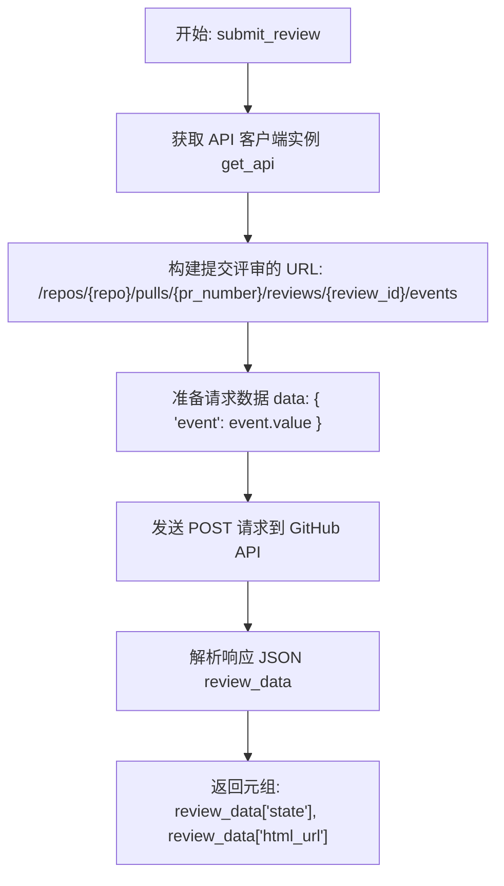

#### 带注释源码

```python
    @staticmethod
    async def submit_review(
        credentials: GithubCredentials,
        repo: str,
        pr_number: int,
        review_id: int,
        event: ReviewEvent,
    ) -> tuple[str, str]:
        # 1. 获取配置好的 API 客户端实例
        api = get_api(credentials, convert_urls=False)

        # 2. 构建 GitHub API 提交评审的端点 URL
        submit_url = f"https://api.github.com/repos/{repo}/pulls/{pr_number}/reviews/{review_id}/events"

        # 3. 准备请求体数据，包含评审事件（APPROVE, REQUEST_CHANGES, COMMENT）
        data = {"event": event.value}

        # 4. 向 GitHub API 发送 POST 请求以提交评审
        response = await api.post(submit_url, json=data)
        
        # 5. 解析返回的 JSON 数据
        review_data = response.json()

        # 6. 返回评审的状态和 HTML 链接
        return review_data["state"], review_data["html_url"]
```


### `GithubSubmitPendingReviewBlock.run`

该方法是 `GithubSubmitPendingReviewBlock` 的核心执行逻辑，负责协调输入参数，调用底层 API 提交待定（草稿）的 GitHub Pull Request 审核，并通过生成器返回审核状态、URL 或捕获到的错误信息。

参数：

- `input_data`：`Input`，包含仓库全名、PR 编号、待提交的审核 ID 以及审核事件类型（如 APPROVE, COMMENT 等）的输入数据对象。
- `credentials`：`GithubCredentials`，用于访问 GitHub API 的认证凭据对象。
- `**kwargs`：`Any`，扩展用的关键字参数，符合 Block 执行标准签名。

返回值：`BlockOutput`，一个异步生成器，逐个产生包含结果键值对的元组，例如 `("state", "APPROVED")` 或 `("error", "...")`。

#### 流程图

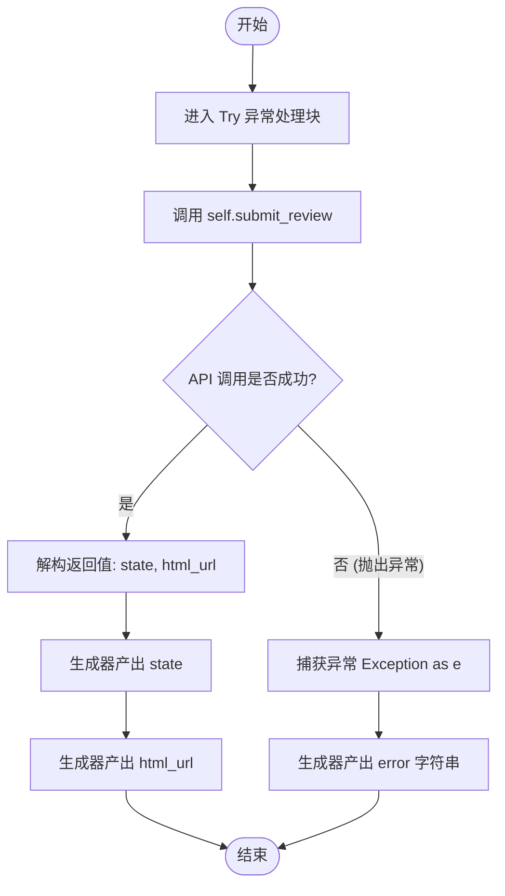

#### 带注释源码

```python
    async def run(
        self,
        input_data: Input,
        *,
        credentials: GithubCredentials,
        **kwargs,
    ) -> BlockOutput:
        try:
            # 调用静态方法 submit_review 发起提交请求
            # 传入凭据、仓库信息、PR编号、审核ID及事件类型
            state, html_url = await self.submit_review(
                credentials,
                input_data.repo,
                input_data.pr_number,
                input_data.review_id,
                input_data.event,
            )
            # 成功则产出审核状态
            yield "state", state
            # 成功则产出审核页面的 HTML 链接
            yield "html_url", html_url
        except Exception as e:
            # 捕获执行过程中的任何异常
            # 产出错误信息
            yield "error", str(e)
```


### `GithubResolveReviewDiscussionBlock.__init__`

初始化 GitHub Resolve Review Discussion Block，配置该块的唯一标识、描述、输入输出模式以及用于测试的模拟数据和凭据。该块用于解决或取消解决 GitHub 拉取请求上的审查讨论线程。

参数：

-  `self`：`GithubResolveReviewDiscussionBlock`，类的实例本身

返回值：`None`，无返回值

#### 流程图

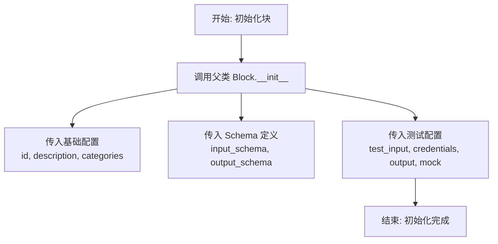

#### 带注释源码

```python
def __init__(self):
    # 调用父类 Block 的构造函数，初始化块的基本元数据和配置
    super().__init__(
        # 定义块的唯一标识符 (UUID)
        id="b4b8a38c-95ae-4c91-9ef8-c2cffaf2b5d1",
        # 块的功能描述：用于解决或取消解决 GitHub 拉取请求上的审查讨论线程
        description="This block resolves or unresolves a review discussion thread on a GitHub pull request.",
        # 定义块所属的分类，此处为开发者工具
        categories={BlockCategory.DEVELOPER_TOOLS},
        # 指定输入数据的 Schema 定义类
        input_schema=GithubResolveReviewDiscussionBlock.Input,
        # 指定输出数据的 Schema 定义类
        output_schema=GithubResolveReviewDiscussionBlock.Output,
        # 定义用于测试的输入数据样本
        test_input={
            "repo": "owner/repo",
            "pr_number": 1,
            "comment_id": 123456,
            "resolve": True,
            "credentials": TEST_CREDENTIALS_INPUT,
        },
        # 定义用于测试的凭据对象
        test_credentials=TEST_CREDENTIALS,
        # 定义预期的测试输出结果
        test_output=[
            ("success", True),
        ],
        # 定义测试时的模拟行为，替代实际的 API 调用逻辑
        test_mock={"resolve_discussion": lambda *args, **kwargs: True},
    )
```


### `GithubResolveReviewDiscussionBlock.resolve_discussion`

该方法通过调用 GitHub GraphQL API 查找指定 Pull Request 中特定评论所属的讨论线程 ID，并根据输入参数执行解决或取消解决该讨论线程的操作。

参数：

-  `credentials`：`GithubCredentials`，用于身份验证的 GitHub 凭据对象。
-  `repo`：`str`，GitHub 仓库标识符，格式为 "owner/repo"。
-  `pr_number`：`int`，Pull Request 的编号。
-  `comment_id`：`int`，需要解决或取消解决的审查评论的数据库 ID。
-  `resolve`：`bool`，布尔值，为 `True` 时解决讨论，为 `False` 时取消解决讨论。

返回值：`bool`，如果操作成功返回 `True`；如果查找评论失败或 API 返回错误则抛出异常。

#### 流程图

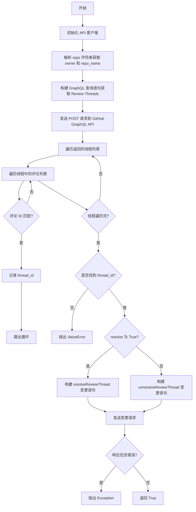

#### 带注释源码

```python
    @staticmethod
    async def resolve_discussion(
        credentials: GithubCredentials,
        repo: str,
        pr_number: int,
        comment_id: int,
        resolve: bool,
    ) -> bool:
        # 获取配置好的 API 客户端实例
        api = get_api(credentials, convert_urls=False)

        # 将仓库字符串 "owner/repo" 拆分为 owner 和 repo_name
        parts = repo.split("/")
        owner = parts[0]
        repo_name = parts[1]

        # GitHub GraphQL API 端点
        # 注意：解决讨论通常需要使用 GraphQL，因为 REST API 对此功能的支持有限
        graphql_url = "https://api.github.com/graphql"

        # 定义查询语句：根据 PR 编号获取审查讨论线程及其评论
        query = """
        query($owner: String!, $repo: String!, $number: Int!) {
          repository(owner: $owner, name: $repo) {
            pullRequest(number: $number) {
              reviewThreads(first: 100) {
                nodes {
                  comments(first: 100) {
                    nodes {
                      databaseId
                      id
                    }
                  }
                  id
                  isResolved
                }
              }
            }
          }
        }
        """

        # 设置查询变量
        variables = {"owner": owner, "repo": repo_name, "number": pr_number}

        # 执行查询以获取线程数据
        response = await api.post(
            graphql_url, json={"query": query, "variables": variables}
        )
        data = response.json()

        # 在返回的数据中查找包含目标 comment_id 的线程
        thread_id = None
        for thread in data["data"]["repository"]["pullRequest"]["reviewThreads"][
            "nodes"
        ]:
            for comment in thread["comments"]["nodes"]:
                # 对比评论的 databaseId
                if comment["databaseId"] == comment_id:
                    thread_id = thread["id"]  # 获取线程的 Node ID (用于后续操作)
                    break
            if thread_id:
                break

        # 如果未找到对应的线程，抛出错误
        if not thread_id:
            raise ValueError(f"Comment {comment_id} not found in pull request")

        # 根据 resolve 参数决定执行解决还是取消解决的 Mutation
        if resolve:
            # 构建解决讨论的 GraphQL 变更语句
            mutation = """
            mutation($threadId: ID!) {
              resolveReviewThread(input: {threadId: $threadId}) {
                thread {
                  isResolved
                }
              }
            }
            """
        else:
            # 构建取消解决讨论的 GraphQL 变更语句
            mutation = """
            mutation($threadId: ID!) {
              unresolveReviewThread(input: {threadId: $threadId}) {
                thread {
                  isResolved
                }
              }
            }
            """

        mutation_variables = {"threadId": thread_id}

        # 执行变更操作
        response = await api.post(
            graphql_url, json={"query": mutation, "variables": mutation_variables}
        )
        result = response.json()

        # 检查 GraphQL 响应中是否存在错误
        if "errors" in result:
            raise Exception(f"GraphQL error: {result['errors']}")

        # 操作成功返回 True
        return True
```


### `GithubResolveReviewDiscussionBlock.run`

该方法是 `GithubResolveReviewDiscussionBlock` 的核心执行入口，负责协调输入数据的处理。它调用内部静态方法 `resolve_discussion` 与 GitHub GraphQL API 交互，以解决或取消解决审查讨论线程，并捕获执行过程中的异常以返回成功或错误状态。

参数：

-   `input_data`：`Input`，包含仓库名称（repo）、PR 编号（pr_number）、评论 ID（comment_id）和是否解决的布尔值（resolve）的输入数据对象。
-   `credentials`：`GithubCredentials`，用于身份验证和访问 GitHub API 的凭据对象。
-   `**kwargs`：`Any`，传递给块执行上下文的额外关键字参数。

返回值：`BlockOutput`，一个异步生成器，产生包含操作结果（success）或错误信息（error）的键值对元组。

#### 流程图

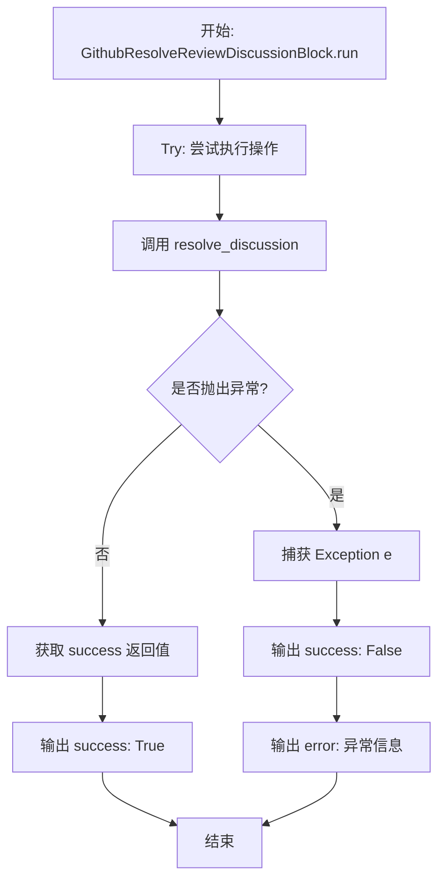

#### 带注释源码

```python
    async def run(
        self,
        input_data: Input,
        *,
        credentials: GithubCredentials,
        **kwargs,
    ) -> BlockOutput:
        try:
            # 调用静态方法 resolve_discussion 执行实际的 API 请求逻辑
            # 传入 credentials 以及从 input_data 中提取的必要参数
            success = await self.resolve_discussion(
                credentials,
                input_data.repo,
                input_data.pr_number,
                input_data.comment_id,
                input_data.resolve,
            )
            # 如果成功，输出 success 字段为 True
            yield "success", success
        except Exception as e:
            # 如果在执行过程中发生任何异常，捕获错误
            # 首先输出 success 字段为 False
            yield "success", False
            # 然后输出 error 字段，包含具体的异常信息字符串
            yield "error", str(e)
```


### `GithubGetPRReviewCommentsBlock.__init__`

该方法是 `GithubGetPRReviewCommentsBlock` 类的构造函数，负责初始化代码块的基本配置。它设置代码块的唯一标识符、功能描述、所属分类、输入输出数据模式，以及用于单元测试的模拟输入、输出和凭证。

参数：

-   `self`：`GithubGetPRReviewCommentsBlock`，指向类实例本身的引用。

返回值：`None`，构造函数不返回任何值。

#### 流程图

```mermaid
flowchart TD
    Start([开始]) --> DefineMeta[定义代码块元数据]
    DefineMeta --> SetID[设置 ID 为 1d34db7f...]
    SetID --> SetDesc[设置描述: 获取 PR 审查评论]
    SetDesc --> SetCat[设置分类为 DEVELOPER_TOOLS]
    SetCat --> SetSchema[设置 Input 和 Output Schema]
    SetSchema --> SetTest[设置测试输入、输出和 Mock]
    SetTest --> SuperInit[调用 super().__init__ 初始化父类]
    SuperInit --> End([结束])
```

#### 带注释源码

```python
def __init__(self):
    # 调用父类 Block 的构造函数，传入代码块的配置信息
    super().__init__(
        # 代码块的全局唯一标识符
        id="1d34db7f-10c1-45c1-9d43-749f743c8bd4",
        # 代码块的详细功能描述
        description="This block gets all review comments from a GitHub pull request or from a specific review.",
        # 代码块所属的分类，这里为开发者工具
        categories={BlockCategory.DEVELOPER_TOOLS},
        # 定义输入数据的 Schema，引用了内部类 Input
        input_schema=GithubGetPRReviewCommentsBlock.Input,
        # 定义输出数据的 Schema，引用了内部类 Output
        output_schema=GithubGetPRReviewCommentsBlock.Output,
        # 定义测试用的输入数据
        test_input={
            "repo": "owner/repo",
            "pr_number": 1,
            "credentials": TEST_CREDENTIALS_INPUT,
        },
        # 定义测试用的凭证
        test_credentials=TEST_CREDENTIALS,
        # 定义预期的测试输出结果
        test_output=[
            (
                "comments",
                [
                    {
                        "id": 123456,
                        "user": "reviewer1",
                        "body": "This needs improvement",
                        "path": "src/main.py",
                        "line": 42,
                        "side": "RIGHT",
                        "created_at": "2024-01-01T00:00:00Z",
                        "updated_at": "2024-01-01T00:00:00Z",
                        "in_reply_to_id": None,
                        "html_url": "https://github.com/owner/repo/pull/1#discussion_r123456",
                    }
                ],
            ),
            (
                "comment",
                {
                    "id": 123456,
                    "user": "reviewer1",
                    "body": "This needs improvement",
                    "path": "src/main.py",
                    "line": 42,
                    "side": "RIGHT",
                    "created_at": "2024-01-01T00:00:00Z",
                    "updated_at": "2024-01-01T00:00:00Z",
                    "in_reply_to_id": None,
                    "html_url": "https://github.com/owner/repo/pull/1#discussion_r123456",
                },
            ),
        ],
        # 定义模拟的 get_comments 方法，用于测试环境下的 Mock
        test_mock={
            "get_comments": lambda *args, **kwargs: [
                {
                    "id": 123456,
                    "user": "reviewer1",
                    "body": "This needs improvement",
                    "path": "src/main.py",
                    "line": 42,
                    "side": "RIGHT",
                    "created_at": "2024-01-01T00:00:00Z",
                    "updated_at": "2024-01-01T00:00:00Z",
                    "in_reply_to_id": None,
                    "html_url": "https://github.com/owner/repo/pull/1#discussion_r123456",
                }
            ]
        },
    )
```


### `GithubGetPRReviewCommentsBlock.get_comments`

该方法用于从 GitHub 拉取请求中获取审查评论。它可以根据提供的参数获取特定审查的评论，或者获取该拉取请求下的所有审查评论，并将返回的数据格式化为标准的评论对象列表。

参数：

-  `credentials`：`GithubCredentials`，用于认证的 GitHub 凭证对象。
-  `repo`：`str`，GitHub 仓库的标识符，格式通常为 "owner/repo"。
-  `pr_number`：`int`，拉取请求的编号。
-  `review_id`：`Optional[int]`，可选参数，特定审查的 ID。如果提供，则只获取该审查下的评论；否则获取 PR 下的所有评论。

返回值：`list[Output.CommentItem]`，包含审查评论详情的字典列表，每个字典包含评论 ID、作者、内容、路径、行号等信息。

#### 流程图

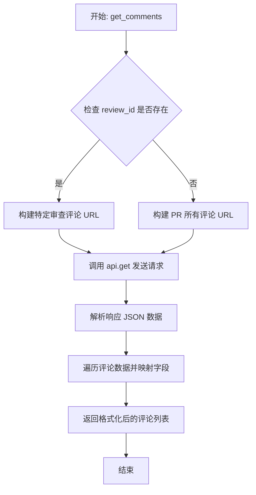

#### 带注释源码

```python
    @staticmethod
    async def get_comments(
        credentials: GithubCredentials,
        repo: str,
        pr_number: int,
        review_id: Optional[int] = None,
    ) -> list[Output.CommentItem]:
        # 获取经过认证的 API 客户端实例
        api = get_api(credentials, convert_urls=False)

        # 根据是否提供 review_id 决定使用哪个 API 端点
        if review_id:
            # 如果提供了 review_id，则获取特定审查的评论
            comments_url = f"https://api.github.com/repos/{repo}/pulls/{pr_number}/reviews/{review_id}/comments"
        else:
            # 否则获取该 PR 下所有的审查评论
            comments_url = (
                f"https://api.github.com/repos/{repo}/pulls/{pr_number}/comments"
            )

        # 发送异步 GET 请求获取数据
        response = await api.get(comments_url)
        data = response.json()

        # 将原始 JSON 数据转换为结构化的 CommentItem 列表
        comments: list[GithubGetPRReviewCommentsBlock.Output.CommentItem] = [
            {
                "id": comment["id"],
                "user": comment["user"]["login"],
                "body": comment["body"],
                "path": comment.get("path", ""),
                "line": comment.get("line", 0),
                "side": comment.get("side", ""),
                "created_at": comment["created_at"],
                "updated_at": comment["updated_at"],
                "in_reply_to_id": comment.get("in_reply_to_id"),
                "html_url": comment["html_url"],
            }
            for comment in data
        ]
        return comments
```


### `GithubGetPRReviewCommentsBlock.run`

该方法负责从 GitHub 拉取指定 Pull Request 的评审评论。它会调用底层 API 获取评论数据（可以是整个 PR 的评论，也可以是特定 review 的评论），并将结果列表及单个评论对象依次输出，同时具备基本的错误处理机制。

参数：

-  `input_data`：`GithubGetPRReviewCommentsBlock.Input`，包含运行该块所需的输入数据，如仓库路径（owner/repo）、PR 编号以及可选的特定评审 ID。
-  `credentials`：`GithubCredentials`，用于身份验证的 GitHub 凭证对象。
-  `**kwargs`：`Any`，接收其他可能传递的关键字参数。

返回值：`BlockOutput`，一个异步生成器，逐个产出包含评论列表、单个评论对象或在发生错误时产出错误信息的键值对。

#### 流程图

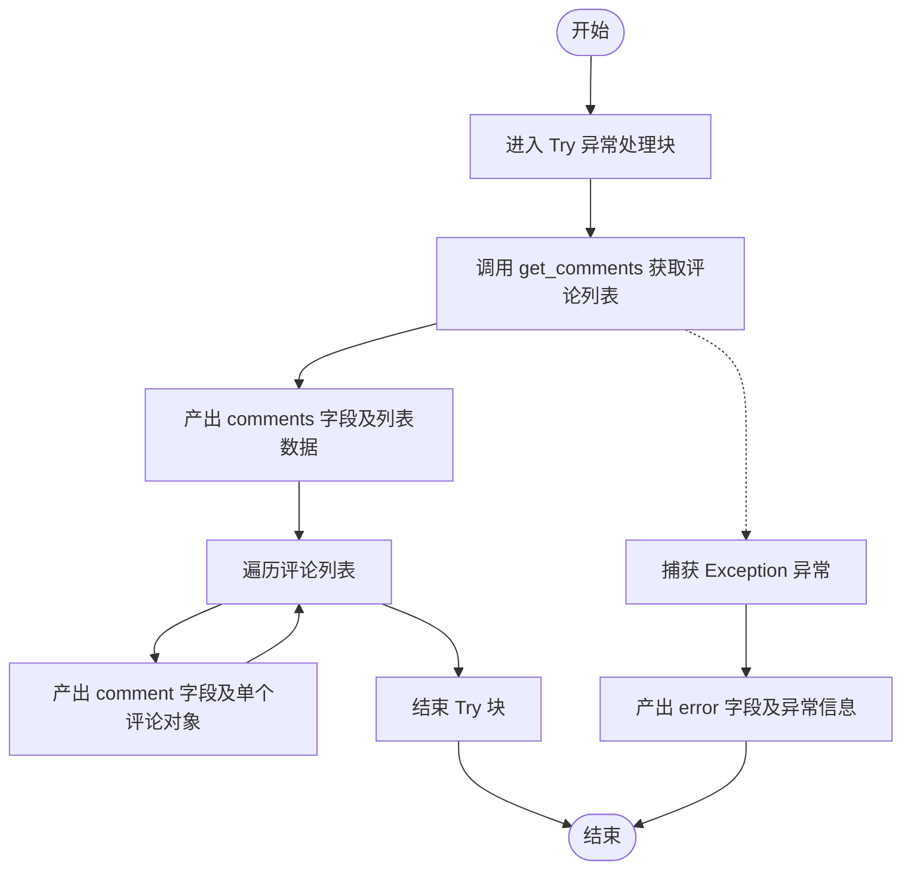

#### 带注释源码

```python
async def run(
    self,
    input_data: Input,
    *,
    credentials: GithubCredentials,
    **kwargs,
) -> BlockOutput:
    try:
        # 调用静态方法 get_comments 获取评论数据
        # 传入凭证、仓库、PR编号以及可选的review_id
        comments = await self.get_comments(
            credentials,
            input_data.repo,
            input_data.pr_number,
            input_data.review_id,
        )
        # 输出包含所有评论的列表
        yield "comments", comments
        
        # 遍历评论列表，逐个输出单个评论对象
        for comment in comments:
            yield "comment", comment
    except Exception as e:
        # 如果过程中发生任何异常，捕获并输出错误信息
        yield "error", str(e)
```


### `GithubCreateCommentObjectBlock.__init__`

该方法是 `GithubCreateCommentObjectBlock` 类的构造函数，负责初始化块的基本元数据，包括唯一标识符、描述、所属分类、输入输出模式定义以及用于测试的模拟输入和输出数据。它通过调用父类 `Block` 的构造函数将这些配置注册到系统中。

参数：

-  `self`：`GithubCreateCommentObjectBlock`，类的实例本身

返回值：`None`，无返回值（此方法主要用于执行初始化逻辑）

#### 流程图

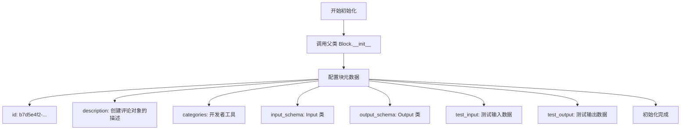

#### 带注释源码

```python
def __init__(self):
    # 调用父类 Block 的初始化方法，配置该块的各项属性和测试环境
    super().__init__(
        # 块的唯一标识符 (UUID)
        id="b7d5e4f2-8c3a-4e6b-9f1d-7a8b9c5e4d3f",
        # 块的功能描述，说明用于创建评论对象，并区分 Review 评论和独立 PR 评论的差异
        description="Creates a comment object for use with GitHub blocks. Note: For review comments, only path, body, and position are used. Side fields are only for standalone PR comments.",
        # 块所属的分类，这里归类为开发者工具
        categories={BlockCategory.DEVELOPER_TOOLS},
        # 定义输入数据的结构模式，绑定到内部类 Input
        input_schema=GithubCreateCommentObjectBlock.Input,
        # 定义输出数据的结构模式，绑定到内部类 Output
        output_schema=GithubCreateCommentObjectBlock.Output,
        # 定义用于测试的模拟输入数据
        test_input={
            "path": "src/main.py",
            "body": "Please fix this issue",
            "position": 6,
        },
        # 定义预期的测试输出结果
        test_output=[
            (
                "comment_object",
                {
                    "path": "src/main.py",
                    "body": "Please fix this issue",
                    "position": 6,
                },
            ),
        ],
    )
```


### `GithubCreateCommentObjectBlock.run`

该方法负责根据输入的参数构建一个符合 GitHub API 要求的评论对象字典。它会处理路径、正文以及位置（`position` 或 `line`）等核心字段，并根据需要添加可选的差异（diff）侧边字段（如 `side`, `start_line` 等），最终生成一个结构化的评论对象。

参数：

-  `input_data`：`GithubCreateCommentObjectBlock.Input`，包含评论详情的输入数据对象，涵盖文件路径、评论内容、行号及差异侧边等信息。
-  `**kwargs`：`Any`，额外的关键字参数，用于扩展或传递上下文信息。

返回值：`BlockOutput`，一个异步生成器，产生包含键值对 `"comment_object"` 和构造好的评论字典的元组。

#### 流程图

```mermaid
flowchart TD
    A[开始: run 方法调用] --> B[初始化 comment_obj 字典<br/>包含 path 和 body]
    B --> C{检查 input_data.position 是否不为 None}
    C -- 是 --> D[设置 comment_obj['position'] = input_data.position]
    C -- 否 --> E{检查 input_data.line 是否不为 None}
    E -- 是 --> F[设置 comment_obj['position'] = input_data.line]
    E -- 否 --> G[跳过位置设置]
    D --> H{检查 input_data.side 存在且不为 RIGHT}
    F --> H
    G --> H
    H -- 是 --> I[设置 comment_obj['side'] = input_data.side]
    H -- 否 --> J{检查 input_data.start_line 是否不为 None}
    I --> J
    J -- 是 --> K[设置 comment_obj['start_line'] = input_data.start_line]
    J -- 否 --> L{检查 input_data.start_side 是否存在}
    K --> L
    L -- 是 --> M[设置 comment_obj['start_side'] = input_data.start_side]
    L -- 否 --> N[生成输出 yield comment_object]
    M --> N
    N --> O[结束]
```

#### 带注释源码

```python
    async def run(
        self,
        input_data: Input,
        **kwargs,
    ) -> BlockOutput:
        # 初始化评论对象字典，填入必填字段：文件路径和评论正文
        comment_obj: dict = {
            "path": input_data.path,
            "body": input_data.body,
        }

        # 处理位置信息：优先使用明确的 position，否则回退使用 line
        if input_data.position is not None:
            # 如果提供了 position，直接使用（Diff 中的行号）
            comment_obj["position"] = input_data.position
        elif input_data.line is not None:
            # 注意：这里将 line 作为 position 使用
            # 注释提示这在 diff 计算中可能不准确，因为 position 应该基于 diff hunk
            comment_obj["position"] = input_data.line

        # 添加可选字段：仅当它们被显式提供且不等于默认值时才添加
        if input_data.side and input_data.side != "RIGHT":
            # 添加差异侧边 (LEFT 或 RIGHT)，默认是 RIGHT，所以非 RIGHT 时才设置
            comment_obj["side"] = input_data.side
        
        if input_data.start_line is not None:
            # 添加多行评论的起始行
            comment_obj["start_line"] = input_data.start_line
        
        if input_data.start_side:
            # 添加多行评论的起始侧边
            comment_obj["start_side"] = input_data.start_side

        # 产出最终的评论对象
        yield "comment_object", comment_obj
```


## 关键组件


### ReviewEvent

定义了审查动作类型的枚举，包含评论、批准和请求变更。

### GithubCreatePRReviewBlock

负责在GitHub拉取请求上创建审查，支持内联评论以及草稿或直接发布模式。

### GithubListPRReviewsBlock

负责获取并列出指定GitHub拉取请求的所有审查详情。

### GithubSubmitPendingReviewBlock

负责将现有的待处理（草稿）审查提交为最终状态。

### GithubResolveReviewDiscussionBlock

负责通过GraphQL API解决或取消解决GitHub拉取请求中的审查讨论线程。

### GithubGetPRReviewCommentsBlock

负责获取指定拉取请求或特定审查下的所有审查评论。

### GithubCreateCommentObjectBlock

负责构建符合GitHub API要求的评论对象字典，用于传递给其他审查块。


## 问题及建议


### 已知问题

-   **行号与 Diff Position 映射不准确**：在 `GithubCreatePRReviewBlock.create_review` 和 `GithubCreateCommentObjectBlock` 中，代码默认将 `line`（文件行号）作为 `position`（Diff 位置）的后备值。由于 GitHub API 要求的 `position` 是相对于 Diff Hunk 的索引，直接使用文件行号会导致评论出现在错误的位置或被 API 拒绝，代码注释中也明确指出了这一点 ("may not work correctly")。
-   **评论线程查询存在分页限制**：`GithubResolveReviewDiscussionBlock.resolve_discussion` 方法在查询评论线程时，GraphQL 查询硬编码了 `first: 100` 的限制。如果 Pull Request 包含超过 100 个评论线程，该方法将无法找到目标评论，导致操作失败。
-   **异常处理较为宽泛**：`GithubResolveReviewDiscussionBlock` 和 `GithubCreatePRReviewBlock` 等类的 `run` 方法中捕获了通用的 `Exception`，虽然会输出错误信息，但可能掩盖了特定的网络错误或 API 响应格式错误，不利于精细化的错误诊断。
-   **GraphQL 查询效率低下**：在 `GithubResolveReviewDiscussionBlock` 中，为了解析单个评论，拉取了该 PR 下的所有评论线程数据。对于评论量大的 PR，这会造成不必要的网络传输和内存消耗。

### 优化建议

-   **实现 Diff 位置计算逻辑**：引入 Diff 解析库（如 `unidiff`）或调用 Git 命令来计算文件行号与 Diff Position 的准确映射关系，替代当前简单的 `line` 赋值，确保行内评论定位的准确性。
-   **增加分页支持或优化查询**：修改 `GithubResolveReviewDiscussionBlock` 中的 GraphQL 查询，增加分页逻辑（游标分页）以处理超过 100 个线程的情况；或者考虑通过 REST API 先获取评论详情，再利用 GraphQL 进行仅针对特定线程的操作（如果 API 允许）。
-   **提取公共逻辑**：`GithubCreatePRReviewBlock` 中处理 `comments` 列表字段（处理 `path`, `body`, `position` 等）的逻辑与 `GithubCreateCommentObjectBlock` 存在重叠，建议提取为独立的工具函数，减少代码重复并降低维护成本。
-   **增强输入验证**：在 `GithubCreatePRReviewBlock` 的 `create_review` 方法中，增加对输入评论对象的验证，确保必需字段（如 `path`, `body`）存在且有效，避免向 GitHub API 发送无效请求。
-   **细化异常处理**：区分网络超时、认证失败、API 限制（Rate Limit）和业务逻辑错误（如 PR 不存在）等不同异常场景，提供更具可操作性的错误信息或抛出特定的自定义异常。


## 其它


### 设计目标与约束

**设计目标：**
1.  **模块化集成**：将 GitHub Pull Request 的核心评审操作（创建、列表查询、提交、解决讨论）封装为独立的、可复用的 Block 组件，以便在工作流编排系统中灵活调用。
2.  **异步执行**：所有涉及网络 I/O 的操作均采用 `async/await` 模式，以避免阻塞主线程，提高高并发场景下的系统吞吐量。
3.  **功能完整性**：覆盖从创建草稿评审、提交最终评审、处理行内评论到解决讨论线程的完整生命周期。

**约束条件：**
1.  **接口规范**：所有 Block 必须继承自 `backend.data.block.Block`，并严格遵循 `BlockSchemaInput` 和 `BlockSchemaOutput` 的定义模式。
2.  **API 限制**：依赖于 GitHub REST API 和 GraphQL API 的可用性和速率限制。特别是“解决讨论”功能必须使用 GraphQL API，因为 REST API 不支持该操作。
3.  **数据格式**：评论位置（Position）的计算逻辑依赖于 Diff Hunk，仅支持基于 Position 的定位，不支持基于单纯的文件行号自动计算 Diff 位置（除部分简单的回退逻辑外）。
4.  **认证机制**：必须依赖有效的 `GithubCredentials` 进行身份验证，且该凭证由 `GithubCredentialsField` 统一管理。

### 错误处理与异常设计

**策略：**
1.  **统一异常捕获**：在各个 Block 的 `run` 方法中使用 `try-except Exception` 块捕获所有未处理的异常，防止因单个 Block 的错误导致整个工作流崩溃。
2.  **标准化错误输出**：发生异常时，通过 `yield` 输出特定的错误字段。通常字段名为 `error` (字符串类型)，对于布尔操作的 Block（如 `GithubResolveReviewDiscussionBlock`），则输出 `success: False` 和 `error`。
3.  **GraphQL 特殊处理**：对于 GraphQL 请求，除了捕获网络异常外，还显式检查响应体中的 `errors` 字段。若存在，抛出包含详细信息的异常。

**具体实现：**
*   **GithubCreatePRReviewBlock**：捕获 API 调用异常，返回 `error` 字符串。
*   **GithubSubmitPendingReviewBlock**：同上，返回 `error` 字符串。
*   **GithubResolveReviewDiscussionBlock**：捕获异常并返回 `success: False`，确保下游逻辑可以通过布尔值判断操作成败。
*   **GithubGetPRReviewCommentsBlock**：捕获异常并返回 `error` 字符串。

### 数据流与状态机

**数据流：**
1.  **输入阶段**：用户或上游 Block 通过 `Input` 类提供凭证、仓库信息、PR 编号及操作参数（如评论内容、Event 类型）。
2.  **处理阶段**：
    *   `run` 方法接收输入数据。
    *   调用静态辅助方法（如 `create_review`），内部实例化 API 客户端。
    *   构造请求数据（JSON body 或 GraphQL query）。
    *   发送 HTTP 请求并获取响应。
3.  **转换阶段**：将 GitHub API 返回的 JSON 数据解析为 Block 内部的 `Output` TypedDict 结构。
4.  **输出阶段**：通过 `BlockOutput` 生成器逐个输出字段，供下游 Block 使用。

**状态机：**
*   **Review 状态流转**：
    *   `PENDING` (草稿) -> `APPROVED` (批准) / `REQUEST_CHANGES` (请求变更) / `COMMENTED` (评论)。
    *   代码通过 `create_as_draft` 参数控制初始状态，通过 `GithubSubmitPendingReviewBlock` 触发从 `PENDING` 到最终状态的流转。
*   **Discussion 状态流转**：
    *   `UNRESOLVED` (未解决) <-> `RESOLVED` (已解决)。
    *   代码通过 `GithubResolveReviewDiscussionBlock` 的 `resolve` 布尔参数控制双向切换。

### 外部依赖与接口契约

**内部依赖：**
*   `backend.data.block`：定义 Block 基类及输入输出模式。
*   `backend.data.model`：提供 `SchemaField` 字段定义工具。
*   `._api`：提供 `get_api` 工厂函数，用于获取配置好的异步 HTTP 客户端。该客户端需实现 `get` 和 `post` 方法。

**外部依赖：**
*   **GitHub REST API (v3)**：
    *   `POST /repos/{owner}/{repo}/pulls/{pr_number}/reviews`：创建评审。
    *   `GET /repos/{owner}/{repo}/pulls/{pr_number}/reviews`：列出评审。
    *   `POST /repos/{owner}/{repo}/pulls/{pr_number}/reviews/{review_id}/events`：提交待定评审。
    *   `GET /repos/{owner}/{repo}/pulls/{pr_number}/comments`：获取评论。
*   **GitHub GraphQL API**：
    *   Endpoint: `https://api.github.com/graphql`
    *   用于执行 `resolveReviewThread` 和 `unresolveReviewThread` 变更，以及查询评论的 Node ID。

**接口契约：**
*   **认证**：所有 API 请求必须在 Header 中携带有效的 `Authorization: token <token>`，由 `_api.get_api` 内部处理。
*   **响应格式**：
    *   REST API 期望返回 JSON 格式，且必须包含 `id`, `state`, `html_url` 等关键字段。
    *   GraphQL API 响应必须包含 `data` 根节点，且不能包含 `errors` 节点。
*   **异常契约**：API 层抛出的异常（如网络超时、401 Unauthorized、404 Not Found）均会被代码捕获并转化为 `error` 输出。

### 安全性与合规性

**凭证管理：**
1.  **敏感字段隔离**：使用 `GithubCredentialsInput` 和 `GithubCredentialsField` 专门处理 Token 等敏感信息，确保其不与普通业务字段混淆。
2.  **不记录日志**：代码中虽然在构造请求时使用了 `body`，但在日志输出（logger）中未明确打印敏感的凭证信息，需确保 `logger` 不会自动泄露 Input 数据中的凭证部分。

**数据验证：**
1.  **输入限制**：通过 `SchemaField` 对输入类型进行限制（如 `pr_number` 必须为 `int`），防止类型注入攻击。
2.  **SQL注入与GraphQL注入防护**：虽然使用了 f-string 构造 URL，但在 GraphQL 查询中使用了参数化变量（`variables` 字典），而非直接拼接字符串到 Query 中，有效防止了 GraphQL 注入。

**合规性：**
*   遵循 GitHub API 的使用条款，特别是关于速率限制和用户数据隐私的规定。代码未实现缓存机制，每次调用均直接请求 GitHub，数据实时性高但可能触发速率限制。

    