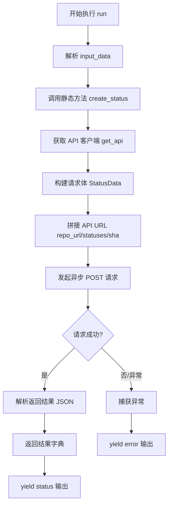
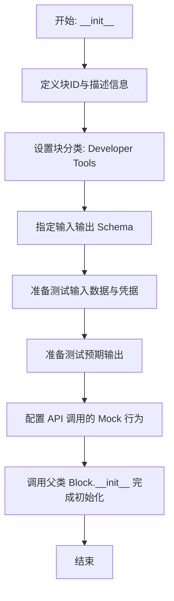
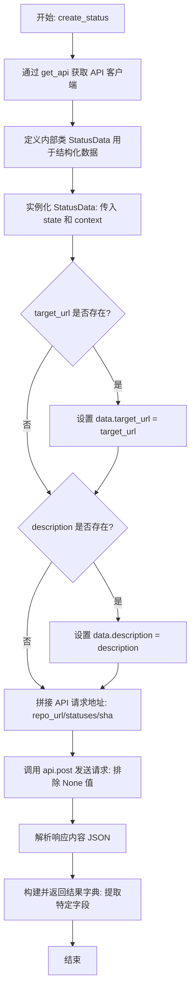
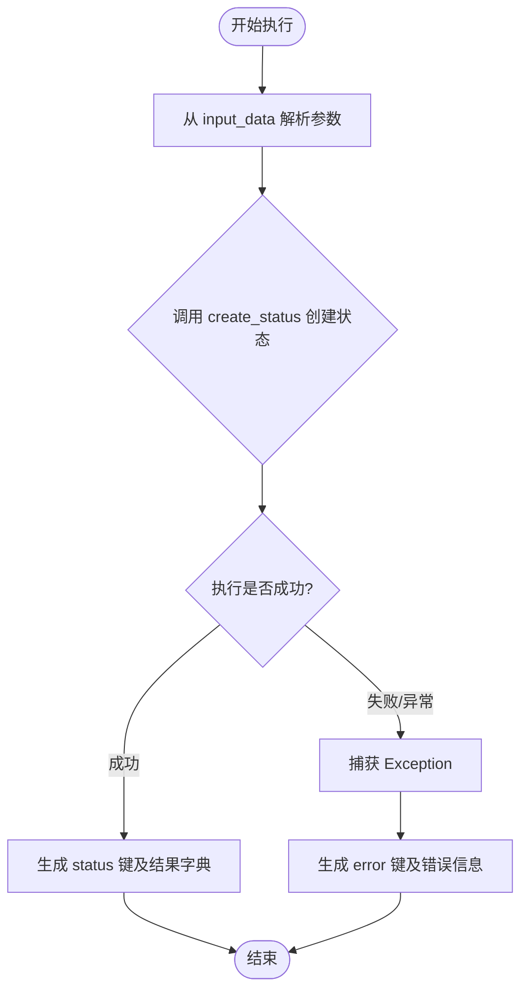

# `AutoGPT\autogpt_platform\backend\backend\blocks\github\statuses.py` 详细设计文档

该代码定义了一个名为 GithubCreateStatusBlock 的异步处理模块，核心功能是通过 GitHub API 为指定的仓库提交创建状态（如成功、失败、待定等）。它继承自 Block 基类，封装了输入输出 Schema 定义、认证凭证处理以及调用 GitHub API 的业务逻辑，支持在自动化流程中向 GitHub 反馈构建或检查状态。

## 整体流程



## 类结构

```
GithubCreateStatusBlock (Block)
├── Input (BlockSchemaInput)
├── Output (BlockSchemaOutput)
│   └── StatusResult (BaseModel)
StatusState (Enum)
```

## 全局变量及字段


### `get_api`
    
Function to retrieve the API client instance for making requests

类型：`function`
    


### `TEST_CREDENTIALS`
    
Test credentials object used for unit testing the block

类型：`GithubFineGrainedAPICredentials`
    


### `TEST_CREDENTIALS_INPUT`
    
Input dictionary representing test credentials for mock execution

类型：`dict`
    


### `GithubFineGrainedAPICredentials`
    
Data model for storing GitHub fine-grained API credentials

类型：`class`
    


### `GithubFineGrainedAPICredentialsField`
    
Helper function to define credential input fields with specific scopes

类型：`function`
    


### `GithubFineGrainedAPICredentialsInput`
    
Input schema type for GitHub fine-grained API credentials

类型：`type`
    


### `StatusState.ERROR`
    
Enum member representing an error state

类型：`StatusState`
    


### `StatusState.FAILURE`
    
Enum member representing a failure state

类型：`StatusState`
    


### `StatusState.PENDING`
    
Enum member representing a pending state

类型：`StatusState`
    


### `StatusState.SUCCESS`
    
Enum member representing a success state

类型：`StatusState`
    


### `GithubCreateStatusBlock.Input`
    
Inner class defining the input schema for the block

类型：`BlockSchemaInput`
    


### `GithubCreateStatusBlock.Output`
    
Inner class defining the output schema for the block

类型：`BlockSchemaOutput`
    


### `GithubCreateStatusBlock.Input.credentials`
    
GitHub API credentials for authentication

类型：`GithubFineGrainedAPICredentialsInput`
    


### `GithubCreateStatusBlock.Input.repo_url`
    
URL of the GitHub repository

类型：`str`
    


### `GithubCreateStatusBlock.Input.sha`
    
The SHA of the commit to set status for

类型：`str`
    


### `GithubCreateStatusBlock.Input.state`
    
The state of the status (error, failure, pending, success)

类型：`StatusState`
    


### `GithubCreateStatusBlock.Input.target_url`
    
URL with additional details about this status

类型：`Optional[str]`
    


### `GithubCreateStatusBlock.Input.description`
    
Short description of the status

类型：`Optional[str]`
    


### `GithubCreateStatusBlock.Input.check_name`
    
Label to differentiate this status from others

类型：`Optional[str]`
    


### `GithubCreateStatusBlock.Output.status`
    
Details of the created status

类型：`StatusResult`
    


### `GithubCreateStatusBlock.Output.StatusResult.id`
    
The unique ID of the status

类型：`int`
    


### `GithubCreateStatusBlock.Output.StatusResult.url`
    
The API URL of the status

类型：`str`
    


### `GithubCreateStatusBlock.Output.StatusResult.state`
    
The state of the status

类型：`str`
    


### `GithubCreateStatusBlock.Output.StatusResult.context`
    
The context label of the status

类型：`str`
    


### `GithubCreateStatusBlock.Output.StatusResult.description`
    
The description of the status

类型：`Optional[str]`
    


### `GithubCreateStatusBlock.Output.StatusResult.target_url`
    
The target URL associated with the status

类型：`Optional[str]`
    


### `GithubCreateStatusBlock.Output.StatusResult.created_at`
    
The timestamp when the status was created

类型：`str`
    


### `GithubCreateStatusBlock.Output.StatusResult.updated_at`
    
The timestamp when the status was last updated

类型：`str`
    
    

## 全局函数及方法


### `GithubCreateStatusBlock.create_status`

该静态方法负责构建并发送 GitHub Commit Status 请求。它通过 `get_api` 获取经过认证的 API 客户端，利用 Pydantic 模型验证和序列化请求数据，随后向 GitHub API 发送 POST 请求以创建或更新指定 commit 的状态，最后返回解析后的状态详情。

*注意：提供的代码中未包含 `get_api` 函数的定义（仅包含导入和使用），因此以下内容针对代码中实际包含核心逻辑的 `create_status` 方法进行详细设计文档输出。*

参数：

- `credentials`: `GithubFineGrainedAPICredentials`，包含用于认证 GitHub API 的 Fine-Grained Token 凭证。
- `repo_url`: `str`，GitHub 仓库的 URL（例如：https://github.com/owner/repo）。
- `sha`: `str`，需要设置状态的 Git 提交 SHA 值。
- `state`: `StatusState`，状态枚举值（error, failure, pending, success）。
- `target_url`: `Optional[str]`，关联的 URL 链接，通常用于指向 CI 构建日志等详情页面。
- `description`: `Optional[str]`，状态的简短描述文本。
- `context`: `str`，用于区分不同状态系统的标签（默认为 "default"）。

返回值：`dict`，包含创建成功的状态详情字典，包括 id, url, state, context, description, target_url, created_at, updated_at 等字段。

#### 流程图

```mermaid
flowchart TD
    A[开始执行 create_status] --> B[调用 get_api<br/>获取认证客户端]
    B --> C[实例化 StatusData 模型<br/>初始化 state 和 context]
    C --> D{target_url 是否存在?}
    D -- 是 --> E[设置 data.target_url]
    D -- 否 --> F[检查 description]
    E --> F{description 是否存在?}
    F -- 是 --> G[设置 data.description]
    F -- 否 --> H[准备发送请求]
    G --> H[构建 status_url<br/>f"{repo_url}/statuses/{sha}"]
    H --> I[调用 api.post 发送请求<br/>使用 model_dump_json 排除 None]
    I --> J[解析响应 response.json]
    J --> K[构造并返回结果字典]
    K --> L[结束]
```

#### 带注释源码

```python
    @staticmethod
    async def create_status(
        credentials: GithubFineGrainedAPICredentials,
        repo_url: str,
        sha: str,
        state: StatusState,
        target_url: Optional[str] = None,
        description: Optional[str] = None,
        context: str = "default",
    ) -> dict:
        # 1. 根据提供的凭证获取 GitHub API 客户端实例
        api = get_api(credentials)

        # 2. 定义内部 Pydantic 模型用于数据验证和序列化
        class StatusData(BaseModel):
            state: str
            target_url: Optional[str] = None
            description: Optional[str] = None
            context: str

        # 3. 初始化数据模型，填入必填字段
        # 使用 state.value 获取枚举的实际字符串值
        data = StatusData(
            state=state.value,
            context=context,
        )

        # 4. 条件性填入可选字段，避免在模型中出现 null 值（配合后续 exclude_none）
        if target_url:
            data.target_url = target_url

        if description:
            data.description = description

        # 5. 构建 API 端点 URL
        status_url = f"{repo_url}/statuses/{sha}"
        
        # 6. 发送异步 POST 请求
        # model_dump_json(exclude_none=True) 确保未设置的 Optional 字段不包含在 JSON 体中
        response = await api.post(
            status_url, data=data.model_dump_json(exclude_none=True)
        )
        
        # 7. 解析响应结果
        result = response.json()

        # 8. 提取并返回关键信息，确保输出结构符合预期
        return {
            "id": result["id"],
            "url": result["url"],
            "state": result["state"],
            "context": result["context"],
            "description": result.get("description"),
            "target_url": result.get("target_url"),
            "created_at": result["created_at"],
            "updated_at": result["updated_at"],
        }
```


### `GithubCreateStatusBlock.__init__`

该方法用于初始化 `GithubCreateStatusBlock` 类实例。它通过向父类 `Block` 传递预定义的元数据来配置块的基本属性，包括块的唯一标识符、功能描述、所属分类、输入输出架构以及用于测试和验证的模拟数据。

参数：

-   `self`：`GithubCreateStatusBlock`，类的实例对象本身。

返回值：`None`，无返回值。

#### 流程图



#### 带注释源码

```python
    def __init__(self):
        # 调用父类 Block 的初始化方法，注册块的元数据和配置
        super().__init__(
            # 块的唯一标识符 (UUID)
            id="3d67f123-a4b5-4c89-9d01-2e34f5c67890",  # Generated UUID
            # 块的功能描述，用于界面展示或文档说明
            description="Creates a new commit status in a GitHub repository",
            # 块所属的功能分类，这里归类为开发者工具
            categories={BlockCategory.DEVELOPER_TOOLS},
            # 定义块的输入数据结构 Schema
            input_schema=GithubCreateStatusBlock.Input,
            # 定义块的输出数据结构 Schema
            output_schema=GithubCreateStatusBlock.Output,
            # 定义用于测试的输入参数集
            test_input={
                "repo_url": "https://github.com/owner/repo",
                "sha": "ce587453ced02b1526dfb4cb910479d431683101",
                "state": StatusState.SUCCESS.value,
                "target_url": "https://example.com/build/status",
                "description": "The build succeeded!",
                "check_name": "continuous-integration/jenkins",
                "credentials": TEST_CREDENTIALS_INPUT,
            },
            # 定义用于测试的认证凭据对象
            test_credentials=TEST_CREDENTIALS,
            # 定义预期的测试输出结果，用于验证逻辑正确性
            test_output=[
                (
                    "status",
                    {
                        "id": 1234567890,
                        "url": "https://api.github.com/repos/owner/repo/statuses/ce587453ced02b1526dfb4cb910479d431683101",
                        "state": "success",
                        "context": "continuous-integration/jenkins",
                        "description": "The build succeeded!",
                        "target_url": "https://example.com/build/status",
                        "created_at": "2024-01-21T10:00:00Z",
                        "updated_at": "2024-01-21T10:00:00Z",
                    },
                ),
            ],
            # 定义测试时的 Mock 行为，模拟 'create_status' 方法的返回值，避免在测试中真实调用 API
            test_mock={
                "create_status": lambda *args, **kwargs: {
                    "id": 1234567890,
                    "url": "https://api.github.com/repos/owner/repo/statuses/ce587453ced02b1526dfb4cb910479d431683101",
                    "state": "success",
                    "context": "continuous-integration/jenkins",
                    "description": "The build succeeded!",
                    "target_url": "https://example.com/build/status",
                    "created_at": "2024-01-21T10:00:00Z",
                    "updated_at": "2024-01-21T10:00:00Z",
                }
            },
        )
```


### `GithubCreateStatusBlock.create_status`

该方法是一个静态异步方法，负责通过 GitHub API 向指定的仓库提交记录创建一个新的状态（Status）。它构造包含状态、上下文及可选描述和链接的数据载荷，发送 POST 请求，并将返回的 JSON 结果处理为标准字典格式。

参数：

- `credentials`：`GithubFineGrainedAPICredentials`，用于认证的 GitHub API 凭证对象。
- `repo_url`：`str`，GitHub 仓库的 URL 地址。
- `sha`：`str`，目标提交记录的 SHA 哈希值。
- `state`：`StatusState`，提交的状态枚举值（如 error, failure, pending, success）。
- `target_url`：`Optional[str]`，包含此状态详细信息的关联 URL，默认为 None。
- `description`：`Optional[str]`，状态的简短描述，默认为 None。
- `context`：`str`，用于区分不同来源状态的标签（如 CI 系统名称），默认为 "default"。

返回值：`dict`，包含已创建状态的详细信息字典，字段包括 id, url, state, context, description, target_url, created_at, updated_at。

#### 流程图



#### 带注释源码

```python
    @staticmethod
    async def create_status(
        credentials: GithubFineGrainedAPICredentials,
        repo_url: str,
        sha: str,
        state: StatusState,
        target_url: Optional[str] = None,
        description: Optional[str] = None,
        context: str = "default",
    ) -> dict:
        # 1. 根据提供的凭据获取 API 客户端实例
        api = get_api(credentials)

        # 2. 定义内部 Pydantic 模型，用于规范 POST 请求的数据结构
        class StatusData(BaseModel):
            state: str
            target_url: Optional[str] = None
            description: Optional[str] = None
            context: str

        # 3. 初始化数据模型，必填字段为 state 和 context
        data = StatusData(
            state=state.value,  # 获取枚举的实际值 (字符串)
            context=context,
        )

        # 4. 如果存在 target_url，则添加到数据中
        if target_url:
            data.target_url = target_url

        # 5. 如果存在 description，则添加到数据中
        if description:
            data.description = description

        # 6. 构造 GitHub API 的具体端点 URL
        status_url = f"{repo_url}/statuses/{sha}"
        
        # 7. 发送异步 POST 请求，将模型转换为 JSON 并排除值为 None 的字段
        response = await api.post(
            status_url, data=data.model_dump_json(exclude_none=True)
        )
        
        # 8. 解析响应的 JSON 数据
        result = response.json()

        # 9. 提取关键字段并返回为标准字典格式
        return {
            "id": result["id"],
            "url": result["url"],
            "state": result["state"],
            "context": result["context"],
            "description": result.get("description"),
            "target_url": result.get("target_url"),
            "created_at": result["created_at"],
            "updated_at": result["updated_at"],
        }
```


### `GithubCreateStatusBlock.run`

该方法是 `GithubCreateStatusBlock` 的核心执行入口，负责协调输入参数与凭证，通过调用内部辅助方法与 GitHub API 交互，以在指定的仓库提交上创建状态，并处理可能发生的异常。

参数：

- `input_data`：`GithubCreateStatusBlock.Input`，包含创建状态所需的所有输入信息，如仓库 URL、提交 SHA、状态类型、目标链接、描述及检查名称。
- `credentials`：`GithubFineGrainedAPICredentials`，用于身份验证的 GitHub API 凭证。
- `**kwargs`：`Any`，额外的关键字参数，用于扩展或兼容框架调用。

返回值：`BlockOutput`，一个异步生成器，产生包含执行结果（"status" 或 "error"）的元组。

#### 流程图



#### 带注释源码

```python
    async def run(
        self,
        input_data: Input,
        *,
        credentials: GithubFineGrainedAPICredentials,
        **kwargs,
    ) -> BlockOutput:
        try:
            # 调用静态方法 create_status 执行实际的 API 请求
            # 将 input_data 中的字段映射到 create_status 的参数中
            result = await self.create_status(
                credentials=credentials,
                repo_url=input_data.repo_url,
                sha=input_data.sha,
                state=input_data.state,
                target_url=input_data.target_url,
                description=input_data.description,
                # 使用 check_name 作为 context，如果为空则使用默认值 "AutoGPT Platform Checks"
                context=input_data.check_name or "AutoGPT Platform Checks",
            )
            # 成功执行后，产出名为 "status" 的结果
            yield "status", result
        except Exception as e:
            # 捕获任何异常，产出名为 "error" 的错误信息
            yield "error", str(e)
```


## 关键组件


### StatusState

定义 GitHub 提交状态的有效状态枚举，包括 error、failure、pending 和 success。

### GithubCreateStatusBlock

核心逻辑块类，继承自 Block，负责封装输入输出模式、管理认证凭据、执行测试逻辑并运行创建提交状态的主流程。

### Input Schema

基于 Pydantic 的输入模式，定义了创建状态所需的数据字段，包括凭证、仓库 URL、提交 SHA、状态值以及可选的目标 URL 和描述。

### Output Schema

基于 Pydantic 的输出模式，定义了 API 调用成功后返回的状态详情结构，包含状态 ID、URL、上下文、描述和时间戳等信息。

### API Integration

集成 GitHub API 的逻辑层，通过 `get_api` 获取客户端，构造请求 payload 并向 GitHub 端点发送 POST 请求以创建提交状态。


## 问题及建议


### 已知问题

-   **API URL 构造逻辑缺陷**：`create_status` 方法中通过简单的字符串拼接 `f"{repo_url}/statuses/{sha}"` 来构造请求 URL。输入示例中的 `repo_url` 是 Web 界面地址（如 `https://github.com/owner/repo`），而 GitHub Status API 需要调用 API 地址（如 `https://api.github.com/repos/owner/repo/statuses/{sha}`）。直接使用 Web URL 可能会导致 API 调用失败（除非底层的 `api` 客户端有特殊的 URL 转换逻辑，否则代码无法正常工作）。
-   **输出模式与实际产出不匹配**：在 `run` 方法的 `except` 块中，代码 yield 了一个名为 `"error"` 的键和错误信息。然而，在 `Output` 类（`BlockSchemaOutput`）中仅定义了 `status` 字段。这种不一致违反了 Schema 契约，可能导致下游消费者在解析输出时因缺少预期的 `status` 字段或遇到未定义的 `error` 字段而报错。
-   **硬编码的 UUID**：`__init__` 方法中硬编码了 Block 的 ID (`3d67f123-...`)。虽然在某些场景下可以接受，但这降低了代码的可移植性和灵活性，不利于实例管理或动态生成。

### 优化建议

-   **增强 URL 解析与构造逻辑**：不应直接拼接 `repo_url`。建议增加辅助逻辑，从用户输入的 `repo_url`（无论是 Web URL 还是 API URL）中解析出 `owner` 和 `repo` 名称，然后结合配置的 API 基础路径（`https://api.github.com`）显式构造正确的 API 端点，以确保 API 调用的健壮性。
-   **统一错误处理机制**：要么在 `Output` Schema 中显式定义 `error` 字段以匹配代码行为，要么遵循标准的错误处理流程（抛出异常或由框架捕获），而不是在产出流中 yield 一个未在 Schema 中声明的字段。
-   **使用 Pydantic 模型解析响应**：`create_status` 方法中手动构造返回字典（`return {"id": ..., ...}`）既冗长又容易出错。建议直接使用 `Output.StatusResult` 模型来验证和解析 API 返回的 JSON 数据，利用 Pydantic 的特性自动处理字段映射和类型转换。
-   **分离测试数据与初始化逻辑**：`__init__` 方法中包含了大量的测试输入、输出和 Mock 数据。建议将这些测试数据提取到单独的测试文件或配置常量中，以保持类定义的整洁和单一职责。
-   **移除冗余的默认值逻辑**：在 `Input` 类中 `check_name` 已有默认值 `"AutoGPT Platform Checks"`，而在 `run` 方法中再次使用 `input_data.check_name or "AutoGPT Platform Checks"` 进行判断是冗余的，可以简化为直接使用 `input_data.check_name`。


## 其它


### 设计目标与约束

本模块旨在提供一个可复用的组件（Block），用于通过 GitHub API 为特定的提交 SHA 创建或更新状态。主要设计目标包括：
1.  **自动化集成**：能够无缝集成到自动化工作流中（如 CI/CD 流水线），根据构建结果自动反馈状态到 GitHub。
2.  **异步执行**：基于 `async/await` 机制，确保在网络 I/O 操作时不阻塞主线程，提高并发效率。
3.  **类型安全**：利用 Pydantic 进行输入数据的强类型验证和序列化，减少运行时错误。

主要约束包括：
1.  **API 认证限制**：强制要求使用 GitHub Fine-grained Personal Access Token (PAT)，且必须具备 `repo:status` 权限。
2.  **外部依赖**：依赖 `backend._api.get_api` 提供的 HTTP 客户端，以及 GitHub API 的可用性和稳定性。
3.  **幂等性**：虽然 API 允许重复创建状态，但本逻辑不包含去重机制，每次调用都会生成一个新的状态记录。

### 错误处理与异常设计

代码采用了集中式的异常捕获策略，确保在发生错误时系统能够优雅降级并传递错误信息：

1.  **异常捕获范围**：在 `run` 方法中，`create_status` 的调用被包裹在 `try...except Exception as e` 块中。这意味着无论是网络超时、API 返回错误（如 401 Unauthorized, 404 Not Found）、还是数据解析错误，都会被捕获。
2.  **错误传播机制**：异常不会直接抛出导致程序崩溃，而是通过 `yield "error", str(e)` 生成一个名为 "error" 的输出。这符合 Block 的处理链路设计，允许下游 Block 根据错误信息进行分支处理或重试。
3.  **局限性**：当前实现将所有异常统一转换为字符串返回，丢失了异常的类型堆栈信息，可能不利于底层问题的调试（如区分是网络问题还是权限问题）。

### 数据流与状态机

**数据流**：
1.  **输入阶段**：外部调用者传入包含凭证、仓库 URL、Commit SHA 等信息的 `Input` 对象。Pydantic 模型自动验证数据格式。
2.  **转换阶段**：
    *   `GithubCreateStatusBlock.Input` 被解包。
    *   状态枚举 `StatusState` 被转换为其字符串值（如 "success"）。
    *   可选字段（如 `target_url`）被筛选并组装成符合 GitHub API 要求的 JSON 请求体 (`StatusData`)。
3.  **传输阶段**：通过 `get_api` 获取的客户端，向 ` {repo_url}/statuses/{sha}` 发送异步 POST 请求。
4.  **输出阶段**：API 返回的 JSON 响应被解析，关键字段被提取并重组为字典结构，最终通过 `yield "status", result` 输出。

**状态机**：
本组件本身是无状态的，但其驱动的 GitHub Commit Status 遵循以下有限状态机逻辑（由 GitHub API 定义）：
*   `PENDING` (待定)
*   `SUCCESS` (成功)
*   `FAILURE` (失败)
*   `ERROR` (错误)
组件允许将状态从任意当前状态强制更新为上述任意目标状态。

### 外部依赖与接口契约

1.  **GitHub REST API**
    *   **端点**：`POST /repos/{owner}/{repo}/statuses/{sha}`
    *   **契约**：
        *   **Request**：必须包含 `state`，可选包含 `target_url`, `description`, `context`。
        *   **Response**：返回 201 Created 及包含状态详情的 JSON 对象（id, url, state, context, description, created_at 等）。
    *   **依赖**：网络连通性及 GitHub API 服务可用性。

2.  **内部模块 `backend._api`**
    *   **函数**：`get_api(credentials: GithubFineGrainedAPICredentials)`
    *   **契约**：接收凭证对象，返回一个具有 `async post(url, data)` 方法的 API 客户端实例。该客户端需自动处理认证头注入。

3.  **内部模块 `backend.data.block`**
    *   **基类**：`Block`, `BlockInput`, `BlockOutput`
    *   **契约**：子类必须实现 `run` 方法并遵循特定的输入输出 Schema 定义。

4.  **Pydantic**
    *   **契约**：用于数据校验，确保输入的数据类型符合预期（如 `repo_url` 为字符串，`state` 为枚举值）。

### 安全性考虑

1.  **凭证管理**：
    *   使用 `GithubFineGrainedAPICredentialsField` 显式声明所需权限为 `repo:status`，遵循最小权限原则。
    *   凭证不直接硬编码在代码中，而是通过运行时注入（`credentials` 参数），并依赖测试环境下的 `TEST_CREDENTIALS` 进行隔离。
2.  **数据注入**：
    *   使用 Pydantic 的 `model_dump_json(exclude_none=True)` 生成请求体，避免了手动拼接字符串可能带来的注入风险。
    *   输入参数 `repo_url` 和 `sha` 直接用于构造 API URL，虽然 `sha` 格式受 Pydantic 限制（字符串），但在实际构造 URL 时假设输入是可信的或由上游系统验证过。
3.  **敏感信息泄露**：
    *   虽然 `credentials` 在日志或错误信息中未直接打印，但目前的异常处理 `str(e)` 可能会意外包含堆栈中的敏感上下文（取决于底层 HTTP 库的实现），建议在生产环境中对错误输出进行脱敏处理。


    